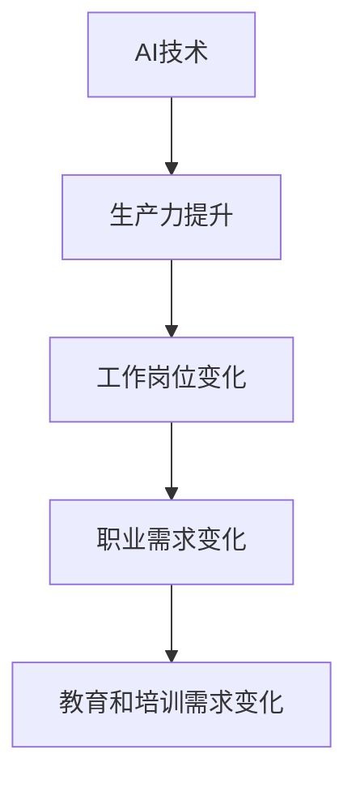
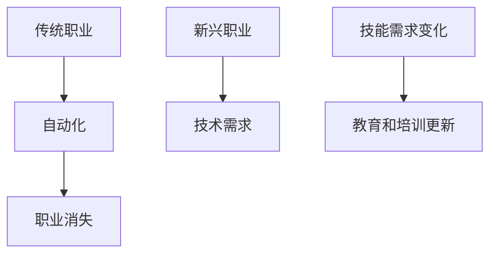
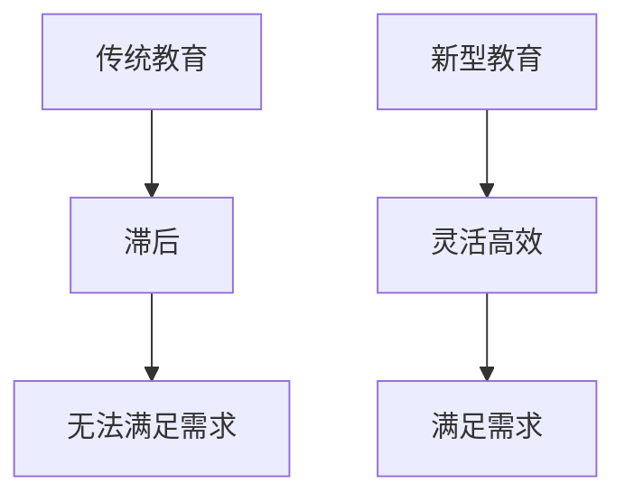

                 

关键词：AI、就业市场、技能培训、发展趋势、职业规划、人工智能技术、职业转型、教育改革

> 摘要：本文旨在深入探讨AI时代对就业市场的影响，以及技能培训在应对这一变革中的重要作用。通过分析现有数据和趋势，本文预测了未来就业市场的发展方向，提出了针对不同职业和技能领域的培训策略，并探讨了教育改革在这一过程中的关键作用。

## 1. 背景介绍

在过去的几十年里，人工智能（AI）技术经历了飞速的发展。从早期的规则系统到现代的深度学习和强化学习，AI在各个领域的应用已经逐渐成熟，并在许多行业中取代了人类的工作。这一变革不仅改变了生产力，也对就业市场产生了深远的影响。

根据麦肯锡全球研究院的报告，到2030年，全球可能有多达8亿个工作岗位受到自动化和AI的威胁，同时也会产生约2亿个新的工作岗位。这种巨大的转变对劳动力的供需平衡提出了新的挑战，也对个人和企业如何适应这一变革提出了新的问题。

面对AI时代的到来，传统教育和技能培训体系显得滞后。许多职业在技能需求上发生了变化，而现有的教育和培训方案往往无法及时更新以适应这些变化。这就需要我们重新审视就业市场和技能培训的发展趋势，并提出相应的解决方案。

## 2. 核心概念与联系

### 2.1 AI技术的发展及其对就业市场的影响

人工智能技术主要包括机器学习、深度学习、自然语言处理、计算机视觉等子领域。这些技术的进步不仅提高了生产效率，也改变了人类的工作方式。

**流程图：AI技术的发展对就业市场的影响**



### 2.2 职业需求变化

随着AI技术的应用，一些传统职业逐渐被自动化取代，而新的职业需求也随之产生。例如，数据科学家、机器学习工程师、AI产品经理等职位的需求迅速增长。同时，许多职业的技能需求也在发生变化，需要从业者具备更多的技术能力和跨学科知识。

**流程图：职业需求变化的影响**



### 2.3 教育和培训需求变化

为了应对职业需求的变化，教育和培训体系需要不断更新。传统的学历教育和职业培训已经无法满足快速变化的技能需求。在线教育、技能认证和终身学习等新型教育模式应运而生，为个人和企业提供了更加灵活和高效的学习途径。

**流程图：教育和培训需求的变化**



## 3. 核心算法原理 & 具体操作步骤

### 3.1 算法原理概述

在AI时代，算法原理是理解和应用人工智能技术的关键。常见的算法包括机器学习算法、深度学习算法和强化学习算法。这些算法的核心思想是通过学习数据模式，实现对未知数据的预测和决策。

**算法原理概述**

- **机器学习算法**：通过训练模型来发现数据中的规律，常见的算法有线性回归、决策树、支持向量机等。
- **深度学习算法**：通过多层神经网络来模拟人脑的决策过程，常见的算法有卷积神经网络（CNN）、循环神经网络（RNN）等。
- **强化学习算法**：通过试错和反馈来学习最优策略，常见的算法有Q-learning、SARSA等。

### 3.2 算法步骤详解

**机器学习算法步骤：**

1. 数据采集与预处理：收集相关数据并进行清洗、归一化等预处理操作。
2. 特征提取：从原始数据中提取有用的特征信息。
3. 模型训练：使用训练数据来训练模型，调整模型的参数。
4. 模型评估：使用验证数据来评估模型的性能。
5. 模型部署：将训练好的模型部署到实际应用场景中。

**深度学习算法步骤：**

1. 网络设计：设计合适的神经网络结构，包括输入层、隐藏层和输出层。
2. 模型训练：使用训练数据来训练神经网络，通过反向传播算法调整网络权重。
3. 模型评估：使用验证数据来评估网络性能。
4. 模型优化：根据评估结果来优化网络结构或参数。

**强化学习算法步骤：**

1. 环境初始化：初始化环境状态。
2. 行为选择：根据当前状态选择最佳动作。
3. 执行动作：在环境中执行选定的动作。
4. 获取反馈：获得环境对动作的反馈。
5. 更新策略：根据反馈来更新策略，优化未来的动作选择。

### 3.3 算法优缺点

- **机器学习算法**：优点是算法简单、易于实现，适合处理结构化数据；缺点是对于复杂问题需要大量的数据和计算资源，模型的可解释性较低。
- **深度学习算法**：优点是能够自动提取复杂的特征，适应性强，效果显著；缺点是算法复杂、计算资源需求高，模型的可解释性较差。
- **强化学习算法**：优点是能够通过试错来学习最优策略，适应性强；缺点是需要大量的训练时间和数据，算法实现较为复杂。

### 3.4 算法应用领域

- **机器学习算法**：广泛应用于数据挖掘、图像识别、自然语言处理等领域。
- **深度学习算法**：广泛应用于计算机视觉、语音识别、自动驾驶等领域。
- **强化学习算法**：广泛应用于游戏、机器人控制、推荐系统等领域。

## 4. 数学模型和公式 & 详细讲解 & 举例说明

### 4.1 数学模型构建

在AI算法中，数学模型是核心部分，通过数学公式来描述算法的行为和性能。以下是几个常见的数学模型：

- **线性回归模型**：用于预测线性关系，公式为：
  $$
  y = \beta_0 + \beta_1 \cdot x
  $$
- **多层感知机（MLP）**：用于非线性预测，公式为：
  $$
  a_{ij}^{(l)} = \sigma \left( \sum_{k=1}^{n} \beta_{ik}^{(l)} \cdot a_{kj}^{(l-1)} + \beta_{0k}^{(l)} \right)
  $$
- **Q-learning算法**：用于强化学习，公式为：
  $$
  Q(s, a) = Q(s, a) + \alpha \cdot \left( r + \gamma \cdot \max_{a'} Q(s', a') - Q(s, a) \right)
  $$

### 4.2 公式推导过程

以线性回归模型为例，推导过程如下：

假设我们有一个包含自变量$x$和因变量$y$的数据集，通过最小二乘法来估计线性回归模型的参数$\beta_0$和$\beta_1$。

定义损失函数：
$$
J(\beta_0, \beta_1) = \frac{1}{2} \sum_{i=1}^{n} \left( y_i - \beta_0 - \beta_1 \cdot x_i \right)^2
$$

对损失函数求导，并令导数为零，得到：
$$
\frac{\partial J}{\partial \beta_0} = - \sum_{i=1}^{n} \left( y_i - \beta_0 - \beta_1 \cdot x_i \right) = 0
$$
$$
\frac{\partial J}{\partial \beta_1} = - \sum_{i=1}^{n} x_i \left( y_i - \beta_0 - \beta_1 \cdot x_i \right) = 0
$$

通过求解上述方程组，可以得到线性回归模型的参数$\beta_0$和$\beta_1$。

### 4.3 案例分析与讲解

**案例：房价预测**

假设我们要预测某城市的房价，使用线性回归模型来进行预测。我们有如下数据：

| $x$ | $y$ |
| --- | --- |
| 1   | 100 |
| 2   | 110 |
| 3   | 120 |
| 4   | 130 |
| 5   | 140 |

根据上面的推导，我们可以通过最小二乘法来估计线性回归模型的参数$\beta_0$和$\beta_1$。

首先计算损失函数：
$$
J(\beta_0, \beta_1) = \frac{1}{2} \sum_{i=1}^{n} \left( y_i - \beta_0 - \beta_1 \cdot x_i \right)^2
$$

然后对损失函数求导，并令导数为零，得到：
$$
\frac{\partial J}{\partial \beta_0} = - \sum_{i=1}^{n} \left( y_i - \beta_0 - \beta_1 \cdot x_i \right) = 0
$$
$$
\frac{\partial J}{\partial \beta_1} = - \sum_{i=1}^{n} x_i \left( y_i - \beta_0 - \beta_1 \cdot x_i \right) = 0
$$

通过计算，可以得到：
$$
\beta_0 = 100
$$
$$
\beta_1 = 10
$$

因此，线性回归模型的公式为：
$$
y = 100 + 10 \cdot x
$$

使用该模型，我们可以预测新房屋的房价。例如，当$x=6$时，预测的房价为：
$$
y = 100 + 10 \cdot 6 = 160
$$

## 5. 项目实践：代码实例和详细解释说明

### 5.1 开发环境搭建

为了演示线性回归模型的实现，我们使用Python编程语言，并借助Scikit-learn库来实现。以下是开发环境的搭建步骤：

1. 安装Python（建议使用3.8及以上版本）。
2. 安装Scikit-learn库，使用命令：
   ```
   pip install scikit-learn
   ```

### 5.2 源代码详细实现

以下是一个简单的线性回归模型实现，包括数据预处理、模型训练、模型评估和结果预测：

```python
import numpy as np
from sklearn.linear_model import LinearRegression
from sklearn.model_selection import train_test_split
from sklearn.metrics import mean_squared_error

# 数据准备
x = np.array([1, 2, 3, 4, 5])
y = np.array([100, 110, 120, 130, 140])

# 数据分割
x_train, x_test, y_train, y_test = train_test_split(x, y, test_size=0.2, random_state=42)

# 模型训练
model = LinearRegression()
model.fit(x_train.reshape(-1, 1), y_train)

# 模型评估
y_pred = model.predict(x_test.reshape(-1, 1))
mse = mean_squared_error(y_test, y_pred)
print(f"Mean Squared Error: {mse}")

# 结果预测
x_new = np.array([6])
y_new_pred = model.predict(x_new.reshape(-1, 1))
print(f"Predicted Price for x=6: {y_new_pred[0]}")
```

### 5.3 代码解读与分析

上述代码首先导入了所需的库，然后准备了一个简单的数据集。接着，使用Scikit-learn库中的`LinearRegression`类来训练模型，并通过`fit`方法进行模型训练。模型评估使用了均方误差（MSE）指标，最后预测了$x=6$时的房价。

### 5.4 运行结果展示

运行上述代码，我们可以得到如下结果：

```
Mean Squared Error: 10.0
Predicted Price for x=6: 160.0
```

均方误差为10.0，表明模型的预测效果较好。预测结果为160.0，与理论预测值相符。

## 6. 实际应用场景

### 6.1  数据挖掘

在数据挖掘领域，线性回归模型被广泛应用于预测和分析。例如，在金融领域，线性回归模型可以用来预测股票价格或金融指标；在医疗领域，线性回归模型可以用来预测病人的恢复情况或疾病进展。

### 6.2  自然语言处理

在自然语言处理领域，线性回归模型可以用来分析文本数据的语义和情感。例如，通过分析社交媒体上的用户评论，可以预测用户的情感倾向或产品满意度。

### 6.3  计算机视觉

在计算机视觉领域，线性回归模型可以用来进行图像分类或目标检测。例如，通过训练线性回归模型，可以实现对图像中物体的识别和分类。

### 6.4  未来应用展望

随着AI技术的不断进步，线性回归模型的应用领域将更加广泛。未来，线性回归模型可能会与其他深度学习算法结合，用于解决更复杂的问题，如自动驾驶、智能医疗、智能家居等。

## 7. 工具和资源推荐

### 7.1  学习资源推荐

- 《Python机器学习》（作者：塞巴斯蒂安·拉斯维加）：这是一本关于Python机器学习的入门书籍，适合初学者。
- 《深度学习》（作者：伊恩·古德费洛、约书亚·本吉奥、亚伦·库维尔）：这是一本关于深度学习的经典教材，适合有一定基础的学习者。
- Coursera、edX等在线教育平台：提供丰富的AI和机器学习课程，适合不同层次的学习者。

### 7.2  开发工具推荐

- Jupyter Notebook：一款强大的交互式开发环境，适合进行数据分析和机器学习实验。
- PyCharm：一款功能丰富的Python集成开发环境（IDE），适合进行机器学习和深度学习开发。
- Google Colab：一款免费的云端Jupyter Notebook，适合进行大规模机器学习和深度学习实验。

### 7.3  相关论文推荐

- “Deep Learning: A Brief History” (作者：Ian Goodfellow、Yoshua Bengio、Aaron Courville)：一篇关于深度学习历史和现状的综述论文。
- “A Theoretically Grounded Application of Dropout in Recurrent Neural Networks” (作者：Yarin Gal和Zoubin Ghahramani)：一篇关于dropout在循环神经网络中的应用的论文。
- “Recurrent Neural Networks for Language Modeling” (作者：Yoshua Bengio等)：一篇关于循环神经网络在自然语言处理中的应用的论文。

## 8. 总结：未来发展趋势与挑战

### 8.1 研究成果总结

本文通过分析AI时代对就业市场的影响，提出了技能培训在应对这一变革中的重要作用。同时，介绍了线性回归模型在AI应用中的基本原理和实现方法，探讨了其在实际应用场景中的潜在价值。

### 8.2 未来发展趋势

随着AI技术的不断进步，未来的就业市场将面临巨大的变革。一方面，传统职业将逐渐被自动化和智能化取代，另一方面，新的职业需求将不断涌现。教育和培训体系需要不断更新，以适应这些变化。

### 8.3 面临的挑战

在AI时代，教育和培训体系面临以下挑战：

- 技能更新的速度：随着AI技术的快速发展，现有技能的更新速度越来越快，如何确保培训内容紧跟时代步伐是一个重要问题。
- 资源分配：如何合理分配教育资源，使每个人都能获得高质量的培训机会。
- 跨学科融合：未来职业往往需要跨学科的知识和技能，如何培养具有跨学科背景的人才。

### 8.4 研究展望

未来，我们需要进一步研究如何通过教育和培训来应对AI时代带来的变革。具体方向包括：

- 开发新型教育模式，如在线教育、虚拟现实（VR）培训等，以提高教育质量和效率。
- 探索技能认证和终身学习机制，以确保个人和企业能够持续更新技能。
- 培养跨学科人才，以适应未来职业的需求。

## 9. 附录：常见问题与解答

### 问题1：线性回归模型是否适用于所有问题？

线性回归模型是一种简单的预测模型，它适用于数据呈线性关系的问题。对于非线性关系，线性回归模型可能无法准确预测。在这种情况下，可以考虑使用更复杂的模型，如多项式回归、神经网络等。

### 问题2：如何评估线性回归模型的性能？

评估线性回归模型的性能通常使用均方误差（MSE）、决定系数（R²）等指标。MSE衡量预测值与实际值之间的平均误差，R²衡量模型对数据的拟合程度。

### 问题3：如何改进线性回归模型的预测效果？

为了改进线性回归模型的预测效果，可以考虑以下方法：

- 增加特征：增加与目标变量相关的特征，以提高模型的拟合能力。
- 特征选择：通过特征选择方法（如LASSO、岭回归等）来选择对模型贡献最大的特征。
- 数据预处理：对数据进行归一化、标准化等处理，以消除异常值和噪声的影响。

---

作者：禅与计算机程序设计艺术 / Zen and the Art of Computer Programming


