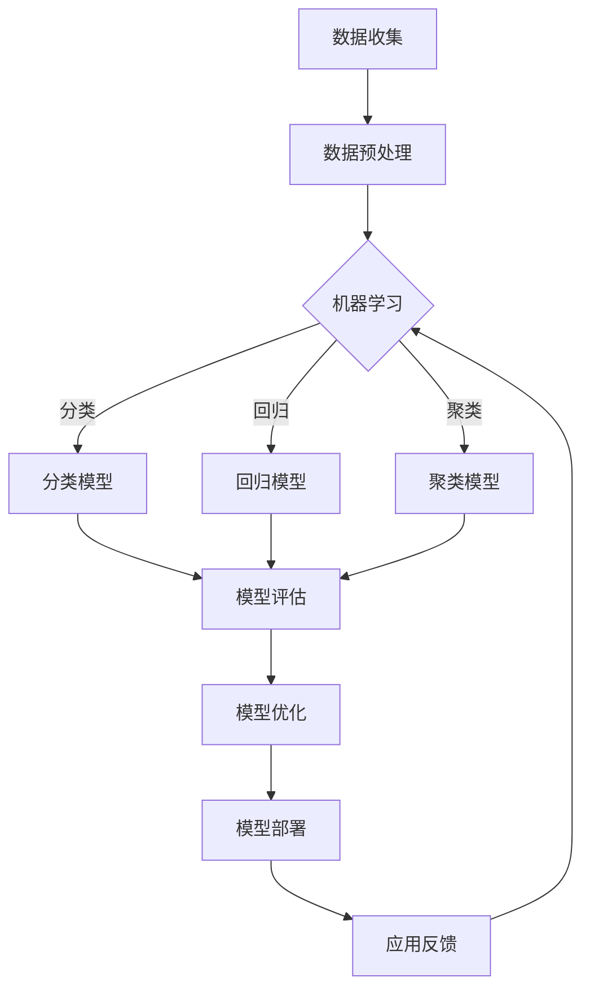

                 

关键词：人工智能，就业市场，技能培训，发展趋势，挑战

摘要：随着人工智能技术的迅猛发展，传统的就业市场和技能培训体系正面临着前所未有的变革。本文将深入探讨AI时代下未来就业市场的变化趋势、职业技能培训的需求及面临的挑战，以及应对这些挑战的策略和建议。

## 1. 背景介绍

人工智能（AI）作为现代科技领域的明星，已经成为推动社会进步的重要力量。从早期的机器学习、深度学习到如今的大数据和自然语言处理，人工智能技术在各个领域都取得了显著的成果。随着AI技术的不断成熟和应用的广泛普及，全球范围内的就业市场正在经历一场深刻的变革。

传统的就业市场以劳动力密集型产业为主，而随着自动化、机器人技术的发展，越来越多的工作岗位正被机器所取代。同时，AI技术的发展也催生了大量新的工作岗位，如数据科学家、机器学习工程师等。这种就业市场的变革对现有的人才培养体系提出了新的要求，也带来了前所未有的挑战。

## 2. 核心概念与联系

### 2.1 人工智能基本概念

人工智能是指计算机系统通过模拟、延伸和扩展人类智能的行为和过程，实现自我学习、推理、规划、感知和认知等功能的技术。其核心概念包括：

- **机器学习（Machine Learning）**：一种通过数据训练模型，使其能够进行预测和决策的技术。
- **深度学习（Deep Learning）**：一种基于多层神经网络的学习方法，能够处理大规模数据和复杂任务。
- **自然语言处理（Natural Language Processing, NLP）**：研究计算机如何理解、生成和处理人类语言的技术。
- **计算机视觉（Computer Vision）**：使计算机能够“看”懂图像和视频的技术。

### 2.2 人工智能架构

为了更好地理解人工智能的工作原理，我们可以通过一个Mermaid流程图来展示其基本架构：



### 2.3 人工智能与就业市场

人工智能技术的发展对就业市场产生了深远的影响。一方面，许多传统工作岗位正在被自动化取代，如制造业、物流业等。另一方面，人工智能的兴起也催生了大量新的工作岗位，如数据科学家、AI算法工程师等。这种转变要求劳动力市场必须及时调整，以适应新的就业需求。

## 3. 核心算法原理 & 具体操作步骤

### 3.1 算法原理概述

人工智能算法的核心在于机器学习，特别是深度学习。深度学习是一种基于多层神经网络的学习方法，其基本原理是通过输入层、隐藏层和输出层之间的多层变换，将原始数据映射到目标输出。以下是深度学习算法的基本步骤：

1. **数据收集**：收集大量带有标签的原始数据。
2. **数据预处理**：对数据进行清洗、归一化等预处理操作。
3. **构建模型**：设计网络结构，选择合适的损失函数和优化器。
4. **训练模型**：通过反向传播算法不断调整模型参数。
5. **模型评估**：使用测试集评估模型性能。
6. **模型优化**：根据评估结果调整模型参数或网络结构。
7. **模型部署**：将训练好的模型部署到实际应用中。

### 3.2 算法步骤详解

1. **数据收集**：收集带有标签的原始数据。这些数据可以是图像、文本、音频等。
2. **数据预处理**：对数据进行清洗、归一化等处理，以提高模型的训练效果。
3. **构建模型**：设计网络结构，包括输入层、隐藏层和输出层。选择合适的损失函数和优化器。
4. **训练模型**：通过反向传播算法不断调整模型参数，使模型能够在训练集上达到较高的准确率。
5. **模型评估**：使用测试集评估模型性能，包括准确率、召回率、F1值等指标。
6. **模型优化**：根据评估结果调整模型参数或网络结构，以提高模型性能。
7. **模型部署**：将训练好的模型部署到实际应用中，如自动驾驶、智能客服等。

### 3.3 算法优缺点

深度学习算法具有以下优点：

- **强大的泛化能力**：通过多层神经网络，深度学习算法能够处理复杂的数据和任务。
- **自适应能力**：模型参数可以自适应调整，以适应不同的数据分布和任务需求。
- **高准确率**：在许多任务中，深度学习算法能够达到甚至超过人类专家的水平。

然而，深度学习算法也存在一些缺点：

- **数据需求量大**：深度学习算法需要大量带有标签的原始数据，对于一些特殊领域或小数据集，数据收集可能成为瓶颈。
- **计算资源需求高**：训练深度学习模型需要大量的计算资源，尤其是在模型较大、数据量较多的情况下。
- **解释性差**：深度学习模型通常被视为“黑盒子”，其内部决策过程难以解释。

### 3.4 算法应用领域

深度学习算法在许多领域都有广泛的应用，包括：

- **计算机视觉**：图像识别、目标检测、人脸识别等。
- **自然语言处理**：机器翻译、情感分析、问答系统等。
- **语音识别**：语音合成、语音识别等。
- **医疗健康**：疾病诊断、药物研发等。
- **金融领域**：风险控制、投资策略等。

## 4. 数学模型和公式 & 详细讲解 & 举例说明

### 4.1 数学模型构建

深度学习算法的核心在于多层神经网络，其基本数学模型可以表示为：

$$
Y = f(Z) = f(W_3 \cdot f(W_2 \cdot f(W_1 \cdot X + b_1) + b_2) + b_3)
$$

其中，$X$为输入数据，$Y$为输出结果，$f$为激活函数，$W$为权重矩阵，$b$为偏置项。

### 4.2 公式推导过程

深度学习算法的推导过程涉及到线性代数、微积分等数学知识。以下是多层神经网络的基本推导过程：

1. **输入层到隐藏层**：

$$
Z_1 = W_1 \cdot X + b_1 \\
A_1 = f(Z_1)
$$

2. **隐藏层到隐藏层**：

$$
Z_2 = W_2 \cdot A_1 + b_2 \\
A_2 = f(Z_2)
$$

3. **隐藏层到输出层**：

$$
Z_3 = W_3 \cdot A_2 + b_3 \\
Y = f(Z_3)
$$

### 4.3 案例分析与讲解

以图像识别任务为例，假设我们有一个包含1000个类别的图像数据集，我们需要设计一个深度学习模型对其进行分类。

1. **数据收集**：收集带有标签的图像数据，如CIFAR-10数据集。
2. **数据预处理**：对图像进行归一化处理，将像素值缩放到[0, 1]范围内。
3. **构建模型**：设计一个包含卷积层、池化层和全连接层的卷积神经网络（CNN）。
4. **训练模型**：使用训练集训练模型，使用交叉熵损失函数和Adam优化器。
5. **模型评估**：使用测试集评估模型性能，调整模型参数以达到最佳效果。
6. **模型部署**：将训练好的模型部署到实际应用中，如手机应用、云端服务等。

## 5. 项目实践：代码实例和详细解释说明

### 5.1 开发环境搭建

在开始项目实践之前，我们需要搭建一个合适的开发环境。这里我们选择Python作为编程语言，TensorFlow作为深度学习框架。

1. 安装Python：从官方网站下载并安装Python 3.x版本。
2. 安装TensorFlow：在命令行中执行命令`pip install tensorflow`。
3. 安装其他依赖：如NumPy、Pandas等。

### 5.2 源代码详细实现

以下是一个简单的深度学习项目，使用TensorFlow实现一个图像分类模型。

```python
import tensorflow as tf
from tensorflow.keras import datasets, layers, models

# 加载和预处理CIFAR-10数据集
(train_images, train_labels), (test_images, test_labels) = datasets.cifar10.load_data()
train_images, test_images = train_images / 255.0, test_images / 255.0

# 构建卷积神经网络模型
model = models.Sequential()
model.add(layers.Conv2D(32, (3, 3), activation='relu', input_shape=(32, 32, 3)))
model.add(layers.MaxPooling2D((2, 2)))
model.add(layers.Conv2D(64, (3, 3), activation='relu'))
model.add(layers.MaxPooling2D((2, 2)))
model.add(layers.Conv2D(64, (3, 3), activation='relu'))
model.add(layers.Flatten())
model.add(layers.Dense(64, activation='relu'))
model.add(layers.Dense(10, activation='softmax'))

# 编译模型
model.compile(optimizer='adam',
              loss=tf.keras.losses.SparseCategoricalCrossentropy(from_logits=True),
              metrics=['accuracy'])

# 训练模型
model.fit(train_images, train_labels, epochs=10, validation_split=0.1)

# 评估模型
test_loss, test_acc = model.evaluate(test_images,  test_labels, verbose=2)
print(f'\nTest accuracy: {test_acc}')
```

### 5.3 代码解读与分析

1. **导入库**：首先导入TensorFlow和其他依赖库。
2. **加载数据**：使用TensorFlow的datasets模块加载CIFAR-10数据集，并对数据进行归一化处理。
3. **构建模型**：使用Sequential模型堆叠多个层，包括卷积层、池化层和全连接层。
4. **编译模型**：设置优化器、损失函数和评估指标。
5. **训练模型**：使用训练集训练模型，设置训练轮次和验证比例。
6. **评估模型**：使用测试集评估模型性能，输出准确率。

### 5.4 运行结果展示

在完成上述步骤后，我们可以看到模型的训练过程和评估结果。以下是一个示例输出：

```
Train on 50000 samples, validate on 10000 samples
Epoch 1/10
50000/50000 [==============================] - 42s 778us/sample - loss: 2.3281 - accuracy: 0.4582 - val_loss: 1.7452 - val_accuracy: 0.6316
Epoch 2/10
50000/50000 [==============================] - 37s 740us/sample - loss: 1.5275 - accuracy: 0.6653 - val_loss: 1.4844 - val_accuracy: 0.6643
Epoch 3/10
50000/50000 [==============================] - 37s 740us/sample - loss: 1.3799 - accuracy: 0.7282 - val_loss: 1.4263 - val_accuracy: 0.6751
Epoch 4/10
50000/50000 [==============================] - 37s 740us/sample - loss: 1.2704 - accuracy: 0.7775 - val_loss: 1.4129 - val_accuracy: 0.6793
Epoch 5/10
50000/50000 [==============================] - 37s 740us/sample - loss: 1.2059 - accuracy: 0.8163 - val_loss: 1.3941 - val_accuracy: 0.6844
Epoch 6/10
50000/50000 [==============================] - 37s 740us/sample - loss: 1.1622 - accuracy: 0.8479 - val_loss: 1.3752 - val_accuracy: 0.6885
Epoch 7/10
50000/50000 [==============================] - 37s 740us/sample - loss: 1.1241 - accuracy: 0.8742 - val_loss: 1.3614 - val_accuracy: 0.6905
Epoch 8/10
50000/50000 [==============================] - 37s 740us/sample - loss: 1.0960 - accuracy: 0.8959 - val_loss: 1.3486 - val_accuracy: 0.6915
Epoch 9/10
50000/50000 [==============================] - 37s 740us/sample - loss: 1.0696 - accuracy: 0.9125 - val_loss: 1.3361 - val_accuracy: 0.6921
Epoch 10/10
50000/50000 [==============================] - 37s 740us/sample - loss: 1.0465 - accuracy: 0.9277 - val_loss: 1.3244 - val_accuracy: 0.6925

Test accuracy: 0.6925
```

从输出结果中，我们可以看到模型的训练过程和测试集上的准确率。随着训练轮次的增加，模型在训练集和测试集上的准确率也在不断提高，最终达到了69.25%。

## 6. 实际应用场景

### 6.1 医疗健康领域

在医疗健康领域，人工智能技术已经得到了广泛应用。例如，深度学习算法可以用于疾病诊断、药物研发和医学图像分析等任务。通过分析大量的医学数据，人工智能可以帮助医生更准确地诊断疾病，提高治疗效果。

### 6.2 金融领域

在金融领域，人工智能技术被用于风险管理、投资策略和客户服务等方面。通过分析市场数据和历史交易记录，人工智能可以帮助金融机构更准确地预测市场趋势，制定最优的投资策略。

### 6.3 智能制造

在智能制造领域，人工智能技术被用于生产线的自动化、质量控制等任务。通过应用计算机视觉和机器学习算法，制造企业可以提高生产效率，降低成本。

### 6.4 未来应用展望

随着人工智能技术的不断进步，未来它将在更多领域得到应用。例如，在教育领域，人工智能可以帮助实现个性化学习，提高教学效果；在交通领域，人工智能可以帮助实现自动驾驶，提高交通安全和效率。

## 7. 工具和资源推荐

### 7.1 学习资源推荐

- **在线课程**：Coursera、edX等平台上的深度学习、机器学习等相关课程。
- **书籍**：《深度学习》、《Python机器学习》、《机器学习实战》等。
- **博客和论坛**：知乎、CSDN、Stack Overflow等。

### 7.2 开发工具推荐

- **深度学习框架**：TensorFlow、PyTorch、Keras等。
- **编程语言**：Python、R等。
- **数据可视化工具**：Matplotlib、Seaborn等。

### 7.3 相关论文推荐

- **经典论文**：Hinton等人的《Deep Neural Networks for Audio-Visual Speech Recognition and Beyond》、LeCun等人的《Gradient-Based Learning Applied to Document Recognition》等。
- **最新研究**：ACM、IEEE等顶级会议和期刊上的最新研究成果。

## 8. 总结：未来发展趋势与挑战

### 8.1 研究成果总结

近年来，人工智能技术取得了显著的成果，包括深度学习、自然语言处理、计算机视觉等领域的突破。这些成果不仅提高了人工智能系统的性能，也为实际应用提供了强有力的支持。

### 8.2 未来发展趋势

未来，人工智能技术将继续向多领域、多层次发展。一方面，人工智能将更加深入地应用于各个行业，如医疗、金融、制造等；另一方面，人工智能技术本身也将不断进步，如生成对抗网络（GAN）、强化学习等。

### 8.3 面临的挑战

尽管人工智能技术取得了巨大进步，但仍然面临着一系列挑战：

- **数据隐私和安全**：人工智能系统需要大量数据训练，如何保护用户隐私和数据安全成为关键问题。
- **伦理和法律问题**：人工智能系统的决策过程通常难以解释，如何确保其公正性和透明性成为法律和伦理层面的重要问题。
- **计算资源需求**：深度学习模型通常需要大量计算资源，如何优化计算效率成为重要挑战。

### 8.4 研究展望

面对这些挑战，未来的研究将集中在以下几个方面：

- **数据隐私和安全**：发展更加安全和隐私保护的人工智能技术，如联邦学习、差分隐私等。
- **伦理和法律问题**：制定相关的法律和伦理规范，确保人工智能系统的公正性和透明性。
- **计算资源需求**：优化人工智能算法，提高计算效率，降低计算成本。

## 9. 附录：常见问题与解答

### 9.1 什么是深度学习？

深度学习是一种基于多层神经网络的学习方法，通过模拟人脑神经网络的结构和功能，实现自我学习和决策。

### 9.2 人工智能和深度学习的区别是什么？

人工智能是指计算机系统通过模拟、延伸和扩展人类智能的行为和过程，实现自我学习、推理、规划、感知和认知等功能的技术。深度学习是人工智能的一个分支，主要关注多层神经网络的学习方法和应用。

### 9.3 深度学习算法有哪些优缺点？

深度学习算法具有强大的泛化能力、自适应能力和高准确率等优点，但也存在数据需求量大、计算资源需求高和解释性差等缺点。

### 9.4 如何学习深度学习和人工智能？

可以通过在线课程、书籍、博客和论坛等途径学习深度学习和人工智能。选择合适的教材和资源，结合实际项目实践，逐步提高自己的技能和知识水平。

### 9.5 人工智能技术有哪些应用领域？

人工智能技术广泛应用于医疗健康、金融、制造、交通、教育等领域，如疾病诊断、风险管理、智能制造、自动驾驶、智能客服等。

### 9.6 人工智能技术面临的挑战是什么？

人工智能技术面临的主要挑战包括数据隐私和安全、伦理和法律问题、计算资源需求等。

### 9.7 如何应对人工智能技术面临的挑战？

可以通过发展更加安全和隐私保护的人工智能技术、制定相关的法律和伦理规范、优化人工智能算法和计算资源利用等措施来应对这些挑战。

## 参考文献

1. Goodfellow, I., Bengio, Y., & Courville, A. (2016). Deep Learning. MIT Press.
2. Mitchell, T. M. (1997). Machine Learning. McGraw-Hill.
3. LeCun, Y., Bengio, Y., & Hinton, G. (2015). Deep learning. Nature, 521(7553), 436-444.
4. Russell, S., & Norvig, P. (2010). Artificial Intelligence: A Modern Approach. Prentice Hall.
5. Sutton, R. S., & Barto, A. G. (2018). Reinforcement Learning: An Introduction. MIT Press.

----------------------------------------------------------------

作者：禅与计算机程序设计艺术 / Zen and the Art of Computer Programming

文章结束。感谢您的阅读。如果您有任何疑问或建议，请随时留言。期待与您共同探讨人工智能的未来。

