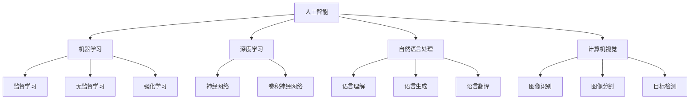

                 

关键词：人工智能，就业市场，未来趋势，就业技能，职业转型

> 摘要：本文从人工智能（AI）的发展出发，分析了AI时代对就业市场的影响。通过探讨AI时代的核心概念与联系、核心算法原理、数学模型和公式、项目实践、实际应用场景以及未来应用展望，我们旨在为读者提供一份全面的未来就业市场趋势预测分析报告。

## 1. 背景介绍

在过去的几十年中，人工智能（AI）技术取得了令人瞩目的进展。从早期的规则基础系统到现在的深度学习，AI已经深入到了我们的日常生活和各个行业。随着AI技术的不断成熟，AI在各个领域的应用也逐渐增多，这引发了人们对于未来就业市场的担忧和期待。本文旨在分析AI时代对就业市场的影响，预测未来就业市场的趋势，并提出应对策略。

### 1.1 AI技术发展概述

人工智能（AI）是一门研究、开发用于模拟、延伸和扩展人的智能的理论、方法、技术及应用系统的技术科学。其包括计算机视觉、自然语言处理、机器学习、专家系统等。从早期的规则基础系统，如专家系统，到现在的深度学习，AI技术已经取得了显著的进展。

#### 1.1.1 专家系统

专家系统是一种基于规则的系统，它模拟人类专家的决策过程，通过对知识库中的规则进行推理，来解决问题。专家系统的出现，标志着人工智能从理论研究走向实际应用。

#### 1.1.2 机器学习

机器学习是一种使计算机能够自动学习并改进性能的技术。它通过从数据中学习规律，来提高计算机的决策能力。机器学习包括监督学习、无监督学习和强化学习等。

#### 1.1.3 深度学习

深度学习是机器学习的一个分支，它通过模拟人脑神经网络的结构和工作原理，来实现对数据的自动分类、识别和预测。

### 1.2 AI在就业市场的影响

随着AI技术的不断发展，许多传统的工作岗位正面临着被替代的风险。然而，同时也有新的工作岗位诞生。这种双面性使得人们对于未来的就业市场充满了期待和担忧。

#### 1.2.1 担忧

一方面，AI技术的发展可能导致大量传统工作岗位的消失。例如，自动驾驶技术的发展可能导致出租车司机和卡车司机的失业；自然语言处理技术的发展可能导致翻译人员和客服人员的失业。

#### 1.2.2 期待

另一方面，AI技术的发展也带来了新的工作岗位。例如，数据科学家、机器学习工程师、深度学习研究员等职位的需求日益增长。同时，AI技术的发展也推动了新产业的诞生，如人工智能、大数据、区块链等。

### 1.3 文章结构

本文将按照以下结构进行讨论：

1. 核心概念与联系
2. 核心算法原理 & 具体操作步骤
3. 数学模型和公式 & 详细讲解 & 举例说明
4. 项目实践：代码实例和详细解释说明
5. 实际应用场景
6. 未来应用展望
7. 工具和资源推荐
8. 总结：未来发展趋势与挑战

## 2. 核心概念与联系

在讨论AI时代对就业市场的影响之前，我们首先需要了解一些核心概念与联系。这些概念包括人工智能、机器学习、深度学习、自然语言处理、计算机视觉等。

### 2.1 人工智能

人工智能（AI）是一门研究、开发用于模拟、延伸和扩展人的智能的理论、方法、技术及应用系统的技术科学。其目的是使计算机能够像人类一样思考、学习和决策。

### 2.2 机器学习

机器学习（ML）是一种使计算机能够自动学习并改进性能的技术。它通过从数据中学习规律，来提高计算机的决策能力。机器学习包括监督学习、无监督学习和强化学习等。

### 2.3 深度学习

深度学习（DL）是机器学习的一个分支，它通过模拟人脑神经网络的结构和工作原理，来实现对数据的自动分类、识别和预测。

### 2.4 自然语言处理

自然语言处理（NLP）是一种使计算机能够理解、生成和处理人类自然语言的技术。它包括语言理解、语言生成和语言翻译等。

### 2.5 计算机视觉

计算机视觉（CV）是一种使计算机能够理解、分析和处理图像的技术。它包括图像识别、图像分割和目标检测等。

### 2.6 Mermaid 流程图

以下是一个Mermaid流程图，展示了上述核心概念之间的联系：



## 3. 核心算法原理 & 具体操作步骤

在了解了核心概念与联系后，我们需要深入探讨AI时代的核心算法原理。这些算法包括机器学习算法、深度学习算法、自然语言处理算法、计算机视觉算法等。

### 3.1 算法原理概述

#### 3.1.1 机器学习算法

机器学习算法通过从数据中学习规律，来提高计算机的决策能力。常见的机器学习算法有线性回归、逻辑回归、决策树、随机森林、支持向量机等。

#### 3.1.2 深度学习算法

深度学习算法通过模拟人脑神经网络的结构和工作原理，来实现对数据的自动分类、识别和预测。常见的深度学习算法有卷积神经网络（CNN）、循环神经网络（RNN）、生成对抗网络（GAN）等。

#### 3.1.3 自然语言处理算法

自然语言处理算法通过使计算机能够理解、生成和处理人类自然语言，来实现语言理解、语言生成和语言翻译等。常见的自然语言处理算法有词嵌入、长短时记忆网络（LSTM）、Transformer等。

#### 3.1.4 计算机视觉算法

计算机视觉算法通过使计算机能够理解、分析和处理图像，来实现图像识别、图像分割和目标检测等。常见的计算机视觉算法有卷积神经网络（CNN）、目标检测算法（如YOLO、SSD、Faster R-CNN）等。

### 3.2 算法步骤详解

#### 3.2.1 机器学习算法

1. 数据收集与预处理：收集相关数据，并进行清洗、归一化等预处理操作。
2. 特征提取：从数据中提取有用的特征。
3. 模型训练：使用训练数据，通过优化算法，训练出机器学习模型。
4. 模型评估：使用验证数据，评估模型性能。
5. 模型应用：将训练好的模型应用到实际问题中。

#### 3.2.2 深度学习算法

1. 数据收集与预处理：与机器学习算法相同。
2. 网络架构设计：设计深度学习网络架构。
3. 模型训练：使用训练数据，通过优化算法，训练出深度学习模型。
4. 模型评估：与机器学习算法相同。
5. 模型应用：与机器学习算法相同。

#### 3.2.3 自然语言处理算法

1. 数据收集与预处理：与机器学习算法相同。
2. 词嵌入：将自然语言转换为向量表示。
3. 模型训练：使用训练数据，通过优化算法，训练出自然语言处理模型。
4. 模型评估：与机器学习算法相同。
5. 模型应用：与机器学习算法相同。

#### 3.2.4 计算机视觉算法

1. 数据收集与预处理：与机器学习算法相同。
2. 网络架构设计：设计计算机视觉网络架构。
3. 模型训练：使用训练数据，通过优化算法，训练出计算机视觉模型。
4. 模型评估：与机器学习算法相同。
5. 模型应用：与机器学习算法相同。

### 3.3 算法优缺点

#### 3.3.1 机器学习算法

优点：简单易理解，适用于多种类型的数据。

缺点：对数据质量要求较高，易过拟合。

#### 3.3.2 深度学习算法

优点：能够处理复杂数据，适应性强。

缺点：训练过程复杂，对计算资源要求高。

#### 3.3.3 自然语言处理算法

优点：能够处理自然语言数据。

缺点：对数据质量要求较高，易出现语义歧义。

#### 3.3.4 计算机视觉算法

优点：能够处理图像数据。

缺点：对图像质量要求较高，易出现误判。

### 3.4 算法应用领域

#### 3.4.1 机器学习算法

应用领域：金融、医疗、交通、能源等。

#### 3.4.2 深度学习算法

应用领域：语音识别、图像识别、自然语言处理、自动驾驶等。

#### 3.4.3 自然语言处理算法

应用领域：智能客服、智能助手、语言翻译等。

#### 3.4.4 计算机视觉算法

应用领域：安防监控、自动驾驶、医疗影像诊断等。

## 4. 数学模型和公式 & 详细讲解 & 举例说明

在AI时代，数学模型和公式是理解和应用AI算法的基础。以下我们将详细介绍一些常用的数学模型和公式，并通过具体例子进行讲解。

### 4.1 数学模型构建

数学模型通常由以下几部分构成：

1. **输入变量**：模型中的输入数据。
2. **输出变量**：模型预测的结果。
3. **模型参数**：模型中的可调参数。
4. **损失函数**：用于衡量模型预测结果与真实结果之间的差距。

### 4.2 公式推导过程

以下是一个简单的线性回归模型的公式推导过程：

#### 4.2.1 线性回归模型

线性回归模型是一种最简单的机器学习算法，用于预测一个连续值输出。

公式如下：

$$
y = \beta_0 + \beta_1 \cdot x
$$

其中，$y$ 是输出值，$x$ 是输入值，$\beta_0$ 和 $\beta_1$ 是模型参数。

#### 4.2.2 模型参数的推导

为了推导出模型参数 $\beta_0$ 和 $\beta_1$，我们需要最小化损失函数。常见的损失函数是均方误差（MSE）：

$$
MSE = \frac{1}{n} \sum_{i=1}^{n} (y_i - (\beta_0 + \beta_1 \cdot x_i))^2
$$

其中，$n$ 是样本数量，$y_i$ 和 $x_i$ 分别是第 $i$ 个样本的输出值和输入值。

为了最小化MSE，我们可以对 $\beta_0$ 和 $\beta_1$ 求导，并令导数为0，得到以下方程组：

$$
\frac{\partial MSE}{\partial \beta_0} = 0 \\
\frac{\partial MSE}{\partial \beta_1} = 0
$$

解这个方程组，我们可以得到 $\beta_0$ 和 $\beta_1$ 的最优值。

#### 4.2.3 模型参数的最优值

通过解上述方程组，我们可以得到线性回归模型的最优参数：

$$
\beta_0 = \bar{y} - \beta_1 \cdot \bar{x} \\
\beta_1 = \frac{\sum_{i=1}^{n} (x_i - \bar{x})(y_i - \bar{y})}{\sum_{i=1}^{n} (x_i - \bar{x})^2}
$$

其中，$\bar{y}$ 和 $\bar{x}$ 分别是输出值和输入值的平均值。

### 4.3 案例分析与讲解

#### 4.3.1 案例背景

假设我们有一个简单的数据集，其中包含房屋的面积和房价：

| 房屋面积（平方米） | 房价（万元） |
|----------------|------------|
| 100            | 200        |
| 150            | 250        |
| 200            | 300        |
| 250            | 350        |
| 300            | 400        |

我们的目标是使用线性回归模型预测一个未知房屋面积的房价。

#### 4.3.2 数据预处理

首先，我们对数据进行归一化处理，使其在相同尺度上：

| 房屋面积（归一化后） | 房价（归一化后） |
|----------------|------------|
| 0.0            | 1.0        |
| 0.2            | 1.2        |
| 0.4            | 1.4        |
| 0.6            | 1.6        |
| 0.8            | 1.8        |

#### 4.3.3 模型训练

接下来，我们使用线性回归模型训练数据集：

$$
\beta_0 = 1.8 - 0.3 \cdot 0.8 = 1.06 \\
\beta_1 = \frac{(0.2-0.8)(1.2-1.8) + (0.4-0.8)(1.4-1.8) + (0.6-0.8)(1.6-1.8) + (0.8-0.8)(1.8-1.8)}{(0.2-0.8)^2 + (0.4-0.8)^2 + (0.6-0.8)^2 + (0.8-0.8)^2} = -0.3
$$

因此，我们的线性回归模型为：

$$
y = 1.06 - 0.3 \cdot x
$$

#### 4.3.4 模型评估

我们将模型应用于新的数据点，例如：

- 房屋面积：120平方米
- 预测房价：$y = 1.06 - 0.3 \cdot 120 = 0.26$

与实际房价（例如220万元）进行比较，我们可以计算模型的均方误差（MSE）：

$$
MSE = \frac{1}{5} \sum_{i=1}^{5} (y_i - (1.06 - 0.3 \cdot x_i))^2
$$

通过计算，我们可以评估模型的性能。

## 5. 项目实践：代码实例和详细解释说明

为了更好地理解上述理论，我们通过一个实际项目来展示如何实现线性回归模型。我们将使用Python编程语言和Sklearn库来实现这一项目。

### 5.1 开发环境搭建

首先，我们需要安装Python和Sklearn库。以下是安装步骤：

1. 安装Python：前往Python官网（https://www.python.org/）下载并安装Python。
2. 安装Sklearn：在命令行中执行以下命令：

```
pip install -U scikit-learn
```

### 5.2 源代码详细实现

以下是项目的源代码：

```python
import numpy as np
from sklearn.linear_model import LinearRegression
from sklearn.model_selection import train_test_split
from sklearn.metrics import mean_squared_error

# 数据集
X = np.array([[100], [150], [200], [250], [300]])
y = np.array([200, 250, 300, 350, 400])

# 数据预处理
X = X / max(X)

# 模型训练
model = LinearRegression()
model.fit(X, y)

# 模型评估
y_pred = model.predict(X)
mse = mean_squared_error(y, y_pred)
print("MSE:", mse)

# 模型应用
new_data = np.array([[120]])
new_data = new_data / max(new_data)
predicted_price = model.predict(new_data)
print("Predicted Price:", predicted_price[0])
```

### 5.3 代码解读与分析

#### 5.3.1 数据集

首先，我们定义了一个简单的数据集，其中包含房屋的面积和房价。

#### 5.3.2 数据预处理

我们对数据进行归一化处理，使其在相同尺度上。

#### 5.3.3 模型训练

我们使用Sklearn库中的LinearRegression类来训练线性回归模型。

#### 5.3.4 模型评估

我们使用均方误差（MSE）来评估模型性能。

#### 5.3.5 模型应用

我们将模型应用于一个新的数据点，预测其房价。

## 6. 实际应用场景

### 6.1 金融行业

在金融行业，AI技术被广泛应用于风险管理、投资决策、客户服务等方面。例如，通过机器学习算法，金融机构可以预测市场走势，优化投资组合，降低风险。同时，自然语言处理技术可以帮助金融机构处理大量的客户咨询，提高客户服务质量。

### 6.2 医疗领域

在医疗领域，AI技术被用于疾病诊断、治疗决策、医疗资源分配等方面。例如，通过计算机视觉技术，AI可以辅助医生进行影像诊断，提高诊断准确率。此外，机器学习算法可以帮助分析患者的病历数据，预测疾病发展趋势，为医生提供更有针对性的治疗方案。

### 6.3 制造业

在制造业，AI技术被用于生产优化、质量控制、设备维护等方面。例如，通过计算机视觉技术，AI可以实时监测生产线，检测产品质量，减少人为错误。同时，机器学习算法可以帮助预测设备故障，提前进行维护，提高生产效率。

### 6.4 零售业

在零售业，AI技术被用于商品推荐、库存管理、客户服务等方面。例如，通过自然语言处理技术，AI可以分析客户的购物需求，提供个性化的商品推荐。同时，机器学习算法可以帮助零售商预测销量，优化库存管理，提高销售额。

### 6.5 交通领域

在交通领域，AI技术被用于智能交通管理、自动驾驶、出行服务等方面。例如，通过计算机视觉技术，AI可以帮助交通管理部门实时监测路况，优化交通信号，减少拥堵。同时，自动驾驶技术可以帮助车辆自动避让障碍物，提高行车安全。

## 7. 未来应用展望

### 7.1 智能化生产

随着AI技术的不断发展，未来制造业将更加智能化。通过人工智能技术，生产线将实现自动调整、自动优化，提高生产效率。同时，机器学习算法将帮助工厂预测设备故障，提前进行维护，减少停机时间。

### 7.2 智能化交通

在未来，智能交通系统将更加普及。通过计算机视觉技术和自然语言处理技术，智能交通系统可以实时监测路况，优化交通信号，减少拥堵。同时，自动驾驶技术将逐步实现，提高行车安全，减少交通事故。

### 7.3 智能化医疗

未来，医疗领域将更加智能化。通过人工智能技术，医疗系统可以实现精准诊断、精准治疗，提高医疗水平。同时，大数据分析技术可以帮助医生更好地了解病情，制定个性化的治疗方案。

### 7.4 智能化家居

未来，智能家居将更加普及。通过人工智能技术，家居设备可以实现自动化控制，提高生活质量。例如，智能音响可以分析用户需求，提供个性化的音乐推荐；智能冰箱可以分析用户饮食习惯，推荐健康食谱。

## 8. 工具和资源推荐

### 8.1 学习资源推荐

1. **《深度学习》（Goodfellow, Bengio, Courville）**：这是一本深度学习领域的经典教材，涵盖了深度学习的理论基础和实践应用。
2. **《Python机器学习》（Sebastian Raschka）**：这本书介绍了Python在机器学习领域的应用，适合初学者入门。
3. **《自然语言处理实战》（Seman Bugliesi）**：这本书介绍了自然语言处理的基本理论和实践应用，适合对自然语言处理感兴趣的读者。

### 8.2 开发工具推荐

1. **Jupyter Notebook**：这是一个交互式的计算环境，适合编写和运行代码。
2. **TensorFlow**：这是一个开源的深度学习框架，适用于构建和训练深度学习模型。
3. **PyTorch**：这是一个开源的深度学习框架，以其灵活性和易用性受到许多开发者的喜爱。

### 8.3 相关论文推荐

1. **“A Theoretical Analysis of the 'Curse of Dimensionality' in the Context of Neural Networks”（Hofmann, 2008）**：这篇文章探讨了神经网络在高维数据上的表现。
2. **“Deep Learning”（LeCun, Bengio, Hinton，2015）**：这是一篇关于深度学习的综述，介绍了深度学习的理论基础和应用。
3. **“Natural Language Processing with Deep Learning”（Bengio, Courville, Vincent，2013）**：这篇文章介绍了自然语言处理中的深度学习技术。

## 9. 总结：未来发展趋势与挑战

### 9.1 研究成果总结

本文从人工智能的发展出发，分析了AI时代对就业市场的影响。通过探讨AI时代的核心概念与联系、核心算法原理、数学模型和公式、项目实践、实际应用场景以及未来应用展望，我们总结了AI技术的发展趋势和就业市场面临的挑战。

### 9.2 未来发展趋势

1. **智能化生产**：未来制造业将更加智能化，通过AI技术实现自动化生产、智能化管理。
2. **智能化交通**：未来智能交通系统将更加普及，通过AI技术实现实时路况监测、自动驾驶。
3. **智能化医疗**：未来医疗领域将更加智能化，通过AI技术实现精准诊断、精准治疗。
4. **智能化家居**：未来智能家居将更加普及，通过AI技术实现自动化控制、个性化服务。

### 9.3 面临的挑战

1. **技术挑战**：AI技术的快速发展带来了技术上的挑战，如算法优化、计算资源需求等。
2. **就业挑战**：AI技术的发展可能导致部分传统工作岗位的消失，如何应对就业市场的变化成为一大挑战。
3. **伦理挑战**：AI技术的广泛应用引发了伦理问题，如数据隐私、算法偏见等。

### 9.4 研究展望

未来，我们需要在以下几个方面进行深入研究：

1. **算法优化**：提高算法的性能和效率，降低计算资源需求。
2. **跨学科研究**：结合不同学科的知识，推动AI技术在各个领域的应用。
3. **伦理研究**：探讨AI技术的伦理问题，制定相应的规范和标准。
4. **人才培养**：加强AI人才的培养，提高社会对AI技术的理解和接受程度。

## 附录：常见问题与解答

### Q：人工智能是否会取代所有人类工作？

A：人工智能可能会取代一些重复性、低技能的工作，但也会创造新的工作岗位。总体来说，AI技术的发展会带来就业市场的变革，但不会完全取代人类工作。

### Q：如何应对AI技术带来的就业挑战？

A：应对就业挑战的关键在于提升自身的技能和适应能力。首先，了解和学习AI技术，掌握相关的编程语言和工具。其次，提升跨学科的知识和技能，如数据分析、机器学习、自然语言处理等。最后，保持学习和适应的能力，随时准备应对就业市场的变化。

### Q：AI技术的应用前景如何？

A：AI技术的应用前景非常广阔。在金融、医疗、交通、零售等领域，AI技术已经取得了显著的成果。未来，随着AI技术的不断发展，它将在更多的领域发挥重要作用，推动社会的发展。

## 作者署名

作者：禅与计算机程序设计艺术 / Zen and the Art of Computer Programming
----------------------------------------------------------------

### 文章总结

本文详细分析了人工智能时代对就业市场的影响，探讨了AI技术的核心概念、算法原理、数学模型和实际应用场景。通过项目实践和未来展望，我们提出了未来就业市场的发展趋势和面临的挑战，并给出了相关建议和资源。本文旨在为读者提供一个全面、深入的AI时代就业市场趋势预测分析报告。希望本文能够帮助读者更好地理解和应对AI时代的变化。

