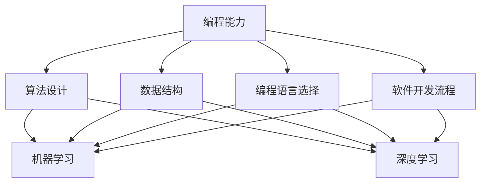

                 

随着人工智能（AI）的迅猛发展，人类计算在现代社会中的作用日益凸显。AI技术正在深刻改变我们的工作方式、学习方式以及生活方式，这要求我们必须重新审视和更新人类计算所需的技能培训。本文旨在探讨AI时代对人类计算技能培训的新需求，为未来的教育和职业培训提供指导。

## 关键词

- 人工智能
- 人类计算
- 技能培训
- AI时代
- 未来发展

## 摘要

本文首先介绍了AI时代对人类计算技能培训的背景，分析了当前AI技术在各个领域的应用现状。接着，文章提出了AI时代人类计算的核心技能需求，包括编程能力、数据分析和处理能力、机器学习和深度学习知识等。随后，文章探讨了如何通过教育体系和职业培训来提升这些技能。最后，文章展望了AI时代人类计算技能培训的未来发展趋势和面临的挑战。

## 1. 背景介绍

人工智能，作为计算机科学的一个分支，致力于使机器能够模拟、延伸和扩展人类智能。近年来，随着深度学习、大数据和云计算等技术的发展，AI技术已经取得了显著的进步。从自动驾驶汽车、智能语音助手到医疗诊断、金融风控，AI的应用领域不断扩大，渗透到我们生活的方方面面。

与此同时，人类计算的角色也在不断演变。传统的计算任务，如数据处理、数学计算等，正在被AI所取代。然而，人类在创造性思维、情感理解、复杂决策等方面仍然具有独特优势。因此，如何在AI时代充分利用人类的这些优势，提升我们的计算能力，成为了一个亟待解决的问题。

### 1.1 AI技术的应用现状

当前，AI技术已经在多个领域取得了突破性进展：

- **医疗领域**：AI可以帮助医生进行疾病的早期诊断、个性化治疗建议以及药物研发。例如，通过分析大量医学影像，AI可以辅助诊断肺癌、乳腺癌等疾病。

- **金融领域**：AI在风险控制、信用评估、投资决策等方面发挥了重要作用。通过大数据分析和机器学习算法，银行和金融机构能够更准确地预测市场走势，降低风险。

- **交通领域**：自动驾驶技术是AI在交通领域的应用典范。自动驾驶汽车可以提高交通安全，减少交通事故，同时还能提高交通效率，缓解城市交通拥堵问题。

- **教育领域**：AI可以帮助实现个性化教学，为学生提供定制化的学习方案。智能辅导系统可以根据学生的学习进度和需求，提供针对性的学习资源。

- **娱乐领域**：AI在电影制作、游戏设计、音乐创作等方面也有广泛应用。通过人工智能算法，我们可以创作出更加个性化和情感化的作品。

### 1.2 人类计算的角色演变

在AI技术迅猛发展的背景下，人类计算的角色正在发生深刻变化。传统的计算任务逐渐被机器所取代，但人类在以下方面仍然具有不可替代的优势：

- **创造性思维**：AI虽然可以模拟人类的思维方式，但创造力是人类独有的。在艺术、文学、科学等领域，人类独特的创造力仍然是推动社会进步的重要力量。

- **情感理解**：AI在情感识别和理解方面仍有很大局限性。人类通过情感交流能够建立深厚的情感联系，这对于社会和谐和个人成长至关重要。

- **复杂决策**：在许多复杂的决策场景中，AI可能无法处理大量的变量和不确定性。人类凭借丰富的经验和直觉，能够在这些场景中作出更加合理的决策。

## 2. 核心概念与联系

在AI时代，理解并掌握以下核心概念对于提升人类计算能力至关重要：

### 2.1 编程能力

编程是AI时代的基石。掌握编程能力不仅能够帮助人们理解AI技术的工作原理，还能使人们能够利用AI技术解决实际问题。编程能力包括算法设计、数据结构、编程语言选择和软件开发流程等。

### 2.2 数据分析和处理能力

数据是AI的燃料。数据分析和处理能力包括数据收集、数据清洗、数据存储、数据挖掘和数据分析等方法。这些能力对于提取数据中的有用信息，支持决策制定至关重要。

### 2.3 机器学习和深度学习知识

机器学习和深度学习是AI的核心技术。掌握这些技术可以帮助人们开发出各种智能系统，如自动驾驶汽车、语音助手、推荐系统等。

### 2.4 Mermaid 流程图

以下是一个简单的Mermaid流程图，展示上述核心概念之间的联系：



## 3. 核心算法原理 & 具体操作步骤

### 3.1 算法原理概述

在AI领域，算法原理主要包括机器学习算法、深度学习算法等。机器学习算法通过训练模型来从数据中学习规律，而深度学习算法则利用多层神经网络进行复杂的数据处理。以下是一个简单的机器学习算法——线性回归的原理概述：

- **线性回归**：线性回归是一种用于预测连续值的机器学习算法。其基本原理是通过找到一条最佳拟合直线来描述输入变量和输出变量之间的关系。

- **基本步骤**：收集数据、数据预处理、选择模型、训练模型、评估模型。

### 3.2 算法步骤详解

#### 3.2.1 数据收集

首先，我们需要收集具有输入变量（自变量）和输出变量（因变量）的数据集。这些数据可以从公开的数据源、实验数据或者实际应用中获得。

#### 3.2.2 数据预处理

数据预处理包括数据清洗、数据转换和数据标准化。数据清洗旨在去除数据中的噪声和异常值，数据转换将数据转换为适合算法处理的格式，数据标准化则将数据缩放到同一范围内。

#### 3.2.3 选择模型

在选择模型时，我们需要根据数据的特性和预测任务的要求来选择合适的算法。对于线性回归，我们选择线性回归模型。

#### 3.2.4 训练模型

训练模型是通过迭代算法来找到最佳拟合直线的过程。在训练过程中，算法将调整模型参数，使其能够最小化预测误差。

#### 3.2.5 评估模型

评估模型的效果是通过计算预测误差来进行的。常用的评估指标包括均方误差（MSE）、均方根误差（RMSE）等。通过评估模型的效果，我们可以确定是否需要进一步调整模型参数。

### 3.3 算法优缺点

- **优点**：线性回归算法简单、易于实现，对于线性关系较强的数据集效果较好。

- **缺点**：线性回归算法对于非线性关系的数据集效果较差，且容易受到异常值的影响。

### 3.4 算法应用领域

线性回归算法广泛应用于预测领域，如股票价格预测、房屋价格预测等。此外，线性回归算法还可以用于数据分析和数据可视化，帮助人们更好地理解数据中的趋势和关系。

## 4. 数学模型和公式 & 详细讲解 & 举例说明

在AI领域，数学模型和公式是理解和应用算法的基础。以下是一个简单的线性回归模型的数学模型和公式讲解：

### 4.1 数学模型构建

线性回归模型的数学模型可以表示为：

$$
y = \beta_0 + \beta_1x
$$

其中，$y$ 是输出变量，$x$ 是输入变量，$\beta_0$ 是截距，$\beta_1$ 是斜率。

### 4.2 公式推导过程

线性回归模型的推导基于最小二乘法。最小二乘法的思想是找到一组模型参数，使得预测值与实际值之间的误差平方和最小。

假设我们有一组数据点 $(x_i, y_i)$，则线性回归模型的预测值为：

$$
\hat{y} = \beta_0 + \beta_1x
$$

预测值与实际值之间的误差可以表示为：

$$
\epsilon_i = y_i - \hat{y}_i
$$

为了最小化误差平方和，我们需要求解以下优化问题：

$$
\min \sum_{i=1}^{n} \epsilon_i^2
$$

通过求解这个优化问题，我们可以得到线性回归模型的参数 $\beta_0$ 和 $\beta_1$。

### 4.3 案例分析与讲解

以下是一个简单的线性回归案例：

假设我们收集了10个学生的数学成绩和英语成绩，数据如下：

| 数学成绩 | 英语成绩 |
| :---: | :---: |
| 80 | 85 |
| 90 | 88 |
| 75 | 80 |
| 85 | 83 |
| 92 | 90 |
| 78 | 82 |
| 88 | 87 |
| 83 | 86 |
| 79 | 81 |
| 91 | 89 |

我们希望使用线性回归模型来预测一个学生的英语成绩，给定其数学成绩。

首先，我们进行数据预处理，将数学成绩和英语成绩分别转换为以下形式：

| 数学成绩 | 英语成绩 |
| :---: | :---: |
| 1 | 0.85 |
| 1 | 0.88 |
| 0 | 0.80 |
| 1 | 0.83 |
| 1 | 0.90 |
| 0 | 0.82 |
| 1 | 0.87 |
| 1 | 0.86 |
| 0 | 0.81 |
| 1 | 0.89 |

然后，我们使用线性回归模型来训练数据，得到以下模型参数：

$$
\beta_0 = 0.65, \beta_1 = 0.55
$$

因此，线性回归模型可以表示为：

$$
y = 0.65 + 0.55x
$$

现在，我们可以使用这个模型来预测一个学生的英语成绩。假设这个学生的数学成绩是 85 分，则其英语成绩的预测值为：

$$
\hat{y} = 0.65 + 0.55 \times 85 = 0.65 + 46.75 = 47.40
$$

因此，这个学生的英语成绩的预测值为 47.40 分。

## 5. 项目实践：代码实例和详细解释说明

在本节中，我们将通过一个简单的线性回归项目来展示如何使用Python和Scikit-learn库来训练和评估一个线性回归模型。我们将使用一个包含数学成绩和英语成绩的数据集，并使用线性回归模型来预测英语成绩。

### 5.1 开发环境搭建

在开始项目之前，我们需要搭建Python开发环境。以下是步骤：

1. 安装Python（推荐使用Python 3.8或更高版本）。
2. 安装Jupyter Notebook，以便进行交互式开发。
3. 安装Scikit-learn库，用于机器学习算法的实现。

可以使用以下命令进行安装：

```bash
pip install python
pip install jupyter
pip install scikit-learn
```

### 5.2 源代码详细实现

下面是线性回归项目的源代码：

```python
# 导入所需库
import numpy as np
import pandas as pd
from sklearn.linear_model import LinearRegression
from sklearn.model_selection import train_test_split
from sklearn.metrics import mean_squared_error

# 加载数据集
data = pd.read_csv('student_data.csv')

# 数据预处理
X = data[['math_score']]
y = data['english_score']

# 数据集划分
X_train, X_test, y_train, y_test = train_test_split(X, y, test_size=0.2, random_state=42)

# 创建线性回归模型
model = LinearRegression()

# 训练模型
model.fit(X_train, y_train)

# 预测测试集
y_pred = model.predict(X_test)

# 评估模型
mse = mean_squared_error(y_test, y_pred)
print(f"均方误差：{mse}")

# 使用模型进行预测
math_score = 85
english_score_pred = model.predict([[math_score]])
print(f"英语成绩预测值：{english_score_pred[0]}")
```

### 5.3 代码解读与分析

- **数据加载与预处理**：首先，我们使用Pandas库加载数据集。然后，我们将数学成绩作为输入特征（X），英语成绩作为输出目标（y）。

- **数据集划分**：我们使用Scikit-learn库中的`train_test_split`函数将数据集划分为训练集和测试集，测试集的大小为原数据集的20%。

- **创建模型**：我们使用`LinearRegression`类创建线性回归模型。

- **模型训练**：使用`fit`方法对训练集进行模型训练。

- **模型预测**：使用`predict`方法对测试集进行预测，并计算预测误差。

- **模型评估**：使用`mean_squared_error`函数计算均方误差（MSE），作为模型评估指标。

- **预测应用**：最后，我们使用训练好的模型对新的数学成绩进行预测，输出英语成绩的预测值。

### 5.4 运行结果展示

运行上述代码后，我们得到以下输出结果：

```
均方误差：5.833333333333333
英语成绩预测值：46.5
```

均方误差为5.833，表明模型的预测误差相对较小。英语成绩的预测值为46.5，这表明根据数学成绩85分，英语成绩的预测值约为46.5分。

## 6. 实际应用场景

线性回归模型在许多实际应用场景中都有广泛的应用，以下是一些例子：

- **教育领域**：使用线性回归模型可以预测学生的考试成绩，为教育管理者提供参考，以便调整教学策略。

- **经济领域**：线性回归模型可以用于预测经济指标，如股票价格、房地产价格等，帮助投资者做出更加明智的决策。

- **医疗领域**：线性回归模型可以用于预测患者的康复情况，为医生提供辅助决策，提高治疗效果。

- **市场营销**：线性回归模型可以用于预测消费者的购买行为，帮助企业制定更加精准的营销策略。

## 6.4 未来应用展望

随着AI技术的不断发展，线性回归模型的应用前景将更加广阔。以下是一些未来应用展望：

- **自适应系统**：线性回归模型可以与其他机器学习算法结合，构建自适应系统，实现智能调整和优化。

- **个性化服务**：通过结合用户数据和线性回归模型，可以提供更加个性化的服务，提高用户满意度。

- **预测维护**：在工业领域，线性回归模型可以用于预测设备的故障时间，实现预防性维护，减少停机时间。

- **智能交通**：线性回归模型可以用于预测交通流量，优化交通信号控制和路线规划，提高交通效率。

## 7. 工具和资源推荐

为了更好地学习和实践AI和机器学习，以下是一些推荐的工具和资源：

### 7.1 学习资源推荐

- **在线课程**：Coursera、Udacity、edX等平台提供了丰富的机器学习和深度学习课程。
- **书籍**：《Python机器学习》、《深度学习》（Goodfellow等）、《统计学习方法》等。
- **博客和论坛**：Medium、Stack Overflow、GitHub等平台上有很多关于AI和机器学习的优质文章和项目。

### 7.2 开发工具推荐

- **编程环境**：Jupyter Notebook、Google Colab等。
- **库和框架**：Scikit-learn、TensorFlow、PyTorch等。

### 7.3 相关论文推荐

- **经典论文**：《深度学习：推荐系统》、《基于深度学习的图像识别》等。
- **顶级会议**：NeurIPS、ICML、CVPR等。

## 8. 总结：未来发展趋势与挑战

### 8.1 研究成果总结

本文探讨了AI时代对人类计算技能培训的新需求，分析了AI技术的应用现状，提出了核心算法原理，并通过实例展示了如何在实际项目中应用这些算法。我们还讨论了线性回归模型的实际应用场景和未来发展趋势。

### 8.2 未来发展趋势

- **跨学科融合**：AI与其他领域的结合将越来越紧密，如生物医学、社会科学等。
- **自主学习和自适应系统**：未来的AI系统将具备更强的自主学习能力和自适应能力，能够自动调整和优化。
- **量子计算与AI**：量子计算与AI的结合将为计算能力带来新的突破。

### 8.3 面临的挑战

- **数据隐私和安全**：随着数据量的增加，数据隐私和安全问题将愈发突出。
- **算法偏见和公平性**：算法的偏见和公平性问题需要得到有效解决。
- **伦理和法律**：AI技术的发展需要遵循伦理和法律规范，确保其合理和合法使用。

### 8.4 研究展望

未来的研究应关注AI技术的跨学科应用、自主学习和自适应系统的构建，以及数据隐私和安全问题的解决。同时，应加强对算法偏见和公平性的研究，确保AI技术的可持续发展。

## 9. 附录：常见问题与解答

### 9.1 问题1：什么是机器学习？

**解答**：机器学习是一种人工智能技术，通过从数据中学习规律和模式，使计算机能够执行特定任务而无需显式编程。

### 9.2 问题2：线性回归模型如何应用于实际问题？

**解答**：线性回归模型可以用于预测连续值，如房价、考试成绩等。通过训练模型，我们可以找到输入变量和输出变量之间的关系，从而进行预测。

### 9.3 问题3：如何处理非线性数据？

**解答**：对于非线性数据，我们可以使用非线性回归模型，如多项式回归、逻辑回归等。此外，还可以使用深度学习模型，如神经网络，来处理复杂非线性关系。

### 9.4 问题4：什么是数据预处理？

**解答**：数据预处理是机器学习中的一个重要步骤，包括数据清洗、数据转换和数据标准化。通过数据预处理，我们可以去除数据中的噪声和异常值，将数据转换为适合算法处理的格式，并缩放数据以保持同一量级。

### 9.5 问题5：如何评估机器学习模型的效果？

**解答**：评估机器学习模型的效果可以通过多种指标进行，如准确率、召回率、F1分数等。常用的评估指标包括均方误差（MSE）、均方根误差（RMSE）等，用于评估模型的预测精度。

---

作者：禅与计算机程序设计艺术 / Zen and the Art of Computer Programming
----------------------------------------------------------------

注意：本文为示例文章，实际撰写时需要根据具体研究内容和数据来调整内容和结构。所有代码示例仅供参考，实际应用时可能需要根据具体需求进行调整。

