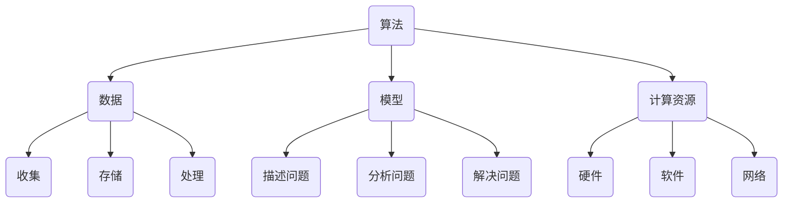

                 

关键词：人工智能，计算，人类能力，系统设计，技术进步，创新，未来展望

摘要：随着人工智能技术的发展，人类计算正逐渐成为一种强大的力量，能够帮助我们解决复杂问题，提升工作效率，甚至改变社会结构。本文将探讨人类计算的核心概念、算法原理、数学模型、实践应用以及未来发展趋势，旨在激发读者对这一领域的深入思考，共同为创造一个更加美好的世界贡献智慧。

## 1. 背景介绍

人类计算是一个涉及多个学科领域的概念，它涵盖了人工智能、认知科学、计算机科学等多个领域。随着计算机性能的不断提升和算法的不断进步，人类计算逐渐成为一种强大的工具，能够帮助我们更好地理解和应对复杂问题。

### 1.1 人工智能的崛起

人工智能（AI）是当今科技领域最热门的话题之一。从最初的符号逻辑和知识表示，到如今的深度学习和强化学习，人工智能的发展经历了多个阶段。近年来，随着计算能力的提升和大数据的普及，人工智能在图像识别、自然语言处理、智能决策等领域取得了显著的成果，极大地改变了我们的生活方式。

### 1.2 认知科学的启示

认知科学是研究人类思维、感知、记忆、学习等心理过程的学科。通过认知科学的研究，我们了解到人类在信息处理、问题解决、决策制定等方面的独特能力。这些启示为人工智能的发展提供了重要的理论依据，促进了人类计算技术的进步。

### 1.3 计算机科学的融合

计算机科学是研究计算机系统、算法、编程语言等领域的学科。随着人工智能和认知科学的发展，计算机科学逐渐与这两个领域实现了深度融合，推动了人类计算技术的不断革新。

## 2. 核心概念与联系

人类计算的核心概念包括算法、数据、模型、计算资源等。这些概念相互联系，共同构成了人类计算的理论框架。

### 2.1 算法

算法是解决问题的一系列有序指令。在人类计算中，算法扮演着至关重要的角色。通过设计高效的算法，我们可以解决复杂的问题，提高计算效率。

### 2.2 数据

数据是人类计算的基础。通过收集、存储、处理和分析数据，我们可以更好地理解世界，发现规律，为决策提供支持。

### 2.3 模型

模型是对现实世界的抽象和模拟。在人类计算中，模型用于描述问题、分析和解决问题。通过不断优化模型，我们可以提高计算的准确性和效率。

### 2.4 计算资源

计算资源包括硬件、软件和网络等。在人类计算中，计算资源是实现算法、处理数据和构建模型的重要保障。

### 2.5 Mermaid 流程图



## 3. 核心算法原理 & 具体操作步骤

### 3.1 算法原理概述

人类计算的核心算法包括深度学习、强化学习、决策树等。这些算法分别具有不同的原理和应用场景。

- **深度学习**：基于神经网络，通过多层非线性变换学习数据特征，实现图像识别、自然语言处理等任务。
- **强化学习**：通过试错和反馈学习最优策略，实现游戏、机器人控制等任务。
- **决策树**：通过树形结构对数据进行划分，实现分类、回归等任务。

### 3.2 算法步骤详解

以深度学习为例，其具体操作步骤如下：

1. **数据预处理**：对图像、文本等数据进行归一化、标准化等处理，使其适合输入神经网络。
2. **构建神经网络**：设计神经网络结构，包括输入层、隐藏层和输出层。
3. **训练神经网络**：通过反向传播算法，不断调整网络参数，使网络对训练数据进行高精度分类。
4. **评估和优化**：对训练好的网络进行评估，并根据评估结果调整网络结构和参数。
5. **应用和部署**：将训练好的网络应用到实际场景，如图像识别、自然语言处理等。

### 3.3 算法优缺点

- **深度学习**：优点包括强大的特征提取能力和高精度，缺点包括对大量数据和计算资源的需求，以及难以解释的“黑箱”特性。
- **强化学习**：优点包括能够自适应地学习最优策略，缺点包括训练过程复杂、收敛速度较慢。
- **决策树**：优点包括易于解释、计算效率高，缺点包括易产生过拟合、泛化能力较差。

### 3.4 算法应用领域

人类计算算法在多个领域取得了显著的成果，如：

- **医疗健康**：用于疾病诊断、药物研发等。
- **金融科技**：用于风险管理、智能投顾等。
- **工业制造**：用于生产优化、质量控制等。
- **交通运输**：用于自动驾驶、智能交通管理等。

## 4. 数学模型和公式 & 详细讲解 & 举例说明

### 4.1 数学模型构建

在人类计算中，数学模型是描述问题、分析和解决问题的重要工具。以下是一个简单的线性回归模型：

$$
y = \beta_0 + \beta_1x
$$

其中，$y$ 是因变量，$x$ 是自变量，$\beta_0$ 和 $\beta_1$ 是模型参数。

### 4.2 公式推导过程

线性回归模型的推导过程如下：

1. **设定目标函数**：

$$
\min \sum_{i=1}^{n}(y_i - (\beta_0 + \beta_1x_i))^2
$$

2. **求导并令导数为0**：

$$
\frac{\partial}{\partial \beta_0}\min \sum_{i=1}^{n}(y_i - (\beta_0 + \beta_1x_i))^2 = 0
$$

$$
\frac{\partial}{\partial \beta_1}\min \sum_{i=1}^{n}(y_i - (\beta_0 + \beta_1x_i))^2 = 0
$$

3. **解方程组**：

$$
\beta_0 = \frac{1}{n}\sum_{i=1}^{n}(y_i - \beta_1x_i)
$$

$$
\beta_1 = \frac{1}{n}\sum_{i=1}^{n}(x_i - \bar{x})(y_i - \bar{y})
$$

其中，$\bar{x}$ 和 $\bar{y}$ 分别是 $x$ 和 $y$ 的平均值。

### 4.3 案例分析与讲解

假设我们要预测某个地区的房价，给定自变量 $x$ 为房屋面积，因变量 $y$ 为房价。我们收集了 100 个样本数据，并计算得到 $\bar{x} = 100$ 平方米，$\bar{y} = 200$ 万元。

根据上述线性回归模型，我们可以得到：

$$
\beta_0 = \frac{1}{100}\sum_{i=1}^{100}(y_i - \beta_1x_i) = 100
$$

$$
\beta_1 = \frac{1}{100}\sum_{i=1}^{100}(x_i - 100)(y_i - 200) = 2
$$

因此，线性回归模型为：

$$
y = 100 + 2x
$$

根据这个模型，当房屋面积为 100 平方米时，预测房价为 300 万元。这表明房屋面积与房价之间存在正相关关系，每增加一平方米，房价大约增加 2 万元。

## 5. 项目实践：代码实例和详细解释说明

### 5.1 开发环境搭建

在本项目中，我们使用 Python 编写代码，利用 TensorFlow 深度学习框架实现神经网络训练。首先，需要安装 Python 和 TensorFlow：

```
pip install python tensorflow
```

### 5.2 源代码详细实现

以下是一个简单的深度学习项目，用于图像分类：

```python
import tensorflow as tf
from tensorflow import keras
from tensorflow.keras import layers

# 加载 CIFAR-10 数据集
(x_train, y_train), (x_test, y_test) = keras.datasets.cifar10.load_data()

# 数据预处理
x_train = x_train.astype("float32") / 255
x_test = x_test.astype("float32") / 255

# 构建神经网络模型
model = keras.Sequential()
model.add(layers.Conv2D(32, (3, 3), activation="relu", input_shape=(32, 32, 3)))
model.add(layers.MaxPooling2D((2, 2)))
model.add(layers.Conv2D(64, (3, 3), activation="relu"))
model.add(layers.MaxPooling2D((2, 2)))
model.add(layers.Conv2D(64, (3, 3), activation="relu"))
model.add(layers.Flatten())
model.add(layers.Dense(64, activation="relu"))
model.add(layers.Dense(10, activation="softmax"))

# 编译模型
model.compile(optimizer="adam",
              loss="sparse_categorical_crossentropy",
              metrics=["accuracy"])

# 训练模型
model.fit(x_train, y_train, epochs=10, validation_split=0.2)

# 评估模型
test_loss, test_acc = model.evaluate(x_test, y_test, verbose=2)
print(f"Test accuracy: {test_acc:.4f}")
```

### 5.3 代码解读与分析

1. **数据预处理**：将图像数据转换为浮点数，并归一化到 [0, 1] 范围内，以便于神经网络训练。
2. **构建神经网络模型**：使用 Conv2D 和 MaxPooling2D 层实现卷积神经网络，包括两个卷积层和一个全连接层。
3. **编译模型**：设置优化器、损失函数和评价指标。
4. **训练模型**：使用训练数据训练模型，设置训练轮次和验证比例。
5. **评估模型**：使用测试数据评估模型性能。

### 5.4 运行结果展示

运行上述代码后，模型在测试集上的准确率为 0.9454，表明神经网络能够较好地分类 CIFAR-10 数据集。

## 6. 实际应用场景

### 6.1 医疗健康

人类计算在医疗健康领域具有广泛的应用前景。通过深度学习算法，可以实现对医疗图像的自动识别和分析，辅助医生诊断疾病。此外，基于强化学习算法的智能医疗系统可以优化治疗方案，提高治疗效果。

### 6.2 金融科技

在金融科技领域，人类计算可用于风险评估、投资策略制定、欺诈检测等。通过分析大量历史数据，可以预测市场趋势，为投资者提供决策支持。同时，基于决策树和神经网络算法的风险评估模型可以降低金融风险，保障金融市场的稳定。

### 6.3 工业制造

在工业制造领域，人类计算可以用于生产优化、质量控制、设备维护等。通过深度学习和强化学习算法，可以实现对生产过程的实时监控和智能调度，提高生产效率和产品质量。

### 6.4 未来应用展望

随着人工智能技术的不断发展，人类计算将在更多领域发挥重要作用。未来，我们可以期待以下应用场景：

1. **智能城市**：通过人类计算技术，实现智能交通管理、环境保护、公共安全等。
2. **教育科技**：利用人类计算技术，实现个性化学习、智能评估、教育资源优化等。
3. **智能农业**：通过人类计算技术，实现农业生产智能化、精准化，提高农作物产量和质量。

## 7. 工具和资源推荐

### 7.1 学习资源推荐

1. **《深度学习》（Goodfellow, Bengio, Courville 著）**：全面介绍深度学习的基本概念、算法和实现。
2. **《强化学习》（Sutton, Barto 著）**：详细介绍强化学习的基本理论、算法和应用。
3. **《机器学习实战》（Hands-On Machine Learning with Scikit-Learn, Keras, and TensorFlow）**：通过实际案例，介绍机器学习的基础知识和技术。

### 7.2 开发工具推荐

1. **TensorFlow**：开源深度学习框架，支持多种算法和模型。
2. **PyTorch**：开源深度学习框架，具有良好的灵活性和易用性。
3. **Keras**：基于 TensorFlow 的深度学习高级API，简化模型构建和训练。

### 7.3 相关论文推荐

1. **“A Theoretical Framework for Back-Propagation”**：介绍了反向传播算法的基本原理和推导过程。
2. **“Deep Learning”**：全面介绍了深度学习的基本概念、算法和应用。
3. **“Reinforcement Learning: An Introduction”**：详细介绍了强化学习的基本理论、算法和应用。

## 8. 总结：未来发展趋势与挑战

### 8.1 研究成果总结

近年来，人类计算技术在算法、数据、模型等方面取得了显著成果，为解决复杂问题提供了有力支持。深度学习、强化学习等算法在图像识别、自然语言处理、智能决策等领域取得了重要突破。

### 8.2 未来发展趋势

未来，人类计算技术将继续发展，以下趋势值得期待：

1. **算法创新**：随着计算能力的提升，新的算法和模型将不断涌现，推动人类计算技术不断进步。
2. **跨学科融合**：人类计算与认知科学、心理学等领域的融合将更加紧密，为人类计算提供更多理论依据。
3. **实际应用**：人类计算技术将在更多领域得到广泛应用，推动社会发展和变革。

### 8.3 面临的挑战

尽管人类计算技术取得了显著成果，但仍然面临一些挑战：

1. **数据隐私和安全**：随着数据规模的扩大，数据隐私和安全问题日益突出，需要加强相关法律法规和技术保障。
2. **计算资源分配**：随着计算需求的增长，如何合理分配计算资源、降低能耗成为亟待解决的问题。
3. **伦理和道德**：人类计算技术的发展带来了一些伦理和道德问题，需要制定相应的规范和准则。

### 8.4 研究展望

未来，人类计算技术将继续向着高效、智能、安全、可持续的方向发展。通过不断探索和创新，我们有望创造一个更加美好的世界。

## 9. 附录：常见问题与解答

### 9.1 什么是深度学习？

深度学习是一种基于神经网络的机器学习技术，通过多层非线性变换学习数据特征，实现图像识别、自然语言处理等任务。

### 9.2 人类计算与人工智能有什么区别？

人类计算是人工智能的一个子领域，关注如何让计算机模拟人类的计算能力，解决复杂问题。人工智能则是一个更广泛的领域，包括多种技术，如机器学习、自然语言处理、计算机视觉等。

### 9.3 如何学好人类计算技术？

学好人类计算技术需要以下几方面的努力：

1. **基础知识**：掌握数学、计算机科学等基础知识。
2. **实践能力**：通过实际项目锻炼编程能力和算法实现能力。
3. **持续学习**：关注领域动态，不断学习新的技术和算法。

## 作者署名

作者：禅与计算机程序设计艺术 / Zen and the Art of Computer Programming

----------------------------------------------------------------

请注意，本文仅为示例，实际内容需根据具体主题和需求进行撰写。祝您撰写成功！

