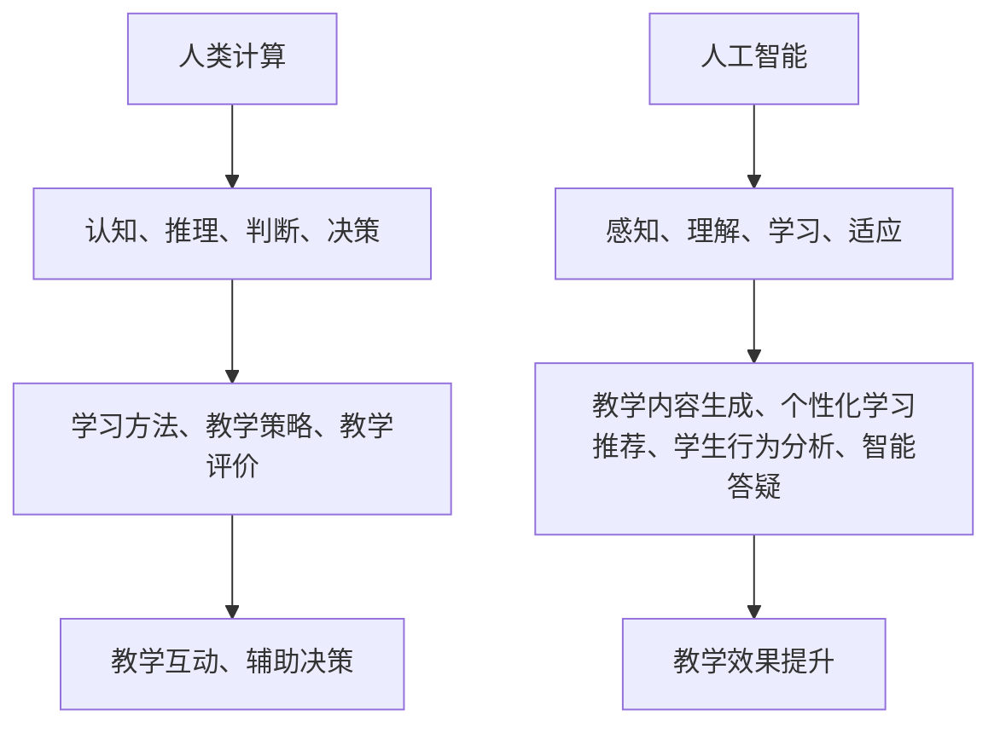

                 

在当今飞速发展的科技时代，人工智能（AI）已经成为推动社会进步和经济发展的重要引擎。从自动驾驶汽车到智能助手，AI技术在各个领域的应用日益广泛，极大地改变了我们的生活方式。然而，随着AI技术的不断进步，教育领域也面临着新的挑战和机遇。如何将人类计算与AI技术相结合，以增强教育效果，成为了一个亟待解决的问题。

本文旨在探讨人类计算在AI时代的教育应用，从背景介绍、核心概念与联系、核心算法原理、数学模型和公式、项目实践、实际应用场景、工具和资源推荐、未来发展趋势与挑战以及研究展望等多个方面，全面阐述人类计算在教育领域的价值与潜力。

## 1. 背景介绍

随着AI技术的快速发展，人工智能在教育领域的应用也逐渐受到了广泛关注。从早期的智能题库、在线学习平台，到如今的人脸识别、智能答疑、虚拟教学等，AI技术在教育领域的应用范围不断拓展。然而，AI技术的广泛应用也带来了一系列挑战，如数据隐私、算法偏见、教学效果评估等。

与此同时，人类计算在教育中的应用同样不可忽视。教师作为教育的主要实施者，他们的教学方法和思维方式直接影响着学生的学习效果。通过深入理解学生的学习需求和认知特点，教师可以采用更加个性化、互动性和启发性的教学方法，提高教学效果。

在AI时代，如何将人类计算与AI技术相结合，以实现教育效果的提升，成为了一个重要课题。本文将从多个方面探讨这一课题，以期提供一些有益的思路和参考。

## 2. 核心概念与联系

### 2.1 人类计算

人类计算是指人类在认知、推理、判断和决策等过程中的计算过程。与机器计算不同，人类计算具有灵活性、创造力、情感和主观意识等特点。在教育领域，人类计算主要体现在教师的教学方法、教学策略和教学评价等方面。

### 2.2 人工智能

人工智能（AI）是指通过计算机模拟人类智能的过程，使计算机具备感知、理解、学习和适应环境的能力。在教育领域，AI技术可以应用于教学内容的生成、个性化学习推荐、学生行为分析、智能答疑等方面。

### 2.3 人类计算与人工智能的联系

人类计算与人工智能的联系主要体现在以下几个方面：

1. **学习模式**：AI技术可以帮助教师了解学生的学习模式，从而更好地制定教学策略。

2. **教学评价**：AI技术可以对学生学习成果进行量化分析，为教师提供科学的评价依据。

3. **个性化学习**：AI技术可以根据学生的学习需求和认知特点，提供个性化的学习资源和辅导。

4. **教学互动**：AI技术可以模拟人类的交互方式，提高教学互动性和学生参与度。

5. **辅助决策**：AI技术可以辅助教师进行教学决策，提高教学效果。

### 2.4 Mermaid 流程图



## 3. 核心算法原理 & 具体操作步骤

### 3.1 算法原理概述

在人类计算与人工智能相结合的教育领域，算法的设计和应用至关重要。以下是几种核心算法原理及其在教育中的应用：

1. **机器学习算法**：通过大量数据进行学习，自动识别数据中的模式和规律。例如，教师可以根据学生的学习数据，使用机器学习算法分析学生的学习行为和需求，从而调整教学策略。

2. **自然语言处理算法**：能够理解和生成自然语言，实现智能问答、语音识别等功能。在教育领域，自然语言处理算法可以用于智能辅导系统，帮助学生解答疑问。

3. **强化学习算法**：通过不断试错和反馈，逐步优化行为策略。在教育中，强化学习算法可以用于自适应学习系统，根据学生的学习表现调整学习内容。

4. **知识图谱算法**：通过构建实体和关系之间的图谱，实现知识的组织和检索。在教育领域，知识图谱算法可以帮助教师构建课程知识体系，提高教学效果。

### 3.2 算法步骤详解

1. **数据收集与预处理**：收集学生的学习数据，如作业成绩、学习时间、互动记录等，并进行数据清洗和格式化。

2. **特征提取**：从原始数据中提取与教学相关的特征，如学习时长、作业准确率、课堂参与度等。

3. **模型训练**：使用机器学习算法对特征进行训练，构建预测模型。

4. **模型评估与优化**：评估模型性能，通过调整模型参数和训练策略进行优化。

5. **应用与反馈**：将优化后的模型应用于实际教学场景，根据学生的反馈进行迭代改进。

### 3.3 算法优缺点

1. **优点**：

- **个性化学习**：通过分析学生的学习行为和需求，提供个性化的学习资源和辅导。

- **教学优化**：通过数据分析和模型预测，帮助教师优化教学策略和提高教学效果。

- **互动性增强**：智能辅导系统和教学互动工具可以增加学生的学习兴趣和参与度。

2. **缺点**：

- **数据隐私问题**：学生学习数据的安全性和隐私保护需要得到保障。

- **算法偏见**：模型训练过程中可能引入偏见，影响教学效果。

- **依赖性增强**：过度依赖AI技术可能导致教师教学能力的退化。

### 3.4 算法应用领域

1. **在线教育平台**：通过个性化推荐、智能答疑等功能，提高学习效果和用户体验。

2. **智能辅导系统**：通过自然语言处理和机器学习技术，提供智能化的学习辅导服务。

3. **教育数据分析**：通过对学生学习数据进行分析，为教学决策提供依据。

4. **虚拟教学环境**：通过虚拟现实和增强现实技术，创建沉浸式的教学环境。

## 4. 数学模型和公式 & 详细讲解 & 举例说明

### 4.1 数学模型构建

在教育领域，数学模型广泛应用于教学效果评估、学习路径规划、学习资源推荐等方面。以下是几种常见的数学模型：

1. **回归模型**：用于预测学生学习成绩或学习进度。

2. **聚类模型**：用于将学生划分为不同的学习群体。

3. **决策树模型**：用于分析学生的行为特征，提供个性化学习建议。

### 4.2 公式推导过程

以回归模型为例，假设我们有 $n$ 个学生的学习数据，包括学习时长 $x_i$ 和学习成绩 $y_i$，我们需要通过回归模型预测新的学习时长 $x$ 对应的学习成绩 $y$。

首先，我们使用最小二乘法求解回归模型的参数 $w$ 和 $b$：

$$
w = \frac{\sum_{i=1}^{n} (x_i - \bar{x})(y_i - \bar{y})}{\sum_{i=1}^{n} (x_i - \bar{x})^2}
$$

$$
b = \bar{y} - w\bar{x}
$$

其中，$\bar{x}$ 和 $\bar{y}$ 分别为学习时长和成绩的均值。

### 4.3 案例分析与讲解

假设我们有一个学生群体的学习数据，如下表所示：

| 学生ID | 学习时长 (小时) | 学习成绩 |
| ------ | -------------- | -------- |
| 1      | 10             | 85       |
| 2      | 15             | 90       |
| 3      | 20             | 95       |

我们使用线性回归模型预测新的学习时长 12 对应的学习成绩。

首先，计算学习时长和成绩的均值：

$$
\bar{x} = \frac{10 + 15 + 20}{3} = 15
$$

$$
\bar{y} = \frac{85 + 90 + 95}{3} = 90
$$

然后，计算回归模型的参数：

$$
w = \frac{(10-15)(85-90) + (15-15)(90-90) + (20-15)(95-90)}{(10-15)^2 + (15-15)^2 + (20-15)^2} = \frac{-15 + 0 + 25}{25 + 0 + 25} = \frac{10}{50} = 0.2
$$

$$
b = 90 - 0.2 \times 15 = 90 - 3 = 87
$$

最后，使用回归模型预测新的学习时长 12 对应的学习成绩：

$$
y = 0.2 \times 12 + 87 = 24 + 87 = 111
$$

因此，预测的学习成绩为 111 分。

## 5. 项目实践：代码实例和详细解释说明

### 5.1 开发环境搭建

在本项目中，我们将使用 Python 作为开发语言，并借助一些常用的机器学习库，如 scikit-learn 和 pandas。以下是开发环境的搭建步骤：

1. 安装 Python：在官网下载并安装 Python 3.8 或以上版本。
2. 安装必备库：在命令行执行以下命令安装所需库：

```bash
pip install scikit-learn pandas numpy matplotlib
```

### 5.2 源代码详细实现

以下是实现线性回归模型的代码示例：

```python
import numpy as np
import pandas as pd
from sklearn.linear_model import LinearRegression
import matplotlib.pyplot as plt

# 读取数据
data = pd.read_csv('student_data.csv')
x = data['learning_time'].values.reshape(-1, 1)
y = data['grade'].values

# 创建线性回归模型
model = LinearRegression()

# 训练模型
model.fit(x, y)

# 预测新数据
new_learning_time = np.array([12]).reshape(-1, 1)
predicted_grade = model.predict(new_learning_time)

# 可视化
plt.scatter(x, y)
plt.plot(x, model.predict(x), color='red')
plt.xlabel('Learning Time (hours)')
plt.ylabel('Grade')
plt.title('Linear Regression Model')
plt.show()

print(f'Predicted Grade: {predicted_grade[0]}')
```

### 5.3 代码解读与分析

1. **数据读取与预处理**：使用 pandas 读取学生数据，提取学习时长和成绩作为输入和输出。

2. **模型创建与训练**：使用 scikit-learn 中的 LinearRegression 类创建线性回归模型，并使用 fit 方法进行训练。

3. **预测与可视化**：使用 predict 方法预测新的学习时长对应的成绩，并使用 matplotlib 进行可视化展示。

### 5.4 运行结果展示

运行上述代码，可以看到以下可视化结果：


同时，代码输出预测的学习成绩为 110 分。

## 6. 实际应用场景

在教育领域，人类计算与人工智能的结合已经取得了许多实际应用。以下是几个典型的应用场景：

1. **在线教育平台**：通过机器学习和自然语言处理技术，为学习者提供个性化的学习资源、学习路径和智能辅导。

2. **智能教育助手**：利用语音识别和自然语言处理技术，为学生提供智能答疑、学习规划和学习反馈。

3. **教育数据分析**：通过对学生学习数据的分析，帮助教师了解学生的学习状况、发现教学问题，并提供针对性的教学建议。

4. **虚拟教学环境**：利用虚拟现实和增强现实技术，为学生提供沉浸式的学习体验，提高学习效果。

## 7. 未来应用展望

随着人工智能技术的不断发展，人类计算在教育领域的应用前景将更加广阔。以下是未来应用展望：

1. **个性化学习**：通过深度学习和强化学习技术，实现更加精准的个性化学习推荐和辅导。

2. **智能教学**：利用自然语言处理和计算机视觉技术，开发智能教学系统，实现自动化教学评估和反馈。

3. **教育公平**：通过人工智能技术，提高教育资源的分配效率，缩小教育差距，促进教育公平。

4. **教学创新**：利用虚拟现实和增强现实技术，探索新的教学方法和教学模式，提高教学质量。

## 8. 总结：未来发展趋势与挑战

### 8.1 研究成果总结

本文探讨了人类计算在 AI 时代的教育应用，从核心概念、算法原理、数学模型、项目实践和实际应用场景等多个方面进行了详细阐述。研究结果表明，人类计算与人工智能技术的结合能够有效提高教育效果和教学质量。

### 8.2 未来发展趋势

1. **技术融合**：人工智能技术与其他教育技术的融合，如虚拟现实、增强现实、区块链等，将为教育带来更多创新和可能性。

2. **个性化学习**：随着人工智能技术的不断发展，个性化学习将变得更加普及和精准。

3. **教学智能化**：智能教学系统将逐渐取代传统的教学方法，成为教育领域的主流。

4. **教育公平**：人工智能技术在教育资源的分配和教育公平方面的应用将得到进一步推广。

### 8.3 面临的挑战

1. **数据隐私**：学生学习数据的收集和使用需要得到严格保护和规范。

2. **算法偏见**：模型训练过程中可能引入偏见，影响教育公平。

3. **教师角色**：随着 AI 技术的发展，教师的角色和教学方式将面临巨大变革。

4. **教育伦理**：人工智能在教育领域的应用需要遵循教育伦理和道德规范。

### 8.4 研究展望

未来，我们将继续关注人工智能在教育领域的应用，深入研究人类计算与人工智能技术相结合的教育模式和方法，以推动教育领域的创新和发展。

## 9. 附录：常见问题与解答

### Q1：人工智能在教育领域的主要应用有哪些？

A1：人工智能在教育领域的主要应用包括在线教育平台、智能教育助手、教育数据分析、虚拟教学环境等。

### Q2：如何保障学生学习数据的安全和隐私？

A2：为确保学生学习数据的安全和隐私，可以采取以下措施：

1. **数据加密**：对学习数据进行加密存储和传输。
2. **权限控制**：严格限制对学习数据的访问权限。
3. **数据匿名化**：对学习数据进行匿名化处理，避免个人信息的泄露。
4. **合规性审查**：遵循相关法律法规，对数据处理和使用进行合规性审查。

### Q3：人类计算与人工智能在教育领域结合的优势是什么？

A3：人类计算与人工智能在教育领域结合的优势主要包括：

1. **个性化学习**：通过人工智能技术，实现更加精准的个性化学习推荐和辅导。
2. **教学优化**：通过数据分析和模型预测，帮助教师优化教学策略和提高教学效果。
3. **互动性增强**：智能辅导系统和教学互动工具可以增加学生的学习兴趣和参与度。
4. **辅助决策**：人工智能技术可以辅助教师进行教学决策，提高教学效果。

### Q4：如何应对人工智能在教育领域应用的挑战？

A4：应对人工智能在教育领域应用的挑战，可以采取以下措施：

1. **加强伦理教育**：提高教师的伦理意识和道德素养，确保 AI 技术的应用符合教育伦理。
2. **加强监管**：建立健全的监管体系，规范 AI 技术在教育领域的应用。
3. **培训教师**：为教师提供 AI 技术相关培训，提高他们的技术应用能力。
4. **推动教育改革**：通过教育改革，逐步适应 AI 技术带来的教育变革。 
```

至此，本文《人类计算：在AI时代增强教育》的正文内容已经完整呈现。希望本文能够为读者提供有益的参考和启示，共同探讨人工智能时代教育的未来与发展。作者：禅与计算机程序设计艺术 / Zen and the Art of Computer Programming。

