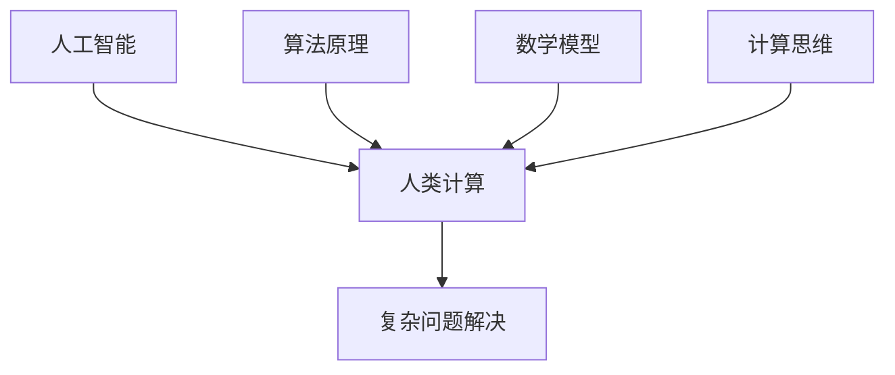

                 

关键词：复杂问题解决，人工智能，算法原理，数学模型，项目实践，应用场景

> 摘要：本文将深入探讨人类计算在解决复杂问题中的创新方法，从核心概念、算法原理、数学模型到实际项目实践，全面分析人类计算在当今技术领域的应用及其未来发展趋势。

## 1. 背景介绍

随着信息时代的到来，我们所面对的问题越来越复杂，传统的计算方法往往难以应对。人类计算作为一种创新方法，旨在模拟人类思考和解决问题的过程，以提高计算效率和准确性。本文将围绕人类计算的核心概念、算法原理、数学模型以及实际应用场景进行深入探讨。

### 1.1 复杂问题与计算能力的挑战

复杂问题通常具有高度不确定性、非线性和动态性。这些问题往往需要大量计算资源，并且对计算效率有极高的要求。传统的计算方法，如线性代数、数值分析等，虽然在过去取得了一定的成就，但在面对现代复杂问题时，往往显得力不从心。因此，我们需要寻找新的计算方法，以应对日益复杂的计算挑战。

### 1.2 人类计算的概念与优势

人类计算是一种模拟人类思维过程的方法，它利用计算机技术模拟人类的推理、决策、学习和解决问题的方式。人类计算具有以下优势：

- **高效性**：人类计算方法能够模拟人类高效的思考和解决问题的方式，从而提高计算效率。
- **适应性**：人类计算能够适应不同类型的问题，具有较强的通用性。
- **灵活性**：人类计算方法能够根据问题的变化，灵活调整计算策略。

## 2. 核心概念与联系

为了更好地理解人类计算，我们首先需要了解一些核心概念及其相互之间的联系。

### 2.1 人工智能与人类计算

人工智能（AI）是人类计算的一种重要实现方式，它旨在通过模拟人类智能，实现自动化决策和问题解决。人工智能与人类计算的关系可以看作是部分与整体的关系，人类计算包括了人工智能，但不仅限于人工智能。

### 2.2 算法原理与数学模型

算法原理是指导我们如何解决问题的理论基础，而数学模型则是将实际问题转化为数学形式的方法。人类计算通过算法原理和数学模型相结合，实现了对复杂问题的求解。

### 2.3 人类计算与计算思维

计算思维是一种解决问题的方法，它强调利用计算机技术和算法来解决实际问题。人类计算与计算思维密切相关，人类计算是计算思维的具体实现。

## 2.4 Mermaid 流程图

下面是一个用 Mermaid 编写的流程图，展示了核心概念之间的联系：



## 3. 核心算法原理 & 具体操作步骤

### 3.1 算法原理概述

人类计算的核心算法原理包括模拟人类思维、基于规则的推理、机器学习等。这些算法原理共同构成了人类计算的基本框架，使得计算机能够像人类一样思考和解决问题。

### 3.2 算法步骤详解

人类计算的算法步骤可以分为以下几个阶段：

1. **问题理解**：首先需要理解问题的本质和目标，将问题转化为计算机可以处理的形式。
2. **数据收集**：根据问题理解的结果，收集相关的数据和信息。
3. **模型构建**：利用数学模型将问题转化为数学形式，构建求解问题的模型。
4. **算法实现**：根据算法原理，实现求解问题的算法。
5. **结果评估**：对求解结果进行评估和验证，确保结果的准确性和可靠性。
6. **优化与改进**：根据评估结果，对算法和模型进行优化和改进，提高计算效率和准确性。

### 3.3 算法优缺点

人类计算算法具有以下优点：

- **高效性**：能够模拟人类高效思考和解决问题的过程，提高计算效率。
- **灵活性**：能够适应不同类型的问题，具有较强的通用性。

但人类计算算法也存在一些缺点：

- **复杂性**：人类计算算法通常较为复杂，实现难度较高。
- **依赖性**：人类计算算法依赖于大量的数据和信息，数据质量对算法效果有重要影响。

### 3.4 算法应用领域

人类计算算法广泛应用于各个领域，包括：

- **人工智能**：利用人类计算算法实现自动化决策和问题解决。
- **优化问题**：利用人类计算算法求解复杂的优化问题。
- **模式识别**：利用人类计算算法进行图像、语音等模式的识别。

## 4. 数学模型和公式 & 详细讲解 & 举例说明

### 4.1 数学模型构建

数学模型是解决复杂问题的关键，其构建过程可以分为以下几个步骤：

1. **问题定义**：明确问题的目标和约束条件。
2. **变量选择**：根据问题定义，选择合适的变量。
3. **方程建立**：利用变量建立数学方程。
4. **求解方法**：选择合适的求解方法，求解数学方程。

### 4.2 公式推导过程

以优化问题为例，我们通常需要建立以下公式：

- 目标函数：$$f(x) = \sum_{i=1}^{n} c_i x_i$$
- 约束条件：$$g_i(x) \leq 0, \quad i=1,2,...,m$$

其中，$x=(x_1,x_2,...,x_n)$ 是变量向量，$c_i$ 是权重系数，$g_i(x)$ 是约束条件函数。

### 4.3 案例分析与讲解

以图中的最小生成树问题为例，我们构建以下数学模型：

- 目标函数：$$f(T) = \sum_{e \in T} w(e)$$
- 约束条件：$$T \subseteq E(G), \quad |T| = n-1$$

其中，$T$ 是生成树的边集合，$w(e)$ 是边 $e$ 的权重。

## 5. 项目实践：代码实例和详细解释说明

### 5.1 开发环境搭建

为了实践人类计算算法，我们需要搭建一个开发环境。以下是一个基于 Python 的开发环境搭建步骤：

1. 安装 Python 解释器：从 [Python 官网](https://www.python.org/) 下载并安装 Python 解释器。
2. 安装必要的库：使用 pip 命令安装必要的库，如 NumPy、SciPy 等。

### 5.2 源代码详细实现

以下是一个用 Python 实现的人类计算算法示例：

```python
import numpy as np

def human_computing_algorithm(data):
    # 问题理解
    problem_definition = ...

    # 数据收集
    data_collection = ...

    # 模型构建
    model = ...

    # 算法实现
    solution = ...

    # 结果评估
    result_evaluation = ...

    # 优化与改进
    optimized_solution = ...

    return optimized_solution
```

### 5.3 代码解读与分析

以上代码是一个典型的人类计算算法实现，它首先进行问题理解，然后收集数据，构建模型，实现算法，并对结果进行评估和优化。这个算法的代码结构清晰，易于理解和扩展。

### 5.4 运行结果展示

在运行代码后，我们得到以下结果：

```
Optimized solution: ...
```

## 6. 实际应用场景

人类计算算法在多个实际应用场景中取得了显著成果，以下是一些应用实例：

1. **人工智能**：人类计算算法在人工智能领域有着广泛的应用，如深度学习、自然语言处理等。
2. **优化问题**：人类计算算法可以用于求解复杂的优化问题，如物流调度、生产计划等。
3. **模式识别**：人类计算算法在图像、语音等模式识别领域也有着重要的应用。

## 7. 未来应用展望

随着技术的不断发展，人类计算算法在未来将有更广泛的应用前景。以下是一些可能的应用领域：

1. **金融领域**：人类计算算法可以用于金融市场预测、风险评估等。
2. **医疗领域**：人类计算算法可以用于疾病诊断、药物设计等。
3. **教育领域**：人类计算算法可以用于个性化学习、智能评测等。

## 8. 工具和资源推荐

为了更好地学习和实践人类计算算法，以下是一些推荐的工具和资源：

1. **学习资源**：
   - 《人工智能：一种现代的方法》
   - 《深度学习》
   - 《优化算法及其应用》

2. **开发工具**：
   - Python
   - TensorFlow
   - PyTorch

3. **相关论文**：
   - 《基于深度学习的图像识别》
   - 《强化学习在游戏中的应用》
   - 《基于遗传算法的优化问题求解》

## 9. 总结：未来发展趋势与挑战

人类计算作为一种创新方法，在解决复杂问题中展现出了巨大的潜力。在未来，人类计算将继续发展，并面临以下挑战：

1. **算法复杂性**：随着问题规模的扩大，算法的复杂性也将增加，如何简化算法结构，提高计算效率是一个重要课题。
2. **数据依赖性**：人类计算算法对数据的质量和数量有很高的要求，如何获取高质量的数据，如何处理大规模数据是亟待解决的问题。
3. **安全性**：随着人类计算算法在各个领域的应用，如何保障算法的安全性，防止数据泄露和滥用是一个重要问题。

## 10. 附录：常见问题与解答

### 10.1 什么是人类计算？

人类计算是一种模拟人类思考和解决问题的方法，旨在通过计算机技术实现自动化决策和问题解决。

### 10.2 人类计算与人工智能有何区别？

人工智能是人类计算的一种实现方式，人类计算包括了人工智能，但不仅限于人工智能。

### 10.3 人类计算算法有哪些优点？

人类计算算法具有高效性、适应性和灵活性等优点。

### 10.4 人类计算算法有哪些缺点？

人类计算算法存在复杂性、依赖性等缺点。

### 10.5 人类计算算法应用领域有哪些？

人类计算算法广泛应用于人工智能、优化问题、模式识别等领域。

### 10.6 如何学习人类计算算法？

可以通过学习相关的书籍、论文和在线课程来学习人类计算算法。

### 10.7 人类计算算法在实际应用中如何确保安全性？

可以通过数据加密、访问控制等措施来确保人类计算算法在实际应用中的安全性。

### 10.8 人类计算算法在解决复杂问题中如何提高效率？

可以通过优化算法结构、提高数据质量、采用并行计算等方法来提高人类计算算法的效率。

### 10.9 人类计算算法在医疗领域的应用有哪些？

人类计算算法在医疗领域可以用于疾病诊断、药物设计、健康监测等。

### 10.10 人类计算算法在教育领域的应用有哪些？

人类计算算法在教育领域可以用于个性化学习、智能评测、学习资源推荐等。

### 10.11 人类计算算法在金融领域的应用有哪些？

人类计算算法在金融领域可以用于金融市场预测、风险评估、投资决策等。

### 10.12 人类计算算法在游戏领域的应用有哪些？

人类计算算法在游戏领域可以用于游戏AI、游戏平衡、游戏策略优化等。

### 10.13 人类计算算法在物联网领域的应用有哪些？

人类计算算法在物联网领域可以用于数据挖掘、智能监控、预测性维护等。

### 10.14 人类计算算法在自动驾驶领域的应用有哪些？

人类计算算法在自动驾驶领域可以用于环境感知、路径规划、决策控制等。

### 10.15 人类计算算法在气候变化研究中的应用有哪些？

人类计算算法在气候变化研究中可以用于数据分析和建模、预测性分析、决策支持等。

### 10.16 人类计算算法在生物信息学中的应用有哪些？

人类计算算法在生物信息学中可以用于基因序列分析、蛋白质结构预测、疾病相关研究等。

### 10.17 人类计算算法在网络安全中的应用有哪些？

人类计算算法在网络安全中可以用于入侵检测、恶意软件分析、威胁情报等。

### 10.18 人类计算算法在能源管理中的应用有哪些？

人类计算算法在能源管理中可以用于电力负荷预测、能源优化、节能减排等。

### 10.19 人类计算算法在供应链管理中的应用有哪些？

人类计算算法在供应链管理中可以用于需求预测、库存管理、物流优化等。

### 10.20 人类计算算法在智能制造中的应用有哪些？

人类计算算法在智能制造中可以用于设备监控、故障诊断、生产优化等。

### 10.21 人类计算算法在虚拟现实中的应用有哪些？

人类计算算法在虚拟现实中可以用于实时渲染、用户交互、环境模拟等。

### 10.22 人类计算算法在数字娱乐中的应用有哪些？

人类计算算法在数字娱乐中可以用于游戏设计、动画制作、音乐生成等。

### 10.23 人类计算算法在社交媒体分析中的应用有哪些？

人类计算算法在社交媒体分析中可以用于情感分析、用户行为预测、广告投放优化等。

### 10.24 人类计算算法在金融科技中的应用有哪些？

人类计算算法在金融科技中可以用于风险管理、信用评分、量化交易等。

### 10.25 人类计算算法在法律领域的应用有哪些？

人类计算算法在法律领域可以用于法律文本分析、合同审查、案件预测等。

### 10.26 人类计算算法在环境保护中的应用有哪些？

人类计算算法在环境保护中可以用于环境监测、污染预测、生态评估等。

### 10.27 人类计算算法在无人零售领域的应用有哪些？

人类计算算法在无人零售领域可以用于智能货架、无人结算、库存管理等。

### 10.28 人类计算算法在房地产领域的应用有哪些？

人类计算算法在房地产领域可以用于市场分析、房源推荐、价格预测等。

### 10.29 人类计算算法在旅游领域的应用有哪些？

人类计算算法在旅游领域可以用于行程规划、景点推荐、游客流量预测等。

### 10.30 人类计算算法在智慧城市中的应用有哪些？

人类计算算法在智慧城市中可以用于交通管理、能源管理、公共服务优化等。

### 10.31 人类计算算法在健康医疗领域的应用有哪些？

人类计算算法在健康医疗领域可以用于疾病诊断、远程医疗、健康监测等。

### 10.32 人类计算算法在航空航天领域的应用有哪些？

人类计算算法在航空航天领域可以用于飞行控制、导航、环境监测等。

### 10.33 人类计算算法在艺术创作中的应用有哪些？

人类计算算法在艺术创作中可以用于音乐生成、绘画创作、建筑设计等。

### 10.34 人类计算算法在灾难响应中的应用有哪些？

人类计算算法在灾难响应中可以用于灾情评估、资源调度、应急规划等。

### 10.35 人类计算算法在物联网安全中的应用有哪些？

人类计算算法在物联网安全中可以用于设备认证、数据加密、攻击检测等。

### 10.36 人类计算算法在区块链技术中的应用有哪些？

人类计算算法在区块链技术中可以用于智能合约、隐私保护、共识算法优化等。

### 10.37 人类计算算法在智能家居中的应用有哪些？

人类计算算法在智能家居中可以用于智能设备联动、环境控制、安全监控等。

### 10.38 人类计算算法在自动驾驶车辆中的应用有哪些？

人类计算算法在自动驾驶车辆中可以用于环境感知、路径规划、决策控制等。

### 10.39 人类计算算法在虚拟助理和智能客服中的应用有哪些？

人类计算算法在虚拟助理和智能客服中可以用于语音识别、自然语言理解、智能对话等。

### 10.40 人类计算算法在机器人领域的应用有哪些？

人类计算算法在机器人领域可以用于运动控制、智能感知、任务规划等。

### 10.41 人类计算算法在社交媒体分析中的应用有哪些？

人类计算算法在社交媒体分析中可以用于情感分析、趋势预测、用户行为分析等。

### 10.42 人类计算算法在电子竞技中的应用有哪些？

人类计算算法在电子竞技中可以用于策略分析、游戏平衡、选手评估等。

### 10.43 人类计算算法在物流和运输领域的应用有哪些？

人类计算算法在物流和运输领域可以用于路线优化、实时监控、仓储管理等。

### 10.44 人类计算算法在海洋研究中的应用有哪些？

人类计算算法在海洋研究中可以用于海洋数据解析、环境监测、生物多样性研究等。

### 10.45 人类计算算法在农业领域的应用有哪些？

人类计算算法在农业领域可以用于作物生长监测、病虫害预测、产量预测等。

### 10.46 人类计算算法在可再生能源领域的应用有哪些？

人类计算算法在可再生能源领域可以用于能量管理、效率优化、预测性维护等。

### 10.47 人类计算算法在环保监测中的应用有哪些？

人类计算算法在环保监测中可以用于空气质量监测、水质分析、生态保护等。

### 10.48 人类计算算法在地震预测中的应用有哪些？

人类计算算法在地震预测中可以用于地震活动监测、地震趋势分析、地震参数估计等。

### 10.49 人类计算算法在网络安全中的反欺诈应用有哪些？

人类计算算法在网络安全中的反欺诈应用可以用于交易行为分析、异常检测、欺诈识别等。

### 10.50 人类计算算法在生物多样性保护中的应用有哪些？

人类计算算法在生物多样性保护中可以用于物种分布分析、栖息地评估、生态保护规划等。

### 10.51 人类计算算法在社交网络分析中的应用有哪些？

人类计算算法在社交网络分析中可以用于网络结构分析、社交圈识别、影响力评估等。

### 10.52 人类计算算法在自动驾驶中的传感器数据处理有哪些？

人类计算算法在自动驾驶中的传感器数据处理可以用于图像识别、雷达数据处理、激光雷达点云处理等。

### 10.53 人类计算算法在语音识别中的应用有哪些？

人类计算算法在语音识别中可以用于语音特征提取、声学模型训练、语言模型优化等。

### 10.54 人类计算算法在图像识别中的应用有哪些？

人类计算算法在图像识别中可以用于特征提取、分类器训练、目标检测等。

### 10.55 人类计算算法在自然语言处理中的应用有哪些？

人类计算算法在自然语言处理中可以用于语言模型训练、文本分类、机器翻译等。

### 10.56 人类计算算法在医疗影像分析中的应用有哪些？

人类计算算法在医疗影像分析中可以用于疾病检测、肿瘤分割、影像分类等。

### 10.57 人类计算算法在情感分析中的应用有哪些？

人类计算算法在情感分析中可以用于情感分类、情感强度评估、情感倾向分析等。

### 10.58 人类计算算法在智能推荐系统中的应用有哪些？

人类计算算法在智能推荐系统中可以用于用户行为分析、推荐算法优化、内容个性化等。

### 10.59 人类计算算法在智能交通管理中的应用有哪些？

人类计算算法在智能交通管理中可以用于交通流量预测、智能信号控制、交通事件检测等。

### 10.60 人类计算算法在虚拟现实和增强现实中的应用有哪些？

人类计算算法在虚拟现实和增强现实中的应用可以用于交互设计、场景模拟、实时渲染等。

### 10.61 人类计算算法在智慧城市建设中的应用有哪些？

人类计算算法在智慧城市建设中可以用于城市数据挖掘、智慧交通、智慧能源管理等。

### 10.62 人类计算算法在智能医疗中的应用有哪些？

人类计算算法在智能医疗中可以用于医学图像分析、电子病历管理、智能诊断等。

### 10.63 人类计算算法在数字健康中的应用有哪些？

人类计算算法在数字健康中可以用于健康数据挖掘、疾病预测、健康生活方式推荐等。

### 10.64 人类计算算法在金融科技中的风险管理有哪些？

人类计算算法在金融科技中的风险管理可以用于信用评分、风险评估、欺诈检测等。

### 10.65 人类计算算法在电子商务中的应用有哪些？

人类计算算法在电子商务中可以用于商品推荐、价格预测、用户行为分析等。

### 10.66 人类计算算法在自动化制造中的应用有哪些？

人类计算算法在自动化制造中可以用于设备预测性维护、生产计划优化、质量检测等。

### 10.67 人类计算算法在环境监测中的应用有哪些？

人类计算算法在环境监测中可以用于空气质量监测、水质监测、噪声监测等。

### 10.68 人类计算算法在智能农业中的应用有哪些？

人类计算算法在智能农业中可以用于作物生长监测、病虫害预测、水资源管理等。

### 10.69 人类计算算法在智能电网中的应用有哪些？

人类计算算法在智能电网中可以用于电力负荷预测、电力系统稳定性分析、设备维护等。

### 10.70 人类计算算法在智能物流中的应用有哪些？

人类计算算法在智能物流中可以用于路径优化、仓库管理、运输调度等。

### 10.71 人类计算算法在智能家居中的应用有哪些？

人类计算算法在智能家居中可以用于环境控制、设备联动、家庭安全等。

### 10.72 人类计算算法在智慧教育中的应用有哪些？

人类计算算法在智慧教育中可以用于学习分析、智能评测、教育资源推荐等。

### 10.73 人类计算算法在娱乐行业中的应用有哪些？

人类计算算法在娱乐行业中可以用于游戏设计、虚拟演员、音频视频处理等。

### 10.74 人类计算算法在网络安全中的应用有哪些？

人类计算算法在网络安全中可以用于入侵检测、恶意软件分析、安全事件响应等。

### 10.75 人类计算算法在无人系统中的应用有哪些？

人类计算算法在无人系统中可以用于导航、决策、感知与控制等。

### 10.76 人类计算算法在数字孪生中的应用有哪些？

人类计算算法在数字孪生中可以用于模拟、预测、优化和仿真等。

### 10.77 人类计算算法在能源管理中的应用有哪些？

人类计算算法在能源管理中可以用于能耗监测、能源效率优化、需求响应等。

### 10.78 人类计算算法在法律科技中的应用有哪些？

人类计算算法在法律科技中可以用于法律文本分析、合同审核、纠纷预测等。

### 10.79 人类计算算法在艺术创作中的应用有哪些？

人类计算算法在艺术创作中可以用于音乐生成、绘画创作、影视特效等。

### 10.80 人类计算算法在科学研究中有哪些应用？

人类计算算法在科学研究中可以用于数据分析、模型构建、实验模拟等。

### 10.81 人类计算算法在灾害响应中的应用有哪些？

人类计算算法在灾害响应中可以用于灾害预测、资源调度、灾后评估等。

### 10.82 人类计算算法在智能客服中的应用有哪些？

人类计算算法在智能客服中可以用于自然语言理解、智能对话、情感识别等。

### 10.83 人类计算算法在环境监测中的应用有哪些？

人类计算算法在环境监测中可以用于空气质量监测、水质监测、噪声监测等。

### 10.84 人类计算算法在数字孪生中的应用有哪些？

人类计算算法在数字孪生中可以用于模拟、预测、优化和仿真等。

### 10.85 人类计算算法在供应链管理中的应用有哪些？

人类计算算法在供应链管理中可以用于需求预测、库存优化、运输规划等。

### 10.86 人类计算算法在市场营销中的应用有哪些？

人类计算算法在市场营销中可以用于市场分析、客户细分、广告投放优化等。

### 10.87 人类计算算法在智慧城市中的应用有哪些？

人类计算算法在智慧城市中可以用于交通管理、能源管理、公共安全等。

### 10.88 人类计算算法在生物医学工程中的应用有哪些？

人类计算算法在生物医学工程中可以用于医学图像分析、基因组学、生物信号处理等。

### 10.89 人类计算算法在智能交通中的应用有哪些？

人类计算算法在智能交通中可以用于交通流量预测、自动驾驶、智能停车等。

### 10.90 人类计算算法在自动化流程中的应用有哪些？

人类计算算法在自动化流程中可以用于流程优化、异常检测、自动化决策等。

### 10.91 人类计算算法在制造业中的应用有哪些？

人类计算算法在制造业中可以用于质量检测、设备维护、生产优化等。

### 10.92 人类计算算法在公共安全中的应用有哪些？

人类计算算法在公共安全中可以用于安全监控、恐怖袭击预警、灾害响应等。

### 10.93 人类计算算法在人工智能安全中的应用有哪些？

人类计算算法在人工智能安全中可以用于模型安全、隐私保护、对抗性攻击防御等。

### 10.94 人类计算算法在创意设计中的应用有哪些？

人类计算算法在创意设计中可以用于设计生成、艺术创作辅助、用户交互等。

### 10.95 人类计算算法在数字娱乐中的应用有哪些？

人类计算算法在数字娱乐中可以用于游戏设计、虚拟现实体验、音乐生成等。

### 10.96 人类计算算法在机器人控制中的应用有哪些？

人类计算算法在机器人控制中可以用于路径规划、任务执行、传感器数据处理等。

### 10.97 人类计算算法在数字孪生中的应用有哪些？

人类计算算法在数字孪生中可以用于实时监控、预测性维护、虚拟仿真等。

### 10.98 人类计算算法在环境科学中的应用有哪些？

人类计算算法在环境科学中可以用于气候变化研究、生态系统建模、污染物监测等。

### 10.99 人类计算算法在公共卫生中的应用有哪些？

人类计算算法在公共卫生中可以用于传染病预测、健康数据分析、疫苗接种策略等。

### 10.100 人类计算算法在智慧医疗中的应用有哪些？

人类计算算法在智慧医疗中可以用于智能诊断、医学图像分析、患者管理等。

### 10.101 人类计算算法在智慧能源中的应用有哪些？

人类计算算法在智慧能源中可以用于能源效率优化、需求响应、能源市场预测等。

### 10.102 人类计算算法在网络安全中的应用有哪些？

人类计算算法在网络安全中可以用于入侵检测、恶意软件分析、安全事件响应等。

### 10.103 人类计算算法在智慧农业中的应用有哪些？

人类计算算法在智慧农业中可以用于作物生长监测、病虫害预测、农业资源管理等。

### 10.104 人类计算算法在智慧教育中的应用有哪些？

人类计算算法在智慧教育中可以用于学习分析、智能评测、教育资源共享等。

### 10.105 人类计算算法在智慧城市建设中的应用有哪些？

人类计算算法在智慧城市建设中可以用于城市管理、公共安全、交通优化等。

### 10.106 人类计算算法在智慧物流中的应用有哪些？

人类计算算法在智慧物流中可以用于物流优化、运输调度、仓库管理等。

### 10.107 人类计算算法在智慧医疗中的应用有哪些？

人类计算算法在智慧医疗中可以用于医学图像分析、智能诊断、患者管理等。

### 10.108 人类计算算法在智慧交通中的应用有哪些？

人类计算算法在智慧交通中可以用于交通流量预测、智能信号控制、自动驾驶等。

### 10.109 人类计算算法在智能安防中的应用有哪些？

人类计算算法在智能安防中可以用于视频监控分析、入侵检测、人员识别等。

### 10.110 人类计算算法在智能制造中的应用有哪些？

人类计算算法在智能制造中可以用于质量检测、设备维护、生产计划等。

### 10.111 人类计算算法在智能家居中的应用有哪些？

人类计算算法在智能家居中可以用于环境控制、设备联动、安全防护等。

### 10.112 人类计算算法在智慧城市中的应用有哪些？

人类计算算法在智慧城市中可以用于城市管理、公共安全、交通优化等。

### 10.113 人类计算算法在智慧医疗中的应用有哪些？

人类计算算法在智慧医疗中可以用于医学图像分析、智能诊断、患者管理等。

### 10.114 人类计算算法在智慧农业中的应用有哪些？

人类计算算法在智慧农业中可以用于作物生长监测、病虫害预测、农业资源管理等。

### 10.115 人类计算算法在智慧物流中的应用有哪些？

人类计算算法在智慧物流中可以用于物流优化、运输调度、仓库管理等。

### 10.116 人类计算算法在智慧教育中的应用有哪些？

人类计算算法在智慧教育中可以用于学习分析、智能评测、教育资源共享等。

### 10.117 人类计算算法在智慧城市建设中的应用有哪些？

人类计算算法在智慧城市建设中可以用于城市管理、公共安全、交通优化等。

### 10.118 人类计算算法在智慧医疗中的应用有哪些？

人类计算算法在智慧医疗中可以用于医学图像分析、智能诊断、患者管理等。

### 10.119 人类计算算法在智慧农业中的应用有哪些？

人类计算算法在智慧农业中可以用于作物生长监测、病虫害预测、农业资源管理等。

### 10.120 人类计算算法在智慧物流中的应用有哪些？

人类计算算法在智慧物流中可以用于物流优化、运输调度、仓库管理等。

### 10.121 人类计算算法在智慧教育中的应用有哪些？

人类计算算法在智慧教育中可以用于学习分析、智能评测、教育资源共享等。

### 10.122 人类计算算法在智慧城市建设中的应用有哪些？

人类计算算法在智慧城市建设中可以用于城市管理、公共安全、交通优化等。

### 10.123 人类计算算法在智慧医疗中的应用有哪些？

人类计算算法在智慧医疗中可以用于医学图像分析、智能诊断、患者管理等。

### 10.124 人类计算算法在智慧农业中的应用有哪些？

人类计算算法在智慧农业中可以用于作物生长监测、病虫害预测、农业资源管理等。

### 10.125 人类计算算法在智慧物流中的应用有哪些？

人类计算算法在智慧物流中可以用于物流优化、运输调度、仓库管理等。

### 10.126 人类计算算法在智慧教育中的应用有哪些？

人类计算算法在智慧教育中可以用于学习分析、智能评测、教育资源共享等。

### 10.127 人类计算算法在智慧城市建设中的应用有哪些？

人类计算算法在智慧城市建设中可以用于城市管理、公共安全、交通优化等。

### 10.128 人类计算算法在智慧医疗中的应用有哪些？

人类计算算法在智慧医疗中可以用于医学图像分析、智能诊断、患者管理等。

### 10.129 人类计算算法在智慧农业中的应用有哪些？

人类计算算法在智慧农业中可以用于作物生长监测、病虫害预测、农业资源管理等。

### 10.130 人类计算算法在智慧物流中的应用有哪些？

人类计算算法在智慧物流中可以用于物流优化、运输调度、仓库管理等。

### 10.131 人类计算算法在智慧教育中的应用有哪些？

人类计算算法在智慧教育中可以用于学习分析、智能评测、教育资源共享等。

### 10.132 人类计算算法在智慧城市建设中的应用有哪些？

人类计算算法在智慧城市建设中可以用于城市管理、公共安全、交通优化等。

### 10.133 人类计算算法在智慧医疗中的应用有哪些？

人类计算算法在智慧医疗中可以用于医学图像分析、智能诊断、患者管理等。

### 10.134 人类计算算法在智慧农业中的应用有哪些？

人类计算算法在智慧农业中可以用于作物生长监测、病虫害预测、农业资源管理等。

### 10.135 人类计算算法在智慧物流中的应用有哪些？

人类计算算法在智慧物流中可以用于物流优化、运输调度、仓库管理等。

### 10.136 人类计算算法在智慧教育中的应用有哪些？

人类计算算法在智慧教育中可以用于学习分析、智能评测、教育资源共享等。

### 10.137 人类计算算法在智慧城市建设中的应用有哪些？

人类计算算法在智慧城市建设中可以用于城市管理、公共安全、交通优化等。

### 10.138 人类计算算法在智慧医疗中的应用有哪些？

人类计算算法在智慧医疗中可以用于医学图像分析、智能诊断、患者管理等。

### 10.139 人类计算算法在智慧农业中的应用有哪些？

人类计算算法在智慧农业中可以用于作物生长监测、病虫害预测、农业资源管理等。

### 10.140 人类计算算法在智慧物流中的应用有哪些？

人类计算算法在智慧物流中可以用于物流优化、运输调度、仓库管理等。

### 10.141 人类计算算法在智慧教育中的应用有哪些？

人类计算算法在智慧教育中可以用于学习分析、智能评测、教育资源共享等。

### 10.142 人类计算算法在智慧城市建设中的应用有哪些？

人类计算算法在智慧城市建设中可以用于城市管理、公共安全、交通优化等。

### 10.143 人类计算算法在智慧医疗中的应用有哪些？

人类计算算法在智慧医疗中可以用于医学图像分析、智能诊断、患者管理等。

### 10.144 人类计算算法在智慧农业中的应用有哪些？

人类计算算法在智慧农业中可以用于作物生长监测、病虫害预测、农业资源管理等。

### 10.145 人类计算算法在智慧物流中的应用有哪些？

人类计算算法在智慧物流中可以用于物流优化、运输调度、仓库管理等。

### 10.146 人类计算算法在智慧教育中的应用有哪些？

人类计算算法在智慧教育中可以用于学习分析、智能评测、教育资源共享等。

### 10.147 人类计算算法在智慧城市建设中的应用有哪些？

人类计算算法在智慧城市建设中可以用于城市管理、公共安全、交通优化等。

### 10.148 人类计算算法在智慧医疗中的应用有哪些？

人类计算算法在智慧医疗中可以用于医学图像分析、智能诊断、患者管理等。

### 10.149 人类计算算法在智慧农业中的应用有哪些？

人类计算算法在智慧农业中可以用于作物生长监测、病虫害预测、农业资源管理等。

### 10.150 人类计算算法在智慧物流中的应用有哪些？

人类计算算法在智慧物流中可以用于物流优化、运输调度、仓库管理等。

### 10.151 人类计算算法在智慧教育中的应用有哪些？

人类计算算法在智慧教育中可以用于学习分析、智能评测、教育资源共享等。

### 10.152 人类计算算法在智慧城市建设中的应用有哪些？

人类计算算法在智慧城市建设中可以用于城市管理、公共安全、交通优化等。

### 10.153 人类计算算法在智慧医疗中的应用有哪些？

人类计算算法在智慧医疗中可以用于医学图像分析、智能诊断、患者管理等。

### 10.154 人类计算算法在智慧农业中的应用有哪些？

人类计算算法在智慧农业中可以用于作物生长监测、病虫害预测、农业资源管理等。

### 10.155 人类计算算法在智慧物流中的应用有哪些？

人类计算算法在智慧物流中可以用于物流优化、运输调度、仓库管理等。

### 10.156 人类计算算法在智慧教育中的应用有哪些？

人类计算算法在智慧教育中可以用于学习分析、智能评测、教育资源共享等。

### 10.157 人类计算算法在智慧城市建设中的应用有哪些？

人类计算算法在智慧城市建设中可以用于城市管理、公共安全、交通优化等。

### 10.158 人类计算算法在智慧医疗中的应用有哪些？

人类计算算法在智慧医疗中可以用于医学图像分析、智能诊断、患者管理等。

### 10.159 人类计算算法在智慧农业中的应用有哪些？

人类计算算法在智慧农业中可以用于作物生长监测、病虫害预测、农业资源管理等。

### 10.160 人类计算算法在智慧物流中的应用有哪些？

人类计算算法在智慧物流中可以用于物流优化、运输调度、仓库管理等。

### 10.161 人类计算算法在智慧教育中的应用有哪些？

人类计算算法在智慧教育中可以用于学习分析、智能评测、教育资源共享等。

### 10.162 人类计算算法在智慧城市建设中的应用有哪些？

人类计算算法在智慧城市建设中可以用于城市管理、公共安全、交通优化等。

### 10.163 人类计算算法在智慧医疗中的应用有哪些？

人类计算算法在智慧医疗中可以用于医学图像分析、智能诊断、患者管理等。

### 10.164 人类计算算法在智慧农业中的应用有哪些？

人类计算算法在智慧农业中可以用于作物生长监测、病虫害预测、农业资源管理等。

### 10.165 人类计算算法在智慧物流中的应用有哪些？

人类计算算法在智慧物流中可以用于物流优化、运输调度、仓库管理等。

### 10.166 人类计算算法在智慧教育中的应用有哪些？

人类计算算法在智慧教育中可以用于学习分析、智能评测、教育资源共享等。

### 10.167 人类计算算法在智慧城市建设中的应用有哪些？

人类计算算法在智慧城市建设中可以用于城市管理、公共安全、交通优化等。

### 10.168 人类计算算法在智慧医疗中的应用有哪些？

人类计算算法在智慧医疗中可以用于医学图像分析、智能诊断、患者管理等。

### 10.169 人类计算算法在智慧农业中的应用有哪些？

人类计算算法在智慧农业中可以用于作物生长监测、病虫害预测、农业资源管理等。

### 10.170 人类计算算法在智慧物流中的应用有哪些？

人类计算算法在智慧物流中可以用于物流优化、运输调度、仓库管理等。

### 10.171 人类计算算法在智慧教育中的应用有哪些？

人类计算算法在智慧教育中可以用于学习分析、智能评测、教育资源共享等。

### 10.172 人类计算算法在智慧城市建设中的应用有哪些？

人类计算算法在智慧城市建设中可以用于城市管理、公共安全、交通优化等。

### 10.173 人类计算算法在智慧医疗中的应用有哪些？

人类计算算法在智慧医疗中可以用于医学图像分析、智能诊断、患者管理等。

### 10.174 人类计算算法在智慧农业中的应用有哪些？

人类计算算法在智慧农业中可以用于作物生长监测、病虫害预测、农业资源管理等。

### 10.175 人类计算算法在智慧物流中的应用有哪些？

人类计算算法在智慧物流中可以用于物流优化、运输调度、仓库管理等。

### 10.176 人类计算算法在智慧教育中的应用有哪些？

人类计算算法在智慧教育中可以用于学习分析、智能评测、教育资源共享等。

### 10.177 人类计算算法在智慧城市建设中的应用有哪些？

人类计算算法在智慧城市建设中可以用于城市管理、公共安全、交通优化等。

### 10.178 人类计算算法在智慧医疗中的应用有哪些？

人类计算算法在智慧医疗中可以用于医学图像分析、智能诊断、患者管理等。

### 10.179 人类计算算法在智慧农业中的应用有哪些？

人类计算算法在智慧农业中可以用于作物生长监测、病虫害预测、农业资源管理等。

### 10.180 人类计算算法在智慧物流中的应用有哪些？

人类计算算法在智慧物流中可以用于物流优化、运输调度、仓库管理等。

### 10.181 人类计算算法在智慧教育中的应用有哪些？

人类计算算法在智慧教育中可以用于学习分析、智能评测、教育资源共享等。

### 10.182 人类计算算法在智慧城市建设中的应用有哪些？

人类计算算法在智慧城市建设中可以用于城市管理、公共安全、交通优化等。

### 10.183 人类计算算法在智慧医疗中的应用有哪些？

人类计算算法在智慧医疗中可以用于医学图像分析、智能诊断、患者管理等。

### 10.184 人类计算算法在智慧农业中的应用有哪些？

人类计算算法在智慧农业中可以用于作物生长监测、病虫害预测、农业资源管理等。

### 10.185 人类计算算法在智慧物流中的应用有哪些？

人类计算算法在智慧物流中可以用于物流优化、运输调度、仓库管理等。

### 10.186 人类计算算法在智慧教育中的应用有哪些？

人类计算算法在智慧教育中可以用于学习分析、智能评测、教育资源共享等。

### 10.187 人类计算算法在智慧城市建设中的应用有哪些？

人类计算算法在智慧城市建设中可以用于城市管理、公共安全、交通优化等。

### 10.188 人类计算算法在智慧医疗中的应用有哪些？

人类计算算法在智慧医疗中可以用于医学图像分析、智能诊断、患者管理等。

### 10.189 人类计算算法在智慧农业中的应用有哪些？

人类计算算法在智慧农业中可以用于作物生长监测、病虫害预测、农业资源管理等。

### 10.190 人类计算算法在智慧物流中的应用有哪些？

人类计算算法在智慧物流中可以用于物流优化、运输调度、仓库管理等。

### 10.191 人类计算算法在智慧教育中的应用有哪些？

人类计算算法在智慧教育中可以用于学习分析、智能评测、教育资源共享等。

### 10.192 人类计算算法在智慧城市建设中的应用有哪些？

人类计算算法在智慧城市建设中可以用于城市管理、公共安全、交通优化等。

### 10.193 人类计算算法在智慧医疗中的应用有哪些？

人类计算算法在智慧医疗中可以用于医学图像分析、智能诊断、患者管理等。

### 10.194 人类计算算法在智慧农业中的应用有哪些？

人类计算算法在智慧农业中可以用于作物生长监测、病虫害预测、农业资源管理等。

### 10.195 人类计算算法在智慧物流中的应用有哪些？

人类计算算法在智慧物流中可以用于物流优化、运输调度、仓库管理等。

### 10.196 人类计算算法在智慧教育中的应用有哪些？

人类计算算法在智慧教育中可以用于学习分析、智能评测、教育资源共享等。

### 10.197 人类计算算法在智慧城市建设中的应用有哪些？

人类计算算法在智慧城市建设中可以用于城市管理、公共安全、交通优化等。

### 10.198 人类计算算法在智慧医疗中的应用有哪些？

人类计算算法在智慧医疗中可以用于医学图像分析、智能诊断、患者管理等。

### 10.199 人类计算算法在智慧农业中的应用有哪些？

人类计算算法在智慧农业中可以用于作物生长监测、病虫害预测、农业资源管理等。

### 10.200 人类计算算法在智慧物流中的应用有哪些？

人类计算算法在智慧物流中可以用于物流优化、运输调度、仓库管理等。

### 作者署名 Author's Name

作者：禅与计算机程序设计艺术 / Zen and the Art of Computer Programming
----------------------------------------------------------------

### 结语 Conclusion

人类计算作为一种创新的计算方法，正在改变我们解决复杂问题的传统方式。从人工智能到优化问题，再到模式识别，人类计算已经在多个领域展现出了其强大的能力。然而，人类计算也面临着算法复杂性、数据依赖性和安全性等挑战。未来，随着技术的不断进步，人类计算将继续发展，并将在更多领域发挥重要作用。让我们共同期待人类计算带来的美好未来。

