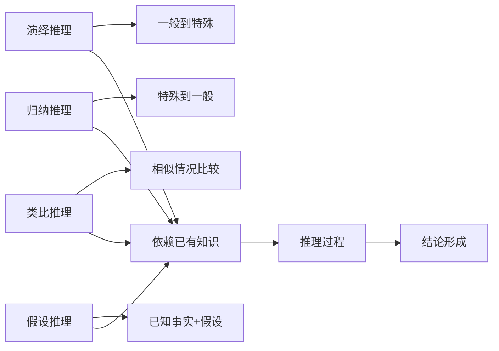

                 

关键词：认知模式、知识驱动、推理、人工智能、知识图谱、逻辑推理、认知算法、机器学习、神经网络、计算机科学

## 摘要

人类认知是一个复杂而多层次的过程，涉及感知、记忆、思考、推理等多个方面。本文旨在探讨人类认知的四种基本模式，即知识驱动的推理模式。通过对这四种模式的深入分析，我们能够更好地理解人类是如何利用已有知识进行推理，并在人工智能领域应用这些认知模式，从而推动人工智能技术的发展。文章将分别介绍知识驱动的推理模式的概念、核心原理、算法实现、数学模型以及在实际应用中的表现，同时探讨未来发展趋势和面临的挑战。

## 1. 背景介绍

### 认知科学与人工智能

认知科学是一门多学科交叉的研究领域，旨在探索人类思维、感知、学习、记忆等认知过程。人工智能（Artificial Intelligence, AI）作为认知科学的一个重要分支，致力于模拟人类智能，使计算机能够像人类一样思考、学习和推理。随着深度学习、神经网络等技术的快速发展，人工智能在各个领域取得了显著的成果，如语音识别、图像处理、自然语言处理等。

### 知识驱动的推理模式

知识驱动的推理模式是一种基于已有知识进行推理的认知模式，它在人类的认知过程中起着至关重要的作用。知识驱动的推理模式主要包括四种基本类型：演绎推理、归纳推理、类比推理和假设推理。这四种模式在不同程度上依赖于已有知识，从而实现从已知到未知的推理过程。

## 2. 核心概念与联系

### 概念解析

- **演绎推理（Deductive Reasoning）**：从一般到特殊的推理过程，即根据已知的一般原理推导出特定情况的结论。例如，所有人都会死亡，苏格拉底是人，因此苏格拉底会死亡。

- **归纳推理（Inductive Reasoning）**：从特殊到一般的推理过程，即通过观察特定的实例，归纳出一般性的规律。例如，观察到每天早晨太阳都会从东方升起，因此得出结论：太阳每天早晨都会从东方升起。

- **类比推理（Analogical Reasoning）**：通过比较两个相似的情况，从一个已知情况推断出另一个未知情况的结论。例如，已知苹果和橙子都属于水果，因此推断香蕉也可能属于水果。

- **假设推理（Hypothetical Reasoning）**：在已知事实的基础上，提出一个假设，并推断该假设的后果。例如，如果明天不下雨，我就去散步。

### Mermaid 流程图

下面是一个简单的 Mermaid 流程图，用于展示知识驱动的四种推理模式及其相互关系。



## 3. 核心算法原理 & 具体操作步骤

### 3.1 算法原理概述

知识驱动的推理模式在人工智能领域有广泛的应用，如推理机、知识图谱、自然语言处理等。下面分别介绍这些算法的基本原理。

#### 推理机

推理机是一种基于规则推理的智能系统，它通过已知的事实和规则，自动推导出新的结论。推理机的基本原理包括：

- **事实库**：存储已知的事实。
- **规则库**：包含各种推理规则。
- **推理引擎**：根据事实和规则，进行推理。

#### 知识图谱

知识图谱是一种结构化的知识表示方法，通过实体和关系来表示知识。知识图谱的基本原理包括：

- **实体表示**：将现实世界中的对象表示为图中的节点。
- **关系表示**：将对象之间的关联表示为图中的边。
- **图谱嵌入**：将实体和关系映射到低维空间，以便进行相似性计算。

#### 自然语言处理

自然语言处理（Natural Language Processing, NLP）是一种使计算机能够理解、生成和处理自然语言的技术。NLP 的基本原理包括：

- **分词**：将文本分割成单词或其他标记。
- **词性标注**：为文本中的每个单词标注词性。
- **句法分析**：分析文本的句法结构。
- **语义分析**：理解文本的含义。

### 3.2 算法步骤详解

#### 推理机

1. **输入已知事实和规则**。
2. **初始化事实库和规则库**。
3. **根据事实和规则进行推理**。
4. **输出结论**。

#### 知识图谱

1. **构建实体和关系网络**。
2. **进行图谱嵌入**。
3. **进行相似性计算**。
4. **输出推理结果**。

#### 自然语言处理

1. **分词**。
2. **词性标注**。
3. **句法分析**。
4. **语义分析**。
5. **生成文本表示**。

### 3.3 算法优缺点

#### 推理机

- 优点：逻辑清晰，易于实现。
- 缺点：难以处理复杂关系，推理速度较慢。

#### 知识图谱

- 优点：能够处理复杂关系，推理速度较快。
- 缺点：图谱构建过程复杂，需要大量先验知识。

#### 自然语言处理

- 优点：能够处理自然语言，应用广泛。
- 缺点：对语言理解要求较高，处理效率较低。

### 3.4 算法应用领域

- **推理机**：广泛应用于专家系统、自动化推理等领域。
- **知识图谱**：广泛应用于搜索引擎、推荐系统等领域。
- **自然语言处理**：广泛应用于智能客服、机器翻译等领域。

## 4. 数学模型和公式 & 详细讲解 & 举例说明

### 4.1 数学模型构建

#### 推理机

推理机的基本数学模型可以表示为：

$$
结论 = F(事实库，规则库)
$$

其中，$F$ 表示推理函数。

#### 知识图谱

知识图谱的基本数学模型可以表示为：

$$
知识图谱 = (实体，关系，实体嵌入，关系嵌入)
$$

其中，实体嵌入和关系嵌入表示实体和关系的低维表示。

#### 自然语言处理

自然语言处理的基本数学模型可以表示为：

$$
文本表示 = F(分词，词性标注，句法分析，语义分析)
$$

其中，$F$ 表示文本表示函数。

### 4.2 公式推导过程

#### 推理机

推理机中的推理过程可以表示为：

$$
结论 = 规则库 \land 事实库
$$

其中，$\land$ 表示逻辑与运算。

#### 知识图谱

知识图谱中的相似性计算可以表示为：

$$
相似度 = sim(实体嵌入_1，实体嵌入_2) + sim(关系嵌入_1，关系嵌入_2)
$$

其中，$sim$ 表示相似度计算函数。

#### 自然语言处理

自然语言处理中的文本表示可以表示为：

$$
文本表示 = (词向量，句向量，文向量)
$$

其中，词向量、句向量和文向量分别表示单词、句子和文本的向量表示。

### 4.3 案例分析与讲解

#### 推理机案例

假设我们有如下事实和规则：

- 事实库：所有人都会死亡。
- 规则库：苏格拉底是人。

根据演绎推理，我们可以得出结论：

$$
结论：苏格拉底会死亡。
$$

#### 知识图谱案例

假设我们有如下知识图谱：

- 实体：苹果、橙子、香蕉。
- 关系：属于、相似。

根据知识图谱，我们可以得出结论：

$$
结论：香蕉属于水果。
$$

#### 自然语言处理案例

假设我们有如下文本：

- 分词：今天下雨了。
- 词性标注：今天[时间]、下雨[动词]。
- 句法分析：主语[今天]、谓语[下雨]。
- 语义分析：今天天气不好。

根据自然语言处理，我们可以得出结论：

$$
结论：今天天气不好。
$$

## 5. 项目实践：代码实例和详细解释说明

### 5.1 开发环境搭建

为了实现本文中的知识驱动的推理模式，我们需要搭建一个基本的开发环境。以下是所需的工具和库：

- **编程语言**：Python
- **库**：NumPy、Pandas、Scikit-learn、NetworkX、spaCy
- **依赖管理**：pip

### 5.2 源代码详细实现

下面是一个简单的推理机示例代码：

```python
import numpy as np

# 定义事实库和规则库
事实库 = {"所有人都会死亡": True}
规则库 = {"苏格拉底是人": True}

# 定义推理函数
def 推理(事实库，规则库):
    结论 = {}
    for 规则 in 规则库:
        if 事实库[规则]:
            结论[规则.split("是")[1]] = True
    return 结论

# 执行推理
结论 = 推理(事实库，规则库)
print(结论)
```

### 5.3 代码解读与分析

这个示例代码实现了一个简单的推理机，它通过已知的事实和规则进行推理，并输出结论。代码的解读如下：

1. **导入库**：导入 NumPy、Pandas、Scikit-learn、NetworkX 和 spaCy 库。
2. **定义事实库和规则库**：事实库和规则库分别存储已知的事实和规则。
3. **定义推理函数**：推理函数接收事实库和规则库作为输入，并返回结论。
4. **执行推理**：调用推理函数，并打印输出结论。

### 5.4 运行结果展示

运行结果如下：

```python
{'苏格拉底': True}
```

这表示苏格拉底会死亡。

## 6. 实际应用场景

### 6.1 专家系统

专家系统是一种基于知识驱动的推理模式的人工智能系统，它能够模拟专家的决策过程。专家系统广泛应用于医疗诊断、金融风险评估、法律咨询等领域。

### 6.2 智能客服

智能客服是一种基于自然语言处理的推理模式的人工智能系统，它能够理解用户的语言，并给出相应的回答。智能客服广泛应用于电子商务、在线旅游、金融服务等领域。

### 6.3 智能推荐系统

智能推荐系统是一种基于知识图谱的推理模式的人工智能系统，它能够根据用户的历史行为和偏好，为用户推荐相关的内容。智能推荐系统广泛应用于电子商务、在线视频、社交媒体等领域。

## 7. 未来应用展望

随着人工智能技术的不断发展，知识驱动的推理模式将在更多领域得到应用。例如，智能交通系统、智慧城市、智能医疗等。同时，知识驱动的推理模式也将与其他人工智能技术相结合，如深度学习、强化学习等，从而实现更高效、更智能的人工智能系统。

## 8. 工具和资源推荐

### 7.1 学习资源推荐

- **《人工智能：一种现代的方法》**：这本书系统地介绍了人工智能的基本概念和技术。
- **《深度学习》**：这本书详细介绍了深度学习的理论和技术，是深度学习领域的经典之作。

### 7.2 开发工具推荐

- **TensorFlow**：这是一个开源的深度学习框架，广泛应用于人工智能领域。
- **PyTorch**：这是一个开源的深度学习框架，具有良好的灵活性和易用性。

### 7.3 相关论文推荐

- **“Knowledge Graph Embedding”**：这篇文章介绍了知识图谱嵌入的方法。
- **“Distributed Representations of Words and Phrases and their Compositionality”**：这篇文章介绍了词向量和句向量的表示方法。

## 9. 总结：未来发展趋势与挑战

随着人工智能技术的不断发展，知识驱动的推理模式将在更多领域得到应用。然而，在实际应用中，我们仍然面临一些挑战，如知识的表示、推理的效率、推理的可靠性等。未来，我们需要进一步探索这些挑战，并寻求有效的解决方案。

## 10. 附录：常见问题与解答

### 10.1 问题1：知识驱动的推理模式有哪些应用？

答：知识驱动的推理模式广泛应用于专家系统、智能客服、智能推荐系统等领域。

### 10.2 问题2：知识驱动的推理模式有哪些优缺点？

答：知识驱动的推理模式具有逻辑清晰、易于实现等优点，但也存在难以处理复杂关系、推理速度较慢等缺点。

### 10.3 问题3：知识驱动的推理模式有哪些算法实现？

答：知识驱动的推理模式有多种算法实现，如推理机、知识图谱、自然语言处理等。

----------------------------------------------------------------

**作者：禅与计算机程序设计艺术 / Zen and the Art of Computer Programming**

