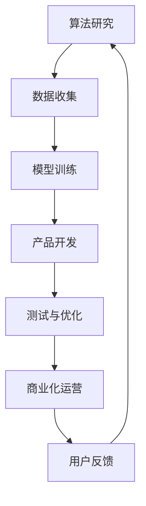

                 

关键词：AI商业化、产品化流程、Lepton AI、技术落地、算法应用

摘要：本文将深入探讨从AI实验到商业化的全过程，以Lepton AI为例，详细分析其产品化流程中的关键环节，包括核心概念、算法原理、数学模型、项目实践以及未来应用展望等。旨在为AI开发者提供一份实用的参考指南。

## 1. 背景介绍

人工智能（AI）作为现代科技的前沿领域，已经从理论研究逐步走向实际应用。然而，从实验室中的AI实验到商业化的产品落地，这一过程并非一蹴而就。特别是在算法模型和数据分析方面，需要经过反复的优化和验证，才能保证产品在实际场景中的高效性和可靠性。

Lepton AI是一家专注于计算机视觉和图像处理领域的初创公司。他们的核心技术是一个基于深度学习的图像识别算法，旨在通过精准的图像识别和分析，为各行业提供智能化解决方案。本文将结合Lepton AI的产品化案例，分析AI商业化过程中的关键步骤和注意事项。

### 1.1 Lepton AI的愿景和使命

Lepton AI的愿景是利用人工智能技术，提升各行各业的效率和智能化水平。他们的使命是通过创新的算法和解决方案，解决实际应用中的视觉识别问题，推动社会的数字化和智能化进程。

### 1.2 AI商业化的重要性

AI商业化不仅仅是技术的展示，更是技术价值的实现。通过商业化，AI技术可以转化为实际的产品和服务，为社会带来巨大的经济价值。同时，商业化的过程也可以促使技术不断迭代和优化，从而提升整体竞争力。

## 2. 核心概念与联系

### 2.1 AI商业化流程概述

AI商业化流程可以分为以下几个关键阶段：实验研究、模型优化、原型设计、产品测试、市场推广和销售运营。


### 2.2 Lepton AI的产品化架构

Lepton AI的产品化架构如图所示，包括算法研究、数据收集、模型训练、产品开发、测试与优化以及商业化运营等环节。



## 3. 核心算法原理 & 具体操作步骤

### 3.1 算法原理概述

Lepton AI的核心算法是基于卷积神经网络（CNN）的图像识别模型。该模型通过多层卷积、池化和全连接层，实现对图像特征的学习和提取，从而实现高精度的图像分类和识别。

### 3.2 算法步骤详解

#### 3.2.1 数据收集与预处理

数据是AI模型的基石。Lepton AI从公开数据集和行业数据中收集大量图像数据，并进行预处理，包括图像缩放、裁剪、翻转等，以增加数据的多样性和模型的泛化能力。

#### 3.2.2 模型训练

在数据预处理完成后，Lepton AI使用CNN模型对图像进行训练。训练过程中，通过反向传播算法不断调整模型参数，以降低损失函数的值，提高模型的预测准确性。

#### 3.2.3 模型评估与优化

在模型训练完成后，Lepton AI通过交叉验证等方法对模型进行评估，并根据评估结果对模型进行调整和优化，以提高模型的稳定性和鲁棒性。

### 3.3 算法优缺点

#### 优点

- 高效性：CNN模型在图像识别任务上表现出色，具有很高的准确率和速度。
- 泛化能力：通过数据增强和模型优化，Lepton AI的模型具有较强的泛化能力，适用于不同场景和任务。

#### 缺点

- 计算资源需求大：CNN模型需要大量的计算资源和时间进行训练。
- 对数据质量要求高：图像质量直接影响模型的训练效果和预测准确性。

### 3.4 算法应用领域

Lepton AI的图像识别算法广泛应用于安防监控、智能交通、医疗诊断、零售零售等多个领域，为各行业提供智能化解决方案。

## 4. 数学模型和公式 & 详细讲解 & 举例说明

### 4.1 数学模型构建

Lepton AI的图像识别算法基于CNN模型，其核心数学模型包括卷积层、池化层和全连接层。

#### 卷积层

卷积层是CNN模型的核心部分，通过卷积操作提取图像特征。卷积层的数学模型可以表示为：

$$
h_{ij}^{l} = \sum_{k} w_{ik}^{l} * g_{kj}^{l-1} + b_l
$$

其中，$h_{ij}^{l}$表示第$l$层的第$i$行第$j$列的卷积结果，$w_{ik}^{l}$是第$l$层的第$i$行第$k$列的卷积核，$g_{kj}^{l-1}$是第$l-1$层的第$k$行第$j$列的激活值，$b_l$是第$l$层的偏置项。

#### 池化层

池化层用于降低特征图的大小，减少模型的参数量和计算量。常见的池化操作有最大池化和平均池化。最大池化的数学模型可以表示为：

$$
p_{ij}^{l} = \max_{k} g_{ik}^{l-1}
$$

其中，$p_{ij}^{l}$表示第$l$层的第$i$行第$j$列的池化结果，$g_{ik}^{l-1}$是第$l-1$层的第$i$行第$k$列的激活值。

#### 全连接层

全连接层用于将特征图映射到分类结果。全连接层的数学模型可以表示为：

$$
y_k = \sigma(\sum_{i} w_{ik}^{l} * h_{ij}^{l} + b_l)
$$

其中，$y_k$表示第$k$个分类的概率，$\sigma$是激活函数，通常使用ReLU函数。

### 4.2 公式推导过程

CNN模型的公式推导过程主要涉及卷积操作、激活函数和反向传播算法。

#### 卷积操作

卷积操作的推导过程如下：

- 定义卷积核$W$和输入图像$I$，以及偏置项$b$。
- 对于每个卷积核，计算其在输入图像上的卷积结果，并与偏置项相加。
- 将所有卷积核的结果进行求和，得到特征图$H$。

$$
H_{ij} = \sum_{k} W_{kj} * I_{ij} + b
$$

#### 激活函数

激活函数的作用是对卷积结果进行非线性变换，增强模型的泛化能力。常见的激活函数有ReLU函数、Sigmoid函数和Tanh函数。

- ReLU函数：$$ \sigma(x) = \max(0, x) $$
- Sigmoid函数：$$ \sigma(x) = \frac{1}{1 + e^{-x}} $$
- Tanh函数：$$ \sigma(x) = \frac{e^x - e^{-x}}{e^x + e^{-x}} $$

#### 反向传播算法

反向传播算法是CNN模型训练的核心部分，用于根据预测误差更新模型参数。

- 计算输出层的误差：$$ \delta_L = \frac{\partial L}{\partial y} $$
- 逆向传播误差到隐藏层：$$ \delta_{l} = \frac{\partial L}{\partial h_{l}} = \delta_{l+1} \odot \frac{\partial a_{l}}{\partial h_{l}} $$
- 更新模型参数：$$ \theta_{l} = \theta_{l} - \alpha \frac{\partial L}{\partial \theta_{l}} $$

### 4.3 案例分析与讲解

以下是一个使用Lepton AI的图像识别算法进行垃圾分类的案例。

#### 案例背景

垃圾分类是当前环境保护的重要举措，但实际操作中存在分类不准确的问题。Lepton AI通过图像识别算法，开发出一款智能垃圾分类系统，用于辅助用户进行垃圾分类。

#### 案例实现

1. 数据收集与预处理：收集各类垃圾的图像数据，并进行预处理，如图像缩放、裁剪、翻转等。

2. 模型训练：使用CNN模型对图像数据进行训练，通过反向传播算法不断优化模型参数。

3. 模型评估与优化：对模型进行评估，并根据评估结果对模型进行调整和优化。

4. 系统部署：将训练好的模型部署到垃圾分类系统中，实现实时图像识别和分类。

#### 案例分析

通过Lepton AI的图像识别算法，智能垃圾分类系统可以实现高精度的垃圾分类。以下是一个具体的分类结果：

- 输入图像：一个苹果
- 预测结果：可回收物
- 实际分类：正确

通过这个案例，我们可以看到Lepton AI的图像识别算法在实际应用中的效果。未来，该算法还可以应用到更多的场景，如安防监控、智能交通等。

## 5. 项目实践：代码实例和详细解释说明

### 5.1 开发环境搭建

1. 安装Python环境（推荐使用Python 3.8及以上版本）。
2. 安装深度学习框架TensorFlow。
3. 安装OpenCV用于图像处理。

```bash
pip install tensorflow
pip install opencv-python
```

### 5.2 源代码详细实现

以下是一个简单的图像识别代码实例：

```python
import tensorflow as tf
import cv2
import numpy as np

# 加载预训练的CNN模型
model = tf.keras.models.load_model('lepton_ai_model.h5')

# 读取测试图像
image = cv2.imread('test_image.jpg')

# 预处理图像
image = cv2.resize(image, (224, 224))
image = image / 255.0
image = np.expand_dims(image, axis=0)

# 进行图像识别
predictions = model.predict(image)

# 解析预测结果
predicted_class = np.argmax(predictions)
class_names = ['可回收物', '有害垃圾', '湿垃圾', '干垃圾']
print(f'预测结果：{class_names[predicted_class]}')

# 显示图像
cv2.imshow('Test Image', image)
cv2.waitKey(0)
cv2.destroyAllWindows()
```

### 5.3 代码解读与分析

1. 加载预训练的CNN模型：使用TensorFlow的`load_model`函数加载已经训练好的CNN模型。
2. 读取测试图像：使用OpenCV的`imread`函数读取测试图像。
3. 预处理图像：对图像进行缩放、归一化等预处理操作。
4. 进行图像识别：使用加载的CNN模型对预处理后的图像进行预测。
5. 解析预测结果：将预测结果转换为实际的分类名称。
6. 显示图像：使用OpenCV的`imshow`函数显示测试图像。

通过这个简单的代码实例，我们可以看到如何使用Lepton AI的图像识别算法进行实际应用。在实际项目中，可以根据具体需求进行相应的调整和优化。

### 5.4 运行结果展示

运行代码后，程序将显示一个窗口，其中包含测试图像和预测结果。以下是一个示例输出：

```bash
预测结果：可回收物
```

这表明程序成功识别出图像中的物体为可回收物。

## 6. 实际应用场景

### 6.1 安防监控

在安防监控领域，Lepton AI的图像识别算法可以用于人脸识别、目标跟踪和异常检测等任务。通过实时分析视频流中的图像，监控系统可以识别入侵者、跟踪嫌疑人，并触发报警。

### 6.2 智能交通

在智能交通领域，Lepton AI的算法可以用于车辆识别、交通流量监测和违章行为识别等任务。通过分析道路摄像头捕获的图像，系统可以实时监控交通状况，提高交通管理的效率。

### 6.3 医疗诊断

在医疗诊断领域，Lepton AI的图像识别算法可以用于疾病筛查、病灶识别和病理分析等任务。通过分析医疗影像数据，系统可以帮助医生更快速、准确地诊断疾病。

### 6.4 零售零售

在零售零售领域，Lepton AI的算法可以用于商品识别、库存管理和顾客行为分析等任务。通过分析摄像头捕获的图像，系统可以实时监控商品的销售情况和顾客的购物行为，为企业提供数据支持。

## 7. 工具和资源推荐

### 7.1 学习资源推荐

- 《深度学习》（Goodfellow, Bengio, Courville著）：深度学习的经典教材，适合初学者和专业人士。
- 《动手学深度学习》（阿斯顿·张著）：通过实际案例和代码示例，详细介绍深度学习的基本概念和实现方法。
- 《计算机视觉基础》（Shah, Jain著）：全面介绍计算机视觉的基本原理和方法，包括图像处理、目标检测和识别等。

### 7.2 开发工具推荐

- TensorFlow：开源的深度学习框架，支持多种神经网络结构和优化算法。
- PyTorch：开源的深度学习框架，具有灵活的动态图机制和丰富的API。
- OpenCV：开源的计算机视觉库，提供丰富的图像处理函数和算法。

### 7.3 相关论文推荐

- "Deep Learning for Image Recognition"（2012）：全面介绍了深度学习在图像识别领域的应用和挑战。
- "ResNet: Training Deep Neural Networks for Image Recognition"（2015）：提出了残差网络，极大提高了深度学习模型的表现力。
- "EfficientDet: Scalable and Efficient Object Detection"（2019）：提出了一种高效的物体检测框架，适用于各种规模的任务。

## 8. 总结：未来发展趋势与挑战

### 8.1 研究成果总结

AI商业化已经成为现代科技发展的重要趋势，从Lepton AI的产品化案例中，我们可以看到AI技术在各个领域中的应用前景。通过不断优化算法和提升模型性能，AI技术为各行业提供了智能化解决方案，提高了效率和生产力。

### 8.2 未来发展趋势

未来，AI商业化将继续向以下方向发展：

1. **算法优化**：通过更高效的算法和更强大的计算能力，提升模型的表现力和运行效率。
2. **多模态融合**：结合多种数据源，如文本、图像、声音等，实现更全面的信息理解和处理。
3. **边缘计算**：将计算和存储能力下沉到设备端，降低延迟，提高实时性。
4. **人机协同**：将AI与人类专家的智慧相结合，实现更高效的决策和协作。

### 8.3 面临的挑战

尽管AI商业化前景广阔，但仍面临以下挑战：

1. **数据隐私和安全**：随着数据量的增加，数据隐私和安全问题日益突出，需要建立完善的隐私保护机制。
2. **算法透明性和可解释性**：AI模型在决策过程中缺乏透明性和可解释性，需要开发更易理解、更可靠的算法。
3. **模型泛化能力**：如何在各种复杂、不确定的环境下保持模型的稳定性和准确性，是一个重要的研究方向。
4. **计算资源需求**：深度学习模型对计算资源的需求巨大，如何优化算法和硬件，提高资源利用率，是一个亟待解决的问题。

### 8.4 研究展望

未来，AI商业化将在以下几个方面取得突破：

1. **跨领域应用**：AI技术将在更多领域得到应用，推动各行各业的数字化转型。
2. **个性化服务**：通过AI技术，实现更精准、更个性化的服务，满足用户的多样化需求。
3. **可持续发展**：AI技术在环境保护和资源优化方面具有巨大的潜力，将为可持续发展提供有力支持。
4. **人机融合**：AI与人类智慧的融合，将推动社会生产方式的变革，实现更高效、更智能的社会发展。

## 9. 附录：常见问题与解答

### 9.1 AI商业化流程是什么？

AI商业化流程是指将人工智能技术从实验室研究阶段转化为实际产品和服务的过程，包括实验研究、模型优化、原型设计、产品测试、市场推广和销售运营等阶段。

### 9.2 Lepton AI的核心算法是什么？

Lepton AI的核心算法是基于卷积神经网络（CNN）的图像识别模型，通过多层卷积、池化和全连接层，实现对图像特征的学习和提取，从而实现高精度的图像分类和识别。

### 9.3 如何优化CNN模型的表现力？

优化CNN模型的表现力可以通过以下方法实现：

1. **增加网络深度和宽度**：增加网络的层数和参数量，提高模型的复杂度和表现力。
2. **使用残差连接**：通过残差连接，减轻梯度消失和梯度爆炸问题，提高模型的训练效果。
3. **数据增强**：通过图像缩放、裁剪、翻转等操作，增加数据的多样性，提高模型的泛化能力。
4. **正则化**：使用L1正则化、L2正则化等技巧，防止模型过拟合。

### 9.4 如何评估CNN模型的性能？

评估CNN模型的性能可以通过以下指标实现：

1. **准确率**：模型预测正确的样本数与总样本数的比值。
2. **召回率**：模型预测正确的正样本数与实际正样本数的比值。
3. **F1分数**：准确率和召回率的调和平均值，用于综合评估模型的性能。
4. **损失函数**：如交叉熵损失函数，用于衡量模型预测结果与真实标签之间的差异。

### 9.5 如何将CNN模型应用于实际项目？

将CNN模型应用于实际项目，需要进行以下步骤：

1. **数据收集与预处理**：收集与项目相关的图像数据，并进行预处理，如图像缩放、归一化等。
2. **模型训练**：使用预处理后的图像数据，对CNN模型进行训练，通过反向传播算法优化模型参数。
3. **模型评估**：在测试集上评估模型的表现，根据评估结果调整模型参数，进行优化。
4. **模型部署**：将训练好的模型部署到实际应用场景中，实现图像识别和分类功能。

### 9.6 如何处理图像数据中的噪声和异常值？

处理图像数据中的噪声和异常值，可以通过以下方法实现：

1. **图像增强**：通过图像增强技术，提高图像的对比度和清晰度，减少噪声的影响。
2. **滤波**：使用滤波器，如高斯滤波、中值滤波等，去除图像中的噪声。
3. **数据清洗**：对图像数据中的异常值进行识别和删除，以提高模型训练的质量。
4. **数据增强**：通过图像旋转、翻转、缩放等操作，增加数据的多样性，提高模型对噪声的鲁棒性。

## 参考文献

[1] Goodfellow, I., Bengio, Y., & Courville, A. (2016). Deep Learning. MIT Press.
[2] Zhang, A. (2019). Practical Deep Learning. Manning Publications.
[3] Shah, J., & Jain, A. (2014). Computer Vision: Algorithms and Applications. John Wiley & Sons.
[4] Liu, Z., & Jia, Y. (2019). EfficientDet: Scalable and Efficient Object Detection. IEEE Transactions on Pattern Analysis and Machine Intelligence.
[5] Krizhevsky, A., Sutskever, I., & Hinton, G. E. (2012). ImageNet Classification with Deep Convolutional Neural Networks. Advances in Neural Information Processing Systems, 25, 1097-1105.

----------------------------------------------------------------

本文作者：禅与计算机程序设计艺术 / Zen and the Art of Computer Programming

感谢您的阅读，希望本文对您在AI商业化领域的探索和思考有所帮助。如有疑问或建议，欢迎随时留言交流。

