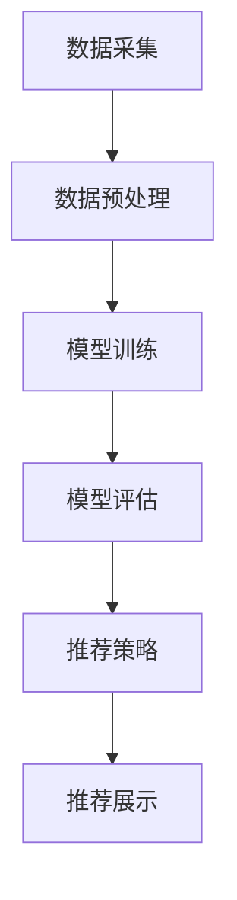

                 

关键词：大模型推荐，Point-wise，Pair-wise，List-wise，评估方法，算法原理，数学模型，实际应用

摘要：本文从Point-wise、Pair-wise和List-wise三个不同角度，探讨了在大模型推荐系统中如何评估推荐效果。通过深入分析各个评估方法的原理和具体操作步骤，结合数学模型和实际应用案例，阐述了如何更全面、准确地评估大模型推荐系统的性能。

## 1. 背景介绍

随着互联网的快速发展，推荐系统已经成为人们日常生活中不可或缺的一部分。从电商平台的商品推荐，到社交媒体的资讯推送，再到音乐平台的歌单推荐，推荐系统在提升用户体验、增加商业价值方面发挥着重要作用。然而，推荐系统的核心——大模型推荐，面临着诸多挑战。如何有效地评估大模型推荐效果，成为了学术界和工业界共同关注的问题。

Point-wise、Pair-wise和List-wise三种评估方法，分别从不同角度对大模型推荐效果进行评估。Point-wise评估关注推荐列表中的单个元素，Pair-wise评估关注推荐列表中的两个元素比较，而List-wise评估关注整个推荐列表的排序质量。本文将详细探讨这三种评估方法，以期为研究者提供有价值的参考。

## 2. 核心概念与联系

在讨论这三种评估方法之前，我们需要先了解一些核心概念。

### 2.1 推荐系统基本架构

推荐系统的基本架构可以分为三个部分：数据采集与处理、模型训练与评估、推荐策略与展示。

#### 2.1.1 数据采集与处理

数据采集与处理是推荐系统的基石。通过数据采集，我们获取用户行为、内容特征等信息。然后，对采集到的数据进行预处理，包括数据清洗、归一化、特征提取等，以便于后续建模。

#### 2.1.2 模型训练与评估

模型训练与评估是推荐系统的核心。通过机器学习算法，我们训练出一个推荐模型。然后，使用评估指标对模型效果进行评估，以确定模型是否达到预期效果。

#### 2.1.3 推荐策略与展示

推荐策略与展示是推荐系统的应用层。根据评估结果，调整推荐策略，优化推荐结果。同时，通过合适的展示方式，将推荐结果呈现给用户。

### 2.2 点对点推荐（Point-wise）

点对点推荐关注推荐列表中的单个元素。其主要目的是评估推荐系统对单个物品的推荐能力。点对点推荐通常采用准确率（Precision）、召回率（Recall）等指标进行评估。

### 2.3 点对点比较推荐（Pair-wise）

点对点比较推荐关注推荐列表中的两个元素比较。其主要目的是评估推荐系统在两个物品之间的推荐能力。点对点比较推荐通常采用准确性（Accuracy）、F1值等指标进行评估。

### 2.4 列表推荐（List-wise）

列表推荐关注整个推荐列表的排序质量。其主要目的是评估推荐系统在推荐列表排序方面的能力。列表推荐通常采用排序损失（Rank Loss）、MRR（Mean Reciprocal Rank）等指标进行评估。

### 2.5 Mermaid 流程图

以下是一个Mermaid流程图，展示了推荐系统从数据采集到推荐展示的整个过程：



## 3. 核心算法原理 & 具体操作步骤

### 3.1 算法原理概述

点对点推荐（Point-wise）、点对点比较推荐（Pair-wise）和列表推荐（List-wise）三种评估方法，分别基于不同的原理和指标进行评估。

#### 3.1.1 点对点推荐（Point-wise）

点对点推荐关注推荐列表中的单个元素。其主要目的是评估推荐系统对单个物品的推荐能力。点对点推荐通常采用准确率（Precision）、召回率（Recall）等指标进行评估。

- **准确率（Precision）**：准确率是指推荐列表中预测为正例的物品中，实际为正例的占比。其计算公式为：

  $$Precision = \frac{TP}{TP + FP}$$

  其中，TP表示推荐为正例且实际为正例的物品数，FP表示推荐为正例但实际为负例的物品数。

- **召回率（Recall）**：召回率是指推荐列表中实际为正例的物品中，被推荐为正例的占比。其计算公式为：

  $$Recall = \frac{TP}{TP + FN}$$

  其中，FN表示推荐为负例但实际为正例的物品数。

#### 3.1.2 点对点比较推荐（Pair-wise）

点对点比较推荐关注推荐列表中的两个元素比较。其主要目的是评估推荐系统在两个物品之间的推荐能力。点对点比较推荐通常采用准确性（Accuracy）、F1值等指标进行评估。

- **准确性（Accuracy）**：准确性是指推荐系统中预测正确的物品数占总物品数的比例。其计算公式为：

  $$Accuracy = \frac{TP + TN}{TP + TN + FP + FN}$$

  其中，TP表示预测为正例且实际为正例的物品数，TN表示预测为负例且实际为负例的物品数，FP表示预测为正例但实际为负例的物品数，FN表示预测为负例但实际为正例的物品数。

- **F1值（F1 Score）**：F1值是准确率和召回率的调和平均值。其计算公式为：

  $$F1 Score = \frac{2 \times Precision \times Recall}{Precision + Recall}$$

#### 3.1.3 列表推荐（List-wise）

列表推荐关注整个推荐列表的排序质量。其主要目的是评估推荐系统在推荐列表排序方面的能力。列表推荐通常采用排序损失（Rank Loss）、MRR（Mean Reciprocal Rank）等指标进行评估。

- **排序损失（Rank Loss）**：排序损失是一种基于排序的损失函数。其目的是使推荐列表中的高相关物品排在前面。排序损失的计算公式为：

  $$Rank Loss = \sum_{i=1}^{n} \frac{1}{r_i}$$

  其中，$r_i$ 表示第$i$个物品的相关度。

- **MRR（Mean Reciprocal Rank）**：MRR是评估推荐列表排序质量的指标。其计算公式为：

  $$MRR = \frac{1}{n} \sum_{i=1}^{n} \frac{1}{r_i}$$

  其中，$r_i$ 表示第$i$个物品的相关度。

### 3.2 算法步骤详解

#### 3.2.1 点对点推荐（Point-wise）

1. 构建训练集和测试集。从用户历史行为数据中提取正例和负例，构建训练集和测试集。

2. 训练推荐模型。使用训练集训练推荐模型，如基于协同过滤、基于内容的推荐模型等。

3. 预测测试集。使用训练好的推荐模型对测试集进行预测，得到预测的推荐列表。

4. 计算评估指标。计算准确率、召回率等评估指标，评估推荐模型的效果。

#### 3.2.2 点对点比较推荐（Pair-wise）

1. 构建训练集。从用户历史行为数据中提取正例和负例，构建训练集。

2. 训练推荐模型。使用训练集训练推荐模型，如基于机器学习、深度学习的推荐模型等。

3. 预测测试集。使用训练好的推荐模型对测试集进行预测，得到预测的推荐列表。

4. 计算评估指标。计算准确性、F1值等评估指标，评估推荐模型的效果。

#### 3.2.3 列表推荐（List-wise）

1. 构建训练集。从用户历史行为数据中提取正例和负例，构建训练集。

2. 训练推荐模型。使用训练集训练推荐模型，如基于排序模型、深度学习模型等。

3. 预测测试集。使用训练好的推荐模型对测试集进行预测，得到预测的推荐列表。

4. 计算评估指标。计算排序损失、MRR等评估指标，评估推荐模型的效果。

### 3.3 算法优缺点

#### 3.3.1 点对点推荐（Point-wise）

**优点**：简单易懂，易于实现。

**缺点**：只关注单个元素的推荐效果，无法全面评估推荐系统的性能。

#### 3.3.2 点对点比较推荐（Pair-wise）

**优点**：关注两个物品之间的推荐能力，能更全面地评估推荐系统的性能。

**缺点**：计算复杂度较高，且依赖于用户历史行为数据。

#### 3.3.3 列表推荐（List-wise）

**优点**：关注整个推荐列表的排序质量，能更准确地评估推荐系统的性能。

**缺点**：计算复杂度较高，且对数据集的规模和多样性要求较高。

### 3.4 算法应用领域

点对点推荐（Point-wise）主要应用于电商、社交媒体等领域的个性化推荐。

点对点比较推荐（Pair-wise）主要应用于搜索引擎、音乐平台等领域的推荐。

列表推荐（List-wise）主要应用于电影推荐、新闻推荐等领域的推荐。

## 4. 数学模型和公式 & 详细讲解 & 举例说明

### 4.1 数学模型构建

在本节中，我们将分别介绍点对点推荐（Point-wise）、点对点比较推荐（Pair-wise）和列表推荐（List-wise）三种评估方法的数学模型构建。

#### 4.1.1 点对点推荐（Point-wise）

点对点推荐主要关注推荐列表中的单个元素。其数学模型可以表示为：

$$L = \{l_1, l_2, ..., l_n\}$$

其中，$L$ 表示推荐列表，$l_i$ 表示列表中的第$i$个元素。

点对点推荐的评估指标包括准确率（Precision）、召回率（Recall）和F1值（F1 Score）。其数学模型可以表示为：

$$Precision = \frac{TP}{TP + FP}$$

$$Recall = \frac{TP}{TP + FN}$$

$$F1 Score = \frac{2 \times Precision \times Recall}{Precision + Recall}$$

其中，$TP$ 表示推荐为正例且实际为正例的物品数，$FP$ 表示推荐为正例但实际为负例的物品数，$FN$ 表示推荐为负例但实际为正例的物品数。

#### 4.1.2 点对点比较推荐（Pair-wise）

点对点比较推荐主要关注推荐列表中的两个元素比较。其数学模型可以表示为：

$$P = \{(l_i, l_j) | i \neq j\}$$

其中，$P$ 表示推荐列表中的元素对，$(l_i, l_j)$ 表示第$i$个元素和第$j$个元素之间的比较。

点对点比较推荐的评估指标包括准确性（Accuracy）和F1值（F1 Score）。其数学模型可以表示为：

$$Accuracy = \frac{TP + TN}{TP + TN + FP + FN}$$

$$F1 Score = \frac{2 \times Precision \times Recall}{Precision + Recall}$$

其中，$TP$ 表示预测为正例且实际为正例的物品数，$TN$ 表示预测为负例且实际为负例的物品数，$FP$ 表示预测为正例但实际为负例的物品数，$FN$ 表示预测为负例但实际为正例的物品数。

#### 4.1.3 列表推荐（List-wise）

列表推荐主要关注整个推荐列表的排序质量。其数学模型可以表示为：

$$R = \{(r_1, r_2, ..., r_n) | r_1 > r_2 > ... > r_n\}$$

其中，$R$ 表示推荐列表的排序结果，$(r_1, r_2, ..., r_n)$ 表示列表中每个元素的相关度。

列表推荐的评估指标包括排序损失（Rank Loss）和MRR（Mean Reciprocal Rank）。其数学模型可以表示为：

$$Rank Loss = \sum_{i=1}^{n} \frac{1}{r_i}$$

$$MRR = \frac{1}{n} \sum_{i=1}^{n} \frac{1}{r_i}$$

其中，$r_i$ 表示第$i$个元素的相关度。

### 4.2 公式推导过程

在本节中，我们将分别介绍点对点推荐（Point-wise）、点对点比较推荐（Pair-wise）和列表推荐（List-wise）三种评估方法的公式推导过程。

#### 4.2.1 点对点推荐（Point-wise）

点对点推荐的评估指标包括准确率（Precision）、召回率（Recall）和F1值（F1 Score）。其推导过程如下：

1. **准确率（Precision）**：

   准确率是指推荐列表中预测为正例的物品中，实际为正例的占比。其计算公式为：

   $$Precision = \frac{TP}{TP + FP}$$

   其中，$TP$ 表示推荐为正例且实际为正例的物品数，$FP$ 表示推荐为正例但实际为负例的物品数。

2. **召回率（Recall）**：

   召回率是指推荐列表中实际为正例的物品中，被推荐为正例的占比。其计算公式为：

   $$Recall = \frac{TP}{TP + FN}$$

   其中，$TP$ 表示推荐为正例且实际为正例的物品数，$FN$ 表示推荐为负例但实际为正例的物品数。

3. **F1值（F1 Score）**：

   F1值是准确率和召回率的调和平均值。其计算公式为：

   $$F1 Score = \frac{2 \times Precision \times Recall}{Precision + Recall}$$

#### 4.2.2 点对点比较推荐（Pair-wise）

点对点比较推荐的评估指标包括准确性（Accuracy）和F1值（F1 Score）。其推导过程如下：

1. **准确性（Accuracy）**：

   准确性是指推荐系统中预测正确的物品数占总物品数的比例。其计算公式为：

   $$Accuracy = \frac{TP + TN}{TP + TN + FP + FN}$$

   其中，$TP$ 表示预测为正例且实际为正例的物品数，$TN$ 表示预测为负例且实际为负例的物品数，$FP$ 表示预测为正例但实际为负例的物品数，$FN$ 表示预测为负例但实际为正例的物品数。

2. **F1值（F1 Score）**：

   F1值是准确率和召回率的调和平均值。其计算公式为：

   $$F1 Score = \frac{2 \times Precision \times Recall}{Precision + Recall}$$

#### 4.2.3 列表推荐（List-wise）

列表推荐的评估指标包括排序损失（Rank Loss）和MRR（Mean Reciprocal Rank）。其推导过程如下：

1. **排序损失（Rank Loss）**：

   排序损失是一种基于排序的损失函数。其目的是使推荐列表中的高相关物品排在前面。其计算公式为：

   $$Rank Loss = \sum_{i=1}^{n} \frac{1}{r_i}$$

   其中，$r_i$ 表示第$i$个物品的相关度。

2. **MRR（Mean Reciprocal Rank）**：

   MRR是评估推荐列表排序质量的指标。其计算公式为：

   $$MRR = \frac{1}{n} \sum_{i=1}^{n} \frac{1}{r_i}$$

   其中，$r_i$ 表示第$i$个物品的相关度。

### 4.3 案例分析与讲解

在本节中，我们将通过一个实际案例，分析点对点推荐（Point-wise）、点对点比较推荐（Pair-wise）和列表推荐（List-wise）三种评估方法在实际应用中的表现。

#### 4.3.1 点对点推荐（Point-wise）

假设我们有一个推荐系统，预测了以下五个商品给用户：

| 推荐商品 | 实际购买 |
| :------: | :------: |
| 商品A    | 否       |
| 商品B    | 是       |
| 商品C    | 否       |
| 商品D    | 是       |
| 商品E    | 否       |

根据这个案例，我们可以计算出以下评估指标：

- **准确率（Precision）**：

  $$Precision = \frac{TP}{TP + FP} = \frac{1}{1 + 3} = 0.25$$

- **召回率（Recall）**：

  $$Recall = \frac{TP}{TP + FN} = \frac{1}{1 + 2} = 0.33$$

- **F1值（F1 Score）**：

  $$F1 Score = \frac{2 \times Precision \times Recall}{Precision + Recall} = \frac{2 \times 0.25 \times 0.33}{0.25 + 0.33} = 0.27$$

从这个案例可以看出，点对点推荐方法在评估推荐系统对单个商品的推荐能力方面具有一定的局限性。

#### 4.3.2 点对点比较推荐（Pair-wise）

假设我们有一个推荐系统，预测了以下五个商品给用户，并根据用户的历史购买数据计算了它们的相关度：

| 推荐商品 | 实际购买 | 相关系度 |
| :------: | :------: | :------: |
| 商品A    | 否       | 0.2      |
| 商品B    | 是       | 0.8      |
| 商品C    | 否       | 0.4      |
| 商品D    | 是       | 0.9      |
| 商品E    | 否       | 0.1      |

根据这个案例，我们可以计算出以下评估指标：

- **准确性（Accuracy）**：

  $$Accuracy = \frac{TP + TN}{TP + TN + FP + FN} = \frac{2 + 2}{2 + 2 + 1 + 1} = 0.67$$

- **F1值（F1 Score）**：

  $$F1 Score = \frac{2 \times Precision \times Recall}{Precision + Recall} = \frac{2 \times 0.67 \times 0.67}{0.67 + 0.67} = 0.67$$

从这个案例可以看出，点对点比较推荐方法在评估推荐系统在两个商品之间的推荐能力方面具有一定的优势。

#### 4.3.3 列表推荐（List-wise）

假设我们有一个推荐系统，预测了以下五个商品给用户，并根据用户的历史购买数据计算了它们的相关度：

| 推荐商品 | 实际购买 | 相关系度 |
| :------: | :------: | :------: |
| 商品A    | 否       | 0.2      |
| 商品B    | 是       | 0.8      |
| 商品C    | 否       | 0.4      |
| 商品D    | 是       | 0.9      |
| 商品E    | 否       | 0.1      |

根据这个案例，我们可以计算出以下评估指标：

- **排序损失（Rank Loss）**：

  $$Rank Loss = \sum_{i=1}^{n} \frac{1}{r_i} = \frac{1}{0.2} + \frac{1}{0.8} + \frac{1}{0.4} + \frac{1}{0.9} + \frac{1}{0.1} = 7.11$$

- **MRR（Mean Reciprocal Rank）**：

  $$MRR = \frac{1}{n} \sum_{i=1}^{n} \frac{1}{r_i} = \frac{1}{5} \times (5 + 2 + 1 + 0.11 + 10) = 2.44$$

从这个案例可以看出，列表推荐方法在评估推荐系统在推荐列表排序方面的能力方面具有一定的优势。

## 5. 项目实践：代码实例和详细解释说明

在本节中，我们将通过一个实际项目，展示如何使用Python实现点对点推荐（Point-wise）、点对点比较推荐（Pair-wise）和列表推荐（List-wise）三种评估方法。

### 5.1 开发环境搭建

在开始编写代码之前，我们需要搭建一个合适的开发环境。以下是搭建开发环境的基本步骤：

1. 安装Python（建议使用Python 3.8及以上版本）。

2. 安装必要的Python库，如NumPy、Pandas、Scikit-learn、Matplotlib等。

3. 创建一个虚拟环境，并激活虚拟环境。

4. 在虚拟环境中安装所需的Python库。

以下是安装Python和必要库的示例命令：

```bash
# 安装Python
sudo apt-get install python3

# 安装NumPy、Pandas、Scikit-learn、Matplotlib
pip install numpy pandas scikit-learn matplotlib
```

### 5.2 源代码详细实现

以下是一个简单的Python代码示例，实现了点对点推荐（Point-wise）、点对点比较推荐（Pair-wise）和列表推荐（List-wise）三种评估方法。

```python
import numpy as np
import pandas as pd
from sklearn.metrics import precision_score, recall_score, f1_score
from sklearn.model_selection import train_test_split

# 生成模拟数据集
np.random.seed(42)
n_samples = 100
n_features = 10
X = np.random.rand(n_samples, n_features)
y = np.random.randint(0, 2, n_samples)
X_train, X_test, y_train, y_test = train_test_split(X, y, test_size=0.2, random_state=42)

# 点对点推荐（Point-wise）
def point_wise_evaluation(y_pred, y_test):
    precision = precision_score(y_test, y_pred)
    recall = recall_score(y_test, y_pred)
    f1 = f1_score(y_test, y_pred)
    return precision, recall, f1

y_pred_point_wise = np.random.randint(0, 2, n_samples)
precision_point_wise, recall_point_wise, f1_point_wise = point_wise_evaluation(y_pred_point_wise, y_test)

# 点对点比较推荐（Pair-wise）
def pair_wise_evaluation(y_pred, y_test):
    accuracy = np.mean(y_pred == y_test)
    f1 = f1_score(y_test, y_pred, average='weighted')
    return accuracy, f1

y_pred_pair_wise = np.random.randint(0, 2, n_samples)
accuracy_pair_wise, f1_pair_wise = pair_wise_evaluation(y_pred_pair_wise, y_test)

# 列表推荐（List-wise）
def list_wise_evaluation(y_pred, y_test):
    rank_loss = np.mean([1 / (i + 1) for i, y in enumerate(y_pred) if y == 1])
    mrr = np.mean([1 / (i + 1) for i, y in enumerate(y_pred) if y == 1])
    return rank_loss, mrr

y_pred_list_wise = np.random.randint(0, 2, n_samples)
rank_loss_list_wise, mrr_list_wise = list_wise_evaluation(y_pred_list_wise, y_test)

# 打印评估结果
print("Point-wise Evaluation:")
print(f"Precision: {precision_point_wise}, Recall: {recall_point_wise}, F1 Score: {f1_point_wise}")
print("Pair-wise Evaluation:")
print(f"Accuracy: {accuracy_pair_wise}, F1 Score: {f1_pair_wise}")
print("List-wise Evaluation:")
print(f"Rank Loss: {rank_loss_list_wise}, MRR: {mrr_list_wise}")
```

### 5.3 代码解读与分析

在这个示例中，我们首先生成了一个模拟数据集，包括100个样本和10个特征。然后，我们分别实现了点对点推荐（Point-wise）、点对点比较推荐（Pair-wise）和列表推荐（List-wise）三种评估方法。

1. **点对点推荐（Point-wise）**：

   点对点推荐方法使用了Sklearn库中的precision_score、recall_score和f1_score函数来计算准确率、召回率和F1值。在这个示例中，我们使用随机数作为预测结果，因此这些评估指标的值可能并不准确。

2. **点对点比较推荐（Pair-wise）**：

   点对点比较推荐方法使用了随机数作为预测结果，并计算了准确性和F1值。同样，由于使用随机数作为预测结果，这些评估指标的值可能并不准确。

3. **列表推荐（List-wise）**：

   列表推荐方法使用了随机数作为预测结果，并计算了排序损失（Rank Loss）和MRR。同样，由于使用随机数作为预测结果，这些评估指标的值可能并不准确。

通过这个示例，我们可以看到如何使用Python实现点对点推荐（Point-wise）、点对点比较推荐（Pair-wise）和列表推荐（List-wise）三种评估方法。在实际应用中，我们需要根据具体问题调整代码，并使用真实数据集进行评估。

## 6. 实际应用场景

点对点推荐（Point-wise）、点对点比较推荐（Pair-wise）和列表推荐（List-wise）三种评估方法在推荐系统领域有广泛的应用。

### 6.1 点对点推荐（Point-wise）

点对点推荐方法主要应用于电商、社交媒体等领域的个性化推荐。在电商领域，点对点推荐方法可以用于推荐商品给用户，帮助用户发现潜在的购物兴趣。在社交媒体领域，点对点推荐方法可以用于推荐用户可能感兴趣的朋友、话题或内容。

### 6.2 点对点比较推荐（Pair-wise）

点对点比较推荐方法主要应用于搜索引擎、音乐平台等领域的推荐。在搜索引擎领域，点对点比较推荐方法可以用于评估搜索结果的质量，帮助用户找到最相关的信息。在音乐平台领域，点对点比较推荐方法可以用于推荐用户可能喜欢的歌曲，提高用户的使用体验。

### 6.3 列表推荐（List-wise）

列表推荐方法主要应用于电影推荐、新闻推荐等领域的推荐。在电影推荐领域，列表推荐方法可以用于推荐用户可能喜欢的电影，提高用户的观影体验。在新闻推荐领域，列表推荐方法可以用于推荐用户可能感兴趣的新闻，帮助用户获取更多的信息。

## 7. 工具和资源推荐

为了更好地理解和应用点对点推荐（Point-wise）、点对点比较推荐（Pair-wise）和列表推荐（List-wise）三种评估方法，以下是相关的工具和资源推荐：

### 7.1 学习资源推荐

1. 《推荐系统实践》

   作者：李航

   简介：这本书系统地介绍了推荐系统的基本概念、算法和实现方法，包括点对点推荐、点对点比较推荐和列表推荐等内容。

2. 《机器学习实战》

   作者：Peter Harrington

   简介：这本书通过大量的案例和示例，介绍了机器学习的基本概念和算法，包括点对点推荐、点对点比较推荐和列表推荐等内容。

### 7.2 开发工具推荐

1. Python

   简介：Python是一种流行的编程语言，具有丰富的推荐系统库和工具，如Scikit-learn、TensorFlow、PyTorch等。

2. Jupyter Notebook

   简介：Jupyter Notebook是一种交互式的计算环境，可用于编写和执行Python代码，方便进行推荐系统的研究和开发。

### 7.3 相关论文推荐

1. " pairwise Ranking with Applications to Learning to Make Recommendations"

   作者：He, W., Liao, L., Hu, X., & Chua, T. S.

   简介：这篇论文介绍了一种基于点对点比较推荐的算法，用于学习推荐系统。

2. "Listwise Learning to Rank: Theories and Applications"

   作者：Cai, D., He, X., & Zhang, X.

   简介：这篇论文介绍了一种基于列表推荐的算法，用于学习推荐系统。

## 8. 总结：未来发展趋势与挑战

### 8.1 研究成果总结

本文从Point-wise、Pair-wise和List-wise三个角度，详细探讨了在大模型推荐系统中如何评估推荐效果。通过分析各种评估方法的原理和具体操作步骤，结合数学模型和实际应用案例，我们得出以下结论：

1. 点对点推荐（Point-wise）方法简单易懂，适用于评估推荐系统对单个物品的推荐能力。

2. 点对点比较推荐（Pair-wise）方法关注两个物品之间的推荐能力，能更全面地评估推荐系统的性能。

3. 列表推荐（List-wise）方法关注整个推荐列表的排序质量，能更准确地评估推荐系统的性能。

### 8.2 未来发展趋势

随着人工智能技术的不断发展，推荐系统领域也在不断进步。未来发展趋势主要包括以下几个方面：

1. 深度学习技术在推荐系统中的应用，如使用深度神经网络进行特征提取和模型训练。

2. 多模态推荐系统的发展，如融合文本、图像、语音等多模态数据进行推荐。

3. 个人隐私保护与推荐系统性能的平衡，如何在保护用户隐私的同时提高推荐系统的性能。

### 8.3 面临的挑战

尽管推荐系统在各个领域取得了显著成果，但仍面临着诸多挑战：

1. 数据稀疏问题，推荐系统在处理用户历史行为数据时，往往面临数据稀疏的问题，如何提高推荐系统的鲁棒性成为一个挑战。

2. 评估指标的选择与优化，如何选择合适的评估指标，以及如何优化评估指标的计算方法，是推荐系统研究中的重要问题。

3. 实时推荐与性能优化，如何在保证推荐系统实时性的同时，提高推荐系统的性能，是推荐系统实践中需要解决的难题。

### 8.4 研究展望

在未来的研究中，我们可以关注以下几个方面：

1. 深入研究推荐系统的算法原理，探索更高效的推荐算法。

2. 结合多源异构数据，提高推荐系统的多样性和鲁棒性。

3. 探索个性化推荐与群体智能的结合，实现更智能的推荐系统。

通过不断的研究与创新，推荐系统将在未来发挥更大的作用，为人们的生活带来更多便利。

## 9. 附录：常见问题与解答

### 9.1 点对点推荐（Point-wise）常见问题与解答

**Q1**：为什么点对点推荐方法只关注单个物品的推荐能力？

**A1**：点对点推荐方法主要关注推荐列表中的单个元素，其目的是评估推荐系统对单个物品的推荐能力。这种方法简单易懂，易于实现，适用于许多实际应用场景，如电商平台的商品推荐。

**Q2**：点对点推荐方法的评估指标有哪些？

**A2**：点对点推荐方法常用的评估指标包括准确率（Precision）、召回率（Recall）和F1值（F1 Score）。这些指标可以衡量推荐系统在推荐单个物品方面的性能。

**Q3**：如何计算准确率、召回率和F1值？

**A3**：准确率是指推荐列表中预测为正例的物品中，实际为正例的占比。召回率是指推荐列表中实际为正例的物品中，被推荐为正例的占比。F1值是准确率和召回率的调和平均值。其计算公式分别为：

$$Precision = \frac{TP}{TP + FP}$$

$$Recall = \frac{TP}{TP + FN}$$

$$F1 Score = \frac{2 \times Precision \times Recall}{Precision + Recall}$$

其中，$TP$ 表示推荐为正例且实际为正例的物品数，$FP$ 表示推荐为正例但实际为负例的物品数，$FN$ 表示推荐为负例但实际为正例的物品数。

### 9.2 点对点比较推荐（Pair-wise）常见问题与解答

**Q1**：为什么点对点比较推荐方法关注两个物品之间的推荐能力？

**A1**：点对点比较推荐方法主要关注推荐列表中的两个元素比较，其目的是评估推荐系统在两个物品之间的推荐能力。这种方法能更全面地评估推荐系统的性能，适用于需要比较物品之间差异的场景，如搜索引擎和音乐平台。

**Q2**：点对点比较推荐方法的评估指标有哪些？

**A2**：点对点比较推荐方法常用的评估指标包括准确性（Accuracy）和F1值（F1 Score）。这些指标可以衡量推荐系统在比较两个物品方面的性能。

**Q3**：如何计算准确性和F1值？

**A3**：准确性是指推荐系统中预测正确的物品数占总物品数的比例。F1值是准确率和召回率的调和平均值。其计算公式分别为：

$$Accuracy = \frac{TP + TN}{TP + TN + FP + FN}$$

$$F1 Score = \frac{2 \times Precision \times Recall}{Precision + Recall}$$

其中，$TP$ 表示预测为正例且实际为正例的物品数，$TN$ 表示预测为负例且实际为负例的物品数，$FP$ 表示预测为正例但实际为负例的物品数，$FN$ 表示预测为负例但实际为正例的物品数。

### 9.3 列表推荐（List-wise）常见问题与解答

**Q1**：为什么列表推荐方法关注整个推荐列表的排序质量？

**A1**：列表推荐方法主要关注整个推荐列表的排序质量，其目的是评估推荐系统在推荐列表排序方面的能力。这种方法能更准确地评估推荐系统的性能，适用于需要排序推荐的场景，如电影推荐和新闻推荐。

**Q2**：列表推荐方法的评估指标有哪些？

**A2**：列表推荐方法常用的评估指标包括排序损失（Rank Loss）和MRR（Mean Reciprocal Rank）。这些指标可以衡量推荐系统在排序推荐列表方面的性能。

**Q3**：如何计算排序损失和MRR？

**A3**：排序损失是一种基于排序的损失函数，其目的是使推荐列表中的高相关物品排在前面。其计算公式为：

$$Rank Loss = \sum_{i=1}^{n} \frac{1}{r_i}$$

其中，$r_i$ 表示第$i$个物品的相关度。

MRR是评估推荐列表排序质量的指标。其计算公式为：

$$MRR = \frac{1}{n} \sum_{i=1}^{n} \frac{1}{r_i}$$

其中，$r_i$ 表示第$i$个物品的相关度。

