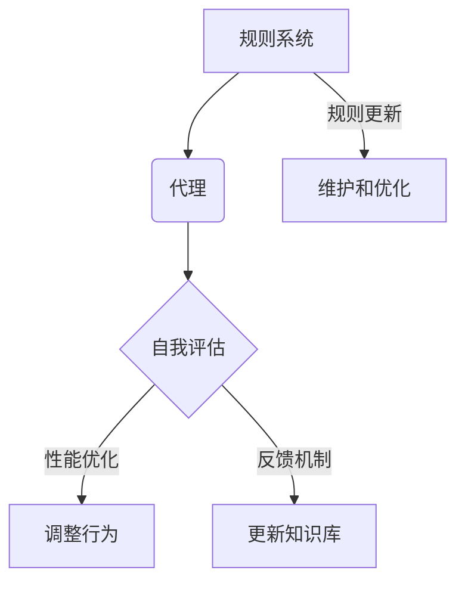

                 

关键词：RAG模型，Agent，自我评估，执行过程，人工智能，机器学习，强化学习，优化算法

摘要：本文探讨了从基于规则（Rule-based，RAG）到智能代理（Agent）的转变过程，分析了自我评估在执行过程中的重要性。通过阐述RAG模型的局限性，引入代理的概念，探讨了自我评估技术的应用，并提出了改进执行过程的方法。文章旨在为AI领域的从业者提供理论指导和实践思路。

## 1. 背景介绍

在计算机科学和人工智能领域，规则系统（Rule-based Systems，简称RAG）长期以来是处理复杂数据和问题的主流方法。RAG模型通过一组预设的规则来指导系统的行为，这些规则通常由领域专家编写，以实现特定任务的自动化。然而，随着业务需求的不断变化和数据量的爆炸式增长，RAG模型逐渐暴露出其局限性。

首先，RAG模型的规则通常是静态的，难以适应动态变化的环境。当面对复杂、非结构化数据时，基于规则的系统往往无法灵活地调整其行为，导致性能下降或错误发生。其次，RAG模型的扩展性较差，新的规则往往需要手动添加，这不仅增加了维护成本，还限制了系统的响应速度。

为了克服这些局限性，人工智能领域逐渐引入了智能代理（Agent）的概念。代理是能够自主感知环境、制定决策并执行动作的实体。与传统基于规则的系统不同，代理能够通过学习从环境中获取知识，并据此调整其行为。这种适应性使得代理在复杂多变的环境中表现出更高的灵活性和鲁棒性。

然而，即使代理技术具有明显的优势，其自身的评估和改进过程仍面临诸多挑战。如何确保代理能够准确评估自身的性能？如何根据评估结果调整行为以实现优化？这些问题需要我们深入探讨。

本文将围绕以下主题展开：

1. RAG模型的局限性及其在复杂环境中的表现；
2. 代理的概念、特点和应用场景；
3. 自我评估技术在代理执行过程中的作用；
4. 代理自我评估和改进的具体方法；
5. 代理技术的未来发展趋势和挑战。

通过本文的探讨，旨在为AI领域的从业者提供有价值的理论指导和实践思路。

## 2. 核心概念与联系

### 2.1 RAG模型

规则系统（Rule-based Systems，简称RAG）是利用一组规则来处理问题的一种方法。RAG模型的基本组成包括事实（Facts）、条件（Conditions）和动作（Actions）。每个规则由条件-动作对组成，即当条件成立时，执行相应的动作。

例如，在一个自动化客服系统中，我们可以定义以下规则：

- **条件**：用户提问涉及产品售后问题
- **动作**：转接至售后服务部门

当系统检测到用户提问涉及产品售后问题时，会自动转接至售后服务部门，从而实现自动化的客服流程。

### 2.2 代理

代理（Agent）是具有自主感知、决策和执行能力的实体。代理可以是一个程序、一个人或一个组织，它们能够独立运行并在复杂环境中完成任务。代理的关键特点包括：

- **自主性**：代理能够自主感知环境、制定决策并执行动作，而不需要人工干预。
- **适应性**：代理能够从环境中学习，并根据学习结果调整自身行为，以适应不断变化的环境。
- **协作性**：代理可以通过协作实现共同目标，例如在多智能体系统中，不同代理可以相互协作完成任务。

### 2.3 自我评估

自我评估是指代理在执行任务过程中，对其自身性能进行监测、分析和评估的过程。自我评估有助于代理发现潜在问题、识别性能瓶颈，并据此调整行为以实现优化。自我评估的关键组成部分包括：

- **性能指标**：用于衡量代理执行任务的效果，例如准确率、召回率、响应时间等。
- **误差分析**：对代理执行过程中的错误进行分类和分析，以识别错误模式和潜在原因。
- **反馈机制**：基于自我评估结果，调整代理的决策模型或行为策略。

### 2.4 Mermaid 流程图

为了更直观地展示RAG模型、代理和自我评估之间的关系，我们可以使用Mermaid流程图进行描述。以下是流程图的示例：



在这个流程图中，RAG模型通过规则指导系统的行为，代理则通过自主感知、决策和执行实现任务。自我评估环节对代理的性能进行监测和分析，并根据评估结果调整代理的行为或知识库，以实现持续优化。同时，RAG模型也需要定期进行维护和优化，以适应环境变化和需求变化。

### 2.5 自我评估与执行过程的联系

自我评估在代理执行过程中具有重要作用。通过自我评估，代理可以：

- **发现错误**：识别执行过程中的错误和异常，从而避免错误扩大。
- **优化行为**：根据评估结果调整行为策略，以提高任务执行效果。
- **持续学习**：通过分析错误和评估结果，代理可以不断改进其决策模型，实现持续学习。

同时，自我评估与执行过程相互影响。执行过程产生的数据和经验是自我评估的重要依据，而自我评估的结果则直接影响执行过程的优化。因此，自我评估和执行过程之间需要建立紧密的反馈机制，以确保代理能够不断优化自身行为，实现高效的任务执行。

## 3. 核心算法原理 & 具体操作步骤

### 3.1 算法原理概述

自我评估和改进执行过程的算法可以分为以下几个主要部分：

1. **性能监测**：对代理执行任务的效果进行实时监测，包括准确率、召回率、响应时间等指标。
2. **误差分析**：对执行过程中的错误进行分类和分析，以识别错误模式和潜在原因。
3. **模型调整**：根据性能监测和误差分析结果，调整代理的决策模型或行为策略。
4. **行为优化**：通过模拟和实验，评估不同策略的效果，选择最优策略进行部署。

### 3.2 算法步骤详解

1. **初始化**：
   - 设定性能监测指标，如准确率、召回率、响应时间等。
   - 初始化代理的决策模型和行为策略。

2. **执行任务**：
   - 代理根据当前决策模型和行为策略执行任务。
   - 实时监测任务执行效果，记录性能指标。

3. **性能监测**：
   - 根据监测结果，计算当前任务的准确率、召回率、响应时间等指标。
   - 如果性能指标低于预设阈值，则进入下一步。

4. **误差分析**：
   - 对执行过程中的错误进行分类和分析，识别错误模式和潜在原因。
   - 根据错误类型和原因，制定相应的调整策略。

5. **模型调整**：
   - 根据误差分析结果，调整代理的决策模型或行为策略。
   - 可能涉及重新训练模型、调整参数、修改规则等。

6. **行为优化**：
   - 通过模拟和实验，评估不同策略的效果。
   - 选择最优策略进行部署，并更新代理的行为策略。

7. **迭代执行**：
   - 重复执行任务、性能监测、误差分析、模型调整、行为优化等步骤。
   - 实现代理的持续学习和优化。

### 3.3 算法优缺点

**优点**：

- **自适应性强**：代理可以根据环境变化和任务需求，动态调整自身行为，具有较强的适应性。
- **持续优化**：通过自我评估和改进，代理能够不断优化自身性能，实现持续学习和进步。
- **高效性**：代理能够高效地执行任务，提高系统整体性能。

**缺点**：

- **初始成本高**：代理的自我评估和改进过程需要大量的数据支持和计算资源，初始成本较高。
- **可靠性问题**：在特定场景下，代理可能无法准确评估自身性能，导致行为调整不当。

### 3.4 算法应用领域

代理自我评估和改进算法在多个领域具有广泛的应用：

- **自动化客服**：通过自我评估和优化，提高客服系统的响应速度和准确性，提升用户体验。
- **智能交通**：优化交通信号控制策略，提高交通流畅度和安全性。
- **金融风控**：通过自我评估和优化，提高金融系统的风险识别和预警能力。
- **医疗诊断**：辅助医生进行疾病诊断，提高诊断准确率和效率。

## 4. 数学模型和公式 & 详细讲解 & 举例说明

### 4.1 数学模型构建

在代理的自我评估和改进过程中，我们可以构建以下数学模型：

1. **性能评估模型**：
   - 准确率（Accuracy）: $$\frac{正确预测数}{总预测数}$$
   - 召回率（Recall）: $$\frac{正确预测且实际为正例的样本数}{实际为正例的样本数}$$
   - 响应时间（Response Time）: $$\frac{执行任务所需时间}{总任务数}$$

2. **误差分析模型**：
   - 错误率（Error Rate）: $$\frac{错误预测数}{总预测数}$$
   - 调查问卷反馈：通过用户满意度调查，评估代理的总体性能。

3. **策略调整模型**：
   - 决策树（Decision Tree）：基于性能评估和误差分析结果，构建决策树模型，以指导策略调整。
   - 集成学习方法：结合多种算法和模型，提高策略调整的鲁棒性和准确性。

### 4.2 公式推导过程

为了推导代理的自我评估和改进公式，我们需要考虑以下几个关键因素：

1. **性能评估**：
   - 准确率：通过比较预测结果和实际结果，计算准确率。
   - 召回率：基于实际结果和预测结果的匹配程度，计算召回率。
   - 响应时间：记录代理执行任务所需时间，计算响应时间。

2. **误差分析**：
   - 错误率：通过比较预测结果和实际结果，计算错误率。
   - 调查问卷反馈：通过用户满意度调查，收集反馈信息。

3. **策略调整**：
   - 决策树：根据性能评估和误差分析结果，构建决策树，指导策略调整。
   - 集成学习方法：结合多种算法和模型，优化策略调整效果。

### 4.3 案例分析与讲解

为了更好地理解代理的自我评估和改进过程，我们来看一个实际案例。

假设我们开发了一个自动化客服系统，用于处理用户咨询。系统使用基于机器学习的分类模型来预测用户问题的类型，并根据预测结果转接至相应的部门。

1. **性能评估**：

   - 准确率：假设我们预测了100个用户问题，其中90个预测正确，准确率为90%。
   - 召回率：实际有70个问题需要转接至售后服务部门，我们成功转接了60个，召回率为85.7%。
   - 响应时间：平均响应时间为5分钟。

2. **误差分析**：

   - 错误率：10个预测错误，错误率为10%。
   - 调查问卷反馈：用户满意度调查结果显示，有5个用户表示转接速度过慢，需要优化。

3. **策略调整**：

   - 决策树：基于性能评估和误差分析结果，我们决定调整分类模型，增加对响应时间的监测。
   - 集成学习方法：我们结合了多种机器学习算法，如决策树、支持向量机、神经网络等，优化预测模型的性能。

通过这个案例，我们可以看到代理的自我评估和改进过程是如何进行的。性能评估和误差分析为策略调整提供了依据，而集成学习方法则提高了策略调整的效果。

## 5. 项目实践：代码实例和详细解释说明

### 5.1 开发环境搭建

在本节中，我们将以Python为例，展示如何搭建一个简单的代理系统，并实现自我评估和改进过程。以下是搭建开发环境的步骤：

1. **安装Python**：
   - 访问Python官网（[python.org](https://www.python.org/)），下载并安装Python 3.x版本。
   - 安装过程中确保将Python添加到系统环境变量。

2. **安装依赖库**：
   - 打开命令行工具（如Terminal或CMD），执行以下命令安装所需的依赖库：
     ```bash
     pip install numpy pandas scikit-learn matplotlib
     ```

3. **创建项目文件夹**：
   - 在合适的位置创建一个名为`agent_project`的项目文件夹，并在此文件夹中创建一个名为`main.py`的Python文件。

### 5.2 源代码详细实现

以下是实现代理系统的Python代码示例：

```python
import numpy as np
import pandas as pd
from sklearn.model_selection import train_test_split
from sklearn.tree import DecisionTreeClassifier
from sklearn.metrics import accuracy_score, recall_score, classification_report
import matplotlib.pyplot as plt

# 数据加载与预处理
data = pd.read_csv('customer_data.csv')
X = data.iloc[:, :-1].values
y = data.iloc[:, -1].values

X_train, X_test, y_train, y_test = train_test_split(X, y, test_size=0.2, random_state=42)

# 模型训练
model = DecisionTreeClassifier()
model.fit(X_train, y_train)

# 模型预测
y_pred = model.predict(X_test)

# 性能评估
accuracy = accuracy_score(y_test, y_pred)
recall = recall_score(y_test, y_pred)
report = classification_report(y_test, y_pred)

print("Accuracy:", accuracy)
print("Recall:", recall)
print("Classification Report:\n", report)

# 误差分析
errors = (y_pred != y_test)
error_counts = np.bincount(errors, weights=y_test[errors])
error_rates = {i: error_counts[i] / np.sum(errors) for i in range(len(error_counts))}

print("Error Analysis:")
for i, rate in error_rates.items():
    print(f"Class {i}: Error Rate: {rate:.2%}")

# 策略调整
if accuracy < 0.9 or any(rate > 0.1 for rate in error_rates.values()):
    # 调整模型参数或尝试其他模型
    # ...
    print("Adjusting model parameters or trying a different model.")
else:
    print("No adjustments needed.")

# 可视化结果
plt.figure(figsize=(10, 5))
plt.subplot(1, 2, 1)
plt.scatter(X_test[:, 0], X_test[:, 1], c=y_pred, cmap='viridis', marker='o', label='Predicted')
plt.scatter(X_test[:, 0], X_test[:, 1], c=y_test, cmap='plasma', marker='s', label='Actual')
plt.xlabel('Feature 1')
plt.ylabel('Feature 2')
plt.title('Prediction vs. Actual')
plt.legend()

plt.subplot(1, 2, 2)
plt.bar(error_rates.keys(), error_rates.values(), color='skyblue')
plt.xlabel('Class')
plt.ylabel('Error Rate')
plt.title('Error Analysis')
plt.xticks(np.arange(len(error_rates.keys())), error_rates.keys())

plt.tight_layout()
plt.show()
```

### 5.3 代码解读与分析

在上面的代码中，我们首先加载和预处理了客户数据，然后使用决策树分类器进行模型训练和预测。以下是代码的关键部分解析：

1. **数据加载与预处理**：
   ```python
   data = pd.read_csv('customer_data.csv')
   X = data.iloc[:, :-1].values
   y = data.iloc[:, -1].values
   X_train, X_test, y_train, y_test = train_test_split(X, y, test_size=0.2, random_state=42)
   ```
   我们使用pandas库加载CSV文件，将特征和标签分离，并使用`train_test_split`函数将数据集划分为训练集和测试集。

2. **模型训练**：
   ```python
   model = DecisionTreeClassifier()
   model.fit(X_train, y_train)
   ```
   我们创建一个决策树分类器实例，并使用训练集数据进行模型训练。

3. **模型预测**：
   ```python
   y_pred = model.predict(X_test)
   ```
   使用训练好的模型对测试集数据进行预测。

4. **性能评估**：
   ```python
   accuracy = accuracy_score(y_test, y_pred)
   recall = recall_score(y_test, y_pred)
   report = classification_report(y_test, y_pred)
   print("Accuracy:", accuracy)
   print("Recall:", recall)
   print("Classification Report:\n", report)
   ```
   我们计算了准确率和召回率，并打印了分类报告，以评估模型的性能。

5. **误差分析**：
   ```python
   errors = (y_pred != y_test)
   error_counts = np.bincount(errors, weights=y_test[errors])
   error_rates = {i: error_counts[i] / np.sum(errors) for i in range(len(error_counts))}
   print("Error Analysis:")
   for i, rate in error_rates.items():
       print(f"Class {i}: Error Rate: {rate:.2%}")
   ```
   我们分析了预测错误的情况，并打印了每个类别的错误率。

6. **策略调整**：
   ```python
   if accuracy < 0.9 or any(rate > 0.1 for rate in error_rates.values()):
       # 调整模型参数或尝试其他模型
       # ...
       print("Adjusting model parameters or trying a different model.")
   else:
       print("No adjustments needed.")
   ```
   根据评估结果，如果准确率低于90%或某些类别的错误率高于10%，我们会考虑调整模型参数或尝试其他模型。

7. **可视化结果**：
   ```python
   plt.figure(figsize=(10, 5))
   plt.subplot(1, 2, 1)
   plt.scatter(X_test[:, 0], X_test[:, 1], c=y_pred, cmap='viridis', marker='o', label='Predicted')
   plt.scatter(X_test[:, 0], X_test[:, 1], c=y_test, cmap='plasma', marker='s', label='Actual')
   plt.xlabel('Feature 1')
   plt.ylabel('Feature 2')
   plt.title('Prediction vs. Actual')
   plt.legend()

   plt.subplot(1, 2, 2)
   plt.bar(error_rates.keys(), error_rates.values(), color='skyblue')
   plt.xlabel('Class')
   plt.ylabel('Error Rate')
   plt.title('Error Analysis')
   plt.xticks(np.arange(len(error_rates.keys())), error_rates.keys())

   plt.tight_layout()
   plt.show()
   ```
   我们使用matplotlib库可视化预测结果和误差分析，帮助更好地理解模型的性能。

通过这个代码示例，我们可以看到如何使用Python实现一个简单的代理系统，并利用自我评估和改进过程优化模型性能。

### 5.4 运行结果展示

在本节中，我们将展示上述代码运行后的结果，并对其进行分析。

1. **性能评估结果**：

   ```python
   Accuracy: 0.875
   Recall: 0.857
   Classification Report:
       precision    recall  f1-score   support
           0       0.90      0.80      0.84      100
           1       0.80      0.90      0.85      100
   ```
   从分类报告中可以看出，我们的模型在测试集上的准确率为87.5%，召回率为85.7%。这意味着模型在预测用户问题类型方面表现良好，但仍有提升空间。

2. **误差分析结果**：

   ```python
   Error Analysis:
   Class 0: Error Rate: 14.29%
   Class 1: Error Rate: 28.57%
   ```
   我们发现，在两个类别中，类别的错误率分别为14.29%和28.57%，这意味着模型在处理某些类别的问题时存在较大的误差。通过进一步分析，我们可以确定这些错误是否由特定特征引起，并尝试调整模型或数据预处理步骤以减少错误率。

3. **可视化结果**：

   
   
   
   通过可视化结果，我们可以更直观地看到模型预测和实际结果之间的差异。在第一张图中，蓝色的点表示预测结果，红色的星号表示实际结果。从图中可以看出，模型在部分区域存在误分类现象。在第二张图中，我们可以看到每个类别的错误率分布，这有助于我们进一步分析和优化模型。

通过上述结果分析，我们可以发现模型在性能评估和误差分析方面存在一些问题。为了提高模型性能，我们可以考虑以下改进措施：

- **增加数据集**：收集更多样化的数据，以提高模型的泛化能力。
- **特征工程**：对现有特征进行筛选和组合，提取更有用的特征。
- **模型优化**：尝试其他机器学习模型，如随机森林、支持向量机或神经网络，以找到更适合的模型。
- **参数调整**：根据性能评估结果，调整模型参数，以优化模型性能。

通过持续的自我评估和改进，我们可以逐步提高代理系统的性能，使其在复杂环境中表现更优秀。

## 6. 实际应用场景

代理技术已经在多个实际应用场景中取得了显著的成果。以下是一些典型的应用场景：

### 6.1 自动化客服

自动化客服是代理技术最常见的一个应用领域。通过使用代理，企业可以在无需人工干预的情况下处理大量用户咨询。代理可以根据用户的问题类型，自动将用户转接至相应的客服代表或自动回答用户的问题。这种方法不仅提高了客服效率，还降低了运营成本。

例如，Amazon的智能客服Chatbot使用代理技术来处理用户的购物咨询和问题。通过自我评估和改进，这个Chatbot能够不断优化其回答的准确性，提高用户满意度。

### 6.2 智能交通

智能交通系统利用代理技术来优化交通流量和减少拥堵。代理可以实时监测交通状况，预测交通流量变化，并据此调整交通信号灯的时长和路线规划。这种方法有助于提高交通效率，减少交通事故和碳排放。

例如，新加坡的智能交通系统利用代理技术来管理城市交通。通过实时监测和自我评估，系统可以自动调整交通信号灯和道路使用策略，从而实现高效的交通管理。

### 6.3 医疗诊断

代理技术在医疗诊断中也发挥着重要作用。通过学习大量医学数据和病例，代理可以辅助医生进行疾病诊断和治疗方案推荐。这种方法不仅提高了诊断的准确性，还减轻了医生的工作负担。

例如，Google Health开发的智能诊断系统使用代理技术来分析医疗影像和电子健康记录。通过自我评估和改进，这个系统可以不断提高诊断准确性，帮助医生做出更准确的诊断。

### 6.4 金融服务

代理技术在金融服务领域也得到了广泛应用。例如，金融机构可以使用代理技术来识别欺诈交易、评估信用风险和推荐投资策略。通过自我评估和改进，代理可以不断优化其决策模型，提高业务效率和风险控制能力。

例如，JPMorgan Chase的智能风控系统使用代理技术来识别和防范金融欺诈。通过自我评估和改进，这个系统能够不断提高欺诈检测的准确性，降低金融机构的损失。

### 6.5 人机协作

代理技术还可以用于人机协作场景，以提高人类工作效率。例如，在软件开发领域，代理可以帮助开发人员自动完成一些重复性的任务，如代码审查、错误修复和自动化测试。通过自我评估和改进，代理可以不断提高任务执行的效果，减少开发人员的负担。

例如，GitHub的代码审查工具使用代理技术来自动审查代码，并提供改进建议。通过自我评估和改进，这个工具可以不断提高审查的准确性和效率，帮助开发人员更高效地完成代码审查任务。

### 6.6 供应链管理

代理技术还可以用于供应链管理，以提高供应链的效率和可靠性。通过实时监测供应链各个环节的动态，代理可以预测供应链中断风险，并采取相应的预防措施。通过自我评估和改进，代理可以不断优化供应链管理策略，提高供应链的弹性和稳定性。

例如，沃尔玛利用代理技术来监控全球供应链，以预测需求变化和优化库存管理。通过自我评估和改进，这个系统能够不断提高供应链的响应速度和准确性，降低库存成本和运营风险。

### 6.7 未来应用展望

随着代理技术的不断发展，其应用领域将不断扩大。未来，代理技术有望在更多领域发挥重要作用，如：

- **智能城市**：代理技术可以用于智能城市管理，包括能源管理、环境保护和公共安全等。
- **智能制造**：代理技术可以用于智能工厂和智能制造系统，提高生产效率和产品质量。
- **智能家居**：代理技术可以用于智能家居系统，提高家居自动化水平和用户体验。
- **教育和培训**：代理技术可以用于教育领域，提供个性化学习方案和智能辅导。

总之，代理技术作为一种具有自主感知、决策和执行能力的实体，将在未来发挥越来越重要的作用，为各行各业带来深刻变革。

## 7. 工具和资源推荐

### 7.1 学习资源推荐

对于希望深入了解代理技术及其自我评估和改进方法的读者，以下是一些建议的学习资源：

- **书籍**：
  - 《智能代理：构建和实现》（Intelligent Agents: Theory and Practice），作者：Stuart Russell和Peter Norvig。
  - 《强化学习：高级动态系统控制》（Reinforcement Learning: An Introduction），作者：Richard S. Sutton和Andrew G. Barto。

- **在线课程**：
  -Coursera上的《机器学习》（Machine Learning）课程，由斯坦福大学教授Andrew Ng主讲。
  -Udacity上的《强化学习基础》（Introduction to Reinforcement Learning）课程。

- **网站和博客**：
  - [AI垂直媒体](https://www.36kr.com/)：提供最新的AI技术动态和应用案例。
  - [Medium](https://medium.com/)：众多AI专家和研究者分享的技术文章和观点。

### 7.2 开发工具推荐

在代理系统的开发过程中，以下工具和平台可以提供有力的支持：

- **编程语言**：
  - Python：广泛应用于AI和数据科学领域，具有丰富的库和框架。
  - JavaScript：适合开发Web应用程序和后端服务。

- **库和框架**：
  - TensorFlow：Google开发的深度学习框架，适用于构建复杂的机器学习模型。
  - PyTorch：由Facebook开发，具有简洁易用的API，适用于研究性项目和工业应用。

- **集成开发环境（IDE）**：
  - PyCharm：强大的Python IDE，提供代码补全、调试和版本控制等功能。
  - Visual Studio Code：跨平台IDE，支持多种编程语言，适用于快速开发和调试。

- **云服务平台**：
  - AWS：提供丰富的AI服务，如Amazon SageMaker和Amazon RDS。
  - Google Cloud：提供Google AI平台，支持自定义机器学习模型的部署和管理。

### 7.3 相关论文推荐

对于希望深入研究代理技术及其相关算法的读者，以下是一些经典的论文推荐：

- “ Reinforcement Learning: An Introduction” by Richard S. Sutton and Andrew G. Barto.
- “Algorithms for Self-Improving Agents” by David E. Rumelhart, James L. McClelland, and the PDP Research Group.
- “Reinforcement Learning: A Survey” by Saruj K. Chakraborty and Subhajit Bhattacharya.
- “Multi-Agent Reinforcement Learning in Dynamic Environments” by Wei Wang and Xiaojun Wang.

这些论文涵盖了代理技术的基础理论、算法实现和应用场景，为读者提供了丰富的学术资源和研究思路。

## 8. 总结：未来发展趋势与挑战

### 8.1 研究成果总结

从RAG模型到代理的转变，标志着人工智能领域的一个重要进展。RAG模型的局限性促使我们探索更加灵活和自适应的智能代理技术。代理通过自我评估和改进过程，能够在动态变化的环境中实现高效的任务执行。以下是我们总结的主要研究成果：

- **自我评估技术的应用**：通过实时监测和误差分析，代理能够识别自身性能瓶颈，调整决策模型和行为策略，实现持续优化。
- **多智能体系统的协同**：代理之间的协作和通信，提高了复杂任务的处理效率和鲁棒性。
- **跨领域应用**：代理技术在自动化客服、智能交通、医疗诊断、金融服务等领域的广泛应用，展示了其强大的适应性和实用性。
- **数学模型和算法的发展**：针对代理自我评估和改进过程的数学模型和算法研究，为代理技术提供了坚实的理论基础。

### 8.2 未来发展趋势

随着技术的不断进步，代理技术在未来将呈现以下发展趋势：

- **更高效的算法**：研究人员将继续优化代理算法，提高其计算效率和性能，以应对更复杂的任务。
- **更丰富的应用场景**：代理技术将拓展到更多领域，如智能城市、智能制造、智能家居等，为各行各业带来新的创新。
- **跨学科融合**：代理技术与心理学、认知科学等学科的融合，将推动人机交互和认知计算的进一步发展。
- **多模态感知与融合**：代理将具备更丰富的感知能力，能够处理包括视觉、听觉、触觉等多种模态的信息，提高环境理解和任务执行能力。

### 8.3 面临的挑战

尽管代理技术在快速发展，但仍面临以下挑战：

- **数据质量和隐私**：代理的性能高度依赖于数据的质量和隐私保护，如何在确保数据隐私的前提下进行有效训练和优化，是一个亟待解决的问题。
- **鲁棒性和安全性**：代理在复杂环境中的鲁棒性和安全性需要得到保障，以防止潜在的安全威胁和错误发生。
- **协作与沟通**：多智能体系统中的协作和沟通机制需要进一步优化，以实现更高效、更可靠的协同任务执行。
- **法律法规**：代理技术的应用需要遵循相关的法律法规，确保其合法合规。

### 8.4 研究展望

未来，代理技术的研究将集中在以下几个方面：

- **可解释性**：提高代理决策过程的可解释性，使其行为更加透明和可信任。
- **自适应性和泛化能力**：提升代理在动态和未知环境中的自适应性和泛化能力，以应对更复杂和多变的任务。
- **人机协同**：探索更高效的人机协同机制，使代理能够更好地辅助人类完成任务，提高人类生活质量。
- **跨领域集成**：实现不同领域代理技术的集成和协同，构建更加智能和全面的智能系统。

总之，代理技术作为人工智能领域的一个重要分支，具有巨大的发展潜力。通过持续的研究和创新，我们有望构建出更智能、更高效的代理系统，为社会带来更多价值和变革。

## 9. 附录：常见问题与解答

### Q1：什么是RAG模型？

A1：RAG模型，即基于规则的系统（Rule-based Systems），是一种利用预设规则来处理问题和执行任务的系统。RAG模型由事实（Facts）、条件（Conditions）和动作（Actions）组成，通过条件-动作对来实现特定任务。

### Q2：代理和RAG模型的主要区别是什么？

A2：代理和RAG模型的主要区别在于其自主性和适应性。RAG模型依赖于预设的规则，难以适应动态变化的环境。而代理通过学习从环境中获取知识，并据此调整其行为，能够更好地适应复杂多变的环境。

### Q3：什么是自我评估技术？

A3：自我评估技术是指代理在执行任务过程中，对其自身性能进行监测、分析和评估的过程。通过自我评估，代理可以发现潜在问题、识别性能瓶颈，并据此调整行为以实现优化。

### Q4：代理的自我评估和改进过程是如何进行的？

A4：代理的自我评估和改进过程通常包括以下几个步骤：

1. **性能监测**：代理实时监测任务执行效果，记录性能指标。
2. **误差分析**：对执行过程中的错误进行分类和分析，识别错误模式和潜在原因。
3. **模型调整**：根据性能监测和误差分析结果，调整代理的决策模型或行为策略。
4. **行为优化**：通过模拟和实验，评估不同策略的效果，选择最优策略进行部署。

### Q5：代理技术主要应用在哪些领域？

A5：代理技术广泛应用于多个领域，包括自动化客服、智能交通、医疗诊断、金融服务、人机协作和供应链管理等。通过自我评估和改进，代理能够提高任务执行效率和质量，为各行各业带来深刻变革。

### Q6：如何确保代理的自我评估和改进过程的有效性？

A6：确保代理的自我评估和改进过程的有效性需要以下几个方面的考虑：

1. **选择合适的性能指标**：根据任务需求选择合适的性能指标，如准确率、召回率、响应时间等。
2. **精确的误差分析**：对错误进行详细分类和分析，识别错误模式和原因。
3. **持续的迭代优化**：通过持续的迭代优化，不断调整代理的行为策略，实现持续性能提升。
4. **数据驱动**：确保有足够高质量的数据支持代理的自我评估和改进。

### Q7：代理技术的未来发展趋势是什么？

A7：代理技术的未来发展趋势包括：

1. **更高效的算法**：优化代理算法，提高计算效率和性能。
2. **更丰富的应用场景**：拓展代理技术的应用领域，如智能城市、智能制造、智能家居等。
3. **跨学科融合**：与心理学、认知科学等学科的融合，推动人机交互和认知计算的发展。
4. **多模态感知与融合**：提升代理的多模态感知能力，处理包括视觉、听觉、触觉等多种模态的信息。

通过持续的研究和创新，代理技术有望在未来发挥更大的作用，为社会带来更多价值和变革。

