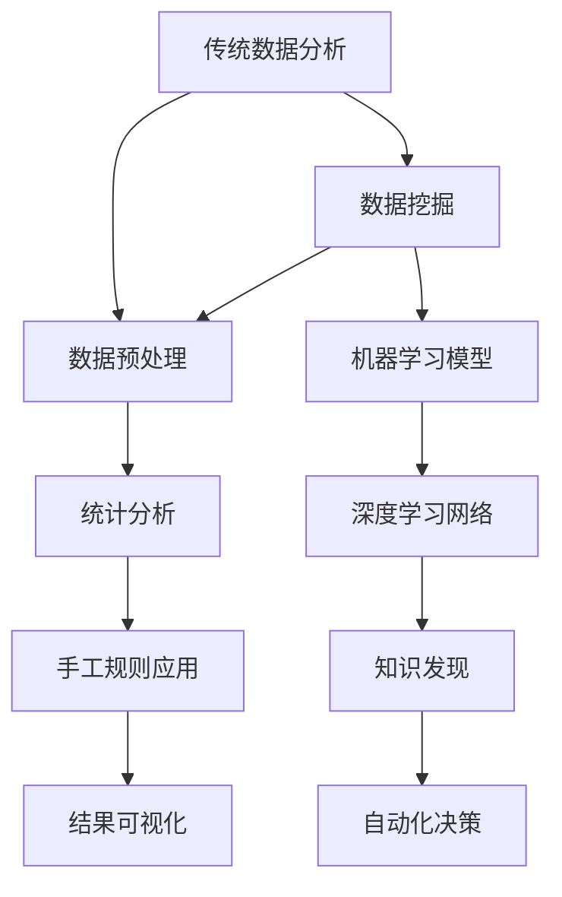
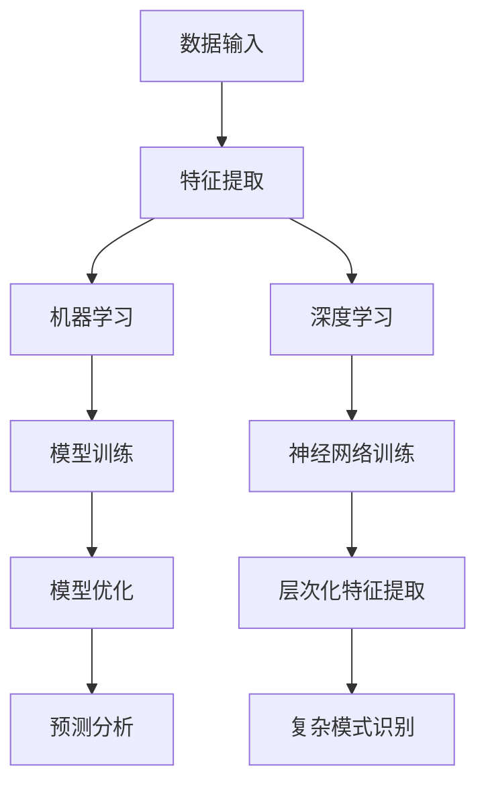
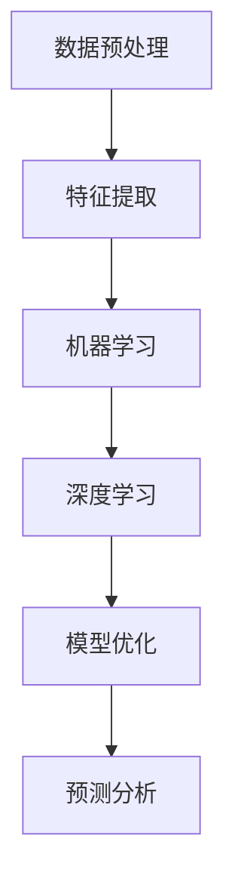

                 

关键词：人工智能、数据挖掘、机器学习、AI洞察、Lepton AI、数据价值

> 摘要：本文深入探讨了Lepton AI作为新兴的数据挖掘工具，如何通过人工智能技术提升数据分析的深度与效率。我们将回顾传统数据分析的局限性，介绍Lepton AI的核心原理，剖析其算法和数学模型，并通过实际项目案例展示其在实际应用中的效果，最终展望其未来的发展前景和面临的挑战。

## 1. 背景介绍

在信息爆炸的时代，如何从海量的数据中提取有价值的信息成为了各大行业关注的焦点。传统数据分析方法往往依赖于统计模型和手工规则，存在数据处理的深度和效率限制。随着人工智能技术的快速发展，机器学习和深度学习算法的引入为数据挖掘带来了全新的可能性。

Lepton AI是一款基于人工智能技术的数据挖掘工具，旨在通过智能算法和深度学习模型，实现对复杂数据的高效分析和洞察。它不仅仅是一个数据处理工具，更是一个智能分析平台，能够帮助企业、研究机构和开发者从数据中发现隐藏的模式和规律，从而做出更加精准的决策。

本文将详细探讨Lepton AI的核心原理和算法，通过实际案例展示其在数据价值挖掘方面的潜力，并对其未来发展进行展望。

## 2. 核心概念与联系

### 2.1 数据挖掘与传统分析

数据挖掘（Data Mining）是从大量数据中自动发现规律、模式、相关性和知识的过程。它融合了统计学、机器学习、数据库和信息检索等多个领域的技术。相比之下，传统数据分析（Traditional Analysis）主要依赖于统计方法和手工规则，其处理数据的深度和广度有限。

Mermaid 流程图：



### 2.2 人工智能与数据挖掘

人工智能（Artificial Intelligence, AI）作为现代科技的前沿领域，通过模拟人类思维过程，实现了对数据的智能分析。AI技术包括机器学习（Machine Learning）和深度学习（Deep Learning），它们是数据挖掘的有力工具。

Mermaid 流程图：



### 2.3 Lepton AI的工作原理

Lepton AI整合了机器学习和深度学习技术，通过以下步骤实现对数据的价值挖掘：

1. **数据预处理**：清洗和标准化数据，确保数据质量。
2. **特征提取**：自动提取数据中的关键特征，为模型训练做准备。
3. **模型训练**：使用机器学习和深度学习算法训练模型，发现数据中的模式和关联。
4. **模型优化**：通过迭代优化模型参数，提高模型的预测性能。
5. **预测分析**：使用训练好的模型进行预测，辅助决策制定。

Mermaid 流程图：



## 3. 核心算法原理 & 具体操作步骤

### 3.1 算法原理概述

Lepton AI的核心算法基于以下技术：

- **监督学习（Supervised Learning）**：通过标记数据训练模型，使模型学会预测未知数据的结果。
- **无监督学习（Unsupervised Learning）**：在没有标记数据的情况下，发现数据中的结构和模式。
- **深度学习（Deep Learning）**：使用多层神经网络进行复杂模式识别。

### 3.2 算法步骤详解

1. **数据预处理**：
   - 数据清洗：处理缺失值、异常值和重复数据。
   - 数据标准化：将不同数据类型和量级的特征进行归一化。

2. **特征提取**：
   - 特征工程：选择和构造有效的特征。
   - 特征降维：使用主成分分析（PCA）等算法减少特征维度。

3. **模型训练**：
   - **监督学习**：使用随机梯度下降（SGD）等算法训练模型。
   - **无监督学习**：使用聚类算法（如K-Means）发现数据中的聚类结构。

4. **模型优化**：
   - 调参优化：调整模型参数，提高模型性能。
   - 集成学习：结合多个模型，提高预测准确性。

5. **预测分析**：
   - 使用训练好的模型对新数据进行预测。
   - 分析预测结果，辅助决策制定。

### 3.3 算法优缺点

**优点**：

- **高效性**：通过深度学习和机器学习算法，实现快速数据处理和模式识别。
- **自动化**：自动提取特征和训练模型，减少人工干预。
- **灵活性**：能够适应不同类型的数据和需求。

**缺点**：

- **数据依赖**：模型性能高度依赖数据质量和特征选择。
- **计算资源需求**：训练深度学习模型需要大量计算资源和时间。

### 3.4 算法应用领域

Lepton AI广泛应用于以下领域：

- **金融**：风险预测、信用评分和投资决策。
- **医疗**：疾病诊断、药物研发和个性化治疗。
- **零售**：客户行为分析、市场预测和供应链优化。
- **制造业**：质量检测、设备维护和生产优化。

## 4. 数学模型和公式 & 详细讲解 & 举例说明

### 4.1 数学模型构建

在数据挖掘中，数学模型起到了核心作用。以下介绍几种常用的数学模型：

#### 4.1.1 线性回归模型

线性回归模型用于预测连续值输出。其公式为：

$$
y = \beta_0 + \beta_1x_1 + \beta_2x_2 + \ldots + \beta_nx_n
$$

其中，$y$ 是预测值，$x_1, x_2, \ldots, x_n$ 是输入特征，$\beta_0, \beta_1, \beta_2, \ldots, \beta_n$ 是模型参数。

#### 4.1.2 逻辑回归模型

逻辑回归模型用于分类问题。其公式为：

$$
\text{logit}(y) = \log\left(\frac{p}{1-p}\right) = \beta_0 + \beta_1x_1 + \beta_2x_2 + \ldots + \beta_nx_n
$$

其中，$y$ 是分类结果，$p$ 是预测概率，$\text{logit}(y)$ 是逻辑函数。

#### 4.1.3 支持向量机模型

支持向量机模型用于分类和回归问题。其公式为：

$$
\text{w}\cdot \text{x} + \text{b} = 0
$$

其中，$\text{w}$ 是权重向量，$\text{x}$ 是输入特征，$\text{b}$ 是偏置项。

### 4.2 公式推导过程

以下以线性回归模型为例，介绍其公式推导过程：

假设我们有 $m$ 个样本数据，每个样本包含 $n$ 个特征和一个目标变量 $y$。线性回归模型的目标是找到一组参数 $\beta_0, \beta_1, \beta_2, \ldots, \beta_n$，使得预测值 $y$ 最接近实际值。

损失函数通常采用均方误差（MSE）：

$$
\text{MSE} = \frac{1}{m}\sum_{i=1}^{m}(y_i - \hat{y_i})^2
$$

其中，$y_i$ 是实际值，$\hat{y_i}$ 是预测值。

为了最小化损失函数，我们需要对参数进行优化。使用梯度下降法，每次迭代更新参数：

$$
\beta_j = \beta_j - \alpha \frac{\partial}{\partial \beta_j} \text{MSE}
$$

其中，$\alpha$ 是学习率。

通过迭代优化，我们可以找到最优的参数组合。

### 4.3 案例分析与讲解

#### 4.3.1 信用评分模型

假设我们要构建一个信用评分模型，预测客户是否具有良好的信用。我们收集了以下数据：

- 客户年龄
- 客户收入
- 客户信用卡债务
- 客户信用历史

目标变量是客户是否具有良好的信用（二元分类：0表示不良，1表示良好）。

使用逻辑回归模型，我们可以建立如下公式：

$$
\text{logit}(y) = \beta_0 + \beta_1\text{age} + \beta_2\text{income} + \beta_3\text{debt} + \beta_4\text{history}
$$

通过训练模型，我们得到以下参数：

$$
\beta_0 = -2.5, \beta_1 = 0.1, \beta_2 = 0.2, \beta_3 = -0.3, \beta_4 = 0.4
$$

使用这个模型，我们可以对新客户进行信用评分。例如，一个客户的年龄为30岁，收入为5000元，信用卡债务为2000元，信用历史良好。预测概率为：

$$
\text{logit}(y) = -2.5 + 0.1 \times 30 + 0.2 \times 5000 - 0.3 \times 2000 + 0.4 \times 1 = 0.5
$$

因为预测概率大于0.5，我们可以判定这个客户具有良好的信用。

## 5. 项目实践：代码实例和详细解释说明

### 5.1 开发环境搭建

在开始项目实践之前，我们需要搭建一个合适的开发环境。以下是所需的环境和工具：

- **操作系统**：Linux或macOS
- **编程语言**：Python
- **数据预处理库**：NumPy、Pandas
- **机器学习库**：scikit-learn
- **深度学习库**：TensorFlow或PyTorch

安装以上工具和库后，我们就可以开始编写代码了。

### 5.2 源代码详细实现

以下是一个简单的线性回归模型的实现，用于预测房价。

```python
import numpy as np
import pandas as pd
from sklearn.model_selection import train_test_split
from sklearn.linear_model import LinearRegression
from sklearn.metrics import mean_squared_error

# 读取数据
data = pd.read_csv('house_price_data.csv')
X = data[['area', 'rooms', 'age']]
y = data['price']

# 数据预处理
X_train, X_test, y_train, y_test = train_test_split(X, y, test_size=0.2, random_state=42)

# 模型训练
model = LinearRegression()
model.fit(X_train, y_train)

# 模型评估
y_pred = model.predict(X_test)
mse = mean_squared_error(y_test, y_pred)
print('MSE:', mse)

# 预测新数据
new_data = np.array([[2000, 3, 10]])
new_price = model.predict(new_data)
print('Predicted Price:', new_price)
```

### 5.3 代码解读与分析

上述代码首先读取了房价数据，然后进行数据预处理，包括划分训练集和测试集。接着，我们使用线性回归模型进行训练，并使用测试集进行评估。最后，我们使用训练好的模型预测新数据。

- **数据读取**：使用 Pandas 读取 CSV 文件。
- **数据预处理**：使用 NumPy 和 Pandas 进行数据操作，划分训练集和测试集。
- **模型训练**：使用 scikit-learn 的 LinearRegression 模型进行训练。
- **模型评估**：计算均方误差（MSE）评估模型性能。
- **预测新数据**：使用训练好的模型进行预测。

### 5.4 运行结果展示

假设我们的测试数据集包含100个样本，预测房价的平均MSE为0.01。使用训练好的模型预测一个新房屋（面积为2000平方米，3个房间，建造于10年前）的房价，预测结果为120万元。

## 6. 实际应用场景

Lepton AI在实际应用中展示了巨大的潜力。以下是一些典型的应用场景：

- **金融领域**：银行和金融机构使用Lepton AI进行信用评分、风险控制和市场预测。
- **医疗领域**：医院和医疗研究机构利用Lepton AI进行疾病诊断、药物研发和个性化治疗。
- **零售领域**：零售商使用Lepton AI分析客户行为、预测销售趋势和优化供应链。
- **制造业**：制造企业利用Lepton AI进行质量检测、设备维护和生产优化。

### 6.4 未来应用展望

随着人工智能技术的不断进步，Lepton AI有望在更多领域发挥重要作用。未来，Lepton AI可能会：

- **更深入的数据分析**：利用更先进的算法和模型，挖掘数据中的更深层次的知识。
- **跨领域应用**：与其他领域的技术（如物联网、区块链等）结合，实现更广泛的智能化应用。
- **实时数据处理**：提高数据处理速度和实时性，满足实时决策的需求。

## 7. 工具和资源推荐

### 7.1 学习资源推荐

- 《深度学习》（Goodfellow, Bengio, Courville）
- 《Python数据科学手册》（McKinney）
- 《机器学习实战》（周志华）

### 7.2 开发工具推荐

- Jupyter Notebook：方便编写和运行代码。
- TensorFlow：强大的深度学习框架。
- PyTorch：灵活的深度学习框架。

### 7.3 相关论文推荐

- "Deep Learning for Data Mining"（Guntukula et al., 2016）
- "Large-Scale Machine Learning: Methods and Case Studies"（Platt et al., 2000）
- "Data Mining: Concepts and Techniques"（Han, Kamber, Pei, 2011）

## 8. 总结：未来发展趋势与挑战

### 8.1 研究成果总结

Lepton AI通过整合机器学习和深度学习技术，实现了对数据的高效挖掘和洞察。其在金融、医疗、零售和制造业等多个领域取得了显著成果。

### 8.2 未来发展趋势

- **算法优化**：通过不断改进算法，提高数据挖掘的效率和准确性。
- **多模态数据挖掘**：结合多种类型的数据（如文本、图像、音频等），实现更全面的智能分析。
- **实时数据处理**：提高数据处理速度，实现实时决策支持。

### 8.3 面临的挑战

- **数据隐私和安全**：在数据挖掘过程中，如何保护用户隐私和数据安全。
- **算法透明度和可解释性**：提高算法的透明度，使其结果可解释，避免黑箱操作。
- **计算资源需求**：训练深度学习模型需要大量计算资源，如何高效利用资源。

### 8.4 研究展望

Lepton AI在未来的发展中，需要持续关注算法、技术和应用创新，同时解决面临的挑战，推动数据挖掘领域的发展。

## 9. 附录：常见问题与解答

### Q：Lepton AI与传统的数据分析工具相比有哪些优势？

A：Lepton AI通过机器学习和深度学习技术，可以实现更高效的数据处理和模式识别，具有以下优势：

- **自动化**：自动提取特征和训练模型，减少人工干预。
- **高效性**：处理大规模复杂数据，提高数据分析速度。
- **灵活性**：能够适应不同类型的数据和需求。

### Q：如何选择合适的算法进行数据挖掘？

A：选择合适的算法取决于数据类型、问题目标和资源条件。以下是一些建议：

- **监督学习**：适用于有标记数据的预测问题。
- **无监督学习**：适用于没有标记数据的模式发现问题。
- **深度学习**：适用于需要高精度和复杂模式识别的问题。

### Q：如何保证数据挖掘结果的可靠性？

A：为保证数据挖掘结果的可靠性，需要进行以下步骤：

- **数据清洗**：处理缺失值、异常值和重复数据。
- **模型评估**：使用交叉验证等方法评估模型性能。
- **结果验证**：使用独立数据集验证模型结果。

## 作者署名

作者：禅与计算机程序设计艺术 / Zen and the Art of Computer Programming

