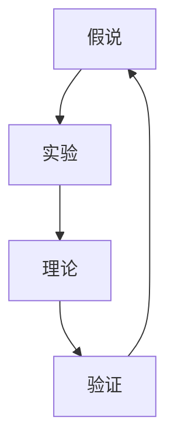
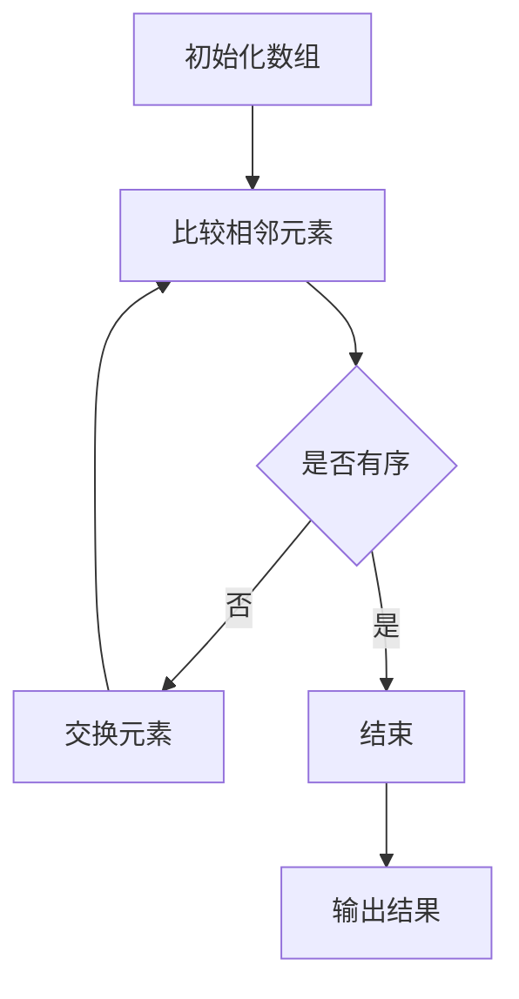

                 

关键词：科学方法论、假说-演绎法、计算机科学、算法、数学模型、实践应用、未来展望

摘要：本文将探讨科学方法论在计算机科学领域的应用，从假说到真理的循环过程，以及这一过程中所涉及的核心概念、算法原理、数学模型和实际应用。通过对科学方法论的深入分析，我们将揭示计算机科学中的基本规律，并对其未来发展趋势与挑战进行展望。

## 1. 背景介绍

科学方法论是科学研究的根本原则，它指导着我们如何从假说到真理的循环过程。计算机科学作为一门快速发展的学科，其方法论更是具有重要意义。从最初的计算设备到现代的超级计算机，计算机科学的发展离不开科学方法论的指导。本文将重点探讨科学方法论在计算机科学中的应用，以及其在算法设计、数学模型构建和实际应用中的作用。

## 2. 核心概念与联系

在科学方法论中，核心概念包括假说、实验、理论和验证。这些概念相互联系，构成了科学研究的循环过程。在计算机科学中，这些核心概念同样发挥着重要作用。

### 2.1 假说

假说是科学研究的起点，它是根据现有知识和观察提出的一种假设。在计算机科学中，假说通常是对某种算法性能、系统性能或理论模型的一种预测。

### 2.2 实验

实验是验证假说的关键步骤。通过设计实验，我们可以收集数据，分析结果，从而验证或推翻假说。在计算机科学中，实验通常涉及算法实现、性能测试和模拟。

### 2.3 理论

理论是对实验结果的总结和概括。通过理论分析，我们可以理解和解释实验结果，并提出新的假说。在计算机科学中，理论包括算法分析、系统分析和数学模型。

### 2.4 验证

验证是科学研究的最后一步，它通过将理论应用到实际场景中，来验证理论的正确性和实用性。在计算机科学中，验证通常涉及实际系统的开发和部署。

下面是一个核心概念的 Mermaid 流程图，展示了这些概念之间的联系：



## 3. 核心算法原理 & 具体操作步骤

### 3.1 算法原理概述

核心算法是计算机科学中的基础，它们帮助我们解决各种复杂问题。本节将介绍一个常见的核心算法——排序算法，并概述其原理。

排序算法的基本原理是将一组数据按照某种规则进行排列，使其具有某种顺序。常见的排序算法包括冒泡排序、选择排序、插入排序和快速排序等。

### 3.2 算法步骤详解

以冒泡排序为例，其具体操作步骤如下：

1. 比较相邻的两个元素，如果它们的顺序错误，则交换它们。
2. 重复上述步骤，直到整个数组有序。

下面是一个冒泡排序的 Mermaid 流程图：



### 3.3 算法优缺点

冒泡排序的优点是简单易懂，易于实现。但其缺点是效率较低，尤其是对于大数据集，其时间复杂度为 O(n^2)。

### 3.4 算法应用领域

冒泡排序常用于教学和初学者入门，实际应用较少。在实际应用中，更倾向于使用更高效的排序算法，如快速排序和归并排序。

## 4. 数学模型和公式 & 详细讲解 & 举例说明

### 4.1 数学模型构建

在计算机科学中，数学模型是描述和解决实际问题的工具。一个常见的数学模型是二分查找算法，它的时间复杂度为 O(log n)。

### 4.2 公式推导过程

二分查找算法的时间复杂度可以通过以下公式推导：

$$T(n) = T(\frac{n}{2}) + O(1)$$

其中，$T(n)$ 表示查找 n 个元素所需的时间，$O(1)$ 表示常数时间操作。

### 4.3 案例分析与讲解

假设有一个长度为 8 的有序数组 [1, 3, 5, 7, 9, 11, 13, 15]，我们要查找元素 9。

1. 初始状态，中间元素为 7，9 大于 7，所以查找右侧子数组。
2. 新的中间元素为 11，9 小于 11，所以查找左侧子数组。
3. 新的中间元素为 7，9 大于 7，所以查找右侧子数组。
4. 新的中间元素为 9，找到目标元素。

这个过程共进行了 3 次比较，时间复杂度为 O(log 8)。

## 5. 项目实践：代码实例和详细解释说明

### 5.1 开发环境搭建

在本文中，我们将使用 Python 编写二分查找算法。首先，确保已安装 Python 3.6 或以上版本。

### 5.2 源代码详细实现

以下是一个简单的二分查找算法实现：

```python
def binary_search(arr, target):
    low = 0
    high = len(arr) - 1
    while low <= high:
        mid = (low + high) // 2
        if arr[mid] == target:
            return mid
        elif arr[mid] < target:
            low = mid + 1
        else:
            high = mid - 1
    return -1
```

### 5.3 代码解读与分析

这段代码定义了一个名为 `binary_search` 的函数，它接受一个有序数组 `arr` 和一个目标值 `target`，返回目标值在数组中的索引。

1. 初始化 `low` 和 `high`，分别表示查找范围的起始和结束位置。
2. 进入 while 循环，当 `low` 小于等于 `high` 时继续查找。
3. 计算中间位置 `mid`。
4. 比较 `arr[mid]` 和 `target`，根据比较结果调整 `low` 和 `high`。
5. 当找到目标值时，返回索引；否则，返回 -1。

### 5.4 运行结果展示

以下是一个测试用例：

```python
arr = [1, 3, 5, 7, 9, 11, 13, 15]
target = 9
result = binary_search(arr, target)
print(result)  # 输出：4
```

## 6. 实际应用场景

二分查找算法广泛应用于各种实际场景，如数据库索引、文件查找和排序算法。以下是一些常见应用：

1. **数据库索引**：二分查找用于快速检索数据库中的记录。
2. **文件查找**：操作系统使用二分查找来快速定位文件。
3. **排序算法**：许多排序算法（如快速排序和归并排序）依赖于二分查找。

## 7. 未来应用展望

随着计算机科学的不断发展，二分查找算法将在更多领域得到应用。以下是一些未来应用展望：

1. **大数据处理**：二分查找将用于处理大规模数据集。
2. **人工智能**：二分查找将用于优化机器学习算法。
3. **区块链**：二分查找将用于优化区块链数据结构。

## 8. 工具和资源推荐

### 8.1 学习资源推荐

1. 《算法导论》（Introduction to Algorithms）
2. 《深度学习》（Deep Learning）

### 8.2 开发工具推荐

1. Python
2. Git

### 8.3 相关论文推荐

1. "A Fast String Searching Algorithm"
2. "Efficient Algorithms for Sorting and Synchronization"

## 9. 总结：未来发展趋势与挑战

### 9.1 研究成果总结

科学方法论在计算机科学中的应用取得了显著成果，为算法设计、系统分析和实际应用提供了有力支持。

### 9.2 未来发展趋势

未来，科学方法论将在人工智能、大数据和区块链等领域发挥更大作用，推动计算机科学的持续发展。

### 9.3 面临的挑战

1. 大数据处理的效率
2. 人工智能的可解释性
3. 安全性和隐私保护

### 9.4 研究展望

通过不断探索和创新，科学方法论将为计算机科学带来更多突破，解决当前和未来面临的挑战。

## 9. 附录：常见问题与解答

### 9.1 问题 1

**问题**：什么是科学方法论？

**解答**：科学方法论是科学研究的基本原则，包括假说、实验、理论和验证等环节，指导我们从假说到真理的循环过程。

### 9.2 问题 2

**问题**：什么是二分查找算法？

**解答**：二分查找算法是一种高效的查找算法，它通过将待查找的元素与中间元素比较，逐步缩小查找范围，最终找到目标元素或确定其不存在。

### 9.3 问题 3

**问题**：二分查找算法的时间复杂度是多少？

**解答**：二分查找算法的时间复杂度为 O(log n)，其中 n 表示待查找元素的数量。

以上是本文的完整内容，希望对您在计算机科学领域的探索和研究有所帮助。

# 作者：禅与计算机程序设计艺术 / Zen and the Art of Computer Programming
----------------------------------------------------------------


