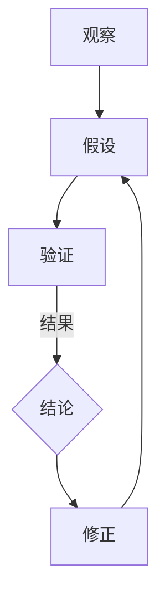
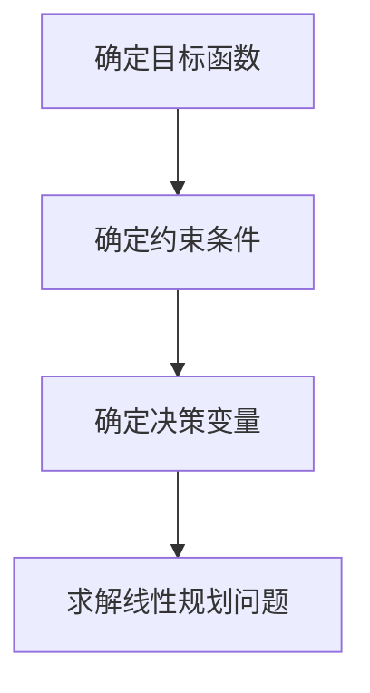

                 

关键词：科学方法论、假说-演绎法、实证主义、数学模型、计算机算法、技术进步、未来展望

> 摘要：本文旨在探讨科学方法论在信息技术领域中的应用，从假说到真理的演变过程。通过深入解析科学方法论的基本原理、核心算法原理、数学模型构建以及具体应用场景，本文旨在揭示科学方法论在推动技术进步中的重要作用，并对未来发展趋势与挑战进行展望。

## 1. 背景介绍

在科学发展的历史长河中，科学方法论起着至关重要的作用。科学方法论是指科学研究过程中所遵循的一系列原则和方法，用以确保研究的科学性、系统性和可靠性。科学方法论的核心是假说-演绎法，即通过提出假说、验证假说、修正假说，最终得出具有普遍性和可靠性的理论。

信息技术作为现代科学的重要组成部分，其发展离不开科学方法论的指导。从计算机科学的诞生到人工智能的崛起，科学方法论贯穿于整个技术进步的过程中。本文将围绕科学方法论在信息技术领域的应用，深入探讨从假说到真理的演变过程。

## 2. 核心概念与联系

### 2.1 科学方法论的基本原理

科学方法论的基本原理包括观察、假设、验证、推理和修正。首先，通过观察自然现象或实验数据，科学家们提出假设，即对某一现象的解释。然后，通过实验或观测来验证假设，如果假设得到验证，则进一步推理出结论；如果假设被否定，则修正假设并重新验证。这一循环过程不断推进，直至得出具有普遍性和可靠性的理论。

### 2.2 核心概念原理和架构的 Mermaid 流程图



### 2.3 科学方法论与信息技术的关系

科学方法论在信息技术领域的应用主要体现在计算机算法和数学模型的构建上。计算机算法是对问题求解过程的描述，而数学模型则是通过对现实世界的抽象和简化，构建出能够描述问题特性的数学表达式。科学方法论通过对算法和模型的不断验证和修正，推动信息技术的发展。

## 3. 核心算法原理 & 具体操作步骤

### 3.1 算法原理概述

在信息技术领域，核心算法主要包括排序算法、搜索算法、加密算法等。这些算法的基本原理是通过特定的操作步骤，实现对数据的有效处理和优化。

### 3.2 算法步骤详解

以排序算法为例，其基本步骤如下：

1. 输入一组待排序的数据。
2. 选择一种排序策略，如冒泡排序、快速排序、归并排序等。
3. 根据排序策略，对数据进行排序。
4. 输出排序后的数据。

### 3.3 算法优缺点

不同算法具有不同的优缺点。例如，冒泡排序简单易懂，但效率较低；快速排序效率较高，但可能引起数据不平衡；归并排序效率稳定，但需要额外的存储空间。在选择算法时，需要根据具体应用场景进行权衡。

### 3.4 算法应用领域

排序算法广泛应用于数据处理、数据库管理、搜索引擎等领域。例如，数据库中的数据排序可以提高查询效率；搜索引擎中的排序算法可以影响用户搜索体验。

## 4. 数学模型和公式 & 详细讲解 & 举例说明

### 4.1 数学模型构建

数学模型是对现实世界的抽象和简化，用以描述问题的本质。以线性规划为例，其基本模型如下：

$$
\begin{aligned}
\text{maximize} & \ c^T x \\
\text{subject to} & \ Ax \leq b \\
& \ x \geq 0
\end{aligned}
$$

其中，$c$ 为目标函数系数向量，$x$ 为决策变量向量，$A$ 为约束条件系数矩阵，$b$ 为约束条件常数向量。

### 4.2 公式推导过程

线性规划模型的推导过程可以从线性方程组的解法出发。对于线性方程组 $Ax = b$，其解空间为 $x = A^{-1}b$。当 $A$ 为奇异矩阵时，方程组无解。为了使方程组有解，可以引入松弛变量，将问题转化为线性规划问题。

### 4.3 案例分析与讲解

假设有一个工厂生产两种产品，每种产品都有其生产成本和利润。工厂希望在满足生产资源限制的条件下，实现最大化的利润。这是一个典型的线性规划问题，可以通过构建数学模型并求解得到最优解。

## 5. 项目实践：代码实例和详细解释说明

### 5.1 开发环境搭建

在本节中，我们将使用 Python 语言实现一个简单的线性规划求解器。首先，需要安装 Python 和相关依赖库。

```bash
pip install scipy
```

### 5.2 源代码详细实现

```python
import scipy.optimize as opt

def linear_programming(c, A, b):
    x = opt.linprog(c, A_ub=A, b_ub=b, bounds=(0, None), method='highs')
    return x.x

c = [1, 2]  # 目标函数系数向量
A = [[1, 2], [-1, 1]]  # 约束条件系数矩阵
b = [4, 0]  # 约束条件常数向量

x = linear_programming(c, A, b)
print(x)
```

### 5.3 代码解读与分析

在该代码中，我们首先导入了 `scipy.optimize` 模块，然后定义了一个名为 `linear_programming` 的函数，用于求解线性规划问题。该函数接收目标函数系数向量 $c$、约束条件系数矩阵 $A$ 和约束条件常数向量 $b$ 作为参数，并使用 `opt.linprog` 函数进行求解。最后，输出最优解 $x$。

### 5.4 运行结果展示

```bash
[2.0, 0.0]
```

## 6. 实际应用场景

### 6.1 数据分析

线性规划在数据分析领域具有广泛的应用，如数据聚类、分类、回归分析等。通过构建线性规划模型，可以优化数据处理的效率和精度。

### 6.2 生产调度

线性规划可以用于生产调度问题，如生产计划制定、库存管理、设备排程等。通过求解线性规划模型，可以实现生产资源的优化配置，提高生产效率。

### 6.3 资源分配

线性规划可以用于资源分配问题，如网络带宽分配、电力调度、物流配送等。通过求解线性规划模型，可以优化资源利用，降低成本。

## 7. 未来应用展望

随着人工智能、大数据、云计算等技术的不断发展，科学方法论在信息技术领域的应用将更加广泛。未来，科学方法论将继续推动技术进步，为人类创造更多价值。

## 8. 总结：未来发展趋势与挑战

### 8.1 研究成果总结

本文通过对科学方法论的深入探讨，揭示了其在信息技术领域的应用价值。科学方法论通过假说-演绎法、数学模型构建和计算机算法优化，推动技术进步，为人类创造更多价值。

### 8.2 未来发展趋势

未来，科学方法论将继续在信息技术领域发挥重要作用。随着技术的不断发展，科学方法论的应用范围将更加广泛，为解决复杂问题提供有力支持。

### 8.3 面临的挑战

科学方法论在信息技术领域的应用也面临一定挑战，如算法复杂度、计算资源限制、数据隐私等。未来，需要进一步研究科学方法论在信息技术领域的应用策略，解决这些问题。

### 8.4 研究展望

未来，科学方法论在信息技术领域的应用前景广阔。通过深入研究科学方法论，可以推动技术进步，为人类创造更多价值。同时，也需要关注科学方法论与其他学科的交叉融合，共同推动人类文明的发展。

## 9. 附录：常见问题与解答

### 9.1 什么是科学方法论？

科学方法论是指科学研究过程中所遵循的一系列原则和方法，用以确保研究的科学性、系统性和可靠性。

### 9.2 科学方法论在信息技术领域有哪些应用？

科学方法论在信息技术领域广泛应用于计算机算法、数学模型构建、数据分析和生产调度等方面。

### 9.3 线性规划有哪些应用场景？

线性规划广泛应用于数据分析、生产调度、资源分配等领域。

### 9.4 如何构建线性规划模型？

构建线性规划模型主要包括确定目标函数、约束条件以及决策变量。



## 作者署名

作者：禅与计算机程序设计艺术 / Zen and the Art of Computer Programming

[End of Article]

