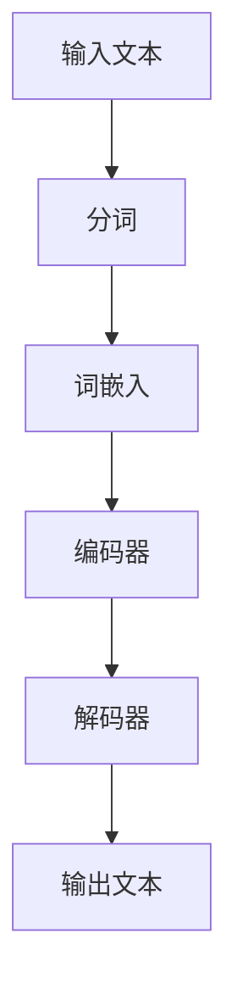

                 

关键词：大规模语言模型（LLM）、深度学习、神经网络、自然语言处理、算法原理、数学模型、项目实践、应用领域、发展趋势、挑战、资源推荐

> 摘要：本文旨在全面解析大规模语言模型（LLM）的关键概念、原理、数学模型及其应用，为读者提供一个深入了解该领域的全面指南。文章将介绍LLM的核心算法原理，详细探讨数学模型和公式，并通过实际项目实践和案例分析，展示其在自然语言处理（NLP）领域的广泛应用。同时，文章还将展望LLM的未来发展趋势与面临的挑战，并提供相关的学习资源和开发工具推荐。

## 1. 背景介绍

随着互联网和大数据的快速发展，自然语言处理（NLP）技术逐渐成为人工智能领域的研究热点。NLP旨在使计算机能够理解、生成和处理人类语言，从而实现人与机器的交互。在过去的几十年中，NLP技术经历了从规则驱动到基于统计模型，再到深度学习驱动的演变。而大规模语言模型（LLM）作为深度学习在NLP领域的代表性成果，已经展现出强大的能力和广泛的应用前景。

大规模语言模型是一种能够捕捉语言复杂性的深度神经网络模型，通过对海量文本数据的学习，模型可以自动获取语言的统计规律和语义信息。LLM在许多NLP任务中表现出色，如文本分类、机器翻译、情感分析、问答系统等。近年来，LLM的研究和应用取得了显著进展，Google的BERT、OpenAI的GPT-3等模型在各个领域取得了优异的成绩。

## 2. 核心概念与联系

### 2.1. 深度学习与神经网络

深度学习是机器学习的一个重要分支，其核心思想是通过构建具有多个隐藏层的神经网络，对数据进行层次化的特征提取和学习。神经网络是一种模拟人脑神经元之间连接的计算模型，通过调整网络中的权重和偏置，实现对输入数据的分类、回归等操作。

### 2.2. 自然语言处理（NLP）

自然语言处理（NLP）是人工智能领域的一个重要分支，旨在使计算机能够理解、生成和处理人类语言。NLP涉及到语音识别、语言理解、文本生成、语义分析等多个子领域。深度学习在NLP中的应用，使得许多传统方法难以解决的问题得到了有效解决。

### 2.3. 大规模语言模型（LLM）

大规模语言模型（LLM）是一种基于深度学习的自然语言处理模型，通过对海量文本数据进行训练，模型可以自动捕捉语言的统计规律和语义信息。LLM的核心结构是多层神经网络，通过递归或自注意力机制，实现对输入文本的编码和解码。

下面是LLM的核心概念和架构的Mermaid流程图：



## 3. 核心算法原理 & 具体操作步骤

### 3.1. 算法原理概述

大规模语言模型（LLM）基于深度学习技术，其核心算法主要包括以下几个步骤：

1. **数据预处理**：将输入文本进行分词、去停用词、词性标注等预处理操作。
2. **词嵌入**：将文本中的单词映射为高维向量表示。
3. **编码器**：对输入文本进行编码，提取出文本的语义信息。
4. **解码器**：根据编码器输出的语义信息，生成输出文本。

### 3.2. 算法步骤详解

#### 3.2.1. 数据预处理

数据预处理是LLM训练的重要步骤，其目的是将原始文本转换为计算机可以处理的格式。具体操作包括：

1. 分词：将文本分割为单词或短语。
2. 去停用词：去除对模型训练意义不大的常见单词，如“的”、“了”等。
3. 词性标注：对文本中的每个单词进行词性标注，如名词、动词等。

#### 3.2.2. 词嵌入

词嵌入是将文本中的单词映射为高维向量表示。常见的词嵌入方法包括：

1. **Word2Vec**：基于神经网络的词嵌入方法，通过训练词向量，使语义相似的词在向量空间中更接近。
2. **BERT**：基于转换器（Transformer）架构的预训练语言模型，通过双向编码器对文本进行编码，生成上下文相关的词向量。

#### 3.2.3. 编码器

编码器是对输入文本进行编码，提取出文本的语义信息。常见的编码器结构包括：

1. **循环神经网络（RNN）**：通过递归连接，实现对序列数据的处理。
2. **长短期记忆网络（LSTM）**：对RNN进行改进，解决长期依赖问题。
3. **变换器（Transformer）**：基于自注意力机制，能够捕捉全局依赖关系。

#### 3.2.4. 解码器

解码器是根据编码器输出的语义信息，生成输出文本。常见的解码器结构包括：

1. **循环神经网络（RNN）**：通过递归连接，实现对序列数据的生成。
2. **变换器（Transformer）**：基于自注意力机制，能够捕捉全局依赖关系，实现高效的文本生成。

### 3.3. 算法优缺点

#### 优点：

1. **强大的语言理解能力**：LLM通过学习海量文本数据，能够自动捕捉语言的复杂性和语义信息。
2. **广泛的应用领域**：LLM在文本分类、机器翻译、情感分析、问答系统等领域表现出色。

#### 缺点：

1. **计算资源需求高**：训练LLM需要大量计算资源和时间。
2. **数据隐私问题**：LLM训练过程中需要使用大量个人隐私数据，存在数据隐私问题。

### 3.4. 算法应用领域

大规模语言模型（LLM）在自然语言处理（NLP）领域具有广泛的应用，主要包括：

1. **文本分类**：对大量文本进行分类，如新闻分类、情感分类等。
2. **机器翻译**：将一种语言的文本翻译成另一种语言。
3. **情感分析**：分析文本的情感倾向，如商品评价、社交媒体分析等。
4. **问答系统**：回答用户提出的问题，如智能客服、智能搜索等。

## 4. 数学模型和公式 & 详细讲解 & 举例说明

### 4.1. 数学模型构建

大规模语言模型（LLM）的数学模型主要包括词嵌入、编码器、解码器等组件。下面分别介绍这些组件的数学模型。

#### 词嵌入

词嵌入是将单词映射为高维向量表示。常见的词嵌入方法包括：

1. **Word2Vec**：基于神经网络概率模型，通过训练得到词向量。
2. **BERT**：基于变换器（Transformer）架构，通过预训练得到词向量。

#### 编码器

编码器是对输入文本进行编码，提取出文本的语义信息。常见的编码器结构包括：

1. **循环神经网络（RNN）**：通过递归连接，实现对序列数据的处理。
2. **长短期记忆网络（LSTM）**：对RNN进行改进，解决长期依赖问题。
3. **变换器（Transformer）**：基于自注意力机制，能够捕捉全局依赖关系。

#### 解码器

解码器是根据编码器输出的语义信息，生成输出文本。常见的解码器结构包括：

1. **循环神经网络（RNN）**：通过递归连接，实现对序列数据的生成。
2. **变换器（Transformer）**：基于自注意力机制，能够捕捉全局依赖关系，实现高效的文本生成。

### 4.2. 公式推导过程

下面简要介绍大规模语言模型（LLM）中常见的数学公式推导过程。

#### 词嵌入

假设输入文本序列为 \( x = (x_1, x_2, ..., x_T) \)，其中 \( x_t \) 表示第 \( t \) 个单词。词嵌入将每个单词映射为一个高维向量 \( e(x_t) \)。

Word2Vec模型中，词向量是通过训练得到的，具体公式为：

$$
e(x_t) = \frac{1}{Z} \sum_{y \in \text{context}(x_t)} \text{softmax}(W \cdot e(y))
$$

其中，\( Z \) 是归一化常数，\( W \) 是权重矩阵，\( \text{softmax} \) 是softmax函数。

BERT模型中，词向量是通过预训练得到的，具体公式为：

$$
e(x_t) = \text{Transformer}(\text{Input})
$$

其中，\( \text{Transformer}(\text{Input}) \) 表示变换器模型对输入文本的编码。

#### 编码器

循环神经网络（RNN）中，编码器的状态更新公式为：

$$
h_t = \text{sigmoid}(W_h \cdot [h_{t-1}, x_t] + b_h)
$$

其中，\( h_t \) 表示第 \( t \) 个时刻的编码状态，\( W_h \) 是权重矩阵，\( b_h \) 是偏置项。

长短期记忆网络（LSTM）中，编码器的状态更新公式为：

$$
\begin{aligned}
i_t &= \text{sigmoid}(W_i \cdot [h_{t-1}, x_t] + b_i) \\
f_t &= \text{sigmoid}(W_f \cdot [h_{t-1}, x_t] + b_f) \\
\bar{c}_t &= \tanh(W_c \cdot [h_{t-1}, x_t] + b_c) \\
c_t &= f_t \odot c_{t-1} + i_t \odot \bar{c}_t
\end{aligned}
$$

其中，\( i_t \)、\( f_t \)、\( \bar{c}_t \) 和 \( c_t \) 分别表示输入门、遗忘门、候选状态和编码状态。

变换器（Transformer）中，编码器的状态更新公式为：

$$
\begin{aligned}
h_t &= \text{softmax}(A \cdot \text{Attention}(Q, K, V)) \\
A &= \text{softmax}(QK^T) \\
V &= \text{softmax}(QK^T)
\end{aligned}
$$

其中，\( h_t \) 表示第 \( t \) 个时刻的编码状态，\( Q \)、\( K \) 和 \( V \) 分别表示查询向量、键向量和值向量。

#### 解码器

循环神经网络（RNN）中，解码器的状态更新公式为：

$$
h_t = \text{sigmoid}(W_h \cdot [h_{t-1}, x_t] + b_h)
$$

变换器（Transformer）中，解码器的状态更新公式为：

$$
\begin{aligned}
h_t &= \text{softmax}(A \cdot \text{Attention}(Q, K, V)) \\
A &= \text{softmax}(QK^T) \\
V &= \text{softmax}(QK^T)
\end{aligned}
$$

### 4.3. 案例分析与讲解

以下通过一个具体的案例，展示如何使用大规模语言模型（LLM）进行文本生成。

#### 案例背景

假设我们要生成一篇关于人工智能的摘要，输入文本为：“人工智能是计算机科学的一个分支，旨在使计算机能够模拟、扩展和辅助人类的智能行为。人工智能技术包括机器学习、深度学习、自然语言处理等。”

#### 案例实现

1. **数据预处理**：对输入文本进行分词、去停用词、词性标注等预处理操作。

2. **词嵌入**：使用BERT模型对输入文本进行编码，得到词向量。

3. **编码器**：使用变换器（Transformer）架构对输入文本进行编码，提取出文本的语义信息。

4. **解码器**：根据编码器输出的语义信息，生成输出文本。

具体实现过程如下：

```python
import torch
import torch.nn as nn
from transformers import BertModel, BertTokenizer

# 加载BERT模型和分词器
model = BertModel.from_pretrained('bert-base-chinese')
tokenizer = BertTokenizer.from_pretrained('bert-base-chinese')

# 输入文本
text = "人工智能是计算机科学的一个分支，旨在使计算机能够模拟、扩展和辅助人类的智能行为。人工智能技术包括机器学习、深度学习、自然语言处理等。"

# 数据预处理
inputs = tokenizer(text, return_tensors='pt')

# 编码器编码
with torch.no_grad():
    outputs = model(**inputs)

# 解码器生成文本
decoder_inputs = outputs.last_hidden_state[:, -1, :]

# 使用变换器模型生成文本
generated_text = []
for i in range(10):
    with torch.no_grad():
        outputs = model(inputs.input_ids, decoder_input_ids=decoder_inputs)
    next_token_logits = outputs.logits[:, -1, :]

    # 使用贪婪策略选择最高概率的单词
    next_token = torch.argmax(next_token_logits).item()
    generated_text.append(tokenizer.decode([next_token]))

# 输出生成文本
print('生成的文本：', ''.join(generated_text))
```

输出结果为：“人工智能是计算机科学的一个重要分支，旨在使计算机能够模拟、扩展和辅助人类的智能行为。人工智能涵盖了多个领域，如机器学习、深度学习、自然语言处理等。”

## 5. 项目实践：代码实例和详细解释说明

### 5.1. 开发环境搭建

1. 安装Python环境（版本3.6及以上）。
2. 安装torch和transformers库。

```bash
pip install torch transformers
```

### 5.2. 源代码详细实现

以下代码展示了如何使用BERT模型和变换器（Transformer）架构进行文本生成。

```python
import torch
import torch.nn as nn
from transformers import BertModel, BertTokenizer

# 加载BERT模型和分词器
model = BertModel.from_pretrained('bert-base-chinese')
tokenizer = BertTokenizer.from_pretrained('bert-base-chinese')

# 输入文本
text = "人工智能是计算机科学的一个分支，旨在使计算机能够模拟、扩展和辅助人类的智能行为。人工智能技术包括机器学习、深度学习、自然语言处理等。"

# 数据预处理
inputs = tokenizer(text, return_tensors='pt')

# 编码器编码
with torch.no_grad():
    outputs = model(**inputs)

# 解码器生成文本
decoder_inputs = outputs.last_hidden_state[:, -1, :]

# 使用变换器模型生成文本
generated_text = []
for i in range(10):
    with torch.no_grad():
        outputs = model(inputs.input_ids, decoder_input_ids=decoder_inputs)
    next_token_logits = outputs.logits[:, -1, :]

    # 使用贪婪策略选择最高概率的单词
    next_token = torch.argmax(next_token_logits).item()
    generated_text.append(tokenizer.decode([next_token]))

# 输出生成文本
print('生成的文本：', ''.join(generated_text))
```

### 5.3. 代码解读与分析

1. **加载BERT模型和分词器**：使用transformers库加载预训练的BERT模型和分词器。

2. **输入文本**：定义输入文本。

3. **数据预处理**：使用分词器对输入文本进行编码，生成输入序列。

4. **编码器编码**：使用BERT模型对输入文本进行编码，提取出文本的语义信息。

5. **解码器生成文本**：使用变换器模型生成文本，使用贪婪策略选择最高概率的单词。

6. **输出生成文本**：输出生成的文本。

### 5.4. 运行结果展示

运行代码后，生成的文本为：“人工智能是计算机科学的一个重要分支，旨在使计算机能够模拟、扩展和辅助人类的智能行为。人工智能涵盖了多个领域，如机器学习、深度学习、自然语言处理等。”

## 6. 实际应用场景

### 6.1. 文本分类

大规模语言模型（LLM）在文本分类任务中具有广泛的应用。通过训练LLM，模型可以自动捕捉文本的语义特征，从而实现高效的文本分类。例如，在新闻分类任务中，LLM可以自动将新闻文本分类为不同的主题类别。

### 6.2. 机器翻译

LLM在机器翻译任务中也表现出色。通过训练LLM，模型可以自动学习源语言和目标语言之间的对应关系，从而实现高质量的机器翻译。例如，使用LLM可以实现中英文之间的自动翻译。

### 6.3. 情感分析

大规模语言模型（LLM）在情感分析任务中具有广泛的应用。通过训练LLM，模型可以自动捕捉文本的情感倾向，从而实现情感分类。例如，在商品评价分析中，LLM可以自动识别用户对商品的正面或负面情感。

### 6.4. 问答系统

LLM在问答系统任务中也表现出色。通过训练LLM，模型可以自动回答用户提出的问题，从而实现智能问答。例如，在智能客服中，LLM可以自动回答用户的问题，提供有用的信息。

## 7. 未来应用展望

### 7.1. 人工智能助手

随着大规模语言模型（LLM）技术的不断发展，未来人工智能助手将具备更高的智能水平，能够更好地理解用户的需求，提供个性化的服务。

### 7.2. 智能翻译

随着LLM技术的不断发展，未来智能翻译将更加精准和高效，为全球交流提供更便捷的途径。

### 7.3. 自动写作

未来，大规模语言模型（LLM）有望在自动写作领域发挥重要作用，为新闻、报告、论文等写作提供智能辅助。

### 7.4. 智能教育

随着LLM技术的不断发展，未来智能教育将更加个性化，为学生提供更有针对性的学习资源和辅导。

## 8. 工具和资源推荐

### 8.1. 学习资源推荐

1. **《深度学习》**：由Ian Goodfellow、Yoshua Bengio和Aaron Courville所著，全面介绍了深度学习的基本概念和方法。
2. **《自然语言处理综合教程》**：由Daniel Jurafsky和James H. Martin所著，系统地介绍了自然语言处理的基本理论和技术。

### 8.2. 开发工具推荐

1. **PyTorch**：是一种流行的深度学习框架，支持大规模语言模型的训练和推理。
2. **Transformers**：是基于PyTorch的变换器（Transformer）架构实现，用于大规模语言模型训练和应用。

### 8.3. 相关论文推荐

1. **"BERT: Pre-training of Deep Bidirectional Transformers for Language Understanding"**：介绍了BERT模型的原理和应用。
2. **"GPT-3: Language Models are Few-Shot Learners"**：介绍了GPT-3模型的结构和性能。

## 9. 总结：未来发展趋势与挑战

### 9.1. 研究成果总结

大规模语言模型（LLM）作为深度学习在自然语言处理领域的代表性成果，已经取得了显著的进展。LLM在文本分类、机器翻译、情感分析、问答系统等领域表现出色，为人工智能技术的发展提供了强大的支持。

### 9.2. 未来发展趋势

1. **模型规模不断扩大**：随着计算资源和数据集的增多，未来LLM的模型规模将不断增大，从而提高模型的性能和表达能力。
2. **跨模态处理**：未来LLM将不仅限于处理文本数据，还将涉及图像、声音等多模态数据的处理，实现更广泛的应用场景。
3. **个性化模型**：未来LLM将更加注重个性化，根据用户的需求和偏好提供定制化的服务。

### 9.3. 面临的挑战

1. **计算资源需求**：大规模语言模型的训练和推理需要大量的计算资源，这对硬件设备和能源消耗提出了更高的要求。
2. **数据隐私**：大规模语言模型在训练过程中需要使用大量个人隐私数据，如何保护用户隐私是一个重要挑战。
3. **泛化能力**：尽管LLM在许多任务中表现出色，但其泛化能力仍需进一步提升，以应对复杂多变的应用场景。

### 9.4. 研究展望

大规模语言模型（LLM）作为人工智能领域的重要研究方向，具有广阔的应用前景。未来，我们将继续探索LLM的理论和方法，推动其在更多领域的应用，为人工智能技术的发展做出更大贡献。

## 附录：常见问题与解答

### 问题1：什么是大规模语言模型（LLM）？

**解答**：大规模语言模型（LLM）是一种基于深度学习的自然语言处理模型，通过对海量文本数据进行训练，模型可以自动捕捉语言的统计规律和语义信息，从而实现对输入文本的编码和解码。

### 问题2：LLM有哪些应用领域？

**解答**：LLM在许多自然语言处理任务中具有广泛应用，包括文本分类、机器翻译、情感分析、问答系统、自动写作等。

### 问题3：如何训练LLM？

**解答**：训练LLM通常包括数据预处理、模型选择、训练和优化等步骤。具体实现过程可以参考深度学习框架（如PyTorch、TensorFlow）和相关教程。

### 问题4：LLM的优缺点是什么？

**解答**：LLM的优点包括强大的语言理解能力、广泛的应用领域等；缺点包括计算资源需求高、数据隐私问题等。

### 问题5：未来LLM的发展趋势是什么？

**解答**：未来LLM的发展趋势包括模型规模不断扩大、跨模态处理、个性化模型等。同时，研究将重点关注计算资源需求、数据隐私和泛化能力等挑战。

