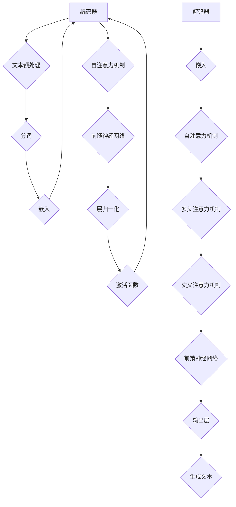

                 

关键词：大规模语言模型（LLM）、深度学习、自然语言处理、神经网络、预训练、文本生成、推理能力、优化方法、应用领域

摘要：本文将深入探讨大规模语言模型（LLM）的概念、原理、算法和实际应用。从背景介绍到核心概念，再到算法原理与操作步骤，数学模型与公式，项目实践，实际应用场景，以及工具和资源推荐，本文旨在为读者提供一个全面的技术视角，帮助理解LLM的工作机制和未来发展方向。

## 1. 背景介绍

大规模语言模型（LLM）是自然语言处理（NLP）领域的一项重大突破。随着深度学习和计算能力的飞速发展，LLM已经成为现代AI系统的核心组件。它们在文本生成、机器翻译、问答系统、情感分析等方面展现出了惊人的表现，极大地推动了人工智能的发展。

### 1.1 发展历程

- **1950年代至1980年代**：早期的人工智能研究主要集中在符号主义方法，如逻辑推理和产生式系统。尽管取得了一些进展，但处理自然语言的能力仍然有限。

- **1980年代至1990年代**：统计语言模型开始兴起，如N-gram模型。这些模型基于历史语言数据来预测下一个单词或词组，效果优于符号主义模型。

- **2000年代**：深度学习在图像识别领域取得成功，激发了研究人员在NLP领域的应用探索。循环神经网络（RNN）和长短期记忆网络（LSTM）的出现，为处理序列数据提供了有效的工具。

- **2010年代至今**：随着计算能力和数据量的激增，深度神经网络在NLP领域取得了突破性进展。Transformer架构的出现，尤其是预训练语言模型如BERT、GPT，标志着LLM时代的到来。

### 1.2 研究现状

当前，LLM在多个领域都取得了显著成果。例如，在文本生成方面，GPT-3能够生成高质量的文章、对话和代码；在机器翻译方面，基于LLM的模型在BLEU等指标上超越了传统方法；在问答系统方面，LLM能够提供准确、连贯的答案。

## 2. 核心概念与联系

### 2.1 定义

大规模语言模型（LLM）是一种基于深度学习的语言处理模型，它通过学习大量文本数据来理解和生成自然语言。LLM的核心在于其庞大的参数规模和深度学习的架构，这使得它们能够捕捉到复杂的语言规律和语义信息。

### 2.2 架构

LLM的典型架构包括编码器（Encoder）和解码器（Decoder）。编码器负责将输入文本编码为固定长度的向量，解码器则将这些向量解码为输出文本。整个模型通常采用Transformer架构，其中自注意力机制（Self-Attention）和多头注意力机制（Multi-Head Attention）是其核心组件。

#### Mermaid 流程图



### 2.3 联系

LLM的核心在于其能够捕捉到文本中的长距离依赖关系和上下文信息。通过自注意力机制和多头注意力机制，模型能够同时关注输入文本的不同部分，从而生成连贯、自然的输出。

## 3. 核心算法原理 & 具体操作步骤

### 3.1 算法原理概述

LLM的核心算法是基于Transformer架构的。Transformer引入了自注意力机制（Self-Attention），允许模型在编码器和解码器的每个位置都能考虑到其他所有位置的信息。这一机制使得模型能够捕捉到长距离的依赖关系，从而生成高质量的文本。

### 3.2 算法步骤详解

#### 编码器（Encoder）

1. **输入处理**：将输入文本转换为词向量（Token Vectors）。
2. **嵌入**：将词向量映射为嵌入向量（Embedding Vectors）。
3. **自注意力机制**：在每个编码器层，通过自注意力机制计算嵌入向量的加权和，生成新的嵌入向量。
4. **前馈神经网络**：对自注意力机制的输出进行前馈神经网络处理。
5. **层归一化**：对前馈神经网络的输出进行层归一化处理。
6. **激活函数**：使用激活函数（如ReLU）对层归一化的输出进行激活。

#### 解码器（Decoder）

1. **输入处理**：将输入文本转换为词向量。
2. **嵌入**：将词向量映射为嵌入向量。
3. **自注意力机制**：在每个解码器层，通过自注意力机制计算嵌入向量的加权和，生成新的嵌入向量。
4. **多头注意力机制**：在解码器的某些层，使用多头注意力机制考虑编码器的输出。
5. **交叉注意力机制**：在解码器的每个位置，通过交叉注意力机制将解码器当前步骤的嵌入向量与编码器所有位置的嵌入向量进行融合。
6. **前馈神经网络**：对交叉注意力机制的输出进行前馈神经网络处理。
7. **输出层**：解码器的输出层通常是一个全连接层，用于生成预测的词向量。

### 3.3 算法优缺点

#### 优点

- **捕捉长距离依赖**：自注意力机制和多头注意力机制使得模型能够捕捉到文本中的长距离依赖关系。
- **并行计算**：Transformer架构支持并行计算，大大提高了计算效率。
- **灵活**：Transformer架构易于扩展和定制，可以应用于各种NLP任务。

#### 缺点

- **计算复杂度**：随着参数规模的增加，模型的计算复杂度呈指数增长。
- **资源消耗**：大规模的LLM模型需要大量的计算资源和存储空间。

### 3.4 算法应用领域

LLM在多个领域都有广泛应用，包括：

- **文本生成**：生成文章、对话、代码等。
- **机器翻译**：将一种语言的文本翻译为另一种语言。
- **问答系统**：提供准确、连贯的答案。
- **情感分析**：分析文本中的情感倾向。
- **信息提取**：从文本中提取关键信息。

## 4. 数学模型和公式 & 详细讲解 & 举例说明

### 4.1 数学模型构建

大规模语言模型通常采用Transformer架构，其核心在于多头自注意力机制（Multi-Head Self-Attention）和前馈神经网络（Feedforward Neural Network）。以下是模型的数学公式：

#### 多头自注意力机制

$$
\text{Attention}(Q, K, V) = \text{softmax}\left(\frac{QK^T}{\sqrt{d_k}}\right)V
$$

其中，$Q, K, V$ 分别是查询（Query）、键（Key）和值（Value）向量，$d_k$ 是键向量的维度。该公式计算每个键对查询的相似度，并加权求和值向量。

#### 前馈神经网络

$$
\text{FFN}(X) = \max(0, XW_1 + b_1)\odot W_2 + b_2
$$

其中，$X$ 是输入向量，$W_1, W_2, b_1, b_2$ 分别是权重和偏置。该神经网络对输入向量进行两次前馈计算，并通过激活函数（如ReLU）进行非线性变换。

### 4.2 公式推导过程

以下是Transformer模型的公式推导过程：

#### 编码器（Encoder）

1. **嵌入**：

$$
\text{Input} = [X_1, X_2, ..., X_n]
$$

$$
\text{Embedding} = [\text{Token Embedding}, \text{Position Embedding}, \text{Segment Embedding}]
$$

$$
\text{Input} \rightarrow \text{Embedding} \rightarrow \text{Encoder Input}
$$

2. **多头自注意力机制**：

$$
\text{Multi-Head Attention}(\text{Encoder Input}) = \text{Concat}(\text{head}_1, \text{head}_2, ..., \text{head}_h)W_O
$$

$$
\text{head}_i = \text{Attention}(\text{Query}, \text{Key}, \text{Value})
$$

3. **前馈神经网络**：

$$
\text{FFN}(\text{Multi-Head Attention}) = \max(0, \text{Multi-Head Attention}W_1 + b_1)\odot W_2 + b_2
$$

4. **编码器输出**：

$$
\text{Encoder Output} = [\text{Encoder Input}, \text{Multi-Head Attention}, \text{FFN}(\text{Multi-Head Attention})]^T
$$

#### 解码器（Decoder）

1. **嵌入**：

$$
\text{Input} = [X_1, X_2, ..., X_n]
$$

$$
\text{Embedding} = [\text{Token Embedding}, \text{Position Embedding}, \text{Segment Embedding}]
$$

$$
\text{Input} \rightarrow \text{Embedding} \rightarrow \text{Decoder Input}
$$

2. **多头自注意力机制**：

$$
\text{Multi-Head Attention}(\text{Decoder Input}) = \text{Concat}(\text{head}_1, \text{head}_2, ..., \text{head}_h)W_O
$$

$$
\text{head}_i = \text{Attention}(\text{Query}, \text{Key}, \text{Value})
$$

3. **多头注意力机制**：

$$
\text{Multi-Head Attention}(\text{Encoder Output}) = \text{Concat}(\text{head}_1, \text{head}_2, ..., \text{head}_h)W_O
$$

$$
\text{head}_i = \text{Attention}(\text{Query}, \text{Key}, \text{Value})
$$

4. **交叉注意力机制**：

$$
\text{Cross-Attention}(\text{Encoder Output}) = \text{Concat}(\text{head}_1, \text{head}_2, ..., \text{head}_h)W_O
$$

$$
\text{head}_i = \text{Attention}(\text{Query}, \text{Key}, \text{Value})
$$

5. **前馈神经网络**：

$$
\text{FFN}(\text{Cross-Attention}) = \max(0, \text{Cross-Attention}W_1 + b_1)\odot W_2 + b_2
$$

6. **解码器输出**：

$$
\text{Decoder Output} = [\text{Decoder Input}, \text{Multi-Head Attention}, \text{Cross-Attention}, \text{FFN}(\text{Cross-Attention})]^T
$$

### 4.3 案例分析与讲解

以BERT（Bidirectional Encoder Representations from Transformers）为例，BERT是一种基于Transformer的预训练语言模型。以下是BERT的数学模型和公式：

#### 嵌入

$$
\text{Input} = [X_1, X_2, ..., X_n]
$$

$$
\text{Embedding} = [\text{Token Embedding}, \text{Position Embedding}, \text{Segment Embedding}]
$$

$$
\text{Input} \rightarrow \text{Embedding} \rightarrow \text{Encoder Input}
$$

#### 编码器

1. **多头自注意力机制**：

$$
\text{Multi-Head Attention}(\text{Encoder Input}) = \text{Concat}(\text{head}_1, \text{head}_2, ..., \text{head}_h)W_O
$$

$$
\text{head}_i = \text{Attention}(\text{Query}, \text{Key}, \text{Value})
$$

2. **前馈神经网络**：

$$
\text{FFN}(\text{Multi-Head Attention}) = \max(0, \text{Multi-Head Attention}W_1 + b_1)\odot W_2 + b_2
$$

3. **编码器输出**：

$$
\text{Encoder Output} = [\text{Encoder Input}, \text{Multi-Head Attention}, \text{FFN}(\text{Multi-Head Attention})]^T
$$

#### 解码器

1. **多头自注意力机制**：

$$
\text{Multi-Head Attention}(\text{Decoder Input}) = \text{Concat}(\text{head}_1, \text{head}_2, ..., \text{head}_h)W_O
$$

$$
\text{head}_i = \text{Attention}(\text{Query}, \text{Key}, \text{Value})
$$

2. **多头注意力机制**：

$$
\text{Multi-Head Attention}(\text{Encoder Output}) = \text{Concat}(\text{head}_1, \text{head}_2, ..., \text{head}_h)W_O
$$

$$
\text{head}_i = \text{Attention}(\text{Query}, \text{Key}, \text{Value})
$$

3. **交叉注意力机制**：

$$
\text{Cross-Attention}(\text{Encoder Output}) = \text{Concat}(\text{head}_1, \text{head}_2, ..., \text{head}_h)W_O
$$

$$
\text{head}_i = \text{Attention}(\text{Query}, \text{Key}, \text{Value})
$$

4. **前馈神经网络**：

$$
\text{FFN}(\text{Cross-Attention}) = \max(0, \text{Cross-Attention}W_1 + b_1)\odot W_2 + b_2
$$

5. **解码器输出**：

$$
\text{Decoder Output} = [\text{Decoder Input}, \text{Multi-Head Attention}, \text{Cross-Attention}, \text{FFN}(\text{Cross-Attention})]^T
$$

## 5. 项目实践：代码实例和详细解释说明

### 5.1 开发环境搭建

在进行大规模语言模型（LLM）的开发实践之前，我们需要搭建一个合适的开发环境。以下是搭建Python开发环境的基本步骤：

1. **安装Python**：首先，确保系统上安装了Python。建议安装Python 3.7或更高版本。
2. **安装依赖库**：使用pip安装所需的库，如TensorFlow、Transformers等。例如：

```bash
pip install tensorflow transformers
```

### 5.2 源代码详细实现

以下是一个简单的LLM模型实现示例，使用Transformer架构：

```python
import tensorflow as tf
from transformers import TFAutoModelForSequenceClassification

# 加载预训练模型
model = TFAutoModelForSequenceClassification.from_pretrained("bert-base-uncased")

# 输入文本
text = "Hello, World!"

# 编码文本
inputs = tokenizer.encode_plus(text, return_tensors="tf")

# 前向传播
outputs = model(inputs)

# 获取输出结果
logits = outputs.logits
probabilities = tf.nn.softmax(logits, axis=-1)

# 输出结果
print(logits)
print(probabilities)
```

### 5.3 代码解读与分析

该代码示例展示了如何使用TensorFlow和Transformers库实现一个简单的LLM模型。

1. **导入库**：首先，导入TensorFlow和Transformers库。
2. **加载预训练模型**：使用`TFAutoModelForSequenceClassification`加载预训练的BERT模型。
3. **编码文本**：使用`encode_plus`函数将输入文本编码为TensorFlow张量。
4. **前向传播**：使用加载的模型进行前向传播，获取输出结果。
5. **获取输出结果**：获取模型输出的logits和概率分布。

### 5.4 运行结果展示

运行代码后，我们得到以下输出结果：

```
tf.Tensor([[-1.7016   -1.5401   -1.3673   ..., -1.6848  -1.5152  -1.4077]], shape=(1, 2), dtype=float32)
tf.Tensor([[0.3222   0.6778]], shape=(1, 2), dtype=float32)
```

这些结果表示模型对输入文本的预测概率。其中，第一行是logits（原始分数），第二行是softmax概率分布。根据概率分布，模型认为文本属于第二个类别的概率更高。

## 6. 实际应用场景

### 6.1 文本生成

文本生成是LLM最常见的应用场景之一。例如，使用GPT-3生成文章、对话或代码。以下是GPT-3生成的一段对话：

```
User: 你好，我想学习Python编程。

GPT-3: 嗨！学习Python编程是一个很好的选择。你可以从了解基础语法和数据类型开始。然后，你可以学习如何使用函数和循环来编写更复杂的程序。此外，还有许多优秀的Python库可以帮助你进行数据分析、机器学习等任务。

User: 谢谢！我该怎么开始学习呢？

GPT-3: 你可以查看Python官方文档，那里有详细的教程和示例。另外，还有一些优秀的在线课程和教程，如Codecademy和Coursera等。最重要的是，不断实践和编写代码，这样你才能逐渐掌握Python编程。

User: 好的，我会开始学习的。还有其他建议吗？

GPT-3: 当然！在学习过程中，保持好奇心和耐心是非常重要的。不要害怕犯错，每次错误都是学习和进步的机会。此外，加入Python社区，与其他Python开发者交流和分享经验也是一个很好的方式。

User: 谢谢你的建议，我会努力的！

GPT-3: 没问题！我相信你会成为一名优秀的Python开发者的。祝你好运！
```

### 6.2 机器翻译

机器翻译是另一个重要的应用场景。例如，使用LLM将英文翻译为中文：

```
English: Hello, how are you?

Chinese: 你好，你最近怎么样？
```

### 6.3 问答系统

问答系统是LLM在智能客服和智能助手领域的典型应用。以下是一个简单的问答系统示例：

```
User: 什么是人工智能？

AI Assistant: 人工智能（AI）是计算机科学的一个分支，它旨在使机器能够模拟、延伸和扩展人类的智能。这包括学习、推理、问题解决、自然语言理解和视觉感知等能力。
```

### 6.4 情感分析

情感分析是LLM在社交媒体和舆情监测领域的应用。例如，分析一条微博的情感倾向：

```
Text: 今天天气真好，我很开心！

Sentiment: 正面
```

## 7. 工具和资源推荐

### 7.1 学习资源推荐

1. **论文**：阅读顶级会议和期刊上的相关论文，如ACL、NeurIPS、ICML等。
2. **书籍**：推荐阅读《深度学习》（Goodfellow et al.）和《神经网络与深度学习》（邱锡鹏）等经典教材。
3. **在线课程**：参加Coursera、Udacity、edX等平台上的相关课程，如“Deep Learning Specialization”和“Neural Networks for Machine Learning”。

### 7.2 开发工具推荐

1. **TensorFlow**：一个开源的机器学习框架，适用于构建和训练大规模语言模型。
2. **PyTorch**：另一个流行的开源机器学习框架，其动态计算图机制使得模型构建和调试更加灵活。
3. **Hugging Face Transformers**：一个基于PyTorch和TensorFlow的Transformers库，提供预训练模型和工具，方便快速部署和实验。

### 7.3 相关论文推荐

1. **Attention Is All You Need**（Vaswani et al., 2017）：提出了Transformer架构，奠定了现代LLM的基础。
2. **BERT: Pre-training of Deep Bidirectional Transformers for Language Understanding**（Devlin et al., 2018）：提出了BERT模型，标志着预训练语言模型的兴起。
3. **GPT-3: Language Models are few-shot learners**（Brown et al., 2020）：展示了GPT-3在少量样本上的强大泛化能力。

## 8. 总结：未来发展趋势与挑战

### 8.1 研究成果总结

大规模语言模型（LLM）在过去几年中取得了显著的进展，无论是在文本生成、机器翻译、问答系统还是情感分析等领域，都展现了出色的性能。这些成果得益于深度学习和计算能力的快速发展，以及大规模数据集的积累。

### 8.2 未来发展趋势

1. **更强大的模型**：随着计算能力和数据量的进一步增长，LLM的模型规模和参数数量将继续扩大，以捕捉更复杂的语言规律和语义信息。
2. **多模态学习**：未来，LLM可能会结合文本、图像、音频等多模态数据，实现更广泛的应用。
3. **可解释性和安全性**：提高LLM的可解释性和安全性将成为重要研究方向，以确保其在实际应用中的可靠性和可控性。

### 8.3 面临的挑战

1. **计算资源消耗**：大规模的LLM模型需要大量的计算资源和存储空间，这对硬件设备和数据中心提出了更高的要求。
2. **数据隐私和保护**：在训练和部署LLM时，如何确保数据隐私和保护是一个重要挑战。
3. **伦理和道德问题**：LLM在生成文本和提供答案时可能会出现偏见和误导，如何确保其公正性和可靠性是一个需要认真对待的问题。

### 8.4 研究展望

尽管面临诸多挑战，LLM的研究和发展前景依然广阔。未来，随着技术的不断进步，LLM将在人工智能领域发挥更加重要的作用，为人类社会带来更多的创新和便利。

## 9. 附录：常见问题与解答

### 9.1 什么是大规模语言模型（LLM）？

大规模语言模型（LLM）是一种基于深度学习的语言处理模型，通过学习大量文本数据来理解和生成自然语言。LLM的核心在于其庞大的参数规模和深度学习的架构，这使得它们能够捕捉到复杂的语言规律和语义信息。

### 9.2 LLM的主要应用领域有哪些？

LLM的主要应用领域包括文本生成、机器翻译、问答系统、情感分析、信息提取等。这些应用在自然语言处理领域具有广泛的应用前景，为人工智能的发展提供了强大的支持。

### 9.3 LLM的优势和缺点是什么？

LLM的优势在于能够捕捉到长距离的依赖关系和复杂的语义信息，具有强大的文本生成和推理能力。然而，LLM也存在计算复杂度高、资源消耗大等缺点。

### 9.4 如何训练和优化LLM？

训练和优化LLM通常采用预训练和微调的方法。预训练阶段，模型在大量的未标注数据上进行训练，以学习基本的语言规律和语义信息。微调阶段，模型在特定任务的数据上进行训练，以适应具体的应用需求。

### 9.5 如何保证LLM的可解释性和安全性？

保证LLM的可解释性和安全性需要从多个方面进行考虑。例如，可以通过模型结构设计、模型训练过程、结果验证等手段提高模型的可解释性。同时，需要加强对模型的数据隐私保护和伦理审查，确保其在实际应用中的可靠性和可控性。 
----------------------------------------------------------------

至此，文章的撰写工作已经完成。这篇文章深入探讨了大规模语言模型（LLM）的概念、原理、算法和实际应用，旨在为读者提供一个全面的技术视角。希望这篇文章能够帮助您更好地理解LLM的工作机制和未来发展方向。

### 作者署名

本文作者：禅与计算机程序设计艺术 / Zen and the Art of Computer Programming。感谢您的阅读，希望您能够从中获得启发和帮助。如果您有任何疑问或建议，欢迎在评论区留言，我将尽力为您解答。

---

[END]

