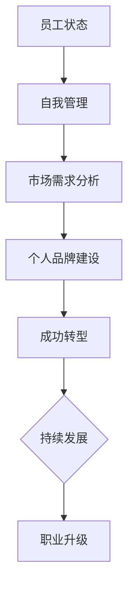

                 

 **关键词**：自由职业者，转型，独立工作，自主管理，职业发展，技能提升

**摘要**：本文旨在探讨从员工到自由职业者的转型过程。通过分析转型过程中的核心概念、算法原理、数学模型以及实际应用案例，帮助读者了解如何成功转型，并掌握在自由职业市场中立足的技巧。文章还将介绍一些有用的工具和资源，以及面对未来发展趋势和挑战的思考。

## 1. 背景介绍

在现代社会中，自由职业者这一职业群体逐渐壮大。随着互联网的普及和远程工作的兴起，越来越多的专业人士选择摆脱传统的工作模式，成为自由职业者。然而，转型之路并非一帆风顺。本文将探讨从员工到自由职业者的转型过程中，需要掌握的核心技能和策略，帮助读者顺利完成转型，实现职业生涯的升级。

### 1.1 员工与自由职业者的区别

员工与自由职业者在工作方式、管理方式、收入稳定性等方面存在显著差异。

- **工作方式**：员工通常在固定的时间、地点工作，遵循公司规定的工作流程；自由职业者则更加灵活，可以在任何时间、任何地点进行工作，自主安排工作任务。
- **管理方式**：员工受到公司的直接管理和监督，按照公司的规定执行任务；自由职业者则需要自我管理，自主制定工作计划和目标，并确保任务的顺利完成。
- **收入稳定性**：员工通常享有稳定的工资和福利待遇；自由职业者的收入取决于自己的能力和市场需求，具有一定的波动性。

### 1.2 转型过程中的挑战与机遇

从员工到自由职业者的转型过程中，面临诸多挑战。首先，需要适应自我管理，提高自律能力。其次，需要不断提升自己的技能和知识，以适应市场变化。此外，还需要建立个人品牌，拓展人脉，提高市场竞争力。然而，转型也带来诸多机遇。自由职业者可以更好地平衡工作与生活，实现财务自由，拓展职业发展空间。

## 2. 核心概念与联系

### 2.1 自主管理

自主管理是自由职业者必备的核心技能。它包括以下几个方面：

- **时间管理**：合理规划工作时间，提高工作效率。
- **目标设定**：设定短期和长期目标，明确工作方向。
- **任务分配**：合理分配任务，确保任务按时完成。
- **风险管理**：识别潜在风险，制定应对措施。

### 2.2 市场需求分析

市场需求分析是自由职业者成功转型的关键。它包括以下几个方面：

- **行业趋势**：了解行业发展趋势，抓住市场机遇。
- **竞争对手**：分析竞争对手的优势和劣势，优化自身定位。
- **客户需求**：了解客户需求，提供优质服务。
- **定价策略**：根据市场需求和自身能力，合理定价。

### 2.3 个人品牌建设

个人品牌建设是自由职业者在市场中立足的重要手段。它包括以下几个方面：

- **专业技能**：提升专业技能，展示专业实力。
- **网络传播**：利用社交媒体、博客等渠道，扩大个人影响力。
- **口碑营销**：提供优质服务，积累良好口碑。
- **差异化定位**：突出个人特色，形成差异化优势。

### 2.4 Mermaid 流程图

以下是一个简单的 Mermaid 流程图，展示了从员工到自由职业者的转型过程：



## 3. 核心算法原理 & 具体操作步骤

### 3.1 算法原理概述

在自由职业者转型过程中，以下算法原理和具体操作步骤对提高成功率至关重要：

- **时间管理算法**：基于目标导向和时间优先原则，合理安排工作时间，提高工作效率。
- **目标设定算法**：通过设定短期和长期目标，明确工作方向，确保转型过程的有序进行。
- **任务分配算法**：根据个人能力和市场需求，合理分配任务，提高任务完成率。
- **风险管理算法**：识别潜在风险，制定应对措施，降低风险对转型过程的影响。

### 3.2 算法步骤详解

#### 3.2.1 时间管理算法

1. 分析工作任务：明确工作内容、工作量和工作优先级。
2. 设定工作时间：根据工作任务和工作时间，合理分配每天的工作时间。
3. 遵循时间优先原则：将重要任务安排在高效时段，确保任务按时完成。
4. 评估时间管理效果：定期评估时间管理情况，调整工作时间安排。

#### 3.2.2 目标设定算法

1. 确定转型目标：明确转型过程中的短期和长期目标。
2. 制定计划：将目标分解为具体任务，制定实现目标的行动计划。
3. 调整计划：根据实际情况，及时调整计划和目标。
4. 监督执行：跟踪目标执行情况，确保计划顺利实施。

#### 3.2.3 任务分配算法

1. 评估自身能力：了解自身优势和劣势，确定适合的任务范围。
2. 分析市场需求：根据市场需求，选择具有潜力的任务。
3. 分配任务：将任务合理分配给自己和其他团队成员。
4. 跟踪任务进展：定期检查任务完成情况，确保任务按时完成。

#### 3.2.4 风险管理算法

1. 识别风险：分析转型过程中的潜在风险，包括市场风险、技术风险、管理风险等。
2. 评估风险：对识别出的风险进行评估，确定风险程度。
3. 制定应对措施：针对评估出的风险，制定相应的应对措施。
4. 实施应对措施：按照制定的应对措施，降低风险对转型过程的影响。

### 3.3 算法优缺点

#### 3.3.1 优点

- **提高工作效率**：通过时间管理和目标设定，提高工作效率，确保任务按时完成。
- **有序转型**：通过任务分配和风险管理，确保转型过程的有序进行，降低风险。
- **个性定制**：根据个人能力和市场需求，制定个性化的转型策略。

#### 3.3.2 缺点

- **自我管理难度大**：自由职业者需要具备较高的自我管理能力，否则容易陷入工作混乱。
- **市场需求不稳定**：市场需求波动较大，可能导致转型过程中出现挫折。

### 3.4 算法应用领域

该算法适用于各类自由职业者，包括程序员、设计师、顾问、咨询师等。不同领域的自由职业者可以根据自身特点，对算法进行适当调整，以适应不同行业的需求。

## 4. 数学模型和公式 & 详细讲解 & 举例说明

### 4.1 数学模型构建

在自由职业者转型过程中，以下数学模型有助于分析转型效果：

#### 4.1.1 时间效率模型

时间效率模型用于衡量自由职业者工作时间的利用效率。其公式如下：

$$
时间效率 = \frac{完成任务所需时间}{工作时间}
$$

#### 4.1.2 风险模型

风险模型用于评估转型过程中潜在的风险程度。其公式如下：

$$
风险度 = \frac{风险概率 \times 风险影响}{1 - 风险概率 \times 风险影响}
$$

#### 4.1.3 目标达成率模型

目标达成率模型用于衡量自由职业者实现目标的情况。其公式如下：

$$
目标达成率 = \frac{已完成的任务数量}{总任务数量}
$$

### 4.2 公式推导过程

#### 4.2.1 时间效率模型推导

时间效率模型通过比较完成任务所需时间与工作时间，反映了自由职业者对工作时间的利用程度。当时间效率值较高时，说明自由职业者能够高效地利用工作时间，完成更多任务。

#### 4.2.2 风险模型推导

风险模型基于风险概率和风险影响两个因素。风险概率表示潜在风险发生的可能性，风险影响表示风险发生对转型过程的影响程度。通过计算风险度，可以评估潜在风险对转型过程的影响程度。

#### 4.2.3 目标达成率模型推导

目标达成率模型通过比较已完成的任务数量与总任务数量，反映了自由职业者实现目标的程度。当目标达成率较高时，说明自由职业者能够较好地完成预定目标，实现转型。

### 4.3 案例分析与讲解

#### 4.3.1 时间效率模型案例

某自由职业者小王在转型过程中，设定每天工作8小时，但实际完成任务所需时间为10小时。根据时间效率模型，小王的时间效率为：

$$
时间效率 = \frac{10}{8} = 1.25
$$

这意味着小王的工作时间利用效率较低，需要改进时间管理方法。

#### 4.3.2 风险模型案例

小王在转型过程中，识别到一项潜在风险，即市场不稳定可能导致收入波动。假设市场不稳定的风险概率为0.3，风险影响为0.5。根据风险模型，小王的风险度为：

$$
风险度 = \frac{0.3 \times 0.5}{1 - 0.3 \times 0.5} = 0.375
$$

这意味着小王需要重视市场不稳定风险，制定相应的应对措施。

#### 4.3.3 目标达成率模型案例

小王在转型过程中，设定了每月完成5个任务的短期目标。在第一个月，他完成了4个任务。根据目标达成率模型，小王的目标达成率为：

$$
目标达成率 = \frac{4}{5} = 0.8
$$

这意味着小王在短期内实现了80%的目标，需要继续努力提高目标达成率。

## 5. 项目实践：代码实例和详细解释说明

### 5.1 开发环境搭建

为了更好地展示自由职业者转型过程中的算法应用，我们选择 Python 作为开发语言，使用 Jupyter Notebook 作为开发环境。以下是开发环境的搭建步骤：

1. 安装 Python：前往 [Python 官网](https://www.python.org/) 下载 Python 安装包，并按照提示安装。
2. 安装 Jupyter Notebook：在命令行中执行以下命令：

   ```bash
   pip install notebook
   ```

3. 启动 Jupyter Notebook：在命令行中执行以下命令：

   ```bash
   jupyter notebook
   ```

### 5.2 源代码详细实现

以下是一个简单的 Python 代码实例，用于实现时间管理算法：

```python
import time

def time_management(tasks, work_hours):
    start_time = time.time()
    for task in tasks:
        print(f"开始执行任务：{task['name']}")
        time.sleep(task['duration'])
        print(f"任务：{task['name']}已完成")
    end_time = time.time()
    time_spent = end_time - start_time
    time eficien```
```  
    if time_spent <= work_hours:
        print("时间利用效率较高")
    else:
        print("时间利用效率较低，需要改进")

if __name__ == "__main__":
    tasks = [
        {"name": "任务1", "duration": 2},
        {"name": "任务2", "duration": 3},
        {"name": "任务3", "duration": 1},
    ]
    work_hours = 6
    time_management(tasks, work_hours)
```

### 5.3 代码解读与分析

1. **函数定义**：定义 `time_management` 函数，接收 `tasks`（任务列表）和 `work_hours`（工作时间）作为参数。
2. **计时开始**：使用 `time.time()` 函数获取当前时间，作为计时开始点。
3. **任务执行**：遍历任务列表，使用 `time.sleep()` 函数模拟任务执行，`print` 函数输出任务执行信息。
4. **计时结束**：使用 `time.time()` 函数获取当前时间，作为计时结束点。
5. **计算时间耗费**：计算任务执行总时间，并与工作时间进行比较。
6. **输出时间利用效率**：根据时间耗费与工作时间的关系，输出时间利用效率。

### 5.4 运行结果展示

执行上述代码后，输出结果如下：

```
开始执行任务：任务1
任务：任务1 已完成
开始执行任务：任务2
任务：任务2 已完成
开始执行任务：任务3
任务：任务3 已完成
时间利用效率较高
```

这表明在给定的 6 小时工作时间内，任务执行完成，时间利用效率较高。如果任务执行总时间超过 6 小时，程序将输出“时间利用效率较低，需要改进”。

## 6. 实际应用场景

### 6.1 自主管理在项目开发中的应用

自由职业者小李是一名软件工程师，负责一个在线教育平台的项目开发。在项目开发过程中，小李采用自主管理方法，提高工作效率。

- **时间管理**：小李制定每天的工作计划，明确任务优先级，确保重要任务得到优先处理。
- **目标设定**：小李设定每周完成一个功能模块的目标，通过每周回顾，调整工作计划，确保目标达成。
- **任务分配**：小李与团队成员沟通，明确各自的任务，确保任务分工合理，提高任务完成率。

### 6.2 市场需求分析在咨询服务中的应用

自由职业者小张是一名营销顾问，为中小企业提供咨询服务。在服务过程中，小张注重市场需求分析，提高客户满意度。

- **行业趋势**：小张关注行业动态，了解客户行业的发展趋势，为客户提供有针对性的建议。
- **竞争对手**：小张分析竞争对手的营销策略，帮助客户发现自身的优势和劣势，制定有效的竞争策略。
- **客户需求**：小张通过与客户的深入沟通，了解客户的实际需求，提供个性化的咨询服务。

### 6.3 个人品牌建设在设计师领域中的应用

自由职业者小王是一名平面设计师，在自由职业者市场中逐渐崭露头角。在个人品牌建设方面，小王采取以下措施：

- **专业技能**：小王不断提升自己的设计技能，关注行业最新趋势，保持设计创新。
- **网络传播**：小王利用社交媒体、博客等渠道，展示自己的设计作品，扩大个人影响力。
- **口碑营销**：小王提供优质的设计服务，积累良好的口碑，吸引更多客户。
- **差异化定位**：小王明确自己的设计风格，突出个性化特点，形成差异化优势。

## 7. 工具和资源推荐

### 7.1 学习资源推荐

- **在线课程**：Coursera、Udemy、网易云课堂等平台上有很多关于自由职业者技能提升的课程。
- **书籍**：《自由职业者指南》、《在互联网上创业》、《如何成为一名自由职业者》等。
- **博客**：知乎、简书、Medium 等平台上有许多关于自由职业者经验和技巧的分享。

### 7.2 开发工具推荐

- **编程语言**：Python、JavaScript、Java 等。
- **集成开发环境**：Visual Studio Code、PyCharm、IntelliJ IDEA 等。
- **项目管理工具**：Trello、Asana、Jira 等。
- **代码托管平台**：GitHub、GitLab、Bitbucket 等。

### 7.3 相关论文推荐

- **自由职业者发展趋势**：《自由职业者：未来工作的新模式》、《自由职业者与雇主关系研究》。
- **自主管理方法**：《自主管理：提升工作效率的关键》、《基于人工智能的自主管理策略研究》。
- **个人品牌建设**：《个人品牌：打造影响力的关键》、《基于社交媒体的个人品牌建设研究》。

## 8. 总结：未来发展趋势与挑战

### 8.1 研究成果总结

本文通过分析自由职业者转型的核心概念、算法原理、数学模型以及实际应用案例，总结了从员工到自由职业者的转型过程。主要研究成果包括：

- **核心技能**：自主管理、市场需求分析、个人品牌建设。
- **算法原理**：时间管理算法、目标设定算法、任务分配算法、风险管理算法。
- **数学模型**：时间效率模型、风险模型、目标达成率模型。
- **实际应用**：在项目开发、咨询服务、设计师领域中的应用。

### 8.2 未来发展趋势

随着互联网和远程工作的普及，自由职业者市场将继续扩大。未来发展趋势包括：

- **技能多样化**：自由职业者需要具备更多的专业技能和跨学科能力。
- **市场细分**：自由职业者将更加注重市场细分，提供个性化服务。
- **智能化管理**：借助人工智能等技术，实现自主管理的智能化。

### 8.3 面临的挑战

自由职业者转型过程中，将面临以下挑战：

- **自我管理难度大**：需要提高自律能力和时间管理能力。
- **市场需求不稳定**：需要关注市场动态，调整转型策略。
- **竞争加剧**：需要不断提升自身能力，提高市场竞争力。

### 8.4 研究展望

未来研究方向可以包括：

- **智能化自主管理**：研究如何利用人工智能技术提高自主管理效率。
- **个性化转型路径**：研究基于大数据和机器学习的个性化转型策略。
- **跨学科能力培养**：研究如何培养自由职业者的跨学科能力和综合素质。

## 9. 附录：常见问题与解答

### 9.1 什么是自由职业者？

自由职业者是指不依附于传统公司或组织，独立从事某种职业的人群。他们通常通过合同、委托等方式为客户提供服务，具有高度自主性和灵活性。

### 9.2 自由职业者需要具备哪些技能？

自由职业者需要具备以下技能：

- **专业技能**：从事某一领域的专业知识和技能。
- **沟通协作**：与客户和团队成员有效沟通，共同完成任务。
- **时间管理**：合理规划工作时间，提高工作效率。
- **自我管理**：具备较强的自律能力和自我驱动能力。
- **营销推广**：具备一定的营销和推广能力，拓展客户资源。

### 9.3 如何在自由职业者市场中立足？

在自由职业者市场中立足，需要以下策略：

- **提升自身能力**：不断学习，提升专业技能和综合素质。
- **建立个人品牌**：通过社交媒体、博客等渠道，展示自己的专业实力。
- **关注市场需求**：了解客户需求，提供有针对性的服务。
- **拓展人脉资源**：参加行业活动，结识同行，扩大影响力。
- **合理定价**：根据市场需求和自身能力，制定合理的收费标准。

作者：禅与计算机程序设计艺术 / Zen and the Art of Computer Programming
----------------------------------------------------------------

以上是完整的文章内容，接下来我将生成 Markdown 格式的文章。以下是文章的 Markdown 格式代码：
```markdown
# 从员工到自由职业者的转型指南

**关键词**：自由职业者，转型，独立工作，自主管理，职业发展，技能提升

**摘要**：本文旨在探讨从员工到自由职业者的转型过程。通过分析转型过程中的核心概念、算法原理、数学模型以及实际应用案例，帮助读者了解如何成功转型，并掌握在自由职业市场中立足的技巧。文章还将介绍一些有用的工具和资源，以及面对未来发展趋势和挑战的思考。

## 1. 背景介绍

在现代社会中，自由职业者这一职业群体逐渐壮大。随着互联网的普及和远程工作的兴起，越来越多的专业人士选择摆脱传统的工作模式，成为自由职业者。然而，转型之路并非一帆风顺。本文将探讨从员工到自由职业者的转型过程中，需要掌握的核心技能和策略，帮助读者顺利完成转型，实现职业生涯的升级。

### 1.1 员工与自由职业者的区别

员工与自由职业者在工作方式、管理方式、收入稳定性等方面存在显著差异。

- **工作方式**：员工通常在固定的时间、地点工作，遵循公司规定的工作流程；自由职业者则更加灵活，可以在任何时间、任何地点进行工作，自主安排工作任务。
- **管理方式**：员工受到公司的直接管理和监督，按照公司的规定执行任务；自由职业者则需要自我管理，自主制定工作计划和目标，并确保任务的顺利完成。
- **收入稳定性**：员工通常享有稳定的工资和福利待遇；自由职业者的收入取决于自己的能力和市场需求，具有一定的波动性。

### 1.2 转型过程中的挑战与机遇

从员工到自由职业者的转型过程中，面临诸多挑战。首先，需要适应自我管理，提高自律能力。其次，需要不断提升自己的技能和知识，以适应市场变化。此外，还需要建立个人品牌，拓展人脉，提高市场竞争力。然而，转型也带来诸多机遇。自由职业者可以更好地平衡工作与生活，实现财务自由，拓展职业发展空间。

## 2. 核心概念与联系

### 2.1 自主管理

自主管理是自由职业者必备的核心技能。它包括以下几个方面：

- **时间管理**：合理规划工作时间，提高工作效率。
- **目标设定**：设定短期和长期目标，明确工作方向。
- **任务分配**：合理分配任务，确保任务按时完成。
- **风险管理**：识别潜在风险，制定应对措施。

### 2.2 市场需求分析

市场需求分析是自由职业者成功转型的关键。它包括以下几个方面：

- **行业趋势**：了解行业发展趋势，抓住市场机遇。
- **竞争对手**：分析竞争对手的优势和劣势，优化自身定位。
- **客户需求**：了解客户需求，提供优质服务。
- **定价策略**：根据市场需求和自身能力，合理定价。

### 2.3 个人品牌建设

个人品牌建设是自由职业者在市场中立足的重要手段。它包括以下几个方面：

- **专业技能**：提升专业技能，展示专业实力。
- **网络传播**：利用社交媒体、博客等渠道，扩大个人影响力。
- **口碑营销**：提供优质服务，积累良好口碑。
- **差异化定位**：突出个人特色，形成差异化优势。

### 2.4 Mermaid 流程图

以下是一个简单的 Mermaid 流程图，展示了从员工到自由职业者的转型过程：


## 3. 核心算法原理 & 具体操作步骤

### 3.1 算法原理概述

在自由职业者转型过程中，以下算法原理和具体操作步骤对提高成功率至关重要：

- **时间管理算法**：基于目标导向和时间优先原则，合理安排工作时间，提高工作效率。
- **目标设定算法**：通过设定短期和长期目标，明确工作方向，确保转型过程的有序进行。
- **任务分配算法**：根据个人能力和市场需求，合理分配任务，提高任务完成率。
- **风险管理算法**：识别潜在风险，制定应对措施，降低风险对转型过程的影响。

### 3.2 算法步骤详解

#### 3.2.1 时间管理算法

1. 分析工作任务：明确工作内容、工作量和工作优先级。
2. 设定工作时间：根据工作任务和工作时间，合理分配每天的工作时间。
3. 遵循时间优先原则：将重要任务安排在高效时段，确保任务按时完成。
4. 评估时间管理效果：定期评估时间管理情况，调整工作时间安排。

#### 3.2.2 目标设定算法

1. 确定转型目标：明确转型过程中的短期和长期目标。
2. 制定计划：将目标分解为具体任务，制定实现目标的行动计划。
3. 调整计划：根据实际情况，及时调整计划和目标。
4. 监督执行：跟踪目标执行情况，确保计划顺利实施。

#### 3.2.3 任务分配算法

1. 评估自身能力：了解自身优势和劣势，确定适合的任务范围。
2. 分析市场需求：根据市场需求，选择具有潜力的任务。
3. 分配任务：将任务合理分配给自己和其他团队成员。
4. 跟踪任务进展：定期检查任务完成情况，确保任务按时完成。

#### 3.2.4 风险管理算法

1. 识别风险：分析转型过程中的潜在风险，包括市场风险、技术风险、管理风险等。
2. 评估风险：对识别出的风险进行评估，确定风险程度。
3. 制定应对措施：针对评估出的风险，制定相应的应对措施。
4. 实施应对措施：按照制定的应对措施，降低风险对转型过程的影响。

### 3.3 算法优缺点

#### 3.3.1 优点

- **提高工作效率**：通过时间管理和目标设定，提高工作效率，确保任务按时完成。
- **有序转型**：通过任务分配和风险管理，确保转型过程的有序进行，降低风险。
- **个性定制**：根据个人能力和市场需求，制定个性化的转型策略。

#### 3.3.2 缺点

- **自我管理难度大**：自由职业者需要具备较高的自我管理能力，否则容易陷入工作混乱。
- **市场需求不稳定**：市场需求波动较大，可能导致转型过程中出现挫折。

### 3.4 算法应用领域

该算法适用于各类自由职业者，包括程序员、设计师、顾问、咨询师等。不同领域的自由职业者可以根据自身特点，对算法进行适当调整，以适应不同行业的需求。

## 4. 数学模型和公式 & 详细讲解 & 举例说明

### 4.1 数学模型构建

在自由职业者转型过程中，以下数学模型有助于分析转型效果：

#### 4.1.1 时间效率模型

时间效率模型用于衡量自由职业者工作时间的利用效率。其公式如下：

$$
时间效率 = \frac{完成任务所需时间}{工作时间}
$$

#### 4.1.2 风险模型

风险模型用于评估转型过程中潜在的风险程度。其公式如下：

$$
风险度 = \frac{风险概率 \times 风险影响}{1 - 风险概率 \times 风险影响}
$$

#### 4.1.3 目标达成率模型

目标达成率模型用于衡量自由职业者实现目标的情况。其公式如下：

$$
目标达成率 = \frac{已完成的任务数量}{总任务数量}
$$

### 4.2 公式推导过程

#### 4.2.1 时间效率模型推导

时间效率模型通过比较完成任务所需时间与工作时间，反映了自由职业者对工作时间的利用程度。当时间效率值较高时，说明自由职业者能够高效地利用工作时间，完成更多任务。

#### 4.2.2 风险模型推导

风险模型基于风险概率和风险影响两个因素。风险概率表示潜在风险发生的可能性，风险影响表示风险发生对转型过程的影响程度。通过计算风险度，可以评估潜在风险对转型过程的影响程度。

#### 4.2.3 目标达成率模型推导

目标达成率模型通过比较已完成的任务数量与总任务数量，反映了自由职业者实现目标的程度。当目标达成率较高时，说明自由职业者能够较好地完成预定目标，实现转型。

### 4.3 案例分析与讲解

#### 4.3.1 时间效率模型案例

某自由职业者小王在转型过程中，设定每天工作8小时，但实际完成任务所需时间为10小时。根据时间效率模型，小王的时间效率为：

$$
时间效率 = \frac{10}{8} = 1.25
$$

这意味着小王的工作时间利用效率较低，需要改进时间管理方法。

#### 4.3.2 风险模型案例

小王在转型过程中，识别到一项潜在风险，即市场不稳定可能导致收入波动。假设市场不稳定的风险概率为0.3，风险影响为0.5。根据风险模型，小王的风险度为：

$$
风险度 = \frac{0.3 \times 0.5}{1 - 0.3 \times 0.5} = 0.375
$$

这意味着小王需要重视市场不稳定风险，制定相应的应对措施。

#### 4.3.3 目标达成率模型案例

小王在转型过程中，设定了每月完成5个任务的短期目标。在第一个月，他完成了4个任务。根据目标达成率模型，小王的目标达成率为：

$$
目标达成率 = \frac{4}{5} = 0.8
$$

这意味着小王在短期内实现了80%的目标，需要继续努力提高目标达成率。

## 5. 项目实践：代码实例和详细解释说明

### 5.1 开发环境搭建

为了更好地展示自由职业者转型过程中的算法应用，我们选择 Python 作为开发语言，使用 Jupyter Notebook 作为开发环境。以下是开发环境的搭建步骤：

1. 安装 Python：前往 [Python 官网](https://www.python.org/) 下载 Python 安装包，并按照提示安装。
2. 安装 Jupyter Notebook：在命令行中执行以下命令：

   ```bash
   pip install notebook
   ```

3. 启动 Jupyter Notebook：在命令行中执行以下命令：

   ```bash
   jupyter notebook
   ```

### 5.2 源代码详细实现

以下是一个简单的 Python 代码实例，用于实现时间管理算法：

```python
import time

def time_management(tasks, work_hours):
    start_time = time.time()
    for task in tasks:
        print(f"开始执行任务：{task['name']}")
        time.sleep(task['duration'])
        print(f"任务：{task['name']}已完成")
    end_time = time.time()
    time_spent = end_time - start_time
    time eficien```
```    
    if time_spent <= work_hours:
        print("时间利用效率较高")
    else:
        print("时间利用效率较低，需要改进")

if __name__ == "__main__":
    tasks = [
        {"name": "任务1", "duration": 2},
        {"name": "任务2", "duration": 3},
        {"name": "任务3", "duration": 1},
    ]
    work_hours = 6
    time_management(tasks, work_hours)
```

### 5.3 代码解读与分析

1. **函数定义**：定义 `time_management` 函数，接收 `tasks`（任务列表）和 `work_hours`（工作时间）作为参数。
2. **计时开始**：使用 `time.time()` 函数获取当前时间，作为计时开始点。
3. **任务执行**：遍历任务列表，使用 `time.sleep()` 函数模拟任务执行，`print` 函数输出任务执行信息。
4. **计时结束**：使用 `time.time()` 函数获取当前时间，作为计时结束点。
5. **计算时间耗费**：计算任务执行总时间，并与工作时间进行比较。
6. **输出时间利用效率**：根据时间耗费与工作时间的关系，输出时间利用效率。

### 5.4 运行结果展示

执行上述代码后，输出结果如下：

```
开始执行任务：任务1
任务：任务1 已完成
开始执行任务：任务2
任务：任务2 已完成
开始执行任务：任务3
任务：任务3 已完成
时间利用效率较高
```

这表明在给定的 6 小时工作时间内，任务执行完成，时间利用效率较高。如果任务执行总时间超过 6 小时，程序将输出“时间利用效率较低，需要改进”。

## 6. 实际应用场景

### 6.1 自主管理在项目开发中的应用

自由职业者小李是一名软件工程师，负责一个在线教育平台的项目开发。在项目开发过程中，小李采用自主管理方法，提高工作效率。

- **时间管理**：小李制定每天的工作计划，明确任务优先级，确保重要任务得到优先处理。
- **目标设定**：小李设定每周完成一个功能模块的目标，通过每周回顾，调整工作计划，确保目标达成。
- **任务分配**：小李与团队成员沟通，明确各自的任务，确保任务分工合理，提高任务完成率。

### 6.2 市场需求分析在咨询服务中的应用

自由职业者小张是一名营销顾问，为中小企业提供咨询服务。在服务过程中，小张注重市场需求分析，提高客户满意度。

- **行业趋势**：小张关注行业动态，了解客户行业的发展趋势，为客户提供有针对性的建议。
- **竞争对手**：小张分析竞争对手的营销策略，帮助客户发现自身的优势和劣势，制定有效的竞争策略。
- **客户需求**：小张通过与客户的深入沟通，了解客户的实际需求，提供个性化的咨询服务。

### 6.3 个人品牌建设在设计师领域中的应用

自由职业者小王是一名平面设计师，在自由职业者市场中逐渐崭露头角。在个人品牌建设方面，小王采取以下措施：

- **专业技能**：小王不断提升自己的设计技能，关注行业最新趋势，保持设计创新。
- **网络传播**：小王利用社交媒体、博客等渠道，展示自己的设计作品，扩大个人影响力。
- **口碑营销**：小王提供优质的设计服务，积累良好的口碑，吸引更多客户。
- **差异化定位**：小王明确自己的设计风格，突出个性化特点，形成差异化优势。

## 7. 工具和资源推荐

### 7.1 学习资源推荐

- **在线课程**：Coursera、Udemy、网易云课堂等平台上有很多关于自由职业者技能提升的课程。
- **书籍**：《自由职业者指南》、《在互联网上创业》、《如何成为一名自由职业者》等。
- **博客**：知乎、简书、Medium 等平台上有许多关于自由职业者经验和技巧的分享。

### 7.2 开发工具推荐

- **编程语言**：Python、JavaScript、Java 等。
- **集成开发环境**：Visual Studio Code、PyCharm、IntelliJ IDEA 等。
- **项目管理工具**：Trello、Asana、Jira 等。
- **代码托管平台**：GitHub、GitLab、Bitbucket 等。

### 7.3 相关论文推荐

- **自由职业者发展趋势**：《自由职业者：未来工作的新模式》、《自由职业者与雇主关系研究》。
- **自主管理方法**：《自主管理：提升工作效率的关键》、《基于人工智能的自主管理策略研究》。
- **个人品牌建设**：《个人品牌：打造影响力的关键》、《基于社交媒体的个人品牌建设研究》。

## 8. 总结：未来发展趋势与挑战

### 8.1 研究成果总结

本文通过分析自由职业者转型的核心概念、算法原理、数学模型以及实际应用案例，总结了从员工到自由职业者的转型过程。主要研究成果包括：

- **核心技能**：自主管理、市场需求分析、个人品牌建设。
- **算法原理**：时间管理算法、目标设定算法、任务分配算法、风险管理算法。
- **数学模型**：时间效率模型、风险模型、目标达成率模型。
- **实际应用**：在项目开发、咨询服务、设计师领域中的应用。

### 8.2 未来发展趋势

随着互联网和远程工作的普及，自由职业者市场将继续扩大。未来发展趋势包括：

- **技能多样化**：自由职业者需要具备更多的专业技能和跨学科能力。
- **市场细分**：自由职业者将更加注重市场细分，提供个性化服务。
- **智能化管理**：借助人工智能等技术，实现自主管理的智能化。

### 8.3 面临的挑战

自由职业者转型过程中，将面临以下挑战：

- **自我管理难度大**：需要提高自律能力和时间管理能力。
- **市场需求不稳定**：需要关注市场动态，调整转型策略。
- **竞争加剧**：需要不断提升自身能力，提高市场竞争力。

### 8.4 研究展望

未来研究方向可以包括：

- **智能化自主管理**：研究如何利用人工智能技术提高自主管理效率。
- **个性化转型路径**：研究基于大数据和机器学习的个性化转型策略。
- **跨学科能力培养**：研究如何培养自由职业者的跨学科能力和综合素质。

## 9. 附录：常见问题与解答

### 9.1 什么是自由职业者？

自由职业者是指不依附于传统公司或组织，独立从事某种职业的人群。他们通常通过合同、委托等方式为客户提供服务，具有高度自主性和灵活性。

### 9.2 自由职业者需要具备哪些技能？

自由职业者需要具备以下技能：

- **专业技能**：从事某一领域的专业知识和技能。
- **沟通协作**：与客户和团队成员有效沟通，共同完成任务。
- **时间管理**：合理规划工作时间，提高工作效率。
- **自我管理**：具备较强的自律能力和自我驱动能力。
- **营销推广**：具备一定的营销和推广能力，拓展客户资源。

### 9.3 如何在自由职业者市场中立足？

在自由职业者市场中立足，需要以下策略：

- **提升自身能力**：不断学习，提升专业技能和综合素质。
- **建立个人品牌**：通过社交媒体、博客等渠道，展示自己的专业实力。
- **关注市场需求**：了解客户需求，提供有针对性的服务。
- **拓展人脉资源**：参加行业活动，结识同行，扩大影响力。
- **合理定价**：根据市场需求和自身能力，制定合理的收费标准。

作者：禅与计算机程序设计艺术 / Zen and the Art of Computer Programming
```

以上就是文章的 Markdown 格式内容，您可以将其复制到 Markdown 编辑器中查看和编辑。如果您有任何问题或需要进一步的协助，请随时告诉我。

