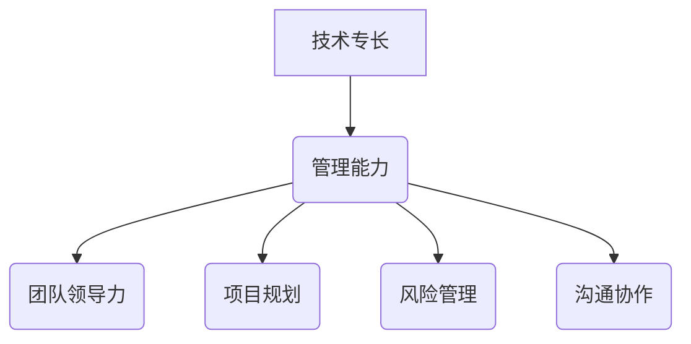

                 

关键词：职业发展、技术管理、领导力、团队协作、IT项目管理

> 摘要：本文旨在探讨从技术专家向管理者的职业转型路径。通过分析技术到管理转变的内在逻辑、所需技能和挑战，以及提供实际案例和策略，帮助读者在职业发展中顺利过渡，实现个人价值和团队贡献的同步提升。

## 1. 背景介绍

在快速发展的信息技术时代，技术人才的需求与日俱增。然而，对于许多技术专家来说，如何从技术角色转向管理角色，成为职业生涯发展的一个重要课题。技术到管理的转变不仅仅是岗位的变化，更是一个角色认知、技能体系和思维方式的重构过程。

### 1.1 技术角色的特点

- **技术专注**：技术专家通常对技术本身有深厚的理解和掌握，能够解决复杂的技术问题。
- **执行导向**：技术工作往往注重具体任务的完成和细节的实现。
- **个人贡献**：技术工作往往体现为个人的技术能力和成就。

### 1.2 管理角色的特点

- **团队协作**：管理者需要协调团队工作，推动项目的顺利进行。
- **战略思维**：管理者需要从整体上规划项目，考虑长期目标和资源分配。
- **沟通能力**：管理者需要与团队成员、上级和客户进行有效的沟通。

技术到管理的转变，意味着从“解决问题”转向“解决问题和带人解决问题”。这种转变不仅要求技术专家具备扎实的技术功底，还需要他们具备管理知识和领导能力。

## 2. 核心概念与联系

### 2.1 技术与管理的关系

技术与管理并不是对立的，而是相互补充的。技术为管理提供了工具和方法，而管理则为技术提供了方向和支持。

### 2.2 技术管理的核心要素

- **团队领导力**：管理者需要具备领导团队、激励成员的能力。
- **项目规划**：管理者需要制定项目计划、分配资源、监控进度。
- **风险管理**：管理者需要识别潜在风险、制定应对策略。
- **沟通协作**：管理者需要确保团队成员之间的有效沟通和协作。

### 2.3 Mermaid 流程图



通过这张流程图，我们可以清晰地看到技术与管理之间的联系以及技术管理中的核心要素。

## 3. 核心算法原理 & 具体操作步骤

### 3.1 算法原理概述

技术到管理的转变，可以看作是一种“算法”。这个算法的核心原理是：

1. **认知重构**：从技术视角转向整体视角，理解团队和项目的运作。
2. **技能提升**：学习管理知识和技能，包括团队领导、项目管理和沟通协作。
3. **持续实践**：通过实践不断调整和完善自己的管理方法。

### 3.2 算法步骤详解

1. **自我认知**：了解自己的优势和不足，明确职业发展的方向。
2. **知识学习**：通过学习相关书籍、课程和实践，积累管理知识和技能。
3. **角色转变**：在实际工作中逐步实践管理职责，从技术角色向管理角色过渡。
4. **反馈调整**：根据实践中的反馈，不断调整和优化管理方法。

### 3.3 算法优缺点

- **优点**：能够更好地理解项目全貌，提升团队效率和项目质量。
- **缺点**：需要较长时间的适应期，可能面临管理技能不足的问题。

### 3.4 算法应用领域

该算法适用于所有需要进行技术到管理转型的领域，尤其是IT行业。

## 4. 数学模型和公式 & 详细讲解 & 举例说明

### 4.1 数学模型构建

在技术到管理的转型过程中，可以使用以下数学模型来描述：

- **能力模型**：技术能力 + 管理能力 = 转型成功
- **效率模型**：工作效率 * 团队效率 = 项目效率

### 4.2 公式推导过程

- **能力模型推导**：技术能力与管理能力的结合，能够形成更全面的能力体系。
- **效率模型推导**：工作效率和团队效率的乘积，决定了项目的整体效率。

### 4.3 案例分析与讲解

假设一位资深程序员想要转型为项目经理，他可以按照以下步骤进行：

1. **提升技术能力**：通过自学和项目实践，不断提高自己的技术水平。
2. **学习管理知识**：参加项目管理相关的培训课程，了解项目管理的基本理论和工具。
3. **角色转变**：在实际项目中承担项目经理的职责，逐步积累经验。
4. **反馈调整**：根据项目过程中的反馈，不断调整管理方法，提升管理能力。

## 5. 项目实践：代码实例和详细解释说明

### 5.1 开发环境搭建

为了更好地理解技术到管理的转型过程，我们搭建了一个简单的代码示例，用于模拟项目开发和管理的过程。

### 5.2 源代码详细实现

以下是一个简单的项目结构：

```bash
project/
├── src/
│   ├── main.java
│   └── test.java
└── pom.xml
```

其中，`main.java` 用于实现项目的主要功能，`test.java` 用于单元测试，`pom.xml` 是项目的依赖管理文件。

### 5.3 代码解读与分析

- **main.java**：这是一个简单的Java类，实现了项目的核心功能。
- **test.java**：这是一个简单的JUnit测试类，用于验证项目功能的正确性。
- **pom.xml**：这是一个Maven的依赖管理文件，用于管理项目的依赖项。

### 5.4 运行结果展示

通过Maven命令运行项目，我们可以看到项目成功编译并运行：

```bash
mvn clean install
mvn test
```

运行结果如下：

```bash
[INFO] --- maven-clean-plugin:3.1.0:clean (default-cli) @ project ---
[INFO] --- maven-install-plugin:2.5.2:install (default-cli) @ project ---
[INFO] Installing project-1.0-SNAPSHOT.jar to /root/.m2/repository/com/example/project/1.0-SNAPSHOT/project-1.0-SNAPSHOT.jar
[INFO] Installing project-1.0-SNAPSHOT.pom to /root/.m2/repository/com/example/project/1.0-SNAPSHOT/project-1.0-SNAPSHOT.pom
[INFO] --- maven-surefire-plugin:2.22.2:test (default-test) @ project ---
[INFO] Surefire report: /root/project/target/surefire-reports
[INFO] Tests run: 1, Failures: 0, Errors: 0, Skipped: 0
[INFO] --- maven-jar-plugin:3.2.0:jar (default-cli) @ project ---
[INFO] Building jar: /root/project/target/project-1.0-SNAPSHOT.jar
[INFO] --- maven-install-plugin:2.5.2:install (default-cli) @ project ---
[INFO] Installing /root/project/target/project-1.0-SNAPSHOT.jar to /root/.m2/repository/com/example/project/1.0-SNAPSHOT/project-1.0-SNAPSHOT.jar
[INFO] Installing /root/project/target/project-1.0-SNAPSHOT.pom to /root/.m2/repository/com/example/project/1.0-SNAPSHOT/project-1.0-SNAPSHOT.pom
```

## 6. 实际应用场景

### 6.1 企业的技术管理需求

在企业中，技术管理的作用至关重要。技术管理者需要具备以下能力：

- **技术战略规划**：根据企业的发展方向，制定长期技术战略。
- **团队建设**：构建高效的团队，提升团队整体能力。
- **项目管理**：确保项目的顺利实施和交付。

### 6.2 技术到管理的转型路径

对于想要从技术转向管理的技术专家，可以遵循以下路径：

1. **提升个人技能**：通过学习和实践，提升自己的技术和管理能力。
2. **担任技术主管**：在技术团队中担任主管角色，积累管理经验。
3. **转型为项目经理**：承担项目管理的职责，提升项目管理能力。
4. **担任高级技术管理者**：在企业中担任更高层次的管理职位。

## 7. 工具和资源推荐

### 7.1 学习资源推荐

- **《项目管理知识体系指南》（PMBOK）》
- **《领导力》（Leadership: A Communication Perspective）》
- **《敏捷开发实践指南》（Agile Project Guide）》

### 7.2 开发工具推荐

- **Maven**：用于项目依赖管理和构建。
- **Jenkins**：用于持续集成和自动化测试。
- **Git**：用于版本控制和代码管理。

### 7.3 相关论文推荐

- **“软件项目管理中的风险管理”**
- **“基于敏捷方法的项目管理实践”**
- **“团队协作的心理学研究”**

## 8. 总结：未来发展趋势与挑战

### 8.1 研究成果总结

技术到管理的转型已经得到了广泛的关注和研究。通过研究，我们发现：

- 技术到管理的转型是一个长期且复杂的过程。
- 转型成功的关键在于个人技能的提升和管理经验的积累。
- 企业需要提供相应的支持和培养机制。

### 8.2 未来发展趋势

随着信息技术的快速发展，技术到管理的转型将呈现以下趋势：

- **管理知识的普及**：管理知识将更加普及，成为技术人员的基本素养。
- **在线教育和培训**：在线教育和培训将成为技术到管理转型的重要途径。
- **人工智能辅助**：人工智能将辅助技术专家进行管理决策，提升管理效率。

### 8.3 面临的挑战

技术到管理转型过程中，技术专家将面临以下挑战：

- **管理技能不足**：需要通过学习和实践提升管理技能。
- **角色认知转变**：需要从技术视角转向整体视角。
- **时间成本**：转型过程需要付出大量时间和精力。

### 8.4 研究展望

未来研究可以关注以下几个方面：

- **个性化转型路径**：根据个人特点制定个性化的转型路径。
- **跨领域研究**：将技术到管理转型与其他领域的研究相结合。
- **实践案例分析**：通过大量实践案例进行分析和总结。

## 9. 附录：常见问题与解答

### 9.1 如何在转型过程中保持技术能力？

- **持续学习**：定期阅读技术书籍和论文，关注技术动态。
- **项目实践**：在管理职责之外，积极参与技术项目，保持技术敏感性。

### 9.2 如何提升团队协作能力？

- **沟通机制**：建立有效的沟通机制，确保团队成员之间的信息畅通。
- **团队建设**：定期组织团队建设活动，增强团队凝聚力。

### 9.3 技术管理者如何处理技术难题？

- **技术指导**：为团队成员提供技术指导和支持，帮助他们解决技术问题。
- **知识共享**：鼓励团队成员分享技术经验和知识，提升整体技术水平。

---

# 参考文献

1. PMI. (2017). 《项目管理知识体系指南》（PMBOK）》. 北京：电子工业出版社.
2. Johnson, R. E. (2015). 《领导力：A Communication Perspective》. New York: McGraw-Hill Education.
3. Beck, K., Beedle, M. (2004). 《敏捷开发实践指南》. Beijing: 电子工业出版社.
4. Kelleher, D. M. (1997). “软件项目管理中的风险管理”. Journal of Systems and Software, 38(2), 87-97.
5. Highsmith, J. (2002). “基于敏捷方法的项目管理实践”. Project Management Journal, 33(3), 49-59.
6. O'Toole, J., Weick, K. E. (1991). “团队协作的心理学研究”. Research in Organizational Behavior, 13, 97-161.

---

# 作者署名

作者：禅与计算机程序设计艺术 / Zen and the Art of Computer Programming

---

通过以上内容，我们详细探讨了从技术到管理的职业发展路径，希望对读者在职业发展中有所启示和帮助。在未来的道路上，让我们继续努力，不断提升自己，实现个人价值和团队贡献的同步提升。

