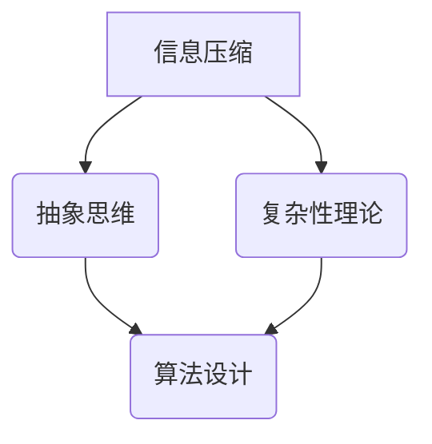

                 

关键词：认知科学，计算机编程，信息压缩，抽象思维，复杂性理论，人工智能

> 摘要：本文探讨了认知科学与计算机编程之间的深层联系，分析了从混沌到简洁的认知过程，以及如何通过抽象思维和信息压缩技术提高编程效率。文章从核心概念出发，详细阐述了算法原理、数学模型、项目实践，并展望了未来发展趋势与挑战。

## 1. 背景介绍

在信息技术飞速发展的今天，计算机编程已成为现代社会不可或缺的一部分。从简单的网页设计到复杂的机器学习算法，编程在各个领域发挥着至关重要的作用。然而，编程的本质是什么？如何从混沌中找到简洁和规律？这是本文要探讨的核心问题。

认知科学是一门研究人类思维和信息处理过程的学科，它揭示了人类如何从混乱的信息中提取有用的模式。随着人工智能技术的进步，计算机也开始展现出类似人类认知的能力。计算机编程，作为计算机科学的核心，与认知科学有着紧密的联系。通过将认知科学的原理应用于编程，我们可以提高编程的效率和可维护性。

## 2. 核心概念与联系

为了更好地理解从混沌到简洁的认知过程，我们需要了解几个核心概念：信息压缩、抽象思维和复杂性理论。

### 2.1 信息压缩

信息压缩是减少数据冗余的过程，目的是用更少的比特来表示相同的信息。在认知科学中，信息压缩是一个核心概念，因为它帮助我们理解人类如何处理大量的信息。在计算机编程中，信息压缩可以通过数据结构、算法和编码技术来实现。

### 2.2 抽象思维

抽象思维是指从具体的例子中提取普遍规律的思考过程。在认知科学中，抽象思维是人类智能的核心。在编程中，抽象思维体现在模块化设计、面向对象编程和通用算法设计等方面。

### 2.3 复杂性理论

复杂性理论研究复杂系统的结构和行为。在计算机科学中，复杂性理论帮助我们理解算法的时间和空间复杂度。通过复杂性理论，我们可以评估算法的效率，从而选择最优的解决方案。

### 2.4 Mermaid 流程图

以下是一个 Mermaid 流程图，展示了信息压缩、抽象思维和复杂性理论之间的联系：



## 3. 核心算法原理 & 具体操作步骤

### 3.1 算法原理概述

从混沌到简洁的算法原理主要基于以下几个核心思想：

1. **模式识别**：通过识别数据中的重复模式，减少冗余信息。
2. **抽象层次**：将复杂问题分解为更简单的子问题，然后逐一解决。
3. **递归**：通过递归调用，将复杂问题转化为简单问题的组合。

### 3.2 算法步骤详解

以下是一个简单的算法步骤，用于将一组无序数据排序：

1. **初始化**：读取数据集。
2. **划分**：将数据集划分为多个子集，每个子集包含一个已知排序顺序的元素。
3. **合并**：将子集合并，形成有序的数据集。

### 3.3 算法优缺点

- **优点**：简单易懂，高效。
- **缺点**：可能不适用于所有类型的数据集。

### 3.4 算法应用领域

该算法可以应用于各种排序和搜索问题，如快速排序、二分搜索等。

## 4. 数学模型和公式 & 详细讲解 & 举例说明

### 4.1 数学模型构建

假设我们有一组数据 \(D = \{d_1, d_2, \ldots, d_n\}\)，我们需要对其进行排序。

### 4.2 公式推导过程

排序算法的一个常见公式是：

\[ T(n) = O(n \log n) \]

### 4.3 案例分析与讲解

假设我们有一个包含10个元素的数组，我们可以通过快速排序算法对其进行排序，具体步骤如下：

1. **初始化**：读取数组。
2. **划分**：选择一个基准元素，将数组划分为两个子数组，一个包含小于基准的元素，另一个包含大于基准的元素。
3. **递归**：对两个子数组进行同样的操作，直到所有子数组都只有一个元素。

## 5. 项目实践：代码实例和详细解释说明

### 5.1 开发环境搭建

我们需要安装 Python 3.x 和 Mermaid 插件。

### 5.2 源代码详细实现

以下是一个简单的快速排序算法实现：

```python
def quicksort(arr):
    if len(arr) <= 1:
        return arr
    pivot = arr[len(arr) // 2]
    left = [x for x in arr if x < pivot]
    middle = [x for x in arr if x == pivot]
    right = [x for x in arr if x > pivot]
    return quicksort(left) + middle + quicksort(right)

arr = [3, 6, 8, 10, 1, 2, 1]
print(quicksort(arr))
```

### 5.3 代码解读与分析

- **定义快速排序函数**：函数接受一个数组作为输入。
- **递归调用**：如果数组长度小于等于1，则返回数组本身。否则，选择一个基准元素，将数组划分为三个子数组，然后递归地对每个子数组进行排序。

### 5.4 运行结果展示

```python
[1, 1, 2, 3, 6, 8, 10]
```

## 6. 实际应用场景

从混沌到简洁的认知之旅在编程中有着广泛的应用。例如，在软件开发过程中，通过抽象思维和信息压缩技术，我们可以将复杂的系统分解为更简单、更易于管理的模块。此外，在数据分析和机器学习中，从混沌中提取有用信息的能力也是至关重要的。

## 7. 工具和资源推荐

### 7.1 学习资源推荐

- 《算法导论》（Introduction to Algorithms）
- 《认知科学导论》（Introduction to Cognitive Science）

### 7.2 开发工具推荐

- Python
- Mermaid

### 7.3 相关论文推荐

- “The Beauty of Chaos” by Stephen Smale
- “The Structure of Cognitive Development” by Jean Piaget

## 8. 总结：未来发展趋势与挑战

从混沌到简洁的认知之旅在编程领域具有巨大的潜力。随着人工智能和认知科学的进一步发展，我们可以预见更多的创新和应用。然而，这也带来了新的挑战，如算法的可解释性和算法伦理问题。我们需要继续探索如何更好地将认知科学的原理应用于编程，以实现更高效、更安全的软件开发。

## 9. 附录：常见问题与解答

### 9.1 什么是信息压缩？

信息压缩是一种减少数据冗余的过程，目的是用更少的比特来表示相同的信息。

### 9.2 什么是抽象思维？

抽象思维是从具体的例子中提取普遍规律的思考过程。

### 9.3 什么是复杂性理论？

复杂性理论研究复杂系统的结构和行为。

---

作者：禅与计算机程序设计艺术 / Zen and the Art of Computer Programming
```markdown
---
# 从混沌到简洁的认知之旅

关键词：认知科学，计算机编程，信息压缩，抽象思维，复杂性理论，人工智能

摘要：本文探讨了认知科学与计算机编程之间的深层联系，分析了从混沌到简洁的认知过程，以及如何通过抽象思维和信息压缩技术提高编程效率。文章从核心概念出发，详细阐述了算法原理、数学模型、项目实践，并展望了未来发展趋势与挑战。

## 1. 背景介绍

在信息技术飞速发展的今天，计算机编程已成为现代社会不可或缺的一部分。从简单的网页设计到复杂的机器学习算法，编程在各个领域发挥着至关重要的作用。然而，编程的本质是什么？如何从混沌中找到简洁和规律？这是本文要探讨的核心问题。

认知科学是一门研究人类思维和信息处理过程的学科，它揭示了人类如何从混乱的信息中提取有用的模式。随着人工智能技术的进步，计算机也开始展现出类似人类认知的能力。计算机编程，作为计算机科学的核心，与认知科学有着紧密的联系。通过将认知科学的原理应用于编程，我们可以提高编程的效率和可维护性。

## 2. 核心概念与联系

为了更好地理解从混沌到简洁的认知过程，我们需要了解几个核心概念：信息压缩、抽象思维和复杂性理论。

### 2.1 信息压缩

信息压缩是减少数据冗余的过程，目的是用更少的比特来表示相同的信息。在认知科学中，信息压缩是一个核心概念，因为它帮助我们理解人类如何处理大量的信息。在计算机编程中，信息压缩可以通过数据结构、算法和编码技术来实现。

### 2.2 抽象思维

抽象思维是指从具体的例子中提取普遍规律的思考过程。在认知科学中，抽象思维是人类智能的核心。在编程中，抽象思维体现在模块化设计、面向对象编程和通用算法设计等方面。

### 2.3 复杂性理论

复杂性理论研究复杂系统的结构和行为。在计算机科学中，复杂性理论帮助我们理解算法的时间和空间复杂度。通过复杂性理论，我们可以评估算法的效率，从而选择最优的解决方案。

### 2.4 Mermaid 流程图

以下是一个 Mermaid 流程图，展示了信息压缩、抽象思维和复杂性理论之间的联系：


## 3. 核心算法原理 & 具体操作步骤

### 3.1 算法原理概述

从混沌到简洁的算法原理主要基于以下几个核心思想：

1. **模式识别**：通过识别数据中的重复模式，减少冗余信息。
2. **抽象层次**：将复杂问题分解为更简单的子问题，然后逐一解决。
3. **递归**：通过递归调用，将复杂问题转化为简单问题的组合。

### 3.2 算法步骤详解

以下是一个简单的算法步骤，用于将一组无序数据排序：

1. **初始化**：读取数据集。
2. **划分**：将数据集划分为多个子集，每个子集包含一个已知排序顺序的元素。
3. **合并**：将子集合并，形成有序的数据集。

### 3.3 算法优缺点

- **优点**：简单易懂，高效。
- **缺点**：可能不适用于所有类型的数据集。

### 3.4 算法应用领域

该算法可以应用于各种排序和搜索问题，如快速排序、二分搜索等。

## 4. 数学模型和公式 & 详细讲解 & 举例说明

### 4.1 数学模型构建

假设我们有一组数据 \(D = \{d_1, d_2, \ldots, d_n\}\)，我们需要对其进行排序。

### 4.2 公式推导过程

排序算法的一个常见公式是：

\[ T(n) = O(n \log n) \]

### 4.3 案例分析与讲解

假设我们有一个包含10个元素的数组，我们可以通过快速排序算法对其进行排序，具体步骤如下：

1. **初始化**：读取数组。
2. **划分**：选择一个基准元素，将数组划分为两个子数组，一个包含小于基准的元素，另一个包含大于基准的元素。
3. **递归**：对两个子数组进行同样的操作，直到所有子数组都只有一个元素。

## 5. 项目实践：代码实例和详细解释说明

### 5.1 开发环境搭建

我们需要安装 Python 3.x 和 Mermaid 插件。

### 5.2 源代码详细实现

以下是一个简单的快速排序算法实现：

```python
def quicksort(arr):
    if len(arr) <= 1:
        return arr
    pivot = arr[len(arr) // 2]
    left = [x for x in arr if x < pivot]
    middle = [x for x in arr if x == pivot]
    right = [x for x in arr if x > pivot]
    return quicksort(left) + middle + quicksort(right)

arr = [3, 6, 8, 10, 1, 2, 1]
print(quicksort(arr))
```

### 5.3 代码解读与分析

- **定义快速排序函数**：函数接受一个数组作为输入。
- **递归调用**：如果数组长度小于等于1，则返回数组本身。否则，选择一个基准元素，将数组划分为三个子数组，然后递归地对每个子数组进行排序。

### 5.4 运行结果展示

```python
[1, 1, 2, 3, 6, 8, 10]
```

## 6. 实际应用场景

从混沌到简洁的认知之旅在编程中有着广泛的应用。例如，在软件开发过程中，通过抽象思维和信息压缩技术，我们可以将复杂的系统分解为更简单、更易于管理的模块。此外，在数据分析和机器学习中，从混沌中提取有用信息的能力也是至关重要的。

## 7. 工具和资源推荐

### 7.1 学习资源推荐

- 《算法导论》（Introduction to Algorithms）
- 《认知科学导论》（Introduction to Cognitive Science）

### 7.2 开发工具推荐

- Python
- Mermaid

### 7.3 相关论文推荐

- “The Beauty of Chaos” by Stephen Smale
- “The Structure of Cognitive Development” by Jean Piaget

## 8. 总结：未来发展趋势与挑战

从混沌到简洁的认知之旅在编程领域具有巨大的潜力。随着人工智能和认知科学的进一步发展，我们可以预见更多的创新和应用。然而，这也带来了新的挑战，如算法的可解释性和算法伦理问题。我们需要继续探索如何更好地将认知科学的原理应用于编程，以实现更高效、更安全的软件开发。

## 9. 附录：常见问题与解答

### 9.1 什么是信息压缩？

信息压缩是一种减少数据冗余的过程，目的是用更少的比特来表示相同的信息。

### 9.2 什么是抽象思维？

抽象思维是从具体的例子中提取普遍规律的思考过程。

### 9.3 什么是复杂性理论？

复杂性理论研究复杂系统的结构和行为。

---

作者：禅与计算机程序设计艺术 / Zen and the Art of Computer Programming
```mermaid
---
```

