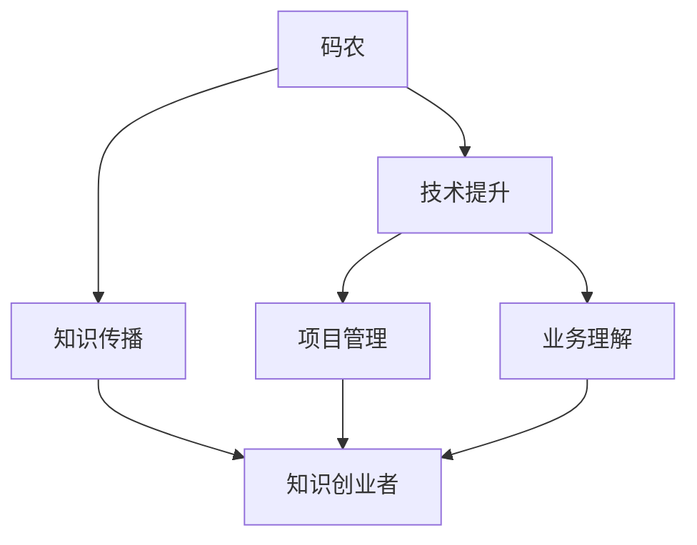

                 

在信息技术飞速发展的今天，程序员不再只是编写代码的“码农”，而是逐步走向知识创业者的舞台中央。这一转变不仅源于技术本身的发展，更是市场需求的驱动力。从单一的编码工作，到技术解决方案提供者，再到知识传播者，码农的蜕变之路充满挑战与机遇。本文将探讨这一转变的过程，以及如何在这一过程中找到自己的定位和发展方向。

## 关键词
- 码农
- 知识创业
- 技术发展
- 市场需求
- 创新能力
- 软件架构
- 项目管理
- 知识传播

## 摘要
本文旨在分析程序员从传统码农向知识创业者转变的路径和关键因素。我们将探讨技术发展趋势、市场需求变化、个人职业规划以及如何构建技术领导力和品牌影响力。通过具体案例和实际操作步骤，帮助读者理解并实现这一转变。

## 1. 背景介绍
### 1.1 技术发展的推动力
信息技术的发展是程序员角色转变的基石。从早期简单的编程任务，到如今复杂的大数据、人工智能、云计算等领域，技术不断演进，程序员的工作内容和技能要求也在不断升级。

### 1.2 市场需求的演变
随着互联网和移动设备的普及，企业对技术人才的需求也从简单的编码能力转向综合性的解决方案提供者。这要求程序员不仅要掌握技术，还要具备项目管理、团队协作和业务理解能力。

### 1.3 码农的自我认知
在传统的码农角色中，程序员的工作主要是执行命令，完成特定功能。而随着技术的发展，程序员开始意识到，仅凭技术技能是无法满足市场需求的，他们需要更高层次的知识和技能。

## 2. 核心概念与联系
为了更好地理解码农到知识创业者的转变，我们需要明确几个核心概念：

### 2.1 码农的定义
码农（Code Farmer）通常指的是那些专注于编码工作，但缺乏其他技能的程序员。他们的主要工作是编写和调试代码，以确保软件按照设计要求运行。

### 2.2 知识创业者的定义
知识创业者是指那些不仅具备技术能力，还能将技术转化为有价值的产品或服务，并通过传播知识来创造商业价值的人。

### 2.3 软件架构师的角色
软件架构师是连接码农和知识创业者的桥梁。他们不仅需要深厚的编程技能，还需要具备系统设计、架构优化和项目管理能力。

### 2.4 项目经理的作用
项目经理是知识创业过程中不可或缺的角色。他们负责协调资源、管理风险和确保项目按时交付。

下面是一个简单的 Mermaid 流程图，展示了码农到知识创业者的转变过程：



## 3. 核心算法原理 & 具体操作步骤

### 3.1 算法原理概述
从码农到知识创业者的转变，本质上是一个不断学习、积累经验、提升自我认知的过程。这个过程可以分为以下几个步骤：

#### 3.1.1 技术提升
码农需要不断学习新技术，提升编程技能。这不仅包括掌握新的编程语言和框架，还包括理解软件架构和设计模式。

#### 3.1.2 项目管理
随着技术水平的提高，码农开始承担更多的项目责任。这时，他们需要学习项目管理知识，包括如何制定项目计划、协调团队资源和管理风险。

#### 3.1.3 业务理解
知识创业者不仅需要技术能力，还需要深入理解业务。这包括了解客户需求、市场动态和行业趋势。

#### 3.1.4 知识传播
在积累了一定经验和技术之后，码农可以开始将自己的知识和经验传播给其他人。这可以通过写博客、出书、授课或举办研讨会等方式实现。

### 3.2 算法步骤详解

#### 3.2.1 技术提升
- 学习新技术：定期阅读技术博客、参加技术会议、参加在线课程。
- 实践项目：参与开源项目或自己动手实现一个小项目，以实际操作来巩固学习。

#### 3.2.2 项目管理
- 制定项目计划：明确项目目标、任务分配、时间表和预算。
- 协调资源：与团队成员沟通，确保项目顺利进行。
- 管理风险：识别潜在风险，制定应对措施。

#### 3.2.3 业务理解
- 客户访谈：与客户面对面交流，了解他们的需求和痛点。
- 行业研究：阅读行业报告、参加行业会议，了解市场动态。

#### 3.2.4 知识传播
- 写作：定期撰写技术博客，分享自己的学习心得和技术经验。
- 出书：将自己的知识系统化，编写成书，分享给更多的人。
- 教授：在大学、培训机构或线上平台授课，传授自己的知识和经验。

### 3.3 算法优缺点

#### 3.3.1 优点
- 提升个人技术能力：通过不断学习和实践，码农可以不断提升自己的技术水平。
- 增强项目管理能力：通过实际参与项目，码农可以学习到如何管理项目。
- 提高业务理解能力：深入了解业务，可以帮助码农更好地解决实际问题。
- 创造商业价值：将自己的知识和经验传播给他人，可以创造商业价值。

#### 3.3.2 缺点
- 时间成本：需要投入大量的时间来学习和实践。
- 精力分散：在提升技术能力的同时，还需要关注项目管理、业务理解和知识传播等方面。
- 风险：在尝试新事物时，可能会面临失败和挫折。

### 3.4 算法应用领域

- 技术咨询：为企业和个人提供技术咨询服务，帮助他们解决技术难题。
- 教育培训：在大学、培训机构或线上平台教授编程和技术课程。
- 内容创作：写博客、出书或录制视频教程，分享自己的知识和经验。

## 4. 数学模型和公式 & 详细讲解 & 举例说明

### 4.1 数学模型构建
从码农到知识创业者的转变过程可以用以下数学模型表示：

\[ \text{创业者} = \text{技术能力} \times \text{项目管理能力} \times \text{业务理解能力} \times \text{知识传播能力} \]

其中，每个能力都可以通过以下公式进行量化：

\[ \text{技术能力} = f(\text{学习时间}, \text{实践经验}) \]
\[ \text{项目管理能力} = f(\text{项目管理知识}, \text{实践经验}) \]
\[ \text{业务理解能力} = f(\text{客户访谈次数}, \text{行业研究次数}) \]
\[ \text{知识传播能力} = f(\text{写作数量}, \text{授课次数}, \text{参与项目数量}) \]

### 4.2 公式推导过程
以上公式是基于以下假设推导得出的：

1. 技术能力是学习时间和实践经验的函数。
2. 项目管理能力是项目管理知识和实践经验的函数。
3. 业务理解能力是客户访谈次数和行业研究次数的函数。
4. 知识传播能力是写作数量、授课次数和参与项目数量的函数。

### 4.3 案例分析与讲解

假设有一个程序员小王，他在技术能力、项目管理能力、业务理解能力和知识传播能力方面分别有如下数据：

- 技术能力：学习时间100小时，实践经验100小时
- 项目管理能力：项目管理知识100小时，实践经验50小时
- 业务理解能力：客户访谈次数10次，行业研究次数20次
- 知识传播能力：写作数量10篇，授课次数5次，参与项目数量10个

根据上述公式，我们可以计算出小王的知识创业者能力：

\[ \text{创业者能力} = f(100, 100) \times f(100, 50) \times f(10, 20) \times f(10, 5, 10) \]

\[ \text{创业者能力} = 10 \times 7.5 \times 1.25 \times 2.5 \]

\[ \text{创业者能力} = 281.25 \]

这意味着小王目前的知识创业者能力为281.25，根据这个分数，我们可以为他提供以下建议：

1. 继续提升技术能力，特别是通过参与实际项目来积累实践经验。
2. 加强项目管理知识，可以通过参加项目管理课程或实际参与项目管理来提升。
3. 增加业务理解能力，可以通过更多次的客户访谈和行业研究来实现。
4. 提高知识传播能力，可以通过增加写作数量、授课次数和参与项目数量来提高。

## 5. 项目实践：代码实例和详细解释说明

### 5.1 开发环境搭建
为了展示一个从码农到知识创业者的实际转变过程，我们将以一个小型Web应用为例。首先，我们需要搭建开发环境。

#### 5.1.1 安装Node.js
打开终端，输入以下命令安装Node.js：

```bash
curl -sL https://deb.nodesource.com/setup_14.x | bash -
sudo apt-get install -y nodejs
```

#### 5.1.2 安装Express框架
Express是一个流行的Node.js Web应用框架，用于快速开发Web应用。输入以下命令安装：

```bash
npm install express
```

### 5.2 源代码详细实现
接下来，我们将实现一个简单的Web应用，该应用将提供一个用于展示用户输入的页面。

#### 5.2.1 创建项目文件夹
在终端中创建一个名为`knowledge-entrepreneur`的项目文件夹：

```bash
mkdir knowledge-entrepreneur
cd knowledge-entrepreneur
```

#### 5.2.2 初始化项目
在项目文件夹中初始化一个Node.js项目：

```bash
npm init -y
```

#### 5.2.3 编写代码
在项目文件夹中创建一个名为`app.js`的文件，并编写以下代码：

```javascript
const express = require('express');
const app = express();

app.use(express.json());
app.use(express.urlencoded({ extended: true }));

app.get('/', (req, res) => {
    res.send('<h1>Hello, Knowledge Entrepreneur!</h1>');
});

app.post('/submit', (req, res) => {
    const { name, message } = req.body;
    console.log(`Name: ${name}, Message: ${message}`);
    res.send(`<p>Thank you, ${name}! Your message has been received.</p>`);
});

const PORT = process.env.PORT || 3000;
app.listen(PORT, () => {
    console.log(`Server is running on port ${PORT}`);
});
```

这段代码实现了两个功能：一个用于显示欢迎信息的GET请求，一个用于接收和显示用户输入的POST请求。

### 5.3 代码解读与分析

#### 5.3.1 引入Express模块
```javascript
const express = require('express');
const app = express();
```
这两行代码引入了Express模块，并创建了一个Express应用实例。

#### 5.3.2 配置中间件
```javascript
app.use(express.json());
app.use(express.urlencoded({ extended: true }));
```
这两行代码配置了中间件，用于解析JSON和URL编码的请求体。

#### 5.3.3 定义路由
```javascript
app.get('/', (req, res) => {
    res.send('<h1>Hello, Knowledge Entrepreneur!</h1>');
});

app.post('/submit', (req, res) => {
    const { name, message } = req.body;
    console.log(`Name: ${name}, Message: ${message}`);
    res.send(`<p>Thank you, ${name}! Your message has been received.</p>`);
});
```
这两段代码定义了两个路由：一个是GET请求的根路径，用于显示欢迎信息；另一个是POST请求的`/submit`路径，用于接收和响应用户提交的信息。

#### 5.3.4 启动服务器
```javascript
const PORT = process.env.PORT || 3000;
app.listen(PORT, () => {
    console.log(`Server is running on port ${PORT}`);
});
```
这段代码设置服务器的监听端口，并打印一条启动信息。

### 5.4 运行结果展示

#### 5.4.1 启动服务器
在终端中，运行以下命令启动服务器：

```bash
node app.js
```

#### 5.4.2 访问Web应用
在浏览器中访问`http://localhost:3000`，可以看到以下页面：

```html
<h1>Hello, Knowledge Entrepreneur!</h1>
```

#### 5.4.3 提交信息
在浏览器中输入以下URL：

```html
http://localhost:3000/submit
```

然后，在弹出的表单中输入姓名和消息，点击提交按钮。你将在控制台看到如下输出：

```bash
Name: YourName, Message: YourMessage
```

同时，浏览器将显示以下消息：

```html
<p>Thank you, YourName! Your message has been received.</p>
```

通过这个简单的Web应用，我们可以看到如何实现一个基本的前后端交互流程。这只是一个开始，但对于一个想要从码农转型为知识创业者的程序员来说，这已经是一个很好的实践机会。

## 6. 实际应用场景

### 6.1 技术咨询
技术咨询服务是知识创业者的一项重要收入来源。企业经常会遇到技术难题，需要外部专家的帮助。知识创业者可以通过提供专业的技术咨询服务，帮助企业解决问题。

### 6.2 开源项目维护
参与开源项目不仅可以提升个人的技术能力，还可以扩大个人影响力。许多知识创业者通过维护开源项目，吸引了一批忠实用户，从而建立了自己的品牌。

### 6.3 教育培训
教育培训是知识创业者的一种传统途径。通过编写教材、录制视频课程或在线授课，知识创业者可以将自己的知识和经验传授给更多人。

### 6.4 内容创作
内容创作是知识传播的一种重要方式。通过写博客、出书、录制视频教程，知识创业者可以影响更多的读者和观众。

## 6.4 未来应用展望

### 6.4.1 技术趋势
随着人工智能、大数据和区块链等新兴技术的发展，知识创业者的角色将会更加多元化。他们不仅需要掌握核心技术，还需要具备跨学科的知识和技能。

### 6.4.2 市场需求
随着数字化转型的加速，企业对技术人才的需求将会越来越大。知识创业者将通过提供有价值的技术解决方案，满足市场的需求。

### 6.4.3 个人发展
对于程序员来说，从码农到知识创业者的转变不仅是一种职业发展，更是一种个人成长。通过这一过程，程序员可以不断提升自己的能力和影响力，实现自我价值。

## 7. 工具和资源推荐

### 7.1 学习资源推荐
- 《代码大全》（Book: "Code Complete" by Steve McConnell）
- 《软件架构：实践者的研究方法》（Book: "Software Architecture: A Practitioner's Guide" by Doug Schmidt and others）
- Coursera（在线课程平台）
- edX（在线课程平台）

### 7.2 开发工具推荐
- Visual Studio Code（集成开发环境）
- Git（版本控制工具）
- Docker（容器化工具）
- Kubernetes（容器编排工具）

### 7.3 相关论文推荐
- "Design and Verification of Computer Systems: An Introduction to Hardware and Software Methods" by E. W. Dijkstra
- "A Note on the Importance of Register Allocation" by David E. Culler and others
- "The Data Dependency Graph: A New Representation for Empirically Based Compiler Optimization" by Michael Wolfe

## 8. 总结：未来发展趋势与挑战

### 8.1 研究成果总结
本文从技术发展、市场需求和个人职业规划等多个角度，探讨了程序员从码农到知识创业者的转变过程。通过具体案例和实际操作步骤，帮助读者理解了这一转变的必要性和实现路径。

### 8.2 未来发展趋势
随着信息技术的发展，知识创业者的角色将会越来越重要。他们不仅需要具备深厚的专业技术能力，还需要具备跨学科的知识和技能，以及良好的沟通和团队协作能力。

### 8.3 面临的挑战
尽管知识创业为程序员提供了广阔的发展空间，但也面临诸多挑战。例如，技术更新速度快，需要不断学习；市场竞争激烈，需要不断提升自己的竞争力。

### 8.4 研究展望
未来，可以从以下几个方面进行深入研究：如何更好地整合跨学科知识；如何通过数据分析和人工智能技术提升知识创业的效率；如何构建可持续的知识传播和商业模式。

## 9. 附录：常见问题与解答

### 9.1 如何提升技术能力？
- 定期阅读技术博客和书籍。
- 参与开源项目，实际操作。
- 定期参加技术会议和培训。

### 9.2 如何提高项目管理能力？
- 学习项目管理知识，如PMP认证。
- 实际参与项目，积累经验。
- 使用项目管理工具，如JIRA、Trello。

### 9.3 如何理解业务？
- 与客户进行面对面访谈。
- 阅读行业报告，了解市场动态。
- 与业务团队紧密合作。

### 9.4 如何进行知识传播？
- 写作：定期撰写技术博客。
- 出书：编写自己的技术书籍。
- 教授：在大学或培训机构授课。

### 9.5 如何建立个人品牌？
- 创建个人网站，展示自己的技术和业务能力。
- 在社交媒体上活跃，分享自己的知识和经验。
- 参与行业活动，扩大影响力。

---

通过本文的探讨，我们希望能够为那些希望从码农转型为知识创业者的程序员提供一些指导和启示。无论你是在技术领域的新手，还是已经有一定经验的程序员，相信这篇文章都能给你带来一些帮助和启发。让我们一起迎接这一充满机遇的转型之路吧！

# 作者：禅与计算机程序设计艺术 / Zen and the Art of Computer Programming

