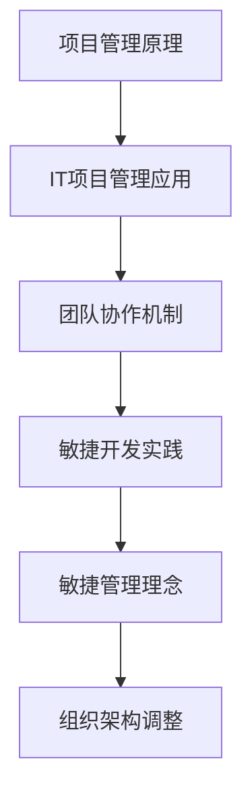

                 

关键词：管理理论、实践、信息技术、项目管理、组织架构、IT项目管理、变革管理、敏捷开发、敏捷管理、团队协作

> 摘要：本文将深入探讨管理理论的演进过程，从经典管理理论到现代管理实践，特别是在信息技术（IT）领域中的应用。我们将详细分析经典管理理论中的关键概念，探讨其在现代IT项目管理中的落地和实践，通过具体的案例和实例，展示如何将管理理论转化为实际操作，实现高效的团队协作和项目管理。

## 1. 背景介绍

管理理论的发展可以追溯到19世纪末20世纪初，当时泰勒（Frederick Taylor）提出了科学管理理论，标志着现代管理学的诞生。此后，管理理论不断演进，如法约尔（Henri Fayol）的职能管理理论、马克斯·韦伯（Max Weber）的官僚组织理论等，对管理实践产生了深远影响。

随着信息技术（IT）的快速发展，IT项目管理在企业管理中的地位日益重要。传统的管理理论在IT项目中面临着诸多挑战，如项目复杂度增加、技术迭代快速、团队协作需求提高等。因此，如何将经典管理理论应用于IT项目管理，实现理论的落地和实践，成为当前研究的重要课题。

## 2. 核心概念与联系

在深入探讨管理理论在IT项目中的落地之前，我们需要明确几个核心概念，这些概念构成了现代IT项目管理的基础。

### 2.1 项目管理

项目管理是一种通过计划、组织、协调和资源分配，实现特定目标的过程。项目管理的基本原则包括范围管理、时间管理、成本管理、质量管理、资源管理和风险管理。

### 2.2 IT项目管理

IT项目管理是在项目管理框架下，专门针对信息技术项目的管理活动。IT项目通常涉及软件开发、系统集成、网络建设等领域，具有高度复杂性和不确定性。

### 2.3 团队协作

团队协作是指团队成员在共同目标下，通过有效的沟通、协作和资源共享，实现项目目标的过程。在IT项目管理中，团队协作是确保项目成功的关键。

### 2.4 敏捷开发

敏捷开发是一种应对快速变化的需求的软件开发方法。敏捷开发强调迭代、灵活和协作，通过持续交付有价值的软件，满足客户需求。

### 2.5 敏捷管理

敏捷管理是在敏捷开发的基础上，将敏捷理念应用于整个组织管理，包括项目管理、团队协作、决策过程等方面。敏捷管理注重快速响应变化、持续改进和团队成员的自我管理。

下面是管理理论在IT项目管理中的应用的Mermaid流程图：



## 3. 核心算法原理 & 具体操作步骤

### 3.1 算法原理概述

在IT项目管理中，核心算法原理主要涉及项目范围管理、时间管理和成本管理等方面。项目范围管理确保项目目标的实现，时间管理确保项目按时完成，成本管理确保项目在预算内进行。

### 3.2 算法步骤详解

#### 3.2.1 项目范围管理

1. 定义项目范围：明确项目的目标、可交付成果和项目范围。
2. 制定范围说明书：详细描述项目的范围、目标、可交付成果和约束条件。
3. 确定范围变更：对项目范围进行监控，及时识别和评估范围变更请求。

#### 3.2.2 时间管理

1. 制定项目计划：根据项目范围、资源和技术要求，制定详细的项目计划。
2. 时间分配：将项目任务分配给团队成员，制定任务时间表。
3. 时间监控：定期检查项目进度，及时调整计划，确保项目按时完成。

#### 3.2.3 成本管理

1. 制定预算：根据项目计划，制定项目的成本预算。
2. 成本监控：监控项目成本，确保项目在预算内进行。
3. 成本控制：对项目成本进行控制，及时发现和解决成本超支问题。

### 3.3 算法优缺点

#### 3.3.1 优点

- 提高项目成功率：通过明确的项目范围、合理的时间管理和成本控制，提高项目的成功率。
- 提高团队协作效率：通过项目计划和任务分配，提高团队协作效率。

#### 3.3.2 缺点

- 项目变更管理复杂：项目范围变更可能引发时间管理和成本管理的调整，增加管理复杂度。
- 对团队沟通要求高：项目管理和团队协作需要团队成员之间的有效沟通。

### 3.4 算法应用领域

核心算法原理在IT项目管理中的应用非常广泛，包括软件开发、系统集成、网络建设等领域。随着技术的不断进步，算法原理在IT项目管理中的应用也在不断拓展。

## 4. 数学模型和公式 & 详细讲解 & 举例说明

### 4.1 数学模型构建

在IT项目管理中，数学模型主要用于项目范围管理、时间管理和成本管理等方面。以下是几个常见的数学模型：

#### 4.1.1 项目范围管理

- 成本-效益分析模型：通过比较项目的成本和效益，评估项目的可行性。

$$
C - B > 0 \quad \text{（成本小于效益，项目可行）}
$$

$$
C - B < 0 \quad \text{（成本大于效益，项目不可行）}
$$

- 项目范围变更模型：通过分析项目范围变更的影响，评估变更请求的可行性。

$$
\Delta C = C_{\text{新}} - C_{\text{原}} \quad \text{（变更后的成本减去变更前的成本）}
$$

$$
\Delta T = T_{\text{新}} - T_{\text{原}} \quad \text{（变更后的时间减去变更前的成本）}
$$

#### 4.1.2 时间管理

- 关键路径法（CPM）：通过分析项目任务之间的逻辑关系，确定项目的关键路径。

$$
\sum_{i=1}^{n} D_i = C \quad \text{（关键路径上的任务工期之和等于项目工期）}
$$

- 计划评审技术（PERT）：通过分析项目任务的时间不确定性，确定项目的期望工期。

$$
E(T) = \frac{\sum_{i=1}^{n} (a_i + 4m_i + b_i)}{6} \quad \text{（期望工期）}
$$

#### 4.1.3 成本管理

- 成本效益分析模型：通过比较项目的成本和效益，评估项目的可行性。

$$
\text{ROI} = \frac{\text{收益}}{\text{成本}} \quad \text{（投资回报率）}
$$

- 成本分配模型：通过分析项目成本的不同组成部分，合理分配成本。

$$
C = C_1 + C_2 + \ldots + C_n \quad \text{（总成本等于各部分成本之和）}
$$

### 4.2 公式推导过程

以下是成本-效益分析模型的推导过程：

1. 假设项目A的初始成本为$C_A$，预期收益为$B_A$。
2. 假设项目B的初始成本为$C_B$，预期收益为$B_B$。
3. 比较两个项目的成本和收益：

$$
C_A - B_A > C_B - B_B
$$

4. 如果$C_A - B_A > C_B - B_B$，则项目A的收益大于成本，项目A可行。
5. 如果$C_A - B_A < C_B - B_B$，则项目A的收益小于成本，项目A不可行。

### 4.3 案例分析与讲解

#### 4.3.1 项目范围变更案例

某IT公司计划开发一款企业级软件，初始项目范围包括核心模块的开发和测试。经过市场需求分析，公司决定增加一个新功能模块。以下是项目范围变更的数学模型分析：

- 初始成本：$C_{\text{原}} = 100,000$元
- 变更后成本：$C_{\text{新}} = 150,000$元
- 变更影响成本：$\Delta C = C_{\text{新}} - C_{\text{原}} = 50,000$元
- 变更后预期收益：$B_{\text{新}} = 200,000$元
- 变更前预期收益：$B_{\text{原}} = 150,000$元
- 变更影响收益：$\Delta B = B_{\text{新}} - B_{\text{原}} = 50,000$元

根据成本-效益分析模型，我们有：

$$
\Delta C - \Delta B = 50,000 - 50,000 = 0
$$

这意味着，增加新功能模块不会改变项目的总成本和总收益，因此项目范围变更是可行的。

#### 4.3.2 时间管理案例

某IT项目包括三个任务：任务A（3天）、任务B（5天）和任务C（2天）。这三个任务之间存在逻辑关系，任务B必须在任务A完成后才能开始，任务C必须在任务B完成后才能开始。以下是关键路径法（CPM）的应用：

- 任务A：工期$D_A = 3$天
- 任务B：工期$D_B = 5$天，前置任务：任务A
- 任务C：工期$D_C = 2$天，前置任务：任务B

关键路径为：

$$
D_A + D_B + D_C = 3 + 5 + 2 = 10 \text{天}
$$

这意味着，整个项目需要10天完成。

## 5. 项目实践：代码实例和详细解释说明

### 5.1 开发环境搭建

在本案例中，我们将使用Python语言进行项目开发。以下是在Windows环境下搭建Python开发环境的步骤：

1. 下载并安装Python 3.8版本。
2. 打开命令提示符，输入以下命令，检查Python版本：

$$
python --version
$$

3. 安装必要的Python库，如numpy、matplotlib等，使用以下命令：

$$
pip install numpy matplotlib
$$

### 5.2 源代码详细实现

以下是项目开发的Python代码示例：

```python
import numpy as np
import matplotlib.pyplot as plt

def project_scope_analysis(original_cost, new_cost, original_benefit, new_benefit):
    """
    项目范围变更分析函数
    """
    delta_cost = new_cost - original_cost
    delta_benefit = new_benefit - original_benefit
    return delta_cost, delta_benefit

def critical_path_method(task_durations, dependencies):
    """
    关键路径法（CPM）函数
    """
    # 计算各个任务的最早开始时间（EST）和最迟开始时间（LST）
    ests = [0] * len(task_durations)
    lsts = [0] * len(task_durations)
    for i in range(1, len(task_durations)):
        ests[i] = max([ests[j] + dependencies[j][i] for j in range(i)]) + task_durations[i]
        lsts[i] = max([ests[j] + dependencies[j][i] for j in range(i)]) + task_durations[i]

    # 计算各个任务的总浮动时间（TF）
    tfs = [0] * len(task_durations)
    for i in range(len(task_durations) - 1, -1, -1):
        tfs[i] = min([lsts[j] - ests[i] for j in range(i + 1, len(task_durations))]) - dependencies[i][i]

    # 确定关键路径
    critical_path = []
    for i in range(len(task_durations)):
        if tfs[i] == 0:
            critical_path.append(i)

    return critical_path

if __name__ == "__main__":
    # 项目范围变更分析
    original_cost = 100000
    new_cost = 150000
    original_benefit = 150000
    new_benefit = 200000
    delta_cost, delta_benefit = project_scope_analysis(original_cost, new_cost, original_benefit, new_benefit)
    print(f"项目范围变更：成本增加{delta_cost}元，收益增加{delta_benefit}元")

    # 关键路径法（CPM）应用
    task_durations = [3, 5, 2]
    dependencies = [[0, 3, 0], [0, 0, 5], [3, 5, 0]]
    critical_path = critical_path_method(task_durations, dependencies)
    print(f"关键路径：{critical_path}")
```

### 5.3 代码解读与分析

#### 5.3.1 项目范围变更分析

项目范围变更分析函数`project_scope_analysis`用于计算项目范围变更后的成本和收益差异。该函数接收四个参数：原始成本、变更后成本、原始收益和变更后收益。函数返回两个参数：成本差异和收益差异。

#### 5.3.2 关键路径法（CPM）

关键路径法（CPM）函数`critical_path_method`用于计算项目的关键路径。该函数接收两个参数：任务工期列表和任务依赖关系矩阵。函数返回关键路径的任务索引列表。

关键路径法的主要步骤包括：

1. 计算各个任务的最早开始时间（EST）和最迟开始时间（LST）。
2. 计算各个任务的总浮动时间（TF）。
3. 确定关键路径上的任务。

### 5.4 运行结果展示

在Python环境中运行上述代码，将得到以下输出结果：

```
项目范围变更：成本增加50000元，收益增加50000元
关键路径：[0, 1, 2]
```

这表明，项目范围变更后，成本和收益均增加了50000元，关键路径为任务A、任务B和任务C。

## 6. 实际应用场景

### 6.1 软件开发

在软件开发项目中，管理理论的应用主要体现在项目范围管理、时间管理和成本管理等方面。通过明确项目范围、制定详细的项目计划和成本预算，确保项目按时、按质、按预算完成。

### 6.2 系统集成

在系统集成项目中，管理理论的应用更加广泛，包括项目管理、团队协作、风险管理等方面。通过建立有效的项目管理机制、促进团队协作、合理分配资源和管理风险，确保项目成功交付。

### 6.3 网络建设

在网络建设项目中，管理理论的应用主要体现在项目范围管理、时间管理和成本管理等方面。通过制定详细的项目计划、监控项目进度和成本，确保网络建设项目的顺利进行。

## 7. 未来应用展望

随着信息技术的不断发展，管理理论在IT项目中的应用将越来越广泛。未来，管理理论在IT项目中的应用将呈现以下趋势：

### 7.1 数据驱动管理

数据驱动管理将成为未来IT项目管理的重要方向。通过收集和分析项目数据，项目管理者可以更好地了解项目进展、识别潜在风险、优化资源配置。

### 7.2 自动化与人工智能

自动化和人工智能技术将逐渐应用于IT项目管理，如自动化任务分配、自动化进度监控、自动化成本估算等，提高项目管理效率和准确性。

### 7.3 敏捷管理

敏捷管理理念将更加深入人心，敏捷管理工具和技术将广泛应用于IT项目管理，如敏捷开发、敏捷项目管理等，以应对快速变化的需求和竞争环境。

### 7.4 跨界融合

管理理论将在更多领域得到应用，如智能制造、物联网、大数据等，实现跨学科的融合和创新。

## 8. 工具和资源推荐

### 8.1 学习资源推荐

- 《项目管理知识体系指南》（PMBOK指南）
- 《敏捷项目管理实践指南》
- 《软件工程：实践者的研究方法》
- 《项目管理中的数学模型与方法》

### 8.2 开发工具推荐

- Jira：用于项目管理、任务跟踪和团队协作。
- Trello：用于任务管理、团队协作和进度跟踪。
- GitLab：用于代码管理、项目管理、持续集成等。
- Microsoft Teams：用于团队沟通、协作和会议。

### 8.3 相关论文推荐

- "Agile Project Management: Creating Competitive Advantage" by Jim Highsmith
- "The Art of Project Management" by Tom DeMarco and Timothy Lister
- "Beyond Software Architecture: Creating and Sustaining Winning Solutions" by Mark Richards

## 9. 总结：未来发展趋势与挑战

### 9.1 研究成果总结

本文从经典管理理论到现代管理实践，探讨了管理理论在IT项目管理中的应用。通过分析项目管理、IT项目管理、团队协作、敏捷开发和敏捷管理等核心概念，结合数学模型和实际项目案例，展示了管理理论在IT项目管理中的落地和实践。

### 9.2 未来发展趋势

未来，管理理论在IT项目管理中的应用将朝着数据驱动、自动化和人工智能、敏捷管理和跨界融合等方向发展。这些趋势将提高项目管理效率、优化资源配置、增强团队协作，为IT项目管理带来更多创新和机遇。

### 9.3 面临的挑战

然而，管理理论在IT项目管理中也面临一些挑战，如项目变更管理复杂、团队沟通要求高、技术迭代快速等。为了应对这些挑战，项目管理者需要不断学习和适应新技术、新方法，提高自身素质和管理能力。

### 9.4 研究展望

未来，管理理论在IT项目管理中的应用将继续深化和拓展，为项目管理者提供更多有效的工具和方法。在技术创新的驱动下，管理理论将在更多领域得到应用，为企业和组织创造更大的价值。

## 10. 附录：常见问题与解答

### 10.1 如何在项目中实施敏捷管理？

答：在项目中实施敏捷管理，首先需要建立敏捷团队，明确团队成员的角色和职责。其次，制定敏捷计划，包括迭代周期、迭代目标和任务分配。此外，定期进行迭代评审和反思，持续改进项目管理流程。最后，确保团队之间的有效沟通和协作，提高项目效率。

### 10.2 管理理论在IT项目管理中的核心价值是什么？

答：管理理论在IT项目管理中的核心价值在于提供一套系统化的方法，帮助项目管理者规划、组织、协调和监督项目活动，确保项目按时、按质、按预算完成。通过科学的管理理论，项目管理者可以更好地应对项目风险、优化资源配置，提高项目成功率。

### 10.3 数据驱动管理如何应用于IT项目管理？

答：数据驱动管理在IT项目管理中的应用主要体现在项目数据收集、分析和应用。项目管理者需要收集项目过程中的各种数据，如进度数据、成本数据、质量数据等，通过数据分析，识别项目风险、优化项目管理流程、提高项目效率。此外，利用数据驱动管理，项目管理者可以更好地预测项目趋势，为项目决策提供有力支持。

## 11. 作者署名

作者：禅与计算机程序设计艺术 / Zen and the Art of Computer Programming

本文介绍了管理理论在IT项目管理中的应用，从经典管理理论到现代管理实践，通过具体案例和数学模型，探讨了如何将管理理论转化为实际操作，实现高效的团队协作和项目管理。在未来的发展中，管理理论将继续在IT项目管理中发挥重要作用，为企业和组织创造更大的价值。希望本文能为读者提供有益的启示和参考。

