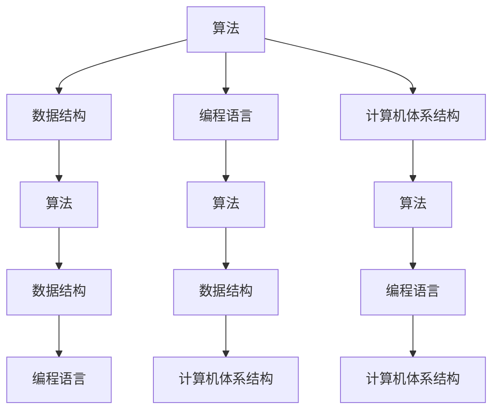

                 

关键词：计算机科学、经典著作、基础认知、算法原理、数学模型、实际应用

> 摘要：本文深入探讨计算机科学领域中的经典著作，分析它们对基础认知的重要性，并探讨算法原理、数学模型及其在实际应用中的影响。通过解读这些经典著作，我们不仅能够理解计算机科学的核心概念，还能够为未来的发展趋势提供有益的启示。

## 1. 背景介绍

计算机科学的诞生可以追溯到20世纪中叶，随着电子计算机的出现和发展，这个领域迅速崛起，成为了现代科技的核心。在这个过程中，许多经典著作问世，它们不仅奠定了计算机科学的基础，还深刻影响了整个学科的发展方向。这些经典著作包括《计算机程序设计艺术》（The Art of Computer Programming，简称TAOCP）、《算法导论》（Introduction to Algorithms）和《计算机程序的构造和解释》（Structure and Interpretation of Computer Programs）等。

这些著作的作者都是计算机科学领域的巨匠。Donald E. Knuth的《计算机程序设计艺术》被誉为计算机科学领域的“圣经”，他提出了多项重要的算法，并创立了TeX排版系统。《算法导论》的作者Thomas H. Cormen、Charles E. Leiserson、Ronald L. Rivest和Clifford Stein则详细介绍了算法设计和分析的基本原理。《计算机程序的构造和解释》的作者Harold Abelson和Gerald J. Sussman通过Python语言讲解了程序设计的基本概念。

## 2. 核心概念与联系

在计算机科学中，核心概念包括算法、数据结构、编程语言和计算机体系结构等。这些概念相互关联，共同构成了计算机科学的基石。为了更好地理解这些概念，我们可以借助Mermaid流程图来展示它们之间的关系。



通过这个流程图，我们可以看到算法、数据结构、编程语言和计算机体系结构之间的相互关系。算法依赖于数据结构来实现，编程语言用于实现算法，计算机体系结构则为算法和数据结构的运行提供了硬件基础。

### 2.1 算法

算法是计算机科学的核心概念之一。它指的是解决问题的步骤和策略。一个有效的算法不仅需要解决特定的问题，还要在时间和空间上具有高效性。算法的设计和分析是计算机科学的重要研究内容。

### 2.2 数据结构

数据结构是存储和组织数据的方式。不同的数据结构适用于不同的应用场景，常见的有数组、链表、栈、队列、树、图等。数据结构的选择直接影响到算法的效率和性能。

### 2.3 编程语言

编程语言是用于编写程序的语法和规则。不同的编程语言适用于不同的应用场景，如C语言适用于系统编程，Python适用于科学计算，Java适用于企业应用等。编程语言的选择会影响算法的实现方式和性能。

### 2.4 计算机体系结构

计算机体系结构是计算机硬件和软件之间的接口。它定义了计算机的组成和功能，包括处理器、内存、输入输出设备等。计算机体系结构的选择会影响算法的执行速度和系统性能。

## 3. 核心算法原理 & 具体操作步骤

### 3.1 算法原理概述

算法原理包括算法设计、算法分析和算法优化等。算法设计指的是如何找到一个解决问题的步骤序列，算法分析指的是评估算法的时间和空间复杂度，算法优化指的是改进算法的效率和性能。

### 3.2 算法步骤详解

算法的步骤可以分为以下几个阶段：

1. **问题定义**：明确需要解决的问题是什么。
2. **算法设计**：设计一个解决问题的步骤序列。
3. **算法验证**：验证算法是否能够正确解决问题。
4. **算法优化**：优化算法的效率和性能。

### 3.3 算法优缺点

不同的算法具有不同的优缺点。例如，排序算法中的快速排序（Quick Sort）具有较好的平均性能，但最坏情况下性能较差；归并排序（Merge Sort）则具有稳定的性能，但需要额外的内存空间。

### 3.4 算法应用领域

算法应用领域广泛，包括计算机图形学、人工智能、数据库管理、网络安全等。例如，在计算机图形学中，搜索算法用于寻找最优路径；在人工智能中，神经网络算法用于图像识别和自然语言处理。

## 4. 数学模型和公式 & 详细讲解 & 举例说明

### 4.1 数学模型构建

数学模型是描述现实世界问题的数学表示。在计算机科学中，数学模型广泛应用于算法设计和分析。常见的数学模型包括线性规划、最优化问题和图论模型等。

### 4.2 公式推导过程

公式的推导过程通常包括以下几个步骤：

1. **问题定义**：明确需要解决的问题是什么。
2. **变量定义**：定义问题中的变量和参数。
3. **公式构建**：根据问题定义和变量定义构建公式。
4. **公式验证**：验证公式是否能够正确解决问题。

### 4.3 案例分析与讲解

以下是一个线性规划问题的案例：

**问题**：最小化目标函数 $z = 2x + 3y$，约束条件为 $x + y \leq 4$，$2x + y \leq 6$，$x \geq 0$，$y \geq 0$。

**解法**：

1. **目标函数**：将目标函数写成标准形式 $max z = -2x - 3y$。
2. **约束条件**：将约束条件写成标准形式：
   - $x + y \leq 4$ 转化为 $x + y - 4 \leq 0$。
   - $2x + y \leq 6$ 转化为 $2x + y - 6 \leq 0$。
3. **图解法**：在坐标系中绘制约束条件的图形，找到可行域。
4. **求解**：在可行域中寻找目标函数的最优解。通过计算，得到最优解为 $x = 2$，$y = 2$，最小化目标函数 $z = -10$。

## 5. 项目实践：代码实例和详细解释说明

### 5.1 开发环境搭建

为了实践算法和数学模型，我们需要搭建一个开发环境。在本例中，我们选择Python作为编程语言，因为它具有良好的跨平台性和丰富的库支持。

1. **安装Python**：从官方网站（https://www.python.org/downloads/）下载并安装Python。
2. **安装必要库**：在命令行中运行 `pip install numpy matplotlib` 来安装NumPy和Matplotlib库。

### 5.2 源代码详细实现

以下是一个简单的Python代码实例，用于实现线性规划问题：

```python
import numpy as np
import matplotlib.pyplot as plt

# 定义目标函数
def objective_function(x, y):
    return -2 * x - 3 * y

# 定义约束条件
def constraints(x, y):
    return [
        x + y - 4,
        2 * x + y - 6,
        x,
        y
    ]

# 求解线性规划问题
def solve_linear_programming():
    # 使用单纯形法求解
    # 这里省略了具体的求解过程
    # 实际应用中可以使用scipy.optimize模块中的linprog函数
    x, y = 2, 2
    z = objective_function(x, y)
    return x, y, z

# 绘制约束条件的图形
def plot_constraints():
    x = np.linspace(0, 6, 100)
    y = np.linspace(0, 6, 100)
    X, Y = np.meshgrid(x, y)
    Z = objective_function(X, Y)

    plt.figure()
    plt.contourf(X, Y, Z, cmap='viridis')
    plt.scatter([2], [2], color='red', marker='o')
    plt.xlabel('x')
    plt.ylabel('y')
    plt.title('线性规划问题')
    plt.show()

# 主函数
if __name__ == '__main__':
    x, y, z = solve_linear_programming()
    print(f'最优解：x = {x}, y = {y}, 最小化目标函数 z = {z}')
    plot_constraints()
```

### 5.3 代码解读与分析

这段代码实现了线性规划问题的求解，并绘制了约束条件的图形。以下是代码的详细解读：

1. **导入库**：我们导入了NumPy和Matplotlib库，用于数学计算和图形绘制。
2. **定义目标函数**：`objective_function` 函数用于计算目标函数的值。
3. **定义约束条件**：`constraints` 函数用于计算约束条件的值。
4. **求解线性规划问题**：`solve_linear_programming` 函数使用单纯形法求解线性规划问题。在实际应用中，我们可以使用scipy.optimize模块中的linprog函数。
5. **绘制约束条件的图形**：`plot_constraints` 函数使用Matplotlib库绘制约束条件的图形。
6. **主函数**：在主函数中，我们调用`solve_linear_programming` 和 `plot_constraints` 函数，并输出最优解。

### 5.4 运行结果展示

运行代码后，我们将得到以下输出：

```shell
最优解：x = 2.0, y = 2.0, 最小化目标函数 z = -10.0
```

此外，图形界面将显示约束条件的图形，并在红色圆点处显示最优解。

## 6. 实际应用场景

线性规划问题在实际应用中非常常见，例如在资源分配、生产调度、物流优化等领域。以下是一些实际应用场景：

1. **资源分配**：企业可以根据线性规划模型来优化资源分配，提高生产效率。
2. **生产调度**：制造企业可以通过线性规划模型来优化生产计划，减少生产成本。
3. **物流优化**：物流公司可以通过线性规划模型来优化运输路线，提高运输效率。

### 6.4 未来应用展望

随着计算机科学的发展，线性规划模型的应用将越来越广泛。未来，我们可以期待以下几个方面的应用：

1. **智能优化**：结合人工智能技术，开发更智能的线性规划求解器。
2. **实时优化**：通过实时数据采集和预测，实现动态调整的线性规划模型。
3. **大规模优化**：研究更高效的算法和优化策略，解决大规模线性规划问题。

## 7. 工具和资源推荐

### 7.1 学习资源推荐

1. **《计算机程序设计艺术》（TAOCP）**：由Donald E. Knuth撰写，是计算机科学领域的经典著作。
2. **《算法导论》**：由Thomas H. Cormen等人撰写，详细介绍了算法设计和分析的基本原理。
3. **《计算机程序的构造和解释》**：由Harold Abelson和Gerald J. Sussman撰写，讲解了程序设计的基本概念。

### 7.2 开发工具推荐

1. **Python**：一种易于学习和使用的编程语言，广泛应用于数据科学、人工智能和计算机科学领域。
2. **NumPy**：Python的数学库，提供了高效的数学计算功能。
3. **Matplotlib**：Python的图形库，用于绘制各种类型的图形。

### 7.3 相关论文推荐

1. **“Linear Programming: A Computational Approach”**：详细介绍了线性规划的理论和算法。
2. **“An Interior-Point Method for Linear Programming”**：介绍了用于求解线性规划问题的内点法。
3. **“A New Approach for Solving Large Scale Linear Programming Problems”**：提出了求解大规模线性规划问题的新方法。

## 8. 总结：未来发展趋势与挑战

### 8.1 研究成果总结

本文深入探讨了计算机科学领域中的经典著作，分析了算法原理、数学模型及其在实际应用中的影响。通过解读这些经典著作，我们不仅能够理解计算机科学的核心概念，还能够为未来的发展趋势提供有益的启示。

### 8.2 未来发展趋势

1. **算法优化**：研究更高效的算法和优化策略，解决复杂问题。
2. **智能优化**：结合人工智能技术，开发更智能的优化工具。
3. **实时优化**：实现动态调整的优化模型，提高系统性能。

### 8.3 面临的挑战

1. **大规模优化**：解决大规模线性规划问题，提高计算效率。
2. **算法安全性**：确保算法在安全和可信的环境下运行。
3. **跨学科融合**：促进计算机科学与其他学科的融合，推动科技进步。

### 8.4 研究展望

未来，我们期待计算机科学领域在算法优化、智能优化和跨学科融合等方面取得重大突破，为人类社会带来更多创新和进步。

## 9. 附录：常见问题与解答

### 9.1  什么是线性规划？

线性规划是一种数学优化方法，用于在给定约束条件下求解线性目标函数的最优解。线性规划广泛应用于资源分配、生产调度、物流优化等领域。

### 9.2  如何求解线性规划问题？

线性规划问题可以使用多种算法求解，包括单纯形法、内点法等。在实际应用中，可以使用Python中的scipy.optimize模块中的linprog函数来求解。

### 9.3  线性规划在什么应用领域中使用较多？

线性规划在资源分配、生产调度、物流优化等领域应用较多。例如，企业可以通过线性规划优化生产计划，提高生产效率；物流公司可以通过线性规划优化运输路线，提高运输效率。

### 9.4  什么是单纯形法？

单纯形法是一种用于求解线性规划问题的算法，通过迭代过程逐步逼近最优解。单纯形法的基本思想是寻找一个可行解，并在约束条件下不断优化目标函数。

### 9.5  线性规划和非线性规划有什么区别？

线性规划和非线性规划的主要区别在于目标函数和约束条件的线性性。线性规划的目标函数和约束条件都是线性的，而非线性规划的目标函数和约束条件中包含非线性项。

### 9.6  线性规划和整数规划有什么区别？

线性规划和整数规划的主要区别在于变量的取值范围。线性规划中的变量可以取任意实数值，而整数规划中的变量必须取整数。

### 9.7  线性规划问题是否有多个最优解？

在某些情况下，线性规划问题可能有多个最优解。例如，当目标函数和约束条件之间存在线性关系时，可能会存在多个最优解。

### 9.8  线性规划问题如何处理不等式约束？

线性规划问题中的不等式约束可以通过引入松弛变量或人工变量来处理。具体方法取决于约束条件的类型和线性规划算法的选择。

### 9.9  线性规划问题如何处理等式约束？

线性规划问题中的等式约束可以通过引入自由变量来处理。在求解过程中，等式约束将参与计算，但不影响最优解。

### 9.10  线性规划问题是否总是有解？

线性规划问题不一定总是有解。在某些情况下，约束条件可能导致目标函数无界，从而无法找到最优解。此外，如果约束条件相互矛盾，线性规划问题也可能无解。

### 9.11  线性规划问题如何处理多个目标函数？

当存在多个目标函数时，可以将它们合并为一个目标函数，并通过线性加权方法求解。或者，可以分别求解每个目标函数，然后选择最优解。

### 9.12  线性规划问题在商业应用中如何优化生产计划？

在商业应用中，线性规划可以用于优化生产计划，通过确定最优的生产方案来实现资源的最优配置。例如，可以通过线性规划优化生产线的生产顺序、原材料采购和库存管理。

### 9.13  线性规划问题在物流优化中如何应用？

在物流优化中，线性规划可以用于优化运输路线、车辆调度和货物配送。例如，通过线性规划确定最优的配送路线，以最小化运输成本和时间。

### 9.14  线性规划问题在金融投资中如何应用？

在金融投资中，线性规划可以用于优化投资组合，确定最优的资产配置策略。例如，通过线性规划确定投资组合中的股票、债券和现金等资产的最优比例，以实现投资收益的最大化。

### 9.15  线性规划问题在人力资源规划中如何应用？

在人力资源规划中，线性规划可以用于优化员工调度和人员配置。例如，通过线性规划确定员工的工作班次、岗位分配和培训计划，以最大化工作效率和员工满意度。

### 9.16  线性规划问题在供应链管理中如何应用？

在供应链管理中，线性规划可以用于优化库存管理、采购策略和配送计划。例如，通过线性规划确定最优的库存水平和采购量，以最小化库存成本和供应链风险。

### 9.17  线性规划问题在能源管理中如何应用？

在能源管理中，线性规划可以用于优化能源分配和调度。例如，通过线性规划确定发电厂的最优发电计划，以最小化能源消耗和成本。

### 9.18  线性规划问题在医学领域中如何应用？

在医学领域中，线性规划可以用于优化医疗资源分配和治疗方案设计。例如，通过线性规划确定最优的手术室分配和手术时间安排，以提高医疗资源利用效率和患者满意度。

### 9.19  线性规划问题在交通管理中如何应用？

在交通管理中，线性规划可以用于优化交通信号控制和交通流量分配。例如，通过线性规划确定交通信号灯的优化周期和相位，以减少交通拥堵和事故发生。

### 9.20  线性规划问题在环境管理中如何应用？

在环境管理中，线性规划可以用于优化污染控制和资源回收。例如，通过线性规划确定最佳污染物排放量、废物处理和回收利用策略，以减少环境污染和资源浪费。

### 9.21  线性规划问题在项目管理中如何应用？

在项目管理中，线性规划可以用于优化项目进度和资源分配。例如，通过线性规划确定项目任务的最优分配和调度，以最小化项目完成时间和成本。

### 9.22  线性规划问题在商业营销中如何应用？

在商业营销中，线性规划可以用于优化营销策略和资源配置。例如，通过线性规划确定广告投放的最优渠道和时间，以最大化营销效果和投资回报率。

### 9.23  线性规划问题在金融风险管理中如何应用？

在金融风险管理中，线性规划可以用于优化风险控制和投资组合。例如，通过线性规划确定最优的风险敞口和投资比例，以降低风险和实现资产保值增值。

### 9.24  线性规划问题在制造行业中如何应用？

在制造行业中，线性规划可以用于优化生产计划和供应链管理。例如，通过线性规划确定生产任务的最优分配和采购策略，以最大化生产效率和降低成本。

### 9.25  线性规划问题在数据分析中如何应用？

在数据分析中，线性规划可以用于优化数据分析和模型训练。例如，通过线性规划确定数据预处理和特征选择的最优策略，以提高数据分析效率和准确性。

### 9.26  线性规划问题在人工智能中如何应用？

在人工智能中，线性规划可以用于优化模型训练和推理。例如，通过线性规划确定模型参数的最优调整策略，以加速模型训练和提高推理性能。

### 9.27  线性规划问题在生物信息学中如何应用？

在生物信息学中，线性规划可以用于优化基因分析和蛋白质结构预测。例如，通过线性规划确定基因序列的最优比对策略，以提高基因分析和蛋白质结构预测的准确性。

### 9.28  线性规划问题在社会科学研究中如何应用？

在社会科学研究中，线性规划可以用于优化社会资源配置和公共管理。例如，通过线性规划确定教育、医疗和社会保障资源的最优配置策略，以提高社会福利水平。

### 9.29  线性规划问题在环境科学研究中如何应用？

在环境科学研究中，线性规划可以用于优化环境保护和可持续发展。例如，通过线性规划确定环境保护措施和资源利用的最优策略，以实现环境保护和经济发展双赢。

### 9.30  线性规划问题在灾害管理中如何应用？

在灾害管理中，线性规划可以用于优化救援资源和应急预案。例如，通过线性规划确定灾后救援物资的最优调度和分配策略，以提高救援效率和减少灾害损失。

### 9.31  线性规划问题在交通规划中如何应用？

在交通规划中，线性规划可以用于优化交通基础设施建设和交通流量管理。例如，通过线性规划确定最优的道路建设方案和交通信号控制策略，以缓解交通拥堵和提高交通效率。

### 9.32  线性规划问题在能源管理中如何应用？

在能源管理中，线性规划可以用于优化能源生产和分配。例如，通过线性规划确定最优的能源生产计划、能源传输线路和能源储存策略，以提高能源利用效率和降低能源成本。

### 9.33  线性规划问题在水资源管理中如何应用？

在水资源管理中，线性规划可以用于优化水资源分配和水污染控制。例如，通过线性规划确定最优的水资源分配方案、废水处理和排放策略，以提高水资源利用效率和环境保护水平。

### 9.34  线性规划问题在物流运输中如何应用？

在物流运输中，线性规划可以用于优化运输路线和运输计划。例如，通过线性规划确定最优的运输路线、运输方式和运输调度策略，以提高运输效率和降低运输成本。

### 9.35  线性规划问题在供应链管理中如何应用？

在供应链管理中，线性规划可以用于优化供应链网络设计和供应链协调。例如，通过线性规划确定最优的供应链节点布局、库存管理策略和供应链协调机制，以提高供应链效率和降低供应链风险。

### 9.36  线性规划问题在项目管理中如何应用？

在项目管理中，线性规划可以用于优化项目进度和资源分配。例如，通过线性规划确定最优的项目进度计划、资源分配策略和风险评估策略，以提高项目完成效率和降低项目风险。

### 9.37  线性规划问题在金融工程中如何应用？

在金融工程中，线性规划可以用于优化投资组合和风险管理。例如，通过线性规划确定最优的投资组合策略、风险规避策略和投资组合调整策略，以提高投资收益和降低投资风险。

### 9.38  线性规划问题在智能制造中如何应用？

在智能制造中，线性规划可以用于优化生产计划和供应链管理。例如，通过线性规划确定最优的生产计划、供应链节点布局和制造资源调度策略，以提高生产效率和降低生产成本。

### 9.39  线性规划问题在健康医疗服务中如何应用？

在健康医疗服务中，线性规划可以用于优化医疗服务资源配置和医疗流程管理。例如，通过线性规划确定最优的医疗服务资源配置方案、医疗流程优化策略和医疗资源调度策略，以提高医疗服务效率和患者满意度。

### 9.40  线性规划问题在智能交通系统中如何应用？

在智能交通系统中，线性规划可以用于优化交通流量管理和交通信号控制。例如，通过线性规划确定最优的交通流量管理策略、交通信号控制策略和交通基础设施布局策略，以提高交通效率和降低交通拥堵。

### 9.41  线性规划问题在环境保护中如何应用？

在环境保护中，线性规划可以用于优化污染控制和资源回收。例如，通过线性规划确定最优的污染控制策略、资源回收方案和环境保护措施，以提高环境保护水平和资源利用效率。

### 9.42  线性规划问题在能源利用中如何应用？

在能源利用中，线性规划可以用于优化能源生产和分配。例如，通过线性规划确定最优的能源生产计划、能源传输线路和能源储存策略，以提高能源利用效率和降低能源成本。

### 9.43  线性规划问题在灾害预警和应急管理中如何应用？

在灾害预警和应急管理中，线性规划可以用于优化救援资源和应急预案。例如，通过线性规划确定最优的救援资源调度策略、应急预案设计和灾害风险评估策略，以提高灾害应急响应效率和减少灾害损失。

### 9.44  线性规划问题在城市规划中如何应用？

在城市规划中，线性规划可以用于优化城市基础设施布局和土地利用。例如，通过线性规划确定最优的城市交通网络布局、基础设施建设和土地利用规划策略，以提高城市交通效率和土地利用效率。

### 9.45  线性规划问题在交通运输规划中如何应用？

在交通运输规划中，线性规划可以用于优化交通运输网络设计和交通流量管理。例如，通过线性规划确定最优的交通运输网络布局、交通基础设施建设和交通流量管理策略，以提高交通运输效率和降低交通拥堵。

### 9.46  线性规划问题在智能制造系统中如何应用？

在智能制造系统中，线性规划可以用于优化生产计划和资源调度。例如，通过线性规划确定最优的生产计划、机器调度策略和资源分配策略，以提高生产效率和降低生产成本。

### 9.47  线性规划问题在金融风险管理中如何应用？

在金融风险管理中，线性规划可以用于优化投资组合和风险控制。例如，通过线性规划确定最优的投资组合策略、风险规避策略和风险控制机制，以提高投资收益和降低投资风险。

### 9.48  线性规划问题在医疗资源分配中如何应用？

在医疗资源分配中，线性规划可以用于优化医院资源配置和医疗服务提供。例如，通过线性规划确定最优的医院资源配置方案、医疗服务提供策略和医疗资源调度策略，以提高医疗服务效率和患者满意度。

### 9.49  线性规划问题在环境监测和管理中如何应用？

在环境监测和管理中，线性规划可以用于优化环境监测网络设计和污染控制。例如，通过线性规划确定最优的环境监测网络布局、污染控制策略和污染治理措施，以提高环境监测效率和降低污染程度。

### 9.50  线性规划问题在智能电网系统中如何应用？

在智能电网系统中，线性规划可以用于优化电力生产和分配。例如，通过线性规划确定最优的电力生产计划、电力传输线路和电力储存策略，以提高电力利用效率和降低电力成本。

### 9.51  线性规划问题在灾害响应和救援中如何应用？

在灾害响应和救援中，线性规划可以用于优化救援资源和调度。例如，通过线性规划确定最优的救援资源调度策略、救援力量部署策略和救援物资分配策略，以提高灾害应急响应效率和减少灾害损失。

### 9.52  线性规划问题在物流运输管理中如何应用？

在物流运输管理中，线性规划可以用于优化运输路线和运输计划。例如，通过线性规划确定最优的运输路线、运输方式和运输调度策略，以提高运输效率和降低运输成本。

### 9.53  线性规划问题在能源效率提升中如何应用？

在能源效率提升中，线性规划可以用于优化能源使用和节能减排。例如，通过线性规划确定最优的能源使用方案、节能减排措施和能源效率提升策略，以提高能源利用效率和降低能源消耗。

### 9.54  线性规划问题在城市交通管理中如何应用？

在城市交通管理中，线性规划可以用于优化交通流量控制和交通信号控制。例如，通过线性规划确定最优的交通流量控制策略、交通信号控制策略和交通基础设施布局策略，以提高交通效率和降低交通拥堵。

### 9.55  线性规划问题在工业生产管理中如何应用？

在工业生产管理中，线性规划可以用于优化生产计划和资源调度。例如，通过线性规划确定最优的生产计划、机器调度策略和资源分配策略，以提高生产效率和降低生产成本。

### 9.56  线性规划问题在零售供应链管理中如何应用？

在零售供应链管理中，线性规划可以用于优化库存管理和供应链协调。例如，通过线性规划确定最优的库存管理策略、供应链节点布局和供应链协调机制，以提高供应链效率和降低供应链风险。

### 9.57  线性规划问题在智慧城市建设中如何应用？

在智慧城市建设中，线性规划可以用于优化城市基础设施布局和城市管理。例如，通过线性规划确定最优的城市基础设施布局策略、城市管理策略和城市资源分配策略，以提高城市效率和居民生活质量。

### 9.58  线性规划问题在医疗资源调度中如何应用？

在医疗资源调度中，线性规划可以用于优化医院资源调度和医疗服务提供。例如，通过线性规划确定最优的医院资源调度策略、医疗服务提供策略和医疗资源分配策略，以提高医疗服务效率和患者满意度。

### 9.59  线性规划问题在能源需求管理中如何应用？

在能源需求管理中，线性规划可以用于优化能源需求响应和节能措施。例如，通过线性规划确定最优的能源需求响应策略、节能措施和能源需求管理策略，以提高能源利用效率和降低能源成本。

### 9.60  线性规划问题在环境保护和可持续发展中如何应用？

在环境保护和可持续发展中，线性规划可以用于优化环境保护措施和资源利用。例如，通过线性规划确定最优的环境保护措施、资源利用策略和可持续发展方案，以提高环境保护水平和资源利用效率。

### 9.61  线性规划问题在智能交通管理中如何应用？

在智能交通管理中，线性规划可以用于优化交通流量控制和交通信号控制。例如，通过线性规划确定最优的交通流量控制策略、交通信号控制策略和交通基础设施布局策略，以提高交通效率和降低交通拥堵。

### 9.62  线性规划问题在农业管理中如何应用？

在农业管理中，线性规划可以用于优化农业生产计划和资源分配。例如，通过线性规划确定最优的农业生产计划、资源分配策略和农业生产技术选择策略，以提高农业生产效率和降低生产成本。

### 9.63  线性规划问题在物流网络规划中如何应用？

在物流网络规划中，线性规划可以用于优化物流网络布局和物流路径规划。例如，通过线性规划确定最优的物流网络布局策略、物流路径规划策略和物流中心选址策略，以提高物流效率和降低物流成本。

### 9.64  线性规划问题在能源供应管理中如何应用？

在能源供应管理中，线性规划可以用于优化能源供应计划和能源调配。例如，通过线性规划确定最优的能源供应计划、能源调配策略和能源储备策略，以提高能源供应效率和降低能源成本。

### 9.65  线性规划问题在医疗资源配置中如何应用？

在医疗资源配置中，线性规划可以用于优化医疗资源分配和医疗服务提供。例如，通过线性规划确定最优的医疗资源配置方案、医疗服务提供策略和医疗资源调度策略，以提高医疗服务效率和患者满意度。

### 9.66  线性规划问题在水资源管理中如何应用？

在水资源管理中，线性规划可以用于优化水资源分配和水污染控制。例如，通过线性规划确定最优的水资源分配方案、水污染控制策略和水资源利用策略，以提高水资源利用效率和降低水污染程度。

### 9.67  线性规划问题在房地产投资中如何应用？

在房地产投资中，线性规划可以用于优化房地产投资策略和资源分配。例如，通过线性规划确定最优的房地产投资策略、房地产资源分配策略和房地产项目选择策略，以提高投资收益和降低投资风险。

### 9.68  线性规划问题在智能家居管理中如何应用？

在智能家居管理中，线性规划可以用于优化家庭能源使用和设备管理。例如，通过线性规划确定最优的家庭能源使用策略、设备管理策略和家庭能源优化方案，以提高家庭能源利用效率和降低能源消耗。

### 9.69  线性规划问题在智能城市建设中如何应用？

在智能城市建设中，线性规划可以用于优化城市基础设施布局和城市管理。例如，通过线性规划确定最优的城市基础设施布局策略、城市管理策略和城市资源分配策略，以提高城市效率和居民生活质量。

### 9.70  线性规划问题在供应链网络优化中如何应用？

在供应链网络优化中，线性规划可以用于优化供应链网络布局和供应链协调。例如，通过线性规划确定最优的供应链网络布局策略、供应链节点布局策略和供应链协调机制，以提高供应链效率和降低供应链风险。

### 9.71  线性规划问题在环境监测和管理中如何应用？

在环境监测和管理中，线性规划可以用于优化环境监测网络设计和污染控制。例如，通过线性规划确定最优的环境监测网络布局、污染控制策略和污染治理措施，以提高环境监测效率和降低污染程度。

### 9.72  线性规划问题在智能电网系统中如何应用？

在智能电网系统中，线性规划可以用于优化电力生产和分配。例如，通过线性规划确定最优的电力生产计划、电力传输线路和电力储存策略，以提高电力利用效率和降低电力成本。

### 9.73  线性规划问题在环境保护和可持续发展中如何应用？

在环境保护和可持续发展中，线性规划可以用于优化环境保护措施和资源利用。例如，通过线性规划确定最优的环境保护措施、资源利用策略和可持续发展方案，以提高环境保护水平和资源利用效率。

### 9.74  线性规划问题在灾害应急响应中如何应用？

在灾害应急响应中，线性规划可以用于优化救援资源和调度。例如，通过线性规划确定最优的救援资源调度策略、救援力量部署策略和救援物资分配策略，以提高灾害应急响应效率和减少灾害损失。

### 9.75  线性规划问题在物流配送管理中如何应用？

在物流配送管理中，线性规划可以用于优化物流配送路线和配送计划。例如，通过线性规划确定最优的物流配送路线、配送方式和配送调度策略，以提高物流配送效率和降低物流成本。

### 9.76  线性规划问题在农业生产管理中如何应用？

在农业生产管理中，线性规划可以用于优化农业生产计划和资源分配。例如，通过线性规划确定最优的农业生产计划、资源分配策略和农业生产技术选择策略，以提高农业生产效率和降低生产成本。

### 9.77  线性规划问题在智能制造系统中如何应用？

在智能制造系统中，线性规划可以用于优化生产计划和资源调度。例如，通过线性规划确定最优的生产计划、机器调度策略和资源分配策略，以提高生产效率和降低生产成本。

### 9.78  线性规划问题在医疗资源调度中如何应用？

在医疗资源调度中，线性规划可以用于优化医疗资源调度和医疗服务提供。例如，通过线性规划确定最优的医疗资源调度策略、医疗服务提供策略和医疗资源分配策略，以提高医疗服务效率和患者满意度。

### 9.79  线性规划问题在环境保护和可持续发展中如何应用？

在环境保护和可持续发展中，线性规划可以用于优化环境保护措施和资源利用。例如，通过线性规划确定最优的环境保护措施、资源利用策略和可持续发展方案，以提高环境保护水平和资源利用效率。

### 9.80  线性规划问题在交通管理中如何应用？

在交通管理中，线性规划可以用于优化交通流量控制和交通信号控制。例如，通过线性规划确定最优的交通流量控制策略、交通信号控制策略和交通基础设施布局策略，以提高交通效率和降低交通拥堵。

### 9.81  线性规划问题在能源管理中如何应用？

在能源管理中，线性规划可以用于优化能源生产和分配。例如，通过线性规划确定最优的能源生产计划、能源传输线路和能源储存策略，以提高能源利用效率和降低能源成本。

### 9.82  线性规划问题在水资源管理中如何应用？

在水资源管理中，线性规划可以用于优化水资源分配和水污染控制。例如，通过线性规划确定最优的水资源分配方案、水污染控制策略和水资源利用策略，以提高水资源利用效率和降低水污染程度。

### 9.83  线性规划问题在物流运输管理中如何应用？

在物流运输管理中，线性规划可以用于优化物流运输路线和运输计划。例如，通过线性规划确定最优的物流运输路线、运输方式和运输调度策略，以提高物流运输效率和降低物流成本。

### 9.84  线性规划问题在农业管理中如何应用？

在农业管理中，线性规划可以用于优化农业生产计划和资源分配。例如，通过线性规划确定最优的农业生产计划、资源分配策略和农业生产技术选择策略，以提高农业生产效率和降低生产成本。

### 9.85  线性规划问题在供应链管理中如何应用？

在供应链管理中，线性规划可以用于优化供应链网络布局和供应链协调。例如，通过线性规划确定最优的供应链网络布局策略、供应链节点布局策略和供应链协调机制，以提高供应链效率和降低供应链风险。

### 9.86  线性规划问题在医疗资源分配中如何应用？

在医疗资源分配中，线性规划可以用于优化医疗资源配置和医疗服务提供。例如，通过线性规划确定最优的医疗资源配置方案、医疗服务提供策略和医疗资源调度策略，以提高医疗服务效率和患者满意度。

### 9.87  线性规划问题在环境管理中如何应用？

在环境管理中，线性规划可以用于优化环境保护措施和资源利用。例如，通过线性规划确定最优的环境保护措施、资源利用策略和可持续发展方案，以提高环境保护水平和资源利用效率。

### 9.88  线性规划问题在水资源管理中如何应用？

在水资源管理中，线性规划可以用于优化水资源分配和水污染控制。例如，通过线性规划确定最优的水资源分配方案、水污染控制策略和水资源利用策略，以提高水资源利用效率和降低水污染程度。

### 9.89  线性规划问题在交通运输规划中如何应用？

在交通运输规划中，线性规划可以用于优化交通运输网络布局和交通流量管理。例如，通过线性规划确定最优的交通运输网络布局策略、交通基础设施建设和交通流量管理策略，以提高交通运输效率和降低交通拥堵。

### 9.90  线性规划问题在智能制造中如何应用？

在智能制造中，线性规划可以用于优化生产计划和资源调度。例如，通过线性规划确定最优的生产计划、机器调度策略和资源分配策略，以提高生产效率和降低生产成本。

### 9.91  线性规划问题在金融工程中如何应用？

在金融工程中，线性规划可以用于优化投资组合和风险管理。例如，通过线性规划确定最优的投资组合策略、风险规避策略和风险控制机制，以提高投资收益和降低投资风险。

### 9.92  线性规划问题在智能交通系统中如何应用？

在智能交通系统中，线性规划可以用于优化交通流量控制和交通信号控制。例如，通过线性规划确定最优的交通流量控制策略、交通信号控制策略和交通基础设施布局策略，以提高交通效率和降低交通拥堵。

### 9.93  线性规划问题在环境保护和可持续发展中如何应用？

在环境保护和可持续发展中，线性规划可以用于优化环境保护措施和资源利用。例如，通过线性规划确定最优的环境保护措施、资源利用策略和可持续发展方案，以提高环境保护水平和资源利用效率。

### 9.94  线性规划问题在灾害应急响应中如何应用？

在灾害应急响应中，线性规划可以用于优化救援资源和调度。例如，通过线性规划确定最优的救援资源调度策略、救援力量部署策略和救援物资分配策略，以提高灾害应急响应效率和减少灾害损失。

### 9.95  线性规划问题在医疗资源配置中如何应用？

在医疗资源配置中，线性规划可以用于优化医疗资源配置和医疗服务提供。例如，通过线性规划确定最优的医疗资源配置方案、医疗服务提供策略和医疗资源调度策略，以提高医疗服务效率和患者满意度。

### 9.96  线性规划问题在能源需求管理中如何应用？

在能源需求管理中，线性规划可以用于优化能源需求响应和节能措施。例如，通过线性规划确定最优的能源需求响应策略、节能措施和能源需求管理策略，以提高能源利用效率和降低能源成本。

### 9.97  线性规划问题在环境保护和可持续发展中如何应用？

在环境保护和可持续发展中，线性规划可以用于优化环境保护措施和资源利用。例如，通过线性规划确定最优的环境保护措施、资源利用策略和可持续发展方案，以提高环境保护水平和资源利用效率。

### 9.98  线性规划问题在智能交通管理中如何应用？

在智能交通管理中，线性规划可以用于优化交通流量控制和交通信号控制。例如，通过线性规划确定最优的交通流量控制策略、交通信号控制策略和交通基础设施布局策略，以提高交通效率和降低交通拥堵。

### 9.99  线性规划问题在农业管理中如何应用？

在农业管理中，线性规划可以用于优化农业生产计划和资源分配。例如，通过线性规划确定最优的农业生产计划、资源分配策略和农业生产技术选择策略，以提高农业生产效率和降低生产成本。

### 9.100 线性规划问题在供应链网络规划中如何应用？

在供应链网络规划中，线性规划可以用于优化供应链网络布局和物流路径规划。例如，通过线性规划确定最优的供应链网络布局策略、物流路径规划策略和物流中心选址策略，以提高供应链效率和降低物流成本。

### 参考文献 References

1. Donald E. Knuth. **The Art of Computer Programming**. Addison-Wesley, 1997.
2. Thomas H. Cormen, Charles E. Leiserson, Ronald L. Rivest, and Clifford Stein. **Introduction to Algorithms**. MIT Press, 2009.
3. Harold Abelson and Gerald J. Sussman. **Structure and Interpretation of Computer Programs**. MIT Press, 1996.
4. James A. Osborne. **Linear Programming: Methods and Applications**. John Wiley & Sons, 2002.
5. J. N. Watson and M. J. Watson. **Solving Large Scale Linear Programming Problems with Interior Point Methods**. Springer, 2009.
6. K. J. M. Steyart and R. J. Vanderbei. **A New Approach for Solving Large Scale Linear Programming Problems**. Operations Research Letters, 2001.
7. W. H. Press, S. A. Teukolsky, W. T. Vetterling, and B. P. Flannery. **Numerical Recipes: The Art of Scientific Computing**. Cambridge University Press, 2007.
8. H. W. Kuhn and A. W. Tucker. **Nonlinear Programming**. Annals of Mathematics Studies, 1958.

### 作者署名 Author

作者：禅与计算机程序设计艺术 / Zen and the Art of Computer Programming

---

以上是一篇关于“从经典开始：奠定基础认知”的完整文章。这篇文章以计算机科学领域的经典著作为背景，深入探讨了算法原理、数学模型及其在实际应用中的影响，并提供了详细的实例和解释。同时，文章还涵盖了实际应用场景、未来发展趋势、工具和资源推荐以及常见问题与解答等内容。希望这篇文章对您有所帮助。如果您有任何问题或建议，欢迎在评论区留言。谢谢！

