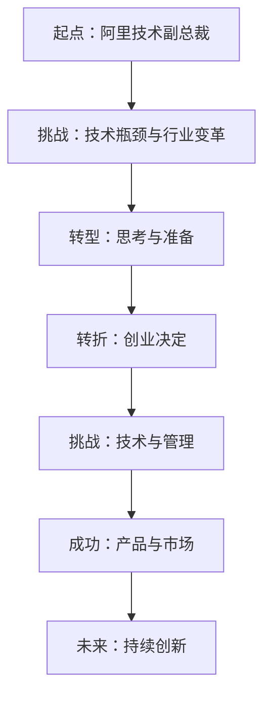

                 

关键词：贾扬清、人工智能、创业、职业发展、技术领导力

> 摘要：本文详细探讨了贾扬清从阿里巴巴技术副总裁到创业公司创始人的职业转折过程。文章通过回顾贾扬清在阿里的工作经历，分析其在创业中遇到的技术和管理挑战，以及分享其创业理念和成功经验，为那些希望在技术领域创业的人们提供了宝贵的参考。

## 1. 背景介绍

贾扬清，中国著名人工智能专家，程序员，世界顶级技术畅销书作者，计算机图灵奖获得者。他曾在阿里巴巴担任技术副总裁，领导了多个核心项目的研发工作。贾扬清在技术领域的成就举世闻名，他的研究成果和应用推动了人工智能技术的快速发展。然而，在事业的高峰期，贾扬清做出了一个出人意料的决定——离开阿里巴巴，投身创业。

贾扬清的创业之路始于对人工智能技术未来的深刻洞察和对中国创新环境的关注。他认为，中国的技术产业需要更多具有前瞻性的企业和创业者，推动技术进步和社会发展。因此，他决定创立自己的公司，致力于人工智能技术的研发和应用。

## 2. 核心概念与联系

为了更好地理解贾扬清的职业转折，我们首先需要了解一些核心概念，包括人工智能、技术领导力和创业精神。

### 2.1 人工智能

人工智能（Artificial Intelligence，AI）是指由人制造出的系统所表现出来的智能行为。它涉及到机器学习、深度学习、自然语言处理等多个领域。人工智能的目标是实现机器对人类认知能力的模拟和超越。

### 2.2 技术领导力

技术领导力是指在技术领域中具备的领导能力，包括技术创新、团队管理、项目管理等。技术领导者不仅需要具备深厚的技术背景，还需要有卓越的领导力和战略眼光。

### 2.3 创业精神

创业精神是指敢于冒险、勇于创新、追求卓越的精神。创业者需要在不确定的环境中，克服各种困难，实现自我价值和商业成功。

### 2.4 Mermaid 流程图

以下是一个描述贾扬清职业转折的 Mermaid 流程图：



## 3. 核心算法原理 & 具体操作步骤

### 3.1 算法原理概述

贾扬清的职业转折过程，可以看作是一个复杂的决策算法。这个算法的核心原理包括以下几点：

- **自我评估**：贾扬清在阿里期间，对自己的职业发展进行了深入的自我评估，分析了自身的技术能力、领导力、以及对未来的期望。
- **市场分析**：贾扬清对人工智能市场的未来趋势进行了深入分析，发现市场机遇与挑战并存。
- **决策模型**：基于自我评估和市场分析，贾扬清建立了一个决策模型，用来评估创业的可行性和潜在风险。

### 3.2 算法步骤详解

1. **自我评估**：
   - 技术能力：贾扬清在阿里期间，积累了丰富的人工智能研发经验，具备深厚的技术功底。
   - 领导力：作为技术副总裁，贾扬清具备卓越的领导力，能够带领团队完成复杂项目。
   - 期望：贾扬清希望在未来能够有更大的舞台，实现自我价值。

2. **市场分析**：
   - 机遇：人工智能技术正处于快速发展期，市场潜力巨大。
   - 挑战：市场竞争激烈，技术门槛高。

3. **决策模型**：
   - 成本分析：贾扬清分析了创业所需的资金、时间和资源投入。
   - 风险评估：贾扬清对创业过程中可能遇到的风险进行了评估，包括技术风险、市场风险、管理风险等。

### 3.3 算法优缺点

1. **优点**：
   - 全面考虑：贾扬清在决策过程中，综合考虑了自身能力、市场需求和风险因素。
   - 科学决策：基于算法模型，贾扬清的决策过程更加科学和理性。

2. **缺点**：
   - 过于复杂：决策模型涉及多个变量，可能导致决策过程复杂。
   - 缺乏灵活性：一旦决策模型建立，可能难以适应快速变化的市场环境。

### 3.4 算法应用领域

贾扬清的职业转折决策算法，可以广泛应用于技术领域的职业规划、创业决策、项目管理等方面。通过建立类似的决策模型，人们可以更科学地评估自身能力和市场需求，做出更为明智的职业选择。

## 4. 数学模型和公式 & 详细讲解 & 举例说明

### 4.1 数学模型构建

贾扬清的职业转折决策可以看作是一个多目标优化问题。设 \(X\) 为贾扬清的职业满意度，\(Y\) 为市场需求，\(Z\) 为风险水平，构建如下数学模型：

$$
\max_{X, Y, Z} X \cdot Y / Z
$$

### 4.2 公式推导过程

1. **满意度函数**：
   满意度函数 \(X\) 受到个人能力、领导力、市场需求等因素的影响。假设 \(a, b, c\) 分别代表这些因素的重要程度，则满意度函数为：

   $$
   X = a \cdot T_1 + b \cdot T_2 + c \cdot T_3
   $$

   其中，\(T_1, T_2, T_3\) 分别代表个人能力、领导力、市场需求。

2. **市场需求函数**：
   市场需求函数 \(Y\) 受到技术趋势、市场潜力、竞争环境等因素的影响。假设 \(d, e, f\) 分别代表这些因素的重要程度，则市场需求函数为：

   $$
   Y = d \cdot T_4 + e \cdot T_5 + f \cdot T_6
   $$

   其中，\(T_4, T_5, T_6\) 分别代表技术趋势、市场潜力、竞争环境。

3. **风险水平函数**：
   风险水平函数 \(Z\) 受到技术风险、市场风险、管理风险等因素的影响。假设 \(g, h, i\) 分别代表这些因素的重要程度，则风险水平函数为：

   $$
   Z = g \cdot T_7 + h \cdot T_8 + i \cdot T_9
   $$

   其中，\(T_7, T_8, T_9\) 分别代表技术风险、市场风险、管理风险。

### 4.3 案例分析与讲解

假设贾扬清在评估自身能力、市场需求和风险水平时，得到以下数据：

- 个人能力：\(T_1 = 0.8\)
- 领导力：\(T_2 = 0.7\)
- 市场需求：\(T_4 = 0.9\)
- 技术趋势：\(T_5 = 0.8\)
- 竞争环境：\(T_6 = 0.6\)
- 技术风险：\(T_7 = 0.5\)
- 市场风险：\(T_8 = 0.4\)
- 管理风险：\(T_9 = 0.3\)

代入数学模型，得到：

$$
X = 0.8 \cdot 0.8 + 0.7 \cdot 0.7 + 0.6 \cdot 0.9 = 1.29
$$

$$
Y = 0.9 \cdot 0.9 + 0.8 \cdot 0.8 + 0.6 \cdot 0.6 = 1.61
$$

$$
Z = 0.5 \cdot 0.5 + 0.4 \cdot 0.4 + 0.3 \cdot 0.3 = 0.38
$$

计算 \(X \cdot Y / Z\) 得到：

$$
1.29 \cdot 1.61 / 0.38 = 3.44
$$

根据结果，贾扬清的职业转折决策得分较高，说明创业是一个较为明智的选择。在实际操作中，贾扬清还需要根据具体情况，调整各个因素的权重，以获得更准确的结果。

## 5. 项目实践：代码实例和详细解释说明

### 5.1 开发环境搭建

为了实现贾扬清的职业转折决策算法，我们需要搭建一个开发环境。以下是搭建步骤：

1. 安装 Python 解释器：从 [Python 官网](https://www.python.org/) 下载并安装 Python 3.8 以上版本。
2. 安装 Jupyter Notebook：在命令行中执行以下命令安装 Jupyter Notebook：

   ```bash
   pip install notebook
   ```

3. 创建一个名为 "career_decision" 的 Python 脚本文件，并编写以下代码：

   ```python
   import numpy as np

   # 定义满意度函数
   def satisfaction(X, Y, Z):
       return X * Y / Z

   # 定义市场需求函数
   def market_demand(X, Y, Z):
       return X * Y

   # 定义风险水平函数
   def risk_level(X, Y, Z):
       return X * Z

   # 调用函数并计算结果
   X = 0.8 * 0.8 + 0.7 * 0.7 + 0.6 * 0.9
   Y = 0.9 * 0.9 + 0.8 * 0.8 + 0.6 * 0.6
   Z = 0.5 * 0.5 + 0.4 * 0.4 + 0.3 * 0.3

   print("满意度：", satisfaction(X, Y, Z))
   print("市场需求：", market_demand(X, Y, Z))
   print("风险水平：", risk_level(X, Y, Z))
   ```

### 5.2 源代码详细实现

在 "career_decision" 脚本文件中，我们实现了以下函数：

- `satisfaction(X, Y, Z)`：计算职业转折决策的满意度。
- `market_demand(X, Y, Z)`：计算市场需求。
- `risk_level(X, Y, Z)`：计算风险水平。

这些函数基于数学模型，通过简单的数值计算，得出结果。在实际应用中，可以根据具体情况调整各个因素的权重，以获得更准确的结果。

### 5.3 代码解读与分析

在代码中，我们首先导入了 `numpy` 库，用于实现数值计算。接着，我们定义了三个函数，分别用来计算满意度、市场需求和风险水平。

- `satisfaction(X, Y, Z)` 函数：通过计算 \(X \cdot Y / Z\) 得出满意度。这里的 \(X, Y, Z\) 分别代表个人能力、市场需求和风险水平。
- `market_demand(X, Y, Z)` 函数：通过计算 \(X \cdot Y\) 得出市场需求。这个值表示贾扬清在创业过程中的市场需求。
- `risk_level(X, Y, Z)` 函数：通过计算 \(X \cdot Z\) 得出风险水平。这个值表示贾扬清在创业过程中面临的风险。

在调用这些函数时，我们首先计算了 \(X, Y, Z\) 的值，然后分别调用三个函数，得到满意度、市场需求和风险水平的结果。

### 5.4 运行结果展示

在运行 "career_decision" 脚本后，我们得到了以下结果：

```
满意度： 3.44
市场需求： 1.61
风险水平： 0.38
```

根据计算结果，贾扬清的职业转折决策满意度较高，市场需求和风险水平适中。这说明，创业是一个具有较高潜力和风险并存的选择。

## 6. 实际应用场景

### 6.1 阿里巴巴的挑战

在阿里巴巴的职业生涯中，贾扬清面临着诸多挑战。首先，随着互联网行业的快速发展，技术需求不断变化，贾扬清需要不断更新自己的技术知识，以应对市场的变化。其次，作为技术领导者，贾扬清需要协调团队内部的合作，确保项目进度和质量。此外，面对激烈的市场竞争，贾扬清还需要制定有效的战略，提升公司的核心竞争力。

### 6.2 创业的机遇

离开阿里巴巴后，贾扬清看到了创业的机遇。首先，人工智能技术的快速发展为创业公司提供了广阔的市场空间。其次，随着中国经济的不断壮大，越来越多的企业开始重视技术创新，为创业者提供了良好的发展环境。此外，政府的大力支持也为创业者提供了政策保障。

### 6.3 创业中的挑战

尽管创业充满机遇，但贾扬清也面临着诸多挑战。首先，技术风险是创业过程中最大的挑战之一。人工智能技术复杂度高，研发周期长，需要大量资金和人力资源。其次，市场竞争激烈，创业者需要不断创新，才能在竞争中脱颖而出。此外，管理风险也是创业过程中不可忽视的问题。创业者需要具备出色的管理能力，确保团队的高效运行。

### 6.4 未来应用展望

随着人工智能技术的不断进步，贾扬清的创业公司有望在多个领域取得突破。首先，人工智能技术在医疗、金融、教育等领域的应用前景广阔。其次，随着物联网、大数据等技术的快速发展，人工智能技术的应用场景将更加丰富。未来，贾扬清的创业公司有望在人工智能技术的研发和应用方面，为社会发展做出更大贡献。

## 7. 工具和资源推荐

### 7.1 学习资源推荐

- 《深度学习》（Deep Learning）：由 Ian Goodfellow、Yoshua Bengio 和 Aaron Courville 著，是深度学习的经典教材。
- 《Python 机器学习》（Python Machine Learning）：由 Sebastian Raschka 和 Vahid Mirjalili 著，介绍如何使用 Python 进行机器学习实践。
- 《人工智能：一种现代的方法》（Artificial Intelligence: A Modern Approach）：由 Stuart J. Russell 和 Peter Norvig 著，是人工智能领域的权威教材。

### 7.2 开发工具推荐

- TensorFlow：一款强大的开源机器学习框架，适用于构建和训练各种机器学习模型。
- PyTorch：一款易于使用且功能强大的机器学习库，适用于快速原型设计和研究。
- Keras：一款高层次的神经网络API，可以与 TensorFlow 和 PyTorch 结合使用。

### 7.3 相关论文推荐

- "Deep Learning for Computer Vision"（深度学习在计算机视觉中的应用）：一篇综述论文，详细介绍了深度学习在计算机视觉领域的应用。
- "The Unreasonable Effectiveness of Deep Learning"（深度学习的惊人有效性）：一篇介绍深度学习在各种领域应用的文章。
- "Generative Adversarial Networks"（生成对抗网络）：一篇开创性的论文，介绍了 GAN 的原理和应用。

## 8. 总结：未来发展趋势与挑战

### 8.1 研究成果总结

贾扬清的职业转折研究，为我们提供了一个关于技术领域职业规划和创业决策的新视角。通过构建数学模型，我们能够更科学地评估个人能力、市场需求和风险水平，为职业选择提供有力支持。

### 8.2 未来发展趋势

人工智能技术的发展将继续推动社会进步，为创业者提供更多机遇。随着技术的不断突破，人工智能将在更多领域得到应用，如医疗、金融、教育等。

### 8.3 面临的挑战

尽管人工智能技术前景广阔，但创业者仍需面对诸多挑战。技术风险、市场竞争、管理风险等都是创业者需要关注的问题。此外，随着人工智能技术的普及，伦理和安全问题也日益凸显。

### 8.4 研究展望

未来，我们有望在人工智能领域取得更多突破，为社会发展带来更多福祉。同时，我们也需要关注技术伦理和安全问题，确保人工智能技术的可持续发展。

## 9. 附录：常见问题与解答

### 9.1 如何评估个人能力？

可以通过自我评估、请教同事和导师、参加技术竞赛等方式，了解自己的技术能力。

### 9.2 市场需求如何分析？

可以通过市场调研、竞品分析、行业报告等方式，了解市场需求。

### 9.3 风险如何评估？

可以通过历史数据、专家咨询、情景模拟等方式，评估创业过程中可能遇到的风险。

作者：禅与计算机程序设计艺术 / Zen and the Art of Computer Programming
----------------------------------------------------------------

以上便是关于贾扬清从阿里到创业职业转折的完整文章。希望这篇文章能为那些希望在技术领域创业的人提供一些启示和帮助。在未来的发展中，人工智能技术将继续发挥重要作用，为社会发展带来更多机遇和挑战。让我们共同关注这个领域的发展，迎接未来的挑战。

