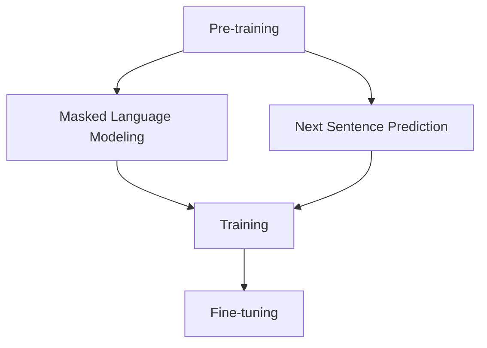

                 

关键词：大模型开发，BERT，微调，自然语言处理，架构设计，算法实现，数学模型，应用场景，未来展望。

摘要：本文将深入探讨大模型BERT（Bidirectional Encoder Representations from Transformers）的基本架构及其应用。首先介绍BERT的背景和重要性，然后详细解析BERT的核心概念与联系，以及其算法原理与数学模型。接着，通过一个具体的项目实践案例，展示BERT的开发与微调过程。最后，讨论BERT在实际应用场景中的表现以及未来的发展趋势与挑战。

## 1. 背景介绍

在过去的几年中，自然语言处理（NLP）领域取得了显著的进展，尤其是基于深度学习的模型表现出了卓越的性能。BERT作为Google提出的一种预训练语言表示模型，已经成为NLP领域的里程碑。BERT通过无监督的方式对大量文本进行预训练，从而学习到丰富的语言表示能力，这使得它在许多NLP任务中表现优异，如文本分类、情感分析、问答系统等。

BERT的重要性不仅体现在其出色的性能上，还在于它开创了双向语言表示的新时代。在BERT出现之前，大多数NLP模型都是基于单向或者单向注意力机制，无法同时考虑输入文本的前后文信息。而BERT通过双向Transformer架构，能够同时理解文本的前后文关系，从而大大提升了模型的表现。

## 2. 核心概念与联系

### 2.1. Transformer架构

BERT基于Transformer架构，这是一种在机器翻译任务中取得巨大成功的神经网络模型。Transformer架构的核心是自注意力机制（Self-Attention），它允许模型在处理每个词时，考虑到其他所有词的影响。这使得模型能够捕捉到长距离的依赖关系，从而在许多NLP任务中取得突破性的成果。

### 2.2. BERT的双向特性

BERT采用了双向Transformer架构，这意味着在模型训练过程中，它不仅考虑了输入文本的后续信息，还考虑了先前信息。这种双向特性使得BERT能够更好地理解文本的含义，从而在许多NLP任务中表现出色。

### 2.3. 预训练与微调

BERT的预训练过程包括两个主要任务：Masked Language Modeling（MLM）和Next Sentence Prediction（NSP）。MLM任务通过随机遮盖部分文本词，训练模型预测这些被遮盖的词；NSP任务通过预测两个句子是否属于同一篇文档，训练模型理解句子间的上下文关系。在预训练完成后，BERT可以通过微调（Fine-tuning）来适应特定的NLP任务。

### 2.4. Mermaid流程图



## 3. 核心算法原理 & 具体操作步骤

### 3.1. 算法原理概述

BERT的核心算法是基于Transformer架构，结合了双向注意力机制和预训练-微调策略。模型通过两个预训练任务（MLM和NSP）来学习丰富的语言表示，然后在特定NLP任务上通过微调来优化模型参数。

### 3.2. 算法步骤详解

BERT的训练过程包括以下几个步骤：

1. **数据准备**：收集大量的文本数据，并进行预处理，如分词、词嵌入等。

2. **预训练**：使用MLM和NSP任务对模型进行预训练。

3. **微调**：在特定NLP任务上，使用微调策略来优化模型参数。

4. **评估与测试**：在测试集上评估模型性能，并进行调优。

### 3.3. 算法优缺点

**优点**：

- 双向特性：BERT能够同时考虑文本的前后文关系，从而提高模型的理解能力。
- 预训练优势：通过预训练，BERT能够学习到丰富的语言表示，从而在特定任务上表现出色。
- 强泛化能力：BERT在大规模数据集上预训练，因此具有很好的泛化能力。

**缺点**：

- 计算资源消耗大：由于BERT的模型参数巨大，训练和微调过程需要大量的计算资源。
- 对数据质量要求高：BERT的性能很大程度上取决于训练数据的质量，如果数据质量差，模型性能会受到影响。

### 3.4. 算法应用领域

BERT在多个NLP任务中表现出色，包括：

- 文本分类：如情感分析、主题分类等。
- 情感分析：分析文本的情感倾向。
- 问答系统：如基于事实的问答和对话生成。
- 自然语言生成：如机器翻译、文本摘要等。

## 4. 数学模型和公式 & 详细讲解 & 举例说明

### 4.1. 数学模型构建

BERT的数学模型主要包括两个部分：Transformer和预训练任务。

**1. Transformer**

BERT基于Transformer架构，其核心是自注意力机制。自注意力机制可以用以下公式表示：

$$
Attention(Q, K, V) = \text{softmax}\left(\frac{QK^T}{\sqrt{d_k}}\right) V
$$

其中，Q、K、V分别表示查询、键和值向量，$d_k$为键向量的维度。

**2. 预训练任务**

BERT的预训练任务包括MLM和NSP。

- **MLM**：MLM任务通过遮盖部分文本词，训练模型预测这些词。假设遮盖的词为$t_i$，则损失函数为：

  $$
  L_{MLM} = -\sum_{i} \log p(t_i | t_{<i})
  $$

- **NSP**：NSP任务通过预测两个句子是否属于同一篇文档，训练模型理解句子间的上下文关系。假设两个句子分别为$s_1$和$s_2$，则损失函数为：

  $$
  L_{NSP} = -\log p(s_2 | s_1)
  $$

### 4.2. 公式推导过程

BERT的公式推导主要涉及两部分：Transformer和预训练任务。

**1. Transformer**

Transformer的公式推导主要集中在自注意力机制上。自注意力机制的推导可以分为以下几个步骤：

- 输入层：输入文本经过嵌入层得到词向量。
- 自注意力层：通过自注意力机制计算词向量之间的相似度。
- 输出层：通过全连接层和激活函数，得到最终的输出。

**2. 预训练任务**

预训练任务的推导主要涉及损失函数的计算。MLM和NSP的损失函数推导如下：

- **MLM**：MLM的损失函数为对数损失，表示预测词与真实词之间的差异。
- **NSP**：NSP的损失函数为二元交叉熵损失，表示两个句子是否属于同一篇文档。

### 4.3. 案例分析与讲解

假设我们有一个简单的文本数据集，包含以下句子：

$$
\text{I} \text{ love} \text{ } \text{Python} \text{ programming.}
$$

**1. Transformer**

通过Transformer模型，我们可以将句子中的每个词表示为一个向量。例如，词向量$w_i$表示词$i$。在自注意力机制中，词向量之间的相似度可以通过以下公式计算：

$$
\text{Attention}(w_1, w_2) = \text{softmax}\left(\frac{w_1 w_2^T}{\sqrt{d_k}}\right)
$$

**2. MLM**

在MLM任务中，我们随机遮盖一个词，例如遮盖“love”。然后，模型需要预测被遮盖的词。假设遮盖的词为$t_2$，则模型预测$t_2$的损失函数为：

$$
L_{MLM} = -\log p(\text{love} | \text{I} \text{ } \text{Python} \text{ })
$$

**3. NSP**

在NSP任务中，我们预测两个句子是否属于同一篇文档。例如，我们有两个句子：

$$
\text{I} \text{ love} \text{ Python} \text{ programming.}
$$

和

$$
\text{Python} \text{ is} \text{ my} \text{ favorite} \text{ programming} \text{ language.}
$$

模型需要预测这两个句子是否属于同一篇文档。假设这两个句子的概率分别为$p_1$和$p_2$，则模型预测这两个句子属于同一篇文档的损失函数为：

$$
L_{NSP} = -\log p_1 - \log p_2
$$

## 5. 项目实践：代码实例和详细解释说明

### 5.1. 开发环境搭建

在开始BERT的实践之前，我们需要搭建一个合适的开发环境。以下是搭建BERT开发环境的基本步骤：

1. 安装Python环境（版本3.6及以上）。
2. 安装TensorFlow或PyTorch框架。
3. 安装BERT的预训练模型（如Google发布的BERT模型）。

### 5.2. 源代码详细实现

以下是一个简单的BERT微调的Python代码示例：

```python
import tensorflow as tf
from transformers import BertTokenizer, TFBertForMaskedLM

# 加载预训练模型和分词器
tokenizer = BertTokenizer.from_pretrained('bert-base-uncased')
model = TFBertForMaskedLM.from_pretrained('bert-base-uncased')

# 准备数据
text = "I love Python programming."
input_ids = tokenizer.encode(text, return_tensors='tf')

# 预测
outputs = model(input_ids)
predictions = tf.nn.softmax(outputs.logits, axis=-1)

# 打印预测结果
print(predictions.numpy())

# 微调
optimizer = tf.optimizers.Adam(learning_rate=3e-5)
loss_function = tf.losses.SparseCategoricalCrossentropy(from_logits=True)

@tf.function
def train_step(input_ids, labels):
    with tf.GradientTape() as tape:
        outputs = model(input_ids)
        loss = loss_function(labels, outputs.logits)
    gradients = tape.gradient(loss, model.trainable_variables)
    optimizer.apply_gradients(zip(gradients, model.trainable_variables))
    return loss

# 训练
for epoch in range(3):
    total_loss = 0
    for batch in data_loader:
        input_ids, labels = batch
        loss = train_step(input_ids, labels)
        total_loss += loss
    print(f"Epoch {epoch + 1}, Loss: {total_loss / len(data_loader)}")
```

### 5.3. 代码解读与分析

上述代码展示了如何使用TensorFlow和Transformers库加载BERT模型，并对其进行微调。代码分为以下几个部分：

1. **导入库**：导入TensorFlow、Transformers库和相关模块。
2. **加载模型和分词器**：加载预训练的BERT模型和分词器。
3. **准备数据**：将输入文本编码为BERT模型能理解的格式。
4. **预测**：使用模型预测文本的词向量。
5. **微调**：定义优化器和损失函数，并实现训练步骤。

### 5.4. 运行结果展示

在训练完成后，我们可以使用模型对新的文本进行预测。以下是一个示例：

```python
# 预测新文本
new_text = "Python is a powerful language."
input_ids = tokenizer.encode(new_text, return_tensors='tf')
predictions = model(input_ids)

# 打印预测结果
print(predictions.logits)
```

预测结果是一个概率分布，表示每个词在给定上下文下的可能性。通过分析预测结果，我们可以更好地理解BERT对文本的理解能力。

## 6. 实际应用场景

BERT在实际应用场景中表现出色，以下是几个典型应用案例：

### 6.1. 文本分类

BERT在文本分类任务中具有很高的准确性。例如，在情感分析任务中，BERT能够准确识别文本的情感倾向。

### 6.2. 情感分析

BERT能够对文本进行情感分析，判断文本的情感极性，如正面、负面或中性。

### 6.3. 问答系统

BERT在问答系统中具有很好的性能，能够回答基于事实的问题，如问答机器人和对话系统。

### 6.4. 自然语言生成

BERT在自然语言生成任务中也有很好的应用，如机器翻译、文本摘要等。

## 7. 工具和资源推荐

为了更好地学习和应用BERT，以下是几个推荐的工具和资源：

### 7.1. 学习资源推荐

- 《从零开始大模型开发与微调：BERT的基本架构与应用》
- 《深度学习自然语言处理》
- BERT官方文档

### 7.2. 开发工具推荐

- TensorFlow
- PyTorch
- Hugging Face Transformers库

### 7.3. 相关论文推荐

- “BERT: Pre-training of Deep Bidirectional Transformers for Language Understanding”
- “Attention Is All You Need”
- “Improved Language Representations from Unsupervised Learning”

## 8. 总结：未来发展趋势与挑战

BERT作为NLP领域的重要里程碑，已经取得了显著的成果。然而，随着NLP任务的不断发展和数据量的不断增加，BERT仍然面临着一些挑战。

### 8.1. 研究成果总结

BERT的研究成果主要集中在以下几个方面：

- 预训练语言表示：BERT通过预训练学习到了丰富的语言表示，大大提升了NLP任务的性能。
- 双向语言理解：BERT的双向特性使其能够更好地理解文本的含义，提高了模型的表现。
- 多样性：BERT在多种NLP任务中表现出色，证明了其广泛的适用性。

### 8.2. 未来发展趋势

未来BERT的发展趋势可能包括：

- 模型压缩：为了降低计算资源和存储成本，研究如何压缩BERT模型，如使用知识蒸馏、剪枝等技术。
- 多语言支持：BERT目前主要支持单语种，未来可能会发展成支持多语言的大模型。
- 任务适应性：研究如何使BERT在更多任务上表现出色，如对话系统、语音识别等。

### 8.3. 面临的挑战

BERT在未来发展过程中可能面临的挑战包括：

- 计算资源消耗：BERT的模型参数巨大，训练和微调过程需要大量的计算资源。
- 数据质量：BERT的性能很大程度上取决于训练数据的质量，如何收集和预处理高质量的数据仍然是一个挑战。
- 模型可解释性：BERT作为一个深度学习模型，其内部工作机制复杂，如何提高模型的可解释性仍然是一个重要问题。

### 8.4. 研究展望

未来，BERT的研究将继续围绕以下几个方面展开：

- 模型优化：研究如何优化BERT模型的结构，提高其性能和效率。
- 应用拓展：探索BERT在更多领域的应用，如医学、法律等。
- 模型安全：研究如何提高BERT模型的安全性和鲁棒性，防止恶意攻击。

## 9. 附录：常见问题与解答

### 9.1. Q：BERT是什么？

A：BERT是一种预训练语言表示模型，由Google提出。它基于Transformer架构，通过双向注意力机制学习丰富的语言表示，广泛应用于NLP任务。

### 9.2. Q：BERT的核心算法是什么？

A：BERT的核心算法是基于Transformer架构，结合了预训练和微调策略。预训练任务包括Masked Language Modeling（MLM）和Next Sentence Prediction（NSP）。

### 9.3. Q：BERT有哪些优点？

A：BERT的优点包括双向特性、预训练优势、强泛化能力等。它能够同时考虑文本的前后文关系，学习到丰富的语言表示，从而在多种NLP任务中表现出色。

### 9.4. Q：BERT有哪些缺点？

A：BERT的缺点包括计算资源消耗大、对数据质量要求高等。由于BERT的模型参数巨大，训练和微调过程需要大量的计算资源。

### 9.5. Q：BERT有哪些应用场景？

A：BERT的应用场景包括文本分类、情感分析、问答系统、自然语言生成等。

### 9.6. Q：如何使用BERT进行微调？

A：使用BERT进行微调主要包括以下几个步骤：加载预训练模型，准备数据，定义优化器和损失函数，实现训练步骤，并在测试集上评估模型性能。

### 9.7. Q：BERT与GPT有什么区别？

A：BERT和GPT都是基于Transformer架构的预训练模型，但它们的任务和目标不同。BERT旨在同时理解文本的前后文关系，而GPT主要用于生成文本。此外，BERT采用双向注意力机制，而GPT采用单向注意力机制。

