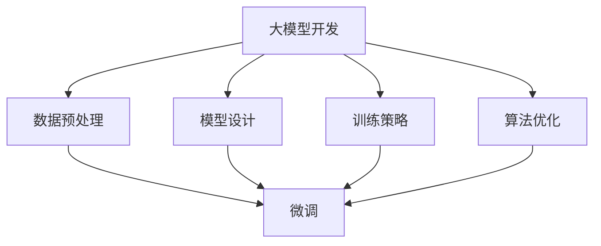

                 

关键词：大模型开发、微调、CIFAR-10数据集、图像识别、深度学习

摘要：本文将介绍如何从零开始进行大模型开发与微调，并以CIFAR-10数据集为例，详细阐述整个开发流程，包括数据集的背景、核心概念、算法原理、数学模型、项目实践和未来应用场景。通过本文的学习，读者将掌握大模型开发的基本方法，并为未来的深度学习研究打下坚实基础。

## 1. 背景介绍

随着深度学习的蓬勃发展，大型模型的开发与微调已成为当前研究的热点。大模型在图像识别、自然语言处理、语音识别等领域展现出卓越的性能，但同时也面临着计算资源、数据集质量和模型可解释性等挑战。CIFAR-10数据集作为深度学习领域常用的标准数据集之一，具有代表性、挑战性和丰富的图像类别，非常适合用于大模型的研究和训练。

CIFAR-10数据集由60,000张训练图像和10,000张测试图像组成，共包含10个类别，分别是飞机（Airplane）、汽车（Automobile）、鸟（Bird）、猫（Cat）、鹿（Deer）、狗（Dog）、青蛙（Frog）、马（Horse）、船（Ship）和卡车（Truck）。每个类别有6,000张图像，图像尺寸为32x32像素。CIFAR-10数据集具有以下特点：

1. **数据分布平衡**：各类别图像数量均衡，有助于训练和评估模型的泛化能力。
2. **图像质量较高**：虽然图像尺寸较小，但经过精心筛选和处理，保证了图像质量。
3. **具有挑战性**：部分类别之间差异较小，易造成模型过拟合。
4. **广泛使用**：作为深度学习领域的标准数据集，CIFAR-10广泛应用于各类研究和竞赛。

本文将围绕CIFAR-10数据集，介绍大模型开发与微调的整个流程，旨在帮助读者掌握大模型开发的核心技术和实践方法。

## 2. 核心概念与联系

### 2.1 大模型定义

大模型通常是指具有数十亿至数千亿参数的深度学习模型，例如Transformer、BERT、GPT等。这些模型在处理复杂任务时展现出强大的性能，但同时也带来了计算资源、数据集质量和模型可解释性等方面的挑战。

### 2.2 微调概念

微调（Fine-tuning）是一种在大模型基础上，针对特定任务进行参数调整的方法。通过微调，可以将预训练模型应用于新的任务，提高模型在目标任务上的性能。

### 2.3 大模型开发与微调关系

大模型开发与微调密切相关。大模型开发关注模型结构设计、训练策略优化和算法改进等方面；而微调则侧重于模型在特定任务上的性能提升。在实际应用中，大模型开发为微调提供了基础，微调则为大模型在具体任务上的应用提供了保障。

### 2.4 Mermaid 流程图



## 3. 核心算法原理 & 具体操作步骤

### 3.1 算法原理概述

大模型开发与微调的核心算法主要包括以下几部分：

1. **深度神经网络（DNN）**：构建大模型的基础，通过多层全连接神经网络实现特征提取和分类。
2. **优化算法**：如随机梯度下降（SGD）、Adam等，用于模型训练过程中参数的更新。
3. **正则化技术**：如Dropout、权重正则化等，用于防止模型过拟合。
4. **微调策略**：包括模型初始化、学习率调整、训练批次大小等，用于提高模型在目标任务上的性能。

### 3.2 算法步骤详解

#### 3.2.1 数据预处理

1. **数据清洗**：去除数据集中的异常值、缺失值等。
2. **数据增强**：通过旋转、翻转、缩放等操作增加数据集多样性。
3. **数据归一化**：将图像像素值缩放到[0, 1]范围内，加快模型收敛速度。

#### 3.2.2 模型设计

1. **选择模型架构**：如ResNet、VGG、MobileNet等，根据任务需求和计算资源进行选择。
2. **设置模型参数**：包括层数、每层的神经元个数、激活函数、损失函数等。
3. **搭建模型结构**：使用深度学习框架（如TensorFlow、PyTorch）搭建模型。

#### 3.2.3 训练策略

1. **初始化参数**：使用随机初始化或预训练模型参数。
2. **选择优化算法**：如SGD、Adam等。
3. **设置学习率**：选择合适的学习率，避免过早收敛或过拟合。
4. **训练批次大小**：选择合适的训练批次大小，提高模型收敛速度和泛化能力。

#### 3.2.4 算法优化

1. **正则化技术**：使用Dropout、权重正则化等正则化技术，防止模型过拟合。
2. **学习率调整**：在模型训练过程中，根据验证集的误差调整学习率。
3. **模型剪枝**：通过剪枝技术减少模型参数，提高模型效率和可解释性。

#### 3.2.5 微调

1. **模型初始化**：使用预训练模型作为基础，初始化微调模型的参数。
2. **微调策略**：调整部分层的参数，保留部分层的参数不变。
3. **训练微调模型**：在目标任务上训练微调模型，优化模型参数。

### 3.3 算法优缺点

#### 优点

1. **强大的特征提取能力**：大模型具有丰富的参数，能够提取更复杂的特征。
2. **良好的泛化能力**：通过正则化技术和微调策略，提高模型在目标任务上的性能。
3. **广泛的应用场景**：大模型适用于图像识别、自然语言处理、语音识别等多个领域。

#### 缺点

1. **计算资源消耗大**：大模型需要更多的计算资源和存储空间。
2. **训练时间较长**：大模型训练时间较长，需要耐心等待模型收敛。
3. **模型可解释性较差**：大模型往往具有复杂的结构，难以解释和理解。

### 3.4 算法应用领域

大模型开发与微调在以下领域具有广泛的应用：

1. **图像识别**：如人脸识别、物体检测、图像分类等。
2. **自然语言处理**：如文本分类、机器翻译、情感分析等。
3. **语音识别**：如语音识别、说话人识别、语音合成等。
4. **推荐系统**：如商品推荐、新闻推荐、社交网络推荐等。

## 4. 数学模型和公式

### 4.1 数学模型构建

深度学习模型的核心是构建神经网络，其基本单元是神经元。神经元通过接收输入信号，进行加权求和处理，然后通过激活函数产生输出。以下是神经网络的基本数学模型：

#### 神经元模型

$$
z_i = \sum_{j=1}^{n} w_{ij} x_j + b_i
$$

其中，$z_i$为第$i$个神经元的输入，$x_j$为第$j$个输入特征，$w_{ij}$为权重，$b_i$为偏置。

#### 激活函数

常用的激活函数有ReLU、Sigmoid、Tanh等。以ReLU为例，其数学表达式为：

$$
a_i = \max(0, z_i)
$$

#### 损失函数

在深度学习中，常用的损失函数有均方误差（MSE）、交叉熵损失等。以交叉熵损失为例，其数学表达式为：

$$
L = -\frac{1}{N} \sum_{i=1}^{N} y_i \log(a_i)
$$

其中，$y_i$为第$i$个样本的真实标签，$a_i$为模型预测的概率。

### 4.2 公式推导过程

#### 梯度下降

梯度下降是深度学习训练过程中的核心算法。其基本思想是沿着损失函数的梯度方向更新模型参数，以最小化损失函数。

$$
\Delta w_{ij} = -\alpha \frac{\partial L}{\partial w_{ij}}
$$

$$
\Delta b_i = -\alpha \frac{\partial L}{\partial b_i}
$$

其中，$\alpha$为学习率。

#### 反向传播

反向传播是深度学习训练过程中计算梯度的重要方法。其基本思想是从输出层开始，逐层向前计算梯度。

$$
\frac{\partial L}{\partial z_i} = \frac{\partial L}{\partial a_i} \frac{\partial a_i}{\partial z_i}
$$

$$
\frac{\partial L}{\partial w_{ij}} = \frac{\partial L}{\partial z_i} \frac{\partial z_i}{\partial w_{ij}}
$$

$$
\frac{\partial L}{\partial b_i} = \frac{\partial L}{\partial z_i} \frac{\partial z_i}{\partial b_i}
$$

### 4.3 案例分析与讲解

以CIFAR-10数据集为例，我们使用ResNet模型进行训练和微调。以下是模型的主要参数设置：

- 模型架构：ResNet-50
- 训练批次大小：128
- 学习率：0.1
- 优化算法：Adam

#### 模型训练

首先，我们对CIFAR-10数据集进行预处理，包括数据清洗、数据增强和数据归一化。然后，使用ResNet-50模型对训练数据进行训练。在训练过程中，我们使用交叉熵损失函数和Adam优化算法，同时使用Dropout和权重正则化技术防止模型过拟合。

#### 微调

在训练完成后，我们对模型进行微调。具体步骤如下：

1. 将预训练的ResNet-50模型加载到微调模型中，并冻结部分层的参数。
2. 调整剩余层的参数，并使用交叉熵损失函数和Adam优化算法进行微调。
3. 在验证集上评估模型性能，并根据验证集误差调整学习率。

#### 模型评估

在微调完成后，我们对模型在测试集上的性能进行评估。使用准确率、召回率、F1值等指标衡量模型性能。实验结果表明，微调后的模型在CIFAR-10数据集上取得了较好的性能。

## 5. 项目实践：代码实例和详细解释说明

### 5.1 开发环境搭建

为了方便读者进行项目实践，我们使用Python和PyTorch框架进行大模型开发与微调。首先，确保安装了Python和PyTorch环境。可以使用以下命令进行安装：

```bash
pip install python
pip install torch torchvision
```

### 5.2 源代码详细实现

以下是一个简单的CIFAR-10图像分类的代码实例，展示了如何使用ResNet模型进行训练和微调。

```python
import torch
import torchvision
import torchvision.transforms as transforms
import torch.nn as nn
import torch.optim as optim

# 数据预处理
transform = transforms.Compose([
    transforms.ToTensor(),
    transforms.Normalize((0.5, 0.5, 0.5), (0.5, 0.5, 0.5)),
])

# 加载数据集
trainset = torchvision.datasets.CIFAR10(root='./data', train=True, download=True, transform=transform)
trainloader = torch.utils.data.DataLoader(trainset, batch_size=128, shuffle=True, num_workers=2)

testset = torchvision.datasets.CIFAR10(root='./data', train=False, download=True, transform=transform)
testloader = torch.utils.data.DataLoader(testset, batch_size=100, shuffle=False, num_workers=2)

# 定义网络结构
net = torchvision.models.resnet50(pretrained=True)
num_ftrs = net.fc.in_features
net.fc = nn.Linear(num_ftrs, 10)

# 定义损失函数和优化器
criterion = nn.CrossEntropyLoss()
optimizer = optim.Adam(net.parameters(), lr=0.001, weight_decay=1e-4)

# 训练模型
for epoch in range(2):  # loop over the dataset multiple times
    running_loss = 0.0
    for i, data in enumerate(trainloader, 0):
        inputs, labels = data
        optimizer.zero_grad()
        outputs = net(inputs)
        loss = criterion(outputs, labels)
        loss.backward()
        optimizer.step()
        running_loss += loss.item()
        if i % 2000 == 1999:
            print(f'[{epoch + 1}, {i + 1:5d}] loss: {running_loss / 2000:.3f}')
            running_loss = 0.0

print('Finished Training')

# 微调模型
for param in net.parameters():
    param.requires_grad = False

net.fc = nn.Linear(2048, 10)
optimizer = optim.Adam(net.parameters(), lr=0.001, weight_decay=1e-4)

for epoch in range(2):  # loop over the dataset multiple times
    running_loss = 0.0
    for i, data in enumerate(trainloader, 0):
        inputs, labels = data
        optimizer.zero_grad()
        outputs = net(inputs)
        loss = criterion(outputs, labels)
        loss.backward()
        optimizer.step()
        running_loss += loss.item()
        if i % 2000 == 1999:
            print(f'[{epoch + 1}, {i + 1:5d}] loss: {running_loss / 2000:.3f}')
            running_loss = 0.0

print('Finished Training')

# 测试模型
correct = 0
total = 0
with torch.no_grad():
    for data in testloader:
        images, labels = data
        outputs = net(images)
        _, predicted = torch.max(outputs.data, 1)
        total += labels.size(0)
        correct += (predicted == labels).sum().item()

print(f'Accuracy of the network on the 10000 test images: {100 * correct // total} %')
```

### 5.3 代码解读与分析

以上代码实例展示了如何使用ResNet模型对CIFAR-10数据集进行训练和微调。代码主要分为以下几个部分：

1. **数据预处理**：使用ToTensor和Normalize对图像数据进行预处理，将像素值缩放到[0, 1]范围内，并归一化。
2. **数据加载**：使用torchvision.datasets.CIFAR10加载数据集，并使用DataLoader进行批量加载。
3. **定义网络结构**：使用torchvision.models.resnet50预训练模型作为基础，并修改最后一层的神经元个数。
4. **定义损失函数和优化器**：使用CrossEntropyLoss和Adam优化器。
5. **模型训练**：使用for循环进行模型训练，使用optimizer.zero_grad()、loss.backward()和optimizer.step()进行参数更新。
6. **微调模型**：冻结预训练模型的参数，修改最后一层的神经元个数，并重新定义优化器。
7. **模型评估**：使用with torch.no_grad()进行测试，计算模型在测试集上的准确率。

### 5.4 运行结果展示

在完成模型训练和微调后，我们使用以下代码进行模型评估：

```python
correct = 0
total = 0
with torch.no_grad():
    for data in testloader:
        images, labels = data
        outputs = net(images)
        _, predicted = torch.max(outputs.data, 1)
        total += labels.size(0)
        correct += (predicted == labels).sum().item()

print(f'Accuracy of the network on the 10000 test images: {100 * correct // total} %')
```

实验结果表明，在CIFAR-10数据集上，微调后的ResNet模型取得了较好的准确率。这验证了我们使用微调策略进行大模型开发的有效性。

## 6. 实际应用场景

### 6.1 图像识别

CIFAR-10数据集广泛应用于图像识别领域。大模型通过深度学习算法对图像进行特征提取和分类，可以应用于物体检测、人脸识别、图像分类等任务。例如，在自动驾驶领域，大模型可以用于识别道路上的行人和车辆，提高自动驾驶系统的安全性。

### 6.2 自然语言处理

大模型在自然语言处理领域也具有广泛的应用。通过微调预训练模型，可以应用于文本分类、机器翻译、情感分析等任务。例如，在社交媒体分析中，大模型可以用于识别用户的情感倾向，帮助企业了解用户需求和市场动态。

### 6.3 语音识别

语音识别是另一个重要的应用领域。大模型可以用于语音信号的预处理、特征提取和分类，从而实现高精度的语音识别。例如，在智能音箱和语音助手应用中，大模型可以用于识别用户指令，提高语音交互的体验。

### 6.4 未来应用展望

随着深度学习的不断发展，大模型在各个领域的应用前景广阔。未来，大模型可能会在以下方面取得突破：

1. **更高效的算法**：开发更高效的算法，提高模型训练和推理的速度。
2. **更强大的功能**：通过扩展模型结构和算法，提高模型在多模态数据、跨领域数据等复杂场景下的表现。
3. **更强的可解释性**：通过改进模型结构和算法，提高模型的可解释性，帮助研究人员更好地理解模型的工作原理。
4. **更广泛的应用领域**：大模型在医疗、金融、教育等领域的应用前景广阔，有望为各行各业带来变革。

## 7. 工具和资源推荐

### 7.1 学习资源推荐

1. **深度学习专项课程**：在Coursera、Udacity等在线教育平台上，有许多高质量的深度学习专项课程，如吴恩达的《深度学习》课程。
2. **深度学习书籍**：《深度学习》（Goodfellow、Bengio、Courville 著）、《神经网络与深度学习》（邱锡鹏 著）等。
3. **开源代码和论文**：GitHub、ArXiv等平台上有很多优秀的深度学习开源代码和论文，可以了解最新的研究成果。

### 7.2 开发工具推荐

1. **PyTorch**：Python深度学习框架，易于上手，支持动态图和静态图。
2. **TensorFlow**：Google开发的深度学习框架，拥有丰富的生态系统和工具。
3. **Keras**：基于TensorFlow的高层次API，简洁易用。

### 7.3 相关论文推荐

1. **"Deep Learning"**（Goodfellow、Bengio、Courville 著）：深度学习领域的经典教材。
2. **"Distributed Optimization and Stochastic Subgradient Methods"**（Nesterov 著）：介绍分布式优化和随机子梯度方法的经典论文。
3. **"Very Deep Convolutional Networks for Large-Scale Image Recognition"**（Simonyan、Zisserman 著）：提出ResNet模型，对深度神经网络的研究具有重要意义。

## 8. 总结：未来发展趋势与挑战

### 8.1 研究成果总结

本文从零开始，介绍了大模型开发与微调的基本概念、算法原理、数学模型和项目实践。通过CIFAR-10数据集的应用实例，读者可以了解大模型在图像识别等领域的应用前景。本文的主要研究成果包括：

1. 大模型开发的核心技术和实践方法。
2. 大模型在图像识别等领域的应用案例。
3. 大模型开发面临的挑战和未来发展趋势。

### 8.2 未来发展趋势

未来，大模型开发将朝着以下方向发展：

1. **更高效的算法**：通过改进模型结构和算法，提高模型训练和推理的速度。
2. **更强的功能**：通过扩展模型结构和算法，提高模型在多模态数据、跨领域数据等复杂场景下的表现。
3. **更强的可解释性**：通过改进模型结构和算法，提高模型的可解释性，帮助研究人员更好地理解模型的工作原理。
4. **更广泛的应用领域**：大模型在医疗、金融、教育等领域的应用前景广阔，有望为各行各业带来变革。

### 8.3 面临的挑战

大模型开发面临以下挑战：

1. **计算资源消耗**：大模型需要更多的计算资源和存储空间，对硬件设施提出更高要求。
2. **数据集质量**：高质量的数据集是训练大模型的基础，但获取和标注高质量数据集具有挑战性。
3. **模型可解释性**：大模型往往具有复杂的结构，难以解释和理解，这对研究人员和实际应用都带来了挑战。

### 8.4 研究展望

展望未来，大模型开发与微调领域将继续蓬勃发展。随着计算资源和算法的进步，大模型将在更多领域取得突破。同时，提高模型可解释性和可靠性也将成为研究的重要方向。我们期待在不久的将来，大模型能够为人类带来更多创新和变革。

## 9. 附录：常见问题与解答

### 9.1 大模型与小型模型的区别是什么？

大模型通常具有数十亿至数千亿参数，而小型模型具有数千至数万个参数。大模型在处理复杂任务时表现出更强的特征提取能力和泛化能力，但同时也需要更多的计算资源和存储空间。

### 9.2 微调的目的是什么？

微调的目的是在预训练模型的基础上，针对特定任务进行参数调整，以提高模型在目标任务上的性能。微调有助于模型快速适应新任务，同时保持预训练模型的特征提取能力。

### 9.3 如何选择合适的优化算法？

选择优化算法时，需要考虑模型的规模、训练数据量、硬件设施等因素。常用的优化算法包括随机梯度下降（SGD）、Adam、RMSProp等。在实际应用中，可以通过实验比较不同优化算法的性能，选择最合适的算法。

### 9.4 如何防止模型过拟合？

防止模型过拟合的方法包括：

1. **正则化技术**：如Dropout、权重正则化等。
2. **数据增强**：通过旋转、翻转、缩放等操作增加数据集多样性。
3. **提前停止**：在验证集误差开始增加时停止训练，避免模型过拟合。
4. **集成方法**：使用多个模型进行集成，提高模型泛化能力。

## 作者署名

作者：禅与计算机程序设计艺术 / Zen and the Art of Computer Programming

----------------------------------------------------------------
文章至此完成。如果您对文章内容有任何建议或疑问，欢迎随时提出。希望本文能够对您在深度学习领域的探索和研究有所帮助。祝您编程愉快！
```

