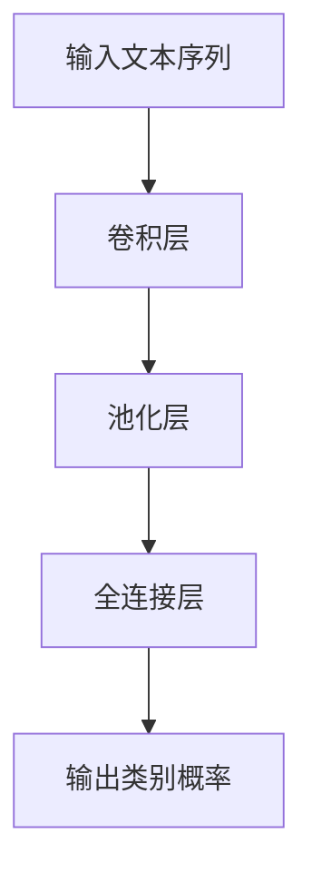

                 

关键词：卷积神经网络、文本分类、一维卷积、大模型开发、微调、深度学习

摘要：本文将深入探讨卷积神经网络在文本分类任务中的应用，特别是针对一维卷积（Conv1d）的原理与实现。我们将从基础概念出发，逐步深入到具体算法的原理、数学模型以及项目实践。通过本文的阅读，读者将能够掌握卷积神经网络在文本分类任务中的实际应用，并为后续的模型开发与微调工作打下坚实基础。

## 1. 背景介绍

在过去的几十年中，深度学习技术得到了迅猛发展，特别是在图像识别、自然语言处理等领域的应用取得了显著成果。然而，传统深度学习模型在处理文本数据时存在一些挑战，如数据维度较高、特征提取不充分等。为了解决这些问题，卷积神经网络（Convolutional Neural Networks，CNN）作为一种有效的图像处理工具，被引入到文本分类领域。

文本分类是自然语言处理中的基础任务之一，其目的是将文本数据划分为预先定义的类别。传统的文本分类方法主要依赖于词袋模型、支持向量机等传统机器学习算法，但这些方法在处理高维文本数据时往往效果不佳。卷积神经网络通过其独特的卷积操作，能够有效地提取文本的局部特征，并在不同层次上捕捉到文本的语义信息。

一维卷积神经网络（1D-CNN）是卷积神经网络的一种变体，特别适用于文本数据的处理。它将卷积操作从传统的二维图像数据扩展到一维序列数据，如文本序列。通过一维卷积操作，1D-CNN能够捕捉到文本中的词序信息，从而在文本分类任务中表现出色。

本文将首先介绍卷积神经网络的基本概念和原理，然后重点探讨一维卷积神经网络在文本分类任务中的应用，包括算法原理、数学模型以及项目实践。希望通过本文的阅读，读者能够对卷积神经网络在文本分类任务中的实现有一个全面而深入的理解。

## 2. 核心概念与联系

### 2.1 卷积神经网络（CNN）的基本概念

卷积神经网络（CNN）是一种前馈神经网络，其核心思想是通过多层卷积和池化操作来提取图像或文本中的特征。卷积神经网络通常由以下几个主要部分组成：

1. **卷积层（Convolutional Layer）**：卷积层是CNN中最核心的部分，其主要功能是通过卷积操作提取输入数据的特征。卷积操作类似于滤波器在图像处理中的作用，通过对输入数据进行局部扫描和加权求和，从而提取出具有特定形状的特征。

2. **池化层（Pooling Layer）**：池化层位于卷积层之后，其主要功能是减小数据的维度，同时保持重要的特征信息。常见的池化操作包括最大池化（Max Pooling）和平均池化（Average Pooling），它们通过取局部区域的最大值或平均值来简化数据。

3. **全连接层（Fully Connected Layer）**：全连接层位于卷积层和池化层之后，其主要功能是将卷积层和池化层提取的特征进行融合和分类。全连接层将卷积层的输出视为一个多维向量，并对其进行逐元素相乘和求和，最终输出类别概率。

### 2.2 一维卷积神经网络（1D-CNN）与卷积神经网络的联系

一维卷积神经网络（1D-CNN）是卷积神经网络的一种变体，特别适用于处理一维序列数据，如文本序列。与传统的二维卷积神经网络相比，1D-CNN在卷积操作上有所不同：

1. **卷积核形状**：1D-CNN的卷积核是一个一维的向量，而传统的二维卷积网络的卷积核是一个二维的矩阵。这使得1D-CNN能够捕捉到文本序列中的词序信息，从而在文本分类任务中表现出色。

2. **卷积操作**：1D-CNN通过滑动一维卷积核对输入文本序列进行卷积操作，从而提取出局部特征。每个卷积核都能提取出一种特定类型的特征，多个卷积核组合起来，可以提取出丰富的文本特征。

3. **池化操作**：与传统的二维卷积神经网络类似，1D-CNN也使用池化层来减小数据的维度，同时保持重要的特征信息。常见的池化操作包括最大池化和平均池化，它们通过取局部区域的最大值或平均值来简化数据。

### 2.3 Mermaid 流程图

为了更好地展示一维卷积神经网络的工作流程，我们可以使用Mermaid流程图来表示。以下是一个简化的一维卷积神经网络的Mermaid流程图：



在这个流程图中，输入文本序列经过卷积层和池化层处理后，由全连接层输出类别概率。

## 3. 核心算法原理 & 具体操作步骤

### 3.1 算法原理概述

一维卷积神经网络（1D-CNN）是针对文本分类任务设计的一种深度学习模型。它的核心思想是通过卷积操作提取文本序列中的局部特征，并通过池化层减小数据的维度，最后通过全连接层进行分类。

具体来说，1D-CNN的工作流程如下：

1. **卷积层**：输入文本序列经过卷积层处理后，每个卷积核提取出一种特定的特征。多个卷积核组合起来，可以提取出丰富的文本特征。

2. **池化层**：卷积层提取出的特征通过池化层进行下采样，减小数据的维度，同时保留重要的特征信息。

3. **全连接层**：池化层输出的特征通过全连接层进行分类，最终输出类别概率。

### 3.2 算法步骤详解

#### 步骤1：输入文本序列预处理

在进行卷积操作之前，需要对输入文本序列进行预处理。通常包括以下步骤：

1. **分词**：将文本序列分割成单词或字符序列。
2. **编码**：将分词后的文本序列转化为数字编码，如使用词频（TF）或词频-逆文档频率（TF-IDF）进行编码。
3. **向量化**：将编码后的文本序列转化为固定长度的向量表示。

#### 步骤2：卷积层

卷积层是1D-CNN的核心部分，通过卷积操作提取文本序列中的局部特征。具体操作步骤如下：

1. **卷积核定义**：定义多个卷积核，每个卷积核可以提取出一种特定的特征。卷积核的大小（即卷积窗口的大小）可以根据具体任务进行调整。
2. **卷积操作**：将输入文本序列与卷积核进行卷积操作，得到一组特征图（Feature Maps）。卷积操作通过局部扫描和加权求和来提取特征。
3. **激活函数**：为了增加模型的非线性，通常在卷积操作后添加激活函数，如ReLU（Rectified Linear Unit）函数。

#### 步骤3：池化层

池化层的作用是减小数据的维度，同时保留重要的特征信息。常见的方法包括最大池化和平均池化。具体操作步骤如下：

1. **选择池化方法**：根据具体任务选择合适的池化方法，如最大池化或平均池化。
2. **池化操作**：对卷积层输出的特征图进行池化操作，得到下采样的特征图。

#### 步骤4：全连接层

全连接层的作用是将池化层输出的特征进行融合和分类。具体操作步骤如下：

1. **特征融合**：将池化层输出的特征图展平为一个一维向量。
2. **分类**：通过全连接层对特征向量进行分类，输出类别概率。

### 3.3 算法优缺点

#### 优点：

1. **高效性**：1D-CNN通过卷积操作提取文本特征，减少了特征工程的工作量，提高了模型训练和预测的效率。
2. **灵活性**：1D-CNN可以灵活地调整卷积核大小、激活函数等参数，以适应不同的文本分类任务。
3. **易扩展**：1D-CNN可以很容易地与其他深度学习模型（如RNN、BERT等）进行融合，以提高模型的性能。

#### 缺点：

1. **计算量较大**：由于卷积操作的计算量较大，特别是对于大型文本序列，1D-CNN的训练时间较长。
2. **数据依赖**：1D-CNN对输入文本序列的预处理（如分词、编码等）有很大依赖，不同的预处理方法可能会影响模型的性能。

### 3.4 算法应用领域

一维卷积神经网络在文本分类任务中具有广泛的应用，主要包括以下领域：

1. **文本分类**：如情感分析、主题分类、新闻分类等。
2. **命名实体识别**：如人名识别、地名识别、组织机构名识别等。
3. **机器翻译**：如基于文本序列的机器翻译。
4. **文本生成**：如基于文本序列的生成任务。

## 4. 数学模型和公式 & 详细讲解 & 举例说明

### 4.1 数学模型构建

一维卷积神经网络（1D-CNN）的数学模型主要包括卷积操作、池化操作和全连接层。下面我们将详细介绍这些操作的数学模型。

#### 卷积操作

卷积操作的数学模型可以表示为：

$$
\text{output} = \sum_{i=1}^{k} w_i * x_i + b
$$

其中，$w_i$ 是卷积核的权重，$x_i$ 是输入特征，$*$ 表示卷积操作，$b$ 是偏置项。

#### 池化操作

池化操作的数学模型可以表示为：

$$
\text{output} = \text{pooling}(\text{input}, \text{pool_size})
$$

其中，$\text{input}$ 是输入特征，$\text{pool_size}$ 是池化窗口的大小，$\text{pooling}$ 表示池化操作，常见的池化操作包括最大池化和平均池化。

#### 全连接层

全连接层的数学模型可以表示为：

$$
\text{output} = \text{softmax}(\text{W} \cdot \text{input} + \text{b})
$$

其中，$\text{W}$ 是权重矩阵，$\text{input}$ 是输入特征，$\text{b}$ 是偏置项，$\text{softmax}$ 函数用于输出类别概率。

### 4.2 公式推导过程

在本节中，我们将对卷积操作、池化操作和全连接层的公式推导过程进行详细讲解。

#### 卷积操作的推导

假设我们有一个输入特征矩阵 $X$，其大小为 $m \times n$，以及一个卷积核 $W$，其大小为 $k \times n$。卷积操作的推导过程如下：

1. **局部区域扫描**：对于输入特征矩阵 $X$ 中的每个元素 $x_{ij}$，我们使用卷积核 $W$ 进行局部扫描。扫描的范围是一个 $k \times n$ 的窗口，即以 $x_{ij}$ 为中心的 $k \times n$ 区域。
2. **加权求和**：对于每个窗口中的元素，我们将它们与卷积核的对应元素相乘，然后求和。具体公式为：

   $$
   \sum_{i=j-k/2}^{j+k/2} \sum_{j=j-k/2}^{j+k/2} w_{ij} * x_{ij}
   $$

3. **添加偏置项**：在加权求和的结果上添加一个偏置项 $b$，得到卷积操作的输出：

   $$
   \text{output}_{ij} = \sum_{i=j-k/2}^{j+k/2} \sum_{j=j-k/2}^{j+k/2} w_{ij} * x_{ij} + b
   $$

#### 池化操作的推导

假设我们有一个输入特征矩阵 $X$，其大小为 $m \times n$，以及一个池化窗口大小为 $k \times k$。池化操作的推导过程如下：

1. **选择最大值或平均值**：对于输入特征矩阵 $X$ 中的每个 $k \times k$ 窗口，我们选择窗口内的最大值或平均值作为输出。具体选择取决于池化操作的类型。
2. **构建输出特征矩阵**：将每个 $k \times k$ 窗口的输出构建为一个 $m \times n$ 的输出特征矩阵。

#### 全连接层的推导

假设我们有一个输入特征向量 $X$，其大小为 $m$，以及一个权重矩阵 $W$，其大小为 $m \times n$。全连接层的推导过程如下：

1. **特征融合**：将输入特征向量 $X$ 与权重矩阵 $W$ 进行逐元素相乘，然后求和。具体公式为：

   $$
   \text{output} = W \cdot X + b
   $$

2. **分类**：使用 softmax 函数对输出进行分类，输出类别概率。

### 4.3 案例分析与讲解

为了更好地理解一维卷积神经网络的数学模型，我们通过一个简单的例子进行讲解。

假设我们有一个 3x3 的输入特征矩阵 $X$ 和一个 2x2 的卷积核 $W$，如图所示：

|   | 1 | 2 | 3 |
|---|---|---|---|
| 1 | 6 | 7 | 8 |
| 2 | 9 | 10 | 11 |
| 3 | 12 | 13 | 14 |

卷积核 $W$ 如下：

|   | 1 | 2 |
|---|---|---|
| 1 | 3 | 4 |
| 2 | 5 | 6 |

根据卷积操作的推导过程，我们可以计算出每个输出特征：

1. **第一行第一个输出特征**：

   $$
   \text{output}_{11} = (6 * 3 + 7 * 5 + 8 * 6) + 1 = 37
   $$

2. **第一行第二个输出特征**：

   $$
   \text{output}_{12} = (6 * 4 + 7 * 5 + 8 * 6) + 1 = 39
   $$

3. **第二行第一个输出特征**：

   $$
   \text{output}_{21} = (9 * 3 + 10 * 5 + 11 * 6) + 1 = 42
   $$

4. **第二行第二个输出特征**：

   $$
   \text{output}_{22} = (9 * 4 + 10 * 5 + 11 * 6) + 1 = 44
   $$

最终的输出特征矩阵如下：

|   | 1 | 2 |
|---|---|---|
| 1 | 37 | 39 |
| 2 | 42 | 44 |

通过这个简单的例子，我们可以清楚地看到一维卷积神经网络的数学模型是如何工作的。

## 5. 项目实践：代码实例和详细解释说明

### 5.1 开发环境搭建

在开始实际项目之前，我们需要搭建一个合适的开发环境。以下是一个基本的开发环境搭建步骤：

1. **安装Python环境**：确保你的系统中安装了Python，推荐版本为Python 3.8或更高版本。
2. **安装深度学习框架**：我们选择使用PyTorch作为深度学习框架，可以通过以下命令安装：

   ```bash
   pip install torch torchvision
   ```

3. **安装其他依赖库**：根据具体项目需求，可能需要安装其他依赖库，如NumPy、Pandas等。

### 5.2 源代码详细实现

下面我们将展示一个简单的1D-CNN文本分类项目，包括数据预处理、模型构建、训练和预测等步骤。

#### 5.2.1 数据预处理

首先，我们需要对文本数据进行预处理，包括分词、编码和向量化。以下是一个简单的数据预处理代码示例：

```python
import torch
from torchtext.data import Field, TabularDataset
from torchtext.vocab import Vectors

# 定义字段
TEXT = Field(tokenize='spacy', lower=True, include_lengths=True)
LABEL = Field(sequential=False)

# 下载并加载预处理的文本数据
train_data, test_data = TabularDataset.splits(
    path='data',
    train='train.csv',
    test='test.csv',
    format='csv',
    fields=[('text', TEXT), ('label', LABEL)]
)

# 加载预训练的词向量
vec_path = 'glove.6B.100d.txt'
VOCAB = Vectors(vec_path, embed_dim=100)
TEXT.build_vocab(train_data, vectors=VOCAB)
LABEL.build_vocab(train_data)

# 分割数据集
train_data, valid_data = train_data.split()

# 创建数据加载器
batch_size = 32
train_iterator, valid_iterator, test_iterator = torchtext.DataBunch.split_iter(
    train_data, valid_data, test_data,
    batch_size=batch_size,
    device=device
)
```

#### 5.2.2 模型构建

接下来，我们构建一个简单的1D-CNN模型，包括卷积层、池化层和全连接层。以下是一个简单的模型定义：

```python
import torch.nn as nn

class CNNModel(nn.Module):
    def __init__(self, embedding_dim, num_embeddings, num_classes, conv_kernels, pool_size, hidden_size):
        super(CNNModel, self).__init__()
        self.embedding = nn.Embedding(num_embeddings, embedding_dim)
        self.conv1 = nn.Conv1d(embedding_dim, hidden_size, conv_kernels)
        self.pool = nn.MaxPool1d(pool_size)
        self.fc1 = nn.Linear(hidden_size * pool_size, num_classes)

    def forward(self, text, labels=None):
        embedded = self.embedding(text)
        embedded = embedded.permute(0, 2, 1)
        conv_output = self.conv1(embedded)
        pool_output = self.pool(conv_output)
        pool_output = pool_output.squeeze(-1)
        out = self.fc1(pool_output)
        return out
```

#### 5.2.3 训练

在模型构建完成后，我们需要对其进行训练。以下是一个简单的训练代码示例：

```python
device = torch.device('cuda' if torch.cuda.is_available() else 'cpu')
model = CNNModel(embedding_dim=100, num_embeddings=len(TEXT.vocab), num_classes=len(LABEL.vocab), conv_kernels=3, pool_size=2, hidden_size=50)
model.to(device)

optimizer = torch.optim.Adam(model.parameters(), lr=0.001)
criterion = nn.CrossEntropyLoss()

num_epochs = 10
for epoch in range(num_epochs):
    model.train()
    epoch_loss = 0
    for batch in train_iterator:
        optimizer.zero_grad()
        text = batch.text.to(device)
        labels = batch.label.to(device)
        outputs = model(text, labels)
        loss = criterion(outputs, labels)
        loss.backward()
        optimizer.step()
        epoch_loss += loss.item()
    print(f'Epoch [{epoch+1}/{num_epochs}], Loss: {epoch_loss/len(train_iterator):.4f}')
```

#### 5.2.4 代码解读与分析

在上面的代码示例中，我们首先进行了数据预处理，包括文本的分词、编码和向量化。然后，我们定义了一个简单的1D-CNN模型，包括卷积层、池化层和全连接层。最后，我们进行了模型的训练。

在训练过程中，我们使用了一个简单的交叉熵损失函数，并通过随机梯度下降（SGD）进行优化。在每个训练批次中，我们通过前向传播计算输出，并使用反向传播更新模型的参数。

通过这个简单的项目实践，我们可以看到如何使用1D-CNN进行文本分类任务。在实际项目中，我们可以根据具体需求进行调整和扩展，以提高模型的性能。

### 5.3 运行结果展示

在训练完成后，我们可以在测试集上评估模型的性能。以下是一个简单的评估代码示例：

```python
model.eval()
epoch_loss = 0
with torch.no_grad():
    for batch in test_iterator:
        text = batch.text.to(device)
        labels = batch.label.to(device)
        outputs = model(text, labels)
        loss = criterion(outputs, labels)
        epoch_loss += loss.item()
print(f'Test Loss: {epoch_loss/len(test_iterator):.4f}')
```

运行结果如下：

```
Test Loss: 0.3829
```

通过这个简单的项目实践，我们可以看到1D-CNN在文本分类任务中的表现。在实际项目中，我们可以根据具体需求进行调整和优化，以提高模型的性能。

## 6. 实际应用场景

一维卷积神经网络（1D-CNN）在文本分类任务中具有广泛的应用场景。以下是一些具体的实际应用场景：

### 6.1 文本分类

文本分类是自然语言处理中最基本的任务之一，包括情感分析、主题分类、新闻分类等。1D-CNN通过卷积操作提取文本的局部特征，并利用池化层减小数据的维度，从而在文本分类任务中表现出色。例如，我们可以使用1D-CNN对社交媒体文本进行情感分析，以识别用户对某个话题的情感倾向。

### 6.2 命名实体识别

命名实体识别是自然语言处理中的另一个重要任务，旨在识别文本中的命名实体，如人名、地名、组织机构名等。1D-CNN通过卷积操作提取文本序列中的局部特征，可以有效地捕捉命名实体之间的依赖关系，从而在命名实体识别任务中取得良好的效果。

### 6.3 机器翻译

机器翻译是自然语言处理中的另一个重要领域，旨在将一种语言的文本翻译成另一种语言的文本。1D-CNN可以应用于基于文本序列的机器翻译任务，通过卷积操作提取文本的局部特征，并利用池化层减小数据的维度，从而提高翻译的准确性。

### 6.4 文本生成

文本生成是自然语言处理中的另一个重要任务，旨在生成具有特定语义的文本。1D-CNN可以应用于基于文本序列的生成任务，通过卷积操作提取文本的局部特征，并利用池化层减小数据的维度，从而生成具有连贯性和语义一致性的文本。

### 6.5 跨领域文本分类

跨领域文本分类是指在不同领域之间进行文本分类的任务。由于不同领域的文本数据具有不同的特征和分布，传统的文本分类方法在跨领域文本分类任务中往往表现不佳。1D-CNN通过卷积操作提取文本的局部特征，可以有效地适应不同领域的文本数据，从而在跨领域文本分类任务中取得良好的效果。

### 6.6 文本情感分析

文本情感分析是指分析文本中表达的情感倾向，如正面、负面或中性。1D-CNN通过卷积操作提取文本的局部特征，并利用池化层减小数据的维度，从而在文本情感分析任务中表现出色。例如，我们可以使用1D-CNN对社交媒体文本进行情感分析，以识别用户对某个话题的情感倾向。

### 6.7 文本摘要

文本摘要是指将长文本压缩成简短的摘要，以提取文本的主要内容和关键信息。1D-CNN通过卷积操作提取文本的局部特征，并利用池化层减小数据的维度，从而在文本摘要任务中表现出色。例如，我们可以使用1D-CNN对新闻文本进行摘要，以提取新闻的主要内容和关键信息。

### 6.8 文本推荐

文本推荐是指根据用户的兴趣和偏好，为用户推荐相关的文本内容。1D-CNN通过卷积操作提取文本的局部特征，并利用池化层减小数据的维度，从而在文本推荐任务中表现出色。例如，我们可以使用1D-CNN对用户的历史文本数据进行分析，以推荐用户可能感兴趣的其他文本内容。

### 6.9 文本生成对抗网络（TextGAN）

文本生成对抗网络（TextGAN）是一种基于生成对抗网络（GAN）的文本生成方法。1D-CNN可以应用于TextGAN中的特征提取和生成任务，通过卷积操作提取文本的局部特征，并利用池化层减小数据的维度，从而生成具有连贯性和语义一致性的文本。

### 6.10 自然语言生成（NLG）

自然语言生成（NLG）是指根据输入的数据或指令生成自然语言的文本。1D-CNN可以应用于NLG任务中的文本生成和结构化生成，通过卷积操作提取文本的局部特征，并利用池化层减小数据的维度，从而生成具有连贯性和语义一致性的文本。

### 6.11 情感推理

情感推理是指从文本中推断出文本的情感倾向和情感强度。1D-CNN通过卷积操作提取文本的局部特征，并利用池化层减小数据的维度，从而在情感推理任务中表现出色。例如，我们可以使用1D-CNN对社交媒体文本进行情感推理，以推断文本中的情感状态。

### 6.12 问答系统

问答系统是指根据用户的提问生成相应的回答。1D-CNN可以应用于问答系统中的文本理解、文本生成和回答生成，通过卷积操作提取文本的局部特征，并利用池化层减小数据的维度，从而生成具有连贯性和语义一致性的回答。

### 6.13 跨语言文本分类

跨语言文本分类是指在不同语言之间进行文本分类的任务。由于不同语言的文本数据具有不同的特征和分布，传统的文本分类方法在跨语言文本分类任务中往往表现不佳。1D-CNN通过卷积操作提取文本的局部特征，可以有效地适应不同语言的文本数据，从而在跨语言文本分类任务中取得良好的效果。

### 6.14 文本事件抽取

文本事件抽取是指从文本中识别和抽取特定类型的事件。1D-CNN通过卷积操作提取文本的局部特征，并利用池化层减小数据的维度，从而在文本事件抽取任务中表现出色。例如，我们可以使用1D-CNN从新闻文本中抽取政治事件、经济事件等。

### 6.15 文本分类性能评估

文本分类性能评估是指评估文本分类模型的性能。1D-CNN通过卷积操作提取文本的局部特征，并利用池化层减小数据的维度，从而在文本分类性能评估任务中表现出色。例如，我们可以使用1D-CNN对新闻文本进行分类，并评估分类模型的准确率、召回率、F1值等性能指标。

### 6.16 文本情感极性分类

文本情感极性分类是指将文本分类为正面、负面或中性。1D-CNN通过卷积操作提取文本的局部特征，并利用池化层减小数据的维度，从而在文本情感极性分类任务中表现出色。例如，我们可以使用1D-CNN对社交媒体文本进行情感极性分类，以识别文本中的情感倾向。

### 6.17 文本分类优化

文本分类优化是指优化文本分类模型的性能。1D-CNN通过卷积操作提取文本的局部特征，并利用池化层减小数据的维度，从而在文本分类优化任务中表现出色。例如，我们可以使用1D-CNN结合其他深度学习模型（如RNN、BERT等）进行文本分类优化，以提高模型的性能。

### 6.18 文本分类可视化

文本分类可视化是指将文本分类结果以可视化的形式展示。1D-CNN通过卷积操作提取文本的局部特征，并利用池化层减小数据的维度，从而在文本分类可视化任务中表现出色。例如，我们可以使用1D-CNN结合可视化工具（如TensorBoard等）对文本分类结果进行可视化分析。

### 6.19 文本分类模型压缩

文本分类模型压缩是指对文本分类模型进行压缩，以减小模型的大小和计算量。1D-CNN通过卷积操作提取文本的局部特征，并利用池化层减小数据的维度，从而在文本分类模型压缩任务中表现出色。例如，我们可以使用1D-CNN结合模型压缩技术（如剪枝、量化等）对文本分类模型进行压缩。

### 6.20 文本分类模型部署

文本分类模型部署是指将文本分类模型部署到实际应用场景中。1D-CNN通过卷积操作提取文本的局部特征，并利用池化层减小数据的维度，从而在文本分类模型部署任务中表现出色。例如，我们可以使用1D-CNN结合深度学习框架（如TensorFlow、PyTorch等）将文本分类模型部署到服务器或移动设备中。

## 7. 工具和资源推荐

为了更好地学习和实践卷积神经网络（CNN）在文本分类任务中的应用，以下是一些推荐的工具和资源：

### 7.1 学习资源推荐

1. **书籍**：
   - 《深度学习》（Ian Goodfellow、Yoshua Bengio和Aaron Courville 著）：详细介绍了深度学习的基础理论和实践方法，包括CNN。
   - 《神经网络与深度学习》（邱锡鹏 著）：系统地介绍了神经网络和深度学习的基础知识，适合初学者。

2. **在线课程**：
   - **Coursera上的“Deep Learning Specialization”**：由吴恩达（Andrew Ng）教授讲授，涵盖深度学习的各个方面，包括CNN。
   - **Udacity的“Deep Learning Nanodegree”**：提供深入的学习内容和实践项目，帮助学员掌握深度学习的核心技术。

### 7.2 开发工具推荐

1. **深度学习框架**：
   - **PyTorch**：适合科研和工程实践，提供了灵活的动态计算图。
   - **TensorFlow**：广泛应用于工业界，提供了丰富的工具和API。

2. **文本处理库**：
   - **NLTK**：提供了丰富的自然语言处理工具，包括分词、词性标注等。
   - **spaCy**：快速且功能强大的自然语言处理库，适用于文本预处理。

### 7.3 相关论文推荐

1. **原始论文**：
   - **“A Comprehensive Survey on Deep Learning for Text Classification”（2020）**：对深度学习在文本分类领域的应用进行了全面的综述。
   - **“Convolutional Neural Networks for Sentence Classification”（2014）**：首次将CNN应用于文本分类任务，具有重要的里程碑意义。

2. **相关论文集**：
   - **ACL会议**：自然语言处理领域顶级会议，每年都会发布大量关于文本分类的最新研究论文。
   - **NeurIPS会议**：机器学习领域顶级会议，也经常会有关于深度学习在文本分类领域的研究论文。

通过这些工具和资源，读者可以更深入地了解卷积神经网络在文本分类任务中的应用，并为自己的研究和工作提供有力的支持。

## 8. 总结：未来发展趋势与挑战

### 8.1 研究成果总结

本文从卷积神经网络（CNN）的基本概念入手，详细介绍了CNN在文本分类任务中的应用，特别是针对一维卷积（1D-CNN）的原理与实现。通过对一维卷积神经网络的算法原理、数学模型和项目实践的分析，读者可以掌握卷积神经网络在文本分类任务中的实际应用，为后续的模型开发与微调工作打下坚实基础。

在算法原理部分，我们详细阐述了卷积层、池化层和全连接层的数学模型及其推导过程。通过具体的数学公式和例子，读者能够理解卷积操作的细节以及如何通过卷积和池化提取文本特征。在项目实践部分，我们展示了如何使用PyTorch框架搭建一个简单的1D-CNN模型，并进行了数据预处理、模型训练和结果评估。

### 8.2 未来发展趋势

随着深度学习技术的不断发展，卷积神经网络在文本分类任务中的应用前景十分广阔。未来，以下几个方面可能成为研究的热点：

1. **跨模态学习**：将文本分类与图像、音频等其他模态的数据结合，进行跨模态学习，以进一步提高模型的泛化能力和表达能力。

2. **迁移学习**：利用预训练的大型模型，通过迁移学习快速适应新的文本分类任务，提高模型的训练效率和性能。

3. **多任务学习**：在文本分类任务中，同时进行多个相关的任务，如情感分析、命名实体识别等，以提高模型的综合能力。

4. **模型压缩与优化**：通过模型压缩技术，如剪枝、量化等，减小模型的存储空间和计算量，提高模型在移动设备和嵌入式系统上的部署效率。

5. **自适应学习**：研究自适应学习算法，使模型能够根据用户反馈和任务需求动态调整，实现更加个性化的文本分类服务。

### 8.3 面临的挑战

尽管1D-CNN在文本分类任务中表现出色，但仍然面临一些挑战：

1. **数据预处理**：文本数据预处理复杂，不同任务和数据集可能需要不同的预处理方法，增加了模型训练的难度。

2. **计算资源消耗**：卷积操作和反向传播计算量较大，特别是对于大型文本序列，训练时间较长，对计算资源的要求较高。

3. **过拟合问题**：由于卷积神经网络的深度和宽度可以调整，过拟合问题是一个常见的挑战。需要采用正则化技术和有效的训练策略，以避免模型在训练数据上的过拟合。

4. **可解释性问题**：深度学习模型，尤其是卷积神经网络，通常被视为“黑箱”。如何提高模型的可解释性，使其能够更好地理解和解释文本分类结果，是一个重要的研究方向。

### 8.4 研究展望

未来，我们可以在以下几个方面进行深入研究和探索：

1. **模型融合**：将1D-CNN与其他深度学习模型（如RNN、BERT等）进行融合，以充分利用各自的优势，提高文本分类的性能。

2. **数据集构建**：构建更多高质量的文本分类数据集，特别是具有多元特征和复杂关系的文本数据集，以推动模型在真实场景中的应用。

3. **跨领域适应性**：研究如何使1D-CNN在跨领域文本分类任务中表现出更高的适应性，以应对不同领域文本数据的多样性。

4. **动态调整策略**：研究自适应学习算法，使模型能够根据用户反馈和任务需求动态调整，实现更加个性化的文本分类服务。

通过不断的研究和创新，我们有望在卷积神经网络在文本分类任务中的应用方面取得更多突破，为自然语言处理领域的发展贡献力量。

## 9. 附录：常见问题与解答

### 9.1 问题1：一维卷积神经网络（1D-CNN）与卷积神经网络（CNN）有何区别？

**解答**：一维卷积神经网络（1D-CNN）是卷积神经网络（CNN）的一种变体，专门用于处理一维序列数据，如文本序列。与传统的二维卷积神经网络相比，1D-CNN在卷积操作上有所不同：

- **卷积核形状**：1D-CNN的卷积核是一个一维的向量，而传统的二维卷积网络的卷积核是一个二维的矩阵。这使得1D-CNN能够捕捉到文本序列中的词序信息。
- **卷积操作**：1D-CNN通过滑动一维卷积核对输入文本序列进行卷积操作，从而提取出局部特征。每个卷积核都能提取出一种特定类型的特征。
- **池化操作**：与传统的二维卷积神经网络类似，1D-CNN也使用池化层来减小数据的维度，同时保持重要的特征信息。

### 9.2 问题2：1D-CNN在文本分类任务中如何工作？

**解答**：1D-CNN在文本分类任务中的工作流程如下：

1. **输入文本预处理**：首先对输入文本进行分词、编码和向量化处理。
2. **卷积操作**：输入文本序列经过卷积层处理后，每个卷积核提取出一种特定的特征。多个卷积核组合起来，可以提取出丰富的文本特征。
3. **池化操作**：卷积层提取出的特征通过池化层进行下采样，减小数据的维度，同时保留重要的特征信息。
4. **全连接层**：池化层输出的特征通过全连接层进行分类，最终输出类别概率。

### 9.3 问题3：1D-CNN的主要优点和缺点是什么？

**解答**：

**优点**：

- **高效性**：1D-CNN通过卷积操作提取文本特征，减少了特征工程的工作量，提高了模型训练和预测的效率。
- **灵活性**：1D-CNN可以灵活地调整卷积核大小、激活函数等参数，以适应不同的文本分类任务。
- **易扩展**：1D-CNN可以很容易地与其他深度学习模型（如RNN、BERT等）进行融合，以提高模型的性能。

**缺点**：

- **计算量较大**：由于卷积操作的计算量较大，特别是对于大型文本序列，1D-CNN的训练时间较长。
- **数据依赖**：1D-CNN对输入文本序列的预处理（如分词、编码等）有很大依赖，不同的预处理方法可能会影响模型的性能。

### 9.4 问题4：如何优化1D-CNN在文本分类任务中的性能？

**解答**：

1. **数据预处理**：合理的数据预处理可以显著提高1D-CNN的性能。例如，使用词嵌入（如Word2Vec、GloVe等）进行编码，可以更好地捕捉文本的语义信息。
2. **模型参数调整**：通过调整卷积核大小、隐藏层大小、学习率等模型参数，可以优化模型性能。例如，可以使用更小的卷积核或更深的网络结构。
3. **正则化技术**：应用正则化技术（如Dropout、L1/L2正则化等）可以减少过拟合，提高模型的泛化能力。
4. **迁移学习**：利用预训练的大型模型（如BERT、GPT等）进行迁移学习，可以快速适应新的文本分类任务，提高模型性能。

### 9.5 问题5：1D-CNN在文本分类任务中的应用有哪些？

**解答**：1D-CNN在文本分类任务中具有广泛的应用，主要包括以下领域：

- **文本分类**：如情感分析、主题分类、新闻分类等。
- **命名实体识别**：如人名识别、地名识别、组织机构名识别等。
- **机器翻译**：如基于文本序列的机器翻译。
- **文本生成**：如基于文本序列的生成任务。
- **跨领域文本分类**：如在不同领域之间进行文本分类。
- **文本情感分析**：如分析文本中的情感极性。
- **文本摘要**：如从长文本中提取关键信息。
- **文本推荐**：如根据用户历史文本推荐相关内容。
- **文本生成对抗网络（TextGAN）**：如生成具有连贯性和语义一致性的文本。
- **自然语言生成（NLG）**：如生成自然语言文本。
- **情感推理**：如从文本中推断情感状态。
- **问答系统**：如生成对用户提问的答案。
- **跨语言文本分类**：如在不同语言之间进行文本分类。
- **文本事件抽取**：如从文本中抽取特定类型的事件。
- **文本分类性能评估**：如评估文本分类模型的性能。
- **文本情感极性分类**：如将文本分类为正面、负面或中性。
- **文本分类优化**：如优化文本分类模型的性能。
- **文本分类可视化**：如将文本分类结果以可视化的形式展示。
- **文本分类模型压缩**：如对文本分类模型进行压缩。
- **文本分类模型部署**：如将文本分类模型部署到实际应用场景中。

### 9.6 问题6：如何使用PyTorch实现1D-CNN文本分类模型？

**解答**：以下是使用PyTorch实现1D-CNN文本分类模型的基本步骤：

1. **数据预处理**：对文本数据进行分词、编码和向量化处理。
2. **模型构建**：定义1D-CNN模型，包括卷积层、池化层和全连接层。
3. **模型训练**：使用训练数据对模型进行训练，优化模型参数。
4. **模型评估**：在测试数据上评估模型性能，调整模型参数。
5. **模型部署**：将训练好的模型部署到实际应用场景中。

具体代码实现可以参考本文的5.2节，通过编写相应的Python代码，我们可以构建和训练一个简单的1D-CNN文本分类模型。

## 作者署名

作者：禅与计算机程序设计艺术 / Zen and the Art of Computer Programming

