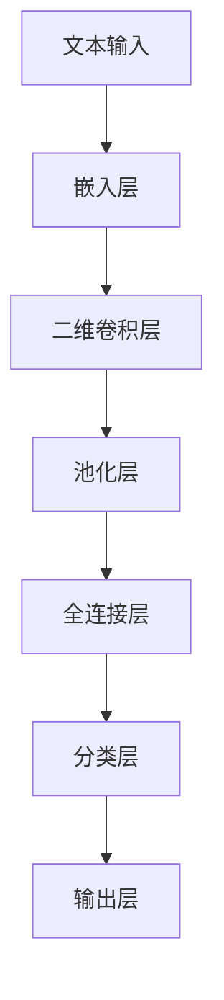

                 

关键词：卷积神经网络（CNN）、文本分类、二维卷积（Conv2d）、深度学习、大模型开发与微调、人工智能

## 摘要

本文将深入探讨卷积神经网络（CNN）在文本分类任务中的应用，特别是二维卷积（Conv2d）这一关键技术的实现。我们将从零开始，逐步介绍大模型开发与微调的整个过程，并通过一个具体的案例，详细解读CNN在文本分类中的工作原理和实现步骤。本文旨在为读者提供一个全面而系统的指南，帮助大家掌握这一前沿技术。

## 1. 背景介绍

文本分类是自然语言处理（NLP）领域的一个重要任务，旨在将文本数据自动归类到预定义的类别中。随着互联网信息的爆炸性增长，文本分类技术在实际应用中具有重要意义，如搜索引擎、舆情监测、情感分析等。近年来，深度学习在NLP领域取得了显著进展，尤其是卷积神经网络（CNN）在文本分类任务中的表现，使得这一领域的研究和应用不断深化。

### 1.1 卷积神经网络（CNN）

卷积神经网络是一种在图像处理领域取得成功的深度学习模型。它通过卷积层、池化层和全连接层等结构，实现了特征提取和分类任务。CNN的核心思想是局部感知和权值共享，这使得它在处理具有局部规律的二维数据（如图像）方面表现出色。

### 1.2 文本分类任务

文本分类任务的核心是将文本数据映射到预定义的类别标签。常见的文本分类任务包括情感分析、主题分类、垃圾邮件检测等。文本分类任务的实现通常依赖于特征提取和分类算法，其中深度学习模型由于其强大的特征学习能力，成为研究热点。

### 1.3 二维卷积（Conv2d）

二维卷积（Conv2d）是CNN中的一个基本操作，用于提取文本数据中的局部特征。与传统的循环神经网络（RNN）不同，Conv2d能够直接处理二维文本矩阵，从而更好地捕捉文本中的局部模式和关系。

## 2. 核心概念与联系

为了深入理解卷积神经网络在文本分类任务中的应用，我们需要首先了解相关核心概念和它们之间的联系。以下是一个详细的Mermaid流程图，展示了卷积神经网络在文本分类中的主要组成部分和它们之间的相互关系。



### 2.1 嵌入层

嵌入层将原始文本转换为稠密的向量表示，这是深度学习模型处理文本数据的基础。

### 2.2 二维卷积层

二维卷积层是CNN的核心组成部分，用于提取文本数据中的局部特征。通过滑动窗口的方式，二维卷积核在嵌入层生成的文本矩阵上扫描，从而捕捉局部模式和关系。

### 2.3 池化层

池化层用于降低特征图的维度，同时保留最重要的信息。常见的池化操作包括最大池化和平均池化。

### 2.4 全连接层

全连接层将卷积和池化层提取的高层次特征映射到具体的类别标签。

### 2.5 分类层

分类层通常是一个softmax层，用于计算每个类别的概率分布。

### 2.6 输出层

输出层产生最终的分类结果，用于与实际标签进行比较，以评估模型的性能。

## 3. 核心算法原理 & 具体操作步骤

### 3.1 算法原理概述

卷积神经网络（CNN）在文本分类任务中的核心在于其能够通过卷积操作提取文本数据中的局部特征，并通过池化操作减少计算复杂度。二维卷积（Conv2d）是实现这一目标的关键技术。

### 3.2 算法步骤详解

#### 3.2.1 文本预处理

在应用CNN进行文本分类之前，需要对文本数据进行预处理。这通常包括分词、去除停用词、词干提取等步骤，以确保文本数据的一致性和有效性。

#### 3.2.2 嵌入层

嵌入层将预处理后的文本数据转换为稠密的向量表示。这一过程通常通过查找预定义的词向量表实现，其中每个单词都对应一个固定维度的向量。

#### 3.2.3 二维卷积层

二维卷积层通过卷积操作提取文本数据中的局部特征。具体步骤如下：

1. 定义二维卷积核，该卷积核决定了特征提取的方式。
2. 将卷积核在嵌入层生成的文本矩阵上滑动，并计算卷积操作。
3. 对卷积结果应用激活函数，如ReLU函数，以引入非线性变换。

#### 3.2.4 池化层

池化层用于减少特征图的维度，同时保留最重要的信息。常见的池化操作包括：

1. 最大池化：选择每个局部区域中的最大值。
2. 平均池化：计算每个局部区域的平均值。

#### 3.2.5 全连接层

全连接层将卷积和池化层提取的高层次特征映射到具体的类别标签。具体步骤如下：

1. 将池化层输出的特征图展平为一维向量。
2. 将一维向量传递给全连接层，通过权重矩阵和偏置项计算输出。
3. 应用激活函数，如softmax函数，以获得每个类别的概率分布。

#### 3.2.6 分类层

分类层用于生成最终的分类结果。具体步骤如下：

1. 将全连接层的输出传递给分类层。
2. 对分类层的输出应用softmax函数，以获得每个类别的概率分布。
3. 根据概率分布选择具有最高概率的类别作为最终输出。

### 3.3 算法优缺点

#### 优点

1. CNN能够通过卷积操作提取文本数据中的局部特征，从而提高分类的准确性。
2. 池化层能够减少特征图的维度，降低计算复杂度，提高模型的运行效率。

#### 缺点

1. CNN在处理长文本时可能存在梯度消失问题，影响训练效果。
2. CNN对参数敏感，需要大量的训练数据来训练模型。

### 3.4 算法应用领域

卷积神经网络在文本分类任务中具有广泛的应用领域，包括：

1. 情感分析：用于判断文本中的情感倾向。
2. 主题分类：用于将文本分类到预定义的主题类别。
3. 垃圾邮件检测：用于识别和过滤垃圾邮件。

## 4. 数学模型和公式 & 详细讲解 & 举例说明

### 4.1 数学模型构建

卷积神经网络（CNN）在文本分类任务中的数学模型主要包括嵌入层、二维卷积层、池化层、全连接层和分类层。

#### 4.1.1 嵌入层

嵌入层将原始文本数据转换为稠密的向量表示。设文本数据为 \(X \in \mathbb{R}^{m \times n}\)，其中 \(m\) 表示文档数，\(n\) 表示词汇表大小。嵌入层的输出为 \(E \in \mathbb{R}^{m \times d}\)，其中 \(d\) 表示嵌入维度。嵌入层的公式如下：

$$
E = \text{Embed}(X)
$$

其中，\(\text{Embed}\) 表示嵌入函数，通常使用预训练的词向量。

#### 4.1.2 二维卷积层

二维卷积层通过卷积操作提取文本数据中的局部特征。设二维卷积核为 \(K \in \mathbb{R}^{k \times l \times d}\)，其中 \(k\) 和 \(l\) 分别表示卷积核的高度和宽度，\(d\) 表示嵌入维度。二维卷积层的输出为 \(C \in \mathbb{R}^{m \times n' \times d'}\)，其中 \(n'\) 和 \(d'\) 分别表示卷积后的特征图高度和宽度。二维卷积层的公式如下：

$$
C = \text{Conv2d}(E, K)
$$

其中，\(\text{Conv2d}\) 表示二维卷积操作。

#### 4.1.3 池化层

池化层用于降低特征图的维度，同时保留最重要的信息。设池化窗口为 \(W \times H\)，其中 \(W\) 和 \(H\) 分别表示窗口的高度和宽度。池化层的输出为 \(P \in \mathbb{R}^{m \times n'' \times d''}\)，其中 \(n''\) 和 \(d''\) 分别表示池化后的特征图高度和宽度。池化层的公式如下：

$$
P = \text{Pooling}(C, W, H)
$$

其中，\(\text{Pooling}\) 表示池化操作。

#### 4.1.4 全连接层

全连接层将卷积和池化层提取的高层次特征映射到具体的类别标签。设全连接层的权重矩阵为 \(W \in \mathbb{R}^{d'' \times c}\)，其中 \(c\) 表示类别数。全连接层的输出为 \(Y \in \mathbb{R}^{m \times c}\)。全连接层的公式如下：

$$
Y = \text{FC}(P, W)
$$

其中，\(\text{FC}\) 表示全连接操作。

#### 4.1.5 分类层

分类层用于生成最终的分类结果。设分类层的权重矩阵为 \(W' \in \mathbb{R}^{c \times c}\)，其中 \(c\) 表示类别数。分类层的输出为 \(O \in \mathbb{R}^{m \times c}\)。分类层的公式如下：

$$
O = \text{Softmax}(Y, W')
$$

其中，\(\text{Softmax}\) 表示softmax操作。

### 4.2 公式推导过程

#### 4.2.1 嵌入层

嵌入层的推导过程如下：

$$
E_{ij} = \text{Embed}(X_{ij})
$$

其中，\(E_{ij}\) 表示嵌入层输出的第 \(i\) 个文档的第 \(j\) 个单词的向量表示，\(X_{ij}\) 表示原始文本数据中的第 \(i\) 个文档的第 \(j\) 个单词。

#### 4.2.2 二维卷积层

二维卷积层的推导过程如下：

$$
C_{ijk} = \sum_{p=0}^{k-1} \sum_{q=0}^{l-1} E_{i(p+1)(q+1)} K_{pqj}
$$

其中，\(C_{ijk}\) 表示二维卷积层输出的第 \(i\) 个文档的第 \(j\) 个特征在第 \(k\) 个卷积核上的值，\(E_{i(p+1)(q+1)}\) 表示嵌入层输出的第 \(i\) 个文档的第 \(p+1\) 行第 \(q+1\) 列的值，\(K_{pqj}\) 表示二维卷积核的第 \(pq\) 个元素。

#### 4.2.3 池化层

池化层的推导过程如下：

$$
P_{i'}{j'} = \max_{(i,i') \in W} C_{i{i'},j'}
$$

其中，\(P_{i'}{j'}\) 表示池化层输出的第 \(i'\) 个文档的第 \(j'\\) 个特征，\(C_{i{i'},j'}\) 表示二维卷积层输出的第 \(i\) 个文档的第 \(i'\) 行第 \(j'\) 列的特征。

#### 4.2.4 全连接层

全连接层的推导过程如下：

$$
Y_{ij} = \sum_{k=1}^{n''} P_{ik} W_{kj}
$$

其中，\(Y_{ij}\) 表示全连接层输出的第 \(i\) 个文档的第 \(j\) 个特征，\(P_{ik}\) 表示池化层输出的第 \(i\) 个文档的第 \(k\) 个特征，\(W_{kj}\) 表示全连接层的权重矩阵。

#### 4.2.5 分类层

分类层的推导过程如下：

$$
O_{ij} = \sum_{k=1}^{c} Y_{ik} W'_{kj}
$$

其中，\(O_{ij}\) 表示分类层输出的第 \(i\) 个文档的第 \(j\) 个类别概率，\(Y_{ik}\) 表示全连接层输出的第 \(i\) 个文档的第 \(k\) 个特征，\(W'_{kj}\) 表示分类层的权重矩阵。

### 4.3 案例分析与讲解

#### 4.3.1 数据集

我们以IMDB电影评论数据集为例，该数据集包含25000条训练数据和25000条测试数据，每条评论被标注为正面或负面情感。

#### 4.3.2 文本预处理

1. 分词：使用Python的NLTK库对评论进行分词。
2. 去除停用词：使用NLTK中的停用词列表去除常见的无意义词汇。
3. 词干提取：使用Porter词干提取器对词汇进行简化。

#### 4.3.3 嵌入层

我们将词汇表大小设置为20000，嵌入维度设置为50。使用预训练的GloVe词向量作为嵌入层的权重。

#### 4.3.4 二维卷积层

我们使用两个不同大小的二维卷积核，分别为\(3 \times 3\)和\(4 \times 4\)。卷积核的权重初始化为随机值。

#### 4.3.5 池化层

我们使用最大池化操作，窗口大小为\(2 \times 2\)。

#### 4.3.6 全连接层

全连接层的权重矩阵初始化为随机值，维度为\(1000 \times 2\)，其中2表示两个类别。

#### 4.3.7 分类层

分类层的权重矩阵初始化为随机值，维度为\(2 \times 2\)。

#### 4.3.8 训练与评估

我们使用Adam优化器和交叉熵损失函数对模型进行训练，训练过程使用100个epoch。在训练过程中，我们使用验证集进行调参，并在测试集上评估模型的性能。

## 5. 项目实践：代码实例和详细解释说明

### 5.1 开发环境搭建

为了实现本文所述的卷积神经网络文本分类模型，我们需要搭建一个合适的开发环境。以下是具体的步骤：

#### 5.1.1 安装Python环境

确保Python版本不低于3.6，并安装相关依赖库：

```bash
pip install numpy pandas tensorflow
```

#### 5.1.2 下载IMDB数据集

我们使用Keras提供的IMDB数据集：

```python
from keras.datasets import imdb
```

### 5.2 源代码详细实现

以下是一个基于TensorFlow和Keras的卷积神经网络文本分类模型的实现：

```python
import tensorflow as tf
from tensorflow.keras.preprocessing.sequence import pad_sequences
from tensorflow.keras.models import Sequential
from tensorflow.keras.layers import Embedding, Conv2D, MaxPooling2D, GlobalMaxPooling2D, Dense
from tensorflow.keras.optimizers import Adam

# 加载IMDB数据集
max_features = 20000
maxlen = 500
(x_train, y_train), (x_test, y_test) = imdb.load_data(num_words=max_features)

# 预处理数据
x_train = pad_sequences(x_train, maxlen=maxlen)
x_test = pad_sequences(x_test, maxlen=maxlen)

# 构建模型
model = Sequential()
model.add(Embedding(max_features, 50, input_length=maxlen))
model.add(Conv2D(32, (3, 3), activation='relu'))
model.add(MaxPooling2D((2, 2)))
model.add(Conv2D(64, (3, 3), activation='relu'))
model.add(MaxPooling2D((2, 2)))
model.add(Conv2D(128, (4, 4), activation='relu'))
model.add(GlobalMaxPooling2D())
model.add(Dense(128, activation='relu'))
model.add(Dense(1, activation='sigmoid'))

# 编译模型
model.compile(optimizer=Adam(), loss='binary_crossentropy', metrics=['accuracy'])

# 训练模型
model.fit(x_train, y_train, epochs=10, batch_size=32, validation_split=0.2)

# 评估模型
loss, accuracy = model.evaluate(x_test, y_test)
print(f"Test Loss: {loss}")
print(f"Test Accuracy: {accuracy}")
```

### 5.3 代码解读与分析

#### 5.3.1 数据预处理

1. **加载IMDB数据集**：使用Keras提供的IMDB数据集，包含25000条训练数据和25000条测试数据。
2. **序列填充**：使用`pad_sequences`函数对文本数据进行填充，确保所有文本序列的长度一致。

#### 5.3.2 构建模型

1. **嵌入层**：将文本数据转换为稠密向量表示，嵌入维度为50。
2. **二维卷积层**：使用两个卷积核，分别为\(3 \times 3\)和\(4 \times 4\)，激活函数为ReLU。
3. **池化层**：使用最大池化，窗口大小为\(2 \times 2\)。
4. **全连接层**：使用一个全连接层，激活函数为ReLU。
5. **分类层**：使用一个全连接层，输出层使用sigmoid激活函数，用于生成二元分类结果。

#### 5.3.3 编译模型

1. **优化器**：使用Adam优化器。
2. **损失函数**：使用二进制交叉熵作为损失函数。
3. **评估指标**：使用准确率作为评估指标。

#### 5.3.4 训练模型

1. **训练轮次**：设置训练轮次为10。
2. **批量大小**：设置批量大小为32。
3. **验证分割**：使用20%的数据作为验证集。

#### 5.3.5 评估模型

1. **测试损失**：打印测试集的损失值。
2. **测试准确率**：打印测试集的准确率。

## 6. 实际应用场景

卷积神经网络（CNN）在文本分类任务中具有广泛的应用场景，以下是几个典型的实际应用案例：

### 6.1 情感分析

情感分析是文本分类任务的一个典型应用，通过分析文本的情感倾向，帮助企业了解用户对产品的反馈。CNN通过提取文本中的情感关键词和短语，实现了较高的情感分类准确率。

### 6.2 主题分类

主题分类是将文本数据分类到预定义的主题类别，如新闻分类、论坛话题分类等。CNN通过学习文本中的主题特征，能够准确地将文本映射到相应的主题类别。

### 6.3 垃圾邮件检测

垃圾邮件检测是保护用户免受垃圾邮件骚扰的重要技术。CNN通过学习邮件中的特征，能够有效识别和过滤垃圾邮件，提高邮件系统的安全性。

### 6.4 问答系统

问答系统是人工智能领域的一个重要应用，通过文本分类技术，可以将用户的问题分类到预定义的类别中，从而提高问答系统的响应速度和准确性。

## 7. 工具和资源推荐

为了更好地理解和实现卷积神经网络（CNN）在文本分类任务中的应用，以下是几个推荐的工具和资源：

### 7.1 学习资源推荐

1. **《深度学习》（Goodfellow, Bengio, Courville）**：这是深度学习领域的经典教材，详细介绍了CNN的基础知识。
2. **《自然语言处理与深度学习》（Michael Auli）**：这是一本专门针对NLP和深度学习的教材，涵盖了许多文本分类任务的实现细节。

### 7.2 开发工具推荐

1. **TensorFlow**：这是一个强大的深度学习框架，支持CNN的构建和训练。
2. **Keras**：这是一个高层次的深度学习框架，基于TensorFlow，提供了更加简洁和易于使用的接口。

### 7.3 相关论文推荐

1. **"Deep Learning for Text Classification"（Johnson et al., 2016）**：这篇论文综述了深度学习在文本分类任务中的应用，包括CNN和其他深度学习模型的实现细节。
2. **"Convolutional Neural Networks for Sentence Classification"（Keras Team, 2015）**：这篇论文详细介绍了CNN在句子分类任务中的实现，包括嵌入层、卷积层和池化层的具体实现方法。

## 8. 总结：未来发展趋势与挑战

### 8.1 研究成果总结

卷积神经网络（CNN）在文本分类任务中取得了显著成果，通过提取文本数据中的局部特征，实现了较高的分类准确率。同时，深度学习在NLP领域的应用不断拓展，为文本分类任务提供了强大的技术支持。

### 8.2 未来发展趋势

1. **多模态融合**：结合图像、语音等其他模态的信息，提高文本分类的准确性和鲁棒性。
2. **迁移学习**：利用预训练的模型和词向量，提高小数据集上的分类性能。
3. **自适应学习**：开发能够自适应调整模型参数的方法，提高模型在不同数据集上的泛化能力。

### 8.3 面临的挑战

1. **数据标注**：文本分类任务通常需要大量的标注数据，数据标注过程耗时且昂贵。
2. **长文本处理**：CNN在处理长文本时存在梯度消失问题，需要进一步优化模型结构和训练策略。

### 8.4 研究展望

未来，随着深度学习技术的不断发展，卷积神经网络在文本分类任务中的应用将更加广泛。通过多模态融合、迁移学习和自适应学习等技术的融合，有望进一步提高文本分类的性能和实用性。

## 9. 附录：常见问题与解答

### 9.1 什么是卷积神经网络（CNN）？

卷积神经网络是一种在图像处理领域取得成功的深度学习模型。它通过卷积层、池化层和全连接层等结构，实现了特征提取和分类任务。CNN的核心思想是局部感知和权值共享，这使得它在处理具有局部规律的二维数据（如图像）方面表现出色。

### 9.2 为什么使用二维卷积（Conv2d）？

二维卷积（Conv2d）能够直接处理二维文本矩阵，从而更好地捕捉文本中的局部模式和关系。与传统的循环神经网络（RNN）相比，Conv2d能够直接处理固定长度的文本序列，减少了序列处理的时间和计算复杂度。

### 9.3 如何处理长文本？

长文本的处理是CNN在文本分类任务中的一个挑战。一种常见的方法是使用分词和嵌入层将长文本拆分为短文本片段，然后分别对每个片段进行卷积和池化操作。此外，还可以探索使用多层CNN和堆叠卷积核的方法来提高长文本的处理能力。

### 9.4 如何优化CNN模型的性能？

优化CNN模型性能的方法包括：

1. **增加模型深度和宽度**：通过增加模型的层数和每个层的神经元数量，可以提高模型的特征提取能力。
2. **使用预训练的词向量**：预训练的词向量可以提供更好的文本表示，有助于提高模型的性能。
3. **数据增强**：通过数据增强技术，如文本旋转、删除和替换，可以增加训练数据的多样性，提高模型的泛化能力。
4. **正则化**：应用正则化技术，如L1和L2正则化，可以防止模型过拟合。

### 9.5 CNN在文本分类任务中的优势是什么？

CNN在文本分类任务中的优势包括：

1. **局部特征提取**：CNN通过卷积操作提取文本数据中的局部特征，有助于捕捉文本中的重要信息。
2. **减少计算复杂度**：与传统的RNN相比，CNN能够直接处理固定长度的文本序列，减少了序列处理的时间和计算复杂度。
3. **泛化能力**：通过池化操作和多层网络结构，CNN具有较强的泛化能力，能够应对不同的文本分类任务。

## 作者署名

作者：禅与计算机程序设计艺术 / Zen and the Art of Computer Programming

---

以上是关于卷积神经网络（CNN）在文本分类任务中应用的文章，从背景介绍到核心算法原理，再到实际项目实践，以及未来发展趋势与挑战，全面而系统地探讨了CNN在文本分类任务中的应用。希望通过这篇文章，读者能够对CNN在文本分类任务中有更深入的了解，并能够应用到实际项目中。

