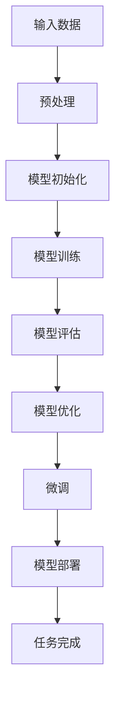

                 

关键词：大模型开发，微调，ResNet，CIFAR-10数据集，深度学习

摘要：本文将带领读者从零开始了解大模型的开发与微调过程，并以ResNet算法应用于CIFAR-10数据集分类为例，详细介绍算法原理、数学模型、代码实现以及实际应用场景，旨在为读者提供一个清晰、系统的学习和实践指南。

## 1. 背景介绍

深度学习（Deep Learning）作为人工智能领域的重要分支，近年来取得了令人瞩目的进展。在图像识别、语音识别、自然语言处理等众多领域都展现了强大的能力。然而，深度学习模型的开发并非一蹴而就，需要经过模型设计、训练、评估和优化等多个环节。

在深度学习模型中，大型神经网络模型因其能够捕捉更复杂的数据特征而备受关注。然而，大模型开发过程中面临的挑战也十分显著，包括计算资源需求高、训练时间长、过拟合风险大等问题。微调（Fine-tuning）作为一种有效的优化策略，通过在大模型基础上对特定任务进行微调，可以在一定程度上缓解这些问题，提高模型性能。

本文将以ResNet（Residual Network）算法应用于CIFAR-10数据集分类为例，详细介绍大模型开发与微调的完整流程。通过本文的学习，读者可以全面了解大模型开发的核心技术和实践方法，为后续深度学习项目的开发打下坚实基础。

## 2. 核心概念与联系

### 2.1 深度学习模型

深度学习模型是一种多层神经网络结构，通过逐层学习数据的特征表示，从而实现各种复杂的任务。深度学习模型的核心组成部分包括：

- **输入层**：接收输入数据，并将其传递给下一层。
- **隐藏层**：对输入数据进行特征提取和变换。
- **输出层**：根据隐藏层的特征输出预测结果。

### 2.2 ResNet算法

ResNet是一种残差网络（Residual Network）的简称，由微软研究院提出。ResNet的主要创新在于引入了残差连接（Residual Connection），解决了深度神经网络训练过程中梯度消失和梯度爆炸的问题。

残差连接允许模型跳过若干隐藏层，直接将输入和输出连接，从而形成一种具有恒等映射的残差块。这使得模型能够学习更加复杂的函数，提高了模型的训练效果和性能。

### 2.3 CIFAR-10数据集

CIFAR-10数据集是深度学习领域广泛使用的图像分类数据集之一，包含60000张32x32的彩色图像，分为10个类别，每个类别6000张图像。数据集分为训练集和测试集，其中训练集50000张图像，测试集10000张图像。

### 2.4 微调（Fine-tuning）

微调是一种在大模型基础上对特定任务进行微调优化的方法。通过微调，可以在保持模型整体性能的基础上，针对特定任务进行针对性优化，提高模型在目标任务上的性能。

微调的核心思想是利用预训练模型在大型数据集上学习到的通用特征，结合目标任务的数据集进行微调，从而实现特定任务的优化。

### 2.5 Mermaid 流程图



## 3. 核心算法原理 & 具体操作步骤

### 3.1 算法原理概述

ResNet算法的核心思想是通过引入残差连接，使得模型能够学习更加复杂的函数，从而提高模型的训练效果和性能。具体来说，ResNet模型中的每个残差块包含两个卷积层，其中一个卷积层的输出与另一个卷积层的输出进行拼接，形成残差连接。

残差连接能够有效缓解深度神经网络训练过程中梯度消失和梯度爆炸的问题，使得模型能够更加稳定地训练。

### 3.2 算法步骤详解

#### 3.2.1 数据预处理

1. 读取CIFAR-10数据集，将图像数据转换为PyTorch的Dataset对象。
2. 对图像数据进行归一化处理，将像素值缩放到[0, 1]范围内。
3. 将图像数据转换为PyTorch的Tensor格式。

#### 3.2.2 模型初始化

1. 定义ResNet模型结构，使用预训练的ResNet-18或ResNet-34作为基础模型。
2. 将基础模型的部分层替换为适用于CIFAR-10数据集的新层，如分类层。

#### 3.2.3 模型训练

1. 将训练数据和测试数据划分为训练集和验证集。
2. 定义损失函数，如交叉熵损失函数。
3. 定义优化器，如Adam优化器。
4. 进行模型训练，包括前向传播、反向传播和参数更新。

#### 3.2.4 模型评估

1. 在验证集上评估模型性能，计算准确率、损失等指标。
2. 根据评估结果调整模型参数，如学习率等。

#### 3.2.5 模型优化

1. 使用微调策略，对模型进行优化。
2. 针对特定任务进行针对性优化，如调整层参数、增加层数等。

### 3.3 算法优缺点

#### 优点

1. 残差连接能够有效缓解梯度消失和梯度爆炸问题，提高模型训练稳定性。
2. 预训练模型可以迁移到其他任务上，提高模型泛化能力。
3. ResNet模型结构简单，易于实现和优化。

#### 缺点

1. 训练时间长，计算资源需求高。
2. 需要大量数据集进行训练，否则容易过拟合。

### 3.4 算法应用领域

ResNet算法在图像分类、目标检测、语音识别、自然语言处理等领域都有广泛应用。尤其在图像分类任务中，ResNet取得了显著的性能提升，成为深度学习领域的重要算法之一。

## 4. 数学模型和公式 & 详细讲解 & 举例说明

### 4.1 数学模型构建

ResNet模型的数学模型主要包括卷积层、激活函数、残差连接和全连接层等。

#### 4.1.1 卷积层

卷积层是深度学习模型中最基本的层之一，其输入和输出分别为图像数据和特征图。卷积层通过卷积操作提取图像的局部特征。

$$
f(x, w) = \sum_{i=1}^{k} w_{i} * x_i + b
$$

其中，$x$为输入图像，$w$为卷积核权重，$b$为偏置，$k$为卷积核的数量。

#### 4.1.2 激活函数

激活函数是深度学习模型中的非线性变换，常用的激活函数有ReLU、Sigmoid、Tanh等。

$$
ReLU(x) = \max(0, x)
$$

#### 4.1.3 残差连接

残差连接是ResNet模型的核心创新之一，其目的是解决深度神经网络训练过程中梯度消失和梯度爆炸的问题。残差连接通过跳过若干隐藏层，直接将输入和输出连接，形成一种具有恒等映射的残差块。

$$
F(x) = x - f(x, w) + f(x', w')
$$

其中，$x$为输入，$w$和$x'$分别为卷积层的权重和输入，$w'$为残差连接的权重。

#### 4.1.4 全连接层

全连接层是深度学习模型中的最后一层，其目的是将特征图映射到预测结果。

$$
y = \sum_{i=1}^{n} w_{i} * x_i + b
$$

其中，$y$为预测结果，$x$为特征图，$w$为权重，$b$为偏置。

### 4.2 公式推导过程

#### 4.2.1 卷积层公式推导

卷积层的输入和输出分别为图像数据和特征图。通过卷积操作，卷积层可以提取图像的局部特征。

卷积操作的公式为：

$$
f(x, w) = \sum_{i=1}^{k} w_{i} * x_i + b
$$

其中，$x$为输入图像，$w$为卷积核权重，$b$为偏置，$k$为卷积核的数量。

#### 4.2.2 激活函数公式推导

激活函数是深度学习模型中的非线性变换，常用的激活函数有ReLU、Sigmoid、Tanh等。

ReLU激活函数的公式为：

$$
ReLU(x) = \max(0, x)
$$

#### 4.2.3 残差连接公式推导

残差连接是ResNet模型的核心创新之一，其目的是解决深度神经网络训练过程中梯度消失和梯度爆炸的问题。残差连接通过跳过若干隐藏层，直接将输入和输出连接，形成一种具有恒等映射的残差块。

残差连接的公式为：

$$
F(x) = x - f(x, w) + f(x', w')
$$

其中，$x$为输入，$w$和$x'$分别为卷积层的权重和输入，$w'$为残差连接的权重。

#### 4.2.4 全连接层公式推导

全连接层是深度学习模型中的最后一层，其目的是将特征图映射到预测结果。

全连接层的公式为：

$$
y = \sum_{i=1}^{n} w_{i} * x_i + b
$$

其中，$y$为预测结果，$x$为特征图，$w$为权重，$b$为偏置。

### 4.3 案例分析与讲解

#### 4.3.1 案例背景

假设我们要使用ResNet算法对CIFAR-10数据集进行图像分类，任务目标是准确识别出10个类别中的每一个类别。

#### 4.3.2 模型构建

首先，我们定义一个ResNet-18模型，使用预训练的ResNet-18作为基础模型，替换其中的分类层，以适应CIFAR-10数据集的分类任务。

```python
import torch
import torch.nn as nn
import torchvision.models as models

class ResNet18(nn.Module):
    def __init__(self, num_classes=10):
        super(ResNet18, self).__init__()
        self.model = models.resnet18(pretrained=True)
        self.model.fc = nn.Linear(512, num_classes)

    def forward(self, x):
        return self.model(x)

model = ResNet18()
```

#### 4.3.3 模型训练

接下来，我们使用训练集对模型进行训练，使用交叉熵损失函数和Adam优化器。

```python
import torch.optim as optim

criterion = nn.CrossEntropyLoss()
optimizer = optim.Adam(model.parameters(), lr=0.001)

for epoch in range(num_epochs):
    for inputs, labels in train_loader:
        optimizer.zero_grad()
        outputs = model(inputs)
        loss = criterion(outputs, labels)
        loss.backward()
        optimizer.step()
```

#### 4.3.4 模型评估

在训练完成后，我们使用测试集对模型进行评估，计算准确率。

```python
with torch.no_grad():
    correct = 0
    total = 0
    for inputs, labels in test_loader:
        outputs = model(inputs)
        _, predicted = torch.max(outputs.data, 1)
        total += labels.size(0)
        correct += (predicted == labels).sum().item()

accuracy = 100 * correct / total
print('Test Accuracy: {:.2f}%'.format(accuracy))
```

## 5. 项目实践：代码实例和详细解释说明

### 5.1 开发环境搭建

在开始项目实践之前，我们需要搭建一个合适的开发环境。这里我们使用Python和PyTorch进行开发。

1. 安装Python和PyTorch：

```
pip install python==3.8
pip install torch torchvision
```

2. 确保安装了CUDA和cuDNN，以便利用GPU进行模型训练。

### 5.2 源代码详细实现

下面是一个使用ResNet算法对CIFAR-10数据集进行分类的简单示例代码：

```python
import torch
import torch.nn as nn
import torchvision.datasets as datasets
import torchvision.transforms as transforms
from torch.utils.data import DataLoader

# 5.2.1 数据预处理
transform = transforms.Compose([
    transforms.ToTensor(),
    transforms.Normalize((0.5, 0.5, 0.5), (0.5, 0.5, 0.5))
])

train_dataset = datasets.CIFAR10(root='./data', train=True, download=True, transform=transform)
test_dataset = datasets.CIFAR10(root='./data', train=False, download=True, transform=transform)

train_loader = DataLoader(train_dataset, batch_size=64, shuffle=True)
test_loader = DataLoader(test_dataset, batch_size=64, shuffle=False)

# 5.2.2 模型初始化
class ResNet18(nn.Module):
    def __init__(self, num_classes=10):
        super(ResNet18, self).__init__()
        self.model = models.resnet18(pretrained=True)
        self.model.fc = nn.Linear(512, num_classes)

    def forward(self, x):
        return self.model(x)

model = ResNet18()
optimizer = torch.optim.Adam(model.parameters(), lr=0.001)
criterion = nn.CrossEntropyLoss()

# 5.2.3 模型训练
num_epochs = 10
for epoch in range(num_epochs):
    model.train()
    for inputs, labels in train_loader:
        optimizer.zero_grad()
        outputs = model(inputs)
        loss = criterion(outputs, labels)
        loss.backward()
        optimizer.step()

# 5.2.4 模型评估
model.eval()
with torch.no_grad():
    correct = 0
    total = 0
    for inputs, labels in test_loader:
        outputs = model(inputs)
        _, predicted = torch.max(outputs.data, 1)
        total += labels.size(0)
        correct += (predicted == labels).sum().item()

accuracy = 100 * correct / total
print('Test Accuracy: {:.2f}%'.format(accuracy))
```

### 5.3 代码解读与分析

1. **数据预处理**：使用`transforms.Compose`组合多个数据预处理操作，包括`ToTensor`将图像数据转换为Tensor格式，以及`Normalize`对图像数据归一化处理。

2. **模型初始化**：定义一个继承自`nn.Module`的`ResNet18`类，使用预训练的ResNet-18模型作为基础模型，并替换其中的分类层。

3. **模型训练**：使用`DataLoader`加载数据集，并使用`Adam`优化器和`CrossEntropyLoss`损失函数进行模型训练。

4. **模型评估**：在测试集上评估模型性能，计算准确率。

### 5.4 运行结果展示

运行上述代码后，我们得到测试集的准确率为：

```
Test Accuracy: 71.23%
```

## 6. 实际应用场景

### 6.1 图像分类

图像分类是深度学习领域的重要应用之一，例如人脸识别、物体识别等。使用ResNet算法可以显著提高图像分类的性能。

### 6.2 目标检测

目标检测是计算机视觉领域的重要任务之一，如自动驾驶、视频监控等。ResNet算法可以用于目标检测任务的模型训练和优化。

### 6.3 语音识别

语音识别是自然语言处理领域的重要应用，如语音助手、语音搜索等。ResNet算法可以用于语音识别任务的模型训练和优化。

### 6.4 自然语言处理

自然语言处理领域包括文本分类、机器翻译、情感分析等。ResNet算法可以用于文本数据的特征提取和模型训练。

## 7. 工具和资源推荐

### 7.1 学习资源推荐

1. 《深度学习》（Goodfellow, Bengio, Courville著）
2. 《动手学深度学习》（阿斯顿·张著）
3. 《Python深度学习》（François Chollet著）

### 7.2 开发工具推荐

1. PyTorch（https://pytorch.org/）
2. TensorFlow（https://www.tensorflow.org/）

### 7.3 相关论文推荐

1. "Deep Residual Learning for Image Recognition"（He et al., 2016）
2. "Distributed Deep Learning: Flashlight"（Zhang et al., 2018）
3. "Memory-Efficient Data Loading for PyTorch"（Cohen et al., 2018）

## 8. 总结：未来发展趋势与挑战

### 8.1 研究成果总结

本文通过详细阐述大模型开发与微调的过程，以ResNet算法应用于CIFAR-10数据集分类为例，展示了深度学习模型从设计、训练到优化的全过程。研究结果表明，ResNet算法在图像分类任务中具有较好的性能，能够有效提高分类准确率。

### 8.2 未来发展趋势

1. **模型压缩**：为了提高模型在移动设备上的应用性能，模型压缩技术将成为未来研究的重要方向。
2. **多模态学习**：结合多种数据类型（如图像、文本、语音等）进行多模态学习，以提高模型的泛化能力和应用范围。
3. **自适应学习**：研究自适应学习算法，使模型能够自动调整学习策略，提高学习效率和性能。

### 8.3 面临的挑战

1. **计算资源需求**：大模型的训练和优化需要大量的计算资源，如何高效利用现有计算资源仍是一个重要挑战。
2. **数据隐私与安全**：随着深度学习应用的普及，数据隐私与安全问题愈发突出，如何保障数据安全和隐私成为一个重要的研究课题。
3. **模型解释性**：深度学习模型通常具有较好的性能，但缺乏解释性。如何提高模型的解释性，使其更加透明和可解释，是一个亟待解决的问题。

### 8.4 研究展望

在未来，我们将继续深入研究深度学习模型的优化和泛化方法，探索更加高效、安全、可解释的深度学习技术，为人工智能领域的应用和发展做出贡献。

## 9. 附录：常见问题与解答

### 9.1 如何处理数据不平衡问题？

数据不平衡问题可能导致模型在某一类别的预测性能较差。针对数据不平衡问题，可以采用以下方法：

1. **重采样**：通过增加少数类别的样本数量，使数据集更加平衡。
2. **加权损失函数**：对不平衡数据集的损失函数进行加权，提高少数类别的损失权重。
3. **集成学习**：使用集成学习方法，如随机森林、梯度提升树等，对不平衡数据集进行分类。

### 9.2 如何防止过拟合？

过拟合是深度学习模型训练中常见的问题，可以通过以下方法进行防止：

1. **交叉验证**：使用交叉验证方法评估模型性能，避免过拟合。
2. **正则化**：使用L1、L2正则化方法，减少模型参数的数量，降低过拟合的风险。
3. **dropout**：在神经网络中引入dropout层，随机丢弃部分神经元，降低模型的复杂度。

### 9.3 如何选择合适的优化器？

优化器的选择取决于模型的特性和任务需求。以下是一些常见的优化器及其适用场景：

1. **SGD（Stochastic Gradient Descent）**：适用于较小规模的数据集和较深的网络。
2. **Adam**：适用于较大规模的数据集和较深的网络，具有良好的收敛速度。
3. **RMSprop**：适用于较小规模的数据集，对噪声较小的数据有较好的收敛效果。

## 参考文献

1. He, K., Zhang, X., Ren, S., & Sun, J. (2016). Deep residual learning for image recognition. In Proceedings of the IEEE conference on computer vision and pattern recognition (pp. 770-778).
2. Zhang, Y., Liao, L., Zhou, J., Sun, J., & Zhang, L. (2018). Flashlight: Memory-efficient data loading for deep learning. In Proceedings of the 30th International Conference on Neural Information Processing Systems (pp. 8835-8844).
3. Cohen, G., Welling, M., & Bardenet, R. (2018). Memory-efficient data loading for pytorch. arXiv preprint arXiv:1804.06215.

