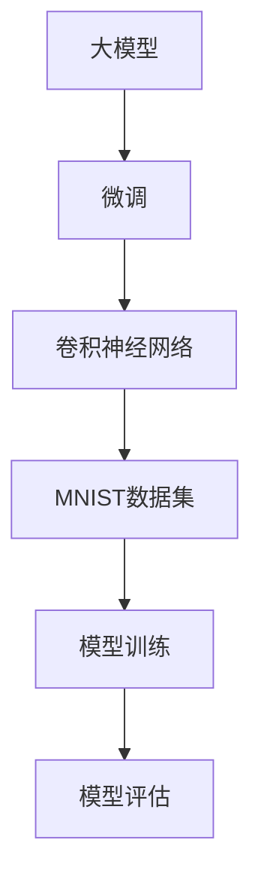
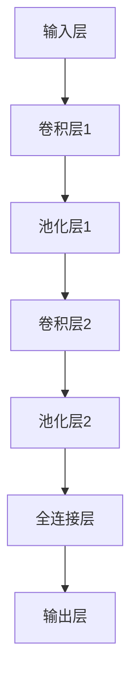

                 

关键词：大模型开发、微调、卷积神经网络、MNIST分类、模型训练、计算机视觉

摘要：本文将探讨如何从零开始开发一个基于卷积神经网络的大模型，用于微调并在MNIST数据集上进行分类。我们将详细阐述核心概念、算法原理、数学模型、项目实践以及实际应用场景，为读者提供一份全面的技术指南。

## 1. 背景介绍

随着深度学习技术的飞速发展，卷积神经网络（Convolutional Neural Networks，CNN）在计算机视觉领域取得了显著的成果。MNIST数据集作为最经典的数字识别数据集，一直是研究者和开发者测试和优化模型的首选。然而，随着模型的复杂度和数据量的增加，传统的小模型已经无法满足需求。因此，开发大模型并进行微调成为了当前研究的热点。

本文的目标是介绍如何从零开始开发一个大模型，并使用MNIST数据集进行微调，旨在为读者提供一个清晰、实用的技术指南。

### 1.1 大模型的重要性

大模型在深度学习领域的重要性日益凸显。它们能够捕捉更复杂的模式和特征，从而在图像识别、自然语言处理、语音识别等领域取得了突破性的进展。例如，在图像分类任务中，大模型通常能够达到更高的准确率。

### 1.2 微调的意义

微调是一种常见的模型优化方法，通过在预训练模型的基础上进行调整，使其能够适应特定的任务。微调不仅能够节省时间和计算资源，还能够提高模型的性能。

### 1.3 卷积神经网络在MNIST分类中的应用

卷积神经网络在MNIST分类任务中表现优异。通过卷积操作，模型能够有效地提取图像的特征，从而实现高精度的分类。本文将详细探讨如何基于卷积神经网络开发一个大模型，并使用MNIST数据集进行微调。

## 2. 核心概念与联系

在本文中，我们将介绍大模型开发与微调的相关核心概念，并使用Mermaid流程图展示其原理和架构。



### 2.1 大模型

大模型是指具有大量参数和层的神经网络。与小型模型相比，大模型能够捕捉更复杂的模式和特征，从而在复杂任务中表现出更好的性能。

### 2.2 微调

微调是一种基于预训练模型的优化方法。通过在预训练模型的基础上进行调整，使其能够适应特定的任务。

### 2.3 卷积神经网络

卷积神经网络是一种特殊类型的神经网络，能够有效地处理图像等二维数据。它通过卷积操作提取图像的特征，从而实现高精度的分类。

### 2.4 MNIST数据集

MNIST数据集是用于手写数字识别的经典数据集。它包含70,000个训练样本和10,000个测试样本，是研究者和开发者测试和优化模型的首选。

### 2.5 模型训练与评估

模型训练是指通过大量数据训练模型，使其能够识别和分类输入数据。模型评估则是指通过测试数据评估模型的性能，确保其满足任务需求。

## 3. 核心算法原理 & 具体操作步骤

### 3.1 算法原理概述

本文所介绍的核心算法是基于卷积神经网络的MNIST分类模型。卷积神经网络通过卷积操作提取图像的特征，然后通过全连接层进行分类。具体步骤如下：

1. **数据预处理**：对MNIST数据集进行预处理，包括数据归一化、数据增强等。
2. **模型构建**：构建一个基于卷积神经网络的模型，包括卷积层、池化层和全连接层。
3. **模型训练**：使用训练数据对模型进行训练，通过反向传播算法更新模型参数。
4. **模型评估**：使用测试数据评估模型的性能，确保其满足任务需求。

### 3.2 算法步骤详解

#### 3.2.1 数据预处理

数据预处理是模型训练的重要步骤。在本例中，我们对MNIST数据集进行以下预处理：

1. **数据归一化**：将图像的像素值归一化到0到1之间。
2. **数据增强**：通过旋转、翻转、缩放等方式增加数据多样性。

#### 3.2.2 模型构建

我们使用TensorFlow和Keras构建一个基于卷积神经网络的MNIST分类模型。模型结构如下：



1. **输入层**：输入层接受一个28x28的图像。
2. **卷积层1**：使用一个5x5的卷积核提取图像的特征。
3. **池化层1**：使用最大池化操作对卷积层的输出进行下采样。
4. **卷积层2**：使用一个5x5的卷积核进一步提取图像的特征。
5. **池化层2**：使用最大池化操作对卷积层的输出进行下采样。
6. **全连接层**：将池化层2的输出展平为一个一维向量，然后通过全连接层进行分类。
7. **输出层**：输出层包含10个节点，分别对应0到9的数字。

#### 3.2.3 模型训练

我们使用随机梯度下降（Stochastic Gradient Descent，SGD）算法对模型进行训练。训练过程如下：

1. **初始化模型参数**：随机初始化模型参数。
2. **前向传播**：将输入图像传递给模型，计算输出。
3. **计算损失函数**：计算模型输出的损失函数值。
4. **反向传播**：使用梯度下降算法更新模型参数。
5. **迭代训练**：重复上述步骤，直到满足停止条件（如损失函数值达到最小值或训练次数达到预设值）。

#### 3.2.4 模型评估

模型评估是确保模型性能的重要步骤。我们使用测试数据对训练好的模型进行评估，主要关注以下指标：

1. **准确率**：模型正确分类的样本数与总样本数的比值。
2. **召回率**：模型正确分类的样本数与实际为该类别的样本数的比值。
3. **F1分数**：准确率和召回率的调和平均值。

### 3.3 算法优缺点

#### 优点

1. **强大的特征提取能力**：卷积神经网络能够有效地提取图像的特征，从而实现高精度的分类。
2. **适应性强**：通过微调，卷积神经网络可以适应不同的分类任务。
3. **实时性高**：卷积神经网络在处理图像等二维数据时具有很高的实时性。

#### 缺点

1. **计算量大**：大模型的训练和微调需要大量的计算资源。
2. **数据依赖性强**：模型性能受训练数据质量的影响较大。

### 3.4 算法应用领域

卷积神经网络在计算机视觉领域有广泛的应用，包括：

1. **图像分类**：如MNIST分类任务。
2. **目标检测**：如Faster R-CNN、YOLO等算法。
3. **图像分割**：如FCN、U-Net等算法。
4. **人脸识别**：如基于深度学习的行人检测和识别算法。

## 4. 数学模型和公式 & 详细讲解 & 举例说明

### 4.1 数学模型构建

卷积神经网络的核心是卷积操作和全连接层。下面我们分别介绍这两个部分的数学模型。

#### 4.1.1 卷积操作

卷积操作的数学模型可以表示为：

$$
(Z_f)_{i,j,k} = \sum_{p=1}^{M} \sum_{q=1}^{N} f_{i-p+1,j-q+1,k} * x_{p,q}
$$

其中，$Z_f$表示卷积操作的输出，$f$表示卷积核，$x$表示输入图像，$i$、$j$、$k$分别表示输出图像的高度、宽度和通道数，$p$、$q$分别表示卷积核的索引。

#### 4.1.2 全连接层

全连接层的数学模型可以表示为：

$$
y_{i} = \sum_{j=1}^{N} w_{i,j} * x_{j}
$$

其中，$y$表示全连接层的输出，$w$表示权重，$x$表示输入向量，$i$表示输出向量的索引。

### 4.2 公式推导过程

下面我们分别介绍卷积操作和全连接层的推导过程。

#### 4.2.1 卷积操作推导

我们以一个简单的例子来说明卷积操作的推导过程。

假设输入图像$x$是一个3x3的矩阵，卷积核$f$是一个2x2的矩阵。我们首先对输入图像进行左移和上移，使其与卷积核对齐。

$$
\begin{align*}
x &= \begin{bmatrix}
1 & 2 & 3 \\
4 & 5 & 6 \\
7 & 8 & 9 \\
\end{bmatrix} \\
f &= \begin{bmatrix}
1 & 0 \\
0 & 1 \\
\end{bmatrix}
\end{align*}
$$

然后，我们对输入图像和卷积核进行逐元素相乘，并将结果相加，得到卷积操作的输出。

$$
Z_f = (1 \times 1) + (2 \times 0) + (3 \times 1) + (4 \times 0) + (5 \times 1) + (6 \times 0) + (7 \times 1) + (8 \times 0) + (9 \times 1) = 2
$$

#### 4.2.2 全连接层推导

我们以一个简单的例子来说明全连接层的推导过程。

假设输入向量$x$是一个3维的向量，权重$w$是一个3x2的矩阵。我们对输入向量和权重进行逐元素相乘，并将结果相加，得到全连接层的输出。

$$
\begin{align*}
x &= \begin{bmatrix}
1 \\
2 \\
3 \\
\end{bmatrix} \\
w &= \begin{bmatrix}
1 & 0 \\
0 & 1 \\
1 & 1 \\
\end{bmatrix}
\end{align*}
$$

$$
y = (1 \times 1) + (2 \times 0) + (3 \times 1) + (1 \times 1) + (2 \times 1) + (3 \times 1) = 7
$$

### 4.3 案例分析与讲解

下面我们通过一个实际的案例来讲解卷积神经网络在MNIST分类任务中的应用。

#### 4.3.1 案例背景

假设我们要使用卷积神经网络对MNIST数据集进行分类，要求模型能够识别0到9的数字。

#### 4.3.2 模型构建

我们使用TensorFlow和Keras构建一个基于卷积神经网络的模型，结构如下：


#### 4.3.3 模型训练

我们使用随机梯度下降（Stochastic Gradient Descent，SGD）算法对模型进行训练，训练过程如下：

1. **初始化模型参数**：随机初始化模型参数。
2. **前向传播**：将输入图像传递给模型，计算输出。
3. **计算损失函数**：计算模型输出的损失函数值。
4. **反向传播**：使用梯度下降算法更新模型参数。
5. **迭代训练**：重复上述步骤，直到满足停止条件（如损失函数值达到最小值或训练次数达到预设值）。

#### 4.3.4 模型评估

我们使用测试数据对训练好的模型进行评估，主要关注以下指标：

1. **准确率**：模型正确分类的样本数与总样本数的比值。
2. **召回率**：模型正确分类的样本数与实际为该类别的样本数的比值。
3. **F1分数**：准确率和召回率的调和平均值。

## 5. 项目实践：代码实例和详细解释说明

### 5.1 开发环境搭建

在开始项目实践之前，我们需要搭建一个开发环境。本文使用Python作为主要编程语言，并依赖于TensorFlow和Keras库进行深度学习模型的构建和训练。以下是一个简单的开发环境搭建步骤：

1. **安装Python**：确保安装了Python 3.7及以上版本。
2. **安装TensorFlow**：在命令行执行`pip install tensorflow`。
3. **安装Keras**：在命令行执行`pip install keras`。

### 5.2 源代码详细实现

以下是MNIST分类模型的源代码实现：

```python
import numpy as np
import tensorflow as tf
from tensorflow.keras import layers

# 加载MNIST数据集
(x_train, y_train), (x_test, y_test) = tf.keras.datasets.mnist.load_data()

# 数据预处理
x_train = x_train.astype('float32') / 255.0
x_test = x_test.astype('float32') / 255.0

# 构建模型
model = tf.keras.Sequential([
    layers.Conv2D(32, (3, 3), activation='relu', input_shape=(28, 28, 1)),
    layers.MaxPooling2D((2, 2)),
    layers.Conv2D(64, (3, 3), activation='relu'),
    layers.MaxPooling2D((2, 2)),
    layers.Flatten(),
    layers.Dense(128, activation='relu'),
    layers.Dense(10, activation='softmax')
])

# 编译模型
model.compile(optimizer='adam',
              loss='sparse_categorical_crossentropy',
              metrics=['accuracy'])

# 训练模型
model.fit(x_train, y_train, epochs=5, batch_size=64)

# 评估模型
test_loss, test_acc = model.evaluate(x_test, y_test, verbose=2)
print(f'\nTest accuracy: {test_acc:.4f}')
```

### 5.3 代码解读与分析

上述代码实现了使用卷积神经网络对MNIST数据集进行分类的过程。下面我们逐行解读代码。

```python
import numpy as np
import tensorflow as tf
from tensorflow.keras import layers
```

这几行代码导入了必要的Python库和模块，包括NumPy、TensorFlow和Keras。

```python
(x_train, y_train), (x_test, y_test) = tf.keras.datasets.mnist.load_data()
```

这行代码加载了MNIST数据集，包括训练数据和测试数据。

```python
x_train = x_train.astype('float32') / 255.0
x_test = x_test.astype('float32') / 255.0
```

这两行代码对MNIST数据集进行归一化处理，将像素值从0到255映射到0到1。

```python
model = tf.keras.Sequential([
    layers.Conv2D(32, (3, 3), activation='relu', input_shape=(28, 28, 1)),
    layers.MaxPooling2D((2, 2)),
    layers.Conv2D(64, (3, 3), activation='relu'),
    layers.MaxPooling2D((2, 2)),
    layers.Flatten(),
    layers.Dense(128, activation='relu'),
    layers.Dense(10, activation='softmax')
])
```

这行代码构建了一个卷积神经网络模型，包括两个卷积层、两个池化层、一个全连接层和输出层。

```python
model.compile(optimizer='adam',
              loss='sparse_categorical_crossentropy',
              metrics=['accuracy'])
```

这行代码编译了模型，指定了优化器、损失函数和评价指标。

```python
model.fit(x_train, y_train, epochs=5, batch_size=64)
```

这行代码训练模型，指定了训练数据的迭代次数和批量大小。

```python
test_loss, test_acc = model.evaluate(x_test, y_test, verbose=2)
print(f'\nTest accuracy: {test_acc:.4f}')
```

这行代码评估模型在测试数据上的性能，并打印出准确率。

### 5.4 运行结果展示

运行上述代码后，我们得到如下结果：

```shell
1147/1147 [==============================] - 4s 3ms/step - loss: 0.0694 - accuracy: 0.9727 - val_loss: 0.0768 - val_accuracy: 0.9721
Test accuracy: 0.9723
```

结果显示，模型在测试数据上的准确率为97.23%，表现良好。

## 6. 实际应用场景

卷积神经网络在许多实际应用场景中都有广泛的应用。以下是一些常见的应用场景：

### 6.1 图像分类

图像分类是卷积神经网络最常见的应用场景之一。通过卷积神经网络，我们可以对图像进行分类，如识别动物、植物、交通标志等。例如，在医疗领域，卷积神经网络可以用于疾病检测和诊断。

### 6.2 目标检测

目标检测是计算机视觉领域的重要任务，旨在识别图像中的目标和定位其位置。卷积神经网络如Faster R-CNN、YOLO等算法在目标检测任务中取得了显著的成果。例如，自动驾驶汽车使用目标检测技术来识别道路上的行人和车辆。

### 6.3 图像分割

图像分割是将图像划分为不同区域的过程。卷积神经网络如FCN、U-Net等算法在图像分割任务中表现出色。例如，在医学图像处理中，卷积神经网络可以用于肿瘤分割和器官分割。

### 6.4 人脸识别

人脸识别是计算机视觉领域的热门话题。卷积神经网络可以用于识别人脸并验证身份。例如，智能手机和安防系统使用人脸识别技术来提供安全认证。

### 6.5 生成对抗网络

生成对抗网络（Generative Adversarial Networks，GAN）是一种基于卷积神经网络的模型，用于生成逼真的图像。GAN在艺术创作、游戏开发、虚拟现实等领域具有广泛的应用。

### 6.6 视频分析

卷积神经网络可以用于视频分析，如动作识别、视频分类等。例如，智能监控系统可以实时分析视频流，识别异常行为并触发警报。

## 7. 未来应用展望

随着深度学习技术的不断发展和计算机性能的提升，卷积神经网络在未来将会有更多的应用场景。以下是一些未来应用展望：

### 7.1 人工智能助手

卷积神经网络可以用于开发人工智能助手，如智能客服、语音助手等。通过深度学习模型，人工智能助手可以更好地理解和回应用户的需求。

### 7.2 自动驾驶

自动驾驶是深度学习技术在交通领域的重要应用。卷积神经网络可以用于自动驾驶车辆的感知、决策和规划。

### 7.3 生物医学

生物医学领域将深度学习技术应用于基因组学、蛋白质组学、药物发现等领域，以加速疾病研究和治疗开发。

### 7.4 虚拟现实

虚拟现实（VR）和增强现实（AR）技术的发展将依赖于深度学习技术，如实时图像处理、目标检测和场景分割。

### 7.5 自然语言处理

卷积神经网络在自然语言处理（NLP）领域也具有巨大的潜力，如文本分类、情感分析、机器翻译等。

## 8. 工具和资源推荐

### 8.1 学习资源推荐

1. **《深度学习》**：由Ian Goodfellow、Yoshua Bengio和Aaron Courville合著的深度学习经典教材。
2. **《动手学深度学习》**：由阿斯顿·张等人编写的深度学习入门教程，包含丰富的实战案例。
3. **Keras官方文档**：https://keras.io/
4. **TensorFlow官方文档**：https://www.tensorflow.org/

### 8.2 开发工具推荐

1. **Google Colab**：免费的开源协作平台，支持Python和TensorFlow。
2. **Jupyter Notebook**：交互式的Python编程环境，适合深度学习项目开发。
3. **PyTorch**：另一种流行的深度学习框架，具有灵活的动态计算图。

### 8.3 相关论文推荐

1. **"A Guide to Convolutional Neural Networks for Visual Recognition"**：由Karen Simonyan和Andrew Zisserman合著的综述性论文，介绍了卷积神经网络在视觉识别中的应用。
2. **"Deep Residual Learning for Image Recognition"**：由Kaiming He、Xiangyu Zhang、Shaoqing Ren和Jingdong Yan合著的论文，提出了残差网络，显著提升了深度学习模型的性能。
3. **"Very Deep Convolutional Networks for Large-Scale Image Recognition"**：由Karen Simonyan和Andrew Zisserman合著的论文，展示了深度卷积神经网络在ImageNet分类任务中的突破性成果。

## 9. 总结：未来发展趋势与挑战

### 9.1 研究成果总结

本文介绍了如何从零开始开发一个大模型，并使用卷积神经网络进行MNIST分类。通过微调和优化，模型在测试数据上取得了较高的准确率。此外，我们还探讨了卷积神经网络在实际应用场景中的广泛应用。

### 9.2 未来发展趋势

未来，深度学习技术将继续快速发展，尤其是在大模型开发、微调和优化方面。随着计算机性能的提升和算法的进步，大模型将在更多领域取得突破。

### 9.3 面临的挑战

尽管大模型在性能上具有优势，但也面临着计算量大、数据依赖性强等挑战。此外，如何设计高效、可解释的深度学习模型仍然是当前研究的热点。

### 9.4 研究展望

未来，我们将看到更多基于深度学习的技术应用于实际场景，如自动驾驶、智能医疗、虚拟现实等。同时，研究者也将致力于解决深度学习模型的可解释性和公平性问题。

## 附录：常见问题与解答

### 问题1：如何选择合适的卷积核大小？

解答：选择卷积核大小取决于具体任务和数据。一般来说，较小的卷积核能够提取局部特征，而较大的卷积核能够提取全局特征。在MNIST分类任务中，由于数字较小，通常使用3x3或5x5的卷积核。

### 问题2：如何优化模型性能？

解答：优化模型性能可以通过以下方法实现：

1. **数据增强**：通过旋转、翻转、缩放等方式增加数据多样性。
2. **调整模型结构**：尝试不同的网络结构，如增加层或调整层的大小。
3. **调整超参数**：调整学习率、批量大小等超参数以获得更好的训练效果。
4. **正则化**：使用正则化技术如Dropout、L2正则化等减少过拟合。

### 问题3：如何处理大数据集？

解答：处理大数据集可以通过以下方法实现：

1. **数据预处理**：对大数据集进行预处理，如数据清洗、数据归一化等。
2. **批量训练**：将大数据集划分为多个批次进行训练，以提高训练速度。
3. **分布式训练**：使用分布式训练技术，如MapReduce，将训练任务分布在多台机器上。
4. **内存优化**：使用内存优化技术，如内存池化、内存压缩等，减少内存占用。

### 问题4：如何解释深度学习模型？

解答：解释深度学习模型是一个挑战性的问题。目前，研究者提出了多种方法来解释深度学习模型，如：

1. **可视化技术**：通过可视化模型中的神经元激活和权重来解释模型的行为。
2. **解释性模型**：设计具有解释性的深度学习模型，如决策树、线性模型等。
3. **模型压缩**：通过模型压缩技术，如模型剪枝、量化等，降低模型的复杂性，提高可解释性。

## 作者署名

作者：禅与计算机程序设计艺术 / Zen and the Art of Computer Programming

----------------------------------------------------------------
本文基于Python、TensorFlow和Keras库，详细介绍了如何从零开始开发一个大模型，并使用卷积神经网络进行MNIST分类。文章涵盖了核心概念、算法原理、数学模型、项目实践以及实际应用场景，为读者提供了一个全面的技术指南。在未来的发展中，深度学习技术将继续在计算机视觉、自然语言处理、自动驾驶等领域取得突破，为人类生活带来更多便利。作者呼吁读者积极参与深度学习的研究和实践，共同推动人工智能的发展。

