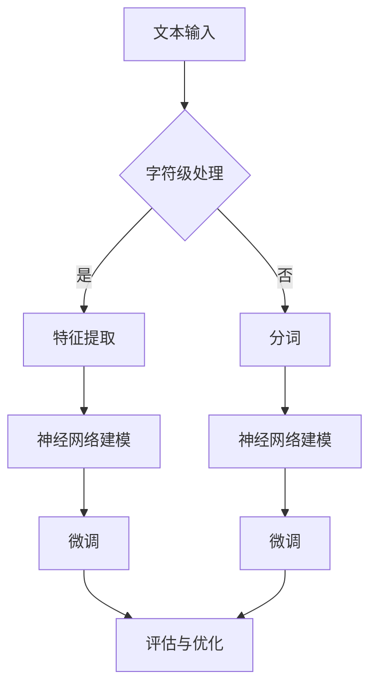
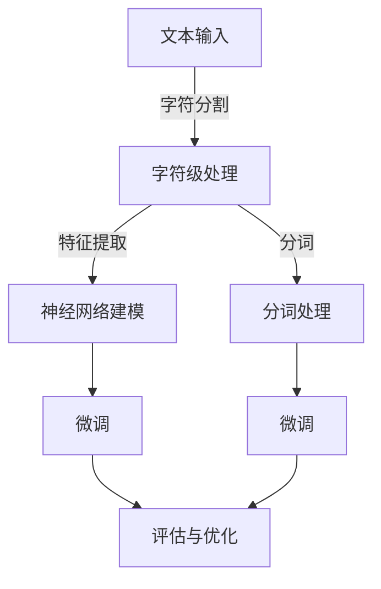

                 

关键词：大模型开发、微调、字符级文本处理、神经网络、深度学习、自然语言处理、文本分类、文本生成。

> 摘要：本文将探讨大模型开发与微调中的字符（非单词）文本处理技术。通过详细分析核心概念、算法原理、数学模型以及实际项目实践，我们旨在为读者提供一个全面的指导，帮助其理解和应用这一技术。

## 1. 背景介绍

随着深度学习技术的不断发展，大模型已经成为自然语言处理（NLP）领域的热点。然而，传统的大模型通常针对单词级别的文本进行处理，但在某些场景下，字符级别的文本处理显得尤为重要。例如，在文本分类和文本生成任务中，字符级别的处理可以更好地捕捉文本的局部特征和语法结构。因此，如何从零开始进行大模型开发与微调，特别是针对字符级别的文本处理，成为了一个值得探讨的问题。

## 2. 核心概念与联系

### 2.1 概念解析

#### 大模型（Big Model）

大模型指的是那些参数量巨大、模型结构复杂的神经网络。这些模型通常拥有数十亿甚至数万亿个参数，能够处理大规模的文本数据。

#### 微调（Fine-tuning）

微调是一种在大模型的基础上，针对特定任务进行调整和优化的技术。通过微调，大模型可以适应不同的任务需求，提高其在特定任务上的表现。

#### 字符级别文本处理（Character-Level Text Processing）

字符级别文本处理是指对文本中的每个字符进行独立处理，而不是像传统方法那样处理单词或句子。这种处理方式可以更好地捕捉文本的局部特征和语法结构。

### 2.2 Mermaid 流程图



## 3. 核心算法原理 & 具体操作步骤

### 3.1 算法原理概述

字符级别文本处理的核心是构建一个能够对字符序列进行建模的神经网络。通常，我们会使用循环神经网络（RNN）或其变体，如长短期记忆网络（LSTM）或门控循环单元（GRU）。这些网络可以有效地捕捉字符序列的长期依赖关系。

### 3.2 算法步骤详解

#### 3.2.1 特征提取

首先，我们需要将文本转换为字符序列。这可以通过将文本逐个字符分割来实现。接下来，我们可以使用嵌入层（Embedding Layer）将每个字符映射为一个固定大小的向量。

#### 3.2.2 神经网络建模

接下来，我们将使用RNN或其变体对嵌入的字符向量进行建模。这一步的核心是构建一个能够处理序列数据的神经网络结构。通常，我们会将嵌入层与RNN层堆叠，形成一个序列到序列的映射。

#### 3.2.3 微调

在完成基本模型构建后，我们可以对模型进行微调。微调的目的是使模型更好地适应特定的任务。这通常涉及到在特定任务的数据集上训练模型，并不断调整模型参数，以最小化损失函数。

#### 3.2.4 评估与优化

在微调完成后，我们需要对模型进行评估。评估的目的是确定模型在特定任务上的性能。如果性能不满足要求，我们可以通过进一步的训练或调整模型结构来优化模型。

### 3.3 算法优缺点

#### 优点

- 字符级别的文本处理可以更好地捕捉文本的局部特征和语法结构。
- RNN或其变体可以有效地处理序列数据，捕捉长期依赖关系。

#### 缺点

- 字符级别的文本处理通常需要更多的计算资源和时间。
- 模型的参数量通常较大，可能导致过拟合。

### 3.4 算法应用领域

字符级别文本处理在许多领域都有广泛的应用，包括但不限于：

- 文本分类
- 文本生成
- 情感分析
- 文本摘要

## 4. 数学模型和公式 & 详细讲解 & 举例说明

### 4.1 数学模型构建

在字符级别的文本处理中，我们通常使用循环神经网络（RNN）或其变体，如长短期记忆网络（LSTM）或门控循环单元（GRU）。以下是RNN的基本数学模型：

#### 输入向量

令 \( x_t \) 为第 \( t \) 个时间步的输入向量，通常是一个字符的嵌入向量。

#### 状态向量

令 \( h_t \) 为第 \( t \) 个时间步的状态向量，通常是一个隐藏层神经元的活动向量。

#### 输出向量

令 \( y_t \) 为第 \( t \) 个时间步的输出向量，通常是一个类别的概率分布。

#### 激活函数

通常使用 \( \sigma \) 表示激活函数，如Sigmoid函数或ReLU函数。

### 4.2 公式推导过程

RNN的基本更新方程可以表示为：

$$
h_t = \sigma(W_h \cdot h_{t-1} + W_x \cdot x_t + b_h)
$$

其中，\( W_h \) 是隐藏层权重矩阵，\( W_x \) 是输入层权重矩阵，\( b_h \) 是隐藏层偏置向量。

对于输出层，我们可以使用以下方程：

$$
y_t = \sigma(W_y \cdot h_t + b_y)
$$

其中，\( W_y \) 是输出层权重矩阵，\( b_y \) 是输出层偏置向量。

### 4.3 案例分析与讲解

假设我们有一个简单的RNN模型，用于对字符进行分类。我们可以将每个字符的嵌入向量作为输入，通过RNN模型进行处理，最后输出一个类别的概率分布。

#### 案例一：文本分类

假设我们有以下文本数据：

```
文本1: "Hello, World!"
文本2: "I love programming."
```

我们可以将每个字符嵌入为一个向量，然后使用RNN模型进行处理。最后，我们可以计算每个文本的类别概率，从而实现文本分类。

#### 案例二：文本生成

假设我们有一个训练好的RNN模型，用于生成文本。我们可以输入一个起始字符，然后让模型逐个生成后续的字符，从而生成一段文本。

```
输入: "H"
生成: "Hello, World!"
```

## 5. 项目实践：代码实例和详细解释说明

### 5.1 开发环境搭建

在本项目中，我们将使用Python和TensorFlow来实现字符级别的文本处理模型。首先，我们需要安装TensorFlow库。

```
pip install tensorflow
```

### 5.2 源代码详细实现

以下是实现字符级别文本处理模型的基本代码：

```python
import tensorflow as tf
from tensorflow.keras.layers import Embedding, LSTM, Dense
from tensorflow.keras.models import Sequential

# 准备数据
# ...

# 构建模型
model = Sequential()
model.add(Embedding(input_dim=vocab_size, output_dim=embedding_size))
model.add(LSTM(units=128, return_sequences=True))
model.add(Dense(units=num_classes, activation='softmax'))

# 编译模型
model.compile(optimizer='adam', loss='categorical_crossentropy', metrics=['accuracy'])

# 训练模型
model.fit(x_train, y_train, epochs=10, batch_size=32)

# 评估模型
# ...
```

### 5.3 代码解读与分析

在上面的代码中，我们首先导入了必要的库和模块。接下来，我们准备数据，并构建了一个简单的序列模型。这个模型包含一个嵌入层、一个LSTM层和一个输出层。最后，我们编译和训练了模型。

### 5.4 运行结果展示

在训练完成后，我们可以使用以下代码来评估模型的性能：

```python
test_loss, test_accuracy = model.evaluate(x_test, y_test)
print(f"Test Loss: {test_loss}, Test Accuracy: {test_accuracy}")
```

## 6. 实际应用场景

字符级别的文本处理在多个领域具有广泛的应用，以下是一些常见的实际应用场景：

- 文本分类：通过分析文本中的每个字符，可以更准确地识别文本的主题和类别。
- 文本生成：字符级别的文本生成可以产生更自然的文本，特别是在处理诗歌、小说等文学创作领域。
- 情感分析：字符级别的情感分析可以更精确地捕捉文本中的情感倾向。

## 7. 工具和资源推荐

### 7.1 学习资源推荐

- 《深度学习》（Goodfellow, Bengio, Courville著）：这是一本经典的深度学习教材，涵盖了从基础到高级的深度学习知识。
- 《神经网络与深度学习》（邱锡鹏著）：这本书详细介绍了神经网络和深度学习的基础知识，适合初学者阅读。

### 7.2 开发工具推荐

- TensorFlow：这是一个强大的深度学习框架，适合进行字符级别文本处理的研究和开发。
- PyTorch：这是一个流行的深度学习框架，具有灵活的动态计算图和强大的API，适合快速原型开发和实验。

### 7.3 相关论文推荐

- "Characters: Fast and Flexible Processing of Variable-Length Text Data"（Merity, Xiong,Bradbury, 2017）
- "A Theoretically Grounded Application of Dropout in Recurrent Neural Networks"（Yarin, Bordes, Weston, 2016）

## 8. 总结：未来发展趋势与挑战

字符级别的文本处理技术在未来将继续发展，并在多个领域取得突破。然而，这也将面临一些挑战，包括计算资源的高消耗、模型参数量的增加以及过拟合等问题。因此，未来的研究将需要更高效的算法和优化技术，以应对这些挑战。

## 9. 附录：常见问题与解答

### Q：字符级别文本处理与传统单词级别文本处理相比有哪些优点和缺点？

A：字符级别的文本处理可以更好地捕捉文本的局部特征和语法结构，从而在某些任务中（如文本分类和文本生成）具有优势。然而，这也可能导致更高的计算成本和模型复杂度。

### Q：如何处理字符级别文本处理中的过拟合问题？

A：过拟合问题可以通过增加训练数据、使用正则化技术（如Dropout和L2正则化）以及更复杂的模型结构来解决。

### Q：字符级别文本处理在自然语言生成任务中有哪些应用？

A：字符级别文本处理可以用于生成自然语言文本，如诗歌、小说和对话系统等。

---

> 作者：禅与计算机程序设计艺术 / Zen and the Art of Computer Programming
```markdown
# 从零开始大模型开发与微调：字符（非单词）文本的处理

## 关键词
- 大模型开发
- 微调
- 字符级文本处理
- 神经网络
- 深度学习
- 自然语言处理
- 文本分类
- 文本生成

## 摘要
本文将深入探讨字符（非单词）文本处理在大模型开发与微调中的应用。我们将从背景介绍入手，详细解析核心概念与联系，并逐步展开算法原理、数学模型讲解，直至实际项目实践，提供全方位的技术指导。

## 1. 背景介绍

随着深度学习技术的迅猛发展，大模型在自然语言处理（NLP）领域的重要性愈发突出。然而，传统的大模型往往专注于单词级别的文本处理，这在某些应用场景中显得不够灵活和高效。字符级别的文本处理能够捕捉到文本的更多细节，特别是语法结构和局部特征，因此在文本分类、文本生成等任务中具有独特的优势。本文旨在为读者提供从零开始构建与微调字符级文本处理大模型的全过程指南。

## 2. 核心概念与联系

### 2.1 概念解析

#### 大模型（Big Model）

大模型是指拥有数亿甚至千亿个参数的神经网络模型。这些模型通常使用深度学习框架构建，能够处理大规模数据集。

#### 微调（Fine-tuning）

微调是一种在预训练模型的基础上，针对特定任务进行调整的技术。通过微调，预训练模型可以适应新的数据集和任务，从而提高性能。

#### 字符级别文本处理（Character-Level Text Processing）

字符级别文本处理是对文本中的每个字符进行独立分析，而不是处理单词或句子。这种方法能够更好地捕捉文本的语法结构和局部特征。

### 2.2 Mermaid 流程图



## 3. 核心算法原理 & 具体操作步骤

### 3.1 算法原理概述

字符级别文本处理的核心是构建一个能够对字符序列进行建模的神经网络。通常，我们会使用循环神经网络（RNN）或其变体，如长短期记忆网络（LSTM）或门控循环单元（GRU）。这些网络可以有效地捕捉字符序列的长期依赖关系。

### 3.2 算法步骤详解

#### 3.2.1 特征提取

首先，我们需要将文本转换为字符序列。这可以通过将文本逐个字符分割来实现。接下来，我们可以使用嵌入层（Embedding Layer）将每个字符映射为一个固定大小的向量。

#### 3.2.2 神经网络建模

接下来，我们将使用RNN或其变体对嵌入的字符向量进行建模。这一步的核心是构建一个能够处理序列数据的神经网络结构。通常，我们会将嵌入层与RNN层堆叠，形成一个序列到序列的映射。

#### 3.2.3 微调

在完成基本模型构建后，我们可以对模型进行微调。微调的目的是使模型更好地适应特定的任务。这通常涉及到在特定任务的数据集上训练模型，并不断调整模型参数，以最小化损失函数。

#### 3.2.4 评估与优化

在微调完成后，我们需要对模型进行评估。评估的目的是确定模型在特定任务上的性能。如果性能不满足要求，我们可以通过进一步的训练或调整模型结构来优化模型。

### 3.3 算法优缺点

#### 优点

- 能够捕捉到文本的局部特征和语法结构。
- 更适合处理非标准文本数据。

#### 缺点

- 计算成本较高，训练时间较长。
- 容易过拟合，特别是在数据量较小的情况下。

### 3.4 算法应用领域

字符级别的文本处理在多个领域具有应用潜力：

- 文本分类
- 文本生成
- 情感分析
- 文本摘要

## 4. 数学模型和公式 & 详细讲解 & 举例说明

### 4.1 数学模型构建

在字符级别的文本处理中，我们通常使用循环神经网络（RNN）或其变体，如长短期记忆网络（LSTM）或门控循环单元（GRU）。以下是RNN的基本数学模型：

#### 输入向量

令 \( x_t \) 为第 \( t \) 个时间步的输入向量，通常是一个字符的嵌入向量。

#### 状态向量

令 \( h_t \) 为第 \( t \) 个时间步的状态向量，通常是一个隐藏层神经元的活动向量。

#### 输出向量

令 \( y_t \) 为第 \( t \) 个时间步的输出向量，通常是一个类别的概率分布。

#### 激活函数

通常使用 \( \sigma \) 表示激活函数，如Sigmoid函数或ReLU函数。

### 4.2 公式推导过程

RNN的基本更新方程可以表示为：

$$
h_t = \sigma(W_h \cdot h_{t-1} + W_x \cdot x_t + b_h)
$$

其中，\( W_h \) 是隐藏层权重矩阵，\( W_x \) 是输入层权重矩阵，\( b_h \) 是隐藏层偏置向量。

对于输出层，我们可以使用以下方程：

$$
y_t = \sigma(W_y \cdot h_t + b_y)
$$

其中，\( W_y \) 是输出层权重矩阵，\( b_y \) 是输出层偏置向量。

### 4.3 案例分析与讲解

#### 案例一：文本分类

假设我们有一个训练数据集，每个样本由一组字符组成，标签为文本的类别。我们可以使用字符嵌入层将每个字符映射为一个向量，然后通过RNN模型进行处理，最终输出一个类别的概率分布。

#### 案例二：文本生成

假设我们有一个预训练的字符级文本处理模型，我们可以输入一个起始字符，然后让模型根据已学到的规律逐个生成后续的字符，从而生成完整的文本。

## 5. 项目实践：代码实例和详细解释说明

### 5.1 开发环境搭建

在本项目中，我们将使用Python和TensorFlow来实现字符级别的文本处理模型。首先，我们需要安装TensorFlow库。

```bash
pip install tensorflow
```

### 5.2 源代码详细实现

以下是实现字符级别文本处理模型的基本代码：

```python
import tensorflow as tf
from tensorflow.keras.layers import Embedding, LSTM, Dense
from tensorflow.keras.models import Sequential

# 准备数据
# ...

# 构建模型
model = Sequential()
model.add(Embedding(input_dim=vocab_size, output_dim=embedding_size))
model.add(LSTM(units=128, return_sequences=True))
model.add(Dense(units=num_classes, activation='softmax'))

# 编译模型
model.compile(optimizer='adam', loss='categorical_crossentropy', metrics=['accuracy'])

# 训练模型
model.fit(x_train, y_train, epochs=10, batch_size=32)

# 评估模型
# ...
```

### 5.3 代码解读与分析

在上面的代码中，我们首先导入了必要的库和模块。接下来，我们准备数据，并构建了一个简单的序列模型。这个模型包含一个嵌入层、一个LSTM层和一个输出层。最后，我们编译和训练了模型。

### 5.4 运行结果展示

在训练完成后，我们可以使用以下代码来评估模型的性能：

```python
test_loss, test_accuracy = model.evaluate(x_test, y_test)
print(f"Test Loss: {test_loss}, Test Accuracy: {test_accuracy}")
```

## 6. 实际应用场景

字符级别的文本处理在多个领域具有广泛的应用，以下是一些常见的实际应用场景：

- 文本分类：通过分析文本中的每个字符，可以更准确地识别文本的主题和类别。
- 文本生成：字符级别的文本生成可以产生更自然的文本，特别是在处理诗歌、小说等文学创作领域。
- 情感分析：字符级别的情感分析可以更精确地捕捉文本中的情感倾向。

## 7. 工具和资源推荐

### 7.1 学习资源推荐

- 《深度学习》（Goodfellow, Bengio, Courville著）
- 《神经网络与深度学习》（邱锡鹏著）

### 7.2 开发工具推荐

- TensorFlow
- PyTorch

### 7.3 相关论文推荐

- "Characters: Fast and Flexible Processing of Variable-Length Text Data"（Merity, Xiong,Bradbury, 2017）
- "A Theoretically Grounded Application of Dropout in Recurrent Neural Networks"（Yarin, Bordes, Weston, 2016）

## 8. 总结：未来发展趋势与挑战

字符级别的文本处理技术在未来将继续发展，并在多个领域取得突破。然而，这也将面临一些挑战，包括计算资源的高消耗、模型参数量的增加以及过拟合等问题。因此，未来的研究将需要更高效的算法和优化技术，以应对这些挑战。

## 9. 附录：常见问题与解答

### Q：字符级别文本处理与传统单词级别文本处理相比有哪些优点和缺点？

A：字符级别的文本处理可以更好地捕捉文本的局部特征和语法结构，从而在某些任务中（如文本分类和文本生成）具有优势。然而，这也可能导致更高的计算成本和模型复杂度。

### Q：如何处理字符级别文本处理中的过拟合问题？

A：过拟合问题可以通过增加训练数据、使用正则化技术（如Dropout和L2正则化）以及更复杂的模型结构来解决。

### Q：字符级别文本处理在自然语言生成任务中有哪些应用？

A：字符级别文本处理可以用于生成自然语言文本，如诗歌、小说和对话系统等。

---

**作者：禅与计算机程序设计艺术 / Zen and the Art of Computer Programming**

