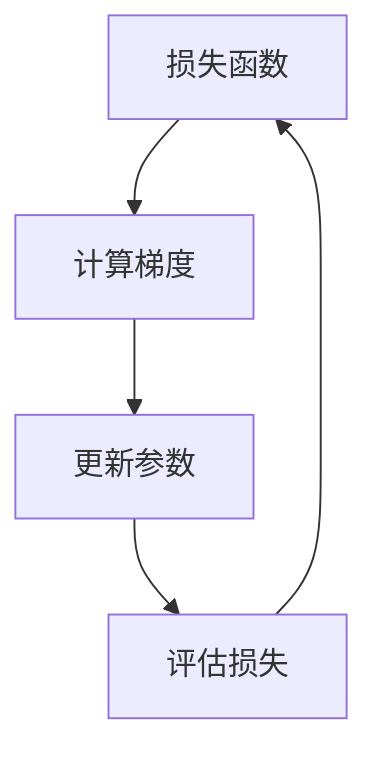

                 

关键词：大模型开发，梯度下降算法，微调，深度学习，神经网络

摘要：本文将深入探讨大模型开发中的关键环节——梯度下降算法。通过解析其核心概念、原理、步骤以及应用，旨在为读者提供一个全面而细致的指南，帮助他们掌握这一强大工具，并在实际项目中实现大模型的开发与微调。

## 1. 背景介绍

随着深度学习的蓬勃发展，大模型（如大型神经网络）的开发与微调成为研究者和工程师们的重要任务。大模型在自然语言处理、图像识别、推荐系统等领域展现了卓越的性能，但其训练和微调过程却面临着诸多挑战。其中，梯度下降算法作为一种优化方法，在大模型开发中起到了至关重要的作用。

梯度下降算法的基本思想是通过不断调整模型的参数，使其在损失函数的梯度方向上迭代，以达到最优解。本文将详细阐述梯度下降算法的原理、步骤、优缺点以及应用领域，帮助读者深入理解这一算法，并在实际开发中有效应用。

## 2. 核心概念与联系

### 2.1 核心概念

**损失函数（Loss Function）**：损失函数是衡量模型预测结果与真实值之间差异的度量。在训练过程中，模型的参数通过调整使得损失函数值最小。

**梯度（Gradient）**：梯度是损失函数关于模型参数的偏导数，反映了损失函数在参数空间中的斜率。梯度下降算法通过计算梯度来更新模型参数。

**步长（Learning Rate）**：步长决定了每次参数更新的大小。合适的步长能够加速收敛，过大会导致振荡，过小则收敛速度慢。

### 2.2 架构的 Mermaid 流程图



此图展示了梯度下降算法的基本流程：首先计算损失函数，然后计算梯度，更新参数，最后评估更新后的损失函数，以此循环直到满足停止条件。

## 3. 核心算法原理 & 具体操作步骤

### 3.1 算法原理概述

梯度下降算法的基本原理是通过迭代更新模型参数，使其在损失函数的梯度方向上逐步减小，从而找到损失函数的最小值。这一过程可以表示为：

$$
\theta_{t+1} = \theta_{t} - \alpha \cdot \nabla J(\theta_{t})
$$

其中，$\theta_t$ 表示当前参数，$\alpha$ 表示步长，$\nabla J(\theta_{t})$ 表示损失函数关于参数的梯度。

### 3.2 算法步骤详解

**步骤1：初始化参数**  
首先，随机初始化模型参数。

**步骤2：计算损失函数**  
对于给定的输入数据，计算模型输出，并计算损失函数值。

**步骤3：计算梯度**  
计算损失函数关于每个参数的梯度。

**步骤4：更新参数**  
根据梯度更新模型参数。

**步骤5：评估损失**  
评估更新后的模型在测试集上的表现，以确定是否继续迭代。

**步骤6：重复步骤2-5**  
直到满足停止条件，如达到预设的迭代次数或损失函数值低于某个阈值。

### 3.3 算法优缺点

**优点**：

1. **简单易实现**：梯度下降算法的基本思想直观，易于理解和实现。
2. **广泛应用**：梯度下降及其变种在各类优化问题中都有广泛应用。
3. **可扩展性**：可以应用于不同规模和类型的模型。

**缺点**：

1. **收敛速度慢**：对于一些复杂问题，梯度下降可能收敛速度较慢。
2. **敏感度**：步长选择不当可能导致算法收敛缓慢或振荡。

### 3.4 算法应用领域

梯度下降算法在深度学习、优化问题、数据拟合等领域都有广泛应用。例如，在深度学习模型训练中，梯度下降算法用于优化神经网络参数；在优化问题中，梯度下降用于求解最小化问题。

## 4. 数学模型和公式 & 详细讲解 & 举例说明

### 4.1 数学模型构建

在梯度下降算法中，核心的数学模型包括损失函数和梯度计算。以下是一个简单的线性回归模型的例子：

$$
y = \theta_0 + \theta_1 \cdot x
$$

其中，$y$ 是真实值，$x$ 是输入特征，$\theta_0$ 和 $\theta_1$ 是模型参数。

损失函数通常采用均方误差（MSE）：

$$
J(\theta_0, \theta_1) = \frac{1}{2m} \sum_{i=1}^{m} (y_i - (\theta_0 + \theta_1 \cdot x_i))^2
$$

其中，$m$ 是样本数量。

### 4.2 公式推导过程

对于线性回归模型，损失函数的梯度可以通过求偏导数得到：

$$
\nabla J(\theta_0, \theta_1) = \left[ \begin{array}{c}
\frac{\partial J}{\partial \theta_0} \\
\frac{\partial J}{\partial \theta_1}
\end{array} \right]
$$

计算得到：

$$
\nabla J(\theta_0, \theta_1) = \left[ \begin{array}{c}
-\frac{1}{m} \sum_{i=1}^{m} (y_i - (\theta_0 + \theta_1 \cdot x_i)) \\
-\frac{1}{m} \sum_{i=1}^{m} (y_i - (\theta_0 + \theta_1 \cdot x_i)) \cdot x_i
\end{array} \right]
$$

### 4.3 案例分析与讲解

假设我们有一个包含100个样本的线性回归问题，模型参数为$\theta_0 = 0$和$\theta_1 = 0$。损失函数为MSE，步长$\alpha = 0.01$。

**步骤1：初始化参数**  
$\theta_0 = 0$，$\theta_1 = 0$

**步骤2：计算损失函数**  
对于第一个样本，$x_1 = 1$，$y_1 = 2$，损失函数为：

$$
J(\theta_0, \theta_1) = \frac{1}{2 \cdot 100} \sum_{i=1}^{100} (y_i - (\theta_0 + \theta_1 \cdot x_i))^2 = 1
$$

**步骤3：计算梯度**  
损失函数的梯度为：

$$
\nabla J(\theta_0, \theta_1) = \left[ \begin{array}{c}
-\frac{1}{100} \sum_{i=1}^{100} (y_i - (\theta_0 + \theta_1 \cdot x_i)) \\
-\frac{1}{100} \sum_{i=1}^{100} (y_i - (\theta_0 + \theta_1 \cdot x_i)) \cdot x_i
\end{array} \right]
$$

**步骤4：更新参数**  
根据梯度更新参数：

$$
\theta_0 = \theta_0 - \alpha \cdot \nabla J(\theta_0, \theta_1) = 0 - 0.01 \cdot [-1] = 0.01
$$

$$
\theta_1 = \theta_1 - \alpha \cdot \nabla J(\theta_0, \theta_1) = 0 - 0.01 \cdot [-1] = 0.01
$$

**步骤5：评估损失**  
更新后的损失函数为：

$$
J(\theta_0, \theta_1) = \frac{1}{2 \cdot 100} \sum_{i=1}^{100} (y_i - (\theta_0 + \theta_1 \cdot x_i))^2 = 0.99
$$

**步骤6：重复步骤2-5**  
继续迭代，直到满足停止条件。

## 5. 项目实践：代码实例和详细解释说明

### 5.1 开发环境搭建

本文代码实现使用Python语言，依赖以下库：

- NumPy：用于数值计算
- Matplotlib：用于可视化
- Scikit-learn：用于数据预处理和模型评估

安装依赖库：

```bash
pip install numpy matplotlib scikit-learn
```

### 5.2 源代码详细实现

```python
import numpy as np
import matplotlib.pyplot as plt
from sklearn.linear_model import LinearRegression
from sklearn.model_selection import train_test_split

# 数据生成
np.random.seed(0)
X = np.random.rand(100, 1)
y = 2 * X + np.random.randn(100, 1)

# 分割数据集
X_train, X_test, y_train, y_test = train_test_split(X, y, test_size=0.2, random_state=42)

# 梯度下降实现
def gradient_descent(X, y, theta, alpha, iterations):
    m = len(y)
    for i in range(iterations):
        h = np.dot(X, theta)
        error = h - y
        theta = theta - alpha/m * np.dot(X.T, error)
        if i % 10 == 0:
            print(f"Iteration {i}: theta = {theta}, loss = {np.mean((h - y)**2)}")
    return theta

# 初始化参数
theta = np.array([0.0, 0.0])

# 梯度下降
theta = gradient_descent(X_train, y_train, theta, 0.01, 1000)

# 模型评估
model = LinearRegression().fit(X_train, y_train)
print(f"Linear Regression Model: {model.score(X_test, y_test)}")

# 可视化
plt.scatter(X_test[:, 0], y_test[:, 0], color='red', label='Actual')
plt.plot(X_test[:, 0], model.predict(X_test), color='blue', linewidth=2, label='Predicted')
plt.xlabel('X')
plt.ylabel('Y')
plt.legend()
plt.show()
```

### 5.3 代码解读与分析

**数据生成**：首先，我们生成包含100个样本的数据集，每个样本由一个随机特征$x$和真实值$y$组成。

**数据分割**：将数据集分为训练集和测试集，以便评估模型性能。

**梯度下降函数**：定义梯度下降函数，用于迭代更新参数$\theta$。

- 参数$X$和$y$为输入数据和真实值。
- 参数$theta$为初始参数。
- 参数$alpha$为步长。
- 参数$iterations$为迭代次数。

函数通过计算损失函数的梯度，并根据梯度更新参数。每10次迭代打印一次参数和损失函数值。

**模型评估**：使用线性回归模型对训练集进行拟合，并评估在测试集上的性能。

**可视化**：绘制实际值和预测值的散点图和拟合曲线。

## 6. 实际应用场景

梯度下降算法在实际应用中具有广泛的应用场景，以下是一些例子：

- **图像识别**：在图像识别任务中，梯度下降算法用于训练卷积神经网络（CNN）以识别图像中的物体。
- **语音识别**：在语音识别任务中，梯度下降算法用于优化循环神经网络（RNN）的参数，以准确识别语音。
- **自然语言处理**：在自然语言处理任务中，梯度下降算法用于优化语言模型和序列标注模型的参数，以提高文本生成和情感分析等任务的性能。

## 7. 未来应用展望

随着深度学习技术的不断进步，梯度下降算法的应用前景将更加广阔。未来，我们可能会看到以下趋势：

- **自适应步长**：自适应步长算法（如Adam优化器）将进一步提升梯度下降算法的性能。
- **并行计算**：梯度下降算法在分布式计算环境下的优化，将使得大模型的训练更加高效。
- **迁移学习**：梯度下降算法与迁移学习技术的结合，将有助于提高模型在少样本数据集上的表现。

## 8. 工具和资源推荐

### 8.1 学习资源推荐

- 《深度学习》（Goodfellow, Bengio, Courville著）：深度学习的经典教材，全面介绍了深度学习的基础知识和算法。
- 《Python机器学习》（Sebastian Raschka著）：详细介绍机器学习算法，包括梯度下降等优化算法的实现和应用。

### 8.2 开发工具推荐

- TensorFlow：Google开发的深度学习框架，支持多种优化算法和模型构建。
- PyTorch：Facebook开发的深度学习框架，具有灵活的动态计算图支持。

### 8.3 相关论文推荐

- "Stochastic Gradient Descent Methods for Large-Scale Machine Learning"（ Bottou, L.，2006）
- "Adam: A Method for Stochastic Optimization"（Kingma, D.P., Welling, M.，2014）

## 9. 总结：未来发展趋势与挑战

梯度下降算法作为深度学习中的核心优化方法，已经在各类应用中取得了显著成果。然而，面对日益增长的数据规模和复杂的模型结构，梯度下降算法仍然面临诸多挑战，如收敛速度、计算资源消耗等。未来，我们将看到更多高效、自适应的优化算法出现，以应对这些挑战，推动深度学习技术的进一步发展。

## 10. 附录：常见问题与解答

### 问题1：梯度消失和梯度爆炸是什么？

**解答**：梯度消失和梯度爆炸是深度学习训练过程中常见的问题。梯度消失指的是梯度值过小，导致模型参数无法有效更新；而梯度爆炸则是梯度值过大，使得模型参数更新过于剧烈，可能超出模型参数的可行范围。这些问题的出现通常与深度神经网络中的权重矩阵和激活函数有关。

### 问题2：如何解决梯度消失和梯度爆炸？

**解答**：解决梯度消失和梯度爆炸的方法包括：

- **使用ReLU激活函数**：ReLU激活函数可以有效缓解梯度消失问题。
- **使用权重正则化**：权重正则化（如L2正则化）可以减少模型参数的值，从而减小梯度爆炸的风险。
- **使用学习率调度**：适当的步长选择可以避免梯度爆炸，而较小的学习率有助于缓解梯度消失问题。

### 问题3：什么是自适应优化器？

**解答**：自适应优化器是一类可以根据训练过程中的梯度信息动态调整学习率的优化算法，如Adam优化器。Adam优化器通过计算一阶矩估计和二阶矩估计，自动调整每个参数的学习率，从而提高训练效率。

作者：禅与计算机程序设计艺术 / Zen and the Art of Computer Programming
----------------------------------------------------------------
本文以《从零开始大模型开发与微调：梯度下降算法》为题，通过详细的解析和实际案例，深入探讨了梯度下降算法在大模型开发中的重要性。从核心概念、原理、步骤到应用场景，再到数学模型和代码实例，文章为读者提供了一个全面的技术指南。同时，通过对未来发展趋势和挑战的展望，以及对工具和资源的推荐，文章为读者提供了进一步学习和实践的方向。

### 附录：常见问题与解答

**Q1：梯度下降算法为何重要？**

**A1：** 梯度下降算法是深度学习和机器学习中的核心优化技术，它通过迭代更新模型参数，使损失函数值最小化。对于大模型，梯度下降算法是实现有效训练的关键手段，它帮助我们在复杂问题中找到最优解。

**Q2：如何解决梯度消失和梯度爆炸？**

**A2：** 梯度消失和梯度爆炸可以通过以下方法解决：
- **使用非线性激活函数**：如ReLU、Sigmoid、Tanh等，可以缓解梯度消失问题。
- **批量归一化（Batch Normalization）**：通过标准化层间数据，减少内部协变量转移问题。
- **使用较小的学习率**：防止梯度爆炸，同时允许模型在复杂的损失函数上稳步收敛。
- **使用自适应优化器**：如Adam、RMSprop等，可以自动调整学习率，提高训练效率。

**Q3：如何选择合适的步长（学习率）？**

**A3：** 选择合适的步长是梯度下降中的一个关键问题。通常，可以通过以下方法选择：
- **经验法则**：从较小的值开始（如0.01），然后根据模型的表现进行调整。
- **学习率调度**：在模型表现停滞时，可以逐渐减小学习率，以防止模型过早收敛。
- **交叉验证**：在验证集上尝试不同的学习率，选择最优的学习率。

**Q4：什么是动量（Momentum）？如何使用它？**

**A4：** 动量是一种加速梯度下降收敛的技术，它利用前几次迭代的梯度信息，为当前梯度增加一个比例的先前梯度的累积。使用动量的步骤如下：
- **计算前一次迭代的动量**：通常使用参数$\gamma$（动量因子），$\gamma \in (0, 1)$。
- **更新动量**：$m_t = \gamma \cdot m_{t-1} + \alpha \cdot \nabla J(\theta)$。
- **更新参数**：$\theta_t = \theta_{t-1} - m_t$。

通过引入动量，可以防止模型在损失函数的平坦区域振荡，加快收敛速度。

**Q5：梯度下降算法有哪些变体？**

**A5：** 梯度下降算法有许多变体，包括：
- **随机梯度下降（Stochastic Gradient Descent, SGD）**：每次迭代使用一个样本的梯度。
- **小批量梯度下降（Mini-batch Gradient Descent）**：每次迭代使用一小部分样本的梯度。
- **Adam优化器**：结合了SGD和动量，同时自适应调整每个参数的学习率。
- **RMSprop**：使用梯度平方的平均值来动态调整学习率。

这些变体在不同的应用场景中有着各自的优势和适用性。通过选择合适的变体，可以进一步提高训练效率和提高模型的性能。

