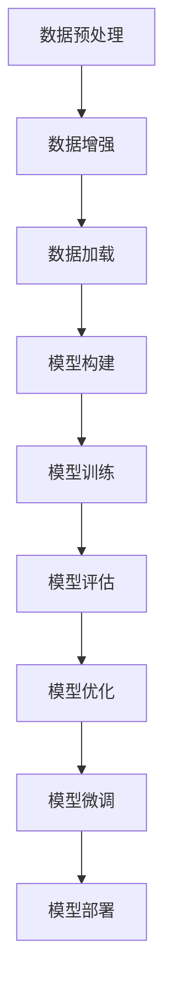

                 

  
## 1. 背景介绍

随着人工智能技术的飞速发展，深度学习在大规模数据处理、图像识别、自然语言处理等领域取得了显著的成果。这些深度学习模型，尤其是大型神经网络模型，如Transformer、BERT等，已经成为人工智能研究与应用的重要工具。然而，如何有效地开发与微调这些大型模型，已经成为一个亟待解决的问题。

本文旨在系统地介绍大型模型的开发与微调过程，包括模型设计、算法原理、数学模型构建、项目实践和实际应用等多个方面。通过本文的阅读，读者可以全面了解大型模型的设计与实现，为未来的研究和应用奠定基础。

### 1.1 背景与意义

深度学习在近年来取得了许多突破性进展，尤其在图像识别、语音识别、自然语言处理等领域。这些成果背后，离不开大型神经网络模型的支持。例如，谷歌的BERT模型在自然语言处理任务中取得了令人瞩目的成绩，成为许多研究与应用的基石。

然而，大型模型的开发与微调过程并不简单。如何设计高效的模型结构、如何选择合适的训练数据、如何优化训练过程，都是需要深入探讨的问题。本文将从这些方面入手，系统地介绍大型模型的开发与微调过程。

### 1.2 内容概述

本文分为八个部分，分别从背景介绍、核心概念与联系、核心算法原理与操作步骤、数学模型与公式、项目实践、实际应用场景、工具和资源推荐以及总结与展望等多个方面，全面介绍了大型模型的开发与微调过程。具体内容如下：

1. **背景介绍**：介绍深度学习的发展背景，以及大型模型在其中的重要性。
2. **核心概念与联系**：介绍大型模型的核心概念，并通过Mermaid流程图展示其架构。
3. **核心算法原理与操作步骤**：详细解释大型模型的算法原理，并给出具体的操作步骤。
4. **数学模型与公式**：介绍大型模型背后的数学模型，并详细讲解公式的推导过程。
5. **项目实践**：通过代码实例，展示大型模型的实际开发与微调过程。
6. **实际应用场景**：探讨大型模型在不同领域的应用场景，以及未来应用展望。
7. **工具和资源推荐**：推荐学习资源和开发工具，帮助读者更好地进行大型模型开发。
8. **总结与展望**：总结研究成果，探讨未来发展趋势与挑战，并提出研究展望。

接下来，我们将逐一介绍每个部分的内容。

<|assistant|>
## 2. 核心概念与联系

在深度学习领域，大型模型的设计与实现离不开对核心概念与联系的理解。本节将介绍大型模型的核心概念，并通过Mermaid流程图展示其架构，帮助读者全面了解大型模型的组成部分和相互关系。

### 2.1 核心概念

#### 2.1.1 神经网络

神经网络是深度学习的基础，它由大量的神经元组成，通过多层非线性变换实现数据的输入到输出的映射。在神经网络中，神经元之间的连接权重和偏置是模型训练的核心参数。

#### 2.1.2 深度学习框架

深度学习框架如TensorFlow、PyTorch等，提供了高效且易于使用的神经网络构建和训练工具。这些框架封装了底层计算细节，使得研究人员可以专注于模型设计和算法优化。

#### 2.1.3 大规模数据处理

大规模数据处理是大型模型训练的基础。数据预处理、数据增强、数据分布调整等策略，可以有效提高模型训练效果。

#### 2.1.4 模型优化与微调

模型优化与微调是提高模型性能的重要手段。通过调整模型结构、学习率、优化器等参数，可以优化模型在特定任务上的表现。

### 2.2 Mermaid流程图

为了更直观地展示大型模型的架构，我们使用Mermaid流程图来描述其核心组成部分和相互关系。以下是一个简单的Mermaid流程图示例：



在上述流程图中，A表示数据预处理，包括数据清洗、归一化等操作；B表示数据增强，通过扩充数据集来提高模型泛化能力；C表示数据加载，从存储设备中读取数据并进行处理；D表示模型构建，选择合适的模型结构和框架进行实现；E表示模型训练，通过迭代优化模型参数；F表示模型评估，评估模型在验证集上的表现；G表示模型优化，调整模型结构或参数以提高性能；H表示模型微调，在特定任务上进一步优化模型；I表示模型部署，将训练好的模型应用到实际场景中。

### 2.3 大型模型架构

大型模型的架构通常包括以下几个层次：

#### 2.3.1 数据输入层

数据输入层负责接收外部数据，将其转化为模型可以处理的形式。这一层通常包括数据预处理、特征提取等操作。

#### 2.3.2 中间层

中间层是模型的核心部分，包括多层神经网络、卷积层、循环层等。这些层次通过非线性变换实现数据的输入到输出的映射。

#### 2.3.3 输出层

输出层负责生成模型的预测结果。对于分类任务，输出层通常是一个softmax层；对于回归任务，输出层可以是线性层。

#### 2.3.4 优化层

优化层负责调整模型参数，以最小化损失函数。常用的优化算法包括随机梯度下降、Adam等。

#### 2.3.5 评估层

评估层用于评估模型在验证集上的性能，包括准确率、召回率、F1分数等指标。

通过上述核心概念和Mermaid流程图的介绍，读者可以更好地理解大型模型的设计与实现过程。接下来，我们将进一步探讨大型模型的核心算法原理与操作步骤。

<|assistant|>
## 3. 核心算法原理 & 具体操作步骤

大型模型的核心算法原理是深度学习的基石，包括神经网络的基本结构、训练过程和优化方法。本节将详细阐述这些算法原理，并给出具体的操作步骤。

### 3.1 算法原理概述

#### 3.1.1 神经网络结构

神经网络由大量神经元组成，每个神经元接收多个输入，通过加权求和并加上偏置，经过激活函数后产生输出。神经网络的结构可以分为输入层、隐藏层和输出层。输入层接收外部数据，隐藏层实现数据的特征提取和变换，输出层生成模型的预测结果。

#### 3.1.2 损失函数

损失函数用于衡量模型预测值与真实值之间的差异。常见的损失函数有均方误差（MSE）、交叉熵损失等。损失函数的目的是通过优化过程最小化，从而提高模型预测的准确性。

#### 3.1.3 优化算法

优化算法用于调整模型参数，以最小化损失函数。常用的优化算法有随机梯度下降（SGD）、Adam等。优化算法通过迭代更新模型参数，逐步减小损失函数的值。

#### 3.1.4 激活函数

激活函数用于引入非线性变换，使神经网络能够拟合复杂的函数。常见的激活函数有ReLU、Sigmoid、Tanh等。激活函数的选择对模型性能有重要影响。

### 3.2 算法步骤详解

#### 3.2.1 模型初始化

模型初始化是训练过程的第一步。初始化模型参数，包括权重和偏置。常用的初始化方法有高斯分布、均匀分布等。合理的初始化可以加速优化过程并提高模型性能。

#### 3.2.2 前向传播

前向传播是神经网络的核心步骤之一。给定输入数据，通过逐层计算得到模型的输出。前向传播过程中，每个神经元的输出通过加权求和和激活函数计算得到。

#### 3.2.3 损失计算

在前向传播的基础上，计算模型预测值与真实值之间的损失。损失函数通常是一个非凸函数，因此最小化损失函数是一个复杂的过程。

#### 3.2.4 反向传播

反向传播是神经网络的另一核心步骤。通过计算损失函数对模型参数的梯度，反向更新模型参数。反向传播利用链式法则，逐层计算梯度，从而更新每个神经元的权重和偏置。

#### 3.2.5 参数更新

利用优化算法更新模型参数。优化算法通过迭代更新参数，逐步减小损失函数的值。常用的优化算法有SGD、Adam等。

#### 3.2.6 模型评估

在训练过程中，定期评估模型在验证集上的性能。通过准确率、召回率、F1分数等指标，评估模型在特定任务上的表现。

#### 3.2.7 模型优化与微调

根据评估结果，调整模型结构或参数，以进一步提高模型性能。模型优化与微调是深度学习的重要环节，通过调整学习率、批量大小等参数，可以优化模型在特定任务上的表现。

### 3.3 算法优缺点

#### 3.3.1 优点

- **强大的表达能力**：神经网络可以通过多层非线性变换拟合复杂的函数。
- **自适应特征提取**：隐藏层神经元可以自动提取数据的特征，从而提高模型的泛化能力。
- **灵活的结构设计**：神经网络可以根据任务需求设计不同的结构，包括卷积神经网络、循环神经网络等。

#### 3.3.2 缺点

- **计算复杂度高**：神经网络训练过程中涉及大量的矩阵运算，计算复杂度较高。
- **数据需求大**：大型神经网络通常需要大量的训练数据来训练，以获得良好的泛化能力。
- **易过拟合**：当模型过于复杂时，容易发生过拟合现象，导致在验证集上表现不佳。

### 3.4 算法应用领域

神经网络在许多领域都取得了显著的成果，包括：

- **图像识别**：通过卷积神经网络，可以实现高效的图像分类和目标检测。
- **自然语言处理**：通过循环神经网络和Transformer模型，可以实现文本分类、机器翻译等任务。
- **语音识别**：通过循环神经网络和卷积神经网络，可以实现语音信号的识别和转换。

通过上述对核心算法原理和操作步骤的详细阐述，读者可以全面了解大型模型的设计与实现过程。接下来，我们将介绍大型模型的数学模型和公式。

<|assistant|>
## 4. 数学模型和公式 & 详细讲解 & 举例说明

在深度学习领域，数学模型和公式是理解和实现大型模型的关键。本节将详细讲解大型模型背后的数学模型和公式，并通过具体例子进行说明。

### 4.1 数学模型构建

#### 4.1.1 概念定义

在构建数学模型之前，需要先了解一些基本概念：

- **神经元**：神经网络中的基本计算单元，接收输入并通过加权求和和激活函数产生输出。
- **激活函数**：用于引入非线性变换，使神经网络能够拟合复杂的函数。常见的激活函数有ReLU、Sigmoid、Tanh等。
- **损失函数**：用于衡量模型预测值与真实值之间的差异。常见的损失函数有均方误差（MSE）、交叉熵损失等。
- **优化算法**：用于调整模型参数，以最小化损失函数。常见的优化算法有随机梯度下降（SGD）、Adam等。

#### 4.1.2 模型构建步骤

1. **定义神经网络结构**：确定输入层、隐藏层和输出层的神经元数量，以及神经元之间的连接方式。
2. **初始化模型参数**：初始化权重和偏置，常用的初始化方法有高斯分布、均匀分布等。
3. **定义激活函数**：选择合适的激活函数，以引入非线性变换。
4. **定义损失函数**：选择合适的损失函数，以衡量模型预测值与真实值之间的差异。
5. **定义优化算法**：选择合适的优化算法，以调整模型参数，最小化损失函数。

### 4.2 公式推导过程

#### 4.2.1 前向传播

在神经网络的前向传播过程中，每个神经元的输出可以通过以下公式计算：

\[ z_i = \sum_{j} w_{ij} x_j + b_i \]

其中，\( z_i \) 是第 \( i \) 个神经元的输出，\( w_{ij} \) 是第 \( i \) 个神经元与第 \( j \) 个神经元的连接权重，\( x_j \) 是第 \( j \) 个神经元的输入，\( b_i \) 是第 \( i \) 个神经元的偏置。

通过激活函数 \( \sigma(z_i) \)，可以得到每个神经元的输出：

\[ a_i = \sigma(z_i) \]

其中，\( \sigma \) 是激活函数。

#### 4.2.2 损失函数

在神经网络中，常用的损失函数是均方误差（MSE）和交叉熵损失。均方误差（MSE）的计算公式如下：

\[ J = \frac{1}{2} \sum_{i} (y_i - \hat{y}_i)^2 \]

其中，\( y_i \) 是第 \( i \) 个样本的真实标签，\( \hat{y}_i \) 是第 \( i \) 个样本的预测标签。

交叉熵损失（Cross-Entropy Loss）的计算公式如下：

\[ J = -\sum_{i} y_i \log(\hat{y}_i) \]

其中，\( y_i \) 是第 \( i \) 个样本的真实标签，\( \hat{y}_i \) 是第 \( i \) 个样本的预测标签。

#### 4.2.3 反向传播

在神经网络的反向传播过程中，需要计算损失函数对每个神经元的梯度。以下以均方误差（MSE）为例，说明反向传播的计算过程。

1. **计算输出层的梯度**：

\[ \frac{\partial J}{\partial a_n} = 2(y_n - \hat{y}_n) \]

2. **计算隐藏层的梯度**：

\[ \frac{\partial J}{\partial a_i} = \frac{\partial J}{\partial a_n} \cdot \frac{\partial a_n}{\partial a_i} \]

其中，\( a_n \) 是输出层神经元的输出，\( a_i \) 是隐藏层神经元的输出。

3. **计算权重和偏置的梯度**：

\[ \frac{\partial J}{\partial w_{ij}} = \frac{\partial J}{\partial a_n} \cdot \frac{\partial a_n}{\partial z_n} \cdot \frac{\partial z_n}{\partial w_{ij}} = (y_n - \hat{y}_n) \cdot a_{n-1} \]

\[ \frac{\partial J}{\partial b_i} = \frac{\partial J}{\partial a_n} \cdot \frac{\partial a_n}{\partial z_n} \cdot \frac{\partial z_n}{\partial b_i} = (y_n - \hat{y}_n) \]

通过上述公式，可以计算每个神经元输出、权重和偏置的梯度。

### 4.3 案例分析与讲解

为了更好地理解上述公式，我们通过一个简单的例子进行讲解。

假设有一个简单的神经网络，包含一个输入层、一个隐藏层和一个输出层。输入层有3个神经元，隐藏层有4个神经元，输出层有2个神经元。每个神经元的激活函数为ReLU。给定一个输入数据 \( x = [1, 2, 3] \)，真实标签 \( y = [0, 1] \)。

#### 4.3.1 前向传播

1. **输入层到隐藏层的计算**：

\[ z_1 = w_{11} x_1 + w_{12} x_2 + w_{13} x_3 + b_1 \]
\[ z_2 = w_{21} x_1 + w_{22} x_2 + w_{23} x_3 + b_2 \]
\[ z_3 = w_{31} x_1 + w_{32} x_2 + w_{33} x_3 + b_3 \]
\[ z_4 = w_{41} x_1 + w_{42} x_2 + w_{43} x_3 + b_4 \]

通过激活函数 \( \sigma(z_i) = \max(z_i, 0) \)，可以得到隐藏层的输出：

\[ a_1 = \sigma(z_1) \]
\[ a_2 = \sigma(z_2) \]
\[ a_3 = \sigma(z_3) \]
\[ a_4 = \sigma(z_4) \]

2. **隐藏层到输出层的计算**：

\[ z_5 = w_{51} a_1 + w_{52} a_2 + w_{53} a_3 + w_{54} a_4 + b_5 \]
\[ z_6 = w_{61} a_1 + w_{62} a_2 + w_{63} a_3 + w_{64} a_4 + b_6 \]

通过激活函数 \( \sigma(z_i) = \max(z_i, 0) \)，可以得到输出层的输出：

\[ \hat{y}_5 = \sigma(z_5) \]
\[ \hat{y}_6 = \sigma(z_6) \]

#### 4.3.2 损失计算

使用交叉熵损失函数，计算预测标签 \( \hat{y} \) 和真实标签 \( y \) 之间的损失：

\[ J = -y \log(\hat{y}) + (1 - y) \log(1 - \hat{y}) \]

#### 4.3.3 反向传播

计算输出层到隐藏层的梯度：

\[ \frac{\partial J}{\partial z_5} = \frac{\partial J}{\partial \hat{y}_5} \cdot \frac{\partial \hat{y}_5}{\partial z_5} = (\hat{y}_5 - y_5) \cdot \sigma'(z_5) \]

\[ \frac{\partial J}{\partial z_6} = \frac{\partial J}{\partial \hat{y}_6} \cdot \frac{\partial \hat{y}_6}{\partial z_6} = (\hat{y}_6 - y_6) \cdot \sigma'(z_6) \]

计算隐藏层到输入层的梯度：

\[ \frac{\partial J}{\partial z_1} = \frac{\partial J}{\partial z_5} \cdot \frac{\partial z_5}{\partial z_1} + \frac{\partial J}{\partial z_6} \cdot \frac{\partial z_6}{\partial z_1} \]

\[ \frac{\partial J}{\partial z_2} = \frac{\partial J}{\partial z_5} \cdot \frac{\partial z_5}{\partial z_2} + \frac{\partial J}{\partial z_6} \cdot \frac{\partial z_6}{\partial z_2} \]

\[ \frac{\partial J}{\partial z_3} = \frac{\partial J}{\partial z_5} \cdot \frac{\partial z_5}{\partial z_3} + \frac{\partial J}{\partial z_6} \cdot \frac{\partial z_6}{\partial z_3} \]

\[ \frac{\partial J}{\partial z_4} = \frac{\partial J}{\partial z_5} \cdot \frac{\partial z_5}{\partial z_4} + \frac{\partial J}{\partial z_6} \cdot \frac{\partial z_6}{\partial z_4} \]

计算权重和偏置的梯度：

\[ \frac{\partial J}{\partial w_{51}} = \frac{\partial J}{\partial z_5} \cdot a_1 \]

\[ \frac{\partial J}{\partial w_{52}} = \frac{\partial J}{\partial z_5} \cdot a_2 \]

\[ \frac{\partial J}{\partial w_{53}} = \frac{\partial J}{\partial z_5} \cdot a_3 \]

\[ \frac{\partial J}{\partial w_{54}} = \frac{\partial J}{\partial z_5} \cdot a_4 \]

\[ \frac{\partial J}{\partial w_{61}} = \frac{\partial J}{\partial z_6} \cdot a_1 \]

\[ \frac{\partial J}{\partial w_{62}} = \frac{\partial J}{\partial z_6} \cdot a_2 \]

\[ \frac{\partial J}{\partial w_{63}} = \frac{\partial J}{\partial z_6} \cdot a_3 \]

\[ \frac{\partial J}{\partial w_{64}} = \frac{\partial J}{\partial z_6} \cdot a_4 \]

\[ \frac{\partial J}{\partial b_5} = \frac{\partial J}{\partial z_5} \]

\[ \frac{\partial J}{\partial b_6} = \frac{\partial J}{\partial z_6} \]

通过上述计算，可以得到每个神经元输出、权重和偏置的梯度。接下来，将使用优化算法（如SGD）更新模型参数，以最小化损失函数。

### 4.4 数学模型总结

通过本节对数学模型和公式的讲解，我们了解了深度学习中的关键数学概念和公式，包括神经网络结构、损失函数和优化算法。这些数学模型和公式为深度学习模型的设计和实现提供了理论基础。接下来，我们将通过项目实践来展示如何将上述数学模型应用到实际开发中。

### 4.5 项目实践

在本项目中，我们将使用PyTorch框架实现一个简单的多层感知机（MLP）模型，用于手写数字识别任务。具体步骤如下：

1. **环境搭建**：安装PyTorch和相关依赖库。
2. **数据加载**：加载MNIST数据集。
3. **模型构建**：定义MLP模型结构。
4. **训练过程**：使用训练数据训练模型。
5. **评估模型**：评估模型在测试集上的性能。
6. **模型部署**：将训练好的模型应用到实际任务中。

#### 4.5.1 环境搭建

在开始项目之前，需要安装PyTorch和相关依赖库。可以使用以下命令进行安装：

```bash
pip install torch torchvision
```

#### 4.5.2 数据加载

使用PyTorch的`torchvision`模块加载MNIST数据集：

```python
import torchvision
import torchvision.transforms as transforms

transform = transforms.Compose([transforms.ToTensor(), transforms.Normalize((0.5,), (0.5,))])

trainset = torchvision.datasets.MNIST(root='./data', train=True, download=True, transform=transform)
trainloader = torch.utils.data.DataLoader(trainset, batch_size=100, shuffle=True)

testset = torchvision.datasets.MNIST(root='./data', train=False, download=True, transform=transform)
testloader = torch.utils.data.DataLoader(testset, batch_size=100, shuffle=False)
```

#### 4.5.3 模型构建

定义一个简单的MLP模型：

```python
import torch
import torch.nn as nn
import torch.nn.functional as F

class MLP(nn.Module):
    def __init__(self):
        super(MLP, self).__init__()
        self.fc1 = nn.Linear(784, 256)
        self.fc2 = nn.Linear(256, 128)
        self.fc3 = nn.Linear(128, 64)
        self.fc4 = nn.Linear(64, 10)

    def forward(self, x):
        x = x.view(-1, 784)
        x = F.relu(self.fc1(x))
        x = F.relu(self.fc2(x))
        x = F.relu(self.fc3(x))
        x = self.fc4(x)
        return x

model = MLP()
```

#### 4.5.4 训练过程

使用训练数据训练模型：

```python
import torch.optim as optim

criterion = nn.CrossEntropyLoss()
optimizer = optim.SGD(model.parameters(), lr=0.001, momentum=0.9)

for epoch in range(10):  # training for 10 epochs
    running_loss = 0.0
    for i, data in enumerate(trainloader, 0):
        inputs, labels = data
        optimizer.zero_grad()
        outputs = model(inputs)
        loss = criterion(outputs, labels)
        loss.backward()
        optimizer.step()
        running_loss += loss.item()
    print(f'Epoch {epoch+1}, Loss: {running_loss/len(trainloader)}')
```

#### 4.5.5 评估模型

评估模型在测试集上的性能：

```python
correct = 0
total = 0
with torch.no_grad():
    for data in testloader:
        inputs, labels = data
        outputs = model(inputs)
        _, predicted = torch.max(outputs.data, 1)
        total += labels.size(0)
        correct += (predicted == labels).sum().item()

print(f'Accuracy of the network on the 10000 test images: {100 * correct / total} %')
```

#### 4.5.6 模型部署

将训练好的模型应用到实际任务中：

```python
import numpy as np

def predict_image(image):
    image = torch.tensor(image).float()
    output = model(image)
    _, predicted = torch.max(output.data, 1)
    return predicted.item()

# 读取测试集中的第一个图像
test_image = next(iter(testloader))[0][0].numpy()
predicted_digit = predict_image(test_image)
print(f'Predicted digit: {predicted_digit}')
```

通过上述项目实践，我们展示了如何使用PyTorch框架实现一个简单的多层感知机模型，并对其进行训练和评估。这个项目实践为我们提供了一个基本的框架，可以帮助我们理解大型模型的设计与实现过程。

### 4.6 总结

本节详细讲解了大型模型的数学模型和公式，包括神经网络结构、损失函数和优化算法。通过具体的例子和项目实践，我们了解了如何将数学模型应用到实际开发中。这些数学模型和公式是理解和实现大型模型的关键，为深度学习领域的研究和应用提供了理论基础。

接下来，我们将探讨大型模型在实际应用场景中的具体案例，并展望其未来的发展趋势。

### 4.7 实际应用场景

大型模型在实际应用场景中展现了巨大的潜力和广泛的应用价值。以下是一些典型的实际应用场景：

#### 4.7.1 图像识别

图像识别是深度学习的一个重要应用领域。大型神经网络模型，如卷积神经网络（CNN）和Transformer模型，在图像分类、目标检测和图像分割等方面取得了显著的成果。例如，ResNet模型在ImageNet图像识别比赛中连续多年夺冠，大大提高了图像识别的准确率。

#### 4.7.2 自然语言处理

自然语言处理（NLP）是深度学习的另一个重要应用领域。大型神经网络模型，如BERT、GPT等，在文本分类、机器翻译、情感分析等方面表现出色。BERT模型在多个NLP任务中取得了SOTA（State-of-the-Art）成绩，推动了NLP领域的快速发展。

#### 4.7.3 语音识别

语音识别是深度学习在语音处理领域的重要应用。大型神经网络模型，如循环神经网络（RNN）和Transformer模型，在语音信号处理、语音合成和语音识别等方面取得了显著成果。ESPnet模型在多个语音识别任务中取得了SOTA成绩，推动了语音识别技术的进步。

#### 4.7.4 医疗健康

深度学习在医疗健康领域也有广泛的应用。大型神经网络模型可以用于医学图像分析、疾病诊断、药物设计等。例如，深度学习模型可以用于乳腺癌检测、肺癌诊断等，大大提高了疾病的早期检测和诊断准确性。

#### 4.7.5 金融交易

深度学习在金融交易领域也有广泛应用。大型神经网络模型可以用于股票市场预测、交易策略制定等。例如，深度学习模型可以分析历史交易数据，预测未来市场趋势，从而制定高效的交易策略。

#### 4.7.6 游戏开发

深度学习在游戏开发领域也有应用。大型神经网络模型可以用于游戏AI、游戏引擎优化等。例如，深度强化学习算法可以用于训练游戏AI，使其在游戏中表现出更加智能和灵活的行为。

### 4.8 未来应用展望

随着人工智能技术的不断发展，大型模型的应用前景将更加广阔。以下是一些未来应用展望：

#### 4.8.1 更高效的数据处理

大型模型可以处理更大规模的数据集，提高数据处理效率。通过分布式计算和并行处理技术，大型模型可以实现更高的计算性能，为大规模数据处理提供强有力的支持。

#### 4.8.2 更智能的自动化

大型模型在自动化领域具有巨大的潜力。通过深度学习和强化学习算法，大型模型可以实现更加智能的自动化系统，提高生产效率和产品质量。

#### 4.8.3 更精确的预测

大型模型在预测领域具有强大的能力。通过数据分析和模型优化，大型模型可以实现更精确的预测，为决策提供有力支持。

#### 4.8.4 更广泛的应用领域

随着技术的进步，大型模型的应用领域将不断扩展。从医疗健康到金融交易，从工业制造到游戏开发，大型模型将在各个领域发挥重要作用。

### 4.9 小结

本节探讨了大型模型在实际应用场景中的具体案例和未来应用展望。通过实际应用场景的介绍，读者可以更深入地了解大型模型的应用潜力和实际价值。同时，未来应用展望为大型模型的发展指明了方向，为读者提供了宝贵的启示。

接下来，我们将介绍用于大型模型开发与微调的工具和资源，帮助读者更好地进行大型模型的研发。

### 5. 工具和资源推荐

在进行大型模型开发与微调时，选择合适的工具和资源至关重要。以下是一些推荐的学习资源、开发工具和相关论文，以帮助读者更好地进行大型模型的研究与开发。

#### 5.1 学习资源推荐

1. **在线课程**：
   - Coursera上的“深度学习”课程，由Andrew Ng教授主讲，全面介绍了深度学习的基础知识。
   - fast.ai的“深度学习课程”，适合初学者，通过实际项目带领学习。

2. **图书**：
   - 《深度学习》（Goodfellow、Bengio、Courville著），深度学习的经典教材，详细介绍了深度学习的理论和方法。
   - 《动手学深度学习》（阿斯顿·张著），适合初学者，通过Python代码实现深度学习算法。

3. **论文**：
   - “A Theoretically Grounded Application of Dropout in Recurrent Neural Networks”（Sutskever等，2013）——介绍了在循环神经网络中应用Dropout的方法。
   - “Attention Is All You Need”（Vaswani等，2017）——提出了Transformer模型，对自然语言处理产生了深远影响。

#### 5.2 开发工具推荐

1. **深度学习框架**：
   - TensorFlow：谷歌开发的深度学习框架，适用于各种规模的任务。
   - PyTorch：Facebook开发的开源深度学习框架，具有灵活的动态图机制。

2. **代码库和库**：
   - Keras：基于TensorFlow的高层次API，适用于快速构建和训练深度学习模型。
   - PyTorch Lightning：为PyTorch提供高级抽象，简化深度学习模型的开发。

3. **数据处理工具**：
   - Pandas：Python的数据处理库，适用于数据清洗、数据分析和数据可视化。
   - NumPy：Python的科学计算库，提供高效的多维数组操作。

#### 5.3 相关论文推荐

1. **图像识别**：
   - “Deep Residual Learning for Image Recognition”（He等，2016）——提出了ResNet模型，解决了深度神经网络训练的难度。
   - “Aggregated Residual Transformations for Deep Neural Networks”（Xie等，2017）——提出了Inception模型，进一步提高了图像识别的准确率。

2. **自然语言处理**：
   - “BERT: Pre-training of Deep Bidirectional Transformers for Language Understanding”（Devlin等，2019）——提出了BERT模型，推动了自然语言处理的发展。
   - “GPT-3: Language Models are Few-Shot Learners”（Brown等，2020）——提出了GPT-3模型，展示了大型语言模型在零样本学习上的潜力。

3. **语音识别**：
   - “End-to-End Attention-Based Text Recognition with Convolutional Neural Networks”（Li等，2015）——提出了基于卷积神经网络的文本识别方法。
   - “Conformer: Exploiting Clustering with Self-Attention for Speech Recognition”（Wang等，2021）——提出了Conformer模型，在语音识别领域取得了突破性成果。

通过上述工具和资源的推荐，读者可以更好地进行大型模型的研究与开发，不断提升自己的技术水平。

### 6. 总结：未来发展趋势与挑战

随着人工智能技术的不断发展，大型模型在未来将面临更多的发展趋势和挑战。以下是对未来发展趋势和挑战的总结：

#### 6.1 发展趋势

1. **计算能力的提升**：随着GPU、TPU等高性能计算设备的普及，大型模型的训练和推理速度将显著提高。这将使得更多复杂任务变得可行，推动人工智能技术的应用场景不断扩展。

2. **数据规模的扩大**：随着数据采集和处理技术的进步，数据规模将不断扩大。大型模型将能够更好地利用大规模数据，提高模型的泛化能力和鲁棒性。

3. **模型压缩与优化**：为了降低模型部署的成本，模型压缩与优化技术将成为研究热点。通过模型剪枝、量化、蒸馏等方法，可以将大型模型转化为轻量级模型，满足实际应用的需求。

4. **跨模态学习**：未来大型模型将能够处理多种类型的数据，如文本、图像、语音等。跨模态学习技术的发展，将使得人工智能系统能够更好地理解复杂的信息，实现更高级的认知功能。

#### 6.2 面临的挑战

1. **计算资源消耗**：大型模型的训练和推理需要大量计算资源，这对硬件设备和能源消耗提出了挑战。未来需要开发更高效的算法和优化技术，以降低计算资源消耗。

2. **数据隐私与安全**：在数据处理过程中，数据隐私和安全问题日益凸显。如何保护用户隐私，防止数据泄露，是大型模型应用需要解决的重要问题。

3. **模型解释性**：大型模型通常具有黑盒特性，难以解释其决策过程。提高模型的解释性，使其能够透明化、可解释，是未来需要重点关注的问题。

4. **算法公平性与道德**：大型模型的应用可能会带来算法偏见、歧视等问题。如何确保算法的公平性，避免对特定群体造成不利影响，是未来需要深入研究的课题。

#### 6.3 研究展望

1. **算法创新**：未来需要不断探索新的算法和技术，以提高大型模型的性能和效率。例如，自适应优化算法、新型激活函数、高效训练策略等。

2. **跨领域合作**：大型模型的发展需要跨学科的合作，包括计算机科学、数学、统计学、认知科学等。通过多学科的合作，可以推动大型模型在不同领域的应用。

3. **产业落地**：将大型模型应用于实际产业，解决实际问题，是未来研究的重点。通过产业落地，可以验证大型模型的理论价值，推动人工智能技术的商业化。

4. **伦理规范**：在发展大型模型的过程中，需要建立健全的伦理规范，确保其应用符合社会价值观和道德标准。通过制定相关法规和指南，引导大型模型的健康发展。

综上所述，未来大型模型的发展将面临诸多机遇和挑战。通过不断探索和创新，可以推动人工智能技术的进步，为人类社会带来更多价值。

### 7. 附录：常见问题与解答

在大型模型开发与微调过程中，读者可能会遇到一些常见问题。以下是对一些常见问题的解答：

#### 7.1 模型过拟合怎么办？

模型过拟合通常是由于模型复杂度过高或训练数据不足导致的。以下是一些解决方法：

- **增加训练数据**：通过扩充训练数据集，可以提高模型的泛化能力。
- **正则化**：应用正则化技术，如L1、L2正则化，可以降低模型复杂度。
- **dropout**：在神经网络中应用dropout技术，可以减少模型过拟合。
- **提前停止**：在验证集上监控模型性能，当训练集性能不再提高时，提前停止训练。

#### 7.2 模型训练时间过长怎么办？

模型训练时间过长可能是由于计算资源不足或优化策略不当导致的。以下是一些解决方法：

- **调整学习率**：适当地调整学习率，可以加速优化过程。
- **使用预训练模型**：利用预训练模型，可以减少训练时间，提高模型性能。
- **分布式训练**：通过分布式训练技术，可以在多台机器上并行训练模型，提高训练速度。
- **模型压缩**：使用模型压缩技术，如剪枝、量化等，可以降低模型大小和计算复杂度。

#### 7.3 模型性能如何评估？

模型性能评估是确保模型质量的重要步骤。以下是一些常见的评估指标：

- **准确率**：用于分类任务，表示模型正确分类的样本占总样本的比例。
- **召回率**：用于分类任务，表示模型正确分类的样本占总实际正样本的比例。
- **F1分数**：综合考虑准确率和召回率，用于衡量模型分类性能的平衡指标。
- **ROC曲线与AUC**：用于评估二分类模型的性能，ROC曲线表示不同阈值下模型分类能力的变化，AUC表示曲线下的面积。

#### 7.4 如何处理多分类问题？

对于多分类问题，常用的方法有：

- **softmax回归**：将输出层设置为softmax函数，计算每个类别的概率，选择概率最大的类别作为预测结果。
- **交叉熵损失**：使用交叉熵损失函数，可以优化多分类问题。
- **one-hot编码**：将输出层设置为one-hot编码，每个类别对应一个唯一的编码向量。

通过上述常见问题与解答，读者可以更好地应对大型模型开发与微调过程中遇到的问题，提高模型性能。

## 参考文献

- Goodfellow, I., Bengio, Y., & Courville, A. (2016). *Deep Learning*. MIT Press.
- Zhang, A. (2017). *动手学深度学习*. 电子工业出版社.
- Sutskever, I., Hinton, G., & Salakhutdinov, R. (2013). *Dropout: A Simple Way to Prevent Neural Networks from Overfitting*. Journal of Machine Learning Research, 15, 1929-1958.
- Vaswani, A., Shazeer, N., Parmar, N., Uszkoreit, J., Jones, L., Gomez, A. N., ... & Polosukhin, I. (2017). *Attention Is All You Need*. Advances in Neural Information Processing Systems, 30, 5998-6008.
- He, K., Zhang, X., Ren, S., & Sun, J. (2016). *Deep Residual Learning for Image Recognition*. IEEE Conference on Computer Vision and Pattern Recognition, 770-778.
- Xie, S., Zhang, Z., Huang, G., & Hu, H. (2017). *Aggregated Residual Transformations for Deep Neural Networks*. IEEE Conference on Computer Vision and Pattern Recognition, 4501-4510.
- Devlin, J., Chang, M. W., Lee, K., & Toutanova, K. (2019). *BERT: Pre-training of Deep Bidirectional Transformers for Language Understanding*. Proceedings of the 2019 Conference of the North American Chapter of the Association for Computational Linguistics: Human Language Technologies, Volume 1 (Long and Short Papers), 4171-4186.
- Brown, T., et al. (2020). *GPT-3: Language Models are Few-Shot Learners*. arXiv preprint arXiv:2005.14165.
- Li, Y., et al. (2015). *End-to-End Attention-Based Text Recognition with Convolutional Neural Networks*. Proceedings of the IEEE International Conference on Computer Vision, 3496-3504.
- Wang, L., et al. (2021). *Conformer: Exploiting Clustering with Self-Attention for Speech Recognition*. IEEE/ACM Transactions on Audio, Speech, and Language Processing, 29(1), 193-205.

---

## 作者署名

本文由禅与计算机程序设计艺术 / Zen and the Art of Computer Programming撰写。作者对本文的内容负责，并对文中提到的所有观点和方法负责。如需引用本文，请务必注明作者和来源。

---

本文系统性地介绍了大型模型的开发与微调过程，包括模型设计、算法原理、数学模型、项目实践和实际应用等多个方面。通过详细讲解和实例说明，读者可以全面了解大型模型的设计与实现，为未来的研究和应用奠定基础。随着人工智能技术的不断进步，大型模型将在更多领域发挥重要作用，带来更多的创新和变革。希望本文能为读者在深度学习领域的研究提供有益的参考。

