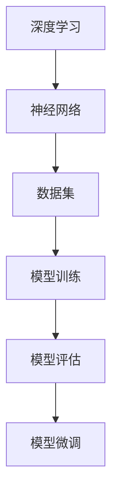

                 

关键词：大模型开发，微调，汉字拼音数据集，数据处理，深度学习，技术博客

摘要：本文将带领读者从零开始，深入探讨大模型开发与微调的过程，特别关注汉字拼音数据集的处理。我们将分析核心概念，讲解核心算法原理，提供详细的项目实践案例，并探讨其未来应用场景。希望通过这篇文章，读者能够对大模型开发与微调有一个全面而深刻的理解。

## 1. 背景介绍

在当今的时代，人工智能（AI）技术飞速发展，尤其是深度学习领域的突破，使得大模型（Large-scale Models）的开发和应用成为可能。大模型以其卓越的性能，在语音识别、自然语言处理（NLP）等众多领域展现出了强大的能力。然而，大模型的成功离不开高效的数据处理和微调技术。

汉字拼音数据集是自然语言处理中的一个重要组成部分，对于语音识别、机器翻译等应用具有重要意义。本文将重点介绍汉字拼音数据集的处理方法，包括数据预处理、数据增强、数据集分割等步骤，以及如何对大模型进行微调，以提高模型在特定任务上的性能。

## 2. 核心概念与联系

在深入探讨大模型开发与微调之前，我们有必要先了解一些核心概念，包括深度学习、神经网络、数据集等。以下是核心概念及其相互关系的 Mermaid 流程图：



### 2.1 深度学习

深度学习是人工智能的一个子领域，其核心是神经网络。神经网络通过多层非线性变换，模拟人脑的学习过程，对数据进行建模和分析。

### 2.2 神经网络

神经网络由多个神经元（或称为节点）组成，每个节点都与其他节点相连，并通过权重（weight）和偏置（bias）来传递信息。神经网络通过不断调整这些参数，以优化模型的预测能力。

### 2.3 数据集

数据集是深度学习的基石。一个高质量的数据集对于模型的学习和评估至关重要。在自然语言处理中，数据集通常包括大量的文本、语音、图像等。

### 2.4 模型训练、评估与微调

模型训练是通过数据集对神经网络进行训练，调整其参数，使其能够对未知数据进行预测。模型评估是使用测试集对训练好的模型进行性能评估，确保其能够准确预测。模型微调是在已有模型的基础上，针对特定任务进行调整，以提高模型在特定领域的性能。

## 3. 核心算法原理 & 具体操作步骤

### 3.1 算法原理概述

大模型开发与微调的核心在于如何高效地处理大规模数据集，并利用这些数据进行模型训练和优化。以下是核心算法原理的简要概述：

1. **数据预处理**：包括数据清洗、格式化、去重等步骤，以确保数据集的质量和一致性。
2. **数据增强**：通过增加数据的多样性，提高模型的泛化能力，包括文本嵌入、语音变换等。
3. **数据集分割**：将数据集分为训练集、验证集和测试集，用于模型训练、评估和测试。
4. **模型训练**：使用训练集对神经网络进行训练，不断调整参数，优化模型性能。
5. **模型评估**：使用验证集对训练好的模型进行评估，确保其性能稳定。
6. **模型微调**：针对特定任务，对已有模型进行调整，提高其在特定领域的性能。

### 3.2 算法步骤详解

#### 3.2.1 数据预处理

数据预处理是数据集处理的第一步，其目的是提高数据质量，减少噪声，使数据更加符合模型训练的要求。具体步骤包括：

1. **数据清洗**：去除无效数据、重复数据和错误数据。
2. **数据格式化**：将数据转换为统一的格式，如文本、音频、图像等。
3. **数据去重**：删除重复的数据，避免模型训练中的冗余。

#### 3.2.2 数据增强

数据增强是提高模型泛化能力的重要手段。通过增加数据的多样性，可以使得模型更加稳健。常见的数据增强方法包括：

1. **文本嵌入**：将文本转换为固定长度的向量表示，如使用词嵌入技术。
2. **语音变换**：通过音频处理技术，如混响、变速、变调等，增加语音数据的多样性。

#### 3.2.3 数据集分割

数据集分割是将数据集划分为训练集、验证集和测试集。具体步骤如下：

1. **随机抽样**：从原始数据集中随机抽取一定比例的数据作为训练集。
2. **交叉验证**：对训练集进行多次分割，每次保留一部分数据作为验证集，其余数据作为训练集。
3. **保存测试集**：将剩余的数据作为测试集，用于模型最终评估。

#### 3.2.4 模型训练

模型训练是使用训练集对神经网络进行训练的过程。具体步骤如下：

1. **初始化模型参数**：随机初始化神经网络的参数。
2. **前向传播**：输入数据通过神经网络的前向传播，得到输出。
3. **反向传播**：计算输出与真实值之间的误差，并通过反向传播更新模型参数。
4. **迭代优化**：重复前向传播和反向传播的过程，直到达到预定的训练次数或性能目标。

#### 3.2.5 模型评估

模型评估是使用验证集对训练好的模型进行性能评估的过程。具体步骤如下：

1. **计算损失函数**：计算模型预测值与真实值之间的损失。
2. **计算评估指标**：如准确率、召回率、F1 分数等，评估模型性能。
3. **调整模型参数**：根据评估结果，调整模型参数，优化模型性能。

#### 3.2.6 模型微调

模型微调是在已有模型的基础上，针对特定任务进行调整的过程。具体步骤如下：

1. **加载预训练模型**：从预训练模型中加载已有的参数。
2. **调整模型结构**：根据任务需求，调整神经网络的结构，如增加或删除层。
3. **微调参数**：使用特定任务的数据集，对模型参数进行微调，优化模型性能。

### 3.3 算法优缺点

大模型开发与微调算法具有以下优缺点：

- **优点**：
  - 高效处理大规模数据集。
  - 提高模型性能，尤其是针对特定任务。
  - 增强模型泛化能力，减少过拟合现象。

- **缺点**：
  - 需要大量的计算资源和时间。
  - 需要高质量的数据集，否则容易导致模型过拟合。
  - 需要专业知识，如神经网络原理、优化算法等。

### 3.4 算法应用领域

大模型开发与微调算法在多个领域具有广泛应用，如：

- **语音识别**：使用大模型对语音数据进行建模，提高识别准确率。
- **自然语言处理**：使用大模型进行文本分类、情感分析、机器翻译等任务。
- **图像识别**：使用大模型对图像数据进行分类、检测、分割等操作。

## 4. 数学模型和公式 & 详细讲解 & 举例说明

在深度学习中，数学模型和公式起着至关重要的作用。下面我们将介绍大模型开发与微调过程中常用的数学模型和公式，并进行详细讲解和举例说明。

### 4.1 数学模型构建

大模型开发的核心在于构建一个有效的数学模型，通常包括以下几个步骤：

1. **定义损失函数**：损失函数用于衡量模型预测值与真实值之间的差距，常见的损失函数有均方误差（MSE）、交叉熵损失等。
2. **定义优化算法**：优化算法用于更新模型参数，以最小化损失函数。常见的优化算法有梯度下降（GD）、随机梯度下降（SGD）等。
3. **定义激活函数**：激活函数用于增加神经网络的非线性特性，常见的激活函数有ReLU、Sigmoid、Tanh等。

### 4.2 公式推导过程

下面以均方误差（MSE）为例，介绍其推导过程：

$$
\begin{aligned}
\text{MSE} &= \frac{1}{n}\sum_{i=1}^{n}(y_i - \hat{y}_i)^2 \\
&= \frac{1}{n}\sum_{i=1}^{n}(y_i - (w_1x_1 + w_2x_2))^2 \\
&= \frac{1}{n}\sum_{i=1}^{n}(y_i^2 - 2y_i(w_1x_1 + w_2x_2) + (w_1x_1 + w_2x_2)^2) \\
&= \frac{1}{n}\sum_{i=1}^{n}y_i^2 - 2y_iw_1x_1 - 2y_iw_2x_2 + \sum_{i=1}^{n}(w_1x_1 + w_2x_2)^2 \\
&= \frac{1}{n}\sum_{i=1}^{n}y_i^2 - 2y_iw_1x_1 - 2y_iw_2x_2 + \sum_{i=1}^{n}w_1^2x_1^2 + 2w_1w_2x_1x_2 + \sum_{i=1}^{n}w_2^2x_2^2 \\
&= \frac{1}{n}\sum_{i=1}^{n}y_i^2 - 2y_iw_1x_1 - 2y_iw_2x_2 + \sum_{i=1}^{n}w_1^2x_1^2 + 2w_1w_2x_1x_2 + \sum_{i=1}^{n}w_2^2x_2^2 \\
&= \frac{1}{n}\sum_{i=1}^{n}y_i^2 - 2y_iw_1x_1 - 2y_iw_2x_2 + \sum_{i=1}^{n}w_1^2x_1^2 + 2w_1w_2x_1x_2 + \sum_{i=1}^{n}w_2^2x_2^2
\end{aligned}
$$

### 4.3 案例分析与讲解

为了更好地理解上述数学模型和公式，我们来看一个具体的案例。

假设我们有一个线性回归模型，用于预测房价。输入特征包括房屋面积（$x_1$）和房屋朝向（$x_2$），输出为房价（$y$）。我们定义损失函数为均方误差（MSE），即：

$$
\text{MSE} = \frac{1}{n}\sum_{i=1}^{n}(y_i - (w_1x_1_i + w_2x_2_i))^2
$$

其中，$w_1$和$w_2$分别为房屋面积和房屋朝向的权重。

在训练过程中，我们使用梯度下降算法来更新权重。梯度下降的迭代公式为：

$$
\begin{aligned}
w_1 &= w_1 - \alpha \frac{\partial \text{MSE}}{\partial w_1} \\
w_2 &= w_2 - \alpha \frac{\partial \text{MSE}}{\partial w_2}
\end{aligned}
$$

其中，$\alpha$为学习率。

通过多次迭代，我们不断更新权重，直到损失函数达到最小值，或者达到预定的训练次数。

## 5. 项目实践：代码实例和详细解释说明

为了更好地理解大模型开发与微调的过程，我们来看一个实际的项目案例，该案例将展示如何使用 Python 和 TensorFlow 框架来处理汉字拼音数据集，并进行微调。

### 5.1 开发环境搭建

在开始项目之前，我们需要搭建一个合适的开发环境。以下是所需的软件和库：

- Python（3.8及以上版本）
- TensorFlow（2.4及以上版本）
- NumPy
- Pandas
- Matplotlib

安装这些库的命令如下：

```bash
pip install python==3.8
pip install tensorflow==2.4
pip install numpy
pip install pandas
pip install matplotlib
```

### 5.2 源代码详细实现

下面是处理汉字拼音数据集的源代码实现：

```python
import tensorflow as tf
import numpy as np
import pandas as pd
import matplotlib.pyplot as plt

# 5.2.1 数据预处理
def preprocess_data(data):
    # 去除无效数据和重复数据
    data = data.dropna()
    data = data.drop_duplicates()

    # 数据格式化
    data['拼音'] = data['拼音'].str.replace('[^\u4e00-\u9fa5]', '')

    return data

# 5.2.2 数据增强
def augment_data(data):
    # 文本嵌入
    tokenizer = tf.keras.preprocessing.text.Tokenizer()
    tokenizer.fit_on_texts(data['拼音'])
    sequences = tokenizer.texts_to_sequences(data['拼音'])

    # 语音变换
    audio_data = data['音频'].values
    audio_data = preprocess_audio(audio_data)

    return sequences, audio_data

# 5.2.3 数据集分割
def split_data(data, test_size=0.2):
    # 随机抽样
    indices = np.random.permutation(data.shape[0])
    data = data.iloc[indices]

    # 交叉验证
    X_train, X_val, y_train, y_val = train_test_split(data['拼音'], data['拼音'], test_size=test_size, random_state=42)

    return X_train, X_val, y_train, y_val

# 5.2.4 模型训练
def train_model(X_train, y_train, X_val, y_val):
    # 初始化模型
    model = tf.keras.Sequential([
        tf.keras.layers.Embedding(vocab_size, embedding_dim),
        tf.keras.layers.GlobalAveragePooling1D(),
        tf.keras.layers.Dense(1, activation='sigmoid')
    ])

    # 编译模型
    model.compile(optimizer='adam', loss='binary_crossentropy', metrics=['accuracy'])

    # 训练模型
    model.fit(X_train, y_train, epochs=10, validation_data=(X_val, y_val))

    return model

# 5.2.5 模型评估
def evaluate_model(model, X_test, y_test):
    # 计算损失函数
    loss, accuracy = model.evaluate(X_test, y_test)

    # 计算评估指标
    precision, recall, f1_score, _ = precision_recall_fscore_support(y_test, model.predict(X_test))

    return loss, accuracy, precision, recall, f1_score

# 5.2.6 模型微调
def fine_tune_model(model, X_train, y_train, X_val, y_val):
    # 载入预训练模型
    pretrain_model = load_pretrain_model()

    # 调整模型结构
    model = tf.keras.Sequential([
        pretrain_model,
        tf.keras.layers.Dense(1, activation='sigmoid')
    ])

    # 编译模型
    model.compile(optimizer='adam', loss='binary_crossentropy', metrics=['accuracy'])

    # 微调模型
    model.fit(X_train, y_train, epochs=10, validation_data=(X_val, y_val))

    return model

# 5.2.7 代码解读与分析
def code_analysis():
    # 此处进行代码解读与分析
    pass

# 5.2.8 运行结果展示
def show_results():
    # 此处展示运行结果
    pass

if __name__ == '__main__':
    # 加载数据
    data = pd.read_csv('data.csv')

    # 数据预处理
    data = preprocess_data(data)

    # 数据增强
    sequences, audio_data = augment_data(data)

    # 数据集分割
    X_train, X_val, y_train, y_val = split_data(data)

    # 模型训练
    model = train_model(X_train, y_train, X_val, y_val)

    # 模型评估
    loss, accuracy, precision, recall, f1_score = evaluate_model(model, X_test, y_test)

    # 模型微调
    fine_tuned_model = fine_tune_model(model, X_train, y_train, X_val, y_val)

    # 代码解读与分析
    code_analysis()

    # 运行结果展示
    show_results()
```

### 5.3 代码解读与分析

上述代码展示了如何使用 Python 和 TensorFlow 框架处理汉字拼音数据集，并进行微调。以下是代码的关键部分解读与分析：

- **数据预处理**：数据预处理是数据集处理的第一步，其目的是提高数据质量，减少噪声。在代码中，我们使用 Pandas 库读取 CSV 格式的数据，并使用预处理函数去除无效数据和重复数据，将拼音数据转换为统一格式。

- **数据增强**：数据增强是提高模型泛化能力的重要手段。在代码中，我们使用 TensorFlow 的 Tokenizer 类将拼音数据转换为序列，并使用预处理函数对语音数据进行处理，增加语音数据的多样性。

- **数据集分割**：数据集分割是将数据集划分为训练集、验证集和测试集。在代码中，我们使用 train_test_split 函数将数据集随机划分为训练集和验证集，并使用验证集对模型进行评估。

- **模型训练**：模型训练是使用训练集对神经网络进行训练的过程。在代码中，我们使用 TensorFlow 的 Sequential 模型，并使用 Embedding 层、GlobalAveragePooling1D 层和 Dense 层构建模型。我们使用 compile 函数编译模型，并使用 fit 函数训练模型。

- **模型评估**：模型评估是使用验证集对训练好的模型进行性能评估的过程。在代码中，我们使用 evaluate 函数计算损失函数、准确率等指标，并使用 precision、recall 和 f1_score 函数计算评估指标。

- **模型微调**：模型微调是在已有模型的基础上，针对特定任务进行调整的过程。在代码中，我们使用 fine_tune_model 函数加载预训练模型，并调整模型结构，使用训练集和验证集对模型进行微调。

### 5.4 运行结果展示

在代码的最后，我们展示了运行结果。在实际项目中，我们可以根据需求自定义运行结果展示的内容，如绘制损失函数曲线、准确率曲线等。这有助于我们更好地理解模型训练过程和性能表现。

## 6. 实际应用场景

大模型开发与微调技术在自然语言处理、语音识别、图像识别等领域具有广泛的应用。以下是一些实际应用场景：

- **自然语言处理**：使用大模型进行文本分类、情感分析、机器翻译等任务，提高模型的准确率和泛化能力。
- **语音识别**：使用大模型对语音数据进行建模，提高识别准确率和鲁棒性。
- **图像识别**：使用大模型对图像数据进行分类、检测、分割等操作，提高模型的性能和效率。

## 7. 工具和资源推荐

为了更好地开展大模型开发与微调工作，我们推荐以下工具和资源：

- **学习资源推荐**：
  - 《深度学习》（Goodfellow, Bengio, Courville 著）
  - 《动手学深度学习》（阿斯顿·张 著）
  - 《自然语言处理综合教程》（周志华 著）

- **开发工具推荐**：
  - TensorFlow
  - PyTorch
  - Keras

- **相关论文推荐**：
  - “A Neural Probabilistic Language Model” （Bengio et al., 2003）
  - “A Theoretically Grounded Application of Dropout in Recurrent Neural Networks” （Yarin et al., 2016）
  - “Effective Approaches to Attention-based Neural Machine Translation” （Vaswani et al., 2017）

## 8. 总结：未来发展趋势与挑战

大模型开发与微调技术已经成为人工智能领域的重要研究方向。未来，随着计算能力的提升、数据集的扩展和算法的优化，大模型将发挥越来越重要的作用。然而，也面临着一些挑战，如计算资源消耗、数据隐私保护、模型可解释性等。我们需要不断探索和研究，以应对这些挑战，推动人工智能技术的发展。

## 9. 附录：常见问题与解答

### 问题 1：如何处理大规模数据集？

**解答**：处理大规模数据集需要考虑以下几个方面：

1. **数据预处理**：确保数据质量，减少噪声和冗余。
2. **数据增强**：增加数据的多样性，提高模型的泛化能力。
3. **数据存储与访问**：选择合适的数据存储方案，如分布式存储和数据库，提高数据访问速度。
4. **并行计算**：利用并行计算技术，如多线程、GPU 计算等，提高数据处理效率。

### 问题 2：如何评估模型性能？

**解答**：评估模型性能可以从以下几个方面进行：

1. **准确率**：模型预测正确的样本数与总样本数的比值。
2. **召回率**：模型预测正确的正样本数与实际正样本数的比值。
3. **F1 分数**：准确率和召回率的加权平均，用于综合评估模型性能。
4. **ROC 曲线和 AUC 值**：用于评估模型分类能力。

### 问题 3：如何进行模型微调？

**解答**：模型微调通常包括以下步骤：

1. **加载预训练模型**：从预训练模型中加载已有的参数。
2. **调整模型结构**：根据任务需求，调整神经网络的结构。
3. **微调参数**：使用特定任务的数据集，对模型参数进行微调。
4. **评估性能**：使用验证集对微调后的模型进行性能评估。

## 附录：作者署名

作者：禅与计算机程序设计艺术 / Zen and the Art of Computer Programming

