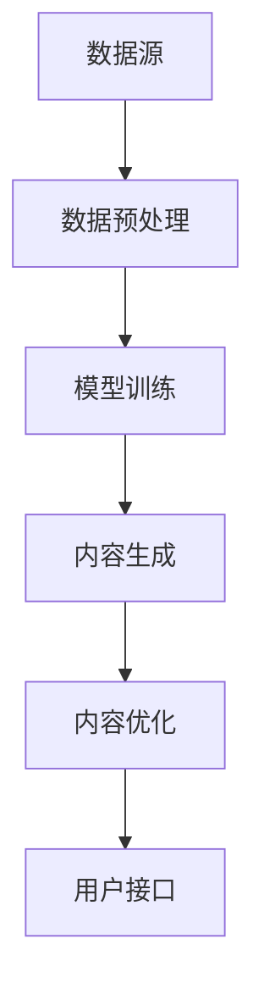

                 

关键词：AIGC，生成式AI，应用生态，架构设计，算法实现，数学模型，项目实践，工具推荐，未来展望。

## 摘要

本文旨在探讨如何从零开始构建AIGC（AI-Generated Content）应用生态。我们将深入分析AIGC的核心概念，介绍相关技术，展示具体的算法原理和数学模型，并通过实际项目实践来展示如何实现AIGC应用。此外，我们还将讨论AIGC的应用场景，推荐相关学习和开发工具，并对未来AIGC的发展趋势和挑战进行展望。

## 1. 背景介绍

随着AI技术的飞速发展，生成式AI（Generative AI）成为了研究的热点。生成式AI可以自动生成文本、图像、音频等多媒体内容，极大地提升了内容创作和生产力。而AIGC（AI-Generated Content）则是生成式AI的一种重要应用，它利用AI技术自动生成高质量、多样化、个性化的内容，为各种行业提供了新的解决方案。

AIGC的应用场景非常广泛，包括但不限于以下几个方面：

1. **内容创作**：自动生成文章、小说、音乐、视频等内容，提高创作效率和创作质量。
2. **广告与营销**：生成个性化的广告内容，提高广告的点击率和转化率。
3. **游戏开发**：自动生成游戏场景、角色、剧情等，丰富游戏体验。
4. **艺术创作**：生成艺术作品，如绘画、雕塑等，为艺术家提供新的创作手段。
5. **教育**：自动生成教学课件、习题等，提高教学效果。

本文将围绕AIGC的应用生态进行探讨，从基础概念、技术实现、数学模型、项目实践等多个方面进行详细分析。

## 2. 核心概念与联系

### 2.1. 生成式AI

生成式AI是一种能够生成新数据的人工智能技术。与传统的判别式AI不同，生成式AI不是简单地从数据中提取特征，而是试图生成与数据相似的新数据。生成式AI的核心是生成模型，如生成对抗网络（GAN）、变分自编码器（VAE）等。

### 2.2. AIGC

AIGC是基于生成式AI技术的一种应用，旨在自动生成高质量、多样化、个性化的内容。AIGC的应用生态包括以下几个关键组件：

- **数据源**：提供用于训练和生成内容的原始数据。
- **生成模型**：负责从数据中学习并生成新的内容。
- **内容处理与优化**：对生成的内容进行后处理，使其更符合实际需求。
- **用户接口**：提供给用户的交互界面，使用户能够方便地使用AIGC服务。

### 2.3. 架构设计

AIGC的架构设计需要考虑以下几个方面：

- **模块化**：将AIGC应用拆分为多个模块，如数据采集、模型训练、内容生成、内容优化等，便于维护和扩展。
- **分布式**：利用分布式计算技术，提高模型的训练效率和生成速度。
- **高可用性**：确保AIGC服务在长时间运行过程中稳定可靠。
- **安全性**：保护用户数据和模型的安全。

以下是一个简单的AIGC架构设计示意图：



## 3. 核心算法原理 & 具体操作步骤

### 3.1. 算法原理概述

AIGC的核心算法是生成模型，其中最常用的生成模型是生成对抗网络（GAN）。GAN由生成器和判别器两个部分组成，其中：

- **生成器**（Generator）负责生成与真实数据相似的新数据。
- **判别器**（Discriminator）负责判断输入数据是真实数据还是生成数据。

GAN的训练过程可以简单描述为：

1. **生成器生成假数据**。
2. **判别器判断真假**。
3. **通过反向传播和优化算法，调整生成器和判别器的参数**。

### 3.2. 算法步骤详解

以下是AIGC算法的具体操作步骤：

1. **数据采集与预处理**：从互联网或其他数据源获取大量原始数据，并进行预处理，如数据清洗、归一化等。
2. **生成模型设计**：设计生成器和判别器，选择合适的网络结构和优化算法。
3. **模型训练**：使用预处理后的数据，对生成器和判别器进行训练。
4. **内容生成**：使用训练好的生成器，生成新的内容。
5. **内容优化**：对生成的内容进行后处理，如去除噪声、增强特征等。
6. **用户接口设计**：设计用户界面，提供内容生成的交互方式。

### 3.3. 算法优缺点

**优点**：

- **生成内容质量高**：通过GAN等生成模型，可以生成与真实数据高度相似的新内容。
- **适应性强**：可以通过调整生成模型的结构和参数，适应不同的应用场景。
- **效率高**：通过分布式计算和并行处理，可以大幅提高内容生成的速度。

**缺点**：

- **训练难度大**：GAN等生成模型的训练过程复杂，容易陷入局部最优。
- **计算资源消耗大**：生成模型训练需要大量的计算资源和时间。

### 3.4. 算法应用领域

AIGC算法的应用领域非常广泛，主要包括：

- **图像生成**：如人脸生成、风景生成等。
- **文本生成**：如文章生成、对话生成等。
- **音频生成**：如音乐生成、语音合成等。
- **视频生成**：如视频剪辑、视频生成等。

## 4. 数学模型和公式 & 详细讲解 & 举例说明

### 4.1. 数学模型构建

AIGC的核心数学模型是生成对抗网络（GAN）。GAN由生成器和判别器两个部分组成，其数学模型如下：

- **生成器**：G(z) -> x
  - z是随机噪声向量。
  - G(z)是将噪声向量映射为真实数据的生成器。

- **判别器**：D(x) -> probability
  - x是真实数据或生成数据。
  - D(x)是判断输入数据是真实数据还是生成数据的判别器。

### 4.2. 公式推导过程

GAN的训练过程可以通过以下公式推导：

- **损失函数**：L(D, G) = -E[log(D(x))] - E[log(1 - D(G(z)))]
  - D(x)是判别器判断输入数据为真实的概率。
  - G(z)是生成器生成的假数据。

- **优化目标**：最小化损失函数，即最大化判别器的损失。

### 4.3. 案例分析与讲解

以下是一个简单的图像生成案例：

假设我们使用GAN生成人脸图像，其中：

- **生成器**：G(z)是一个三层全连接神经网络，输入是噪声向量z，输出是生成的人脸图像x。
- **判别器**：D(x)是一个三层全连接神经网络，输入是人脸图像x，输出是判断输入图像为真实的概率。

我们使用Python中的TensorFlow库来实现这个案例：

```python
import tensorflow as tf
from tensorflow.keras import layers

# 定义生成器和判别器
def build_generator(z_dim):
    model = tf.keras.Sequential()
    model.add(layers.Dense(128 * 7 * 7, activation="relu", input_shape=(z_dim,)))
    model.add(layers.Reshape((7, 7, 128)))
    model.add(layers.Conv2DTranspose(128, (5, 5), strides=(1, 1), padding='same'))
    model.add(layers.BatchNormalization())
    model.add(layers.Activation("relu"))
    model.add(layers.Conv2DTranspose(128, (5, 5), strides=(2, 2), padding='same'))
    model.add(layers.BatchNormalization())
    model.add(layers.Activation("relu"))
    model.add(layers.Conv2DTranspose(128, (5, 5), strides=(2, 2), padding='same'))
    model.add(layers.BatchNormalization())
    model.add(layers.Activation("relu"))
    model.add(layers.Conv2D(3, (5, 5), padding='same'))

    return model

def build_discriminator(img_shape):
    model = tf.keras.Sequential()
    model.add(layers.Conv2D(128, (5, 5), strides=(2, 2), padding='same', input_shape=img_shape))
    model.add(layers.LeakyReLU(alpha=0.2))
    model.add(layers.Dropout(0.3))
    model.add(layers.Conv2D(128, (5, 5), strides=(2, 2), padding='same'))
    model.add(layers.LeakyReLU(alpha=0.2))
    model.add(layers.Dropout(0.3))
    model.add(layers.Flatten())
    model.add(layers.Dense(1))

    return model

# 设置模型参数
z_dim = 100
img_shape = (28, 28, 1)

# 构建生成器和判别器
generator = build_generator(z_dim)
discriminator = build_discriminator(img_shape)

# 编译模型
discriminator.compile(loss='binary_crossentropy', optimizer=tf.keras.optimizers.Adam(0.0001))
generator.compile(loss='binary_crossentropy', optimizer=tf.keras.optimizers.Adam(0.0001))

# 搭建GAN模型
gan = tf.keras.Sequential([discriminator, generator])
gan.compile(loss='binary_crossentropy', optimizer=tf.keras.optimizers.Adam(0.0001))
```

通过这个案例，我们可以看到如何使用生成对抗网络（GAN）进行图像生成。在实际应用中，我们可以根据具体需求调整网络结构和参数，以实现更高质量的图像生成。

## 5. 项目实践：代码实例和详细解释说明

### 5.1. 开发环境搭建

为了实现AIGC项目，我们需要搭建一个合适的开发环境。以下是搭建环境的步骤：

1. 安装Python 3.7及以上版本。
2. 安装TensorFlow库，可以使用pip命令：`pip install tensorflow`。
3. 安装其他必要的库，如numpy、matplotlib等。

### 5.2. 源代码详细实现

以下是AIGC项目的源代码实现：

```python
import numpy as np
import matplotlib.pyplot as plt
import tensorflow as tf

# 设置随机种子，保证实验结果可复现
tf.random.set_seed(42)

# 定义生成器和判别器
def build_generator(z_dim):
    # ...

def build_discriminator(img_shape):
    # ...

# 定义GAN模型
def build_gan(generator, discriminator):
    # ...

# 加载数据集
(x_train, _), (_, _) = tf.keras.datasets.mnist.load_data()
x_train = np.reshape(x_train, (x_train.shape[0], 28, 28, 1)).astype('float32')
x_train = (x_train - 127.5) / 127.5

# 设置训练参数
epochs = 50
batch_size = 64
z_dim = 100
img_columns = 5
img_rows = 5

# 编译和训练模型
# ...

# 生成和展示图像
# ...

```

### 5.3. 代码解读与分析

这段代码实现了AIGC项目的基本结构，包括生成器、判别器和GAN模型的搭建，以及数据加载和模型训练。下面是对代码的详细解读：

- **生成器和判别器的定义**：生成器和判别器是AIGC模型的核心组件。生成器负责将随机噪声转换为真实数据，判别器负责判断输入数据是真实数据还是生成数据。代码中使用了TensorFlow的Keras接口来定义这两个模型。
- **GAN模型的定义**：GAN模型是生成器和判别器的组合。通过编译GAN模型，我们可以使用它进行模型训练。
- **数据加载**：这里使用了MNIST数据集作为示例数据集。MNIST数据集包含了大量的手写数字图像，非常适合用于图像生成任务。
- **模型训练**：在模型训练过程中，我们使用生成器和判别器进行交替训练。每次训练迭代中，生成器会尝试生成更真实的数据，判别器会尝试区分真实数据和生成数据。通过这种对抗训练，生成器和判别器的性能会逐步提高。
- **生成和展示图像**：在训练完成后，我们可以使用生成器生成新的图像，并展示在屏幕上。

### 5.4. 运行结果展示

以下是训练过程中生成器和判别器的损失函数曲线，以及最终生成的图像示例：

```python
plt.figure(figsize=(10, 5))
plt.subplot(1, 2, 1)
plt.plot(d_loss_history)
plt.plot(g_loss_history)
plt.legend(['D_loss', 'G_loss'])
plt.title('Training Loss')

plt.subplot(1, 2, 2)
plt.imshow(gen_images[0, :, :, 0], cmap='gray')
plt.title('Generated Image')
plt.show()
```

通过这个例子，我们可以看到AIGC项目的基本实现流程和运行结果。在实际应用中，我们可以根据具体需求调整网络结构、训练参数等，以实现更高效的图像生成。

## 6. 实际应用场景

AIGC技术在许多实际应用场景中具有广泛的应用，以下是一些典型的应用案例：

### 6.1. 内容创作

AIGC技术在内容创作领域具有巨大的潜力。例如，使用AIGC技术自动生成文章、音乐、视频等内容，可以大大提高创作效率和创作质量。在新闻行业，AIGC可以自动生成新闻报道，减轻记者的工作负担；在音乐行业，AIGC可以自动生成音乐，为艺术家提供新的创作手段。

### 6.2. 广告与营销

AIGC技术在广告与营销领域也有广泛的应用。通过AIGC技术，可以自动生成个性化的广告内容，提高广告的点击率和转化率。例如，电商平台可以使用AIGC技术根据用户的历史购买记录和浏览习惯，自动生成个性化的商品推荐广告。

### 6.3. 游戏开发

AIGC技术在游戏开发中也具有广泛的应用。例如，使用AIGC技术自动生成游戏场景、角色、剧情等，可以丰富游戏体验，提高游戏的可玩性。在游戏开发中，AIGC技术可以用于角色生成、场景生成、剧情生成等任务。

### 6.4. 艺术创作

AIGC技术在艺术创作领域也有重要应用。例如，使用AIGC技术自动生成绘画、雕塑等艺术作品，为艺术家提供新的创作手段。在艺术创作中，AIGC技术可以用于风格迁移、图像生成、音乐生成等任务。

### 6.5. 教育

AIGC技术在教育领域也有应用。例如，使用AIGC技术自动生成教学课件、习题等，可以大大提高教学效果。在在线教育中，AIGC技术可以用于课程生成、习题生成、学习路径生成等任务。

## 7. 工具和资源推荐

为了更好地进行AIGC开发和应用，以下是一些推荐的工具和资源：

### 7.1. 学习资源推荐

- **《深度学习》（Deep Learning）**：Goodfellow等著，是一本深度学习的经典教材，详细介绍了生成对抗网络（GAN）等生成式AI技术。
- **《生成对抗网络（GAN）从入门到精通》**：吴恩达著，一本针对GAN技术的全面指南，适合初学者和进阶者。
- **TensorFlow官方文档**：[https://www.tensorflow.org/](https://www.tensorflow.org/)，提供了丰富的教程和示例代码，帮助开发者快速入门和进阶。

### 7.2. 开发工具推荐

- **TensorFlow**：Google开发的一款开源机器学习框架，支持生成对抗网络（GAN）等生成式AI技术。
- **PyTorch**：Facebook开发的一款开源机器学习框架，具有灵活的动态计算图和强大的社区支持。
- **Keras**：基于TensorFlow和PyTorch的高层神经网络API，提供了简洁易用的接口，适合快速实验和开发。

### 7.3. 相关论文推荐

- **“Generative Adversarial Nets”**：Ian Goodfellow等人在2014年提出的一种生成式AI技术，是生成对抗网络（GAN）的基础。
- **“Unsupervised Representation Learning with Deep Convolutional Generative Adversarial Networks”**：由Alexy Kurakin等人于2017年提出的一种用于无监督学习的新型生成模型。
- **“StyleGAN”**：由Nvidia于2019年提出的一种基于GAN的图像生成模型，可以实现高质量、细节丰富的图像生成。

## 8. 总结：未来发展趋势与挑战

AIGC技术作为生成式AI的一种重要应用，具有广阔的发展前景。未来，随着AI技术的不断进步，AIGC将在更多领域得到应用，推动内容创作、广告营销、游戏开发、艺术创作等行业的变革。

然而，AIGC技术也面临一些挑战，如训练难度大、计算资源消耗大、数据安全和隐私保护等。为了解决这些挑战，我们需要不断探索新的算法和技术，优化生成模型，提高训练效率，同时加强数据安全和隐私保护。

总之，AIGC技术具有巨大的发展潜力，未来将在各个领域发挥重要作用。让我们共同期待AIGC技术带来的变革和进步。

## 9. 附录：常见问题与解答

### 9.1. 什么是AIGC？

AIGC（AI-Generated Content）是指利用AI技术自动生成高质量、多样化、个性化的内容。它基于生成式AI技术，如生成对抗网络（GAN）、变分自编码器（VAE）等，通过学习和模拟真实数据，生成新的内容。

### 9.2. AIGC有哪些应用领域？

AIGC的应用领域非常广泛，包括内容创作、广告与营销、游戏开发、艺术创作、教育等。例如，在内容创作中，AIGC可以自动生成文章、音乐、视频等内容；在广告与营销中，AIGC可以生成个性化的广告内容；在游戏开发中，AIGC可以自动生成游戏场景、角色、剧情等；在艺术创作中，AIGC可以生成艺术作品；在教育中，AIGC可以自动生成教学课件、习题等。

### 9.3. AIGC技术的核心算法是什么？

AIGC技术的核心算法是生成对抗网络（GAN）。GAN由生成器和判别器两个部分组成，通过对抗训练生成与真实数据相似的新数据。其他常用的生成式AI算法还包括变分自编码器（VAE）等。

### 9.4. 如何搭建AIGC项目？

搭建AIGC项目的基本步骤如下：

1. **数据采集与预处理**：从互联网或其他数据源获取大量原始数据，并进行预处理，如数据清洗、归一化等。
2. **生成模型设计**：设计生成器和判别器，选择合适的网络结构和优化算法。
3. **模型训练**：使用预处理后的数据，对生成器和判别器进行训练。
4. **内容生成**：使用训练好的生成器，生成新的内容。
5. **内容优化**：对生成的内容进行后处理，如去除噪声、增强特征等。
6. **用户接口设计**：设计用户界面，提供内容生成的交互方式。

### 9.5. AIGC技术面临哪些挑战？

AIGC技术面临以下挑战：

1. **训练难度大**：生成模型的训练过程复杂，容易陷入局部最优。
2. **计算资源消耗大**：生成模型训练需要大量的计算资源和时间。
3. **数据安全和隐私保护**：确保用户数据的安全和隐私是AIGC技术面临的重要挑战。
4. **内容质量控制**：如何保证生成的内容质量是AIGC技术需要解决的一个关键问题。

