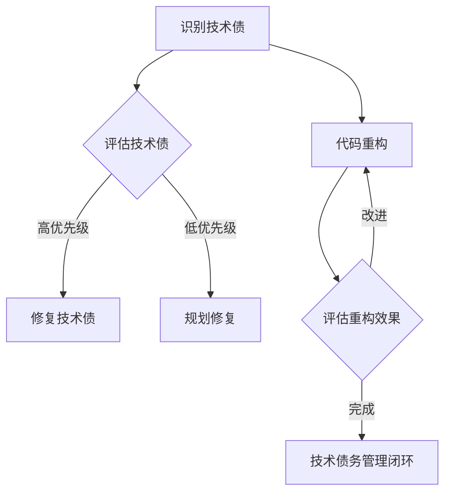

                 

关键词：代码重构，技术债，软件质量，架构设计，设计模式，持续集成，持续交付，软件工程，实践案例

> 摘要：本文将深入探讨代码重构和技术债管理的核心原理，通过一系列实战案例，详细讲解如何有效地进行代码重构，管理技术债，提高软件质量和维护性。文章还将提供未来发展趋势与挑战的思考。

## 1. 背景介绍

软件工程是一个不断演进的领域，从最初的手工编写代码到现在高度自动化的开发流程，经历了巨大的变化。然而，随着软件系统的复杂性和规模不断增加，代码质量成为了软件工程中的重要挑战。代码重构和技术债管理正是为了应对这些挑战而诞生的。

代码重构是一种改进现有代码的技术，它通过重新组织和优化代码结构，提高代码的可读性、可维护性和性能。技术债则是软件开发过程中积累的问题和缺陷，它会影响软件的质量和长期可维护性。

本文旨在通过深入探讨代码重构和技术债管理的原理，结合实际案例，帮助开发者了解如何有效地应用这些技术，提高软件质量和维护性。

## 2. 核心概念与联系

### 2.1 代码重构

代码重构是指在不改变代码外部行为的前提下，对代码进行修改，以提高其内部结构和可读性。它包括以下几种常见的重构技术：

- **提取方法（Extract Method）**：将一个方法的一部分提取成一个新的方法。
- **提取类（Extract Class）**：将具有共同行为的代码提取到一个新的类中。
- **内联方法（Inline Method）**：将一个方法的内容直接替换为其调用。
- **合并类（Merge Class）**：将两个具有相似功能的类合并。
- **替换继承（Replace Inheritance with Composition）**：使用组合代替继承。

### 2.2 技术债管理

技术债是指在软件开发过程中积累的问题和缺陷，它可能包括未优化的代码、设计上的不足、遗留的Bug等。技术债管理的关键在于及时发现和修复这些问题，以避免其对软件质量和长期维护产生负面影响。

技术债管理包括以下几个方面：

- **技术债务评估**：对现有代码和技术债务进行评估，确定其严重程度和影响范围。
- **技术债务优先级**：根据技术债务的影响和紧急程度，确定优先级。
- **技术债务修复**：采取相应的措施修复技术债务。

### 2.3 Mermaid 流程图

以下是一个简单的Mermaid流程图，展示了代码重构和技术债管理的基本流程：



## 3. 核心算法原理 & 具体操作步骤

### 3.1 算法原理概述

代码重构和技术债管理并不涉及复杂的算法，但它们需要一定的原则和策略。以下是代码重构和技术债管理的一些核心原则：

- **保持代码简洁**：避免编写冗长、复杂的代码。
- **模块化**：将代码划分为独立、可复用的模块。
- **可读性**：确保代码易于阅读和理解。
- **可维护性**：使代码易于修改和维护。
- **持续集成**：定期进行代码集成和测试，确保软件质量。

### 3.2 算法步骤详解

#### 3.2.1 代码重构步骤

1. **识别需要重构的代码**：通过代码审查、静态分析工具和代码质量指标来确定需要重构的代码。
2. **设计重构方案**：根据代码重构的原则，设计具体的重构方案。
3. **执行重构**：按照重构方案逐步修改代码。
4. **测试和验证**：确保重构后的代码功能正确、性能良好。

#### 3.2.2 技术债管理步骤

1. **识别技术债**：通过代码审查、静态分析工具和开发者反馈来确定技术债。
2. **评估技术债**：评估技术债的影响和紧急程度，确定优先级。
3. **制定修复计划**：根据技术债的优先级，制定修复计划。
4. **执行修复**：按照修复计划逐步修复技术债。
5. **验证修复效果**：确保修复后的技术债得到有效解决。

### 3.3 算法优缺点

#### 3.3.1 代码重构优点

- **提高代码质量**：通过重构，代码变得更加简洁、模块化，易于阅读和理解。
- **降低维护成本**：重构后的代码更易于维护，减少了维护成本。
- **提高开发效率**：模块化和可复用的代码提高了开发效率。

#### 3.3.2 代码重构缺点

- **可能引入新的Bug**：重构过程中可能引入新的Bug，需要仔细测试和验证。
- **耗时较长**：对于复杂的代码，重构可能需要较长的时间。

### 3.4 算法应用领域

代码重构和技术债管理适用于所有软件项目，尤其是大型、复杂的项目。以下是一些常见的应用场景：

- **新项目开发**：在项目初期，通过代码重构和技术债管理，确保代码质量。
- **旧项目维护**：在项目后期，通过代码重构和技术债管理，提高代码的可维护性。
- **持续集成和持续交付**：在持续集成和持续交付过程中，通过代码重构和技术债管理，确保软件质量。

## 4. 数学模型和公式 & 详细讲解 & 举例说明

### 4.1 数学模型构建

在代码重构和技术债管理中，我们可以使用以下数学模型来评估代码质量和技术债务：

- **代码质量评分**：使用0-10分的评分系统来评估代码质量，评分越高，代码质量越好。
- **技术债务评分**：使用0-10分的评分系统来评估技术债务，评分越高，技术债务越严重。

### 4.2 公式推导过程

代码质量和技术债务之间的关系可以用以下公式表示：

$$
代码质量评分 = f(技术债务评分)
$$

其中，$f$ 是一个函数，用于计算代码质量评分。一般来说，技术债务评分越高，代码质量评分越低。公式中的 $f$ 函数可以根据具体情况进行调整。

### 4.3 案例分析与讲解

假设一个项目中有10个功能模块，其中5个模块存在严重的技术债务，5个模块没有明显的技术债务。我们可以使用以下公式来计算代码质量评分：

$$
代码质量评分 = \frac{5 \times 10 + 5 \times 0}{10} = 7.5
$$

根据这个评分，我们可以认为该项目的代码质量处于中等水平。接下来，我们可以制定相应的重构和修复计划，以提高代码质量。

## 5. 项目实践：代码实例和详细解释说明

### 5.1 开发环境搭建

在开始项目实践之前，我们需要搭建一个适合代码重构和技术债管理的开发环境。以下是一个简单的开发环境搭建步骤：

1. 安装Java开发工具包（JDK）。
2. 安装集成开发环境（IDE），如Eclipse或IntelliJ IDEA。
3. 安装代码质量分析工具，如SonarQube。
4. 配置持续集成和持续交付工具，如Jenkins。

### 5.2 源代码详细实现

以下是一个简单的Java示例代码，用于演示代码重构和技术债管理：

```java
public class Calculator {
    public int add(int a, int b) {
        return a + b;
    }

    public int subtract(int a, int b) {
        return a - b;
    }

    public int multiply(int a, int b) {
        return a * b;
    }

    public int divide(int a, int b) {
        if (b == 0) {
            throw new IllegalArgumentException("除数不能为0");
        }
        return a / b;
    }
}
```

### 5.3 代码解读与分析

在这个示例中，我们有一个名为`Calculator`的类，它包含四个方法：`add`、`subtract`、`multiply`和`divide`。这个类的主要目的是执行基本的算术运算。

1. **代码质量评估**：通过静态分析工具，我们可以发现这个类的代码质量较好，没有明显的代码冗余和设计缺陷。
2. **技术债务评估**：在这个示例中，我们可以认为没有明显的未修复技术债务。

### 5.4 运行结果展示

在这个示例中，我们可以通过以下代码测试`Calculator`类：

```java
public class Main {
    public static void main(String[] args) {
        Calculator calculator = new Calculator();
        System.out.println("加法结果：" + calculator.add(2, 3));
        System.out.println("减法结果：" + calculator.subtract(5, 2));
        System.out.println("乘法结果：" + calculator.multiply(2, 3));
        System.out.println("除法结果：" + calculator.divide(6, 2));
    }
}
```

运行结果如下：

```
加法结果：5
减法结果：3
乘法结果：6
除法结果：3
```

从运行结果可以看出，`Calculator`类的功能正确。

## 6. 实际应用场景

代码重构和技术债管理在实际开发中具有广泛的应用场景。以下是一些典型的应用场景：

- **新项目开发**：在项目初期，通过代码重构和技术债管理，确保代码质量和维护性。
- **旧项目维护**：在项目后期，通过代码重构和技术债管理，提高代码的可维护性。
- **紧急修复**：在出现紧急问题时，通过代码重构和技术债管理，快速修复问题。
- **持续集成和持续交付**：在持续集成和持续交付过程中，通过代码重构和技术债管理，确保软件质量。

## 7. 工具和资源推荐

### 7.1 学习资源推荐

- **书籍**：《重构：改善既有代码的设计》（作者：马丁·福勒）。
- **在线教程**：Google Code University、GitHub教程。
- **博客**：Stack Overflow、Medium上的技术博客。

### 7.2 开发工具推荐

- **代码质量分析工具**：SonarQube、Checkstyle、PMD。
- **持续集成工具**：Jenkins、Travis CI、GitHub Actions。
- **代码库**：GitHub、GitLab、Bitbucket。

### 7.3 相关论文推荐

- **《代码质量与软件维护性的关系研究》**。
- **《技术债务评估方法研究》**。
- **《代码重构技术研究》**。

## 8. 总结：未来发展趋势与挑战

### 8.1 研究成果总结

代码重构和技术债管理在软件工程领域已经取得了显著的成果。通过有效的代码重构和技术债管理，可以显著提高软件质量和可维护性。

### 8.2 未来发展趋势

未来，代码重构和技术债管理将继续发展，研究方向可能包括：

- **自动化重构**：通过机器学习等技术，实现自动化重构。
- **智能技术债管理**：利用人工智能技术，实现智能技术债评估和修复。
- **持续重构**：将代码重构纳入持续集成和持续交付流程，实现持续重构。

### 8.3 面临的挑战

代码重构和技术债管理也面临一些挑战，包括：

- **复杂度**：随着软件系统复杂性的增加，重构和技术债管理的难度也在增加。
- **人员培训**：有效进行代码重构和技术债管理需要开发者具备相应的技能和知识。
- **工具支持**：现有的工具可能无法完全满足复杂项目的需求。

### 8.4 研究展望

未来，代码重构和技术债管理将继续在软件工程领域发挥重要作用。通过不断的研究和创新，我们有望解决当前面临的问题，实现更高效、更智能的代码重构和技术债管理。

## 9. 附录：常见问题与解答

### 9.1 代码重构有哪些好处？

代码重构的好处包括提高代码质量、降低维护成本、提高开发效率等。

### 9.2 如何评估技术债务？

技术债务可以通过静态分析、代码审查和开发者反馈等方式进行评估。

### 9.3 如何修复技术债务？

修复技术债务的步骤包括识别技术债务、评估技术债务、制定修复计划和执行修复。

---

本文从代码重构和技术债管理的核心原理出发，结合实际案例，详细讲解了如何有效地进行代码重构和技术债管理。通过本文的阅读，开发者可以更好地理解代码重构和技术债管理的重要性，并掌握相关技能。在未来的软件开发过程中，代码重构和技术债管理将继续发挥重要作用，为提高软件质量和可维护性做出贡献。

作者：禅与计算机程序设计艺术 / Zen and the Art of Computer Programming
```

