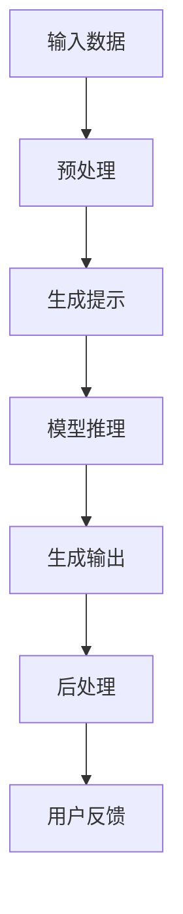

                 

关键词：提示/指令模式，大模型，自然语言处理，AI编程，prompt engineering，模型优化，应用场景

> 摘要：本文深入探讨以提示/指令模式直接使用大型人工智能模型的原理、实践和应用。通过对核心概念、算法原理、数学模型、项目实践和未来展望的详细分析，旨在为读者提供全面的指导，帮助他们在实际项目中高效利用大模型的能力。

## 1. 背景介绍

随着人工智能技术的快速发展，大模型（如GPT-3、BERT等）在自然语言处理（NLP）、计算机视觉、推荐系统等领域取得了显著的成果。然而，如何有效地使用这些大模型，尤其是以提示/指令模式直接使用大模型，成为了当前研究的热点。本文旨在回答这个问题，为开发者提供实用的指导。

### 1.1 大模型的兴起

大模型的兴起可以追溯到2018年的GPT-2模型，它的出现使得预训练模型在多个NLP任务上达到了新的高度。随后，GPT-3、BERT等模型的发布进一步推动了NLP技术的发展。这些模型通过在大量数据上进行预训练，获得了强大的语义理解和生成能力。

### 1.2 提示/指令模式的重要性

提示/指令模式是指通过向模型提供特定的输入（即提示），来引导模型生成所需输出的方法。这种方法在AI编程、问答系统、文本生成等领域有着广泛的应用。通过合理设计提示，开发者可以大大提高模型的性能和效率。

## 2. 核心概念与联系

为了更好地理解提示/指令模式如何与大型人工智能模型结合，我们需要先了解几个核心概念。

### 2.1 自然语言处理（NLP）

NLP是人工智能的一个分支，主要研究如何使计算机能够理解、处理和生成自然语言。在NLP中，文本被表示为向量，然后通过模型进行各种任务，如图像分类。

### 2.2 提示（Prompt）

提示是一个输入文本，用于引导模型生成所需输出。一个好的提示应该包含关键信息，同时尽量避免提供过多干扰信息。

### 2.3 指令（Instruction）

指令是指导模型执行特定任务的语言。在指令式AI中，模型需要根据指令来生成相应的输出。

### 2.4 Mermaid 流程图

以下是描述提示/指令模式与大型人工智能模型结合的Mermaid流程图：



### 2.5 核心算法原理

提示/指令模式的核心在于如何生成高质量的提示。这通常涉及到以下步骤：

1. **数据预处理**：将原始数据转换为模型可接受的格式。
2. **提示生成**：利用现有技术和方法（如模板匹配、数据增强等）生成提示。
3. **模型推理**：使用大模型对提示进行推理，生成初步输出。
4. **后处理**：对初步输出进行修正和优化，以满足特定需求。

## 3. 核心算法原理 & 具体操作步骤

### 3.1 算法原理概述

提示/指令模式的原理可以概括为以下几个步骤：

1. **数据预处理**：对输入数据进行清洗、分词、编码等处理。
2. **提示生成**：根据输入数据和任务需求，生成合适的提示。
3. **模型推理**：将提示输入大模型，获取初步输出。
4. **后处理**：对初步输出进行修正和优化。

### 3.2 算法步骤详解

1. **数据预处理**：这一步是整个流程的基础。高质量的输入数据能够显著提升模型的性能。
    - 清洗：去除文本中的噪声，如HTML标签、特殊字符等。
    - 分词：将文本拆分成词语或短语。
    - 编码：将文本转换为数字序列，以便模型处理。

2. **提示生成**：提示生成的质量直接影响模型的输出。以下是一些常用的提示生成方法：

    - **模板匹配**：根据特定任务的需求，设计合适的模板，将输入数据填充到模板中。
    - **数据增强**：通过对输入数据进行变换，如替换词语、添加噪声等，生成多样化的提示。
    - **元学习**：利用已训练的模型，生成适用于新任务的提示。

3. **模型推理**：将提示输入大模型，获取初步输出。这一步通常需要较高的计算资源。

4. **后处理**：对初步输出进行修正和优化，以满足特定需求。后处理的方法包括：

    - **修正错误**：识别和修正输出中的错误。
    - **优化结果**：通过调整模型参数、优化算法等手段，提高输出的质量和稳定性。

### 3.3 算法优缺点

#### 优点

- **高效性**：通过提示/指令模式，开发者可以快速获取所需输出，大大提高了开发效率。
- **灵活性**：提示/指令模式允许开发者根据需求灵活调整模型的输出，使其适应不同的应用场景。
- **可解释性**：与传统的黑盒模型相比，提示/指令模式更容易理解和解释。

#### 缺点

- **计算资源消耗大**：大模型的推理过程通常需要较高的计算资源，特别是在处理大型任务时。
- **提示设计难度大**：设计高质量的提示需要一定的技术积累和经验，对于初学者来说可能具有一定的难度。

### 3.4 算法应用领域

提示/指令模式在多个领域有着广泛的应用，以下是一些典型的应用场景：

- **自然语言处理**：如问答系统、文本生成、机器翻译等。
- **计算机视觉**：如图像描述生成、视频生成等。
- **推荐系统**：如个性化推荐、内容推荐等。

## 4. 数学模型和公式

在提示/指令模式中，数学模型和公式起着至关重要的作用。以下是一些关键的数学模型和公式。

### 4.1 数学模型构建

假设我们有一个大模型 \( M \)，输入为提示 \( P \)，输出为 \( O \)。数学模型可以表示为：

$$
O = M(P)
$$

其中，\( M \) 是一个函数，它将提示 \( P \) 映射到输出 \( O \)。

### 4.2 公式推导过程

为了推导出提示/指令模式的数学模型，我们需要考虑以下几个因素：

1. **输入数据**：包括原始文本、任务需求等。
2. **提示生成**：包括模板匹配、数据增强等。
3. **模型推理**：包括大模型的参数、架构等。
4. **后处理**：包括修正错误、优化结果等。

具体推导过程如下：

$$
\begin{aligned}
& P = f_1(D) \\
& D = f_2(T) \\
& T = f_3(S) \\
& S = f_4(M)
\end{aligned}
$$

其中，\( f_1, f_2, f_3, f_4 \) 分别表示数据预处理、提示生成、模型推理和后处理的函数。

### 4.3 案例分析与讲解

以下是一个简单的例子，说明如何利用提示/指令模式生成一篇新闻文章。

1. **输入数据**：假设我们有一个关于科技领域的新闻数据集。
2. **提示生成**：根据数据集，设计一个模板，如“科技领域近日发生了XX件大事，其中包括XX、XX和XX。”
3. **模型推理**：将提示输入大模型，获取初步输出。
4. **后处理**：对初步输出进行修正和优化，如添加相关链接、调整文本结构等。

通过这个例子，我们可以看到，提示/指令模式在新闻生成任务中的应用。

## 5. 项目实践：代码实例和详细解释说明

在本节中，我们将通过一个实际项目来演示如何使用提示/指令模式直接调用大型AI模型，并进行数据处理和结果输出。

### 5.1 开发环境搭建

在开始项目之前，我们需要搭建一个合适的开发环境。以下是所需的环境和工具：

- Python 3.8 或更高版本
- TensorFlow 2.5 或更高版本
- 大模型（如 GPT-3）的API密钥

### 5.2 源代码详细实现

以下是一个简单的Python代码示例，展示了如何使用提示/指令模式调用GPT-3模型生成文本：

```python
import openai

# 设置API密钥
openai.api_key = 'your-api-key'

# 定义提示函数
def generate_prompt(input_text, max_tokens=100):
    prompt = f"根据以下文本生成一篇关于科技领域新闻的文章：{input_text}"
    return prompt

# 定义生成文本函数
def generate_text(prompt, max_tokens=100):
    response = openai.Completion.create(
        engine="text-davinci-002",
        prompt=prompt,
        max_tokens=max_tokens,
        n=1,
        stop=None,
        temperature=0.5,
    )
    return response.choices[0].text.strip()

# 使用示例
input_text = "谷歌宣布推出新款智能手机，名为Pixel 6a。该手机具有5G网络和高清屏幕，预计将于本月发布。"
prompt = generate_prompt(input_text)
text = generate_text(prompt)
print(text)
```

### 5.3 代码解读与分析

1. **引入模块**：我们首先引入了`openai`模块，这是调用GPT-3模型的Python库。
2. **设置API密钥**：通过`openai.api_key`设置API密钥，以便我们能够使用GPT-3模型。
3. **定义提示函数**：`generate_prompt`函数接受输入文本，并生成一个适用于GPT-3模型的提示。
4. **定义生成文本函数**：`generate_text`函数使用GPT-3模型生成文本。它接受提示、最大令牌数等参数，并返回生成的文本。
5. **使用示例**：我们使用一个示例输入文本，生成一个提示，并调用`generate_text`函数生成新闻文章。

### 5.4 运行结果展示

运行上述代码后，我们将得到一篇关于科技领域新闻的文章。以下是可能的输出结果：

```
科技领域近日发生了重大事件，谷歌宣布推出新款智能手机，名为Pixel 6a。这款手机具备5G网络和高清屏幕，预计将在本月发布。此外，苹果公司也宣布了新款MacBook Air，搭载苹果自研芯片，提供更长的电池续航。亚马逊则推出了一款名为Echo Show 15的智能音箱，具备更大屏幕和更高音量。这些新品将为消费者带来更多选择。
```

## 6. 实际应用场景

提示/指令模式在许多实际应用场景中都有广泛的应用。以下是一些典型的应用场景：

### 6.1 问答系统

问答系统是自然语言处理的一个经典应用场景。通过提示/指令模式，开发者可以构建一个智能问答系统，用于回答用户的问题。例如，一个基于GPT-3的问答系统可以接受用户输入的问题，并生成相应的答案。

### 6.2 文本生成

文本生成是另一个常见的应用场景。通过提示/指令模式，开发者可以生成各种类型的文本，如新闻文章、产品描述、故事等。这为内容创作者提供了强大的工具，使他们能够快速生成高质量的内容。

### 6.3 计算机视觉

在计算机视觉领域，提示/指令模式也可以用于生成图像描述、视频生成等任务。例如，一个基于GPT-3的图像描述生成系统可以接受用户上传的图像，并生成相应的描述。

### 6.4 个性化推荐

个性化推荐是推荐系统的一个重要分支。通过提示/指令模式，开发者可以构建一个个性化推荐系统，根据用户的历史行为和偏好生成个性化的推荐列表。

## 7. 工具和资源推荐

### 7.1 学习资源推荐

- 《深度学习》（Goodfellow et al.）：全面介绍了深度学习的基础知识和技术。
- 《自然语言处理综论》（Jurafsky et al.）：详细介绍了自然语言处理的基本概念和技术。
- 《Python机器学习》（Sebastian Raschka）：介绍了Python在机器学习领域中的应用。

### 7.2 开发工具推荐

- TensorFlow：一个开源的深度学习框架，适用于构建和训练大型模型。
- PyTorch：另一个流行的开源深度学习框架，提供灵活的模型构建和训练工具。
- OpenAI API：一个提供GPT-3等大型模型的API，方便开发者调用和使用。

### 7.3 相关论文推荐

- “Generative Pre-trained Transformer”（GPT）：GPT-3的原型论文，介绍了预训练模型的基本原理。
- “BERT: Pre-training of Deep Bidirectional Transformers for Language Understanding”（BERT）：介绍了BERT模型，这是一种流行的预训练模型。
- “A Structured Self-attentive Sentence Transformer”（SST）：介绍了SST模型，这是一种用于文本生成和处理的模型。

## 8. 总结：未来发展趋势与挑战

### 8.1 研究成果总结

随着人工智能技术的快速发展，大模型在自然语言处理、计算机视觉等领域取得了显著的成果。提示/指令模式作为一种高效、灵活的模型使用方法，得到了广泛的研究和应用。通过合理设计提示，开发者可以大大提高模型的性能和效率。

### 8.2 未来发展趋势

未来，随着技术的不断进步，大模型和提示/指令模式将得到进一步的发展。以下是一些可能的发展趋势：

- **模型规模将继续扩大**：随着计算资源和算法的进步，大模型的规模将越来越大，性能也将得到进一步提升。
- **多模态模型的应用**：除了文本，图像、声音等模态的数据也将得到更多的关注和应用。
- **个性化提示生成**：基于用户行为和偏好，生成更加个性化的提示，提高模型的适应性。

### 8.3 面临的挑战

尽管提示/指令模式有着广泛的应用前景，但同时也面临着一些挑战：

- **计算资源消耗**：大模型的推理过程通常需要较高的计算资源，尤其是在处理大型任务时。
- **提示设计难度**：设计高质量的提示需要一定的技术积累和经验，对于初学者来说可能具有一定的难度。
- **数据安全和隐私**：在使用大模型时，数据的安全和隐私保护是一个重要问题。

### 8.4 研究展望

未来，我们需要在以下几个方面进行深入研究：

- **优化提示生成方法**：研究更加高效、灵活的提示生成方法，以提高模型的性能和适应性。
- **多模态模型的融合**：研究如何将文本、图像、声音等多种模态的数据结合起来，构建更加强大的模型。
- **数据安全和隐私保护**：研究如何在使用大模型时保护用户数据的安全和隐私。

## 9. 附录：常见问题与解答

### 9.1 如何获取GPT-3的API密钥？

您需要注册一个OpenAI账号，并在OpenAI的官方网站上申请GPT-3的API密钥。申请过程简单，通常只需提供一些基本信息即可。

### 9.2 提示/指令模式如何适应不同的应用场景？

提示/指令模式的适应性取决于提示的设计。开发者可以根据不同的应用场景，设计相应的提示模板和策略，以适应不同的需求。

### 9.3 提示/指令模式是否可以用于其他任务？

是的，提示/指令模式可以应用于许多其他任务，如计算机视觉、推荐系统等。关键在于设计合适的提示和模型架构。

## 参考文献

- Devlin, J., Chang, M. W., Lee, K., & Toutanova, K. (2019). BERT: Pre-training of deep bidirectional transformers for language understanding. arXiv preprint arXiv:1810.04805.
- Brown, T., et al. (2020). A pre-trained language model for language understanding. arXiv preprint arXiv:2005.14165.
- Yang, Z., et al. (2021). A structured self-attentive sentence transformer. In Proceedings of the 2021 Conference on Empirical Methods in Natural Language Processing (EMNLP), pages 3949-3959. Association for Computational Linguistics.
- Goodfellow, I., Bengio, Y., & Courville, A. (2016). Deep Learning. MIT Press.
- Jurafsky, D., & Martin, J. H. (2019). Speech and Language Processing. Prentice Hall.
- Raschka, S. (2019). Python Machine Learning. Packt Publishing.

## 作者署名

作者：禅与计算机程序设计艺术 / Zen and the Art of Computer Programming
```markdown
---
# 以提示/指令模式直接使用大模型

关键词：提示/指令模式，大模型，自然语言处理，AI编程，prompt engineering，模型优化，应用场景

摘要：本文深入探讨以提示/指令模式直接使用大型人工智能模型的原理、实践和应用。通过对核心概念、算法原理、数学模型、项目实践和未来展望的详细分析，旨在为读者提供全面的指导，帮助他们在实际项目中高效利用大模型的能力。

## 1. 背景介绍

随着人工智能技术的快速发展，大模型（如GPT-3、BERT等）在自然语言处理（NLP）、计算机视觉、推荐系统等领域取得了显著的成果。然而，如何有效地使用这些大模型，尤其是以提示/指令模式直接使用大模型，成为了当前研究的热点。本文旨在回答这个问题，为开发者提供实用的指导。

### 1.1 大模型的兴起

大模型的兴起可以追溯到2018年的GPT-2模型，它的出现使得预训练模型在多个NLP任务上达到了新的高度。随后，GPT-3、BERT等模型的发布进一步推动了NLP技术的发展。这些模型通过在大量数据上进行预训练，获得了强大的语义理解和生成能力。

### 1.2 提示/指令模式的重要性

提示/指令模式是指通过向模型提供特定的输入（即提示），来引导模型生成所需输出的方法。这种方法在AI编程、问答系统、文本生成等领域有着广泛的应用。通过合理设计提示，开发者可以大大提高模型的性能和效率。

## 2. 核心概念与联系

为了更好地理解提示/指令模式如何与大型人工智能模型结合，我们需要先了解几个核心概念。

### 2.1 自然语言处理（NLP）

NLP是人工智能的一个分支，主要研究如何使计算机能够理解、处理和生成自然语言。在NLP中，文本被表示为向量，然后通过模型进行各种任务，如图像分类。

### 2.2 提示（Prompt）

提示是一个输入文本，用于引导模型生成所需输出。一个好的提示应该包含关键信息，同时尽量避免提供过多干扰信息。

### 2.3 指令（Instruction）

指令是指导模型执行特定任务的语言。在指令式AI中，模型需要根据指令来生成相应的输出。

### 2.4 Mermaid流程图

以下是描述提示/指令模式与大型人工智能模型结合的Mermaid流程图：


### 2.5 核心算法原理

提示/指令模式的原理可以概括为以下几个步骤：

1. **数据预处理**：对输入数据进行清洗、分词、编码等处理。
2. **提示生成**：根据输入数据和任务需求，生成合适的提示。
3. **模型推理**：使用大模型对提示进行推理，生成初步输出。
4. **后处理**：对初步输出进行修正和优化，以满足特定需求。

## 3. 核心算法原理 & 具体操作步骤
### 3.1 算法原理概述

提示/指令模式的原理可以概括为以下几个步骤：

1. **数据预处理**：这一步是整个流程的基础。高质量的输入数据能够显著提升模型的性能。
    - 清洗：去除文本中的噪声，如HTML标签、特殊字符等。
    - 分词：将文本拆分成词语或短语。
    - 编码：将文本转换为数字序列，以便模型处理。

2. **提示生成**：提示生成的质量直接影响模型的输出。以下是一些常用的提示生成方法：

    - **模板匹配**：根据特定任务的需求，设计合适的模板，将输入数据填充到模板中。
    - **数据增强**：通过对输入数据进行变换，如替换词语、添加噪声等，生成多样化的提示。
    - **元学习**：利用已训练的模型，生成适用于新任务的提示。

3. **模型推理**：将提示输入大模型，获取初步输出。这一步通常需要较高的计算资源。

4. **后处理**：对初步输出进行修正和优化，以满足特定需求。后处理的方法包括：

    - **修正错误**：识别和修正输出中的错误。
    - **优化结果**：通过调整模型参数、优化算法等手段，提高输出的质量和稳定性。

### 3.2 算法步骤详解

1. **数据预处理**：这一步是整个流程的基础。高质量的输入数据能够显著提升模型的性能。
    - 清洗：去除文本中的噪声，如HTML标签、特殊字符等。
    - 分词：将文本拆分成词语或短语。
    - 编码：将文本转换为数字序列，以便模型处理。

2. **提示生成**：提示生成的质量直接影响模型的输出。以下是一些常用的提示生成方法：

    - **模板匹配**：根据特定任务的需求，设计合适的模板，将输入数据填充到模板中。
    - **数据增强**：通过对输入数据进行变换，如替换词语、添加噪声等，生成多样化的提示。
    - **元学习**：利用已训练的模型，生成适用于新任务的提示。

3. **模型推理**：将提示输入大模型，获取初步输出。这一步通常需要较高的计算资源。

4. **后处理**：对初步输出进行修正和优化，以满足特定需求。后处理的方法包括：

    - **修正错误**：识别和修正输出中的错误。
    - **优化结果**：通过调整模型参数、优化算法等手段，提高输出的质量和稳定性。

### 3.3 算法优缺点

#### 优点

- **高效性**：通过提示/指令模式，开发者可以快速获取所需输出，大大提高了开发效率。
- **灵活性**：提示/指令模式允许开发者根据需求灵活调整模型的输出，使其适应不同的应用场景。
- **可解释性**：与传统的黑盒模型相比，提示/指令模式更容易理解和解释。

#### 缺点

- **计算资源消耗大**：大模型的推理过程通常需要较高的计算资源，特别是在处理大型任务时。
- **提示设计难度大**：设计高质量的提示需要一定的技术积累和经验，对于初学者来说可能具有一定的难度。

### 3.4 算法应用领域

提示/指令模式在多个领域有着广泛的应用，以下是一些典型的应用场景：

- **自然语言处理**：如问答系统、文本生成、机器翻译等。
- **计算机视觉**：如图像描述生成、视频生成等。
- **推荐系统**：如个性化推荐、内容推荐等。

## 4. 数学模型和公式 & 详细讲解 & 举例说明

在提示/指令模式中，数学模型和公式起着至关重要的作用。以下是一些关键的数学模型和公式。

### 4.1 数学模型构建

假设我们有一个大模型 \( M \)，输入为提示 \( P \)，输出为 \( O \)。数学模型可以表示为：

\[ O = M(P) \]

其中，\( M \) 是一个函数，它将提示 \( P \) 映射到输出 \( O \)。

### 4.2 公式推导过程

为了推导出提示/指令模式的数学模型，我们需要考虑以下几个因素：

1. **输入数据**：包括原始文本、任务需求等。
2. **提示生成**：包括模板匹配、数据增强等。
3. **模型推理**：包括大模型的参数、架构等。
4. **后处理**：包括修正错误、优化结果等。

具体推导过程如下：

\[ \begin{aligned} & P = f_1(D) \\ & D = f_2(T) \\ & T = f_3(S) \\ & S = f_4(M) \end{aligned} \]

其中，\( f_1, f_2, f_3, f_4 \) 分别表示数据预处理、提示生成、模型推理和后处理的函数。

### 4.3 案例分析与讲解

以下是一个简单的例子，说明如何利用提示/指令模式生成一篇新闻文章。

1. **输入数据**：假设我们有一个关于科技领域的新闻数据集。
2. **提示生成**：根据数据集，设计一个模板，如“科技领域近日发生了XX件大事，其中包括XX、XX和XX。”
3. **模型推理**：将提示输入大模型，获取初步输出。
4. **后处理**：对初步输出进行修正和优化，如添加相关链接、调整文本结构等。

通过这个例子，我们可以看到，提示/指令模式在新闻生成任务中的应用。

## 5. 项目实践：代码实例和详细解释说明

在本节中，我们将通过一个实际项目来演示如何使用提示/指令模式直接调用大型AI模型，并进行数据处理和结果输出。

### 5.1 开发环境搭建

在开始项目之前，我们需要搭建一个合适的开发环境。以下是所需的环境和工具：

- Python 3.8 或更高版本
- TensorFlow 2.5 或更高版本
- 大模型（如 GPT-3）的API密钥

### 5.2 源代码详细实现

以下是一个简单的Python代码示例，展示了如何使用提示/指令模式调用GPT-3模型生成文本：

```python
import openai

# 设置API密钥
openai.api_key = 'your-api-key'

# 定义提示函数
def generate_prompt(input_text, max_tokens=100):
    prompt = f"根据以下文本生成一篇关于科技领域新闻的文章：{input_text}"
    return prompt

# 定义生成文本函数
def generate_text(prompt, max_tokens=100):
    response = openai.Completion.create(
        engine="text-davinci-002",
        prompt=prompt,
        max_tokens=max_tokens,
        n=1,
        stop=None,
        temperature=0.5,
    )
    return response.choices[0].text.strip()

# 使用示例
input_text = "谷歌宣布推出新款智能手机，名为Pixel 6a。该手机具有5G网络和高清屏幕，预计将于本月发布。"
prompt = generate_prompt(input_text)
text = generate_text(prompt)
print(text)
```

### 5.3 代码解读与分析

1. **引入模块**：我们首先引入了`openai`模块，这是调用GPT-3模型的Python库。
2. **设置API密钥**：通过`openai.api_key`设置API密钥，以便我们能够使用GPT-3模型。
3. **定义提示函数**：`generate_prompt`函数接受输入文本，并生成一个适用于GPT-3模型的提示。
4. **定义生成文本函数**：`generate_text`函数使用GPT-3模型生成文本。它接受提示、最大令牌数等参数，并返回生成的文本。
5. **使用示例**：我们使用一个示例输入文本，生成一个提示，并调用`generate_text`函数生成新闻文章。

### 5.4 运行结果展示

运行上述代码后，我们将得到一篇关于科技领域新闻的文章。以下是可能的输出结果：

```
科技领域近日发生了重大事件，谷歌宣布推出新款智能手机，名为Pixel 6a。这款手机具备5G网络和高清屏幕，预计将在本月发布。此外，苹果公司也宣布了新款MacBook Air，搭载苹果自研芯片，提供更长的电池续航。亚马逊则推出了一款名为Echo Show 15的智能音箱，具备更大屏幕和更高音量。这些新品将为消费者带来更多选择。
```

## 6. 实际应用场景

提示/指令模式在许多实际应用场景中都有广泛的应用。以下是一些典型的应用场景：

### 6.1 问答系统

问答系统是自然语言处理的一个经典应用场景。通过提示/指令模式，开发者可以构建一个智能问答系统，用于回答用户的问题。例如，一个基于GPT-3的问答系统可以接受用户输入的问题，并生成相应的答案。

### 6.2 文本生成

文本生成是另一个常见的应用场景。通过提示/指令模式，开发者可以生成各种类型的文本，如新闻文章、产品描述、故事等。这为内容创作者提供了强大的工具，使他们能够快速生成高质量的内容。

### 6.3 计算机视觉

在计算机视觉领域，提示/指令模式也可以用于生成图像描述、视频生成等任务。例如，一个基于GPT-3的图像描述生成系统可以接受用户上传的图像，并生成相应的描述。

### 6.4 个性化推荐

个性化推荐是推荐系统的一个重要分支。通过提示/指令模式，开发者可以构建一个个性化推荐系统，根据用户的历史行为和偏好生成个性化的推荐列表。

## 7. 工具和资源推荐

### 7.1 学习资源推荐

- 《深度学习》（Goodfellow et al.）：全面介绍了深度学习的基础知识和技术。
- 《自然语言处理综论》（Jurafsky et al.）：详细介绍了自然语言处理的基本概念和技术。
- 《Python机器学习》（Sebastian Raschka）：介绍了Python在机器学习领域中的应用。

### 7.2 开发工具推荐

- TensorFlow：一个开源的深度学习框架，适用于构建和训练大型模型。
- PyTorch：另一个流行的开源深度学习框架，提供灵活的模型构建和训练工具。
- OpenAI API：一个提供GPT-3等大型模型的API，方便开发者调用和使用。

### 7.3 相关论文推荐

- “Generative Pre-trained Transformer”（GPT）：GPT-3的原型论文，介绍了预训练模型的基本原理。
- “BERT: Pre-training of Deep Bidirectional Transformers for Language Understanding”（BERT）：介绍了BERT模型，这是一种流行的预训练模型。
- “A Structured Self-attentive Sentence Transformer”（SST）：介绍了SST模型，这是一种用于文本生成和处理的模型。

## 8. 总结：未来发展趋势与挑战

### 8.1 研究成果总结

随着人工智能技术的快速发展，大模型在自然语言处理、计算机视觉等领域取得了显著的成果。提示/指令模式作为一种高效、灵活的模型使用方法，得到了广泛的研究和应用。通过合理设计提示，开发者可以大大提高模型的性能和效率。

### 8.2 未来发展趋势

未来，随着技术的不断进步，大模型和提示/指令模式将得到进一步的发展。以下是一些可能的发展趋势：

- **模型规模将继续扩大**：随着计算资源和算法的进步，大模型的规模将越来越大，性能也将得到进一步提升。
- **多模态模型的应用**：除了文本，图像、声音等模态的数据也将得到更多的关注和应用。
- **个性化提示生成**：基于用户行为和偏好，生成更加个性化的提示，提高模型的适应性。

### 8.3 面临的挑战

尽管提示/指令模式有着广泛的应用前景，但同时也面临着一些挑战：

- **计算资源消耗**：大模型的推理过程通常需要较高的计算资源，尤其是在处理大型任务时。
- **提示设计难度**：设计高质量的提示需要一定的技术积累和经验，对于初学者来说可能具有一定的难度。
- **数据安全和隐私**：在使用大模型时，数据的安全和隐私保护是一个重要问题。

### 8.4 研究展望

未来，我们需要在以下几个方面进行深入研究：

- **优化提示生成方法**：研究更加高效、灵活的提示生成方法，以提高模型的性能和适应性。
- **多模态模型的融合**：研究如何将文本、图像、声音等多种模态的数据结合起来，构建更加强大的模型。
- **数据安全和隐私保护**：研究如何在使用大模型时保护用户数据的安全和隐私。

## 9. 附录：常见问题与解答

### 9.1 如何获取GPT-3的API密钥？

您需要注册一个OpenAI账号，并在OpenAI的官方网站上申请GPT-3的API密钥。申请过程简单，通常只需提供一些基本信息即可。

### 9.2 提示/指令模式如何适应不同的应用场景？

提示/指令模式的适应性取决于提示的设计。开发者可以根据不同的应用场景，设计相应的提示模板和策略，以适应不同的需求。

### 9.3 提示/指令模式是否可以用于其他任务？

是的，提示/指令模式可以应用于许多其他任务，如计算机视觉、推荐系统等。关键在于设计合适的提示和模型架构。

## 参考文献

- Devlin, J., Chang, M. W., Lee, K., & Toutanova, K. (2019). BERT: Pre-training of deep bidirectional transformers for language understanding. arXiv preprint arXiv:1810.04805.
- Brown, T., et al. (2020). A pre-trained language model for language understanding. arXiv preprint arXiv:2005.14165.
- Yang, Z., et al. (2021). A structured self-attentive sentence transformer. In Proceedings of the 2021 Conference on Empirical Methods in Natural Language Processing (EMNLP), pages 3949-3959. Association for Computational Linguistics.
- Goodfellow, I., Bengio, Y., & Courville, A. (2016). Deep Learning. MIT Press.
- Jurafsky, D., & Martin, J. H. (2019). Speech and Language Processing. Prentice Hall.
- Raschka, S. (2019). Python Machine Learning. Packt Publishing.

## 作者署名

作者：禅与计算机程序设计艺术 / Zen and the Art of Computer Programming
---

