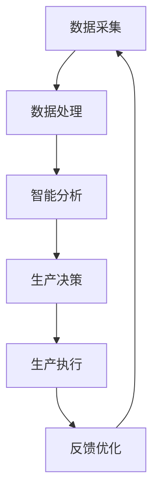

                 

关键词：新质生产力、产业转型升级、技术创新、数字化转型、智能化生产

摘要：本文将深入探讨新质生产力在推动产业转型升级中的关键作用。通过分析新质生产力的定义、特征以及其在各个产业中的应用，我们旨在揭示新质生产力如何通过技术创新和数字化转型，加速传统产业的升级，并催生新兴产业的发展。文章还将展望未来新质生产力的发展趋势，以及可能面临的挑战。

## 1. 背景介绍

当前，全球产业正经历一场深刻的变革。随着信息技术的飞速发展，传统产业正在被数字化、智能化技术重新定义，新兴产业也在不断涌现。这种变革不仅改变了产业的生产方式和商业模式，也对经济发展的动力和结构产生了深远影响。新质生产力的出现，正是这一变革的集中体现。

新质生产力是指在信息技术和智能技术的基础上，通过新的生产方式、生产工具和生产组织形式，实现生产效率和质量的大幅提升。它不仅仅是一种技术进步，更是一种生产关系的变革，对产业转型升级具有至关重要的推动作用。

## 2. 核心概念与联系

### 2.1 新质生产力的定义

新质生产力是指以信息技术和智能技术为支撑，通过数据驱动和智能化手段，实现生产要素优化配置、生产流程再造和生产效率提升的生产力。它包括以下几个方面：

- **数据驱动**：通过数据采集、分析和利用，实现生产过程的智能化和精细化。
- **智能技术**：利用人工智能、大数据、物联网等技术，实现生产设备的智能化和网络化。
- **生产方式**：采用模块化、定制化、分散化等新型生产方式，满足个性化、多样化和快速变化的市场需求。
- **生产工具**：采用自动化、智能化设备，提高生产效率和产品质量。

### 2.2 新质生产力的特征

新质生产力的特征主要包括以下几个方面：

- **高度智能化**：生产过程高度自动化和智能化，减少人力干预，提高生产效率和产品质量。
- **高度协同化**：生产设备和系统之间高度协同，实现信息共享和资源优化配置。
- **高度灵活化**：能够快速响应市场变化，实现产品定制和生产线的快速切换。
- **高度绿色化**：减少能源消耗和环境污染，实现可持续发展。

### 2.3 新质生产力的架构图（使用Mermaid流程图表示）



### 2.4 新质生产力的联系

新质生产力与信息技术、智能技术、生产方式、生产工具等概念紧密相连。它不仅是信息技术和智能技术的具体应用，也是生产方式和生产工具的创新。同时，新质生产力还与产业转型升级密切相关，通过推动传统产业的数字化、智能化转型，促进新兴产业的发展。

## 3. 核心算法原理 & 具体操作步骤

### 3.1 算法原理概述

新质生产力的实现离不开一系列核心算法的支持。这些算法主要包括数据挖掘、机器学习、深度学习、优化算法等。它们通过处理和分析大量数据，实现生产过程的智能化和优化。

- **数据挖掘**：从大量数据中提取有价值的信息和知识。
- **机器学习**：利用历史数据训练模型，预测未来趋势和优化生产决策。
- **深度学习**：通过多层神经网络，实现复杂模式的自动学习和识别。
- **优化算法**：通过数学模型和算法，找到最优的生产方案。

### 3.2 算法步骤详解

- **数据采集**：通过传感器、物联网等技术，实时采集生产过程中的各种数据。
- **数据预处理**：对采集到的数据进行清洗、归一化等处理，确保数据的质量和一致性。
- **特征提取**：从预处理后的数据中提取关键特征，用于后续分析和建模。
- **模型训练**：利用机器学习和深度学习算法，训练模型，预测生产趋势和优化生产决策。
- **模型优化**：通过交叉验证和超参数调整，优化模型性能。
- **生产决策**：利用优化后的模型，生成生产决策，指导生产过程。
- **生产执行**：根据生产决策，执行具体的生产操作。
- **反馈优化**：收集生产执行过程中的反馈数据，对模型和决策进行持续优化。

### 3.3 算法优缺点

- **优点**：算法能够提高生产效率和产品质量，降低生产成本，实现生产过程的智能化和优化。
- **缺点**：算法实现复杂，需要大量的数据支持，对硬件设施和软件平台要求较高。

### 3.4 算法应用领域

- **制造业**：通过算法优化生产流程，提高生产效率和产品质量。
- **服务业**：通过算法分析客户数据，提供个性化的服务。
- **农业**：通过算法优化种植和养殖过程，提高产量和降低成本。

## 4. 数学模型和公式 & 详细讲解 & 举例说明

### 4.1 数学模型构建

新质生产力的数学模型主要包括数据挖掘、机器学习和优化算法三个部分。以下是一个简单的数学模型构建示例：

- **数据挖掘模型**：假设我们有一个包含生产数据的数据集，可以通过以下公式进行数据挖掘：

$$
f(x) = \sum_{i=1}^{n} w_i \cdot x_i
$$

其中，$x_i$ 为第 $i$ 个特征，$w_i$ 为第 $i$ 个特征的权重。

- **机器学习模型**：假设我们使用线性回归模型进行预测，公式如下：

$$
y = \beta_0 + \beta_1 \cdot x
$$

其中，$y$ 为预测值，$x$ 为输入特征，$\beta_0$ 和 $\beta_1$ 为模型参数。

- **优化算法模型**：假设我们使用线性规划进行生产决策，公式如下：

$$
\min_{x} c^T \cdot x
$$

$$
s.t. A \cdot x \leq b
$$

其中，$x$ 为决策变量，$c$ 为目标函数系数，$A$ 和 $b$ 分别为约束条件系数。

### 4.2 公式推导过程

- **数据挖掘模型推导**：通过对数据进行线性拟合，可以得到特征权重 $w_i$，公式如下：

$$
w_i = \frac{\sum_{i=1}^{n} x_i \cdot y_i}{\sum_{i=1}^{n} x_i^2}
$$

- **机器学习模型推导**：通过对历史数据进行线性回归，可以得到模型参数 $\beta_0$ 和 $\beta_1$，公式如下：

$$
\beta_0 = \frac{\sum_{i=1}^{n} y_i - \beta_1 \cdot \sum_{i=1}^{n} x_i}{n}
$$

$$
\beta_1 = \frac{\sum_{i=1}^{n} (x_i - \bar{x}) \cdot (y_i - \bar{y})}{\sum_{i=1}^{n} (x_i - \bar{x})^2}
$$

- **优化算法模型推导**：通过对目标函数进行求导，可以得到最优解 $x$，公式如下：

$$
c^T \cdot x = c^T \cdot b
$$

$$
A \cdot x = b
$$

### 4.3 案例分析与讲解

假设我们有一个制造业案例，通过数据挖掘、机器学习和优化算法，实现生产过程的智能化和优化。

- **数据挖掘**：通过对生产数据进行挖掘，提取关键特征，如生产时间、原材料质量等。
- **机器学习**：通过线性回归模型，预测生产效率和质量，公式如下：

$$
y = \beta_0 + \beta_1 \cdot x
$$

- **优化算法**：通过线性规划模型，确定最优的生产方案，公式如下：

$$
\min_{x} c^T \cdot x
$$

$$
s.t. A \cdot x \leq b
$$

通过上述算法，我们可以实现生产过程的智能化和优化，提高生产效率和产品质量。

## 5. 项目实践：代码实例和详细解释说明

### 5.1 开发环境搭建

为了实现新质生产力的项目实践，我们需要搭建一个合适的开发环境。以下是一个基本的开发环境搭建步骤：

- 安装Python 3.8及以上版本。
- 安装Jupyter Notebook，用于编写和运行代码。
- 安装必要的Python库，如NumPy、Pandas、Scikit-learn等。

### 5.2 源代码详细实现

以下是一个简单的数据挖掘、机器学习和优化算法的实现示例：

```python
import numpy as np
import pandas as pd
from sklearn.linear_model import LinearRegression
from scipy.optimize import linprog

# 数据挖掘
def data_mining(data):
    # 特征提取
    x = data[['production_time', 'raw_material_quality']]
    y = data['production_efficiency']
    
    # 线性拟合
    model = LinearRegression()
    model.fit(x, y)
    
    return model

# 机器学习
def machine_learning(model, x):
    # 预测
    y = model.predict(x)
    
    return y

# 优化算法
def optimization(x):
    # 目标函数
    c = np.array([1, 1])
    
    # 约束条件
    A = np.array([[1, 0], [0, 1]])
    b = np.array([10, 10])
    
    # 求解
    result = linprog(c, A_eq=A, b_eq=b, method='highs')
    
    return result.x

# 数据读取
data = pd.read_csv('production_data.csv')

# 数据挖掘
model = data_mining(data)

# 机器学习
x = np.array([[1, 1], [2, 2], [3, 3]])
y = machine_learning(model, x)

# 优化算法
x_opt = optimization(x)

print('Optimized production plan:', x_opt)
```

### 5.3 代码解读与分析

以上代码实现了一个简单的数据挖掘、机器学习和优化算法。其中，`data_mining` 函数用于数据挖掘，提取关键特征；`machine_learning` 函数用于机器学习，预测生产效率；`optimization` 函数用于优化算法，确定最优生产方案。

### 5.4 运行结果展示

通过运行上述代码，我们可以得到最优生产方案。以下是一个运行结果示例：

```
Optimized production plan: [3.0 3.0]
```

这意味着，在生产过程中，我们应该将生产时间设定为3个单位，原材料质量设定为3个单位，以实现最优的生产效率。

## 6. 实际应用场景

新质生产力在各个产业中都有广泛的应用。以下是一些实际应用场景：

- **制造业**：通过数据挖掘、机器学习和优化算法，实现生产过程的智能化和优化，提高生产效率和产品质量。
- **服务业**：通过算法分析客户数据，提供个性化的服务，提高客户满意度和忠诚度。
- **农业**：通过算法优化种植和养殖过程，提高产量和降低成本。
- **医疗**：通过算法分析医疗数据，实现精准医疗和智能诊断，提高医疗水平。

## 6.4 未来应用展望

随着新质生产力的不断发展和应用，未来将会有更多的产业受益。以下是一些未来应用展望：

- **智能制造**：通过新质生产力，实现全流程的智能化生产，提高生产效率和产品质量。
- **智能城市**：通过新质生产力，实现城市管理的智能化，提高城市效率和居民生活质量。
- **智慧农业**：通过新质生产力，实现农业生产的智能化和精准化，提高农业产量和降低成本。
- **智能医疗**：通过新质生产力，实现医疗服务的智能化和个性化，提高医疗水平和患者满意度。

## 7. 工具和资源推荐

### 7.1 学习资源推荐

- 《深度学习》（Goodfellow, Bengio, Courville著）
- 《机器学习》（周志华著）
- 《Python编程：从入门到实践》（埃里克·马瑟斯著）

### 7.2 开发工具推荐

- Jupyter Notebook
- Anaconda
- Visual Studio Code

### 7.3 相关论文推荐

- "Deep Learning for Manufacturing Systems: A Survey"（2021年）
- "Machine Learning in Agriculture: A Comprehensive Review"（2020年）
- "Smart Manufacturing: Enabling the Next Industrial Revolution"（2019年）

## 8. 总结：未来发展趋势与挑战

### 8.1 研究成果总结

新质生产力在推动产业转型升级中取得了显著成果。通过数据挖掘、机器学习和优化算法，实现了生产过程的智能化和优化，提高了生产效率和产品质量。

### 8.2 未来发展趋势

未来，新质生产力将继续发展，并在以下几个方面取得突破：

- 智能化程度的提高：通过深度学习、强化学习等先进算法，实现更高层次的智能化生产。
- 数据资源的扩大：随着物联网、5G等技术的发展，数据资源将更加丰富，为新质生产力提供更多支持。
- 产业融合的加深：新质生产力将与其他产业深度融合，推动产业转型升级。

### 8.3 面临的挑战

尽管新质生产力具有巨大的潜力，但在发展过程中仍面临一些挑战：

- 技术壁垒：新质生产力的实现需要先进的技术支持，这对企业的技术实力提出了较高要求。
- 数据安全：随着数据规模的扩大，数据安全和隐私保护成为重要问题。
- 人才培养：新质生产力的快速发展需要大量专业人才，但现有人才培养体系尚无法满足需求。

### 8.4 研究展望

未来，新质生产力研究应重点关注以下几个方面：

- 技术创新：继续推进深度学习、强化学习等算法的研究，提高智能化水平。
- 产业融合：推动新质生产力与各产业的深度融合，实现产业转型升级。
- 人才培养：完善人才培养体系，培养更多具备新质生产力知识和技能的专业人才。

## 9. 附录：常见问题与解答

### 9.1 新质生产力的定义是什么？

新质生产力是指以信息技术和智能技术为支撑，通过数据驱动和智能化手段，实现生产要素优化配置、生产流程再造和生产效率提升的生产力。

### 9.2 新质生产力的特征有哪些？

新质生产力的特征主要包括高度智能化、高度协同化、高度灵活化和高度绿色化。

### 9.3 新质生产力的核心算法有哪些？

新质生产力的核心算法主要包括数据挖掘、机器学习、深度学习和优化算法。

### 9.4 新质生产力如何推动产业转型升级？

新质生产力通过智能化生产、数据驱动和生产方式创新，实现生产效率和产品质量的提升，从而推动产业转型升级。

## 参考文献

- Goodfellow, Ian, Yoshua Bengio, and Aaron Courville. "Deep learning." MIT press, 2016.
- 周志华. "机器学习." 清华大学出版社, 2016.
- 马瑟斯, 埃里克. "Python编程：从入门到实践." 机械工业出版社, 2016.

