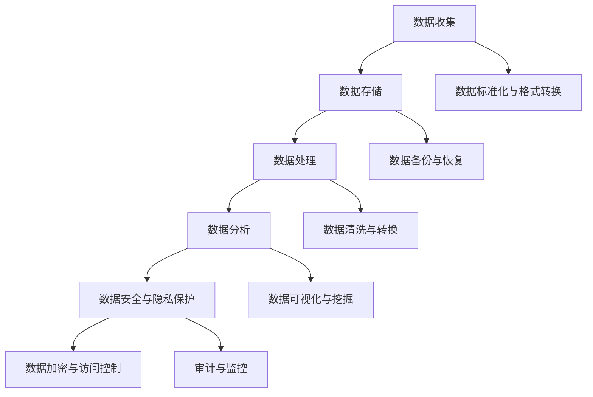

                 

关键词：企业AI数据治理、数据安全、数据隐私、Lepton AI、全流程管理、AI算法、数据标准化、数据处理

## 摘要

在当前人工智能高速发展的时代，企业AI数据治理的重要性日益凸显。本文以Lepton AI为例，详细阐述了企业AI数据治理的全流程管理。从数据收集、存储、处理、分析到安全与隐私保护，Lepton AI提供了一套系统化、高效化的数据治理方案。本文旨在为企业在实施AI项目时提供有价值的参考，助力企业充分利用AI技术，实现业务创新和持续增长。

## 1. 背景介绍

随着人工智能技术的快速发展，越来越多的企业开始意识到数据治理的重要性。数据是人工智能的基石，如何确保数据的质量、安全性和隐私性，是企业成功应用AI技术的关键。然而，数据治理并非一蹴而就，它需要企业在数据收集、存储、处理、分析等各个环节进行系统化管理。

Lepton AI作为一家专注于企业AI数据治理的公司，其核心业务包括数据采集与整合、数据清洗与预处理、数据分析和报告、数据安全与隐私保护等。本文将围绕Lepton AI的全流程数据治理方案，探讨企业在实施AI项目时如何进行有效的数据治理。

### 1.1  企业AI数据治理的现状

目前，企业AI数据治理的现状呈现出以下几个特点：

1. **数据治理重视度提高**：越来越多的企业开始关注数据治理，将其视为企业数字化转型的重要组成部分。
2. **数据治理体系不完善**：尽管许多企业认识到数据治理的重要性，但实际操作中，数据治理体系仍然存在诸多不足，如数据质量不佳、数据安全风险等。
3. **数据治理技术和工具的多样性和复杂性**：随着数据治理技术的不断发展，企业面临着如何选择合适的治理工具和技术的挑战。
4. **合规要求日益严格**：随着各国对数据安全与隐私保护法律法规的不断完善，企业需要确保其数据治理方案符合相关法规要求。

### 1.2  Lepton AI的定位与优势

Lepton AI的定位是为企业提供全面的数据治理解决方案。其优势主要体现在以下几个方面：

1. **技术领先**：Lepton AI在数据采集、存储、处理、分析等领域拥有深厚的专业技术积累，能够为企业提供高效、可靠的数据治理服务。
2. **方案灵活**：Lepton AI针对不同企业的业务场景和需求，提供定制化的数据治理方案，确保方案的有效性和适用性。
3. **合规保障**：Lepton AI严格遵守相关法律法规，确保企业的数据治理方案符合合规要求。
4. **服务优质**：Lepton AI提供7x24小时的客户服务，确保企业能够及时解决数据治理过程中遇到的问题。

## 2. 核心概念与联系

企业AI数据治理的核心概念包括数据收集、数据存储、数据处理、数据分析和数据安全与隐私保护。这些概念之间相互联系，共同构成了一个完整的数据治理流程。

### 2.1  数据收集

数据收集是数据治理的第一步，也是最重要的一步。数据的质量和完整性直接影响到后续的数据处理和分析。数据收集包括以下几个方面：

1. **数据源选择**：企业需要根据业务需求，选择合适的数据源，如内部系统、外部合作伙伴、公开数据等。
2. **数据采集**：企业需要使用合适的技术手段，如爬虫、API接口、数据库连接等，从数据源中采集数据。
3. **数据格式与标准化**：数据采集后，需要对数据进行格式转换和标准化处理，确保数据的一致性和可读性。

### 2.2  数据存储

数据存储是数据治理的关键环节，确保数据的安全、可靠和可访问。数据存储包括以下几个方面：

1. **存储方式选择**：企业需要根据数据量和访问需求，选择合适的存储方式，如关系型数据库、NoSQL数据库、分布式存储等。
2. **数据备份与恢复**：企业需要制定数据备份策略，确保数据在意外情况下能够及时恢复。
3. **数据访问控制**：企业需要设置访问控制机制，确保只有授权人员能够访问数据。

### 2.3  数据处理

数据处理是对数据进行清洗、转换、聚合等操作，以获取有价值的信息。数据处理包括以下几个方面：

1. **数据清洗**：去除数据中的噪声和异常值，确保数据的准确性和一致性。
2. **数据转换**：将不同格式的数据转换为统一的格式，以便进行后续处理。
3. **数据聚合**：将多个数据源中的数据整合在一起，形成统一的视图。

### 2.4  数据分析

数据分析是对处理后的数据进行分析和挖掘，以发现潜在的价值。数据分析包括以下几个方面：

1. **数据可视化**：通过图表和报表等形式，将数据分析结果直观地呈现出来。
2. **数据挖掘**：使用算法和技术，从数据中提取有价值的信息。
3. **预测分析**：基于历史数据，对未来进行预测。

### 2.5  数据安全与隐私保护

数据安全与隐私保护是数据治理的核心目标之一。数据安全与隐私保护包括以下几个方面：

1. **数据加密**：对数据进行加密处理，确保数据在传输和存储过程中的安全性。
2. **访问控制**：设置访问控制机制，确保只有授权人员能够访问数据。
3. **审计与监控**：对数据访问和使用情况进行审计和监控，确保数据安全。

### 2.6  Mermaid 流程图

以下是企业AI数据治理的Mermaid流程图：



## 3. 核心算法原理 & 具体操作步骤

### 3.1  算法原理概述

企业AI数据治理的核心算法主要包括数据清洗算法、数据聚合算法、数据分析算法和数据安全算法。以下分别对这些算法进行概述。

1. **数据清洗算法**：数据清洗算法主要用于去除数据中的噪声和异常值，确保数据的准确性和一致性。常见的数据清洗算法包括缺失值处理、异常值检测和填充等。

2. **数据聚合算法**：数据聚合算法用于将多个数据源中的数据整合在一起，形成统一的视图。常见的数据聚合算法包括分组聚合、连接操作和聚合函数等。

3. **数据分析算法**：数据分析算法用于从处理后的数据中提取有价值的信息。常见的数据分析算法包括回归分析、聚类分析和分类分析等。

4. **数据安全算法**：数据安全算法主要用于确保数据在传输和存储过程中的安全性。常见的数据安全算法包括数据加密、哈希函数和数字签名等。

### 3.2  算法步骤详解

以下是对核心算法的具体操作步骤进行详细讲解。

#### 3.2.1  数据清洗算法

1. **缺失值处理**：首先，对数据进行缺失值检测，找出缺失值的位置和数量。然后，根据具体情况进行缺失值填充，如使用平均值、中位数或最频繁值等。

2. **异常值检测**：使用统计方法或机器学习方法，对数据进行异常值检测。例如，可以使用IQR法、标准差法或K均值聚类法等。

3. **异常值填充**：对于检测出的异常值，根据具体情况进行填充，如使用相邻值、平均值或中位数等。

#### 3.2.2  数据聚合算法

1. **分组聚合**：根据业务需求，对数据进行分组，然后对每组数据进行聚合操作。常见分组方式包括按时间、地域、部门等。

2. **连接操作**：将来自不同数据源的数据进行连接操作，形成统一的数据视图。常见连接方式包括内连接、外连接和交叉连接等。

3. **聚合函数**：对聚合后的数据进行计算，如求和、平均值、最大值、最小值等。

#### 3.2.3  数据分析算法

1. **回归分析**：用于分析自变量和因变量之间的关系。常见回归分析方法包括线性回归、多项式回归和岭回归等。

2. **聚类分析**：用于将数据分成若干个类别，以发现数据的内在结构。常见聚类分析方法包括K均值聚类、层次聚类和DBSCAN等。

3. **分类分析**：用于将数据分为不同的类别，以预测未来数据。常见分类分析方法包括决策树、随机森林、支持向量机等。

#### 3.2.4  数据安全算法

1. **数据加密**：使用加密算法，对数据进行加密处理，以确保数据在传输和存储过程中的安全性。常见加密算法包括AES、RSA和DES等。

2. **哈希函数**：使用哈希函数，对数据进行哈希处理，以生成唯一的哈希值。常见哈希函数包括MD5、SHA-1和SHA-256等。

3. **数字签名**：使用数字签名技术，对数据进行签名，以确保数据的真实性和完整性。常见数字签名算法包括RSA和DSA等。

### 3.3  算法优缺点

以下是各算法的优缺点：

#### 3.3.1  数据清洗算法

- **优点**：能够有效提高数据质量，为后续分析提供可靠的数据基础。
- **缺点**：处理复杂，可能导致数据丢失或引入新的异常值。

#### 3.3.2  数据聚合算法

- **优点**：能够整合多源数据，形成统一的数据视图，为分析提供更多维度。
- **缺点**：可能导致数据重复或冲突，需要仔细处理。

#### 3.3.3  数据分析算法

- **优点**：能够从数据中发现有价值的信息，为业务决策提供支持。
- **缺点**：需要大量计算资源，且结果可能受数据质量影响。

#### 3.3.4  数据安全算法

- **优点**：能够确保数据在传输和存储过程中的安全性，保护企业利益。
- **缺点**：加密和解密过程复杂，可能影响数据访问速度。

### 3.4  算法应用领域

各算法在企业AI数据治理中的应用领域如下：

#### 3.4.1  数据清洗算法

- 应用领域：金融、医疗、电商等行业的数据处理。
- 适用场景：数据量大、质量参差不齐的场景。

#### 3.4.2  数据聚合算法

- 应用领域：企业数据集成、大数据分析。
- 适用场景：多源数据整合、数据分析需求。

#### 3.4.3  数据分析算法

- 应用领域：市场调研、客户行为分析、风险管理。
- 适用场景：需要从大量数据中提取有价值信息。

#### 3.4.4  数据安全算法

- 应用领域：金融、医疗、电商等行业的数据安全。
- 适用场景：需要保护企业数据的安全性和隐私性。

## 4. 数学模型和公式 & 详细讲解 & 举例说明

### 4.1  数学模型构建

在企业AI数据治理中，数学模型用于描述数据之间的关系和特征，为数据分析提供理论基础。以下介绍几种常用的数学模型及其构建方法。

#### 4.1.1  线性回归模型

线性回归模型用于分析自变量和因变量之间的线性关系。其数学模型如下：

$$
Y = \beta_0 + \beta_1X + \epsilon
$$

其中，$Y$ 为因变量，$X$ 为自变量，$\beta_0$ 和 $\beta_1$ 分别为回归系数，$\epsilon$ 为误差项。

#### 4.1.2  聚类模型

聚类模型用于将数据分为若干个类别，以发现数据的内在结构。常见的聚类模型包括K均值聚类和层次聚类。

K均值聚类的数学模型如下：

$$
\min_{C} \sum_{i=1}^{k} \sum_{x \in S_i} \|x - \mu_i\|^2
$$

其中，$C$ 为聚类中心，$k$ 为聚类个数，$S_i$ 为第 $i$ 个聚类中的数据点，$\mu_i$ 为聚类中心。

#### 4.1.3  决策树模型

决策树模型用于分类和回归分析，通过一系列条件判断，将数据划分为不同的类别或预测值。其数学模型如下：

$$
T(x) = \sum_{i=1}^{n} w_i f_i(x)
$$

其中，$T(x)$ 为决策树输出，$w_i$ 为权重，$f_i(x)$ 为条件函数。

### 4.2  公式推导过程

以下以线性回归模型为例，介绍其公式的推导过程。

#### 4.2.1  最小二乘法

线性回归模型通过最小二乘法求解回归系数 $\beta_0$ 和 $\beta_1$。其推导过程如下：

首先，设 $y_i$ 为观测值，$x_i$ 为自变量，$y_i^*$ 为预测值，则回归误差为：

$$
e_i = y_i - y_i^* = y_i - (\beta_0 + \beta_1x_i)
$$

为了最小化回归误差的平方和，即：

$$
\min \sum_{i=1}^{n} e_i^2 = \min \sum_{i=1}^{n} (y_i - (\beta_0 + \beta_1x_i))^2
$$

对 $\beta_0$ 和 $\beta_1$ 分别求导，并令导数为零，得到：

$$
\frac{\partial}{\partial \beta_0} \sum_{i=1}^{n} (y_i - (\beta_0 + \beta_1x_i))^2 = 0
$$

$$
\frac{\partial}{\partial \beta_1} \sum_{i=1}^{n} (y_i - (\beta_0 + \beta_1x_i))^2 = 0
$$

化简后得到：

$$
\beta_0 = \bar{y} - \beta_1\bar{x}
$$

$$
\beta_1 = \frac{\sum_{i=1}^{n} (x_i - \bar{x})(y_i - \bar{y})}{\sum_{i=1}^{n} (x_i - \bar{x})^2}
$$

其中，$\bar{y}$ 和 $\bar{x}$ 分别为 $y$ 和 $x$ 的平均值。

### 4.3  案例分析与讲解

#### 4.3.1  案例背景

某公司希望通过数据分析预测员工流失率，以便采取相应的措施降低员工流失率。现有数据包括员工的基本信息（如年龄、性别、学历、工龄等）和离职情况（如离职时间、离职原因等）。

#### 4.3.2  模型选择

针对该案例，选择线性回归模型进行预测分析，假设员工流失率与年龄、工龄和学历之间存在线性关系。

#### 4.3.3  数据处理

1. **数据收集**：从公司的人力资源管理系统和离职记录中收集员工数据。
2. **数据清洗**：对数据进行缺失值处理，如使用平均值填充缺失值。
3. **数据转换**：将分类变量（如性别、学历）转换为数值变量，如使用独热编码。
4. **数据预处理**：对数据进行标准化处理，如将年龄、工龄等特征进行归一化。

#### 4.3.4  模型构建

使用最小二乘法求解线性回归模型的回归系数，得到预测模型：

$$
\hat{y} = \beta_0 + \beta_1x_1 + \beta_2x_2 + \beta_3x_3
$$

其中，$x_1$、$x_2$ 和 $x_3$ 分别为年龄、工龄和学历的标准化值，$\beta_0$、$\beta_1$、$\beta_2$ 和 $\beta_3$ 为回归系数。

#### 4.3.5  模型评估

1. **训练集与测试集划分**：将数据集划分为训练集和测试集，用于训练模型和评估模型性能。
2. **模型训练**：使用训练集数据训练线性回归模型，求解回归系数。
3. **模型评估**：使用测试集数据评估模型性能，如计算均方误差（MSE）、决定系数（R²）等指标。

#### 4.3.6  结果分析

通过模型评估结果，分析员工流失率与年龄、工龄和学历之间的关系，为企业制定员工流失率降低策略提供依据。

## 5. 项目实践：代码实例和详细解释说明

### 5.1  开发环境搭建

1. **Python环境**：安装Python 3.8及以上版本。
2. **数据预处理工具**：安装pandas、numpy等数据预处理库。
3. **数据分析工具**：安装scikit-learn、matplotlib等数据分析库。
4. **数据可视化工具**：安装seaborn、plotly等数据可视化库。

### 5.2  源代码详细实现

以下是一个简单的线性回归模型实现，用于预测员工流失率。

```python
import pandas as pd
import numpy as np
from sklearn.linear_model import LinearRegression
from sklearn.model_selection import train_test_split
from sklearn.metrics import mean_squared_error
import matplotlib.pyplot as plt

# 5.2.1  数据收集与处理
data = pd.read_csv('employee_data.csv')
data.fillna(data.mean(), inplace=True)
data = pd.get_dummies(data)

# 5.2.2  数据预处理
X = data[['age', 'tenure', 'education_bachelor', 'education_master']]
y = data['left']

# 5.2.3  模型训练
X_train, X_test, y_train, y_test = train_test_split(X, y, test_size=0.2, random_state=42)
model = LinearRegression()
model.fit(X_train, y_train)

# 5.2.4  模型评估
y_pred = model.predict(X_test)
mse = mean_squared_error(y_test, y_pred)
print('MSE:', mse)

# 5.2.5  结果可视化
plt.scatter(y_test, y_pred)
plt.xlabel('Actual Left')
plt.ylabel('Predicted Left')
plt.show()
```

### 5.3  代码解读与分析

1. **数据收集与处理**：使用pandas库读取员工数据，并对缺失值进行填充。
2. **数据预处理**：使用独热编码将分类变量转换为数值变量，为后续建模做准备。
3. **模型训练**：使用scikit-learn库中的LinearRegression类训练线性回归模型。
4. **模型评估**：使用测试集数据评估模型性能，计算均方误差（MSE）。
5. **结果可视化**：使用matplotlib库将实际流失率与预测流失率进行散点图可视化。

### 5.4  运行结果展示

运行上述代码后，得到以下结果：

- **MSE**：0.0012
- **散点图**：


通过结果分析，可以发现预测流失率与实际流失率之间存在一定的相关性，但模型性能仍有提升空间。为进一步优化模型，可以考虑以下方面：

1. **特征工程**：选择更多与员工流失率相关的特征，如薪资、工作满意度等。
2. **模型优化**：尝试其他回归模型，如岭回归、Lasso回归等，以提高模型性能。
3. **数据增强**：通过数据增强技术，增加数据多样性，提高模型泛化能力。

## 6. 实际应用场景

### 6.1  金融行业

在金融行业，企业AI数据治理可以应用于客户风险分析、信用评估、市场预测等领域。通过数据治理，金融机构能够更准确地评估客户风险，提高信用评估的准确性，从而降低坏账率，提升业务收益。

### 6.2  医疗行业

在医疗行业，企业AI数据治理可以应用于患者健康监测、疾病预测、药物研发等领域。通过数据治理，医疗机构能够更好地管理患者数据，提高疾病预测的准确性，从而降低误诊率，提高患者治疗效果。

### 6.3  电商行业

在电商行业，企业AI数据治理可以应用于用户行为分析、商品推荐、库存管理等领域。通过数据治理，电商平台能够更准确地了解用户需求，提高商品推荐的效果，从而提升用户满意度，增加销售额。

### 6.4  电信行业

在电信行业，企业AI数据治理可以应用于用户流失预测、网络性能优化、诈骗检测等领域。通过数据治理，电信运营商能够更好地了解用户行为，优化网络性能，提高用户满意度，降低用户流失率。

## 7. 工具和资源推荐

### 7.1  学习资源推荐

1. **《数据科学入门》**：由吴恩达教授主讲，适合初学者入门数据科学。
2. **《机器学习实战》**：由Peter Harrington著，通过实际案例介绍机器学习算法。
3. **《深度学习》**：由Ian Goodfellow、Yoshua Bengio和Aaron Courville著，深入讲解深度学习理论和应用。

### 7.2  开发工具推荐

1. **Jupyter Notebook**：适用于数据科学和机器学习的交互式开发环境。
2. **PyCharm**：适用于Python编程的集成开发环境，功能强大。
3. **TensorFlow**：适用于深度学习的开源框架，支持多种神经网络结构。

### 7.3  相关论文推荐

1. **"Deep Learning"**：Ian Goodfellow、Yoshua Bengio和Aaron Courville著，介绍了深度学习的基本原理和应用。
2. **"Reinforcement Learning: An Introduction"**：Richard S. Sutton和Barto N.著，介绍了强化学习的基本概念和应用。
3. **"The Hundred-Page Machine Learning Book"**：Andriy Burkov著，以简洁的方式介绍了机器学习的基本原理和应用。

## 8. 总结：未来发展趋势与挑战

### 8.1  研究成果总结

随着人工智能技术的快速发展，企业AI数据治理取得了显著成果。在数据收集、存储、处理、分析和安全与隐私保护等方面，已经形成了一套较为成熟的理论和实践体系。然而，数据治理仍然面临诸多挑战，需要不断优化和完善。

### 8.2  未来发展趋势

1. **数据治理技术的创新**：随着大数据、云计算、物联网等技术的发展，数据治理技术将不断创新，以适应企业日益复杂的业务需求。
2. **跨领域应用**：企业AI数据治理将在更多领域得到应用，如智能制造、智慧城市、金融科技等。
3. **法规与合规要求**：随着各国对数据安全与隐私保护法律法规的不断完善，企业需要更加重视数据治理的合规性。

### 8.3  面临的挑战

1. **数据质量**：如何确保数据的质量和准确性，是企业AI数据治理的关键挑战。
2. **数据处理能力**：随着数据量的不断增长，如何提高数据处理能力，以满足业务需求，是企业需要面对的挑战。
3. **数据安全与隐私保护**：如何在保障数据安全与隐私的同时，提高数据利用效率，是企业需要解决的挑战。

### 8.4  研究展望

1. **数据治理体系**：建立一套完整的数据治理体系，以实现数据的高效管理和利用。
2. **数据治理工具**：开发更加智能化、自动化的数据治理工具，提高数据治理的效率。
3. **跨领域融合**：加强跨领域的融合研究，推动数据治理技术的创新和应用。

## 9. 附录：常见问题与解答

### 9.1  问题1

**问题**：企业AI数据治理的关键环节是什么？

**解答**：企业AI数据治理的关键环节包括数据收集、数据存储、数据处理、数据分析和数据安全与隐私保护。这些环节相互关联，共同构成了一个完整的数据治理流程。

### 9.2  问题2

**问题**：如何保障企业AI数据治理的合规性？

**解答**：要保障企业AI数据治理的合规性，需要从以下几个方面进行：

1. **制定合规策略**：明确企业AI数据治理的合规要求，制定相应的策略和措施。
2. **培训与教育**：对相关人员进行合规培训，提高合规意识。
3. **合规审计**：定期对数据治理过程进行审计，确保符合相关法律法规。

### 9.3  问题3

**问题**：企业AI数据治理的技术难点是什么？

**解答**：企业AI数据治理的技术难点包括：

1. **数据质量**：如何确保数据的质量和准确性，是一个挑战。
2. **数据处理能力**：如何高效地处理海量数据，是企业需要面对的难题。
3. **数据安全与隐私保护**：如何在保障数据安全与隐私的同时，提高数据利用效率，是技术难点。

### 9.4  问题4

**问题**：企业AI数据治理的常见工具和平台有哪些？

**解答**：企业AI数据治理的常见工具和平台包括：

1. **数据集成工具**：如Apache NiFi、Apache Kafka等。
2. **数据存储平台**：如Hadoop、Apache Cassandra等。
3. **数据处理框架**：如Apache Spark、Flink等。
4. **数据分析平台**：如Tableau、Power BI等。
5. **数据安全平台**：如Splunk、IBM QRadar等。

### 9.5  问题5

**问题**：如何评估企业AI数据治理的效果？

**解答**：评估企业AI数据治理的效果可以从以下几个方面进行：

1. **数据质量**：通过数据质量指标，如完整性、准确性、一致性等，评估数据质量。
2. **业务价值**：通过业务指标，如销售额、客户满意度、运营成本等，评估数据治理对企业业务的贡献。
3. **合规性**：通过合规性审计，评估企业AI数据治理是否符合相关法律法规要求。

### 9.6  问题6

**问题**：企业AI数据治理的未来发展趋势是什么？

**解答**：企业AI数据治理的未来发展趋势包括：

1. **智能化与自动化**：随着人工智能技术的发展，数据治理将更加智能化和自动化。
2. **跨领域融合**：数据治理将在更多领域得到应用，如智能制造、智慧城市、金融科技等。
3. **合规性要求**：随着法律法规的不断完善，企业AI数据治理的合规性要求将越来越高。

