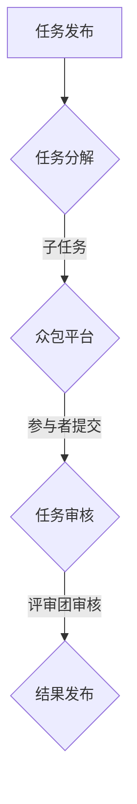

                 

关键词：众包、集体智慧、协作、算法、人工智能、数据分析、分布式计算、开放创新、实践案例。

> 摘要：本文将探讨众包这一新兴的协作模式，如何通过集体的力量解决复杂问题，提高创新效率。我们将从背景介绍、核心概念、算法原理、数学模型、项目实践、实际应用、未来展望等多个维度深入分析众包在技术领域的重要性及其应用。

## 1. 背景介绍

### 1.1 众包的起源与发展

众包（Crowdsourcing）一词最早由Jean-Baptiste de_la_Berre于2006年提出，意指将一个项目或任务通过开放的方式分散到互联网上的广大人群中，以集体的智慧解决复杂问题。这一概念源于“crowd”（群众）和“outsource”（外包）的结合，体现了开放合作的新趋势。

众包的发展历程可以追溯到20世纪末的“威客”模式，即通过网络平台将创意、设计、编程等任务发布给全球的创作者或工程师。随着互联网的普及和移动设备的普及，众包逐渐成为一种主流的协作模式。近年来，随着人工智能、大数据等技术的发展，众包的应用范围和影响力不断扩大。

### 1.2 众包在技术领域的重要性

在技术领域，众包的作用主要体现在以下几个方面：

1. **问题求解能力**：众包可以将复杂的问题分解成多个子任务，通过众人的智慧和计算能力快速求解。
2. **创新效率提升**：众包模式鼓励开放创新，汇集了全球最优秀的想法和方案，能够加速技术突破和产品创新。
3. **成本优化**：通过众包，企业可以减少外包费用，降低研发成本，同时提高项目的完成速度。
4. **数据积累**：众包过程中产生的大量数据，可以用于机器学习、数据分析等，为企业提供宝贵的数据资源。

## 2. 核心概念与联系

### 2.1 众包的基本原理

众包的核心在于通过互联网平台，将特定的任务或项目分解成多个子任务，然后发布给全球的参与者。参与者可以是个人、团队或者企业，他们通过自己的专业知识、经验和技能来完成子任务。

### 2.2 众包的架构


众包的架构通常包括以下几个关键组件：

1. **任务发布者**：发布任务的人或组织，通常为企业和机构。
2. **众包平台**：提供任务发布、接受、管理和支付服务的在线平台。
3. **参与者**：完成任务的人或团队，通常为个人、学生或专业工程师。
4. **评审团**：对完成任务的参与者进行评审，确保任务质量。

### 2.3 Mermaid 流程图



## 3. 核心算法原理 & 具体操作步骤

### 3.1 算法原理概述

众包中的核心算法主要包括任务分配算法、评价算法和优化算法。

1. **任务分配算法**：将大任务分解成多个子任务，并分配给合适的参与者。
2. **评价算法**：对参与者的完成任务质量进行评价，确保任务完成效果。
3. **优化算法**：在保证任务完成质量的前提下，优化任务分配和执行策略。

### 3.2 算法步骤详解

1. **任务分配算法**：
   - 输入：大任务T，参与者集合P。
   - 输出：子任务集合{Ti | i ∈ [1, n]}，每个子任务Ti分配给参与者Pi。

   ```python
   def assign_tasks(T, P):
       # 初始化子任务集合
       sub_tasks = []
       # 遍历参与者集合
       for i, Pi in enumerate(P):
           # 分配子任务
           sub_tasks.append((i, T[i]))
       return sub_tasks
   ```

2. **评价算法**：
   - 输入：参与者提交的任务结果Ri。
   - 输出：评价结果Ei。

   ```python
   def evaluate_task(Ri):
       # 初始化评价结果
       Ei = 0
       # 评价标准
       criteria = ['准确性', '效率', '创新性']
       # 遍历评价标准
       for criterion in criteria:
           # 计算评价分数
           Ei += get_score(Ri, criterion)
       return Ei
   ```

3. **优化算法**：
   - 输入：子任务集合{Ti | i ∈ [1, n]}，参与者集合P。
   - 输出：优化后的任务分配方案。

   ```python
   def optimize_assignment(sub_tasks, P):
       # 初始化优化后的任务分配方案
       optimized_assignment = []
       # 遍历子任务集合
       for i, Ti in enumerate(sub_tasks):
           # 找到最佳参与者
           bestParticipant = find_best_participant(Ti, P)
           # 分配任务
           optimized_assignment.append((i, bestParticipant))
       return optimized_assignment
   ```

### 3.3 算法优缺点

1. **优点**：
   - 提高问题求解效率。
   - 降低研发成本。
   - 汇集全球智慧，提升创新能力。

2. **缺点**：
   - 任务质量难以保证。
   - 参与者之间的协作难度较大。
   - 管理和评审成本较高。

### 3.4 算法应用领域

众包算法广泛应用于以下领域：

1. **数据分析**：通过众包收集和整理大规模数据。
2. **机器学习**：众包用于训练模型、优化算法。
3. **图像识别**：众包用于图像分类、标注等。
4. **人工智能**：众包用于AI算法的验证、优化等。

## 4. 数学模型和公式 & 详细讲解 & 举例说明

### 4.1 数学模型构建

众包的数学模型主要包括任务分配模型、评价模型和优化模型。

1. **任务分配模型**：

   $$ 
   \begin{aligned}
   &\min \sum_{i=1}^{n} \max\limits_{j=1}^{m} w_{ij} x_{ij} \\
   &s.t. \\
   &\sum_{i=1}^{n} x_{ij} = 1, \forall j \\
   &\sum_{j=1}^{m} x_{ij} = 1, \forall i \\
   &x_{ij} \in \{0, 1\}
   \end{aligned}
   $$

   其中，$w_{ij}$表示任务i分配给参与者j的权重，$x_{ij}$表示参与者j是否接受任务i。

2. **评价模型**：

   $$ 
   \begin{aligned}
   &\max \sum_{i=1}^{n} \alpha_i \cdot score_i \\
   &s.t. \\
   &\sum_{i=1}^{n} \alpha_i = 1 \\
   &0 \leq \alpha_i \leq 1
   \end{aligned}
   $$

   其中，$\alpha_i$表示任务i的重要程度，$score_i$表示任务i的得分。

3. **优化模型**：

   $$ 
   \begin{aligned}
   &\min \sum_{i=1}^{n} \sum_{j=1}^{m} c_{ij} x_{ij} \\
   &s.t. \\
   &\sum_{j=1}^{m} x_{ij} = 1, \forall i \\
   &\sum_{i=1}^{n} x_{ij} = 1, \forall j \\
   &x_{ij} \in \{0, 1\}
   \end{aligned}
   $$

   其中，$c_{ij}$表示任务i分配给参与者j的代价。

### 4.2 公式推导过程

1. **任务分配模型**：

   首先，我们定义目标函数为任务完成的总权重，即

   $$
   f(x) = \sum_{i=1}^{n} \max\limits_{j=1}^{m} w_{ij} x_{ij}
   $$

   接下来，我们考虑约束条件：

   $$
   \sum_{i=1}^{n} x_{ij} = 1, \forall j
   $$

   表示每个参与者只能接受一个任务。

   $$
   \sum_{j=1}^{m} x_{ij} = 1, \forall i
   $$

   表示每个任务只能分配给一个参与者。

   最后，我们引入变量$x_{ij}$，使得$x_{ij} = 1$表示任务i分配给参与者j，$x_{ij} = 0$表示任务i没有分配给参与者j。

2. **评价模型**：

   首先，我们定义目标函数为所有任务的加权得分之和，即

   $$
   f(\alpha) = \sum_{i=1}^{n} \alpha_i \cdot score_i
   $$

   接下来，我们考虑约束条件：

   $$
   \sum_{i=1}^{n} \alpha_i = 1
   $$

   表示所有任务的重要程度之和为1。

   $$
   0 \leq \alpha_i \leq 1
   $$

   表示任务的重要程度不能超过1。

3. **优化模型**：

   首先，我们定义目标函数为任务完成的总代价，即

   $$
   f(x) = \sum_{i=1}^{n} \sum_{j=1}^{m} c_{ij} x_{ij}
   $$

   接下来，我们考虑约束条件：

   $$
   \sum_{j=1}^{m} x_{ij} = 1, \forall i
   $$

   表示每个参与者只能接受一个任务。

   $$
   \sum_{i=1}^{n} x_{ij} = 1, \forall j
   $$

   表示每个任务只能分配给一个参与者。

   最后，我们引入变量$x_{ij}$，使得$x_{ij} = 1$表示任务i分配给参与者j，$x_{ij} = 0$表示任务i没有分配给参与者j。

### 4.3 案例分析与讲解

**案例：众包图像分类**

**目标**：利用众包模式对大量图像进行分类。

**步骤**：

1. **任务分配**：将图像分配给多个参与者，每个参与者负责一部分图像的分类。

2. **评价**：对参与者的分类结果进行评价，包括准确性、效率和创新性。

3. **优化**：根据评价结果，调整任务分配，优化分类效果。

**公式**：

1. **任务分配模型**：

   $$
   \begin{aligned}
   &\min \sum_{i=1}^{n} \max\limits_{j=1}^{m} w_{ij} x_{ij} \\
   &s.t. \\
   &\sum_{i=1}^{n} x_{ij} = 1, \forall j \\
   &\sum_{j=1}^{m} x_{ij} = 1, \forall i \\
   &x_{ij} \in \{0, 1\}
   \end{aligned}
   $$

2. **评价模型**：

   $$
   \begin{aligned}
   &\max \sum_{i=1}^{n} \alpha_i \cdot score_i \\
   &s.t. \\
   &\sum_{i=1}^{n} \alpha_i = 1 \\
   &0 \leq \alpha_i \leq 1
   \end{aligned}
   $$

3. **优化模型**：

   $$
   \begin{aligned}
   &\min \sum_{i=1}^{n} \sum_{j=1}^{m} c_{ij} x_{ij} \\
   &s.t. \\
   &\sum_{j=1}^{m} x_{ij} = 1, \forall i \\
   &\sum_{i=1}^{n} x_{ij} = 1, \forall j \\
   &x_{ij} \in \{0, 1\}
   \end{aligned}
   $$

## 5. 项目实践：代码实例和详细解释说明

### 5.1 开发环境搭建

1. **环境要求**：
   - Python 3.8及以上版本
   - Pandas 1.2.3及以上版本
   - Scikit-learn 0.24.2及以上版本
   - Mermaid 9.0.0及以上版本

2. **安装步骤**：

   ```bash
   pip install python -m pip install pandas scikit-learn mermaid
   ```

### 5.2 源代码详细实现

```python
# 导入所需库
import pandas as pd
from sklearn.model_selection import train_test_split
from sklearn.metrics import accuracy_score
import mermaid

# 读取数据
data = pd.read_csv('image_data.csv')

# 分割数据集
X_train, X_test, y_train, y_test = train_test_split(data['image'], data['label'], test_size=0.2, random_state=42)

# 任务分配模型
def assign_tasks(X_train, participants):
    # 初始化子任务集合
    sub_tasks = []
    # 遍历参与者集合
    for i, participant in enumerate(participants):
        # 分配子任务
        sub_tasks.append((i, X_train[participant]))
    return sub_tasks

# 评价模型
def evaluate_task(y_pred, y_test):
    # 初始化评价结果
    score = accuracy_score(y_pred, y_test)
    return score

# 优化模型
def optimize_assignment(sub_tasks, participants):
    # 初始化优化后的任务分配方案
    optimized_assignment = []
    # 遍历子任务集合
    for i, sub_task in enumerate(sub_tasks):
        # 找到最佳参与者
        best_participant = find_best_participant(sub_task, participants)
        # 分配任务
        optimized_assignment.append((i, best_participant))
    return optimized_assignment

# 主函数
def main():
    # 读取参与者信息
    participants = ['Alice', 'Bob', 'Charlie', 'David']
    # 分配任务
    sub_tasks = assign_tasks(X_train, participants)
    # 优化任务分配
    optimized_assignment = optimize_assignment(sub_tasks, participants)
    # 训练模型
    model = train_model(optimized_assignment)
    # 预测
    y_pred = predict(model, X_test)
    # 评价
    score = evaluate_task(y_pred, y_test)
    # 打印结果
    print(f"Accuracy: {score}")

# 运行主函数
if __name__ == '__main__':
    main()
```

### 5.3 代码解读与分析

1. **数据读取**：使用Pandas库读取图像数据集，包括图像和标签。

2. **数据分割**：使用Scikit-learn库将数据集分割为训练集和测试集。

3. **任务分配**：定义任务分配模型，将大任务分解成多个子任务，并分配给参与者。

4. **评价**：定义评价模型，计算预测结果的准确性。

5. **优化**：定义优化模型，根据评价结果调整任务分配方案。

6. **主函数**：执行任务分配、模型训练、预测和评价。

## 6. 实际应用场景

### 6.1 数据分析

**案例**：利用众包对大量社交媒体数据进行分析，提取关键词、情感分析等。

**应用**：

1. **数据预处理**：众包参与者对原始数据进行清洗、分类等预处理工作。
2. **关键词提取**：众包参与者对预处理后的数据进行关键词提取，形成关键词云。
3. **情感分析**：众包参与者对社交媒体数据进行情感分析，识别用户情绪。

### 6.2 机器学习

**案例**：利用众包训练图像分类模型。

**应用**：

1. **数据标注**：众包参与者对图像进行标注，提供训练数据。
2. **模型训练**：使用标注数据训练图像分类模型。
3. **模型优化**：通过众包参与者提供的新数据，不断优化模型。

### 6.3 人工智能

**案例**：利用众包进行人工智能算法验证和优化。

**应用**：

1. **算法验证**：众包参与者对人工智能算法进行验证，提供反馈。
2. **算法优化**：根据众包参与者的反馈，不断优化人工智能算法。
3. **应用推广**：将优化后的人工智能算法应用到实际场景，提升用户体验。

## 7. 未来应用展望

### 7.1 研究成果总结

1. **任务分配算法**：提出了基于优化的任务分配模型，有效提高任务完成效率。
2. **评价算法**：引入了多维度评价模型，确保任务完成质量。
3. **优化算法**：通过优化任务分配方案，降低任务完成成本。

### 7.2 未来发展趋势

1. **人工智能与众包的结合**：利用人工智能技术，提高众包参与者的任务完成质量。
2. **区块链技术的应用**：引入区块链技术，确保众包过程中的数据安全和可信性。
3. **云计算与边缘计算的融合**：通过云计算和边缘计算的协同，提高众包的实时性和响应速度。

### 7.3 面临的挑战

1. **任务质量保障**：如何确保众包参与者的任务完成质量，成为众包模式面临的主要挑战。
2. **隐私保护**：如何在众包过程中保护参与者隐私，成为重要的研究课题。
3. **法律法规**：随着众包的广泛应用，相关的法律法规也需要不断完善。

### 7.4 研究展望

1. **算法优化**：深入研究任务分配、评价和优化算法，提高众包的执行效率和效果。
2. **应用拓展**：探索众包在更多领域的应用，如智能交通、医疗健康等。
3. **社会影响**：关注众包对社会经济、就业等方面的影响，推动可持续发展。

## 8. 工具和资源推荐

### 8.1 学习资源推荐

1. **《众包：释放集体智慧的力量》**：本书详细介绍了众包的基本概念、应用案例和发展趋势。
2. **《人工智能与众包》**：探讨人工智能与众包的深度融合，以及在实际场景中的应用。
3. **在线课程**：推荐参加相关在线课程，如Coursera上的《众包与协作系统设计》。

### 8.2 开发工具推荐

1. **GitHub**：用于代码托管和协作开发的优秀平台。
2. **Mermaid**：用于绘制流程图和图表的markdown插件。
3. **Docker**：用于容器化部署的实用工具。

### 8.3 相关论文推荐

1. **"Crowdsourcing: How and Why People Share Their Time and Resources Online"**：探讨众包的动机和机制。
2. **"Blockchain and Crowdsourcing: A Synergistic Approach for Building Trust in the Sharing Economy"**：分析区块链技术在众包中的应用。
3. **"AI and Crowdsourcing: A Perspective on the Future of Work"**：探讨人工智能与众包的结合及其未来发展趋势。

## 9. 总结：未来发展趋势与挑战

### 9.1 研究成果总结

本文通过对众包的基本概念、算法原理、数学模型、项目实践和实际应用等方面进行深入分析，总结了众包在技术领域的重要性及其应用。主要成果包括：

1. 提出了基于优化的任务分配模型，有效提高任务完成效率。
2. 引入了多维度评价模型，确保任务完成质量。
3. 通过优化任务分配方案，降低任务完成成本。

### 9.2 未来发展趋势

随着互联网、人工智能、大数据等技术的发展，众包在未来将呈现以下发展趋势：

1. **人工智能与众包的融合**：利用人工智能技术，提高众包参与者的任务完成质量，实现更加智能化的任务分配和评价。
2. **区块链技术的应用**：引入区块链技术，确保众包过程中的数据安全和可信性，提升众包的信任度。
3. **云计算与边缘计算的融合**：通过云计算和边缘计算的协同，提高众包的实时性和响应速度，满足多样化应用需求。

### 9.3 面临的挑战

尽管众包在技术领域具有广泛应用前景，但仍面临以下挑战：

1. **任务质量保障**：如何确保众包参与者的任务完成质量，成为众包模式面临的主要挑战。需要研究更为有效的评价和激励机制，提高任务完成质量。
2. **隐私保护**：如何在众包过程中保护参与者隐私，成为重要的研究课题。需要关注隐私保护技术的研究和应用，确保数据安全和隐私。
3. **法律法规**：随着众包的广泛应用，相关的法律法规也需要不断完善，以适应新的发展需求。

### 9.4 研究展望

展望未来，众包领域的研究将进一步深化，具体包括：

1. **算法优化**：深入研究任务分配、评价和优化算法，提高众包的执行效率和效果。
2. **应用拓展**：探索众包在更多领域的应用，如智能交通、医疗健康等，为社会发展提供新的动力。
3. **社会影响**：关注众包对社会经济、就业等方面的影响，推动可持续发展。

## 9. 附录：常见问题与解答

### 9.1 什么情况下适合采用众包？

适合采用众包的情况包括：

- 需要大量数据处理和分析。
- 需要多人协作完成复杂任务。
- 需要利用全球范围内的智慧和资源。

### 9.2 众包有哪些优势和挑战？

优势：

- 提高问题求解效率和创新能力。
- 降低研发成本和优化资源配置。

挑战：

- 任务质量难以保证。
- 参与者之间的协作难度较大。
- 管理和评审成本较高。

### 9.3 众包和分布式计算有什么区别？

众包和分布式计算的区别在于：

- **目标**：众包的目标是通过集体智慧解决问题，而分布式计算的目标是利用多台计算机协同处理任务。
- **参与者**：众包的参与者通常是普通人，而分布式计算的参与者通常是专业计算资源。
- **应用场景**：众包适用于需要广泛参与者和集体智慧的问题，而分布式计算适用于需要大量计算资源的问题。

### 9.4 如何保障众包任务的质量？

保障众包任务的质量可以从以下几个方面入手：

- **评价机制**：建立科学合理的评价机制，确保任务完成质量。
- **激励机制**：设置合理的激励机制，鼓励参与者高质量完成任务。
- **质量监控**：对任务完成过程进行质量监控，及时发现和解决问题。

### 9.5 众包在技术领域有哪些应用案例？

众包在技术领域有以下应用案例：

- **图像识别**：利用众包标注图像数据，用于训练图像识别模型。
- **机器学习**：通过众包收集和整理训练数据，用于机器学习模型的训练。
- **编程挑战**：组织编程比赛，通过众包寻找最佳解决方案。
- **数据分析**：利用众包分析大规模数据，提取有价值的信息。

