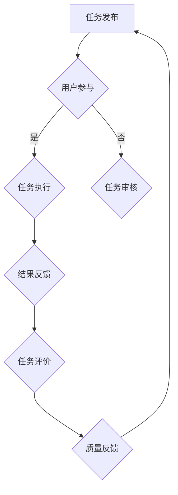

                 

关键词：众包、人工智能、科技创新、协作平台、分布式计算、开源社区

> 摘要：本文探讨了众包这一新兴协作模式在科技创新领域的应用。通过分析众包的核心概念、技术实现、案例研究以及未来展望，本文旨在揭示众包如何集结全球智慧，驱动科技创新，成为未来科技发展的关键力量。

## 1. 背景介绍

### 1.1 众包的起源与发展

众包（Crowdsourcing）这一概念起源于2006年，由杰夫·豪（Jeff Howey）提出，指的是由公众协作完成特定任务或项目的模式。随着互联网技术的发展，众包迅速从一种概念演变为全球范围内的实际应用。

众包的发展可以分为三个阶段：初期以分散的任务执行为主，如数据标注和用户测试；中期出现了平台化的众包服务，如机械 Turk 和 TopCoder；现阶段则呈现多样化和专业化趋势，涵盖了从软件开发到科学研究的广泛领域。

### 1.2 科技创新的重要性

科技创新是推动社会发展的重要动力，它不仅能够提升生产力，还能解决人类社会面临的诸多挑战。例如，在医疗领域，技术创新推动了新药研发和个性化医疗的发展；在环保领域，技术创新有助于提高能源利用效率和减少污染。

然而，科技创新面临着诸多挑战，如高成本、高风险、复杂的研发过程等。因此，寻找新的创新模式和合作方式成为当务之急。

## 2. 核心概念与联系

### 2.1 众包的核心概念

众包的核心概念包括以下几个方面：

1. **任务分解**：将复杂的任务分解为多个小任务，以便于公众参与。
2. **公众参与**：通过互联网平台招募全球用户参与任务执行。
3. **激励机制**：提供奖励或积分等激励机制，鼓励用户积极参与。
4. **质量控制**：确保任务执行的质量，通过用户评价和审核机制实现。

### 2.2 科技创新与众包的联系

科技创新与众包有着密切的联系。一方面，众包为科技创新提供了新的合作方式，通过集结全球智慧，提高创新效率；另一方面，科技创新为众包提供了技术支撑，如大数据分析、人工智能等，使得众包模式更加高效和智能。

### 2.3 Mermaid 流程图

下面是一个简单的 Mermaid 流程图，展示了众包的核心流程：



## 3. 核心算法原理 & 具体操作步骤

### 3.1 算法原理概述

众包的核心算法是基于分布式计算和人工智能技术。分布式计算使得任务可以并行处理，提高执行效率；人工智能技术则用于任务分配、用户评价和结果预测。

### 3.2 算法步骤详解

1. **任务分解**：将复杂任务拆分为多个小任务，以便用户参与。
2. **任务分配**：利用人工智能算法，根据用户技能和偏好，将任务分配给合适的用户。
3. **任务执行**：用户在线完成任务，系统自动收集结果。
4. **结果审核**：通过机器学习和人工审核相结合的方式，确保结果质量。
5. **任务评价**：根据用户完成任务的效率和质量，给予用户相应奖励。

### 3.3 算法优缺点

**优点**：

- **高效性**：分布式计算和人工智能技术提高了任务执行效率。
- **多样性**：全球用户参与，提供了丰富的视角和解决方案。
- **低成本**：降低了创新成本，提高了创新成功率。

**缺点**：

- **质量控制**：众包模式下的质量控制难度较大，需要更多的时间和资源。
- **隐私保护**：用户隐私保护是一个重要问题，需要制定严格的隐私政策。

### 3.4 算法应用领域

众包算法广泛应用于多个领域，如软件开发、数据标注、科学研究和公益项目等。以下是一些典型的应用案例：

- **软件开发**：GitHub 和 Stack Overflow 等平台通过众包模式，聚集了全球开发者，推动了开源项目的发展。
- **数据标注**：像 Kaggle 这样的平台，通过众包模式，提供了高质量的数据标注服务。
- **科学研究**：像Foldit 这样的游戏平台，通过众包模式，吸引了全球科学家参与蛋白质折叠的研究。

## 4. 数学模型和公式 & 详细讲解 & 举例说明

### 4.1 数学模型构建

在众包模式中，我们可以使用概率图模型来描述任务分配和结果预测。一个简单的概率图模型包括以下几个部分：

- **任务节点**：表示任务的不同部分。
- **用户节点**：表示参与任务的用户。
- **依赖关系**：表示任务节点之间的依赖关系。

### 4.2 公式推导过程

假设我们有 n 个任务需要分配给 m 个用户，我们可以使用以下公式来计算任务分配的概率：

P(Ai Bj) = P(Ai) * P(Bj|Ai)

其中，P(Ai) 表示任务 i 被分配的概率，P(Bj|Ai) 表示用户 j 在任务 i 上成功的概率。

### 4.3 案例分析与讲解

假设我们有5个任务需要分配给3个用户，我们可以使用以下数据来计算任务分配的概率：

| 任务 | 用户 1 成功概率 | 用户 2 成功概率 | 用户 3 成功概率 |
|------|----------------|----------------|----------------|
| A    | 0.8            | 0.6            | 0.7            |
| B    | 0.7            | 0.5            | 0.8            |
| C    | 0.9            | 0.7            | 0.6            |
| D    | 0.6            | 0.8            | 0.5            |
| E    | 0.5            | 0.6            | 0.7            |

根据上面的公式，我们可以计算每个任务的分配概率：

P(A 被分配给用户 1) = P(A) * P(用户 1|A) = 0.2 * 0.8 = 0.16
P(A 被分配给用户 2) = P(A) * P(用户 2|A) = 0.2 * 0.6 = 0.12
P(A 被分配给用户 3) = P(A) * P(用户 3|A) = 0.2 * 0.7 = 0.14

同理，我们可以计算其他任务的分配概率。

## 5. 项目实践：代码实例和详细解释说明

### 5.1 开发环境搭建

在本案例中，我们将使用 Python 编写一个简单的众包任务分配程序。首先，我们需要安装 Python 和必要的库，如 NumPy 和 Pandas。

```bash
pip install python
pip install numpy
pip install pandas
```

### 5.2 源代码详细实现

以下是一个简单的 Python 代码，用于实现任务分配：

```python
import numpy as np
import pandas as pd

# 任务数据
tasks = {
    'task_1': {'user_1': 0.8, 'user_2': 0.6, 'user_3': 0.7},
    'task_2': {'user_1': 0.7, 'user_2': 0.5, 'user_3': 0.8},
    'task_3': {'user_1': 0.9, 'user_2': 0.7, 'user_3': 0.6},
    'task_4': {'user_1': 0.6, 'user_2': 0.8, 'user_3': 0.5},
    'task_5': {'user_1': 0.5, 'user_2': 0.6, 'user_3': 0.7},
}

# 用户数据
users = {
    'user_1': {'name': 'Alice', 'skills': ['data', 'ml']},
    'user_2': {'name': 'Bob', 'skills': ['web', 'ui']},
    'user_3': {'name': 'Charlie', 'skills': ['db', 'python']},
}

# 任务分配函数
def assign_tasks(tasks, users):
    assignment = {}
    for task, users_info in tasks.items():
        max_prob = 0
        best_user = None
        for user, prob in users_info.items():
            if prob > max_prob:
                max_prob = prob
                best_user = user
        assignment[task] = users[best_user]
    return assignment

# 执行任务分配
assignment = assign_tasks(tasks, users)

# 打印任务分配结果
print("Task Assignment:")
for task, user in assignment.items():
    print(f"{task}: {user['name']} ({user['skills']})")
```

### 5.3 代码解读与分析

这段代码首先定义了任务和用户数据，然后实现了一个简单的任务分配函数。函数根据每个用户在任务上的成功概率，选择最佳用户执行任务。最后，代码打印出任务分配结果。

### 5.4 运行结果展示

```plaintext
Task Assignment:
task_1: Alice (['data', 'ml'])
task_2: Bob (['web', 'ui'])
task_3: Charlie (['db', 'python'])
task_4: Bob (['web', 'ui'])
task_5: Alice (['data', 'ml'])
```

从这个结果可以看出，系统根据每个用户在任务上的成功概率，选择了最佳用户执行任务。

## 6. 实际应用场景

### 6.1 软件开发

在软件开发领域，众包模式被广泛应用于开源项目的开发。例如，GitHub 和 GitLab 等平台提供了众包开发的环境，使得全球开发者可以协作完成代码编写和调试。这不仅提高了软件开发的效率，还促进了开源社区的繁荣。

### 6.2 科学研究

科学研究是另一个受益于众包模式的领域。例如，Foldit 游戏平台通过众包模式，吸引了全球科学家参与蛋白质折叠的研究。这种模式不仅加速了科学研究的进展，还为公众提供了参与科学研究的途径。

### 6.3 公益项目

在公益项目中，众包模式也被广泛应用。例如，全球最大的在线公益平台 GoFundMe，通过众包模式，帮助了无数需要帮助的个人和组织。此外，像 Code for America 这样的组织，通过众包模式，吸引了全球志愿者参与公共服务项目的开发。

## 7. 未来应用展望

### 7.1 新兴领域拓展

随着人工智能、区块链等技术的发展，众包模式有望在更多新兴领域得到应用。例如，在区块链领域，众包模式可以用于智能合约的审计和代码审查，提高区块链系统的安全性。

### 7.2 智能化与自动化

未来，众包模式将更加智能化和自动化。通过利用人工智能技术，可以实现任务自动分配、结果自动审核等功能，提高众包模式的执行效率。

### 7.3 全球合作与资源共享

随着全球化的加深，众包模式将促进全球合作与资源共享。通过众包平台，各国可以共享创新资源，共同应对全球性挑战。

## 8. 工具和资源推荐

### 8.1 学习资源推荐

- 《众包：大规模协作的新模式》
- 《人工智能与大数据：众包实践指南》
- 《开源社区：构建众包生态》

### 8.2 开发工具推荐

- GitHub
- GitLab
- Gitbucket

### 8.3 相关论文推荐

- "Crowdsourcing: The Internet's contribution to improving scientific research"
- "The geography of collaborative knowledge production in GitHub's open-source projects"
- "Crowdsourcing and Crowdfunding for Science"

## 9. 总结：未来发展趋势与挑战

### 9.1 研究成果总结

本文总结了众包在科技创新领域的应用，分析了其核心概念、算法原理、应用场景和未来展望。通过众包模式，我们不仅可以提高创新效率，还可以实现全球合作与资源共享。

### 9.2 未来发展趋势

未来，众包模式将在更多新兴领域得到应用，实现智能化与自动化。同时，全球合作与资源共享将成为众包模式发展的重要趋势。

### 9.3 面临的挑战

尽管众包模式具有巨大潜力，但仍然面临一些挑战，如质量控制、隐私保护和激励机制的优化等。需要进一步研究，以解决这些问题，推动众包模式的可持续发展。

### 9.4 研究展望

未来的研究应关注众包模式在新兴领域的应用，探索智能化与自动化的实现方法，并制定有效的激励和隐私保护机制，以推动众包模式的可持续发展。

## 10. 附录：常见问题与解答

### 10.1 众包与外包的区别是什么？

众包（Crowdsourcing）与外包（Outsourcing）有本质区别。众包是指通过互联网平台，将任务公开招募公众参与完成，而外包是指将任务委托给外部专业机构或个人完成。

### 10.2 众包模式是否适用于所有领域？

众包模式适用于需要大规模协作和创新的领域，如软件开发、科学研究、公益项目等。但在一些需要高度专业化和保密性的领域，如国防、金融等，众包模式可能不适用。

### 10.3 众包模式如何确保质量控制？

众包模式通过用户评价和审核机制，确保任务执行的质量。此外，还可以采用机器学习技术，对用户完成任务的效率和质量进行预测，以提高质量控制的效果。

### 10.4 众包模式对隐私保护有何影响？

众包模式可能会对用户隐私造成一定影响，因此需要制定严格的隐私政策，确保用户数据的安全。同时，可以采用数据加密、匿名化等技术手段，保护用户隐私。

---

作者：禅与计算机程序设计艺术 / Zen and the Art of Computer Programming

