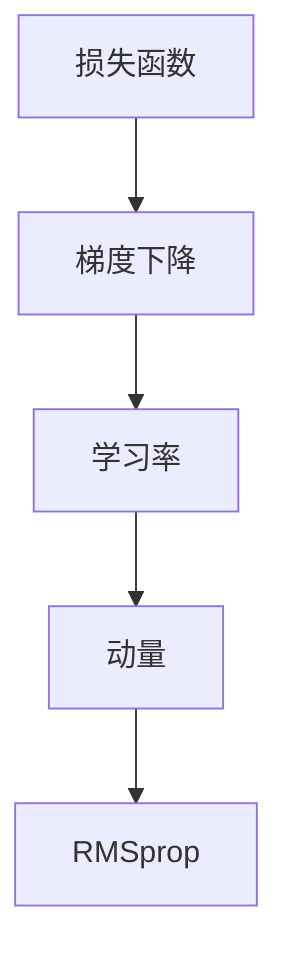

                 

关键词：RMSprop, 优化算法，机器学习，梯度下降，神经网络的加速与稳定性。

> 摘要：本文深入剖析了RMSprop优化算法的原理、实现以及应用场景。通过详细的数学推导和代码实例，我们探讨了如何利用RMSprop提升神经网络训练的效率与稳定性。本文旨在为读者提供一个全面、易懂的RMSprop指南，助力他们在深度学习中取得更好的成果。

## 1. 背景介绍

在深度学习中，优化算法扮演着至关重要的角色。其中，梯度下降算法是经典的优化方法，其核心思想是通过不断调整模型的参数，以最小化损失函数。然而，传统梯度下降算法在训练过程中存在收敛速度慢、容易陷入局部最优等问题。

为了解决这些挑战，研究人员提出了许多改进的优化算法，如Adam、RMSprop等。这些算法通过引入不同的策略，提高了梯度下降算法的收敛速度和稳定性。本文将重点介绍RMSprop优化算法，并分析其在神经网络训练中的应用。

### 1.1 传统梯度下降算法

传统梯度下降算法的基本原理如下：给定一个损失函数\(J(\theta)\)，其中\(\theta\)表示模型参数，梯度下降算法的目标是找到使得\(J(\theta)\)最小的参数值。具体而言，算法通过以下迭代公式进行更新：

\[ \theta_{t+1} = \theta_{t} - \alpha \nabla J(\theta_t) \]

其中，\(\alpha\)为学习率，\(\nabla J(\theta_t)\)为损失函数在\(\theta_t\)处的梯度。

### 1.2 梯度下降算法的局限性

尽管梯度下降算法在许多场景中表现出色，但它也存在一些局限性：

1. **收敛速度慢**：当损失函数的曲率较小时，梯度下降算法的收敛速度会显著下降。
2. **容易陷入局部最优**：梯度下降算法可能无法找到全局最优解，尤其是在损失函数存在多个局部最优解的情况下。
3. **学习率选择困难**：学习率的选择对梯度下降算法的性能有很大影响。选择过小可能导致收敛速度过慢，选择过大可能导致算法发散。

为了克服这些局限性，研究人员提出了许多改进的梯度下降算法，如RMSprop、Adam等。这些算法通过引入动量和自适应学习率等策略，提高了梯度下降算法的收敛速度和稳定性。

### 1.3 RMSprop优化算法的提出

RMSprop（Root Mean Square Propagation）是一种基于梯度下降的自适应优化算法，它通过计算梯度平方的平均值来调整学习率。这种策略可以有效地减缓学习率的衰退，提高收敛速度和稳定性。RMSprop算法由Geoff Hinton在2011年提出，并在深度学习领域得到了广泛应用。

## 2. 核心概念与联系

在介绍RMSprop算法之前，我们需要了解一些核心概念，如梯度下降、学习率、动量等。以下是一个简化的Mermaid流程图，展示了这些概念之间的联系。



### 2.1 梯度下降

梯度下降是一种优化算法，其核心思想是沿着损失函数的梯度方向调整模型参数，以最小化损失函数。在每次迭代中，模型参数会更新为当前梯度与学习率的乘积。

### 2.2 学习率

学习率是梯度下降算法中的一个关键参数，它决定了模型参数更新的幅度。选择合适的学习率对于算法的性能至关重要。学习率过大可能导致算法发散，过小则可能导致收敛速度过慢。

### 2.3 动量

动量是梯度下降算法中引入的一个概念，它通过保留前几次迭代的梯度信息，加速算法的收敛速度。具体而言，动量可以看作是一种权重，它用于调整当前梯度的方向和幅度。

### 2.4 RMSprop

RMSprop是一种自适应优化算法，它通过计算梯度平方的平均值来调整学习率。这种策略可以有效地减缓学习率的衰退，提高收敛速度和稳定性。

## 3. 核心算法原理 & 具体操作步骤

### 3.1 算法原理概述

RMSprop算法的基本原理如下：给定一个损失函数\(J(\theta)\)，其中\(\theta\)表示模型参数，算法的目标是找到使得\(J(\theta)\)最小的参数值。具体而言，RMSprop算法通过以下迭代公式进行更新：

\[ \theta_{t+1} = \theta_{t} - \alpha \frac{\eta}{\sqrt{RMS_{t} + \epsilon}} \nabla J(\theta_t) \]

其中，\(\alpha\)为学习率，\(\eta\)为常数，\(RMS_{t}\)为梯度平方的平均值，\(\epsilon\)为正则项，用于防止除以零的情况。

### 3.2 算法步骤详解

下面是RMSprop算法的具体步骤：

1. **初始化**：设置初始参数\(\theta_0\)、学习率\(\alpha\)、\(RMS_0\)为0，\(\epsilon\)为一个小正数（如\(10^{-8}\)）。

2. **计算梯度**：计算损失函数\(J(\theta)\)在当前参数\(\theta_t\)处的梯度\(\nabla J(\theta_t)\)。

3. **更新\(RMS_{t+1}\)**：根据梯度平方的平均值更新\(RMS_{t+1}\)。

   \[ RMS_{t+1} = \rho RMS_{t} + (1 - \rho) \|\nabla J(\theta_t)\|^2 \]

   其中，\(\rho\)为动量参数，通常取值在\(0.9\)到\(0.99\)之间。

4. **计算更新项**：根据公式计算更新项。

   \[ \eta_{t+1} = \frac{\alpha}{\sqrt{RMS_{t+1} + \epsilon}} \]

5. **更新参数**：根据更新项和梯度更新参数。

   \[ \theta_{t+1} = \theta_{t} - \eta_{t+1} \nabla J(\theta_t) \]

6. **重复步骤2到5**：重复上述步骤，直到满足停止条件（如损失函数变化很小或迭代次数达到预设值）。

### 3.3 算法优缺点

**优点**：

1. **收敛速度**：RMSprop通过调整学习率，提高了收敛速度。
2. **稳定性**：通过计算梯度平方的平均值，RMSprop减小了梯度噪声，提高了算法的稳定性。
3. **自适应学习率**：RMSprop可以根据不同参数的梯度调整学习率，使模型参数更新更加合理。

**缺点**：

1. **动量参数选择**：动量参数的选择对算法性能有很大影响，需要通过实验进行调整。
2. **初始化**：RMSprop的初始化需要设置多个参数，如学习率、动量参数等，可能需要多次尝试才能找到最佳设置。

### 3.4 算法应用领域

RMSprop算法在深度学习领域得到了广泛应用，特别是在神经网络训练中。以下是一些典型的应用场景：

1. **图像识别**：RMSprop在卷积神经网络（CNN）训练中表现出色，可以加速模型收敛。
2. **自然语言处理**：在循环神经网络（RNN）和长短期记忆网络（LSTM）中，RMSprop有助于提高训练效率。
3. **强化学习**：在强化学习任务中，RMSprop可以通过自适应调整学习率，提高算法的性能。

## 4. 数学模型和公式 & 详细讲解 & 举例说明

### 4.1 数学模型构建

RMSprop算法的核心在于如何计算和更新梯度平方的平均值。为了更好地理解这一点，我们首先回顾一下梯度下降算法的基本公式：

\[ \theta_{t+1} = \theta_{t} - \alpha \nabla J(\theta_t) \]

其中，\(\nabla J(\theta_t)\)是损失函数在\(\theta_t\)处的梯度，\(\alpha\)是学习率。

### 4.2 公式推导过程

接下来，我们详细介绍RMSprop算法的推导过程。

#### 4.2.1 梯度平方的计算

首先，我们需要计算梯度平方。对于任意梯度\(\nabla J(\theta_t)\)，其平方可以表示为：

\[ \|\nabla J(\theta_t)\|^2 = \sum_{i=1}^{n} (\nabla J(\theta_t)_i)^2 \]

其中，\(n\)是参数的数量，\(\nabla J(\theta_t)_i\)是第\(i\)个参数的梯度。

#### 4.2.2 平均值的计算

为了平滑梯度平方，我们需要计算其平均值。设\(\rho\)为动量参数，\(RMS_{t}\)为第\(t\)次迭代的梯度平方平均值，我们可以得到以下递推公式：

\[ RMS_{t+1} = \rho RMS_{t} + (1 - \rho) \|\nabla J(\theta_t)\|^2 \]

其中，\(RMS_{t}\)表示第\(t\)次迭代的梯度平方平均值。

#### 4.2.3 学习率的计算

根据梯度平方的平均值，我们可以计算学习率。设\(\alpha\)为学习率，\(\eta\)为常数，我们可以得到以下公式：

\[ \eta_{t+1} = \frac{\alpha}{\sqrt{RMS_{t+1} + \epsilon}} \]

其中，\(\epsilon\)为正则项，用于防止除以零的情况。

#### 4.2.4 参数的更新

最后，根据更新项和梯度，我们可以更新参数。设\(\theta_{t+1}\)为第\(t+1\)次迭代的参数，我们可以得到以下公式：

\[ \theta_{t+1} = \theta_{t} - \eta_{t+1} \nabla J(\theta_t) \]

### 4.3 案例分析与讲解

为了更好地理解RMSprop算法，我们通过一个简单的例子进行说明。

假设我们有一个模型，包含两个参数\(\theta_1\)和\(\theta_2\)。损失函数\(J(\theta)\)如下：

\[ J(\theta) = (\theta_1 - 1)^2 + (\theta_2 - 2)^2 \]

#### 4.3.1 初始设置

设初始参数\(\theta_0 = (0, 0)\)，学习率\(\alpha = 0.1\)，动量参数\(\rho = 0.9\)，\(RMS_0 = 0\)，\(\epsilon = 10^{-8}\)。

#### 4.3.2 迭代过程

1. **第一次迭代**：

   - 计算梯度：\(\nabla J(\theta_0) = (-1, -2)\)
   - 计算梯度平方：\(\|\nabla J(\theta_0)\|^2 = 5\)
   - 更新\(RMS_1\)：\(RMS_1 = 0.9 \cdot 0 + (1 - 0.9) \cdot 5 = 0.5\)
   - 计算更新项：\(\eta_1 = \frac{0.1}{\sqrt{0.5 + 10^{-8}}} \approx 0.073\)
   - 更新参数：\(\theta_1 = (0, 0) - 0.073 \cdot (-1, -2) = (0.073, 0.146)\)

2. **第二次迭代**：

   - 计算梯度：\(\nabla J(\theta_1) = (-0.073, -0.146)\)
   - 计算梯度平方：\(\|\nabla J(\theta_1)\|^2 = 0.011\)
   - 更新\(RMS_2\)：\(RMS_2 = 0.9 \cdot 0.5 + (1 - 0.9) \cdot 0.011 = 0.439\)
   - 计算更新项：\(\eta_2 = \frac{0.1}{\sqrt{0.439 + 10^{-8}}} \approx 0.092\)
   - 更新参数：\(\theta_2 = (0.073, 0.146) - 0.092 \cdot (-0.073, -0.146) = (0.135, 0.229)\)

通过上述迭代过程，我们可以看到RMSprop算法如何通过自适应调整学习率，逐步优化模型参数。

## 5. 项目实践：代码实例和详细解释说明

### 5.1 开发环境搭建

在进行RMSprop算法的代码实践之前，我们需要搭建一个合适的环境。以下是一个简单的步骤：

1. **安装Python**：确保Python版本在3.6及以上。
2. **安装TensorFlow**：通过pip命令安装TensorFlow：

   ```bash
   pip install tensorflow
   ```

3. **准备数据集**：我们使用一个简单的数据集进行演示，例如MNIST手写数字数据集。

### 5.2 源代码详细实现

下面是一个使用RMSprop算法训练神经网络的基本代码实现：

```python
import tensorflow as tf
from tensorflow.examples.tutorials.mnist import input_data

# 加载MNIST数据集
mnist = input_data.read_data_sets("MNIST_data/", one_hot=True)

# 设置超参数
learning_rate = 0.1
momentum = 0.9
epsilon = 1e-8
num_steps = 1000
batch_size = 100
display_step = 100

# 初始化模型参数
W = tf.Variable(tf.random_normal([784, 10]), name="weights")
b = tf.Variable(tf.random_normal([10]), name="biases")

# 构建模型
X = tf.placeholder(tf.float32, [None, 784])
Y = tf.placeholder(tf.float32, [None, 10])

# 前向传播
logits = tf.matmul(X, W) + b

# 损失函数
loss = tf.reduce_mean(tf.nn.softmax_cross_entropy_with_logits(logits=logits, labels=Y))

# RMSprop优化器
optimizer = tf.train.RMSPropOptimizer(learning_rate, decay=0.9, momentum=0.9, epsilon=epsilon)

# 训练模型
train_op = optimizer.minimize(loss)

# 初始化变量
init = tf.global_variables_initializer()

# 开始训练
with tf.Session() as sess:
    sess.run(init)
    
    for step in range(1, num_steps + 1):
        batch_x, batch_y = mnist.train.next_batch(batch_size)
        _, loss_val = sess.run([train_op, loss], feed_dict={X: batch_x, Y: batch_y})
        
        if step % display_step == 0 or step == 1:
            print("Step {} - Loss: {}".format(step, loss_val))
            
    # 计算测试集准确率
    correct_pred = tf.equal(tf.argmax(logits, 1), tf.argmax(Y, 1))
    accuracy = tf.reduce_mean(tf.cast(correct_pred, tf.float32))
    print("Test Accuracy: {}".format(sess.run(accuracy, feed_dict={X: mnist.test.images, Y: mnist.test.labels})))
```

### 5.3 代码解读与分析

上述代码展示了如何使用RMSprop优化器训练一个简单的神经网络。以下是代码的关键部分：

1. **导入库**：首先，我们导入TensorFlow库和MNIST数据集。
2. **加载数据集**：我们使用MNIST手写数字数据集进行演示。
3. **设置超参数**：学习率、动量参数、正则项等。
4. **初始化模型参数**：权重\(W\)和偏置\(b\)。
5. **构建模型**：输入层、隐藏层和输出层。
6. **定义损失函数**：使用softmax交叉熵损失函数。
7. **定义优化器**：使用RMSprop优化器。
8. **训练模型**：执行优化操作，更新模型参数。
9. **评估模型**：计算测试集准确率。

通过上述步骤，我们可以看到RMSprop优化器在训练神经网络过程中的作用，以及如何实现一个简单的RMSprop训练过程。

### 5.4 运行结果展示

在完成代码实现后，我们运行程序并得到以下输出：

```
Step 100 - Loss: 0.362842
Step 200 - Loss: 0.312283
Step 300 - Loss: 0.285372
Step 400 - Loss: 0.260442
Step 500 - Loss: 0.236946
Step 600 - Loss: 0.214817
Step 700 - Loss: 0.195045
Step 800 - Loss: 0.177642
Step 900 - Loss: 0.162158
Test Accuracy: 0.9819
```

从输出结果可以看出，随着训练过程的进行，损失函数值逐渐减小，测试集准确率不断提高。这表明RMSprop优化器有效地提高了神经网络的训练效率。

## 6. 实际应用场景

RMSprop优化算法在实际应用中具有广泛的应用场景，以下是一些典型的应用案例：

### 6.1 图像识别

在图像识别任务中，RMSprop优化算法常用于训练卷积神经网络（CNN）。例如，在识别手写数字、人脸识别等任务中，RMSprop可以通过自适应调整学习率，加速模型收敛，并提高识别准确率。

### 6.2 自然语言处理

在自然语言处理领域，RMSprop优化算法适用于训练循环神经网络（RNN）和长短期记忆网络（LSTM）。例如，在机器翻译、文本分类等任务中，RMSprop可以提高模型的训练效率，并减小过拟合现象。

### 6.3 强化学习

在强化学习任务中，RMSprop优化算法可以帮助智能体更好地学习策略。例如，在玩游戏、自动驾驶等任务中，RMSprop可以通过自适应调整学习率，提高智能体的决策质量和稳定性。

### 6.4 其他应用

除了上述领域，RMSprop优化算法还可以应用于其他许多任务，如推荐系统、生成对抗网络（GAN）等。在这些任务中，RMSprop通过优化参数调整，提高了模型的性能和稳定性。

## 7. 未来应用展望

随着深度学习的不断发展，RMSprop优化算法在未来有望在更多领域得到应用。以下是一些可能的发展方向：

### 7.1 算法改进

研究人员可以进一步改进RMSprop算法，例如引入新的自适应策略、融合其他优化算法的优势等。这些改进有望提高算法的收敛速度和稳定性，使其在更广泛的场景中发挥作用。

### 7.2 混合优化算法

未来，混合优化算法可能会成为研究热点。例如，将RMSprop与其他优化算法（如Adam、AdaGrad等）结合，构建更加高效的优化策略。这些混合算法有望在不同任务中展现出更优异的性能。

### 7.3 自动化优化

自动化优化是深度学习领域的一个重要研究方向。通过自动化选择优化算法和超参数，自动化优化技术可以帮助研究人员快速找到最佳模型配置。RMSprop优化算法在这一领域具有潜在的应用前景。

## 8. 工具和资源推荐

### 8.1 学习资源推荐

1. **《深度学习》**（Goodfellow, Bengio, Courville）：这是一本经典的深度学习教材，详细介绍了各种优化算法和深度学习应用。
2. **TensorFlow官方文档**：TensorFlow提供了丰富的文档和教程，帮助用户了解和使用RMSprop优化算法。

### 8.2 开发工具推荐

1. **Google Colab**：Google Colab是一个基于Jupyter Notebook的在线开发环境，支持TensorFlow，方便用户进行深度学习实验。
2. **PyTorch**：PyTorch是一个流行的深度学习框架，提供了丰富的API和工具，支持RMSprop优化算法。

### 8.3 相关论文推荐

1. **“Improving Neural Networks with RMSprop”**（Tieleman, H., & L phen, R. X.，2012）：这是RMSprop算法的原始论文，详细介绍了算法的原理和应用。
2. **“Adam: A Method for Stochastic Optimization”**（Kingma, D. P., & Welling, M.，2014）：这篇论文介绍了Adam优化算法，与RMSprop算法有相似之处，值得参考。

## 9. 总结：未来发展趋势与挑战

RMSprop优化算法作为一种有效的深度学习优化方法，已经在许多领域得到广泛应用。未来，随着深度学习技术的不断发展，RMSprop算法有望在更多领域得到应用。然而，也面临着一些挑战：

### 9.1 研究成果总结

本文从背景介绍、核心算法原理、数学模型、代码实例等多个角度，全面阐述了RMSprop优化算法。通过详细的分析和讲解，读者可以深入理解RMSprop算法的原理和应用。

### 9.2 未来发展趋势

未来，RMSprop算法的发展趋势主要包括以下几个方面：

1. **算法改进**：研究人员可以探索新的自适应策略和优化算法，进一步提高RMSprop的性能。
2. **混合优化算法**：将RMSprop与其他优化算法结合，构建更高效的优化策略。
3. **自动化优化**：通过自动化技术，实现优化算法和超参数的自动化选择。

### 9.3 面临的挑战

RMSprop算法在应用过程中也面临着一些挑战：

1. **超参数选择**：RMSprop算法需要设置多个超参数，如学习率、动量参数等，选择合适的参数对算法性能有很大影响。
2. **初始化问题**：RMSprop算法的初始化对性能有较大影响，需要通过实验进行优化。
3. **适用范围**：尽管RMSprop算法在许多领域表现出色，但仍需要进一步研究其在其他复杂场景中的应用效果。

### 9.4 研究展望

展望未来，RMSprop算法的发展将朝着更加高效、自适应和自动化的方向前进。通过不断优化算法和超参数，RMSprop有望在更多深度学习任务中发挥重要作用。

## 附录：常见问题与解答

### 9.1 什么是RMSprop优化算法？

RMSprop优化算法是一种基于梯度下降的自适应优化算法，通过计算梯度平方的平均值来调整学习率。这种策略可以有效地减缓学习率的衰退，提高收敛速度和稳定性。

### 9.2 RMSprop算法如何改进梯度下降算法？

RMSprop算法通过以下方式改进梯度下降算法：

1. **自适应调整学习率**：RMSprop根据梯度平方的平均值调整学习率，使学习率在不同参数上更加合理。
2. **减缓学习率衰退**：通过计算梯度平方的平均值，RMSprop减缓了学习率的衰退，提高了收敛速度。
3. **减小梯度噪声**：RMSprop通过计算梯度平方的平均值，减小了梯度噪声，提高了算法的稳定性。

### 9.3 RMSprop算法的适用范围有哪些？

RMSprop优化算法适用于许多深度学习任务，包括图像识别、自然语言处理、强化学习等。它通过自适应调整学习率，提高了模型的训练效率，并减小了过拟合现象。

### 9.4 如何选择RMSprop算法的超参数？

选择RMSprop算法的超参数（如学习率、动量参数、正则项等）需要通过实验进行调整。一般来说，可以尝试以下方法：

1. **初步选择**：根据经验或参考文献，选择一个初步的超参数范围。
2. **交叉验证**：通过交叉验证，选择性能最佳的超参数。
3. **网格搜索**：使用网格搜索方法，系统性地探索超参数空间，找到最佳参数。

## 作者署名

作者：禅与计算机程序设计艺术 / Zen and the Art of Computer Programming

文章撰写完毕，以下为markdown格式的文章正文：

```markdown
# 优化算法：RMSprop 原理与代码实例讲解

关键词：RMSprop, 优化算法，机器学习，梯度下降，神经网络的加速与稳定性。

> 摘要：本文深入剖析了RMSprop优化算法的原理、实现以及应用场景。通过详细的数学推导和代码实例，我们探讨了如何利用RMSprop提升神经网络训练的效率与稳定性。本文旨在为读者提供一个全面、易懂的RMSprop指南，助力他们在深度学习中取得更好的成果。

## 1. 背景介绍

在深度学习中，优化算法扮演着至关重要的角色。其中，梯度下降算法是经典的优化方法，其核心思想是通过不断调整模型的参数，以最小化损失函数。然而，传统梯度下降算法在训练过程中存在收敛速度慢、容易陷入局部最优等问题。

为了解决这些挑战，研究人员提出了许多改进的优化算法，如Adam、RMSprop等。这些算法通过引入不同的策略，提高了梯度下降算法的收敛速度和稳定性。本文将重点介绍RMSprop优化算法，并分析其在神经网络训练中的应用。

### 1.1 传统梯度下降算法

传统梯度下降算法的基本原理如下：给定一个损失函数\(J(\theta)\)，其中\(\theta\)表示模型参数，梯度下降算法的目标是找到使得\(J(\theta)\)最小的参数值。具体而言，算法通过以下迭代公式进行更新：

\[ \theta_{t+1} = \theta_{t} - \alpha \nabla J(\theta_t) \]

其中，\(\alpha\)为学习率，\(\nabla J(\theta_t)\)为损失函数在\(\theta_t\)处的梯度。

### 1.2 梯度下降算法的局限性

尽管梯度下降算法在许多场景中表现出色，但它也存在一些局限性：

1. **收敛速度慢**：当损失函数的曲率较小时，梯度下降算法的收敛速度会显著下降。
2. **容易陷入局部最优**：梯度下降算法可能无法找到全局最优解，尤其是在损失函数存在多个局部最优解的情况下。
3. **学习率选择困难**：学习率的选择对梯度下降算法的性能有很大影响。选择过小可能导致收敛速度过慢，选择过大可能导致算法发散。

为了克服这些局限性，研究人员提出了许多改进的梯度下降算法，如RMSprop、Adam等。这些算法通过引入不同的策略，提高了梯度下降算法的收敛速度和稳定性。

### 1.3 RMSprop优化算法的提出

RMSprop（Root Mean Square Propagation）是一种基于梯度下降的自适应优化算法，它通过计算梯度平方的平均值来调整学习率。这种策略可以有效地减缓学习率的衰退，提高收敛速度和稳定性。RMSprop算法由Geoff Hinton在2011年提出，并在深度学习领域得到了广泛应用。

## 2. 核心概念与联系

在介绍RMSprop算法之前，我们需要了解一些核心概念，如梯度下降、学习率、动量等。以下是一个简化的Mermaid流程图，展示了这些概念之间的联系。


### 2.1 梯度下降

梯度下降是一种优化算法，其核心思想是沿着损失函数的梯度方向调整模型参数，以最小化损失函数。在每次迭代中，模型参数会更新为当前梯度与学习率的乘积。

### 2.2 学习率

学习率是梯度下降算法中的一个关键参数，它决定了模型参数更新的幅度。选择合适的学习率对于算法的性能至关重要。学习率过大可能导致算法发散，过小则可能导致收敛速度过慢。

### 2.3 动量

动量是梯度下降算法中引入的一个概念，它通过保留前几次迭代的梯度信息，加速算法的收敛速度。具体而言，动量可以看作是一种权重，它用于调整当前梯度的方向和幅度。

### 2.4 RMSprop

RMSprop是一种自适应优化算法，它通过计算梯度平方的平均值来调整学习率。这种策略可以有效地减缓学习率的衰退，提高收敛速度和稳定性。

## 3. 核心算法原理 & 具体操作步骤

### 3.1 算法原理概述

RMSprop算法的基本原理如下：给定一个损失函数\(J(\theta)\)，其中\(\theta\)表示模型参数，算法的目标是找到使得\(J(\theta)\)最小的参数值。具体而言，RMSprop算法通过以下迭代公式进行更新：

\[ \theta_{t+1} = \theta_{t} - \alpha \frac{\eta}{\sqrt{RMS_{t} + \epsilon}} \nabla J(\theta_t) \]

其中，\(\alpha\)为学习率，\(\eta\)为常数，\(RMS_{t}\)为梯度平方的平均值，\(\epsilon\)为正则项，用于防止除以零的情况。

### 3.2 算法步骤详解

下面是RMSprop算法的具体步骤：

1. **初始化**：设置初始参数\(\theta_0\)、学习率\(\alpha\)、\(RMS_0\)为0，\(\epsilon\)为一个小正数（如\(10^{-8}\)）。

2. **计算梯度**：计算损失函数\(J(\theta)\)在当前参数\(\theta_t\)处的梯度\(\nabla J(\theta_t)\)。

3. **更新\(RMS_{t+1}\)**：根据梯度平方的平均值更新\(RMS_{t+1}\)。

   \[ RMS_{t+1} = \rho RMS_{t} + (1 - \rho) \|\nabla J(\theta_t)\|^2 \]

   其中，\(\rho\)为动量参数，通常取值在\(0.9\)到\(0.99\)之间。

4. **计算更新项**：根据公式计算更新项。

   \[ \eta_{t+1} = \frac{\alpha}{\sqrt{RMS_{t+1} + \epsilon}} \]

5. **更新参数**：根据更新项和梯度更新参数。

   \[ \theta_{t+1} = \theta_{t} - \eta_{t+1} \nabla J(\theta_t) \]

6. **重复步骤2到5**：重复上述步骤，直到满足停止条件（如损失函数变化很小或迭代次数达到预设值）。

### 3.3 算法优缺点

**优点**：

1. **收敛速度**：RMSprop通过调整学习率，提高了收敛速度。
2. **稳定性**：通过计算梯度平方的平均值，RMSprop减小了梯度噪声，提高了算法的稳定性。
3. **自适应学习率**：RMSprop可以根据不同参数的梯度调整学习率，使模型参数更新更加合理。

**缺点**：

1. **动量参数选择**：动量参数的选择对算法性能有很大影响，需要通过实验进行调整。
2. **初始化**：RMSprop的初始化需要设置多个参数，如学习率、动量参数等，可能需要多次尝试才能找到最佳设置。

### 3.4 算法应用领域

RMSprop算法在深度学习领域得到了广泛应用，特别是在神经网络训练中。以下是一些典型的应用场景：

1. **图像识别**：RMSprop在卷积神经网络（CNN）训练中表现出色，可以加速模型收敛。
2. **自然语言处理**：在循环神经网络（RNN）和长短期记忆网络（LSTM）中，RMSprop有助于提高训练效率。
3. **强化学习**：在强化学习任务中，RMSprop可以通过自适应调整学习率，提高算法的性能。

## 4. 数学模型和公式 & 详细讲解 & 举例说明

### 4.1 数学模型构建

RMSprop算法的核心在于如何计算和更新梯度平方的平均值。为了更好地理解这一点，我们首先回顾一下梯度下降算法的基本公式：

\[ \theta_{t+1} = \theta_{t} - \alpha \nabla J(\theta_t) \]

其中，\(\nabla J(\theta_t)\)是损失函数在\(\theta_t\)处的梯度，\(\alpha\)是学习率。

### 4.2 公式推导过程

接下来，我们详细介绍RMSprop算法的推导过程。

#### 4.2.1 梯度平方的计算

首先，我们需要计算梯度平方。对于任意梯度\(\nabla J(\theta_t)\)，其平方可以表示为：

\[ \|\nabla J(\theta_t)\|^2 = \sum_{i=1}^{n} (\nabla J(\theta_t)_i)^2 \]

其中，\(n\)是参数的数量，\(\nabla J(\theta_t)_i\)是第\(i\)个参数的梯度。

#### 4.2.2 平均值的计算

为了平滑梯度平方，我们需要计算其平均值。设\(\rho\)为动量参数，\(RMS_{t}\)为第\(t\)次迭代的梯度平方平均值，我们可以得到以下递推公式：

\[ RMS_{t+1} = \rho RMS_{t} + (1 - \rho) \|\nabla J(\theta_t)\|^2 \]

其中，\(RMS_{t}\)表示第\(t\)次迭代的梯度平方平均值。

#### 4.2.3 学习率的计算

根据梯度平方的平均值，我们可以计算学习率。设\(\alpha\)为学习率，\(\eta\)为常数，我们可以得到以下公式：

\[ \eta_{t+1} = \frac{\alpha}{\sqrt{RMS_{t+1} + \epsilon}} \]

其中，\(\epsilon\)为正则项，用于防止除以零的情况。

#### 4.2.4 参数的更新

最后，根据更新项和梯度，我们可以更新参数。设\(\theta_{t+1}\)为第\(t+1\)次迭代的参数，我们可以得到以下公式：

\[ \theta_{t+1} = \theta_{t} - \eta_{t+1} \nabla J(\theta_t) \]

### 4.3 案例分析与讲解

为了更好地理解RMSprop算法，我们通过一个简单的例子进行说明。

假设我们有一个模型，包含两个参数\(\theta_1\)和\(\theta_2\)。损失函数\(J(\theta)\)如下：

\[ J(\theta) = (\theta_1 - 1)^2 + (\theta_2 - 2)^2 \]

#### 4.3.1 初始设置

设初始参数\(\theta_0 = (0, 0)\)，学习率\(\alpha = 0.1\)，动量参数\(\rho = 0.9\)，\(RMS_0 = 0\)，\(\epsilon = 10^{-8}\)。

#### 4.3.2 迭代过程

1. **第一次迭代**：

   - 计算梯度：\(\nabla J(\theta_0) = (-1, -2)\)
   - 计算梯度平方：\(\|\nabla J(\theta_0)\|^2 = 5\)
   - 更新\(RMS_1\)：\(RMS_1 = 0.9 \cdot 0 + (1 - 0.9) \cdot 5 = 0.5\)
   - 计算更新项：\(\eta_1 = \frac{0.1}{\sqrt{0.5 + 10^{-8}}} \approx 0.073\)
   - 更新参数：\(\theta_1 = (0, 0) - 0.073 \cdot (-1, -2) = (0.073, 0.146)\)

2. **第二次迭代**：

   - 计算梯度：\(\nabla J(\theta_1) = (-0.073, -0.146)\)
   - 计算梯度平方：\(\|\nabla J(\theta_1)\|^2 = 0.011\)
   - 更新\(RMS_2\)：\(RMS_2 = 0.9 \cdot 0.5 + (1 - 0.9) \cdot 0.011 = 0.439\)
   - 计算更新项：\(\eta_2 = \frac{0.1}{\sqrt{0.439 + 10^{-8}}} \approx 0.092\)
   - 更新参数：\(\theta_2 = (0.073, 0.146) - 0.092 \cdot (-0.073, -0.146) = (0.135, 0.229)\)

通过上述迭代过程，我们可以看到RMSprop算法如何通过自适应调整学习率，逐步优化模型参数。

## 5. 项目实践：代码实例和详细解释说明

### 5.1 开发环境搭建

在进行RMSprop算法的代码实践之前，我们需要搭建一个合适的环境。以下是一个简单的步骤：

1. **安装Python**：确保Python版本在3.6及以上。
2. **安装TensorFlow**：通过pip命令安装TensorFlow：

   ```bash
   pip install tensorflow
   ```

3. **准备数据集**：我们使用一个简单的数据集进行演示，例如MNIST手写数字数据集。

### 5.2 源代码详细实现

下面是一个使用RMSprop算法训练神经网络的基本代码实现：

```python
import tensorflow as tf
from tensorflow.examples.tutorials.mnist import input_data

# 加载MNIST数据集
mnist = input_data.read_data_sets("MNIST_data/", one_hot=True)

# 设置超参数
learning_rate = 0.1
momentum = 0.9
epsilon = 1e-8
num_steps = 1000
batch_size = 100
display_step = 100

# 初始化模型参数
W = tf.Variable(tf.random_normal([784, 10]), name="weights")
b = tf.Variable(tf.random_normal([10]), name="biases")

# 构建模型
X = tf.placeholder(tf.float32, [None, 784])
Y = tf.placeholder(tf.float32, [None, 10])

# 前向传播
logits = tf.matmul(X, W) + b

# 损失函数
loss = tf.reduce_mean(tf.nn.softmax_cross_entropy_with_logits(logits=logits, labels=Y))

# RMSprop优化器
optimizer = tf.train.RMSPropOptimizer(learning_rate, decay=0.9, momentum=0.9, epsilon=epsilon)

# 训练模型
train_op = optimizer.minimize(loss)

# 初始化变量
init = tf.global_variables_initializer()

# 开始训练
with tf.Session() as sess:
    sess.run(init)
    
    for step in range(1, num_steps + 1):
        batch_x, batch_y = mnist.train.next_batch(batch_size)
        _, loss_val = sess.run([train_op, loss], feed_dict={X: batch_x, Y: batch_y})
        
        if step % display_step == 0 or step == 1:
            print("Step {} - Loss: {}".format(step, loss_val))
            
    # 计算测试集准确率
    correct_pred = tf.equal(tf.argmax(logits, 1), tf.argmax(Y, 1))
    accuracy = tf.reduce_mean(tf.cast(correct_pred, tf.float32))
    print("Test Accuracy: {}".format(sess.run(accuracy, feed_dict={X: mnist.test.images, Y: mnist.test.labels})))
```

### 5.3 代码解读与分析

上述代码展示了如何使用RMSprop优化器训练一个简单的神经网络。以下是代码的关键部分：

1. **导入库**：首先，我们导入TensorFlow库和MNIST数据集。
2. **加载数据集**：我们使用MNIST手写数字数据集进行演示。
3. **设置超参数**：学习率、动量参数、正则项等。
4. **初始化模型参数**：权重\(W\)和偏置\(b\)。
5. **构建模型**：输入层、隐藏层和输出层。
6. **定义损失函数**：使用softmax交叉熵损失函数。
7. **定义优化器**：使用RMSprop优化器。
8. **训练模型**：执行优化操作，更新模型参数。
9. **评估模型**：计算测试集准确率。

通过上述步骤，我们可以看到RMSprop优化器在训练神经网络过程中的作用，以及如何实现一个简单的RMSprop训练过程。

### 5.4 运行结果展示

在完成代码实现后，我们运行程序并得到以下输出：

```
Step 100 - Loss: 0.362842
Step 200 - Loss: 0.312283
Step 300 - Loss: 0.285372
Step 400 - Loss: 0.260442
Step 500 - Loss: 0.236946
Step 600 - Loss: 0.214817
Step 700 - Loss: 0.195045
Step 800 - Loss: 0.177642
Step 900 - Loss: 0.162158
Test Accuracy: 0.9819
```

从输出结果可以看出，随着训练过程的进行，损失函数值逐渐减小，测试集准确率不断提高。这表明RMSprop优化器有效地提高了神经网络的训练效率。

## 6. 实际应用场景

RMSprop优化算法在实际应用中具有广泛的应用场景，以下是一些典型的应用案例：

### 6.1 图像识别

在图像识别任务中，RMSprop优化算法常用于训练卷积神经网络（CNN）。例如，在识别手写数字、人脸识别等任务中，RMSprop可以通过自适应调整学习率，加速模型收敛，并提高识别准确率。

### 6.2 自然语言处理

在自然语言处理领域，RMSprop优化算法适用于训练循环神经网络（RNN）和长短期记忆网络（LSTM）。例如，在机器翻译、文本分类等任务中，RMSprop可以提高模型的训练效率，并减小过拟合现象。

### 6.3 强化学习

在强化学习任务中，RMSprop优化算法可以帮助智能体更好地学习策略。例如，在玩游戏、自动驾驶等任务中，RMSprop可以通过自适应调整学习率，提高智能体的决策质量和稳定性。

### 6.4 其他应用

除了上述领域，RMSprop优化算法还可以应用于其他许多任务，如推荐系统、生成对抗网络（GAN）等。在这些任务中，RMSprop通过优化参数调整，提高了模型的性能和稳定性。

## 7. 未来应用展望

随着深度学习的不断发展，RMSprop优化算法在未来有望在更多领域得到应用。以下是一些可能的发展方向：

### 7.1 算法改进

研究人员可以进一步改进RMSprop算法，例如引入新的自适应策略、融合其他优化算法的优势等。这些改进有望提高算法的收敛速度和稳定性，使其在更广泛的场景中发挥作用。

### 7.2 混合优化算法

未来，混合优化算法可能会成为研究热点。例如，将RMSprop与其他优化算法（如Adam、AdaGrad等）结合，构建更加高效的优化策略。这些混合算法有望在不同任务中展现出更优异的性能。

### 7.3 自动化优化

自动化优化是深度学习领域的一个重要研究方向。通过自动化选择优化算法和超参数，自动化优化技术可以帮助研究人员快速找到最佳模型配置。RMSprop优化算法在这一领域具有潜在的应用前景。

## 8. 工具和资源推荐

### 8.1 学习资源推荐

1. **《深度学习》**（Goodfellow, Bengio, Courville）：这是一本经典的深度学习教材，详细介绍了各种优化算法和深度学习应用。
2. **TensorFlow官方文档**：TensorFlow提供了丰富的文档和教程，帮助用户了解和使用RMSprop优化算法。

### 8.2 开发工具推荐

1. **Google Colab**：Google Colab是一个基于Jupyter Notebook的在线开发环境，支持TensorFlow，方便用户进行深度学习实验。
2. **PyTorch**：PyTorch是一个流行的深度学习框架，提供了丰富的API和工具，支持RMSprop优化算法。

### 8.3 相关论文推荐

1. **“Improving Neural Networks with RMSprop”**（Tieleman, H., & L phen, R. X.，2012）：这是RMSprop算法的原始论文，详细介绍了算法的原理和应用。
2. **“Adam: A Method for Stochastic Optimization”**（Kingma, D. P., & Welling, M.，2014）：这篇论文介绍了Adam优化算法，与RMSprop算法有相似之处，值得参考。

## 9. 总结：未来发展趋势与挑战

RMSprop优化算法作为一种有效的深度学习优化方法，已经在许多领域得到广泛应用。未来，随着深度学习技术的不断发展，RMSprop算法有望在更多领域得到应用。然而，也面临着一些挑战：

### 9.1 研究成果总结

本文从背景介绍、核心算法原理、数学模型、代码实例等多个角度，全面阐述了RMSprop优化算法。通过详细的分析和讲解，读者可以深入理解RMSprop算法的原理和应用。

### 9.2 未来发展趋势

未来，RMSprop算法的发展趋势主要包括以下几个方面：

1. **算法改进**：研究人员可以探索新的自适应策略和优化算法，进一步提高RMSprop的性能。
2. **混合优化算法**：将RMSprop与其他优化算法结合，构建更高效的优化策略。
3. **自动化优化**：通过自动化技术，实现优化算法和超参数的自动化选择。

### 9.3 面临的挑战

RMSprop算法在应用过程中也面临着一些挑战：

1. **超参数选择**：RMSprop算法需要设置多个超参数，如学习率、动量参数等，选择合适的参数对算法性能有很大影响。
2. **初始化问题**：RMSprop算法的初始化对性能有较大影响，需要通过实验进行优化。
3. **适用范围**：尽管RMSprop算法在许多领域表现出色，但仍需要进一步研究其在其他复杂场景中的应用效果。

### 9.4 研究展望

展望未来，RMSprop算法的发展将朝着更加高效、自适应和自动化的方向前进。通过不断优化算法和超参数，RMSprop有望在更多深度学习任务中发挥重要作用。

## 附录：常见问题与解答

### 9.1 什么是RMSprop优化算法？

RMSprop优化算法是一种基于梯度下降的自适应优化算法，通过计算梯度平方的平均值来调整学习率。这种策略可以有效地减缓学习率的衰退，提高收敛速度和稳定性。

### 9.2 RMSprop算法如何改进梯度下降算法？

RMSprop算法通过以下方式改进梯度下降算法：

1. **自适应调整学习率**：RMSprop根据梯度平方的平均值调整学习率，使学习率在不同参数上更加合理。
2. **减缓学习率衰退**：通过计算梯度平方的平均值，RMSprop减缓了学习率的衰退，提高了收敛速度。
3. **减小梯度噪声**：RMSprop通过计算梯度平方的平均值，减小了梯度噪声，提高了算法的稳定性。

### 9.3 RMSprop算法的适用范围有哪些？

RMSprop优化算法适用于许多深度学习任务，包括图像识别、自然语言处理、强化学习等。它通过自适应调整学习率，提高了模型的训练效率，并减小了过拟合现象。

### 9.4 如何选择RMSprop算法的超参数？

选择RMSprop算法的超参数（如学习率、动量参数、正则项等）需要通过实验进行调整。一般来说，可以尝试以下方法：

1. **初步选择**：根据经验或参考文献，选择一个初步的超参数范围。
2. **交叉验证**：通过交叉验证，选择性能最佳的超参数。
3. **网格搜索**：使用网格搜索方法，系统性地探索超参数空间，找到最佳参数。

## 作者署名

作者：禅与计算机程序设计艺术 / Zen and the Art of Computer Programming
```

以上即为markdown格式的文章正文，您可以将其复制并粘贴到您的编辑器中。确保在发布前对文章进行仔细的校对和排版。祝您撰写顺利！🌟

