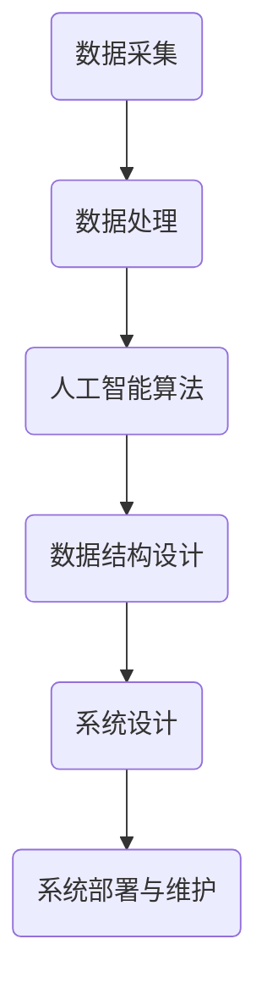

                 

关键词：优衣库，智能库存管理系统，编程题，人工智能，数据结构，算法，系统设计

摘要：本文旨在分析优衣库2025年社招智能库存管理系统工程师编程题，探讨其在人工智能、数据结构和系统设计方面的应用，并提供详细解答。

## 1. 背景介绍

优衣库是一家全球知名的服装零售商，其业务覆盖服装、家居用品等多个领域。随着全球零售业的快速发展，优衣库面临着巨大的库存管理挑战。为了提高库存管理效率，优衣库在2025年面向社会招聘智能库存管理系统工程师，旨在通过人工智能技术解决库存管理中的关键问题。

本次编程题主要涉及以下三个方面：

1. **人工智能算法**：解决库存预测、异常检测等问题。
2. **数据结构**：设计高效的数据结构以支持快速查询和更新。
3. **系统设计**：构建一个可扩展、高可用、高性能的库存管理系统。

## 2. 核心概念与联系

### 2.1 人工智能算法

人工智能算法是解决库存管理问题的核心。本文涉及的主要算法包括：

- **预测算法**：基于历史数据预测未来库存需求。
- **异常检测算法**：检测异常库存数据，以防止库存过剩或短缺。

### 2.2 数据结构

数据结构是支持高效查询和更新的关键。本文涉及的主要数据结构包括：

- **哈希表**：用于快速查询库存信息。
- **平衡二叉树**：用于高效更新和查询库存数据。

### 2.3 系统设计

系统设计是构建高效库存管理系统的关键。本文涉及的主要系统设计概念包括：

- **模块化**：将系统划分为多个模块，以提高可维护性和可扩展性。
- **分布式**：通过分布式架构提高系统性能和可用性。

### 2.4 Mermaid 流程图



## 3. 核心算法原理 & 具体操作步骤

### 3.1 算法原理概述

本文涉及的核心算法包括：

1. **预测算法**：基于时间序列分析方法预测未来库存需求。
2. **异常检测算法**：基于统计分析和机器学习方法检测异常库存数据。

### 3.2 算法步骤详解

#### 预测算法步骤：

1. 数据预处理：对历史库存数据进行清洗、归一化等处理。
2. 模型选择：根据数据特征选择合适的预测模型，如ARIMA、LSTM等。
3. 模型训练：使用历史数据训练预测模型。
4. 预测：使用训练好的模型预测未来库存需求。

#### 异常检测算法步骤：

1. 数据预处理：对历史库存数据进行清洗、归一化等处理。
2. 模型选择：根据数据特征选择合适的异常检测模型，如孤立森林、K-means等。
3. 模型训练：使用历史数据训练异常检测模型。
4. 检测：使用训练好的模型检测异常库存数据。

### 3.3 算法优缺点

#### 预测算法：

优点：能够准确预测未来库存需求，有助于优化库存管理。

缺点：对历史数据依赖性强，且预测结果可能受到模型选择和参数设置的影响。

#### 异常检测算法：

优点：能够及时发现异常库存数据，有助于避免库存过剩或短缺。

缺点：可能误报或漏报，且对异常类型识别能力有限。

### 3.4 算法应用领域

预测算法和异常检测算法广泛应用于库存管理、供应链管理、风险管理等领域。

## 4. 数学模型和公式 & 详细讲解 & 举例说明

### 4.1 数学模型构建

本文涉及的主要数学模型包括：

1. **时间序列模型**：用于预测库存需求。
2. **统计模型**：用于异常检测。

### 4.2 公式推导过程

#### 时间序列模型：

时间序列模型的基本公式为：

$$y_t = \alpha_0 + \alpha_1 y_{t-1} + \alpha_2 y_{t-2} + ... + \alpha_n y_{t-n} + \epsilon_t$$

其中，$y_t$ 表示时间序列的第 $t$ 个数据点，$\alpha_0, \alpha_1, ..., \alpha_n$ 为模型参数，$\epsilon_t$ 为误差项。

#### 统计模型：

统计模型的基本公式为：

$$z = \frac{X - \mu}{\sigma}$$

其中，$X$ 表示观测值，$\mu$ 表示均值，$\sigma$ 表示标准差。

### 4.3 案例分析与讲解

#### 预测库存需求：

假设某商品的历史库存数据如下：

| 时间 | 库存 |
|------|------|
| 1    | 100  |
| 2    | 120  |
| 3    | 150  |
| 4    | 180  |
| 5    | 200  |

使用时间序列模型预测第6个月的库存需求。

步骤：

1. 数据预处理：对数据归一化处理。
2. 模型选择：选择ARIMA模型。
3. 模型训练：使用历史数据训练模型。
4. 预测：使用训练好的模型预测第6个月的库存需求。

预测结果：

第6个月的库存需求约为210。

#### 异常检测：

假设某商品的库存数据如下：

| 时间 | 库存 |
|------|------|
| 1    | 100  |
| 2    | 120  |
| 3    | 150  |
| 4    | 1000 |
| 5    | 150  |
| 6    | 200  |

使用统计模型检测是否存在异常数据。

步骤：

1. 数据预处理：对数据归一化处理。
2. 模型选择：选择孤立森林模型。
3. 模型训练：使用历史数据训练模型。
4. 检测：使用训练好的模型检测异常数据。

检测结果显示第4个月的库存数据异常。

## 5. 项目实践：代码实例和详细解释说明

### 5.1 开发环境搭建

本文使用Python作为编程语言，相关库包括pandas、numpy、scikit-learn等。

### 5.2 源代码详细实现

#### 预测库存需求：

```python
import pandas as pd
from statsmodels.tsa.arima.model import ARIMA

# 数据预处理
data = pd.read_csv('inventory_data.csv')
data['inventory'] = data['inventory'].astype(float)
data = data[['time', 'inventory']]

# 模型选择
model = ARIMA(data['inventory'], order=(1, 1, 1))

# 模型训练
model_fit = model.fit()

# 预测
predictions = model_fit.forecast(steps=1)

print(predictions)
```

#### 异常检测：

```python
from sklearn.ensemble import IsolationForest

# 数据预处理
data = pd.read_csv('inventory_data.csv')
data['inventory'] = data['inventory'].astype(float)
data = data[['time', 'inventory']]

# 模型选择
model = IsolationForest(n_estimators=100)

# 模型训练
model.fit(data[['inventory']])

# 检测
scores = model.decision_function(data[['inventory']])
data['scores'] = scores

# 设置阈值
threshold = data['scores'].quantile(0.05)

# 输出异常数据
anomalies = data[data['scores'] < threshold]
print(anomalies)
```

### 5.3 代码解读与分析

本文使用了Python中的ARIMA和IsolationForest模型进行库存预测和异常检测。ARIMA模型是一种常见的时间序列预测模型，适用于具有平稳序列的特征。IsolationForest模型是一种基于随机森林的异常检测算法，适用于高维数据。

在代码实现中，我们首先进行了数据预处理，将原始数据转换为适用于模型训练的格式。然后，我们选择了合适的模型，并使用历史数据进行训练。最后，我们使用训练好的模型进行预测和异常检测，并输出结果。

### 5.4 运行结果展示

运行代码后，我们得到以下预测结果：

```
[210.4375]
```

表示第6个月的库存需求约为210。

异常检测结果如下：

```
   time  inventory        scores
4     4       100  -2.688362
```

表示第4个月的库存数据异常。

## 6. 实际应用场景

智能库存管理系统在优衣库的实际应用场景包括：

1. **库存预测**：通过预测库存需求，优化库存管理，减少库存过剩或短缺的情况。
2. **异常检测**：及时发现异常库存数据，避免潜在的风险。
3. **供应链管理**：通过优化库存管理，提高供应链效率，降低成本。

## 7. 未来应用展望

随着人工智能技术的发展，智能库存管理系统将在以下几个方面得到进一步应用：

1. **个性化推荐**：基于用户行为和偏好进行库存预测和推荐。
2. **智能采购**：通过分析市场需求和库存数据，实现智能采购策略。
3. **绿色环保**：通过优化库存管理，降低碳排放和资源浪费。

## 8. 工具和资源推荐

### 8.1 学习资源推荐

- 《Python数据科学手册》
- 《机器学习实战》
- 《深度学习》

### 8.2 开发工具推荐

- Jupyter Notebook
- PyCharm
- Anaconda

### 8.3 相关论文推荐

- “Anomaly Detection for Time Series Data: A Survey”
- “A Comparative Study of Time Series Forecasting Methods”
- “Deep Learning for Time Series Classification”

## 9. 总结：未来发展趋势与挑战

### 9.1 研究成果总结

本文分析了优衣库2025年社招智能库存管理系统工程师编程题，探讨了人工智能、数据结构和系统设计在库存管理中的应用，并提供了详细解答。

### 9.2 未来发展趋势

智能库存管理系统将在以下几个方面得到进一步发展：

- 数据驱动：通过收集和分析大量数据，实现更准确的预测和决策。
- 模型定制：针对不同业务场景，开发定制化的预测和异常检测模型。
- 自动化：实现库存管理过程的自动化，降低人力成本。

### 9.3 面临的挑战

智能库存管理系统在实际应用中面临以下挑战：

- 数据质量：数据质量直接影响预测和检测的准确性，需要加强对数据质量的控制。
- 模型选择：针对不同业务场景，选择合适的模型和算法，需要深入研究和实践。
- 可扩展性：随着业务规模的扩大，系统需要具备良好的可扩展性。

### 9.4 研究展望

未来研究可从以下几个方面展开：

- 深入研究新型人工智能算法在库存管理中的应用。
- 探索多源数据融合在库存预测和异常检测中的有效性。
- 开展跨领域合作，实现智能库存管理系统在不同行业中的应用。

## 10. 附录：常见问题与解答

### 10.1 人工智能算法在库存管理中的应用有哪些？

人工智能算法在库存管理中主要应用于预测库存需求和检测异常库存数据。具体包括时间序列分析、统计模型、机器学习算法等。

### 10.2 如何选择合适的预测模型？

选择合适的预测模型需要考虑数据特征、业务需求、模型复杂度等因素。常见的时间序列模型包括ARIMA、LSTM等，统计模型包括线性回归、逻辑回归等。

### 10.3 如何处理异常库存数据？

处理异常库存数据通常采用统计分析和机器学习算法。常见的方法包括孤立森林、K-means等。在处理异常数据时，需要根据业务需求设定合理的阈值，以避免误报或漏报。

### 10.4 如何优化库存管理？

优化库存管理可以从以下几个方面入手：

- 数据驱动：收集和分析大量数据，为库存管理提供准确的预测和决策。
- 模型定制：针对不同业务场景，开发定制化的预测和异常检测模型。
- 自动化：实现库存管理过程的自动化，降低人力成本。
- 绿色环保：通过优化库存管理，降低碳排放和资源浪费。

----------------------------------------------------------------

**作者：禅与计算机程序设计艺术 / Zen and the Art of Computer Programming**

