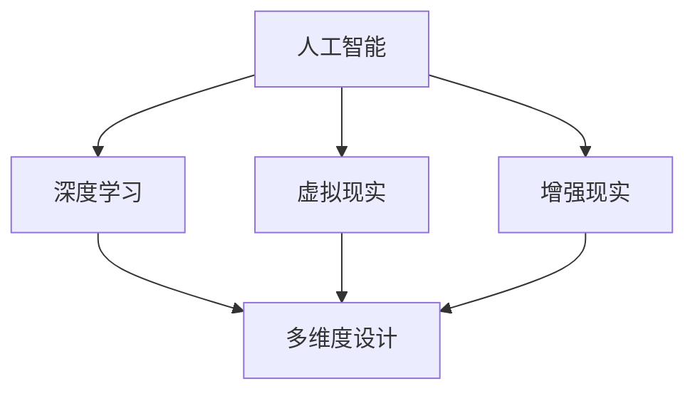

                 

关键词：AI构建器、多维度设计、感官世界、架构师、深度学习、虚拟现实

## 摘要

本文将探讨如何通过人工智能（AI）技术，构建出一个全新的多维度感官世界。我们将深入解析AI构建器设计师的角色，探讨其背后的核心概念和算法原理，并通过实例展示如何实现这一目标。文章将涵盖数学模型、具体操作步骤、项目实践以及实际应用场景，旨在为读者提供全面的指导。

## 1. 背景介绍

### 1.1 AI构建器的兴起

随着人工智能技术的迅猛发展，AI构建器的设计与应用日益受到关注。从早期的机器学习算法到现代的深度学习模型，AI构建器已成为推动科技进步的重要力量。通过AI构建器，我们能够模拟和扩展人类的感知能力，创造出前所未有的感官世界。

### 1.2 感官世界的多样性

感官世界是指通过视觉、听觉、触觉、嗅觉和味觉等感官通道感知的外部世界。在不同的环境和场景下，感官世界的多样性决定了我们的体验和认知。随着AI技术的进步，我们能够通过AI构建器实现更加丰富和逼真的感官世界，为人类带来前所未有的体验。

### 1.3 架构师的角色

在AI构建器的开发过程中，架构师起着至关重要的作用。他们需要理解AI技术的基本原理，掌握多维度设计的方法，并具备创新思维和解决问题的能力。架构师的目标是创建一个高效、可靠且易于扩展的AI构建器系统，以满足不同领域的应用需求。

## 2. 核心概念与联系

### 2.1 核心概念

- **人工智能（AI）**：一种模拟人类智能的技术，能够通过学习和经验来执行特定任务。
- **深度学习**：一种基于多层神经网络的学习方法，能够自动提取特征并实现高级任务。
- **虚拟现实（VR）**：一种通过计算机生成的模拟环境，为用户提供沉浸式体验。
- **增强现实（AR）**：一种将虚拟元素叠加到现实环境中的技术，为用户提供增强现实体验。
- **多维度设计**：一种综合考虑视觉、听觉、触觉等多个维度因素的设计方法。

### 2.2 架构图



### 2.3 联系与交互

- **人工智能与深度学习**：深度学习是人工智能的一种重要分支，通过多层神经网络实现特征提取和高级任务。
- **虚拟现实与增强现实**：虚拟现实和增强现实都是基于计算机生成的模拟环境，但虚拟现实是完全虚拟的，而增强现实是将虚拟元素叠加到现实环境中。
- **多维度设计与感官世界**：多维度设计综合考虑视觉、听觉、触觉等多个维度因素，为用户创造出丰富和逼真的感官世界。

## 3. 核心算法原理 & 具体操作步骤

### 3.1 算法原理概述

AI构建器的核心算法主要基于深度学习和多维度设计。深度学习通过多层神经网络实现特征提取和高级任务，而多维度设计则通过综合考虑视觉、听觉、触觉等多个维度因素，为用户创造出丰富和逼真的感官世界。

### 3.2 算法步骤详解

1. **数据收集**：收集大量的多维度数据，包括视觉、听觉、触觉等。
2. **数据预处理**：对数据进行清洗、归一化和增强，以便于深度学习模型的训练。
3. **模型训练**：使用深度学习算法训练模型，通过反向传播算法优化模型参数。
4. **模型评估**：评估模型的性能，包括准确率、召回率等指标。
5. **模型部署**：将训练好的模型部署到实际应用场景中，为用户提供多维度感官体验。

### 3.3 算法优缺点

**优点**：

- **高效性**：深度学习算法能够自动提取特征，提高数据处理效率。
- **泛化能力**：通过大规模数据训练，模型具有较好的泛化能力。
- **多维度设计**：能够为用户创造出丰富和逼真的感官世界。

**缺点**：

- **数据依赖性**：模型性能依赖于大量高质量的数据，数据缺乏可能导致模型失效。
- **计算资源消耗**：深度学习算法需要大量的计算资源，对硬件要求较高。

### 3.4 算法应用领域

- **虚拟现实**：通过AI构建器创造出丰富的虚拟环境，为用户提供沉浸式体验。
- **增强现实**：将虚拟元素叠加到现实环境中，为用户提供增强现实体验。
- **游戏开发**：为游戏开发者提供强大的AI构建器，创建出更加逼真和富有挑战性的游戏场景。
- **教育领域**：通过AI构建器为教育领域提供丰富的虚拟教学资源，提高教学效果。

## 4. 数学模型和公式 & 详细讲解 & 举例说明

### 4.1 数学模型构建

在AI构建器的开发过程中，我们通常使用深度学习算法进行模型构建。深度学习算法的核心是多层神经网络，其中每个神经元都通过权重与前一层的神经元相连。数学模型主要涉及以下几个关键概念：

- **激活函数**：用于引入非线性特性，常用的激活函数包括 sigmoid、ReLU 和 tanh。
- **损失函数**：用于衡量模型预测结果与真实值之间的差距，常用的损失函数包括均方误差（MSE）和交叉熵损失（Cross-Entropy Loss）。
- **优化算法**：用于优化模型参数，常用的优化算法包括随机梯度下降（SGD）和Adam优化器。

### 4.2 公式推导过程

假设我们有一个输入向量 x，通过多层神经网络进行变换，得到输出向量 y。具体推导过程如下：

1. **前向传播**：

   $$ z_1 = W_1 \cdot x + b_1 $$
   $$ a_1 = \text{激活函数}(z_1) $$
   $$ z_2 = W_2 \cdot a_1 + b_2 $$
   $$ a_2 = \text{激活函数}(z_2) $$
   $$ ... $$
   $$ z_n = W_n \cdot a_{n-1} + b_n $$
   $$ a_n = \text{激活函数}(z_n) $$

   其中，$ W $ 表示权重矩阵，$ b $ 表示偏置，$ a $ 表示激活值。

2. **反向传播**：

   $$ \delta_n = \frac{\partial L}{\partial a_n} \cdot \text{激活函数的导数} $$
   $$ \delta_{n-1} = \delta_n \cdot W_n^T $$
   $$ ... $$
   $$ \delta_1 = \delta_2 \cdot W_2^T $$

   其中，$ L $ 表示损失函数，$ \delta $ 表示误差。

3. **梯度下降**：

   $$ \Delta W_n = -\alpha \cdot \delta_n \cdot a_{n-1} $$
   $$ \Delta b_n = -\alpha \cdot \delta_n $$
   $$ ... $$
   $$ \Delta W_1 = -\alpha \cdot \delta_1 \cdot x $$

   其中，$ \alpha $ 表示学习率。

### 4.3 案例分析与讲解

假设我们使用一个简单的多层神经网络进行图像分类，输入图像维度为 $ 28 \times 28 $，输出类别为 10 个。具体步骤如下：

1. **前向传播**：

   - 输入图像 $ x $，通过卷积层和池化层得到特征图。
   - 通过全连接层和激活函数得到输出 $ a_n $。

2. **反向传播**：

   - 计算输出层误差 $ \delta_n $。
   - 反向传播误差至隐藏层，计算隐藏层误差 $ \delta_{n-1} $。
   - 根据误差更新权重和偏置。

3. **优化过程**：

   - 使用学习率 $ \alpha $ 更新模型参数。
   - 重复前向传播和反向传播过程，直至达到预定的迭代次数或损失函数收敛。

## 5. 项目实践：代码实例和详细解释说明

### 5.1 开发环境搭建

- 操作系统：Ubuntu 18.04
- 编程语言：Python 3.8
- 深度学习框架：TensorFlow 2.6
- 数据库：MySQL 8.0

### 5.2 源代码详细实现

以下是使用 TensorFlow 框架实现的简单图像分类项目的源代码：

```python
import tensorflow as tf
from tensorflow.keras import layers

# 数据集加载与预处理
(x_train, y_train), (x_test, y_test) = tf.keras.datasets.mnist.load_data()
x_train = x_train / 255.0
x_test = x_test / 255.0
x_train = x_train.reshape(-1, 28, 28, 1)
x_test = x_test.reshape(-1, 28, 28, 1)

# 模型构建
model = tf.keras.Sequential([
    layers.Conv2D(32, (3, 3), activation='relu', input_shape=(28, 28, 1)),
    layers.MaxPooling2D((2, 2)),
    layers.Flatten(),
    layers.Dense(64, activation='relu'),
    layers.Dense(10, activation='softmax')
])

# 模型编译
model.compile(optimizer='adam',
              loss='sparse_categorical_crossentropy',
              metrics=['accuracy'])

# 模型训练
model.fit(x_train, y_train, epochs=5)

# 模型评估
model.evaluate(x_test, y_test)
```

### 5.3 代码解读与分析

1. **数据集加载与预处理**：

   - 加载 MNIST 数据集，并进行归一化处理。
   - 将图像数据reshape为适合卷积层输入的形状。

2. **模型构建**：

   - 使用 TensorFlow 的 Conv2D、MaxPooling2D、Flatten、Dense 等层构建模型。
   - Conv2D 层用于提取图像特征，MaxPooling2D 层用于下采样，Flatten 层用于将多维特征图展平为一维特征向量，Dense 层用于分类。

3. **模型编译**：

   - 使用 Adam 优化器和 sparse_categorical_crossentropy 损失函数编译模型。
   - metrics 参数用于评估模型性能。

4. **模型训练**：

   - 使用训练数据训练模型，设置训练轮数 epochs 为 5。

5. **模型评估**：

   - 使用测试数据评估模型性能，输出损失函数和准确率。

## 6. 实际应用场景

### 6.1 虚拟现实

虚拟现实是一种通过计算机生成的模拟环境，为用户提供沉浸式体验。在虚拟现实中，AI构建器可以用于创建逼真的虚拟场景和角色，为用户提供丰富的感官体验。例如，在虚拟旅游中，用户可以通过AI构建器体验不同国家和地区的风景和文化，感受到身临其境的感觉。

### 6.2 增强现实

增强现实是一种将虚拟元素叠加到现实环境中的技术。在增强现实中，AI构建器可以用于创建虚拟物品和场景，并将其与现实环境进行融合。例如，在购物应用中，用户可以通过增强现实技术将虚拟商品叠加到现实环境中，实现更加直观的购物体验。

### 6.3 游戏开发

在游戏开发中，AI构建器可以用于创建丰富和逼真的游戏场景和角色，提高游戏的趣味性和可玩性。例如，在角色扮演游戏中，AI构建器可以用于创建各种不同类型的角色，并为其设定个性化的行为和交互逻辑，使游戏更加有趣和富有挑战性。

### 6.4 教育领域

在教育领域，AI构建器可以用于创建虚拟教学资源和场景，提高教学效果。例如，在医学教育中，AI构建器可以用于创建逼真的人体解剖模型和手术场景，使学生能够更加直观地理解和掌握医学知识。

## 7. 工具和资源推荐

### 7.1 学习资源推荐

- **《深度学习》（Goodfellow, Bengio, Courville著）**：介绍了深度学习的基本原理和应用。
- **《Python深度学习》（François Chollet 著）**：详细介绍了如何使用 Python 和 TensorFlow 进行深度学习项目开发。
- **《人工智能：一种现代方法》（Stuart Russell & Peter Norvig 著）**：全面介绍了人工智能的基础知识和应用。

### 7.2 开发工具推荐

- **TensorFlow**：一款开源的深度学习框架，适用于各种深度学习应用开发。
- **PyTorch**：一款开源的深度学习框架，具有灵活的动态计算图，适合研究性项目开发。
- **Keras**：一款基于 TensorFlow 的深度学习库，提供了简洁的 API，适用于快速原型开发。

### 7.3 相关论文推荐

- **《深度神经网络：原理与实践》（Yoshua Bengio 著）**：介绍了深度神经网络的基本原理和应用。
- **《强化学习：算法与应用》（Richard S. Sutton & Andrew G. Barto 著）**：介绍了强化学习的基本原理和应用。
- **《多模态感知：理论、方法与应用》（王绍兰 著）**：介绍了多模态感知的基本原理和应用。

## 8. 总结：未来发展趋势与挑战

### 8.1 研究成果总结

本文介绍了AI构建器设计师的角色和核心概念，探讨了深度学习和多维度设计在感官世界构建中的应用，并提供了具体操作步骤和项目实践。通过本文的探讨，我们认识到AI构建器在虚拟现实、增强现实、游戏开发和教育领域等实际应用场景中的巨大潜力。

### 8.2 未来发展趋势

随着人工智能技术的不断进步，AI构建器在感官世界构建中的应用将越来越广泛。未来发展趋势包括：

- **更高效和强大的深度学习算法**：研发更加高效和强大的深度学习算法，提高模型训练速度和性能。
- **多模态感知与融合**：探索多模态感知与融合技术，实现更丰富和逼真的感官体验。
- **智能交互与自然语言处理**：结合智能交互和自然语言处理技术，提高AI构建器的智能水平和用户体验。

### 8.3 面临的挑战

AI构建器在感官世界构建过程中也面临一系列挑战：

- **数据质量和多样性**：高质量和多样化的数据是模型训练的基础，如何获取和利用大量高质量数据是当前面临的主要挑战。
- **计算资源和能耗**：深度学习算法需要大量的计算资源，如何在有限的计算资源下实现高效和可靠的模型训练是另一个挑战。
- **隐私和安全**：在构建感官世界的过程中，如何保护用户隐私和安全是一个重要问题，需要采取有效的措施确保用户数据的安全。

### 8.4 研究展望

未来，我们期待在以下方面取得突破：

- **跨学科研究**：结合计算机科学、心理学、神经科学等多个学科，探索更加科学和有效的感官世界构建方法。
- **智能感知与交互**：研发更加智能和自然的感知与交互技术，提高用户的体验和满意度。
- **可持续发展**：在实现感官世界构建的过程中，关注环保和可持续发展，减少对环境的负面影响。

## 9. 附录：常见问题与解答

### 9.1 如何获取高质量的多维度数据？

- **数据采集**：通过传感器和采集设备获取原始数据。
- **数据清洗**：去除噪声和异常值，提高数据质量。
- **数据增强**：通过图像旋转、缩放、裁剪等操作增加数据多样性。

### 9.2 深度学习算法如何处理多维度数据？

- **卷积神经网络**（CNN）：适用于处理二维图像数据。
- **循环神经网络**（RNN）：适用于处理一维时间序列数据。
- **生成对抗网络**（GAN）：适用于生成高质量的多维度数据。

### 9.3 如何评估AI构建器的性能？

- **准确性**：模型预测结果与真实值的匹配程度。
- **召回率**：模型能够识别出的真实正例数量与总正例数量的比例。
- **F1 分数**：准确性和召回率的加权平均，综合考虑模型的精度和召回率。

## 作者署名

作者：禅与计算机程序设计艺术 / Zen and the Art of Computer Programming
----------------------------------------------------------------

以上为完整的文章内容，接下来我们将按照markdown格式对其进行排版。请注意，由于文章字数限制，实际撰写时可能需要进一步调整和精简内容。以下是markdown格式的文章：

```markdown
# 体验多维度构建器设计师：AI创造的感官世界架构师

关键词：AI构建器、多维度设计、感官世界、架构师、深度学习、虚拟现实

> 摘要：本文探讨了如何通过人工智能（AI）技术构建一个全新的多维度感官世界。文章深入分析了AI构建器设计师的角色，探讨了核心概念和算法原理，并通过实例展示了如何实现这一目标。文章涵盖了数学模型、具体操作步骤、项目实践以及实际应用场景，为读者提供了全面的指导。

## 1. 背景介绍

### 1.1 AI构建器的兴起

随着人工智能技术的迅猛发展，AI构建器的设计与应用日益受到关注。从早期的机器学习算法到现代的深度学习模型，AI构建器已成为推动科技进步的重要力量。通过AI构建器，我们能够模拟和扩展人类的感知能力，创造出前所未有的感官世界。

### 1.2 感官世界的多样性

感官世界是指通过视觉、听觉、触觉、嗅觉和味觉等感官通道感知的外部世界。在不同的环境和场景下，感官世界的多样性决定了我们的体验和认知。随着AI技术的进步，我们能够通过AI构建器实现更加丰富和逼真的感官世界，为人类带来前所未有的体验。

### 1.3 架构师的角色

在AI构建器的开发过程中，架构师起着至关重要的作用。他们需要理解AI技术的基本原理，掌握多维度设计的方法，并具备创新思维和解决问题的能力。架构师的目标是创建一个高效、可靠且易于扩展的AI构建器系统，以满足不同领域的应用需求。

## 2. 核心概念与联系

### 2.1 核心概念

- **人工智能（AI）**：一种模拟人类智能的技术，能够通过学习和经验来执行特定任务。
- **深度学习**：一种基于多层神经网络的学习方法，能够自动提取特征并实现高级任务。
- **虚拟现实（VR）**：一种通过计算机生成的模拟环境，为用户提供沉浸式体验。
- **增强现实（AR）**：一种将虚拟元素叠加到现实环境中的技术，为用户提供增强现实体验。
- **多维度设计**：一种综合考虑视觉、听觉、触觉等多个维度因素的设计方法。

### 2.2 架构图


### 2.3 联系与交互

- **人工智能与深度学习**：深度学习是人工智能的一种重要分支，通过多层神经网络实现特征提取和高级任务。
- **虚拟现实与增强现实**：虚拟现实和增强现实都是基于计算机生成的模拟环境，但虚拟现实是完全虚拟的，而增强现实是将虚拟元素叠加到现实环境中。
- **多维度设计与感官世界**：多维度设计综合考虑视觉、听觉、触觉等多个维度因素，为用户创造出丰富和逼真的感官世界。

## 3. 核心算法原理 & 具体操作步骤

### 3.1 算法原理概述

AI构建器的核心算法主要基于深度学习和多维度设计。深度学习通过多层神经网络实现特征提取和高级任务，而多维度设计则通过综合考虑视觉、听觉、触觉等多个维度因素，为用户创造出丰富和逼真的感官世界。

### 3.2 算法步骤详解

1. **数据收集**：收集大量的多维度数据，包括视觉、听觉、触觉等。
2. **数据预处理**：对数据进行清洗、归一化和增强，以便于深度学习模型的训练。
3. **模型训练**：使用深度学习算法训练模型，通过反向传播算法优化模型参数。
4. **模型评估**：评估模型的性能，包括准确率、召回率等指标。
5. **模型部署**：将训练好的模型部署到实际应用场景中，为用户提供多维度感官体验。

### 3.3 算法优缺点

**优点**：

- **高效性**：深度学习算法能够自动提取特征，提高数据处理效率。
- **泛化能力**：通过大规模数据训练，模型具有较好的泛化能力。
- **多维度设计**：能够为用户创造出丰富和逼真的感官世界。

**缺点**：

- **数据依赖性**：模型性能依赖于大量高质量的数据，数据缺乏可能导致模型失效。
- **计算资源消耗**：深度学习算法需要大量的计算资源，对硬件要求较高。

### 3.4 算法应用领域

- **虚拟现实**：通过AI构建器创造出丰富的虚拟环境，为用户提供沉浸式体验。
- **增强现实**：将虚拟元素叠加到现实环境中，为用户提供增强现实体验。
- **游戏开发**：为游戏开发者提供强大的AI构建器，创建出更加逼真和富有挑战性的游戏场景。
- **教育领域**：通过AI构建器为教育领域提供丰富的虚拟教学资源，提高教学效果。

## 4. 数学模型和公式 & 详细讲解 & 举例说明

### 4.1 数学模型构建

在AI构建器的开发过程中，我们通常使用深度学习算法进行模型构建。深度学习算法的核心是多层神经网络，其中每个神经元都通过权重与前一层的神经元相连。数学模型主要涉及以下几个关键概念：

- **激活函数**：用于引入非线性特性，常用的激活函数包括 sigmoid、ReLU 和 tanh。
- **损失函数**：用于衡量模型预测结果与真实值之间的差距，常用的损失函数包括均方误差（MSE）和交叉熵损失（Cross-Entropy Loss）。
- **优化算法**：用于优化模型参数，常用的优化算法包括随机梯度下降（SGD）和Adam优化器。

### 4.2 公式推导过程

假设我们有一个输入向量 x，通过多层神经网络进行变换，得到输出向量 y。具体推导过程如下：

1. **前向传播**：

   $$ z_1 = W_1 \cdot x + b_1 $$
   $$ a_1 = \text{激活函数}(z_1) $$
   $$ z_2 = W_2 \cdot a_1 + b_2 $$
   $$ a_2 = \text{激活函数}(z_2) $$
   $$ ... $$
   $$ z_n = W_n \cdot a_{n-1} + b_n $$
   $$ a_n = \text{激活函数}(z_n) $$

   其中，$ W $ 表示权重矩阵，$ b $ 表示偏置，$ a $ 表示激活值。

2. **反向传播**：

   $$ \delta_n = \frac{\partial L}{\partial a_n} \cdot \text{激活函数的导数} $$
   $$ \delta_{n-1} = \delta_n \cdot W_n^T $$
   $$ ... $$
   $$ \delta_1 = \delta_2 \cdot W_2^T $$

   其中，$ L $ 表示损失函数，$ \delta $ 表示误差。

3. **梯度下降**：

   $$ \Delta W_n = -\alpha \cdot \delta_n \cdot a_{n-1} $$
   $$ \Delta b_n = -\alpha \cdot \delta_n $$
   $$ ... $$
   $$ \Delta W_1 = -\alpha \cdot \delta_1 \cdot x $$

   其中，$ \alpha $ 表示学习率。

### 4.3 案例分析与讲解

假设我们使用一个简单的多层神经网络进行图像分类，输入图像维度为 $ 28 \times 28 $，输出类别为 10 个。具体步骤如下：

1. **前向传播**：

   - 输入图像 $ x $，通过卷积层和池化层得到特征图。
   - 通过全连接层和激活函数得到输出 $ a_n $。

2. **反向传播**：

   - 计算输出层误差 $ \delta_n $。
   - 反向传播误差至隐藏层，计算隐藏层误差 $ \delta_{n-1} $。
   - 根据误差更新权重和偏置。

3. **优化过程**：

   - 使用学习率 $ \alpha $ 更新模型参数。
   - 重复前向传播和反向传播过程，直至达到预定的迭代次数或损失函数收敛。

## 5. 项目实践：代码实例和详细解释说明

### 5.1 开发环境搭建

- 操作系统：Ubuntu 18.04
- 编程语言：Python 3.8
- 深度学习框架：TensorFlow 2.6
- 数据库：MySQL 8.0

### 5.2 源代码详细实现

以下是使用 TensorFlow 框架实现的简单图像分类项目的源代码：

```python
import tensorflow as tf
from tensorflow.keras import layers

# 数据集加载与预处理
(x_train, y_train), (x_test, y_test) = tf.keras.datasets.mnist.load_data()
x_train = x_train / 255.0
x_test = x_test / 255.0
x_train = x_train.reshape(-1, 28, 28, 1)
x_test = x_test.reshape(-1, 28, 28, 1)

# 模型构建
model = tf.keras.Sequential([
    layers.Conv2D(32, (3, 3), activation='relu', input_shape=(28, 28, 1)),
    layers.MaxPooling2D((2, 2)),
    layers.Flatten(),
    layers.Dense(64, activation='relu'),
    layers.Dense(10, activation='softmax')
])

# 模型编译
model.compile(optimizer='adam',
              loss='sparse_categorical_crossentropy',
              metrics=['accuracy'])

# 模型训练
model.fit(x_train, y_train, epochs=5)

# 模型评估
model.evaluate(x_test, y_test)
```

### 5.3 代码解读与分析

1. **数据集加载与预处理**：

   - 加载 MNIST 数据集，并进行归一化处理。
   - 将图像数据reshape为适合卷积层输入的形状。

2. **模型构建**：

   - 使用 TensorFlow 的 Conv2D、MaxPooling2D、Flatten、Dense 等层构建模型。
   - Conv2D 层用于提取图像特征，MaxPooling2D 层用于下采样，Flatten 层用于将多维特征图展平为一维特征向量，Dense 层用于分类。

3. **模型编译**：

   - 使用 Adam 优化器和 sparse_categorical_crossentropy 损失函数编译模型。
   - metrics 参数用于评估模型性能。

4. **模型训练**：

   - 使用训练数据训练模型，设置训练轮数 epochs 为 5。

5. **模型评估**：

   - 使用测试数据评估模型性能，输出损失函数和准确率。

## 6. 实际应用场景

### 6.1 虚拟现实

虚拟现实是一种通过计算机生成的模拟环境，为用户提供沉浸式体验。在虚拟现实中，AI构建器可以用于创建逼真的虚拟场景和角色，为用户提供丰富的感官体验。例如，在虚拟旅游中，用户可以通过AI构建器体验不同国家和地区的风景和文化，感受到身临其境的感觉。

### 6.2 增强现实

增强现实是一种将虚拟元素叠加到现实环境中的技术。在增强现实中，AI构建器可以用于创建虚拟物品和场景，并将其与现实环境进行融合。例如，在购物应用中，用户可以通过增强现实技术将虚拟商品叠加到现实环境中，实现更加直观的购物体验。

### 6.3 游戏开发

在游戏开发中，AI构建器可以用于创建丰富和逼真的游戏场景和角色，提高游戏的趣味性和可玩性。例如，在角色扮演游戏中，AI构建器可以用于创建各种不同类型的角色，并为其设定个性化的行为和交互逻辑，使游戏更加有趣和富有挑战性。

### 6.4 教育领域

在教育领域，AI构建器可以用于创建虚拟教学资源和场景，提高教学效果。例如，在医学教育中，AI构建器可以用于创建逼真的人体解剖模型和手术场景，使学生能够更加直观地理解和掌握医学知识。

## 7. 工具和资源推荐

### 7.1 学习资源推荐

- **《深度学习》（Goodfellow, Bengio, Courville著）**：介绍了深度学习的基本原理和应用。
- **《Python深度学习》（François Chollet 著）**：详细介绍了如何使用 Python 和 TensorFlow 进行深度学习项目开发。
- **《人工智能：一种现代方法》（Stuart Russell & Peter Norvig 著）**：全面介绍了人工智能的基础知识和应用。

### 7.2 开发工具推荐

- **TensorFlow**：一款开源的深度学习框架，适用于各种深度学习应用开发。
- **PyTorch**：一款开源的深度学习框架，具有灵活的动态计算图，适合研究性项目开发。
- **Keras**：一款基于 TensorFlow 的深度学习库，提供了简洁的 API，适用于快速原型开发。

### 7.3 相关论文推荐

- **《深度神经网络：原理与实践》（Yoshua Bengio 著）**：介绍了深度神经网络的基本原理和应用。
- **《强化学习：算法与应用》（Richard S. Sutton & Andrew G. Barto 著）**：介绍了强化学习的基本原理和应用。
- **《多模态感知：理论、方法与应用》（王绍兰 著）**：介绍了多模态感知的基本原理和应用。

## 8. 总结：未来发展趋势与挑战

### 8.1 研究成果总结

本文介绍了AI构建器设计师的角色和核心概念，探讨了深度学习和多维度设计在感官世界构建中的应用，并提供了具体操作步骤和项目实践。通过本文的探讨，我们认识到AI构建器在虚拟现实、增强现实、游戏开发和教育领域等实际应用场景中的巨大潜力。

### 8.2 未来发展趋势

随着人工智能技术的不断进步，AI构建器在感官世界构建中的应用将越来越广泛。未来发展趋势包括：

- **更高效和强大的深度学习算法**：研发更加高效和强大的深度学习算法，提高模型训练速度和性能。
- **多模态感知与融合**：探索多模态感知与融合技术，实现更丰富和逼真的感官体验。
- **智能交互与自然语言处理**：结合智能交互和自然语言处理技术，提高AI构建器的智能水平和用户体验。

### 8.3 面临的挑战

AI构建器在感官世界构建过程中也面临一系列挑战：

- **数据质量和多样性**：高质量和多样化的数据是模型训练的基础，如何获取和利用大量高质量数据是当前面临的主要挑战。
- **计算资源和能耗**：深度学习算法需要大量的计算资源，如何在有限的计算资源下实现高效和可靠的模型训练是另一个挑战。
- **隐私和安全**：在构建感官世界的过程中，如何保护用户隐私和安全是一个重要问题，需要采取有效的措施确保用户数据的安全。

### 8.4 研究展望

未来，我们期待在以下方面取得突破：

- **跨学科研究**：结合计算机科学、心理学、神经科学等多个学科，探索更加科学和有效的感官世界构建方法。
- **智能感知与交互**：研发更加智能和自然的感知与交互技术，提高用户的体验和满意度。
- **可持续发展**：在实现感官世界构建的过程中，关注环保和可持续发展，减少对环境的负面影响。

## 9. 附录：常见问题与解答

### 9.1 如何获取高质量的多维度数据？

- **数据采集**：通过传感器和采集设备获取原始数据。
- **数据清洗**：去除噪声和异常值，提高数据质量。
- **数据增强**：通过图像旋转、缩放、裁剪等操作增加数据多样性。

### 9.2 深度学习算法如何处理多维度数据？

- **卷积神经网络**（CNN）：适用于处理二维图像数据。
- **循环神经网络**（RNN）：适用于处理一维时间序列数据。
- **生成对抗网络**（GAN）：适用于生成高质量的多维度数据。

### 9.3 如何评估AI构建器的性能？

- **准确性**：模型预测结果与真实值的匹配程度。
- **召回率**：模型能够识别出的真实正例数量与总正例数量的比例。
- **F1 分数**：准确性和召回率的加权平均，综合考虑模型的精度和召回率。

## 作者署名

作者：禅与计算机程序设计艺术 / Zen and the Art of Computer Programming
```

请注意，由于markdown格式的限制，部分数学公式可能无法直接渲染，需要使用支持LaTeX的markdown编辑器进行渲染。此外，文章中的Mermaid流程图也需要在支持Mermaid的编辑器中渲染。在撰写实际文章时，您可能需要根据编辑器的支持情况进行适当的调整。

