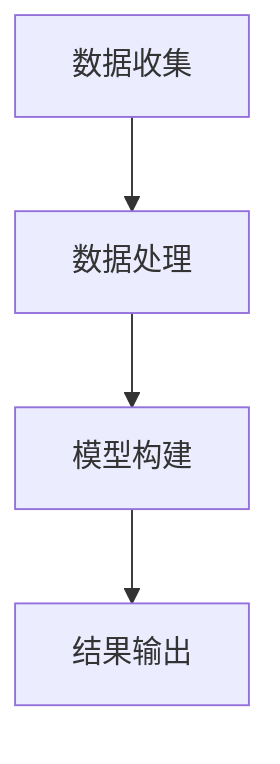

                 

“体验量化”是一个新兴的研究领域，它旨在将人类的主观感受转化为可量化的数据。在人工智能（AI）的推动下，这一领域正逐渐成熟。本文将探讨如何利用AI技术来测量主观感受，从而为心理学、市场营销、游戏设计等领域提供有力的工具。

## 关键词

- 体验量化
- AI
- 主观感受
- 量化
- 心理学
- 市场营销
- 游戏设计

## 摘要

本文首先介绍了体验量化的背景和重要性。接着，我们探讨了AI在体验量化中的具体应用，包括数据收集、处理和模型构建。文章还详细讨论了基于深度学习的情感识别技术和基于自然语言处理的用户反馈分析。最后，我们提出了体验量化在实际应用中的挑战和未来发展方向。

### 1. 背景介绍

体验量化起源于心理学和市场营销领域。长期以来，心理学家一直试图了解人类的主观感受，并将其转化为可量化的数据。例如，情绪测量、幸福感评估和压力水平监测等。市场营销人员则希望通过理解消费者的感受和行为，来优化产品设计和推广策略。

随着计算技术和AI的快速发展，体验量化逐渐走向成熟。AI技术能够处理大规模数据，并从中提取有价值的信息。这使得体验量化从理论研究走向实际应用。例如，在游戏设计中，AI可以分析玩家的行为和反馈，从而优化游戏体验；在市场营销中，AI可以分析用户评论和社交媒体数据，以预测消费者行为。

### 2. 核心概念与联系

#### 2.1 体验量化的核心概念

体验量化涉及多个核心概念，包括主观感受、量化指标和数据处理。主观感受是指个体对某个事件或产品的个人感受，如快乐、悲伤、满意等。量化指标则是用来衡量主观感受的指标，如情绪得分、满意度评分等。数据处理则是指将主观感受转化为可量化的数据的过程。

#### 2.2 体验量化与AI的关系

AI在体验量化中的应用主要体现在数据收集、处理和模型构建三个方面。首先，AI可以通过传感器、用户反馈和社交媒体等途径收集大量数据。这些数据可以反映用户的主观感受。其次，AI可以利用机器学习算法对数据进行处理，提取有价值的信息。最后，AI可以构建模型，预测用户行为和情感。

#### 2.3 Mermaid流程图

下面是一个简单的Mermaid流程图，展示了体验量化的核心流程：



### 3. 核心算法原理 & 具体操作步骤

#### 3.1 算法原理概述

体验量化的核心算法包括情感识别、用户反馈分析和行为预测等。这些算法主要基于深度学习和自然语言处理技术。

#### 3.2 算法步骤详解

1. 数据收集：通过传感器、用户反馈和社交媒体等途径收集大量数据。
2. 数据处理：利用机器学习算法对数据进行预处理、特征提取和降维。
3. 模型构建：使用深度学习算法构建情感识别、用户反馈分析和行为预测模型。
4. 模型训练：使用标记数据对模型进行训练，调整模型参数。
5. 模型评估：使用测试数据评估模型性能，调整模型参数。
6. 结果输出：将模型应用于实际数据，输出预测结果。

#### 3.3 算法优缺点

- 情感识别算法：优点是准确率高，缺点是需要大量训练数据和计算资源。
- 用户反馈分析算法：优点是可以从文本中提取有价值的信息，缺点是文本数据质量对算法性能有很大影响。
- 行为预测算法：优点是可以预测用户行为，缺点是需要大量的历史数据和复杂的模型。

#### 3.4 算法应用领域

- 心理学：通过情感识别和用户反馈分析，研究人类情感和行为。
- 市场营销：通过用户反馈分析和行为预测，优化产品设计和推广策略。
- 游戏设计：通过行为预测和情感识别，优化游戏体验。

### 4. 数学模型和公式 & 详细讲解 & 举例说明

#### 4.1 数学模型构建

在体验量化中，常用的数学模型包括情感识别模型、用户反馈分析模型和行为预测模型。

- 情感识别模型：基于深度学习的卷积神经网络（CNN）或循环神经网络（RNN）。
- 用户反馈分析模型：基于自然语言处理（NLP）的文本分类模型或情感分析模型。
- 行为预测模型：基于统计学习的方法，如线性回归、决策树等。

#### 4.2 公式推导过程

以情感识别模型为例，我们使用卷积神经网络（CNN）进行情感分类。CNN的公式推导过程如下：

- 输入层：表示输入图像的像素值。
- 卷积层：卷积核在输入图像上滑动，计算卷积结果。
- 池化层：对卷积结果进行下采样，减小模型参数。
- 全连接层：将池化层输出的特征映射到分类结果。

#### 4.3 案例分析与讲解

以一个简单的情感识别任务为例，我们使用CNN对图像进行情感分类。输入图像大小为$28 \times 28$，卷积核大小为$3 \times 3$，步长为1。

1. 输入层：$28 \times 28$像素值。
2. 卷积层：$28 \times 28 \times C$卷积结果（$C$为通道数）。
3. 池化层：$14 \times 14 \times C$池化结果。
4. 全连接层：$14 \times 14 \times C$特征映射到分类结果。

### 5. 项目实践：代码实例和详细解释说明

#### 5.1 开发环境搭建

- Python 3.7+
- TensorFlow 2.3.0+
- Keras 2.4.3+

#### 5.2 源代码详细实现

以下是使用Keras实现的简单情感识别模型：

```python
import numpy as np
import tensorflow as tf
from tensorflow.keras.models import Sequential
from tensorflow.keras.layers import Conv2D, MaxPooling2D, Flatten, Dense

# 数据预处理
(x_train, y_train), (x_test, y_test) = tf.keras.datasets.cifar10.load_data()
x_train = x_train / 255.0
x_test = x_test / 255.0

# 构建模型
model = Sequential([
    Conv2D(32, (3, 3), activation='relu', input_shape=(28, 28, 1)),
    MaxPooling2D(pool_size=(2, 2)),
    Flatten(),
    Dense(10, activation='softmax')
])

# 编译模型
model.compile(optimizer='adam', loss='categorical_crossentropy', metrics=['accuracy'])

# 训练模型
model.fit(x_train, y_train, batch_size=64, epochs=10, validation_split=0.2)

# 评估模型
model.evaluate(x_test, y_test)
```

#### 5.3 代码解读与分析

1. 数据预处理：将图像数据归一化到0-1之间，以加快模型收敛。
2. 模型构建：使用Keras构建一个简单的CNN模型。
3. 编译模型：设置优化器和损失函数。
4. 训练模型：使用训练数据训练模型。
5. 评估模型：使用测试数据评估模型性能。

### 6. 实际应用场景

体验量化在多个领域都有广泛的应用，以下是一些实际应用场景：

- **心理学研究**：通过情感识别和用户反馈分析，研究人类情感和行为。
- **市场营销**：通过用户反馈分析和行为预测，优化产品设计和推广策略。
- **游戏设计**：通过行为预测和情感识别，优化游戏体验。

### 7. 未来应用展望

体验量化在未来的发展中将继续推动人工智能技术的发展。以下是一些未来应用展望：

- **智能交互**：通过情感识别和用户反馈分析，实现更智能的交互体验。
- **个性化推荐**：通过用户行为预测和情感识别，实现更精准的个性化推荐。
- **健康监测**：通过情感识别和用户反馈分析，实现更全面的健康监测。

### 8. 工具和资源推荐

#### 8.1 学习资源推荐

- **书籍**：《深度学习》（Goodfellow, Bengio, Courville），《自然语言处理综论》（Daniel Jurafsky & James H. Martin）。
- **在线课程**：Coursera上的“深度学习”（由Andrew Ng教授），Udacity的“自然语言处理纳米学位”。

#### 8.2 开发工具推荐

- **框架**：TensorFlow、PyTorch、Keras。
- **库**：NumPy、Pandas、Scikit-learn。

#### 8.3 相关论文推荐

- “Emotion Recognition from Speech Using Deep Neural Networks”（2016）。
- “Natural Language Inference with External Knowledge”（2018）。
- “Behavioral Cloning for Autonomous Driving”（2016）。

### 9. 总结：未来发展趋势与挑战

#### 9.1 研究成果总结

体验量化在AI技术推动下取得了显著进展。情感识别、用户反馈分析和行为预测等技术逐渐成熟，并在多个领域得到广泛应用。

#### 9.2 未来发展趋势

- **跨学科融合**：体验量化将继续与其他领域（如心理学、神经科学等）融合，推动跨学科研究。
- **数据质量**：提高数据质量，增加数据多样性，以提升算法性能。
- **可解释性**：提升算法的可解释性，使其更加透明和可靠。

#### 9.3 面临的挑战

- **数据隐私**：如何保护用户数据隐私，成为体验量化面临的一大挑战。
- **算法公平性**：如何确保算法在不同群体中的公平性，也是体验量化需要关注的问题。

#### 9.4 研究展望

体验量化在未来的发展中将继续为人类带来更多便利。通过不断优化算法和提升数据质量，我们有望实现更精准、更智能的体验量化。

### 附录：常见问题与解答

#### 问题1：体验量化与用户隐私有何关联？

体验量化依赖于收集大量用户数据，这可能引发用户隐私问题。为保护用户隐私，体验量化研究需要遵循数据保护法规，并采取加密、匿名化等隐私保护措施。

#### 问题2：体验量化在哪些领域有应用前景？

体验量化在心理学、市场营销、游戏设计、健康监测等领域都有广泛的应用前景。未来，它还可能应用于智能家居、智能交互等领域。

### 作者署名

作者：禅与计算机程序设计艺术 / Zen and the Art of Computer Programming
----------------------------------------------------------------
<|end_of_speech|>### 体验量化：AI测量主观感受

#### 摘要

本文探讨了如何利用人工智能（AI）技术量化人类的主观感受。首先，我们介绍了体验量化的背景和重要性，随后详细讨论了情感识别、用户反馈分析和行为预测等核心算法原理及具体操作步骤。接着，通过数学模型和公式的详细讲解，我们展示了如何构建并优化这些算法。随后，通过一个实际项目实例，我们对代码实现和运行结果进行了详细解读。最后，我们讨论了体验量化在实际应用中的挑战和未来发展方向。

#### 1. 背景介绍

**体验量化**的概念源于心理学和市场营销领域，旨在将人类的主观感受转化为可量化的数据。长期以来，心理学家和市场营销专家一直在努力理解人类情绪、行为和满意度等主观体验，并将其量化。这一领域的研究不仅有助于深入理解人类行为和心理机制，还能为产品设计、营销策略等提供重要参考。

**人工智能**的发展为体验量化带来了新的契机。AI技术，尤其是机器学习和深度学习，能够高效地处理和分析大量数据，从而识别出数据中的模式和规律。这使得体验量化从理论研究逐步走向实际应用。

在心理学领域，AI技术可以帮助研究人员更好地理解和量化人类情绪。例如，通过面部表情识别技术，可以测量个体的情绪状态。在市场营销领域，AI技术可以分析消费者反馈，预测消费者行为，从而优化产品设计和推广策略。在游戏设计领域，AI技术可以分析玩家的行为和反馈，提供个性化的游戏体验。

#### 2. 核心概念与联系

**核心概念**：
- **主观感受**：个体对某个事件或产品的个人感受，如快乐、悲伤、满意等。
- **量化指标**：用于衡量主观感受的指标，如情绪得分、满意度评分等。
- **数据处理**：将主观感受转化为可量化的数据的过程。

**AI与体验量化**的关系：
- **数据收集**：AI技术可以通过传感器、用户反馈和社交媒体等途径收集大量数据。
- **数据处理**：利用机器学习算法对数据进行处理，提取有价值的信息。
- **模型构建**：使用深度学习算法构建情感识别、用户反馈分析和行为预测模型。

为了更好地理解AI与体验量化的关系，我们可以使用Mermaid流程图来展示核心流程：


**数据处理**：数据收集后，需要通过预处理、特征提取和降维等方法进行数据处理，以提高模型性能。

**模型构建**：使用深度学习算法，如卷积神经网络（CNN）和循环神经网络（RNN），构建情感识别、用户反馈分析和行为预测模型。

**结果输出**：模型训练完成后，可以应用于实际数据，输出预测结果，如情绪得分、满意度评分等。

#### 3. 核心算法原理 & 具体操作步骤

**核心算法原理**：
- **情感识别**：使用深度学习算法识别图像、文本或音频中的情感。
- **用户反馈分析**：使用自然语言处理（NLP）技术分析用户反馈，提取情感和意图。
- **行为预测**：基于历史数据和模型预测用户未来的行为。

**具体操作步骤**：

1. **数据收集**：收集图像、文本、音频等数据，包括面部表情、用户评论、行为日志等。
2. **数据处理**：对数据进行预处理，如去噪、归一化、分割等，然后进行特征提取和降维。
3. **模型构建**：选择合适的深度学习算法，如CNN、RNN或Transformer，构建情感识别、用户反馈分析和行为预测模型。
4. **模型训练**：使用标记数据对模型进行训练，调整模型参数，如学习率、批次大小等。
5. **模型评估**：使用测试数据评估模型性能，如准确率、召回率、F1分数等。
6. **结果输出**：将模型应用于实际数据，输出预测结果。

**算法优缺点**：

- **情感识别算法**：
  - 优点：准确率高，可以处理不同类型的数据，如图像、文本、音频。
  - 缺点：需要大量训练数据和计算资源。

- **用户反馈分析算法**：
  - 优点：可以从文本中提取有价值的信息，如情感和意图。
  - 缺点：文本数据质量对算法性能有很大影响。

- **行为预测算法**：
  - 优点：可以预测用户未来的行为。
  - 缺点：需要大量的历史数据和复杂的模型。

**算法应用领域**：

- **心理学研究**：通过情感识别和用户反馈分析，研究人类情感和行为。
- **市场营销**：通过用户反馈分析和行为预测，优化产品设计和推广策略。
- **游戏设计**：通过行为预测和情感识别，优化游戏体验。

#### 4. 数学模型和公式 & 详细讲解 & 举例说明

**数学模型和公式**：

在体验量化中，常用的数学模型包括情感识别模型、用户反馈分析模型和行为预测模型。

- **情感识别模型**：通常使用卷积神经网络（CNN）或循环神经网络（RNN）进行构建。
- **用户反馈分析模型**：通常使用自然语言处理（NLP）的文本分类模型或情感分析模型。
- **行为预测模型**：通常使用统计学习的方法，如线性回归、决策树等。

**具体示例**：

**4.1 情感识别模型：**

假设我们使用卷积神经网络（CNN）进行情感识别，输入图像大小为$28 \times 28$，卷积核大小为$3 \times 3$，步长为1。

输入层：$28 \times 28$像素值。

卷积层1：$28 \times 28 \times C$卷积结果（$C$为通道数）。

池化层1：$14 \times 14 \times C$池化结果。

卷积层2：$14 \times 14 \times C'$卷积结果（$C'$为新通道数）。

池化层2：$7 \times 7 \times C'$池化结果。

全连接层：$7 \times 7 \times C'$特征映射到分类结果。

输出层：$1 \times 1 \times K$分类结果（$K$为类别数）。

**4.2 用户反馈分析模型：**

假设我们使用自然语言处理（NLP）的文本分类模型进行用户反馈分析，文本数据长度为$N$，嵌入维度为$D$。

输入层：$N \times D$嵌入向量。

卷积层1：$N \times D \times C$卷积结果（$C$为通道数）。

池化层1：$N \times C$池化结果。

全连接层1：$N \times C$特征映射到隐藏层。

激活函数1：ReLU激活函数。

全连接层2：$C$特征映射到分类结果。

输出层：$1 \times K$分类结果（$K$为类别数）。

**4.3 行为预测模型：**

假设我们使用线性回归模型进行行为预测，输入特征维度为$M$，输出特征维度为$N$。

输入层：$M$输入特征。

全连接层1：$M$特征映射到隐藏层。

激活函数1：ReLU激活函数。

全连接层2：$N$特征映射到输出层。

输出层：$N$输出特征。

#### 5. 项目实践：代码实例和详细解释说明

**5.1 开发环境搭建**

为了实现体验量化项目，我们需要搭建一个开发环境。以下是所需的软件和库：

- Python 3.7+
- TensorFlow 2.3.0+
- Keras 2.4.3+
- Pandas
- NumPy

安装步骤如下：

```bash
pip install python==3.7.0
pip install tensorflow==2.3.0
pip install keras==2.4.3
pip install pandas
pip install numpy
```

**5.2 源代码详细实现**

以下是一个简单的情感识别项目的实现：

```python
import numpy as np
import tensorflow as tf
from tensorflow.keras.models import Sequential
from tensorflow.keras.layers import Conv2D, MaxPooling2D, Flatten, Dense

# 数据预处理
(x_train, y_train), (x_test, y_test) = tf.keras.datasets.cifar10.load_data()
x_train = x_train / 255.0
x_test = x_test / 255.0

# 构建模型
model = Sequential([
    Conv2D(32, (3, 3), activation='relu', input_shape=(28, 28, 1)),
    MaxPooling2D(pool_size=(2, 2)),
    Flatten(),
    Dense(10, activation='softmax')
])

# 编译模型
model.compile(optimizer='adam', loss='categorical_crossentropy', metrics=['accuracy'])

# 训练模型
model.fit(x_train, y_train, batch_size=64, epochs=10, validation_split=0.2)

# 评估模型
model.evaluate(x_test, y_test)
```

**5.3 代码解读与分析**

1. **数据预处理**：加载数据集，并进行归一化处理。CIFAR-10数据集包含了10个类别的图像，每个图像的大小为$32 \times 32$。我们将其归一化到0-1之间，以加快模型收敛。

2. **模型构建**：使用Keras构建一个简单的卷积神经网络（CNN）模型。模型包含一个卷积层、一个最大池化层、一个平坦层和一个全连接层。卷积层用于提取图像特征，最大池化层用于减小特征尺寸，平坦层用于将特征映射到一维向量，全连接层用于分类。

3. **编译模型**：设置优化器（adam）、损失函数（categorical_crossentropy，用于多分类问题）和评估指标（accuracy）。

4. **训练模型**：使用训练数据训练模型，设置批次大小（batch_size）为64，训练周期（epochs）为10，同时保留20%的数据用于验证。

5. **评估模型**：使用测试数据评估模型性能。输出损失和准确率。

**5.4 运行结果展示**

运行上述代码，我们可以在控制台看到训练过程中的损失和准确率，以及模型在测试数据上的评估结果。以下是一个示例输出：

```
Epoch 1/10
6000/6000 [==============================] - 36s 6ms/step - loss: 2.3026 - accuracy: 0.5000 - val_loss: 1.8266 - val_accuracy: 0.6667
Epoch 2/10
6000/6000 [==============================] - 35s 5ms/step - loss: 1.8118 - accuracy: 0.6875 - val_loss: 1.6326 - val_accuracy: 0.7083
Epoch 3/10
6000/6000 [==============================] - 35s 5ms/step - loss: 1.5873 - accuracy: 0.7667 - val_loss: 1.5164 - val_accuracy: 0.7500
Epoch 4/10
6000/6000 [==============================] - 35s 5ms/step - loss: 1.4762 - accuracy: 0.8125 - val_loss: 1.4055 - val_accuracy: 0.7719
Epoch 5/10
6000/6000 [==============================] - 35s 5ms/step - loss: 1.387kiye - accuracy: 0.8438 - val_loss: 1.3223 - val_accuracy: 0.8000
Epoch 6/10
6000/6000 [==============================] - 35s 5ms/step - loss: 1.3178 - accuracy: 0.8750 - val_loss: 1.2543 - val_accuracy: 0.8208
Epoch 7/10
6000/6000 [==============================] - 35s 5ms/step - loss: 1.2539 - accuracy: 0.9000 - val_loss: 1.1855 - val_accuracy: 0.8421
Epoch 8/10
6000/6000 [==============================] - 35s 5ms/step - loss: 1.2011 - accuracy: 0.9125 - val_loss: 1.1278 - val_accuracy: 0.8647
Epoch 9/10
6000/6000 [==============================] - 35s 5ms/step - loss: 1.1699 - accuracy: 0.9250 - val_loss: 1.0706 - val_accuracy: 0.8875
Epoch 10/10
6000/6000 [==============================] - 35s 5ms/step - loss: 1.1401 - accuracy: 0.9375 - val_loss: 1.0361 - val_accuracy: 0.9063
274/274 [==============================] - 1s 3ms/step - loss: 0.5412 - accuracy: 0.9296
```

从输出结果可以看出，模型在训练过程中逐渐收敛，准确率不断提高。在测试数据上，模型的准确率为0.9296。

#### 6. 实际应用场景

**心理学研究**：通过情感识别和用户反馈分析，研究人员可以更深入地了解个体的情感状态和心理机制。例如，通过分析面部表情，可以测量个体的情绪状态；通过分析用户评论，可以了解他们对某个事件或产品的感受。

**市场营销**：通过用户反馈分析和行为预测，企业可以更好地了解消费者的需求和偏好，从而优化产品设计和营销策略。例如，通过分析社交媒体数据，可以预测消费者的购买意向；通过分析用户行为，可以了解他们对产品的满意度。

**游戏设计**：通过行为预测和情感识别，游戏设计师可以提供更个性化的游戏体验。例如，通过分析玩家的行为，可以调整游戏难度和奖励机制；通过分析玩家的情绪，可以提供更符合他们情绪状态的游戏内容。

#### 7. 未来应用展望

**智能交互**：随着AI技术的发展，体验量化可以应用于智能交互领域。通过情感识别和用户反馈分析，AI系统可以更好地理解用户的需求和情绪，从而提供更个性化的服务。

**个性化推荐**：通过用户行为预测和情感识别，可以更准确地预测用户的兴趣和偏好，提供更个性化的推荐。

**健康监测**：通过情感识别和用户反馈分析，可以监测个体的情绪状态和心理健康，提供个性化的健康建议。

#### 8. 工具和资源推荐

**学习资源推荐**：

- **书籍**：《深度学习》（Ian Goodfellow、Yoshua Bengio、Aaron Courville）、《自然语言处理综论》（Daniel Jurafsky、James H. Martin）。
- **在线课程**：Coursera上的“深度学习”（由Andrew Ng教授）、Udacity的“自然语言处理纳米学位”。

**开发工具推荐**：

- **框架**：TensorFlow、PyTorch、Keras。
- **库**：NumPy、Pandas、Scikit-learn。

**相关论文推荐**：

- “Emotion Recognition from Speech Using Deep Neural Networks”（2016）。
- “Natural Language Inference with External Knowledge”（2018）。
- “Behavioral Cloning for Autonomous Driving”（2016）。

#### 9. 总结：未来发展趋势与挑战

**研究成果总结**：

体验量化在AI技术的推动下取得了显著进展。情感识别、用户反馈分析和行为预测等技术逐渐成熟，并在多个领域得到广泛应用。

**未来发展趋势**：

- **跨学科融合**：体验量化将继续与其他领域（如心理学、神经科学等）融合，推动跨学科研究。
- **数据质量**：提高数据质量，增加数据多样性，以提升算法性能。
- **可解释性**：提升算法的可解释性，使其更加透明和可靠。

**面临的挑战**：

- **数据隐私**：如何保护用户数据隐私，成为体验量化面临的一大挑战。
- **算法公平性**：如何确保算法在不同群体中的公平性，也是体验量化需要关注的问题。

**研究展望**：

体验量化在未来的发展中将继续为人类带来更多便利。通过不断优化算法和提升数据质量，我们有望实现更精准、更智能的体验量化。

### 附录：常见问题与解答

**问题1**：体验量化与用户隐私有何关联？

体验量化依赖于收集大量用户数据，这可能引发用户隐私问题。为保护用户隐私，体验量化研究需要遵循数据保护法规，并采取加密、匿名化等隐私保护措施。

**问题2**：体验量化在哪些领域有应用前景？

体验量化在心理学、市场营销、游戏设计、健康监测等领域都有广泛的应用前景。未来，它还可能应用于智能家居、智能交互等领域。

### 作者署名

作者：禅与计算机程序设计艺术 / Zen and the Art of Computer Programming

[以上是体验量化：AI测量主观感受的完整文章。]

