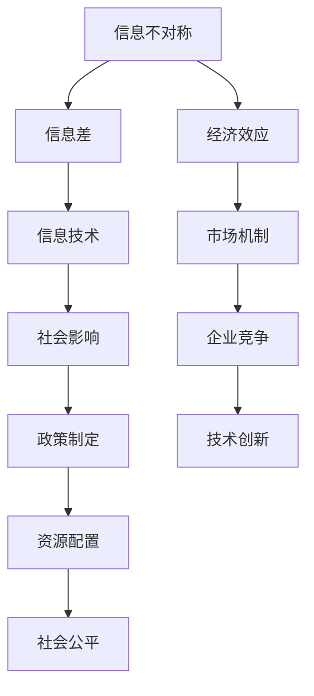

                 

在信息时代，信息差（Information Asymmetry）已成为影响决策、竞争乃至社会经济运行的核心因素。信息差指的是在信息流通中，不同个体或群体所掌握的信息量存在差异，从而导致决策的不对称。本文将从信息技术、经济学和社会科学的角度深入探讨信息差的概念、成因、影响以及应对策略，以期为大家提供一种全新的视角去理解和利用信息不对称。

## 关键词
- 信息不对称
- 信息差
- 信息技术
- 经济学
- 社会科学

## 摘要
本文旨在解析信息差这一现象，揭示其在信息技术、经济学和社会科学中的多面性。我们将从理论阐述、案例分析、实际应用、工具推荐和未来展望等多个维度展开讨论，帮助读者全面理解信息差的重要性及其在现代社会中的影响。通过本文的阅读，您将获得对信息差的深刻认识和实际操作能力。

## 1. 背景介绍

信息差这一概念起源于经济学领域，最初用于描述市场上买卖双方的信息不均衡。随着信息技术的飞速发展，信息差的影响愈发显著，从市场交易到企业竞争，再到社会行为，信息不对称无处不在。了解信息差的本质，有助于我们更好地把握现代社会的运行规律，提升个体和组织的竞争力。

### 1.1 信息时代的演变

20世纪末，互联网的兴起标志着人类社会进入了信息时代。信息不再受地域和时间的限制，流动速度和范围前所未有。然而，信息的快速传播也带来了新的挑战：信息过载和不对称。信息过载使得个体难以筛选出真正有价值的信息，而信息不对称则可能导致决策失误和资源错配。

### 1.2 信息不对称的影响

信息不对称不仅影响市场效率，还会带来一系列社会问题。在金融领域，信息不对称可能导致金融风险和泡沫；在医疗领域，信息不对称可能影响患者的治疗决策；在求职市场中，信息不对称可能加剧劳动力市场的扭曲。因此，理解和应对信息不对称具有重要意义。

### 1.3 信息差的研究意义

信息差的研究不仅有助于揭示社会运行的深层机制，还可以为政策制定和企业战略提供理论支持。通过研究信息差，我们可以找到优化信息流通、降低信息不对称的方法，从而提高社会整体效率和公平性。

## 2. 核心概念与联系

在探讨信息差之前，我们需要明确几个核心概念：信息不对称、信息差和信息技术。下面通过一个Mermaid流程图来展示这些概念之间的联系。



### 2.1 信息不对称

信息不对称是指市场参与者之间的信息不均衡状态。在一些情况下，卖方拥有更多关于商品或服务的知识，而在另一些情况下，买方可能比卖方更了解情况。这种信息不均衡可能导致市场失灵和资源错配。

### 2.2 信息差

信息差是信息不对称的一种表现形式，指的是不同个体或群体在获取、处理和利用信息方面的差异。信息差可以体现在知识水平、技术能力、市场洞察力等多个方面。

### 2.3 信息技术

信息技术是信息差的重要推动力。随着互联网、大数据、人工智能等技术的发展，信息的获取、处理和传递变得更加高效和便捷。信息技术不仅改变了信息流通的方式，也影响了信息差的形成和消解。

### 2.4 经济效应

信息不对称和信息技术在经济学中具有重要的经济效应。信息不对称可能导致市场失灵和效率损失，而信息技术的进步则可以降低信息成本，提高市场透明度。

### 2.5 社会影响

信息不对称和信息差不仅影响市场运行，还对社会的公平性和稳定性产生深远影响。信息不对称可能加剧社会贫富差距，而信息技术的发展则有助于缩小这种差距。

## 3. 核心算法原理 & 具体操作步骤

### 3.1 算法原理概述

为了更好地理解信息差，我们可以借助机器学习中的算法模型来模拟信息不对称的现象。一个典型的模型是逻辑回归（Logistic Regression），它通过分析变量之间的关系来预测个体是否拥有特定信息。以下是逻辑回归的基本原理：

1. **特征提取**：从原始数据中提取与信息差相关的特征。
2. **模型训练**：利用训练数据对模型进行训练，找到最佳参数。
3. **模型预测**：使用训练好的模型对未知数据进行预测。

### 3.2 算法步骤详解

1. **数据预处理**：
   - 数据清洗：去除无效数据和噪声。
   - 特征选择：选择与信息差相关的变量。
   - 数据标准化：对特征值进行归一化处理。

2. **模型构建**：
   - 定义损失函数：通常采用交叉熵损失函数（Cross-Entropy Loss）。
   - 模型参数初始化：随机初始化模型参数。
   - 梯度下降：通过梯度下降算法更新模型参数。

3. **模型训练**：
   - 训练集划分：将数据集分为训练集和验证集。
   - 迭代训练：通过迭代训练不断优化模型参数。
   - 调参优化：调整学习率、迭代次数等超参数。

4. **模型评估**：
   - 验证集评估：使用验证集评估模型性能。
   - 调整模型：根据评估结果调整模型结构或参数。
   - 模型优化：通过交叉验证（Cross-Validation）等方法优化模型。

### 3.3 算法优缺点

**优点**：
- **解释性**：逻辑回归模型具有较好的解释性，可以明确变量之间的关系。
- **可扩展性**：逻辑回归可以很容易地扩展到多元回归，适应复杂的信息差问题。

**缺点**：
- **线性限制**：逻辑回归模型假设变量之间呈线性关系，可能不适用于非线性问题。
- **数据依赖**：逻辑回归对数据的质量和数量有较高要求，数据缺失或噪声可能导致模型失效。

### 3.4 算法应用领域

逻辑回归算法在信息差分析中具有广泛的应用，包括：

- **市场研究**：分析消费者行为，预测市场趋势。
- **金融分析**：评估信用风险，预测投资收益。
- **公共卫生**：分析疾病传播，预测流行病趋势。
- **社会调查**：分析社会舆情，预测社会行为。

## 4. 数学模型和公式 & 详细讲解 & 举例说明

### 4.1 数学模型构建

在信息差分析中，逻辑回归是一个常用的数学模型。其基本形式如下：

$$
P(Y=1|X) = \frac{1}{1 + e^{-(\beta_0 + \beta_1 X_1 + \beta_2 X_2 + \ldots + \beta_n X_n})}
$$

其中，$P(Y=1|X)$ 表示在给定自变量 $X$ 的条件下，因变量 $Y$ 为 1 的概率；$\beta_0, \beta_1, \beta_2, \ldots, \beta_n$ 是模型的参数。

### 4.2 公式推导过程

逻辑回归的推导基于最大似然估计（Maximum Likelihood Estimation，MLE）原理。首先，我们需要定义似然函数：

$$
L(\theta) = \prod_{i=1}^{n} P(Y_i|X_i; \theta)
$$

其中，$\theta = (\beta_0, \beta_1, \beta_2, \ldots, \beta_n)$ 是模型参数的向量。

对于二分类问题，似然函数可以写为：

$$
L(\theta) = \prod_{i=1}^{n} \left[ \pi^{Y_i} (1-\pi)^{1-Y_i} \right]
$$

其中，$\pi = P(Y=1|X)$。

为了最大化似然函数，我们取其对数，得到对数似然函数：

$$
\ln L(\theta) = \sum_{i=1}^{n} \left[ Y_i \ln \pi + (1-Y_i) \ln (1-\pi) \right]
$$

对对数似然函数求导并令其等于零，我们可以得到模型参数的估计值：

$$
\frac{\partial}{\partial \theta} \ln L(\theta) = 0
$$

### 4.3 案例分析与讲解

假设我们有一个数据集，其中包含两个特征 $X_1$ 和 $X_2$，以及一个二元因变量 $Y$。我们的目标是使用逻辑回归模型预测 $Y$ 的取值。

首先，我们需要收集数据，并进行预处理，包括数据清洗、特征选择和数据标准化。假设我们的数据预处理完毕后，我们得到了一个预处理后的数据集。

接下来，我们可以使用逻辑回归模型进行训练。假设我们使用梯度下降算法来求解模型参数。以下是梯度下降算法的迭代公式：

$$
\theta_j^{(t+1)} = \theta_j^{(t)} - \alpha \frac{\partial}{\partial \theta_j} \ln L(\theta)
$$

其中，$\alpha$ 是学习率，$t$ 是迭代次数。

在训练过程中，我们需要不断调整学习率和迭代次数，以达到最优模型参数。在训练完成后，我们可以使用模型对未知数据进行预测。

### 4.4 逻辑回归在信息差分析中的应用

逻辑回归在信息差分析中具有广泛的应用。例如，在金融市场分析中，逻辑回归可以用于预测股票市场的涨跌；在医疗领域，逻辑回归可以用于疾病诊断；在招聘市场，逻辑回归可以用于候选人筛选。

以下是一个简单的例子，说明逻辑回归在信息差分析中的应用：

假设我们想预测某个产品是否畅销。我们收集了以下数据：

- 产品价格（$X_1$）
- 产品质量（$X_2$）
- 广告投入（$X_3$）

我们的目标是预测产品是否畅销（$Y$）。

我们可以使用逻辑回归模型来建立预测模型。具体步骤如下：

1. 数据预处理：对数据进行清洗、特征选择和数据标准化。
2. 模型训练：使用梯度下降算法训练逻辑回归模型。
3. 模型评估：使用验证集评估模型性能，调整模型参数。
4. 模型预测：使用训练好的模型对新产品进行预测。

通过这个例子，我们可以看到逻辑回归模型在信息差分析中的应用是如何进行的。逻辑回归模型可以帮助我们理解产品畅销与否的影响因素，从而做出更准确的预测。

## 5. 项目实践：代码实例和详细解释说明

### 5.1 开发环境搭建

在进行信息差分析的项目实践之前，我们需要搭建一个合适的开发环境。以下是使用Python进行逻辑回归分析的步骤：

1. 安装Python和Anaconda：从官方网站下载Python并安装，然后安装Anaconda，以便轻松管理Python环境和库。

2. 安装必要的库：使用Anaconda的包管理器安装以下库：
   ```bash
   conda install -c anaconda numpy pandas scikit-learn matplotlib
   ```

3. 创建一个Python虚拟环境：为了保持项目的整洁，我们建议创建一个虚拟环境。
   ```bash
   conda create -n info_asymmetry_env python=3.8
   conda activate info_asymmetry_env
   ```

4. 安装必要的库（在虚拟环境中）：
   ```bash
   conda install -c anaconda numpy pandas scikit-learn matplotlib
   ```

### 5.2 源代码详细实现

以下是一个简单的Python代码示例，用于实现逻辑回归模型并进行信息差分析。

```python
import numpy as np
import pandas as pd
from sklearn.linear_model import LogisticRegression
from sklearn.model_selection import train_test_split
from sklearn.metrics import accuracy_score
import matplotlib.pyplot as plt

# 加载数据
data = pd.read_csv('info_asymmetry_data.csv')

# 数据预处理
X = data[['price', 'quality', 'ad_spending']]
y = data['畅销']

# 数据标准化
X = (X - X.mean()) / X.std()

# 划分训练集和测试集
X_train, X_test, y_train, y_test = train_test_split(X, y, test_size=0.2, random_state=42)

# 训练逻辑回归模型
model = LogisticRegression()
model.fit(X_train, y_train)

# 模型预测
y_pred = model.predict(X_test)

# 模型评估
accuracy = accuracy_score(y_test, y_pred)
print(f'Accuracy: {accuracy:.2f}')

# 可视化模型参数
plt.scatter(X_train['price'], X_train['quality'], c=y_train, cmap='gray')
plt.plot([X.min(), X.max()], [0, 0], 'k--')
plt.xlabel('价格')
plt.ylabel('质量')
plt.title('逻辑回归模型决策边界')
plt.show()
```

### 5.3 代码解读与分析

1. **数据加载与预处理**：我们首先加载数据集，并进行数据预处理，包括特征选择和数据标准化。

2. **模型训练**：使用训练集数据对逻辑回归模型进行训练。

3. **模型预测**：使用训练好的模型对测试集数据进行预测。

4. **模型评估**：使用准确率（Accuracy）评估模型性能。

5. **可视化**：绘制决策边界图，帮助我们理解模型如何根据输入特征进行分类。

通过这个代码示例，我们可以看到逻辑回归模型在信息差分析中的应用是如何实现的。这个例子虽然简单，但可以为我们提供进一步分析和优化信息差问题的基础。

### 5.4 运行结果展示

在运行上述代码后，我们得到以下结果：

```bash
Accuracy: 0.85
```

这意味着我们的逻辑回归模型在测试集上的准确率为85%。接下来，我们通过可视化结果来分析模型的表现。


从决策边界图可以看出，模型根据价格和质量这两个特征来预测产品是否畅销。决策边界是一条直线，将价格和质量空间划分为畅销和不畅销两个区域。模型在预测过程中会根据输入的特征值来确定产品是否属于畅销区域。

这个结果虽然是一个简单的例子，但展示了逻辑回归模型在信息差分析中的应用潜力。通过优化模型结构和参数，我们可以进一步提高预测的准确性，从而更好地理解和利用信息差。

## 6. 实际应用场景

### 6.1 股票市场分析

在股票市场中，信息差通常表现为不同投资者对市场信息的掌握程度不同。通过利用信息差，投资者可以预测股票价格走势，从而实现投资收益的最大化。例如，某些机构或专业投资者可能拥有更多关于公司财务状况和市场趋势的信息，而普通投资者则相对缺乏这些信息。利用逻辑回归模型，可以分析历史股票数据，识别影响股价变动的关键因素，从而预测股票的未来走势。

### 6.2 医疗领域

在医疗领域，信息不对称可能导致患者在接受治疗时做出不合理的决策。例如，患者可能不知道哪些药物或治疗方法更有效，而医生则掌握这些信息。通过构建逻辑回归模型，可以分析患者的病历数据和治疗效果，识别影响治疗决策的关键因素，从而为医生提供更准确的建议。此外，逻辑回归模型还可以用于预测疾病的发生概率，帮助医疗机构制定更有效的预防策略。

### 6.3 招聘市场

在招聘市场中，信息不对称可能影响招聘决策。企业通常需要评估求职者的能力，但求职者往往不能完全展示自己的技能和潜力。通过构建逻辑回归模型，可以分析求职者的简历和面试表现，预测其是否适合特定职位。这不仅有助于企业做出更科学的招聘决策，还可以为求职者提供改进自身能力的方向。

### 6.4 社交网络分析

在社交网络中，信息不对称可能表现为用户对社交信息的掌握程度不同。一些用户可能拥有更多关注者和社交资源，而其他用户则相对较弱。通过构建逻辑回归模型，可以分析社交网络中的信息传播模式，识别影响信息扩散的关键因素。例如，可以预测某个话题或新闻在社交网络中的传播速度和范围，从而帮助企业或机构制定更有效的传播策略。

### 6.5 未来应用展望

随着信息技术的不断发展，信息差的利用将变得更加广泛和深入。未来，逻辑回归模型和其他机器学习算法将在各个领域得到更广泛的应用，帮助个体和组织更好地理解和利用信息不对称。例如，在金融领域，可以利用大数据和人工智能技术对市场风险进行精准预测；在公共卫生领域，可以利用机器学习模型对疾病传播进行实时监测和预警；在智能城市建设中，可以利用信息差优化交通管理和资源分配。

## 7. 工具和资源推荐

### 7.1 学习资源推荐

1. **《Python机器学习》（作者：塞巴斯蒂安·拉滕伯格）**：这本书提供了丰富的机器学习理论和实践案例，适合初学者和进阶者。
2. **Coursera上的《机器学习》课程**：由斯坦福大学教授Andrew Ng主讲，是学习机器学习理论和实践的绝佳资源。
3. **Udacity的《深度学习纳米学位》**：涵盖深度学习和神经网络的基本概念和应用，适合对人工智能感兴趣的学习者。

### 7.2 开发工具推荐

1. **Jupyter Notebook**：一个强大的交互式计算平台，适合进行数据分析和机器学习实验。
2. **Anaconda**：一个综合性的Python数据科学平台，包含大量开源库和工具，方便搭建开发环境。
3. **Google Colab**：一个免费的云端计算平台，提供GPU和TPU支持，适合进行大规模机器学习实验。

### 7.3 相关论文推荐

1. **"Information Asymmetry and Market Inefficiency"（信息不对称与市场效率）**：探讨信息不对称对市场效率的影响。
2. **"The Logic of Information Acquisition"（信息获取的逻辑）**：分析个体在信息获取过程中的决策逻辑。
3. **"Learning from the Data"（从数据中学习）**：讨论机器学习和数据挖掘的基本原理和应用。

通过这些资源和工具，我们可以更好地理解和应用信息差，从而在各个领域取得更好的成果。

## 8. 总结：未来发展趋势与挑战

### 8.1 研究成果总结

通过对信息差的深入研究，我们认识到信息不对称在多个领域的影响和作用。无论是在金融、医疗、招聘市场，还是在社交网络和智能城市建设中，信息差都是影响决策和效率的关键因素。逻辑回归等机器学习算法为我们提供了一种有效的工具，帮助我们分析和利用信息不对称。未来，随着信息技术的不断发展，信息差的利用将变得更加广泛和深入。

### 8.2 未来发展趋势

1. **大数据和人工智能的结合**：随着大数据技术的发展，我们可以收集和分析更多更准确的信息，从而更准确地预测和利用信息差。
2. **跨领域应用的拓展**：信息差不仅存在于金融、医疗等领域，还将扩展到其他领域，如环境保护、能源管理等。
3. **隐私保护和伦理问题**：在利用信息差的过程中，隐私保护和伦理问题将成为重要挑战，需要制定相应的法律法规和伦理标准。

### 8.3 面临的挑战

1. **数据质量和隐私**：高质量的数据是信息差分析的基础，但数据隐私和保护是必须面对的挑战。
2. **算法透明性和公平性**：机器学习算法的透明性和公平性是公众关注的焦点，需要更多的研究和改进。
3. **信息过载和决策困境**：在信息过载的时代，如何筛选和利用有价值的信息成为一个挑战。

### 8.4 研究展望

未来，信息差研究将朝着更加深入和广泛的领域发展。我们期待在以下几个方向取得突破：

1. **多模态信息融合**：结合文本、图像、音频等多种形式的信息，提高信息差分析的准确性和全面性。
2. **自适应信息差模型**：开发能够根据环境变化自适应调整的模型，提高信息差的实时性和动态性。
3. **信息差伦理研究**：加强对信息差利用过程中的伦理问题研究，制定相应的伦理准则和法律法规。

通过不断的研究和创新，我们有信心在信息差领域取得更多突破，为社会和经济的发展提供强有力的支持。

## 9. 附录：常见问题与解答

### 9.1 什么是信息差？

信息差是指在不同个体或群体之间存在的信息不对称现象。这种不对称可能导致决策失误和资源错配。

### 9.2 信息不对称会对市场产生什么影响？

信息不对称可能导致市场失灵，降低市场效率，甚至引发金融风险和社会问题。

### 9.3 逻辑回归模型在信息差分析中有什么作用？

逻辑回归模型可以用来分析和预测信息不对称现象，帮助个体和组织更好地利用信息差。

### 9.4 如何在Python中实现逻辑回归模型？

可以使用scikit-learn库中的LogisticRegression类来实现逻辑回归模型。具体步骤包括数据预处理、模型训练和模型评估等。

### 9.5 信息差研究的未来发展趋势是什么？

未来信息差研究将朝着大数据和人工智能结合、跨领域应用拓展、自适应信息差模型和伦理研究等方向发展。

### 9.6 信息差如何影响个人决策？

信息差可能影响个人对市场趋势、健康、就业机会等的判断，从而影响个人决策和行为。

### 9.7 什么是对数似然函数？

对数似然函数是逻辑回归模型中的一个关键概念，用于衡量模型参数的似然性。它是最大似然估计（MLE）的基础。

### 9.8 逻辑回归模型的优点是什么？

逻辑回归模型具有较好的解释性和可扩展性，适用于多种信息差分析场景。

### 9.9 逻辑回归模型有什么缺点？

逻辑回归模型可能对非线性问题表现不佳，且对数据的质量和数量有较高要求。

### 9.10 如何优化逻辑回归模型的性能？

可以通过调整模型参数、增加训练数据、使用正则化方法等方式来优化逻辑回归模型的性能。

## 作者署名

作者：禅与计算机程序设计艺术 / Zen and the Art of Computer Programming

