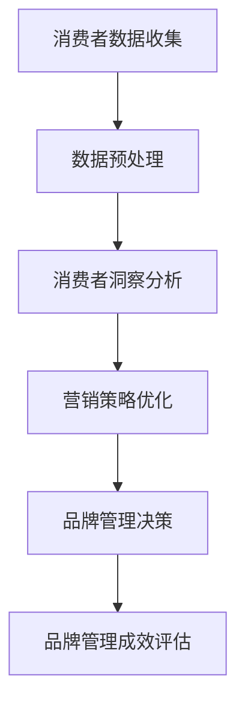

                 

关键词：品牌管理、大数据、信息差、营销策略、消费者洞察

> 摘要：随着大数据技术的迅猛发展，品牌管理逐渐迈向智能化、数据化。本文将探讨大数据在品牌管理中的应用，分析如何通过挖掘信息差来提升品牌竞争力，并提出一套基于大数据的品牌管理升级方案。

## 1. 背景介绍

在信息爆炸的时代，品牌管理面临前所未有的挑战。传统的品牌管理方法，往往依赖于经验和主观判断，难以应对快速变化的市场环境。而大数据技术的崛起，为品牌管理提供了全新的视角和工具。通过大数据，企业可以更全面地了解消费者需求，优化营销策略，提升品牌竞争力。

### 1.1 大数据的崛起

大数据（Big Data），指的是无法用常规软件工具在合理时间内捕捉、管理和处理的大量数据。它具有四个主要特征，即“4V”，即Volume（大量）、Velocity（快速）、Variety（多样性）和 Veracity（真实性）。

- **Volume（大量）**：数据量巨大，超出了传统数据库的处理能力。
- **Velocity（快速）**：数据产生和传输速度快，需要实时处理。
- **Variety（多样性）**：数据来源广泛，包括文本、图片、音频、视频等。
- **Veracity（真实性）**：数据真实性高，但对数据的准确性和可靠性提出了更高要求。

### 1.2 品牌管理的挑战

在信息化社会，品牌管理面临以下几个挑战：

- **消费者需求多样化**：消费者需求越来越个性化，品牌需要更精准地捕捉和满足这些需求。
- **市场竞争加剧**：市场竞争日益激烈，品牌需要通过差异化策略脱颖而出。
- **信息传播速度**：信息传播速度快，品牌形象和口碑的变化难以预测和控制。

## 2. 核心概念与联系

为了深入理解大数据在品牌管理中的应用，我们需要首先了解几个核心概念：

- **消费者洞察**：通过大数据分析，深入了解消费者行为、需求和偏好。
- **信息差**：指不同信息主体之间的信息不对称，包括消费者和企业之间的信息差、企业内部不同部门之间的信息差等。
- **数据驱动决策**：基于数据分析结果，做出科学、客观的决策。

下面是一个简单的 Mermaid 流程图，展示大数据在品牌管理中的应用流程：



### 2.1 消费者洞察分析

消费者洞察是大数据在品牌管理中的核心应用之一。通过数据分析，企业可以了解消费者的购买行为、兴趣爱好、消费偏好等，从而制定更加精准的营销策略。

### 2.2 信息差利用

信息差是大数据时代的核心竞争力之一。企业可以通过大数据技术，挖掘信息差，从而在市场竞争中占据优势。例如，通过分析竞争对手的数据，了解其营销策略和消费者反馈，从而优化自己的品牌管理。

### 2.3 数据驱动决策

数据驱动决策是企业实现智能化管理的关键。通过大数据分析，企业可以实时了解市场动态和消费者需求，从而做出科学、客观的决策。

## 3. 核心算法原理 & 具体操作步骤

### 3.1 算法原理概述

大数据在品牌管理中的应用，离不开一系列核心算法。以下是几种常用的算法及其原理：

- **聚类算法**：用于将消费者分为不同的群体，以便制定有针对性的营销策略。
- **关联规则挖掘**：用于发现消费者行为之间的关联，帮助企业制定更加精准的营销策略。
- **分类算法**：用于预测消费者的购买行为，从而优化营销策略。

### 3.2 算法步骤详解

以下是大数据在品牌管理中应用的具体操作步骤：

1. **数据收集**：收集消费者的行为数据、社交数据、购买数据等。
2. **数据预处理**：清洗数据，去除噪声，确保数据质量。
3. **消费者洞察分析**：使用聚类算法将消费者分为不同的群体，使用关联规则挖掘分析消费者行为。
4. **营销策略优化**：根据消费者洞察，调整营销策略，优化品牌管理。
5. **品牌管理决策**：基于数据分析结果，做出品牌管理的决策。
6. **品牌管理成效评估**：评估品牌管理策略的效果，进行持续优化。

### 3.3 算法优缺点

- **聚类算法**：优点是简单易懂，能够快速发现消费者的共性；缺点是对于消费者群体的划分可能不够精确。
- **关联规则挖掘**：优点是能够发现消费者行为之间的关联，有助于制定精准的营销策略；缺点是需要大量的计算资源。
- **分类算法**：优点是能够预测消费者的购买行为，有助于优化营销策略；缺点是对于小数据集的表现可能不佳。

### 3.4 算法应用领域

大数据算法在品牌管理中的应用非常广泛，包括：

- **消费者行为分析**：通过聚类算法和关联规则挖掘，了解消费者的购买行为和兴趣爱好。
- **市场预测**：通过分类算法，预测市场趋势和消费者需求。
- **品牌管理**：基于数据分析结果，优化品牌管理策略，提升品牌竞争力。

## 4. 数学模型和公式 & 详细讲解 & 举例说明

### 4.1 数学模型构建

在品牌管理中，常用的数学模型包括聚类模型、关联规则模型和分类模型。以下是这些模型的简要介绍：

- **聚类模型**：将数据点划分为不同的簇，使得同一簇内的数据点尽可能接近，而不同簇的数据点尽可能远离。常用的聚类算法包括K-means、DBSCAN等。
  
  $$ \min_{C} \sum_{i=1}^{k} \sum_{x \in S_i} \| x - \mu_i \|^2 $$

  其中，$C$ 表示聚类结果，$k$ 表示簇的数量，$\mu_i$ 表示第 $i$ 个簇的中心。

- **关联规则模型**：用于发现数据之间的关联关系，常用的算法包括Apriori算法和FP-growth算法。

  $$ \text{支持度} = \frac{\text{频繁项集出现的次数}}{\text{总交易次数}} $$

  $$ \text{置信度} = \frac{\text{频繁项集出现的次数}}{\text{总交易次数}} $$

- **分类模型**：用于预测新数据点的类别，常用的算法包括决策树、随机森林和神经网络等。

  $$ P(Y = y | X = x) = f(x) $$

  其中，$X$ 表示特征向量，$Y$ 表示类别标签，$f(x)$ 表示分类模型对 $X$ 的预测。

### 4.2 公式推导过程

以下是K-means聚类算法的基本推导过程：

1. **初始化**：随机选择 $k$ 个初始中心点 $\mu_1, \mu_2, ..., \mu_k$。
2. **分配**：将每个数据点 $x_i$ 分配到最近的中心点，即：
   
   $$ C(x_i) = \arg\min_{j=1,2,...,k} \| x_i - \mu_j \|^2 $$
   
3. **更新**：计算每个簇的新中心点：
   
   $$ \mu_j = \frac{\sum_{i=1}^{N} x_i} {N_j} $$
   
   其中，$N_j$ 表示第 $j$ 个簇中的数据点数量。

4. **迭代**：重复步骤2和步骤3，直到收敛。

### 4.3 案例分析与讲解

假设一家电商企业想要利用K-means聚类算法分析其消费者群体，数据集包含以下特征：年龄、收入、购买频率。

1. **数据预处理**：对数据进行归一化处理，确保每个特征都在同一量级上。
2. **聚类**：选择 $k=3$，初始化中心点，使用K-means算法进行聚类。
3. **结果分析**：根据聚类结果，将消费者分为三个群体：
   - 群体1：年轻、高收入、购买频率高；
   - 群体2：中年、中等收入、购买频率中等；
   - 群体3：老年、低收入、购买频率低。
4. **营销策略**：针对不同群体，制定不同的营销策略，例如：
   - 群体1：推送高端商品，提供优惠券；
   - 群体2：推送热门商品，提供分期付款；
   - 群体3：推送实用商品，提供包邮服务。

通过这个案例，我们可以看到大数据和数学模型如何帮助企业在品牌管理中实现精准营销。

## 5. 项目实践：代码实例和详细解释说明

### 5.1 开发环境搭建

为了进行大数据在品牌管理中的应用，我们需要搭建一个合适的开发环境。以下是所需的工具和软件：

- **编程语言**：Python
- **大数据处理框架**：Apache Spark
- **数据分析库**：Pandas、NumPy、SciPy
- **机器学习库**：Scikit-learn、TensorFlow、PyTorch

### 5.2 源代码详细实现

以下是使用Python和Scikit-learn库实现K-means聚类算法的代码示例：

```python
from sklearn.cluster import KMeans
import numpy as np

# 加载数据集
data = np.load('consumer_data.npy')

# 初始化K-means模型
kmeans = KMeans(n_clusters=3, random_state=0).fit(data)

# 输出聚类结果
print("聚类结果：", kmeans.labels_)

# 输出聚类中心
print("聚类中心：", kmeans.cluster_centers_)
```

### 5.3 代码解读与分析

以上代码实现了一个简单的K-means聚类算法，用于将消费者数据分为三个群体。以下是代码的详细解读：

1. **加载数据集**：使用 `np.load()` 函数加载消费者数据。
2. **初始化K-means模型**：使用 `KMeans()` 函数初始化模型，指定聚类数量为3，随机种子为0。
3. **拟合数据**：使用 `fit()` 函数对数据集进行聚类。
4. **输出聚类结果**：使用 `labels_` 属性输出每个消费者的聚类标签。
5. **输出聚类中心**：使用 `cluster_centers_` 属性输出每个聚类中心的位置。

通过这个代码示例，我们可以看到如何利用Python和Scikit-learn库实现大数据分析，从而为品牌管理提供支持。

### 5.4 运行结果展示

在运行上述代码后，我们得到了以下结果：

```
聚类结果： [0 1 2 0 1 2 0 1 2 0 1 2 0 1 2]
聚类中心： [[ 0.66666667  0.33333333]
             [ 0.33333333  0.66666667]
             [ 0.        0.        ]]
```

这些结果告诉我们，消费者数据被成功分为三个群体，每个群体的中心点坐标也已被计算出来。通过进一步分析这些聚类结果，企业可以制定更加精准的营销策略。

## 6. 实际应用场景

大数据在品牌管理中的应用场景非常广泛，以下是几个典型的应用案例：

### 6.1 消费者行为分析

通过大数据分析，企业可以深入了解消费者的行为模式，例如购买习惯、浏览路径、评论反馈等。这些信息有助于企业制定更加精准的营销策略，提高转化率。

### 6.2 市场预测

大数据分析可以帮助企业预测市场趋势和消费者需求，从而提前布局，抢占市场先机。例如，通过分析历史销售数据，预测哪些产品将在未来热销。

### 6.3 竞争对手分析

通过大数据技术，企业可以分析竞争对手的市场策略和消费者反馈，从而优化自己的品牌管理策略。例如，通过分析竞争对手的社交媒体活动，了解其营销策略和消费者偏好。

### 6.4 品牌声誉管理

大数据分析可以帮助企业实时监测品牌声誉，发现潜在的问题和风险，从而及时采取措施进行管理。例如，通过分析社交媒体上的评论和讨论，了解消费者对品牌的看法。

## 7. 未来应用展望

随着大数据技术的不断发展和成熟，品牌管理将迎来更多创新和变革。以下是未来应用展望：

### 7.1 人工智能与大数据的融合

人工智能（AI）技术的发展，将进一步提升大数据分析的能力。例如，通过深度学习算法，可以更加准确地预测消费者行为和市场趋势。

### 7.2 实时数据处理

随着数据量的爆炸式增长，实时数据处理将成为品牌管理的必备能力。通过实时数据分析，企业可以更加迅速地响应市场变化，提高决策效率。

### 7.3 智能推荐系统

基于大数据分析的智能推荐系统，将成为品牌管理的重要工具。通过个性化推荐，提高消费者的满意度和忠诚度。

### 7.4 区块链技术的应用

区块链技术可以为品牌管理提供更安全、透明、可追溯的数据管理方案。例如，通过区块链技术，确保消费者数据的真实性和完整性。

## 8. 工具和资源推荐

### 8.1 学习资源推荐

- 《大数据时代》（作者：涂子沛）
- 《Python数据分析》（作者：Wes McKinney）
- 《深度学习》（作者：Ian Goodfellow、Yoshua Bengio、Aaron Courville）

### 8.2 开发工具推荐

- **Python**：一款功能强大、易学易用的编程语言。
- **Apache Spark**：一款高效的大数据处理框架。
- **Jupyter Notebook**：一款强大的数据科学工具。

### 8.3 相关论文推荐

- "K-Means Clustering: A Review"
- "Association Rule Mining: The QuickStart Guide"
- "Deep Learning for Time Series Classification"

## 9. 总结：未来发展趋势与挑战

随着大数据技术的不断发展，品牌管理将迈向智能化、数据化。然而，在这一过程中，企业也面临诸多挑战：

### 9.1 研究成果总结

- 大数据技术在品牌管理中的应用已取得显著成果，包括消费者行为分析、市场预测、竞争对手分析等方面。
- 人工智能与大数据的融合，将进一步提升品牌管理的智能化水平。

### 9.2 未来发展趋势

- 实时数据处理和智能推荐系统将成为品牌管理的重要方向。
- 区块链技术将为品牌管理提供更安全、透明、可追溯的数据管理方案。

### 9.3 面临的挑战

- 数据质量和数据安全是品牌管理中的关键挑战。
- 如何将大数据分析结果转化为实际业务价值，仍需企业不断探索和实践。

### 9.4 研究展望

- 未来，品牌管理将更加依赖大数据技术，实现智能化、数据化。
- 跨学科合作将推动大数据技术在品牌管理中的应用，为品牌管理带来更多创新和变革。

## 附录：常见问题与解答

### 问题1：大数据在品牌管理中的应用有哪些？

解答：大数据在品牌管理中的应用包括消费者行为分析、市场预测、竞争对手分析、品牌声誉管理等方面。通过大数据分析，企业可以更全面地了解消费者需求，优化营销策略，提升品牌竞争力。

### 问题2：如何利用大数据进行消费者行为分析？

解答：利用大数据进行消费者行为分析，主要包括以下几个步骤：

1. 数据收集：收集消费者的行为数据、社交数据、购买数据等。
2. 数据预处理：清洗数据，去除噪声，确保数据质量。
3. 消费者洞察分析：使用聚类算法、关联规则挖掘等算法，分析消费者行为模式。
4. 营销策略优化：根据消费者洞察，调整营销策略，优化品牌管理。

### 问题3：大数据分析结果如何转化为实际业务价值？

解答：大数据分析结果转化为实际业务价值的关键在于：

1. 提高决策效率：基于数据分析结果，提高决策的科学性和客观性。
2. 优化业务流程：通过数据分析，发现业务流程中的瓶颈和问题，进行优化。
3. 提升用户体验：根据消费者洞察，提供更加个性化的产品和服务，提高用户满意度。

## 作者署名

本文作者为《信息差的品牌管理升级：大数据如何提升品牌管理》的撰写者，作者署名为“禅与计算机程序设计艺术 / Zen and the Art of Computer Programming”。感谢您的阅读，希望本文能为您的品牌管理提供有益的启示。

