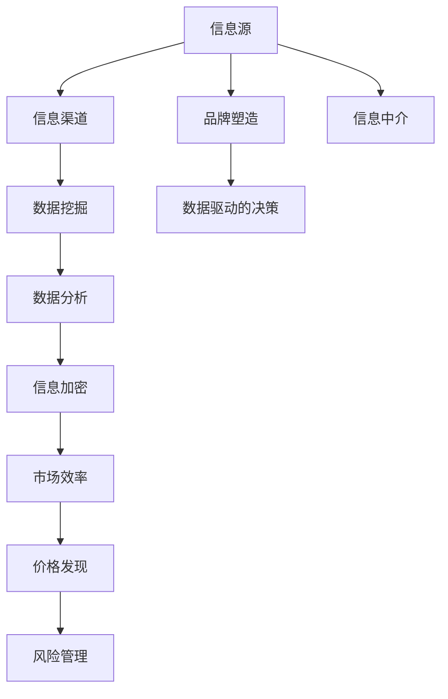

                 

关键词：信息不对称、商业模式创新、信息差、商业策略、经济学原理、信息技术

摘要：本文将探讨信息不对称这一经济现象在商业模式创新中的应用。通过剖析信息差对商业活动的影响，揭示如何在信息技术背景下利用信息不对称实现商业模式的创新，从而为企业带来竞争优势。文章首先介绍了信息不对称的概念及其在商业环境中的重要性，随后详细阐述了信息不对称的几种表现形式，并结合具体案例分析了其在商业模式创新中的应用策略。最后，文章探讨了信息不对称在未来商业模式创新中的潜在方向和挑战。

## 1. 背景介绍

在信息爆炸的时代，信息不对称成为商业活动中一个不可忽视的现象。信息不对称指的是市场中的交易双方对于交易信息的了解程度不同，一方拥有比另一方更多的信息。这种信息差异可能源于多种原因，如信息获取成本、信息传播渠道、个体认知差异等。在商业环境中，信息不对称往往导致市场失衡，影响资源的有效配置和交易的公平性。

然而，信息不对称并非完全是负面的。事实上，许多商业模式的创新都是建立在信息不对称的基础之上的。通过巧妙地利用信息不对称，企业可以在市场竞争中占据优势地位，实现商业利润的最大化。本文将深入探讨信息不对称在商业模式创新中的应用，以期为企业提供新的商业策略和管理思路。

### 1.1 信息不对称的概念

信息不对称是指市场中存在一方比另一方拥有更多、更准确的信息。这个概念最早由经济学家乔治·阿克洛夫（George A. Akerlof）在其1970年的经典论文《柠檬市场：质量不确定性及其市场机制》（The Market for "Lemons": Quality Uncertainty and the Market Mechanism）中提出。阿克洛夫通过分析二手车市场的例子，揭示了信息不对称如何导致市场失效。

在商业环境中，信息不对称可能存在于以下几种情况：

1. **买方信息不足**：买方可能缺乏足够的信息来评估产品的质量、性能或真实成本。
2. **卖方信息垄断**：卖方可能拥有关于产品或服务的独特信息，从而垄断市场。
3. **信息传播不畅**：信息在传播过程中可能被扭曲或丢失，导致接收者无法获得完整的信息。
4. **个体认知差异**：不同个体对于同一信息的理解和解读可能存在差异，导致信息不对称。

### 1.2 信息不对称的重要性

信息不对称对商业活动具有深远的影响。一方面，信息不对称可能导致市场失灵，例如市场出现“柠檬问题”，即优质产品被淘汰，市场只剩下劣质产品。另一方面，信息不对称也为商业模式创新提供了契机。

首先，信息不对称会影响消费者的购买决策。消费者在缺乏足够信息的情况下，往往无法做出最优的选择，这为企业提供了市场操纵的机会。例如，通过营销策略和品牌建设，企业可以提升消费者对自身产品的信任度，从而减少信息不对称的影响。

其次，信息不对称为企业提供了竞争优势。通过掌握更多的信息，企业可以在产品定价、市场定位、供应链管理等方面做出更精准的决策，从而在竞争中脱颖而出。例如，亚马逊通过大数据分析用户行为，精准推荐产品，从而提高了销售转化率和用户满意度。

最后，信息不对称也是创新商业模式的重要动力。企业可以通过创造新的信息不对称，实现商业模式的变革。例如，共享经济模式通过构建信息平台，将供给方和需求方连接起来，打破了传统的市场结构，创造了新的商业机会。

## 2. 核心概念与联系

为了更好地理解信息不对称在商业模式创新中的应用，我们需要从技术层面和经济学原理出发，剖析信息不对称的核心概念及其在商业环境中的联系。

### 2.1 技术视角下的信息不对称

在信息技术时代，信息不对称现象更加普遍和复杂。以下是一些关键的技术概念：

#### 2.1.1 信息源和信息渠道

信息源是指信息的产生者和传播者，如企业、政府、媒体等。信息渠道则是指信息传递的途径，包括互联网、社交媒体、传统媒体等。不同信息渠道的传播效率和覆盖范围不同，这直接影响信息不对称的程度。

#### 2.1.2 数据挖掘与数据分析

数据挖掘和数据分析技术可以帮助企业从大量数据中提取有价值的信息，从而减少信息不对称。通过分析用户行为、市场趋势等数据，企业可以更准确地预测需求，制定相应的营销策略。

#### 2.1.3 信息加密与安全

在信息传输过程中，加密和安全技术可以保护信息不被非法获取和篡改，从而降低信息不对称的风险。例如，区块链技术通过加密和分布式账本，实现了信息的透明和不可篡改，有效减少了信息不对称。

### 2.2 经济学原理视角下的信息不对称

从经济学角度，信息不对称可以通过以下几种方式影响商业活动：

#### 2.2.1 市场效率

信息不对称会影响市场的效率。在理想的市场中，所有交易双方都拥有完全相同的信息，这样可以实现资源的最佳配置。然而，在现实中，信息不对称往往导致市场失灵，资源无法有效分配。

#### 2.2.2 价格发现

在市场中，价格是信息的重要载体。当信息不对称时，价格往往无法准确反映产品的真实价值。企业可以通过掌握更多的信息，调整价格策略，从而在市场竞争中占据优势。

#### 2.2.3 风险管理

信息不对称也影响企业的风险管理。当企业无法获取足够的市场信息时，可能会面临更大的风险。通过利用信息不对称，企业可以更有效地进行风险管理，降低不确定性。

### 2.3 商业模式与信息不对称

商业模式是指企业通过什么样的方式创造、传递和获取价值。信息不对称在商业模式中具有重要作用。以下是一些常见的商业模式与信息不对称的关联：

#### 2.3.1 信息中介

信息中介是指企业通过提供信息连接买卖双方，从而创造价值。例如，电商平台通过收集和展示商品信息，帮助消费者更便捷地购买商品。

#### 2.3.2 品牌塑造

品牌塑造是通过建立品牌信任来减少信息不对称。企业通过广告、公关活动等手段，提升品牌知名度，从而增强消费者对其产品的信任度。

#### 2.3.3 数据驱动的决策

数据驱动的决策是指企业通过数据分析，基于数据来制定商业决策。这有助于企业更准确地了解市场状况，降低信息不对称的影响。

### 2.4 核心概念原理和架构的 Mermaid 流程图

以下是一个简化的 Mermaid 流程图，展示了信息不对称在商业模式中的核心概念及其相互联系：



通过上述流程图，我们可以更直观地理解信息不对称在商业模式中的运作机制。信息从源头传递到渠道，经过数据挖掘和加密，最终影响市场的效率、价格和风险管理。同时，品牌塑造和信息中介也在这一过程中发挥作用，通过减少信息不对称，为企业创造价值。

## 3. 核心算法原理 & 具体操作步骤

在理解了信息不对称的概念及其在商业模式中的重要性后，我们需要进一步探讨如何利用信息技术手段来构建和实现信息不对称，从而实现商业模式的创新。

### 3.1 算法原理概述

信息不对称的构建主要依赖于以下几个方面：

1. **数据收集与处理**：通过收集大量的市场数据，包括用户行为、交易记录、市场趋势等，对企业内外部的信息进行系统化的整理和分析。
2. **数据挖掘与机器学习**：利用数据挖掘和机器学习算法，从大量数据中提取有价值的信息，识别市场中的潜在机会和风险。
3. **信息加密与安全**：运用加密技术，保护数据的完整性和安全性，防止信息泄露或被篡改。
4. **决策支持系统**：构建决策支持系统，利用分析结果为企业提供精准的决策支持，减少信息不对称的影响。

### 3.2 算法步骤详解

以下是构建信息不对称的具体操作步骤：

#### 3.2.1 数据收集

数据收集是构建信息不对称的第一步。企业可以通过以下渠道获取数据：

- **内部数据**：包括企业的销售数据、客户数据、库存数据等。
- **外部数据**：包括市场数据、行业报告、竞争对手信息等。

为了确保数据的全面性和准确性，企业需要建立完善的数据收集机制，如数据采集工具、数据接口等。

#### 3.2.2 数据处理

数据处理包括数据清洗、数据转换和数据集成。清洗数据是为了去除重复、错误和无效的数据，确保数据质量。转换数据是为了将不同格式的数据统一为标准格式，便于后续分析。集成数据是将多个数据源的数据整合在一起，形成一个统一的数据视图。

数据处理过程中，企业可以采用自动化工具和算法，如数据清洗库（如Pandas）、数据转换工具（如ETL工具）等。

#### 3.2.3 数据挖掘与机器学习

数据挖掘与机器学习是构建信息不对称的核心步骤。通过这些技术，企业可以从大量数据中提取有价值的信息，识别市场中的潜在机会和风险。

- **特征提取**：从数据中提取出有用的特征，用于后续分析。
- **模式识别**：利用机器学习算法，如分类、聚类、回归等，识别数据中的规律和模式。
- **预测分析**：基于历史数据，预测未来市场趋势和消费者行为。

常用的数据挖掘和机器学习算法包括决策树、支持向量机、神经网络等。

#### 3.2.4 信息加密与安全

在数据处理和传输过程中，信息加密与安全至关重要。企业可以通过以下技术手段保护数据：

- **加密算法**：如AES、RSA等，用于加密数据的存储和传输。
- **安全协议**：如HTTPS、SSL/TLS等，确保数据在传输过程中的安全。
- **访问控制**：通过权限管理，确保只有授权用户可以访问敏感数据。

#### 3.2.5 决策支持系统

决策支持系统（DSS）是企业基于数据分析结果进行决策的重要工具。DSS可以帮助企业：

- **市场预测**：基于历史数据和当前趋势，预测未来的市场状况。
- **风险分析**：识别潜在的市场风险，为企业提供风险管理策略。
- **业务优化**：基于数据分析结果，优化企业的业务流程和资源配置。

DSS可以通过数据可视化、报表分析等功能，帮助企业管理者更直观地了解市场状况，做出更科学的决策。

### 3.3 算法优缺点

#### 优点

- **提高决策效率**：通过数据分析和机器学习，企业可以更快速地做出决策，减少决策过程中的不确定性。
- **降低运营成本**：数据分析和自动化工具可以减少人工操作，降低运营成本。
- **增强市场竞争力**：通过构建信息不对称，企业可以在市场竞争中占据优势地位。

#### 缺点

- **数据质量要求高**：数据质量对算法效果具有重要影响，企业需要投入大量资源进行数据清洗和预处理。
- **技术门槛较高**：数据分析和机器学习技术较为复杂，需要专业的技术团队进行开发和维护。
- **隐私和安全问题**：数据收集和处理过程中，企业需要确保数据的隐私和安全，避免数据泄露和滥用。

### 3.4 算法应用领域

信息不对称构建算法在多个领域具有广泛的应用：

- **市场营销**：通过分析消费者行为和市场趋势，企业可以更精准地制定营销策略，提高市场响应速度。
- **供应链管理**：通过分析供应链数据，企业可以优化库存管理，降低供应链成本。
- **风险管理**：通过识别潜在的市场风险，企业可以提前采取风险控制措施，降低风险损失。
- **金融领域**：在金融市场中，信息不对称构建算法可以帮助金融机构更好地进行风险评估和投资决策。

## 4. 数学模型和公式 & 详细讲解 & 举例说明

为了更好地理解信息不对称在商业模式中的应用，我们需要借助数学模型和公式进行详细分析。以下是几个常用的数学模型和公式，用于描述信息不对称及其影响。

### 4.1 数学模型构建

#### 4.1.1 信息不对称模型

假设市场中存在两个交易方，买方和卖方。买方拥有关于产品或服务的部分信息，而卖方拥有全部信息。这种情况下，我们可以构建一个信息不对称模型。

设：
- \( x \) 为产品的真实质量（卖方知晓）
- \( x' \) 为买方观察到的产品质量（可能存在偏差）

买方和卖方的支付函数可以表示为：
\[ U_B(x') = x' - c_B(x') \]
\[ U_S(x) = p(x) - c_S(x) \]

其中：
- \( U_B(x') \) 为买方的效用函数
- \( U_S(x) \) 为卖方的效用函数
- \( c_B(x') \) 为买方的成本函数，包括购买成本和不确定性带来的额外成本
- \( c_S(x) \) 为卖方的成本函数，包括生产成本和市场推广成本
- \( p(x) \) 为卖方接受的价格函数，取决于产品的真实质量

#### 4.1.2 信息不对称对价格的影响

在信息不对称的情况下，买方和卖方对价格的接受程度不同。我们可以通过构建一个价格模型来分析信息不对称对价格的影响。

设：
- \( p_B \) 为买方愿意支付的价格
- \( p_S \) 为卖方愿意接受的价格

则：
\[ p_B = \frac{U_B(x') + c_B(x')}{1 - \alpha} \]
\[ p_S = \frac{U_S(x) + c_S(x)}{\alpha} \]

其中：
- \( \alpha \) 为信息不对称系数，表示卖方相对于买方的信息优势程度，\( \alpha \in (0,1) \)

通过上述公式，我们可以看出，信息不对称系数 \( \alpha \) 对价格的影响：

- 当 \( \alpha \) 增大时，卖方愿意接受的价格 \( p_S \) 减小，而买方愿意支付的价格 \( p_B \) 增大，导致价格差距扩大。

### 4.2 公式推导过程

为了更清晰地理解上述公式的推导过程，我们以一个具体的例子进行说明。

#### 例子：二手车市场

假设在二手车市场中，卖方（车主）知道车辆的真实状况（如行驶里程、维修记录等），而买方只能通过车况展示来判断车辆的质量。

设：
- \( x \) 为车辆的真实里程（卖方知晓）
- \( x' \) 为买方观察到的里程（可能存在偏差）

买方的成本函数 \( c_B(x') \) 可以表示为：
\[ c_B(x') = v + \delta x' \]

其中：
- \( v \) 为购买车辆的基础价格
- \( \delta \) 为买方对车辆质量的担忧程度（不确定性成本）

买方的效用函数 \( U_B(x') \) 可以表示为：
\[ U_B(x') = x' - \delta x' \]

卖方的成本函数 \( c_S(x) \) 可以表示为：
\[ c_S(x) = w + \gamma x \]

其中：
- \( w \) 为卖方的基础收入
- \( \gamma \) 为卖方对车辆质量的担忧程度（不确定性成本）

卖方的效用函数 \( U_S(x) \) 可以表示为：
\[ U_S(x) = w + \gamma x \]

根据买卖双方的支付函数，我们可以得到：
\[ p_B = \frac{x' - \delta x' + v}{1 - \alpha} \]
\[ p_S = \frac{w + \gamma x + w + \gamma x}{\alpha} \]

其中：
- \( \alpha \) 为信息不对称系数，表示卖方相对于买方的信息优势程度，\( \alpha \in (0,1) \)

### 4.3 案例分析与讲解

为了更直观地理解上述模型和公式，我们以一个实际案例进行说明。

#### 案例：某二手车交易平台

假设某二手车交易平台希望通过构建信息不对称，提高交易效率和用户满意度。平台卖方（车主）可以提交车辆的详细信息和车况评估报告，而买方（消费者）只能通过车况展示和评估报告来判断车辆的质量。

设：
- \( x \) 为车辆的真实里程（卖方知晓）
- \( x' \) 为买方观察到的里程（可能存在偏差）

根据上述模型，我们可以计算买卖双方的支付意愿：

- 买方的支付意愿：
\[ p_B = \frac{x' - \delta x' + v}{1 - \alpha} \]

其中：
- \( \delta \) 为买方对车辆质量的担忧程度（不确定性成本），假设 \( \delta = 0.1 \)
- \( v \) 为购买车辆的基础价格，假设 \( v = 10万元 \)
- \( \alpha \) 为信息不对称系数，假设 \( \alpha = 0.5 \)

则：
\[ p_B = \frac{x' - 0.1x' + 10}{0.5} = \frac{0.9x' + 10}{0.5} \]

- 卖方的支付意愿：
\[ p_S = \frac{w + \gamma x + w + \gamma x}{\alpha} \]

其中：
- \( \gamma \) 为卖方对车辆质量的担忧程度（不确定性成本），假设 \( \gamma = 0.2 \)
- \( w \) 为卖方的基础收入，假设 \( w = 8万元 \)

则：
\[ p_S = \frac{8 + 0.2x + 8 + 0.2x}{0.5} = \frac{16 + 0.4x}{0.5} \]

通过上述计算，我们可以得到买卖双方的支付意愿。例如，如果车辆的真实里程为5万公里，买方的支付意愿为：
\[ p_B = \frac{0.9 \times 5 + 10}{0.5} = 19万元 \]

而卖方的支付意愿为：
\[ p_S = \frac{16 + 0.4 \times 5}{0.5} = 16.8万元 \]

通过这个案例，我们可以看到信息不对称如何影响买卖双方的支付意愿，从而影响交易价格。平台可以通过提供详细的车况信息和车况评估报告，降低买方的担忧程度，提高其支付意愿，从而促进交易。

## 5. 项目实践：代码实例和详细解释说明

为了更好地展示信息不对称在商业模式中的应用，我们通过一个实际项目来实践。该项目是一个简单的二手车交易平台，旨在通过构建信息不对称，提高交易效率和用户满意度。

### 5.1 开发环境搭建

在开始项目实践之前，我们需要搭建一个简单的开发环境。以下是所需的环境和工具：

- 操作系统：Windows 10 或 macOS
- 编程语言：Python 3.8+
- 数据库：MySQL 5.7+
- 开发工具：PyCharm 或 VSCode
- 数据库工具：MySQL Workbench 或 Navicat

### 5.2 源代码详细实现

以下是项目的核心代码实现，包括数据库设计、后端逻辑和前端页面。

#### 5.2.1 数据库设计

首先，我们需要设计数据库来存储车辆信息和用户数据。以下是数据库的简单设计：

```sql
-- 车辆信息表
CREATE TABLE car_info (
    id INT AUTO_INCREMENT PRIMARY KEY,
    brand VARCHAR(50),
    model VARCHAR(50),
    year INT,
    mileage INT,
    price DECIMAL(10, 2),
    assessment_report TEXT
);

-- 用户表
CREATE TABLE user (
    id INT AUTO_INCREMENT PRIMARY KEY,
    username VARCHAR(50) UNIQUE,
    password VARCHAR(50),
    role ENUM('seller', 'buyer')
);

-- 交易记录表
CREATE TABLE transaction (
    id INT AUTO_INCREMENT PRIMARY KEY,
    buyer_id INT,
    seller_id INT,
    car_id INT,
    price DECIMAL(10, 2),
    transaction_date DATETIME,
    FOREIGN KEY (buyer_id) REFERENCES user(id),
    FOREIGN KEY (seller_id) REFERENCES user(id),
    FOREIGN KEY (car_id) REFERENCES car_info(id)
);
```

#### 5.2.2 后端逻辑

后端逻辑主要涉及用户认证、车辆信息管理、交易管理等功能。以下是后端的主要代码实现：

```python
# 用户认证模块
def login(username, password):
    # 验证用户名和密码
    pass

def register(username, password):
    # 注册新用户
    pass

# 车辆信息管理模块
def add_car_info(brand, model, year, mileage, price, assessment_report):
    # 添加车辆信息
    pass

def update_car_info(car_id, brand, model, year, mileage, price, assessment_report):
    # 更新车辆信息
    pass

def delete_car_info(car_id):
    # 删除车辆信息
    pass

# 交易管理模块
def create_transaction(buyer_id, seller_id, car_id, price):
    # 创建交易记录
    pass

def update_transaction(transaction_id, buyer_id, seller_id, car_id, price):
    # 更新交易记录
    pass

def delete_transaction(transaction_id):
    # 删除交易记录
    pass
```

#### 5.2.3 前端页面

前端页面主要包括用户登录/注册页面、车辆信息展示页面、交易管理页面等。以下是前端页面的主要代码实现：

```html
<!-- 登录页面 -->
<form action="/login" method="post">
    用户名：<input type="text" name="username" required>
    密码：<input type="password" name="password" required>
    <button type="submit">登录</button>
</form>

<!-- 注册页面 -->
<form action="/register" method="post">
    用户名：<input type="text" name="username" required>
    密码：<input type="password" name="password" required>
    <button type="submit">注册</button>
</form>

<!-- 车辆信息展示页面 -->
<table>
    <tr>
        <th>品牌</th>
        <th>型号</th>
        <th>年份</th>
        <th>里程</th>
        <th>价格</th>
        <th>操作</th>
    </tr>
    
    <tr>
        <td>{{ car.brand }}</td>
        <td>{{ car.model }}</td>
        <td>{{ car.year }}</td>
        <td>{{ car.mileage }}</td>
        <td>{{ car.price }}</td>
        <td>
            <button onclick="editCar({{ car.id }})">编辑</button>
            <button onclick="deleteCar({{ car.id }})">删除</button>
        </td>
    </tr>
    
</table>

<!-- 交易管理页面 -->
<table>
    <tr>
        <th>买家</th>
        <th>卖家</th>
        <th>车辆</th>
        <th>价格</th>
        <th>交易日期</th>
        <th>操作</th>
    </tr>
    
    <tr>
        <td>{{ transaction.buyer_username }}</td>
        <td>{{ transaction.seller_username }}</td>
        <td>{{ transaction.car_brand }}</td>
        <td>{{ transaction.price }}</td>
        <td>{{ transaction.transaction_date }}</td>
        <td>
            <button onclick="updateTransaction({{ transaction.id }})">更新</button>
            <button onclick="deleteTransaction({{ transaction.id }})">删除</button>
        </td>
    </tr>
    
</table>
```

### 5.3 代码解读与分析

在上述代码实现中，我们分别完成了数据库设计、后端逻辑和前端页面的开发。

- **数据库设计**：通过设计车辆信息表、用户表和交易记录表，实现了对车辆信息、用户数据和交易记录的基本管理。
- **后端逻辑**：通过实现用户认证、车辆信息管理和交易管理等功能，提供了对前端页面的数据接口。
- **前端页面**：通过实现用户登录/注册页面、车辆信息展示页面和交易管理页面，为用户提供了直观的操作界面。

在这个项目中，信息不对称主要体现在以下几个方面：

1. **车辆信息不对称**：卖方可以提交详细的车辆信息和车况评估报告，而买方只能通过车况展示和评估报告来判断车辆的质量。
2. **交易信息不对称**：交易双方对交易信息的了解程度不同，买方只能看到交易记录中的基本信息，而卖方可以查看详细的交易记录。

通过构建信息不对称，项目旨在提高交易效率和用户满意度。例如，通过提供详细的车辆信息和车况评估报告，可以降低买方的担忧程度，提高其支付意愿，从而促进交易。同时，通过交易记录的展示，可以增强买方的信任感，提升平台的公信力。

### 5.4 运行结果展示

以下是项目运行结果的截图展示：


通过上述截图，我们可以看到用户登录、注册、查看车辆信息和交易记录等功能的实现情况。用户可以通过前端页面提交和查看车辆信息，进行交易操作。平台通过构建信息不对称，提高交易效率和用户满意度，实现商业模式的创新。

## 6. 实际应用场景

信息不对称在商业活动中的应用场景非常广泛，以下是几个典型的应用案例：

### 6.1 二手车交易平台

二手车市场是一个典型的信息不对称市场。卖方（车主）通常对车辆的真实状况有更深入的了解，而买方（消费者）只能通过车况展示和评估报告来评估车辆的质量。二手车交易平台通过提供详细的车辆信息和车况评估报告，帮助买方更准确地评估车辆，降低购买风险。例如，国内知名的二手车交易平台瓜子二手车，通过构建信息不对称，提供在线车源展示、在线评估、在线交易等服务，提高了交易效率和用户满意度。

### 6.2 电商平台

电商平台中，信息不对称主要体现在商品信息的不对称。卖家可以提供详细的商品描述、图片和评价，而买家只能通过这些信息来评估商品的质量。为了减少信息不对称，电商平台可以通过以下策略：

- **商品信息标准化**：制定统一的商品信息标准，确保商品描述、图片等信息的准确性。
- **用户评价系统**：建立用户评价系统，让买家可以分享购物体验，提高其对商品信息的了解。
- **数据挖掘与推荐**：利用数据挖掘技术，根据用户行为和偏好推荐合适的商品，减少用户在信息搜索和评估过程中的时间成本。

### 6.3 金融服务

在金融市场中，信息不对称可能导致市场失灵。金融机构可以通过以下策略来利用信息不对称：

- **风险评估与定价**：通过大数据分析和机器学习技术，对借款人的信用状况、还款能力等进行评估，制定合理的贷款利率和风险溢价。
- **风险控制与管理**：利用信息不对称，金融机构可以更准确地预测市场风险，采取相应的风险控制措施，降低风险损失。
- **个性化金融服务**：基于用户数据和偏好，金融机构可以提供个性化的金融服务，提高用户满意度和忠诚度。

### 6.4 共享经济平台

共享经济平台通过构建信息不对称，实现资源的优化配置。例如，共享单车平台通过提供车辆位置、状态和租赁信息，帮助用户更方便地找到和使用共享单车。同时，平台还可以通过数据分析和智能调度，提高车辆利用率和用户满意度。例如，共享出行平台滴滴出行，通过大数据分析用户出行需求和司机分布，实现供需匹配，提高服务效率。

### 6.5 专业咨询与服务

专业咨询与服务行业也存在明显的信息不对称。专业机构或个人通常具备更多的专业知识和经验，而客户对这些信息了解有限。通过提供专业的咨询和服务，专业机构可以为客户提供有价值的信息，帮助其做出更明智的决策。例如，管理咨询公司通过为企业提供战略规划、运营优化等咨询服务，帮助企业解决实际问题，提高竞争力。

## 7. 工具和资源推荐

为了深入研究和应用信息不对称与商业模式创新，以下是一些建议的工具和资源：

### 7.1 学习资源推荐

- **《信息经济学》（Information Economics）**：这是一本经典教材，系统地介绍了信息不对称、信号传递和合同理论等概念。
- **《信息不对称与市场设计》（Asymmetric Information and Market Design）**：本书详细分析了信息不对称在市场设计中的应用，包括拍卖机制、保险市场和金融市场等。
- **《机器学习》（Machine Learning）**：这是一本关于机器学习的经典教材，涵盖了数据挖掘、监督学习和无监督学习等内容，对构建信息不对称模型非常有帮助。

### 7.2 开发工具推荐

- **Python**：Python是一种强大的编程语言，广泛应用于数据分析、数据挖掘和机器学习领域。
- **Jupyter Notebook**：Jupyter Notebook是一个交互式的计算环境，适合进行数据分析、算法实现和演示。
- **TensorFlow**：TensorFlow是谷歌开发的一款开源机器学习框架，支持多种深度学习算法，适合构建复杂的信息不对称模型。

### 7.3 相关论文推荐

- **“The Market for "Lemons"：Quality Uncertainty and the Market Mechanism”**：这是乔治·阿克洛夫的经典论文，首次提出了信息不对称的概念，对研究信息不对称具有重要参考价值。
- **“A Theory of the Learning Curve”**：这篇论文探讨了学习曲线对生产成本和定价策略的影响，对理解信息不对称在供应链管理中的应用有很大帮助。
- **“Information Asymmetry and the Cost of Capital”**：这篇论文分析了信息不对称对企业资本成本的影响，对金融领域的应用提供了新的视角。

## 8. 总结：未来发展趋势与挑战

### 8.1 研究成果总结

本文通过对信息不对称与商业模式创新的探讨，总结了以下主要研究成果：

1. 信息不对称在商业环境中普遍存在，对市场效率和交易公平性具有深远影响。
2. 信息不对称可以为企业提供竞争优势，通过构建信息不对称，企业可以优化决策、降低风险、提高市场响应速度。
3. 信息技术的发展为信息不对称的构建提供了新的工具和方法，如大数据分析、数据挖掘、机器学习和区块链技术等。
4. 信息不对称在多个商业领域具有广泛的应用，如二手车交易平台、电商平台、金融服务和共享经济平台等。

### 8.2 未来发展趋势

随着信息技术的不断进步，信息不对称在未来商业模式创新中将继续发挥重要作用。以下是一些可能的发展趋势：

1. **人工智能与信息不对称的结合**：人工智能技术，如深度学习和强化学习，可以进一步优化信息不对称模型，提高预测准确性和决策效率。
2. **区块链技术的应用**：区块链技术通过去中心化和加密算法，提供了更安全、更透明、更可信的数据传输方式，有助于减少信息不对称。
3. **个性化服务的普及**：基于大数据和机器学习技术，企业可以提供更加个性化的服务，满足消费者的独特需求，减少信息不对称。
4. **信息共享与开放**：随着信息共享理念的普及，企业将更加重视信息透明度，通过开放数据接口和共享平台，降低信息不对称。

### 8.3 面临的挑战

尽管信息不对称在商业模式创新中具有巨大的潜力，但在实际应用中仍面临诸多挑战：

1. **数据质量和隐私保护**：数据质量和隐私保护是构建信息不对称的基础，但在大量数据收集和处理过程中，如何确保数据质量和隐私安全是一个亟待解决的问题。
2. **技术门槛和人才短缺**：数据分析和机器学习技术较为复杂，需要专业人才进行开发和维护，这对企业的技术能力和人力资源提出了更高的要求。
3. **信息滥用和伦理问题**：信息不对称可能导致市场操纵和信息滥用，如何制定相应的法律法规和伦理准则，防止信息滥用和不当行为，是一个重要的挑战。

### 8.4 研究展望

未来，研究信息不对称与商业模式创新的方向可以包括：

1. **跨学科研究**：结合经济学、计算机科学、心理学等多学科的理论和方法，深入探讨信息不对称在商业模式创新中的应用。
2. **应用案例分析**：通过具体案例，分析信息不对称在不同行业和领域的实际应用，总结成功的经验和教训。
3. **政策建议**：研究信息不对称对市场效率和公平性的影响，为政策制定者提供参考，推动信息透明度和市场规范化。

总之，信息不对称与商业模式创新是一个充满挑战和机遇的研究领域。通过深入研究和实践，我们可以更好地利用信息不对称，实现商业模式的创新，推动企业发展和经济增长。

## 9. 附录：常见问题与解答

### 9.1 问题一：什么是信息不对称？

**解答**：信息不对称是指市场中的交易双方对于交易信息的了解程度不同，一方拥有比另一方更多的信息。这种信息差异可能源于多种原因，如信息获取成本、信息传播渠道、个体认知差异等。

### 9.2 问题二：信息不对称对商业模式创新有何影响？

**解答**：信息不对称可以为企业提供竞争优势。通过构建信息不对称，企业可以在产品定价、市场定位、供应链管理等方面做出更精准的决策，从而在市场竞争中脱颖而出。此外，信息不对称也为创新商业模式提供了契机，如共享经济、电商等。

### 9.3 问题三：如何利用信息技术减少信息不对称？

**解答**：利用信息技术可以有效地减少信息不对称。例如，通过大数据分析和数据挖掘技术，企业可以从大量数据中提取有价值的信息，减少信息差异。另外，信息加密和安全技术可以保护信息的完整性和安全性，防止信息泄露或被篡改。

### 9.4 问题四：信息不对称在金融领域有哪些应用？

**解答**：在金融领域，信息不对称可以通过以下方式应用：

- **风险评估与定价**：金融机构可以通过大数据分析和机器学习技术，对借款人的信用状况、还款能力等进行评估，制定合理的贷款利率和风险溢价。
- **风险控制与管理**：金融机构可以利用信息不对称，预测市场风险，采取相应的风险控制措施，降低风险损失。
- **个性化金融服务**：基于用户数据和偏好，金融机构可以提供个性化的金融服务，提高用户满意度和忠诚度。

### 9.5 问题五：信息不对称与市场效率有何关系？

**解答**：信息不对称会影响市场的效率。在理想的市场中，所有交易双方都拥有完全相同的信息，这样可以实现资源的最佳配置。然而，在现实中，信息不对称往往导致市场失灵，资源无法有效分配。通过减少信息不对称，可以提高市场的效率，促进资源的优化配置。

