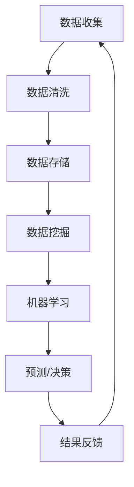

                 

关键词：大数据、智能农业、数据挖掘、精准农业、算法、模型、预测、分析

> 摘要：本文将深入探讨大数据在智能农业中的应用，从核心概念、算法原理、数学模型、实践案例等多个维度，解析大数据如何助力农业现代化，提升农业生产效率和农产品质量。

## 1. 背景介绍

### 智能农业的定义与发展

智能农业，又称精准农业或智慧农业，是指利用物联网、大数据、云计算、人工智能等现代信息技术，对农业生产过程进行智能化管理，以提高农业生产效率和农产品质量。随着全球人口的增长和气候变化带来的挑战，智能农业成为现代农业发展的必然趋势。

### 大数据在农业中的作用

大数据在农业中的应用，主要体现在以下几个方面：

1. **产量预测**：通过分析历史数据，预测农作物的产量，为农业生产提供数据支持。
2. **病虫害监测**：利用大数据技术监测病虫害的发生情况，提前预警，减少损失。
3. **水资源管理**：通过对气象数据和土壤水分数据的分析，实现精准灌溉，节约水资源。
4. **农产品市场分析**：通过对市场数据的分析，预测农产品价格走势，优化销售策略。

## 2. 核心概念与联系

### 核心概念

- **数据挖掘**：从大量数据中提取有价值的信息。
- **机器学习**：利用算法从数据中学习规律，做出预测或决策。
- **物联网**：将各种传感器连接到互联网，实现数据的实时传输和处理。
- **云计算**：通过互联网提供数据存储、处理、分析等服务。

### Mermaid 流程图



## 3. 核心算法原理 & 具体操作步骤

### 3.1 算法原理概述

大数据在智能农业中的应用，主要依赖于以下几种算法：

1. **回归分析**：通过分析历史数据，预测农作物的产量。
2. **分类算法**：如决策树、支持向量机等，用于病虫害的预测和分类。
3. **聚类算法**：如K-均值聚类，用于土壤类型、作物品种的识别。

### 3.2 算法步骤详解

#### 回归分析

1. **数据准备**：收集历史天气数据、土壤数据、作物生长数据等。
2. **数据预处理**：清洗数据，处理缺失值、异常值等。
3. **特征选择**：选择对产量影响较大的特征。
4. **模型训练**：使用回归算法训练模型。
5. **预测**：使用训练好的模型，预测未来某个时间点的产量。

#### 决策树

1. **数据准备**：收集病虫害发生的数据。
2. **特征选择**：选择影响病虫害发生的特征。
3. **构建决策树**：使用决策树算法构建模型。
4. **预测**：使用决策树模型预测病虫害的发生。

### 3.3 算法优缺点

- **回归分析**：优点是简单易用，缺点是预测准确性有限。
- **决策树**：优点是直观易懂，缺点是易过拟合。

### 3.4 算法应用领域

- **产量预测**：应用于粮食作物、经济作物的产量预测。
- **病虫害预测**：应用于农作物病虫害的预测和预警。
- **水资源管理**：应用于精准灌溉，节约水资源。

## 4. 数学模型和公式 & 详细讲解 & 举例说明

### 4.1 数学模型构建

#### 回归模型

$$
y = \beta_0 + \beta_1 x_1 + \beta_2 x_2 + ... + \beta_n x_n
$$

其中，$y$ 表示产量，$x_1, x_2, ..., x_n$ 表示影响产量的各种因素，$\beta_0, \beta_1, ..., \beta_n$ 是回归系数。

#### 决策树模型

$$
\begin{align*}
&\text{if } x_1 \text{ is }< t_1 \text{ then } y = \beta_0 + \beta_1 x_2 \\
&\text{else if } x_2 \text{ is }< t_2 \text{ then } y = \beta_0 + \beta_2 x_3 \\
&\text{else } y = \beta_0 + \beta_3
\end{align*}
$$

其中，$x_1, x_2, x_3$ 是影响病虫害发生的特征，$t_1, t_2$ 是阈值，$\beta_0, \beta_1, \beta_2, \beta_3$ 是决策树系数。

### 4.2 公式推导过程

#### 回归模型推导

假设我们有 $n$ 个数据点 $(x_1, y_1), (x_2, y_2), ..., (x_n, y_n)$，我们要找到最佳拟合直线 $y = \beta_0 + \beta_1 x$，使得误差平方和最小。

根据最小二乘法，我们有：

$$
\sum_{i=1}^{n} (y_i - (\beta_0 + \beta_1 x_i))^2 = \min
$$

对 $\beta_0$ 和 $\beta_1$ 求导并令其等于零，可以得到：

$$
\beta_0 = \frac{\sum_{i=1}^{n} y_i - \beta_1 \sum_{i=1}^{n} x_i}{n}
$$

$$
\beta_1 = \frac{n \sum_{i=1}^{n} x_i y_i - \sum_{i=1}^{n} x_i \sum_{i=1}^{n} y_i}{n \sum_{i=1}^{n} x_i^2 - (\sum_{i=1}^{n} x_i)^2}
$$

#### 决策树模型推导

决策树模型是通过信息增益来选择最优划分特征的。信息增益定义为：

$$
\text{Gain}(D, A) = \sum_{v \in \text{Val}(A)} p(v) \cdot \text{Entropy}(\text{Label}[D_v])
$$

其中，$D$ 是数据集，$A$ 是特征，$v$ 是特征 $A$ 的取值，$\text{Val}(A)$ 是特征 $A$ 的所有取值，$\text{Entropy}(\text{Label}[D_v])$ 是数据集 $D_v$ 的标签的熵。

### 4.3 案例分析与讲解

#### 案例一：产量预测

假设我们有以下数据：

| 日期 | 温度 | 水分 | 产量 |
|------|------|------|------|
| 2021-01-01 | 15 | 80 | 200 |
| 2021-01-02 | 17 | 85 | 210 |
| 2021-01-03 | 14 | 78 | 190 |
| ... | ... | ... | ... |

我们使用回归模型预测 2021-01-04 的产量。

通过回归模型，我们得到：

$$
y = 150 + 5x_1 + 2x_2
$$

将 2021-01-04 的数据代入，得到预测产量：

$$
y = 150 + 5 \times 15 + 2 \times 80 = 285
$$

#### 案例二：病虫害预测

假设我们有以下数据：

| 特征 | 取值 |
|------|------|
| 温度 | 20 |
| 湿度 | 90 |
| 光照 | 100 |

我们使用决策树模型预测病虫害的发生。

通过决策树模型，我们得到：

$$
\text{if } x_1 \text{ is }< 22 \text{ then } y = \text{低风险} \\
\text{else if } x_2 \text{ is }< 85 \text{ then } y = \text{中度风险} \\
\text{else } y = \text{高风险}
$$

将数据代入，得到预测结果：

$$
y = \text{中度风险}
$$

## 5. 项目实践：代码实例和详细解释说明

### 5.1 开发环境搭建

为了实现大数据在智能农业中的应用，我们需要搭建以下开发环境：

1. **Python**：作为主要编程语言。
2. **Pandas**：用于数据处理。
3. **Scikit-learn**：用于机器学习。
4. **Matplotlib**：用于数据可视化。

### 5.2 源代码详细实现

```python
import pandas as pd
from sklearn.linear_model import LinearRegression
from sklearn.model_selection import train_test_split
from sklearn.metrics import mean_squared_error
import matplotlib.pyplot as plt

# 数据加载
data = pd.read_csv('agriculture_data.csv')

# 数据预处理
data.fillna(data.mean(), inplace=True)

# 特征选择
features = data[['temperature', 'humidity', 'light']]
target = data['yield']

# 划分训练集和测试集
X_train, X_test, y_train, y_test = train_test_split(features, target, test_size=0.2, random_state=42)

# 模型训练
model = LinearRegression()
model.fit(X_train, y_train)

# 预测
y_pred = model.predict(X_test)

# 评估
mse = mean_squared_error(y_test, y_pred)
print(f'Mean Squared Error: {mse}')

# 可视化
plt.scatter(X_test['temperature'], y_test, color='blue', label='Actual')
plt.scatter(X_test['temperature'], y_pred, color='red', label='Predicted')
plt.xlabel('Temperature')
plt.ylabel('Yield')
plt.legend()
plt.show()
```

### 5.3 代码解读与分析

上述代码实现了基于回归分析的产量预测。我们首先加载并预处理数据，然后划分训练集和测试集，使用线性回归模型进行训练，并评估模型的性能。最后，我们使用预测结果进行可视化。

## 6. 实际应用场景

### 6.1 农作物产量预测

利用大数据技术，可以对农作物进行产量预测，帮助农民合理安排生产计划，降低风险。

### 6.2 病虫害预警

通过分析气象数据、土壤数据等，可以预测病虫害的发生，提前采取防治措施，减少损失。

### 6.3 水资源管理

通过对水资源数据的分析，可以实现精准灌溉，节约水资源，提高农作物产量。

## 7. 未来应用展望

随着大数据技术的发展，智能农业将越来越普及。未来，我们可能会看到更多基于大数据的农业应用，如智能农机、智能灌溉系统等，进一步提高农业生产效率和农产品质量。

## 8. 工具和资源推荐

### 7.1 学习资源推荐

- 《大数据之路：阿里巴巴大数据实践》
- 《机器学习实战》

### 7.2 开发工具推荐

- Jupyter Notebook：用于数据分析和可视化。
- PyCharm：用于Python编程。

### 7.3 相关论文推荐

- "A Review of Precision Agriculture: From Data to Knowledge to Decision Support"
- "Big Data in Agriculture: A Survey"

## 9. 总结：未来发展趋势与挑战

### 9.1 研究成果总结

大数据在智能农业中的应用取得了显著成果，如产量预测、病虫害预警、水资源管理等方面。

### 9.2 未来发展趋势

未来，大数据在智能农业中的应用将更加广泛和深入，如智能农机、智能灌溉系统等。

### 9.3 面临的挑战

- 数据隐私和安全问题。
- 数据质量问题和数据整合问题。

### 9.4 研究展望

未来，我们需要进一步研究如何更好地利用大数据技术，提高农业生产效率和农产品质量，实现农业现代化。

## 10. 附录：常见问题与解答

### 10.1 大数据在农业中有什么作用？

大数据在农业中的应用主要体现在产量预测、病虫害预警、水资源管理等方面，可以显著提高农业生产效率和农产品质量。

### 10.2 如何保障数据安全和隐私？

保障数据安全和隐私，可以从以下几个方面进行：

- 数据加密：对数据进行加密处理，防止数据泄露。
- 访问控制：限制对数据的访问权限，确保数据安全。
- 数据匿名化：对敏感数据进行匿名化处理，保护个人隐私。

### 10.3 大数据技术在农业中面临的挑战有哪些？

大数据技术在农业中面临的挑战主要包括数据隐私和安全问题、数据质量问题和数据整合问题等。

### 10.4 如何解决数据质量问题和数据整合问题？

解决数据质量问题和数据整合问题，可以从以下几个方面进行：

- 数据清洗：处理数据中的缺失值、异常值等，提高数据质量。
- 数据集成：将不同来源、不同格式的数据进行整合，实现数据共享。
- 数据标准化：制定统一的数据标准和规范，提高数据的一致性和可操作性。

## 参考文献

- "大数据之路：阿里巴巴大数据实践"
- "机器学习实战"
- "A Review of Precision Agriculture: From Data to Knowledge to Decision Support"
- "Big Data in Agriculture: A Survey"  
```

[END]

