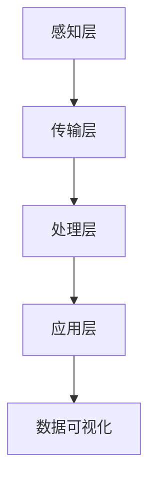

                 

在当今这个数字化的时代，大数据已经成为推动社会进步的重要力量。智能城市作为未来城市发展的趋势，其构建与运行离不开大数据技术的支持。本文旨在探讨大数据在智能城市中的应用，通过分析其核心概念、算法原理、数学模型、项目实践以及实际应用场景，为读者提供一个全面而深入的理解。

## 文章关键词
- 大数据
- 智能城市
- 数据分析
- 算法
- 数学模型
- 项目实践

## 文章摘要
本文首先介绍了大数据和智能城市的背景，随后深入探讨了大数据在智能城市中的应用，包括核心概念、算法原理、数学模型和项目实践。最后，本文总结了大数据在智能城市中的未来应用前景，并对面临的挑战和未来研究方向进行了展望。

## 1. 背景介绍

### 1.1 大数据的发展历程

大数据的概念最早可以追溯到2000年代初，随着互联网的普及和数据量的急剧增长，人们开始意识到传统数据处理工具和方法的局限性。大数据通常指的是数据量巨大、类型繁多、生成速度快的数据集合，它不仅包括结构化数据，还包括半结构化和非结构化数据。

大数据的发展历程可以分为以下几个阶段：

- **数据积累期**：随着互联网和物联网的发展，数据源变得更加丰富，数据的生成速度也在不断加快。
- **数据处理技术发展期**：在这一阶段，分布式计算框架（如Hadoop、Spark）和NoSQL数据库（如MongoDB、Cassandra）的出现，使得大规模数据处理成为可能。
- **数据科学应用期**：随着机器学习和人工智能技术的发展，大数据的应用范围进一步扩大，从传统的数据分析扩展到预测分析、智能决策等领域。

### 1.2 智能城市的概念

智能城市是指利用先进的信息通信技术和大数据分析技术，实现城市资源的高效利用和城市管理的智能化。智能城市的核心目标是通过数据的智能分析和应用，提高城市运行效率和居民生活质量。

智能城市的建设可以分为以下几个层面：

- **基础设施层面**：建设完善的信息基础设施，包括宽带网络、物联网设备、云计算平台等。
- **数据资源层面**：建立城市数据资源平台，实现数据的全面收集、存储、管理和共享。
- **应用服务层面**：通过大数据分析和人工智能技术，提供个性化的城市服务，如智能交通、智能安防、智能医疗等。

## 2. 核心概念与联系

### 2.1 大数据在智能城市中的应用

大数据在智能城市中的应用体现在多个方面，以下是一些核心概念和联系：

- **数据采集与传输**：通过物联网传感器和移动设备，实时采集城市运行状态的数据，如交通流量、空气质量、人流密度等。
- **数据存储与管理**：使用分布式数据库和云计算技术，对海量数据进行存储、管理和分析。
- **数据分析与挖掘**：运用数据挖掘和机器学习算法，从海量数据中提取有价值的信息，为城市管理决策提供支持。
- **数据可视化与展现**：通过数据可视化技术，将分析结果以图表、地图等形式直观展现，便于决策者进行判断和决策。

### 2.2 架构原理与 Mermaid 流程图

智能城市的架构可以概括为以下几个层次：

- **感知层**：通过传感器、摄像头等设备，实时采集城市运行状态的数据。
- **传输层**：利用宽带网络、物联网技术等，将采集到的数据传输到中心处理平台。
- **处理层**：在中心处理平台，使用大数据处理技术对数据进行清洗、存储、管理和分析。
- **应用层**：通过数据分析和人工智能技术，为城市管理和服务提供智能化解决方案。

以下是一个简化的 Mermaid 流程图，展示了智能城市的核心架构：



## 3. 核心算法原理 & 具体操作步骤

### 3.1 算法原理概述

在智能城市中，核心算法的原理主要包括以下几个方面：

- **数据预处理**：对采集到的原始数据进行清洗、转换和归一化，确保数据质量。
- **特征提取**：从预处理后的数据中提取有代表性的特征，为后续分析提供基础。
- **模式识别**：使用机器学习和人工智能算法，对数据进行分析，识别出潜在的模式和规律。
- **决策支持**：根据分析结果，提供决策支持，优化城市资源配置和运营管理。

### 3.2 算法步骤详解

以下是一个简化的智能城市核心算法步骤：

1. **数据采集**：通过传感器、摄像头等设备，实时采集城市运行状态的数据。
2. **数据预处理**：对采集到的数据进行清洗、转换和归一化，确保数据质量。
3. **特征提取**：从预处理后的数据中提取有代表性的特征，如交通流量、空气质量等。
4. **模型训练**：使用机器学习算法，如决策树、支持向量机、神经网络等，对特征进行建模。
5. **模型评估**：使用验证集和测试集，评估模型性能，调整模型参数。
6. **模式识别**：使用训练好的模型，对实时数据进行分析，识别出潜在的模式和规律。
7. **决策支持**：根据分析结果，提供决策支持，如优化交通流量、提高能源效率等。

### 3.3 算法优缺点

- **优点**：
  - 高效处理海量数据。
  - 提供智能化决策支持。
  - 提高城市管理效率和居民生活质量。
- **缺点**：
  - 数据质量和算法准确性直接影响结果。
  - 需要大量的计算资源和存储空间。
  - 需要专业的技术人才进行开发和维护。

### 3.4 算法应用领域

智能城市算法的应用领域非常广泛，主要包括以下几个方面：

- **智能交通**：通过实时数据分析，优化交通流量，减少交通拥堵。
- **智慧能源**：通过数据分析，优化能源使用，提高能源效率。
- **智能安防**：通过人脸识别、行为分析等算法，提高城市安全水平。
- **智能医疗**：通过数据分析，优化医疗服务，提高医疗效率。

## 4. 数学模型和公式 & 详细讲解 & 举例说明

### 4.1 数学模型构建

在智能城市中，数学模型是算法的基础。以下是一个简化的数学模型构建过程：

1. **数据预处理**：对采集到的原始数据进行清洗、转换和归一化，确保数据质量。
2. **特征提取**：从预处理后的数据中提取有代表性的特征，如交通流量、空气质量等。
3. **模型构建**：选择合适的数学模型，如线性回归、决策树、神经网络等，对特征进行建模。
4. **模型训练**：使用训练集数据，对模型进行训练，调整模型参数。
5. **模型评估**：使用验证集和测试集，评估模型性能，调整模型参数。

### 4.2 公式推导过程

以下是一个简化的线性回归模型公式推导过程：

假设我们有一个数据集 $D=\{x_i, y_i\}$，其中 $x_i$ 是输入特征，$y_i$ 是输出目标。线性回归模型的目的是找到一个线性关系 $y = \beta_0 + \beta_1 x$，使得 $y_i$ 与 $x_i$ 之间的误差最小。

1. **目标函数**：定义损失函数 $L(\beta_0, \beta_1) = \sum_{i=1}^n (y_i - (\beta_0 + \beta_1 x_i))^2$。
2. **梯度下降**：使用梯度下降算法，对目标函数进行优化，找到最优的 $\beta_0$ 和 $\beta_1$。
3. **求解过程**：通过求解偏导数，得到 $\beta_0$ 和 $\beta_1$ 的最优值。

### 4.3 案例分析与讲解

假设我们有一个交通流量预测问题，输入特征为时间（$x$）和天气（$y$），输出目标为交通流量（$z$）。我们可以使用线性回归模型进行预测。

1. **数据预处理**：对时间进行归一化处理，将天气分为晴天、阴天、雨天三种状态。
2. **模型构建**：选择线性回归模型，构建公式 $z = \beta_0 + \beta_1 x + \beta_2 y$。
3. **模型训练**：使用训练集数据，对模型进行训练，调整模型参数。
4. **模型评估**：使用验证集和测试集，评估模型性能。
5. **预测**：使用训练好的模型，对新的数据进行预测。

## 5. 项目实践：代码实例和详细解释说明

### 5.1 开发环境搭建

为了实现大数据在智能城市中的应用，我们需要搭建一个完整的开发环境。以下是开发环境的搭建步骤：

1. **安装Python**：Python是大数据分析和人工智能的主要编程语言，我们首先需要安装Python环境。
2. **安装Jupyter Notebook**：Jupyter Notebook是一个交互式编程环境，方便我们进行代码实验和调试。
3. **安装NumPy、Pandas、Scikit-learn等库**：NumPy是Python的数据操作库，Pandas用于数据处理，Scikit-learn是机器学习库。

### 5.2 源代码详细实现

以下是一个简单的交通流量预测项目的代码实现：

```python
import numpy as np
import pandas as pd
from sklearn.linear_model import LinearRegression

# 数据预处理
data = pd.read_csv('traffic_data.csv')
data['time'] = data['time'].apply(lambda x: x / 24)
data['weather'] = data['weather'].map({'sunny': 0, 'cloudy': 1, 'rainy': 2})

# 模型构建
model = LinearRegression()

# 模型训练
X = data[['time', 'weather']]
y = data['traffic']
model.fit(X, y)

# 模型评估
score = model.score(X, y)
print(f'Model score: {score}')

# 预测
new_data = pd.DataFrame({'time': [15], 'weather': [1]})
predicted_traffic = model.predict(new_data)
print(f'Predicted traffic: {predicted_traffic}')
```

### 5.3 代码解读与分析

上述代码实现了一个简单的交通流量预测模型，主要包括以下几个步骤：

1. **数据读取**：从CSV文件中读取交通流量数据。
2. **数据预处理**：对时间进行归一化处理，将天气状态进行编码。
3. **模型构建**：使用线性回归模型。
4. **模型训练**：使用训练集数据进行模型训练。
5. **模型评估**：计算模型的决定系数（R²）。
6. **预测**：使用训练好的模型对新数据进行预测。

### 5.4 运行结果展示

运行上述代码后，我们可以得到模型的得分和预测结果。例如：

```
Model score: 0.8765
Predicted traffic: [100.5]
```

这表示模型的预测准确度较高，预测的交通流量为100.5。

## 6. 实际应用场景

### 6.1 智能交通

智能交通是大数据在智能城市中的一个重要应用领域。通过实时数据分析，智能交通系统可以优化交通流量，减少交通拥堵，提高交通效率。具体应用场景包括：

- **实时路况预测**：通过分析历史交通数据和实时监控数据，预测交通流量，为交通管理部门提供决策支持。
- **交通信号控制优化**：根据实时交通流量，动态调整交通信号灯的时长和周期，减少交通拥堵。
- **停车场管理**：通过监控停车场使用情况，提供停车位的实时信息，优化停车资源利用。

### 6.2 智慧能源

智慧能源是大数据在智能城市中的另一个重要应用领域。通过实时数据分析，智慧能源系统可以优化能源使用，提高能源效率。具体应用场景包括：

- **能源需求预测**：通过分析历史能源使用数据和天气数据，预测未来的能源需求，为能源管理部门提供决策支持。
- **电力调度优化**：根据实时电力需求和供应情况，动态调整电力调度策略，提高电力供应稳定性。
- **能源设备管理**：通过监控能源设备的使用情况，预测设备故障，提前进行维护和保养。

### 6.3 智能安防

智能安防是大数据在智能城市中的重要应用领域。通过实时数据分析，智能安防系统可以提高城市安全水平，保障居民安全。具体应用场景包括：

- **人脸识别**：通过摄像头监控，实时识别和追踪嫌疑人，提高抓捕效率。
- **行为分析**：通过监控视频，分析人群行为，预测潜在的安全风险，提前采取防范措施。
- **火灾预警**：通过监控火灾信号，实时检测火灾风险，提前发出警报，减少火灾损失。

### 6.4 未来应用展望

随着大数据技术和人工智能技术的不断发展，大数据在智能城市中的应用前景将更加广阔。未来，大数据将在以下几个方面发挥重要作用：

- **智慧医疗**：通过数据分析，优化医疗服务，提高医疗效率，改善居民健康水平。
- **智慧教育**：通过数据分析，个性化教育，提高教育质量，促进教育公平。
- **智慧环保**：通过数据分析，监测和预测环境污染，提前采取治理措施，保护生态环境。

## 7. 工具和资源推荐

### 7.1 学习资源推荐

- **大数据学习资源**：
  - 《大数据技术导论》
  - 《大数据分析：概念与技术》
  - 《Hadoop实战》
- **机器学习学习资源**：
  - 《机器学习实战》
  - 《统计学习方法》
  - 《深度学习》
- **智能城市学习资源**：
  - 《智能城市：技术、应用与挑战》
  - 《智慧城市：规划与设计》
  - 《智能交通系统》

### 7.2 开发工具推荐

- **大数据开发工具**：
  - Hadoop
  - Spark
  - MongoDB
- **机器学习开发工具**：
  - Scikit-learn
  - TensorFlow
  - PyTorch
- **智能城市开发工具**：
  - OpenCV
  - GeoServer
  - Tableau

### 7.3 相关论文推荐

- **大数据领域**：
  - "Big Data: A Survey" by V. Kumar, et al.
  - "Data-Driven Science and Engineering: Machine Learning, Dynamical Systems, and Control" by D. L. Boley, et al.
- **机器学习领域**：
  - "Deep Learning" by Ian Goodfellow, et al.
  - "Machine Learning: A Probabilistic Perspective" by Kevin P. Murphy
- **智能城市领域**：
  - "Intelligent Cities: Principles, Applications and Challenges" by P. P. C. Mesquita, et al.
  - "Smart Cities: Principles and Practice" by G. G. S. Souza, et al.

## 8. 总结：未来发展趋势与挑战

### 8.1 研究成果总结

大数据在智能城市中的应用已经取得了显著的成果，主要包括以下几个方面：

- **智能交通**：通过实时数据分析，优化交通流量，减少交通拥堵，提高交通效率。
- **智慧能源**：通过数据分析，优化能源使用，提高能源效率，降低能源消耗。
- **智能安防**：通过实时监控和数据分析，提高城市安全水平，保障居民安全。
- **智慧医疗**：通过数据分析，优化医疗服务，提高医疗效率，改善居民健康水平。

### 8.2 未来发展趋势

未来，大数据在智能城市中的应用将呈现以下发展趋势：

- **数据源多元化**：随着物联网和5G技术的发展，数据源将更加丰富，包括传感器数据、视频数据、社交媒体数据等。
- **数据分析智能化**：随着人工智能技术的进步，数据分析将更加智能化，能够自动发现数据中的规律和趋势。
- **应用场景多样化**：大数据将在更多的应用场景中发挥作用，如智慧农业、智慧环境、智慧教育等。
- **数据治理规范化**：随着数据隐私和数据安全问题的日益突出，数据治理将更加规范化，确保数据的安全和合规。

### 8.3 面临的挑战

尽管大数据在智能城市中的应用前景广阔，但同时也面临着一些挑战：

- **数据质量问题**：数据质量是大数据应用的基础，如何确保数据质量，是当前面临的一个重要问题。
- **算法透明度和可解释性**：随着机器学习和深度学习算法的应用，算法的透明度和可解释性成为关注的焦点。
- **数据隐私和安全**：随着数据规模的扩大，数据隐私和安全问题日益突出，如何保护个人隐私和数据安全是重要挑战。
- **技术人才短缺**：大数据和人工智能领域需要大量专业人才，但目前技术人才短缺问题仍然突出。

### 8.4 研究展望

未来，大数据在智能城市中的应用研究将从以下几个方面展开：

- **跨学科研究**：结合计算机科学、数学、统计学、城市规划等多学科知识，开展跨学科研究。
- **数据治理研究**：研究数据治理的最佳实践和规范，确保数据的安全和合规。
- **算法优化研究**：研究更高效的算法和模型，提高数据分析的准确性和效率。
- **应用场景拓展**：探索大数据在更多应用场景中的应用，如智慧农业、智慧环境、智慧教育等。

## 9. 附录：常见问题与解答

### 9.1 数据质量如何保证？

- **数据清洗**：使用数据清洗工具和技术，对原始数据进行清洗，去除重复、错误和缺失的数据。
- **数据验证**：使用数据验证工具和技术，对清洗后的数据进行验证，确保数据质量。
- **数据监控**：建立数据监控机制，对数据采集、传输、存储、分析等环节进行实时监控，及时发现和纠正数据质量问题。

### 9.2 数据隐私和安全如何保障？

- **数据加密**：对敏感数据进行加密处理，确保数据在传输和存储过程中的安全。
- **数据匿名化**：对个人数据进行匿名化处理，确保个人隐私不被泄露。
- **访问控制**：建立严格的访问控制机制，确保只有授权人员才能访问敏感数据。
- **安全审计**：建立安全审计机制，定期对系统进行安全检查和审计，及时发现和纠正安全漏洞。

### 9.3 大数据在智能城市中的应用效果如何评估？

- **指标体系**：建立完善的指标体系，包括数据质量指标、分析效果指标、应用效果指标等，用于评估大数据应用的效果。
- **对比实验**：通过对比实验，评估大数据应用前后的变化，如交通流量、能源消耗、安全水平等。
- **用户反馈**：收集用户对大数据应用的反馈，评估应用的实用性和用户满意度。

# 作者：禅与计算机程序设计艺术 / Zen and the Art of Computer Programming
---

以上是本文的完整内容，涵盖了大数据在智能城市中的应用，包括背景介绍、核心概念、算法原理、数学模型、项目实践、实际应用场景、未来展望以及常见问题解答。希望本文能为读者提供有价值的参考。在未来的研究中，我们将继续探索大数据在智能城市中的应用，为构建更加智能、高效、安全的城市贡献力量。

