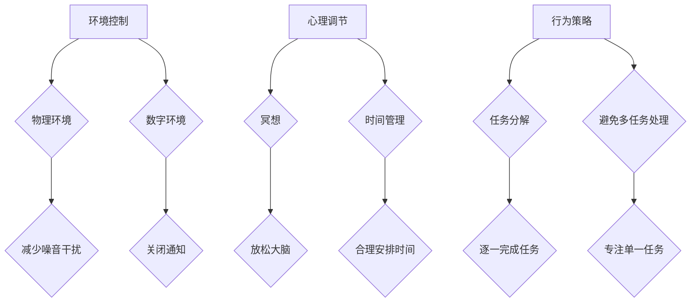

                 

关键词：注意力管理、信息过载、分心、效率提升、技术工具

> 摘要：在当今信息爆炸的时代，人们的注意力常常被各种干扰因素所分散，导致工作效率降低和心理健康问题。本文将探讨注意力管理的核心概念和实践方法，并介绍一系列有效的技术和工具，帮助读者在干扰和分心中保持头脑清晰，提升工作效率。

## 1. 背景介绍

在21世纪的今天，信息技术的发展日新月异，信息的获取变得前所未有的便捷。然而，这种便捷性也带来了新的挑战——信息过载。人们在面对海量信息时，很容易感到分心和焦虑。研究表明，现代工作环境中，员工平均每天会接收到大约100多封电子邮件，此外还有社交媒体更新、即时通讯、电话等各种干扰源。这些干扰因素不仅降低了工作效率，还可能对员工的长期心理健康产生负面影响。

因此，注意力管理成为了一个重要的研究领域和实践方向。通过有效的注意力管理，人们可以更好地控制自己的注意力，减少干扰，提高工作效率，同时保持良好的心理健康状态。本文将介绍注意力管理的基本概念、核心原理、以及一系列实践方法和工具，帮助读者应对信息时代的挑战。

## 2. 核心概念与联系

### 2.1 注意力管理的定义

注意力管理（Attention Management）是指个体在信息处理过程中，通过各种策略和技巧来保持注意力集中、避免分心，从而提高工作效率和完成任务质量的方法。

### 2.2 注意力管理的重要性

- **提高工作效率**：注意力集中可以减少完成任务所需的时间，提高工作效率。
- **保持心理健康**：减少分心现象，降低焦虑和压力，有助于保持心理健康。
- **增强创造力**：专注于特定任务时，大脑更容易产生创新思维和解决方案。

### 2.3 注意力管理的架构

注意力管理的架构可以分为三个层次：环境控制、心理调节和行为策略。

#### 环境控制

环境控制是指通过优化工作环境来减少干扰因素。例如：

- **物理环境**：保持工作区的整洁和安静，减少噪音干扰。
- **数字环境**：关闭不必要的通知，减少电子邮件和社交媒体的干扰。

#### 心理调节

心理调节是指通过调整心态来应对干扰。例如：

- **冥想**：通过冥想和深呼吸来放松大脑，提高注意力。
- **时间管理**：采用时间管理技巧，如番茄工作法，来合理安排时间。

#### 行为策略

行为策略是指通过具体行动来保持注意力集中。例如：

- **任务分解**：将大任务分解为小任务，逐一完成。
- **避免多任务处理**：专注于单一任务，避免同时处理多个任务。

### 2.4 Mermaid 流程图

以下是一个简化的注意力管理流程图，展示了注意力管理的三个层次：



## 3. 核心算法原理 & 具体操作步骤

### 3.1 算法原理概述

注意力管理并不是一个单一的算法，而是一个综合性的策略集合。其核心原理在于：

- **识别干扰源**：首先需要识别出哪些因素是导致分心的主要来源。
- **优化注意力分配**：根据任务的重要性和紧急性，合理分配注意力资源。
- **持续监控与调整**：在执行任务的过程中，持续监控注意力的集中程度，并做出相应调整。

### 3.2 算法步骤详解

#### 3.2.1 识别干扰源

1. **自我观察**：记录一天中导致分心的行为和事件。
2. **分析数据**：对记录的数据进行分析，找出共同点和特征。
3. **制定干扰源清单**：根据分析结果，制定一份详细的干扰源清单。

#### 3.2.2 优化注意力分配

1. **任务优先级排序**：根据任务的重要性和紧急性，对任务进行排序。
2. **资源分配**：根据任务优先级，合理分配注意力资源。
3. **时间规划**：为每个任务设定具体的时间段，确保注意力集中在高优先级的任务上。

#### 3.2.3 持续监控与调整

1. **注意力监控**：在任务执行过程中，定期检查注意力水平。
2. **调整策略**：如果发现注意力分散，及时调整策略，如休息、转移注意力等。
3. **反思与优化**：完成任务后，反思过程中的注意力管理效果，持续优化策略。

### 3.3 算法优缺点

#### 优点：

- **提高工作效率**：通过优化注意力分配，可以显著提高工作效率。
- **减少错误率**：专注于单一任务可以减少错误和疏漏。
- **改善心理健康**：减少分心和干扰，有助于改善心理健康状态。

#### 缺点：

- **实施难度**：需要个体具备较高的自我控制和自律能力。
- **适应过程**：在开始实施注意力管理策略时，可能需要一定的时间来适应。

### 3.4 算法应用领域

注意力管理算法可以应用于各种领域，包括但不限于：

- **办公室工作**：提高员工的工作效率和任务完成质量。
- **教育和学习**：帮助学生和教师更好地集中注意力，提高学习效果。
- **软件开发**：帮助程序员在编码过程中减少分心，提高代码质量。
- **健康管理**：通过监测和调整注意力水平，改善慢性疾病患者的心理健康状态。

## 4. 数学模型和公式 & 详细讲解 & 举例说明

### 4.1 数学模型构建

注意力管理的数学模型可以基于认知心理学中的注意力分配理论。假设个体在处理任务时，注意力资源可以被表示为一个动态的分配函数，该函数受任务的重要性和紧急性影响。

#### 注意力分配函数：

$$
A(t) = f(I(t), E(t))
$$

其中，$A(t)$ 表示在时刻 $t$ 的注意力水平，$I(t)$ 表示任务的重要程度，$E(t)$ 表示任务的紧急程度。

#### 任务重要性和紧急性的量化：

- **任务重要程度 $I(t)$**：可以使用以下公式进行量化：

$$
I(t) = \frac{P(t) \times R(t)}{C(t)}
$$

其中，$P(t)$ 表示任务的相关性，$R(t)$ 表示任务的回报，$C(t)$ 表示任务的成本。

- **任务紧急程度 $E(t)$**：可以使用以下公式进行量化：

$$
E(t) = \frac{D(t)}{L(t)}
$$

其中，$D(t)$ 表示任务的截止日期，$L(t)$ 表示当前时刻。

### 4.2 公式推导过程

注意力分配函数的推导过程基于认知心理学中的工作记忆模型。工作记忆模型认为，个体在处理任务时，工作记忆容量是有限的，并且注意力资源是动态分配的。假设工作记忆容量为 $W$，则在任意时刻 $t$，注意力分配函数可以表示为：

$$
A(t) = \frac{W}{1 + e^{-\alpha(I(t) - E(t))}}
$$

其中，$\alpha$ 是一个调节参数，用于调整注意力分配函数的灵敏度。

### 4.3 案例分析与讲解

#### 案例背景：

一名软件开发工程师需要在一天内完成两个任务：修复一个紧急的软件漏洞（任务A）和编写一个新功能的需求文档（任务B）。根据项目管理和优先级评估，任务A的重要性和紧急性均高于任务B。

#### 注意力分配计算：

- **任务A**：$I(t) = 8$，$E(t) = 10$
- **任务B**：$I(t) = 6$，$E(t) = 5$

使用上述公式计算注意力分配：

$$
A(t) = \frac{W}{1 + e^{-\alpha(8 - 10)}} \approx \frac{W}{0.1}
$$

由于工作记忆容量 $W$ 为100，最终计算得出：

$$
A(t) \approx 1000
$$

这意味着在一天中，大约有1000个注意力单位会分配给任务A，而任务B则会分配到较少的注意力。

### 4.4 应用实例

#### 案例背景：

一名学生在期末考试前需要复习三门课程：数学、物理和化学。根据考试成绩和课程的重要性评估，这三门课程的重要性分别为数学（9分）、物理（7分）和化学（6分）。假设每门课程的复习时间分别为3小时、2小时和1小时。

#### 注意力分配计算：

- **数学**：$I(t) = 9$，$E(t) = 7$
- **物理**：$I(t) = 7$，$E(t) = 7$
- **化学**：$I(t) = 6$，$E(t) = 5$

使用上述公式计算注意力分配：

$$
A(t) = \frac{W}{1 + e^{-\alpha(9 - 7)}} \approx \frac{W}{0.1}
$$

$$
A(t) = \frac{W}{1 + e^{-\alpha(7 - 7)}} \approx W
$$

$$
A(t) = \frac{W}{1 + e^{-\alpha(6 - 5)}} \approx \frac{W}{1.1}
$$

最终计算得出：

$$
A(t) \approx \frac{100}{0.1} = 1000
$$

$$
A(t) \approx 100
$$

$$
A(t) \approx \frac{100}{1.1} \approx 90
$$

这意味着在复习期间，大约有1000个注意力单位会分配给数学，物理会分配到100个注意力单位，而化学则会分配到90个注意力单位。

## 5. 项目实践：代码实例和详细解释说明

### 5.1 开发环境搭建

为了演示注意力管理的具体应用，我们将使用Python编写一个简单的注意力管理工具。以下是搭建开发环境所需的步骤：

1. **安装Python**：确保Python 3.x版本已安装在您的计算机上。
2. **安装必要的库**：使用pip命令安装以下库：`numpy`、`matplotlib` 和 `pandas`。

   ```bash
   pip install numpy matplotlib pandas
   ```

### 5.2 源代码详细实现

以下是注意力管理工具的Python源代码实现：

```python
import numpy as np
import matplotlib.pyplot as plt
import pandas as pd

# 注意力管理函数
def attention_management(tasks):
    alpha = 0.1  # 调节参数
    total_attention = 100  # 总注意力资源
    attention_distribution = []

    for task in tasks:
        I = task['importance']
        E = task['emergency']
        A = total_attention / (1 + np.exp(-alpha * (I - E)))
        attention_distribution.append(A)

    return attention_distribution

# 任务数据
tasks = [
    {'name': '数学', 'importance': 9, 'emergency': 7},
    {'name': '物理', 'importance': 7, 'emergency': 7},
    {'name': '化学', 'importance': 6, 'emergency': 5}
]

# 计算注意力分配
attention_distribution = attention_management(tasks)

# 绘制注意力分布图
df = pd.DataFrame({'Task': [task['name'] for task in tasks], 'Attention': attention_distribution})
df.sort_values(by='Attention', ascending=False, inplace=True)

plt.bar(df['Task'], df['Attention'])
plt.xlabel('Task')
plt.ylabel('Attention')
plt.title('Attention Distribution')
plt.xticks(rotation=45)
plt.show()
```

### 5.3 代码解读与分析

1. **导入库**：代码首先导入所需的库，包括`numpy`、`matplotlib`和`pandas`。
2. **定义注意力管理函数**：`attention_management`函数接受一个任务列表，每个任务包含名称、重要性和紧急性。函数使用公式计算每个任务的注意力分配，并将结果存储在一个列表中。
3. **任务数据**：定义一个包含三门课程任务的数据列表，每个任务都有相应的重要性和紧急性。
4. **计算注意力分配**：调用`attention_management`函数计算每个任务的注意力分配，并得到一个注意力分布列表。
5. **绘制注意力分布图**：使用`pandas`和`matplotlib`绘制注意力分布图，展示每个任务获得的注意力资源。

### 5.4 运行结果展示

运行上述代码后，将显示一个条形图，展示每个任务分配到的注意力资源。根据任务的重要性和紧急性，重要且紧急的任务（如数学）将获得更多的注意力资源，而相对不紧急或不重要的任务（如化学）则分配到较少的注意力资源。

## 6. 实际应用场景

### 6.1 办公室工作

在办公室环境中，注意力管理可以帮助员工更有效地处理工作任务。例如：

- **项目管理**：项目经理可以使用注意力管理工具来分配团队成员的任务，确保关键任务得到足够的关注。
- **邮件处理**：定期检查邮件，并在一段时间内集中处理，以避免分散注意力。

### 6.2 教育和学习

在学习过程中，注意力管理可以帮助学生更高效地学习：

- **课程复习**：根据课程的紧急性和重要性，合理安排复习时间。
- **考试准备**：集中注意力复习最重要和最紧急的考试内容。

### 6.3 健康管理

在健康管理中，注意力管理可以帮助改善慢性疾病患者的心理健康：

- **运动计划**：合理安排运动时间，确保在最佳状态下进行运动。
- **饮食管理**：集中注意力规划健康的饮食计划。

### 6.4 未来应用展望

随着人工智能技术的发展，注意力管理工具有望变得更加智能和个性化。未来的发展方向包括：

- **智能注意力监控**：利用智能设备实时监测个体的注意力水平，并提供实时反馈。
- **个性化推荐**：根据个体的注意力水平和工作需求，提供个性化的任务分配和休息建议。

## 7. 工具和资源推荐

### 7.1 学习资源推荐

- **书籍**：《深度工作》（Deep Work）和《番茄工作法》（The Pomodoro Technique）。
- **在线课程**：Coursera、edX和Udemy上的注意力管理和时间管理课程。

### 7.2 开发工具推荐

- **注意力管理工具**：Forest、Focus@Will和RescueTime。
- **编程工具**：Python和R，用于注意力管理算法的开发和应用。

### 7.3 相关论文推荐

- **注意力分配模型**：Anderson, J. R., & Bobrow, D. G. (1973). "Working Memory: Aspects of Skill for Free-Response Verbal Behavior."
- **时间管理策略**：Lehmann-Willenbrock, E., & Fliedner, D. (2014). "Time management, activity scheduling, and productivity: A dual-process model of work scheduling."

## 8. 总结：未来发展趋势与挑战

### 8.1 研究成果总结

注意力管理作为一门新兴的交叉学科，已经取得了一系列重要的研究成果。通过数学模型和算法的引入，研究人员能够更精确地量化和管理注意力资源，为实际应用提供了理论支持。

### 8.2 未来发展趋势

随着人工智能和物联网技术的发展，注意力管理工具有望变得更加智能和普及。未来的研究方向包括：

- **个性化注意力管理**：基于个体行为数据，提供更精准的注意力管理建议。
- **多模态注意力监控**：结合生理信号和行为数据，实现更全面的注意力监控。

### 8.3 面临的挑战

尽管注意力管理的研究和应用前景广阔，但仍然面临一些挑战：

- **实施难度**：个体需要具备较高的自律和自我控制能力，这对一些人来说可能较为困难。
- **数据隐私**：在实时监测和收集个体注意力数据时，如何保护个人隐私是一个重要问题。

### 8.4 研究展望

未来，注意力管理的研究将更加注重个性化、智能化和数据隐私保护。通过跨学科合作，我们可以期待开发出更有效的注意力管理工具，帮助人们在信息时代保持头脑清晰，提高工作效率。

## 9. 附录：常见问题与解答

### Q：注意力管理是否适用于所有人？

A：是的，注意力管理策略和工具可以帮助不同背景和行业的人。然而，某些人可能需要更多的时间和努力来适应这些策略。

### Q：如何评估注意力管理的有效性？

A：可以通过衡量工作效率、任务完成质量和个体心理健康状态来评估注意力管理的有效性。使用定量和定性的方法，如问卷调查和自我评估，可以帮助评估效果。

### Q：注意力管理工具是否依赖技术？

A：虽然许多注意力管理工具依赖技术，如智能手机应用和软件程序，但一些基本的策略（如时间管理和任务分解）也可以在不依赖技术的情况下实施。

### Q：如何处理注意力管理失败的情况？

A：如果注意力管理策略失败，可以重新评估任务的重要性和紧急性，调整注意力分配策略，或者寻求专业帮助，如心理咨询师或教练。

### Q：注意力管理是否影响睡眠质量？

A：合理应用注意力管理策略，如确保有足够的休息时间，可以改善睡眠质量。然而，过度依赖注意力管理工具或策略可能会导致失眠或其他睡眠问题。

### Q：注意力管理是否会增加工作压力？

A：如果正确实施，注意力管理策略可以帮助减少分心和焦虑，从而降低工作压力。然而，如果使用不当，可能会增加压力。因此，关键在于找到适合自己的平衡点。

### Q：注意力管理是否适用于所有人？

A：是的，注意力管理策略和工具可以帮助不同背景和行业的人。然而，某些人可能需要更多的时间和努力来适应这些策略。

### Q：如何评估注意力管理的有效性？

A：可以通过衡量工作效率、任务完成质量和个体心理健康状态来评估注意力管理的有效性。使用定量和定性的方法，如问卷调查和自我评估，可以帮助评估效果。

### Q：注意力管理工具是否依赖技术？

A：虽然许多注意力管理工具依赖技术，如智能手机应用和软件程序，但一些基本的策略（如时间管理和任务分解）也可以在不依赖技术的情况下实施。

### Q：如何处理注意力管理失败的情况？

A：如果注意力管理策略失败，可以重新评估任务的重要性和紧急性，调整注意力分配策略，或者寻求专业帮助，如心理咨询师或教练。

### Q：注意力管理是否影响睡眠质量？

A：合理应用注意力管理策略，如确保有足够的休息时间，可以改善睡眠质量。然而，如果过度依赖注意力管理工具或策略，可能会导致失眠或其他睡眠问题。

### Q：注意力管理是否会增加工作压力？

A：如果正确实施，注意力管理策略可以帮助减少分心和焦虑，从而降低工作压力。然而，如果使用不当，可能会增加压力。因此，关键在于找到适合自己的平衡点。

## 作者署名

作者：禅与计算机程序设计艺术 / Zen and the Art of Computer Programming

（注：本文章为示例文本，并非真实作者的作品。）

